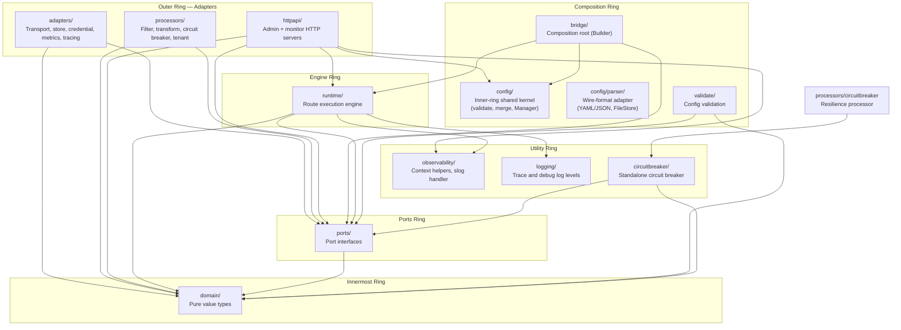

# GoBridge Architecture

## Contents

This page carries the system overview and the layering rules every component is
placed by. The rest of the architecture is on four topic pages; the section
numbers are stable, so a `§n` reference stays valid wherever the section lives.

| Sections | Page |
|---|---|
| §1 System Overview, §2 Hexagonal Architecture Layers | this page |
| §3 Core Concepts, §4 Message Flow, §5 Delivery Modes, §6 Processor Chain | [Message flow, delivery modes and processors](docs/internals/architecture-message-flow.md) |
| §7 Store Abstractions, §8 Configuration Model, §9 Composition Root | [Store abstractions, configuration model and composition root](docs/internals/architecture-stores-and-configuration.md) |
| §10 HTTP API, §11 Observability, §12 Credentials, §13 Module Layout | [HTTP API, observability, credentials and module layout](docs/internals/architecture-operational-surfaces.md) |
| §14 Headers, §15 Error Classification, §16 Clustered Deployment | [Headers, error classification and clustered deployment](docs/internals/architecture-contracts-and-clustering.md) |


## 1. System Overview

GoBridge is a message-bridge framework written in Go. It routes messages between heterogeneous transports -- MQTT, AWS SQS, Azure Service Bus, RabbitMQ (AMQP 0-9-1), AMQP 1.0 brokers (Artemis, Solace, Qpid) -- with pluggable middleware processing, durable outbox delivery, dead-letter queue management, and full observability.

The core module (`domain/`, `ports/`, `runtime/`, `bridge/`, `config/`, `config/parser/`) lives behind a strict Clean / Hexagonal layering. The inner ring (`domain/`, `ports/`, `runtime/`, `bridge/`, `config/`) has zero external dependencies; the wire-format adapter `config/parser/` is the only Layer-2 location that ships `gopkg.in/yaml.v3` and `github.com/go-viper/mapstructure/v2`. Transport, store, and processor adapters live in separate Go modules within a `go.work` workspace so consumers only import what they need.

Key design goals:

- **Transport-agnostic message routing** between any combination of supported transports.
- **Pluggable middleware** for filtering, transformation, circuit-breaking, and multi-tenant validation.
- **Durable delivery** via an outbox pattern with fencing-token-based lease ownership.
- **Full observability** with structured logging, distributed tracing, and dimensional metrics.
- **Minimal coupling** -- the dependency rule ensures inner layers never import outer layers.

---

## 2. Hexagonal Architecture Layers



### Dependency Rule

Dependencies point inward. Each layer may only import from layers
closer to the center. The rules below are enforced by `make lint`
(see `.go-arch-lint.yml`):

| Layer | May Import |
|---|---|
| `domain/` | Standard library, no vendor, and no outer-layer project packages — only the documented domain context-map edges (`persistence`→`messaging`/`shared`, `routing`→`messaging`/`shared`, `connectivity`→`shared`; see DDD.md §2) |
| `ports/` | `domain` |
| `config/` | `domain` (every bounded context), `ports` — **stdlib-only**: the inner ring carries no vendor concession |
| `config/parser/` | `config`, `domain` (every bounded context), `ports`, `gopkg.in/yaml.v3`, `github.com/go-viper/mapstructure/v2` — the only Layer-2 location allowed to ship those vendor deps |
| `observability/` | Standard library only |
| `logging/` | Standard library only |
| `circuitbreaker/` | `domain` (every bounded context), `ports` (`*Breaker` satisfies `ports.CircuitBreaker`; adapters depend on the port, not on this package) |
| `runtime/` | `domain` (every context except `events`), `ports`, `observability`, `logging`, and the six runtime leaves (`runtime/dlq`, `runtime/cluster`, `runtime/session`, `runtime/outbox`, `runtime/route`, **not** `runtime/credentials`) |
| `runtime/dlq/` | `domain/clock`, `domain/shared`, `domain/messaging`, `domain/persistence`, `domain/routing`, `ports` |
| `runtime/cluster/` | `domain/clock`, `domain/persistence`, `ports` |
| `runtime/session/` | `domain/clock`, `domain/shared`, `domain/persistence`, `domain/routing`, `domain/connectivity`, `ports`, `logging` |
| `runtime/outbox/` | `domain/clock`, `domain/shared`, `domain/messaging`, `domain/persistence`, `domain/routing`, `ports`, `logging`, sibling `runtime/dlq` |
| `runtime/route/` | `domain/clock`, `domain/shared`, `domain/messaging`, `domain/persistence`, `domain/routing`, `ports`, `logging`, `observability`, siblings `runtime/dlq` and `runtime/outbox` |
| `runtime/credentials/` | `domain/clock`, `domain/shared`, `domain/connectivity`, `ports` (consumed only by `bridge`; not imported by parent `runtime`) |
| `validate/` | `domain`, `ports` |
| `bridge/` | `ports`, `runtime`, `domain`, `logging` (no `config` import — the composition root injects a `ports.BlueprintValidator`) |
| transport adapters | `ports`, `domain`, `logging`, vendor SDK only (no `bridge`, no `config`, no `config/parser`, no other adapters, no `circuitbreaker` package — wrap with `ports.CircuitBreaker` instead) |
| store impl adapters | `ports`, `domain`, `logging`, vendor SDK only (no aggregators) |
| store factory aggregators | `ports`, `domain`, `logging`, only their own store impl packages |
| config source adapters | `config`, `config/parser`, `domain`, `logging`, vendor SDK only (the only adapter category allowed to import either of the config shared-kernel packages) |
| credential adapters | `ports`, `domain`, `logging`, vendor SDK only |
| observability adapters | `ports`, `domain`, `logging`, vendor SDK only |
| cluster resolver adapters | `ports`, `domain`, `logging`, vendor SDK only |
| `processors/filter` | `ports`, `domain/shared`, `domain/messaging` (stdlib only) |
| `processors/tenant` | `ports`, `domain/shared`, `domain/messaging` (stdlib only) |
| `processors/transform` | `ports`, `domain/messaging`, `github.com/ohler55/ojg` (JSONPath) |
| `processors/circuitbreaker` | `ports`, `domain` contexts, the `circuitbreaker` package (the only processor allowed to depend on it because circuit-breaking IS its role) |
| `httpapi/` | `runtime`, `ports`, `domain`, `observability` (no `config` / `config/parser` import — the composition root injects a `ports.ConfigStore`) |
| `cmd/`, `deployment/` | Composition roots — any project package, any vendor |

The architecture lint splits the umbrella `adapters/` into role-specific
components (one per transport technology, one per store backend, one
per processor role, etc.) so cross-adapter coupling — for example MQTT
importing AWS SDK, or `processors/filter` importing
`processors/transform` — fails lint immediately. There is no blanket
`adapters → adapters` rule and no umbrella `processors → processors`
rule.

### 2.1 Architecture Lint Components — Allowed Dependency Map

The diagram below summarises the policy expressed in
`.go-arch-lint.yml`. Read it inside-out: every arrow is an *allowed*
edge; absence of an arrow is a denied edge that `make lint` will
reject. The terminology matches `DDD.md` (bounded contexts), `UBIQUITOUS.md`
(ubiquitous language), and the Clean / Hexagonal layer numbering used
throughout this document.

```text
                 ┌────────────────────── Layer 4: Composition root ───────────────────────┐
                 │  cmd/    deployment/      (anyProjectDeps, anyVendorDeps)               │
                 └─────────────────────────────────────────────────────────────────────────┘
                                                  │ wires
                                                  ▼
   ┌──────────────────── Layer 3: Interface Adapters (driving + driven) ────────────────────┐
   │                                                                                        │
   │  Driving:   httpapi ──┐                                                                │
   │             adapter_config_native_file, adapter_config_aws_dynamodb (only adapters     │
   │                                                                  allowed to import     │
   │                                                                  `config` /            │
   │                                                                  `config_parser`)      │
   │                       │                                                                │
   │  Driven (transports — one component per technology, no sibling edges):                 │
   │     adapter_transport_mqtt_paho   adapter_transport_sqs   adapter_transport_servicebus │
   │     adapter_transport_amqp091     adapter_transport_amqp10  adapter_transport_http     │
   │                                                                                        │
   │  Driven (stores — leaves):                                                             │
   │     adapter_store_native_{memorylease, memoryoutbox, memorydlq,                        │
   │                            sqliteoutbox, sqlitedlq, sqlitemanagedsubscriptions}                                    │
   │     adapter_store_aws_{dynamodblease, dynamodboutbox, dynamodbdlq, dynamodbmanagedsubscriptions}                     │
   │  Driven (store factories — only place that may import its own leaves):                 │
   │     adapter_store_native_factory ──▶ adapter_store_native_*                            │
   │     adapter_store_aws_factory    ──▶ adapter_store_aws_*                               │
   │                                                                                        │
   │  Driven (processor roles — one component per role, no sibling edges):                  │
   │     processor_filter   processor_tenant   processor_transform   processor_circuitbreaker│
   │                                                          │                             │
   │                                                          └─▶ circuitbreaker package    │
   │                                                             (only processor that may)  │
   │                                                                                        │
   │  Driven (credentials, observability export, cluster topology):                         │
   │     adapter_credentials_*  adapter_metrics_*  adapter_tracing_*  adapter_cluster_*     │
   └────────────────────────────────────────────────────────────────────────────────────────┘
                                          │ depends inward only
                                          ▼
   ┌─────────────── Layer 2: Application Services + Ports + Shared Kernel ──────────────┐
   │                                                                                    │
   │   bridge ──▶ runtime ──▶ ports                                                     │
   │                │           ▲                                                       │
   │                ▼           │                                                       │
   │   config_parser ──▶ config ──▶ ports     validate                                  │
   │   (yaml,           (stdlib-                                                        │
   │    mapstructure)    only)                                                          │
   │                                                                                    │
   │   Cross-cutting utilities (stdlib-only, usable by any layer above):                │
   │      logging       observability       circuitbreaker (impl of ports.CircuitBreaker)│
   │                                                                                    │
   └────────────────────────────────────────────────────────────────────────────────────┘
                                          │
                                          ▼
   ┌────────────────────── Layer 1: Domain (decomposed by bounded context) ─────────────┐
   │                                                                                    │
   │   domain_shared                       (shared kernel — value objects, errors)      │
   │   domain_messaging                    (envelope, headers, transactions)            │
   │   domain_persistence ──▶ domain_messaging  (OutboxRecord embeds Envelope; the      │
   │                                              only documented sideways edge)        │
   │   domain_routing     ──▶ domain_shared, domain_messaging                           │
   │   domain_connectivity ─▶ domain_shared                                             │
   │   domain_clock                        (stdlib-only timing primitive)               │
   │                                                                                    │
   │   Every domain context: canUse [_no_external_deps_]  — stdlib-only, machine checked│
   └────────────────────────────────────────────────────────────────────────────────────┘
```

What this map enforces (the anti-coupling guarantees):

- No transport adapter can import another transport adapter
  (e.g. `adapter_transport_mqtt_paho` cannot reach
  `adapter_transport_sqs`). A bug or a vendor SDK in one transport
  cannot leak into another.
- No store implementation can import another store implementation; only
  the matching factory aggregator may compose its own leaves.
- No processor role can import another processor role
  (`processor_filter` and `processor_transform` are siblings, not a
  shared bucket). Only `processor_circuitbreaker` may import the
  `circuitbreaker` package because the breaker IS its job.
- No adapter can import the `circuitbreaker` package directly. Adapters
  that need resilience consume the `ports.CircuitBreaker` port and the
  composition root injects a concrete `*circuitbreaker.Breaker`.
- Only `adapter_config_native_file` and `adapter_config_aws_dynamodb`
  may import the `config` shared kernel or its sibling `config/parser`
  wire-format adapter. The inner ring once carried a vendor concession
  of its own; that was removed by splitting the wire format out, so
  yaml.v3 and mapstructure now live solely in `config/parser`.
- `cmd/` and `deployment/` are the only components with
  `anyProjectDeps + anyVendorDeps`. They are the boundary between the
  hexagon and the operating environment.

The mapping regression in `scripts/lint-arch-mapping-test.sh` pins one
sentinel package per component (every domain context, every
application-service component, every cross-cutting utility, every
adapter, every processor role, every composition-root component). Any
edit that broadens or merges a component will fail the regression
before it lands.

### 2.2 Resilience Ports

`ports.CircuitBreaker` (defined in `ports/resilience.go`) is the
single point of contact between adapters and the circuit-breaker
state machine. The concrete implementation in the `circuitbreaker/`
package satisfies that port; adapters such as
`adapters/mqtt/transport/paho/cb_sender.go` consume the port only.
The composition root (`cmd/`, `deployment/`) is the sole place that
constructs the concrete `*circuitbreaker.Breaker` and injects it into
adapters via their typed `Config`.

This split is the outcome: the breaker is a project-internal
resilience primitive, not an adapter dependency. New adapters that
need protection get a `CircuitBreaker ports.CircuitBreaker` field on
their `Config`, never a direct import of the `circuitbreaker`
package.

### Typed Plugin Config

Every plugin attachment point on the blueprint (transport sessions,
receivers, senders, subscriptions, bindings, and stores) carries a
typed `ports.PluginConfig` rather than an opaque `map[string]any`.
Adapters export a concrete `Config` struct that implements
`Kind() string` and `Validate() error`, and register a decoder on a
`*ports.Registry` the composition root owns, via an exported
`Register(reg *ports.Registry) error` in their `register.go` (no
process-wide singleton, no `init()`). The
`config/parser` package performs a two-stage decode (frame →
registry-dispatched typed config); `config/parser/blueprint_marshal.go`
round-trips the typed `Config` back into the canonical `options:`
wire form. The `cfgshape` analyzer (`scripts/cfgshape/analyzer.go`)
enforces the shape across `ports/`, `domain/`, and `adapters/**` in
`make lint`.

The blueprint and plugin `Config` structs in `ports/` carry yaml/json struct tags but `ports` has **no** yaml/json runtime dependency — they are schema-tagged DTOs by design (the inner ring stays *dependency*-neutral, not *tag*-free). All wire-format coupling lives in `config/parser`.

See `docs/typed-plugin-config.adoc` for the contract, the registry
API, the per-step checklist for adding a new plugin, and the
anti-patterns the analyzer rejects.

The architectural reason for the split: plugin configuration must be a
typed struct owned by the plugin, never an untyped option map threaded
through the inner ring. `ports` therefore declares the struct and
`config/parser` alone knows how to decode it.

