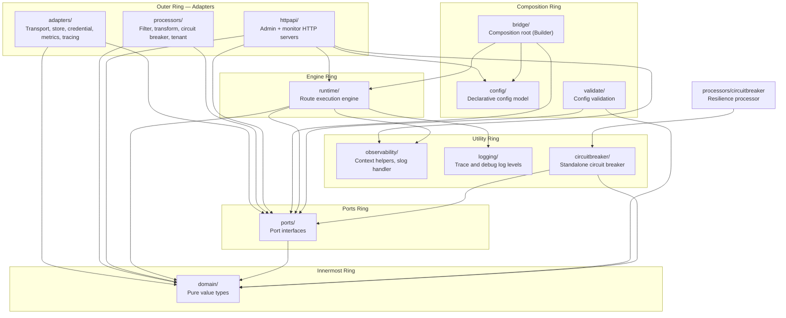
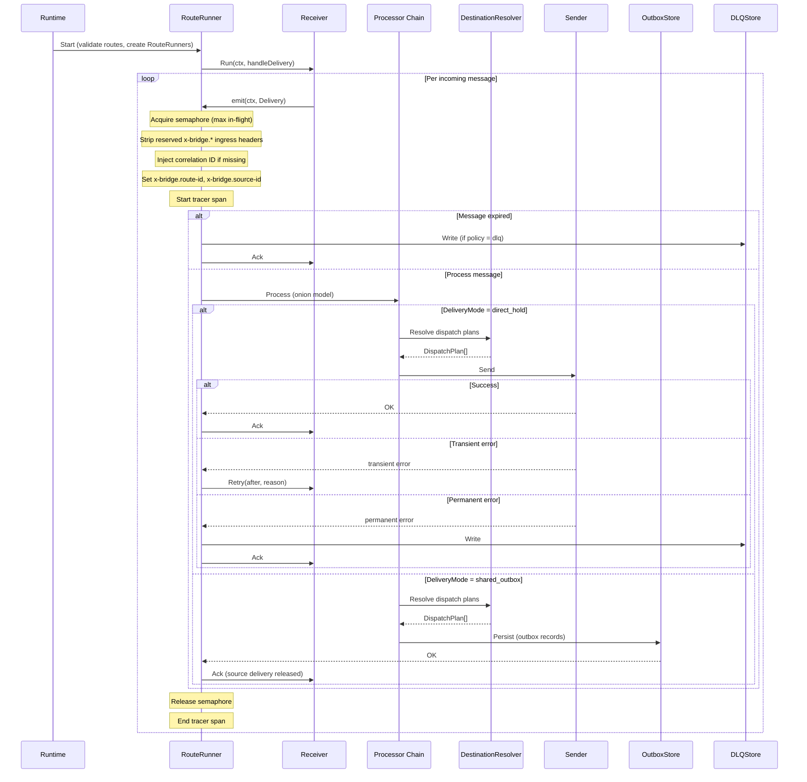
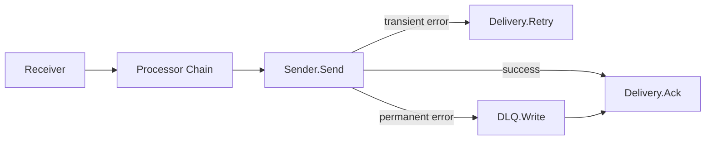
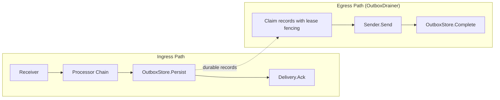
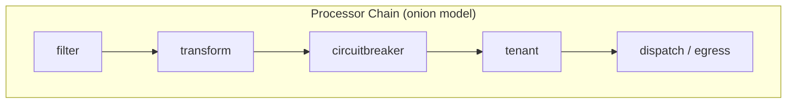
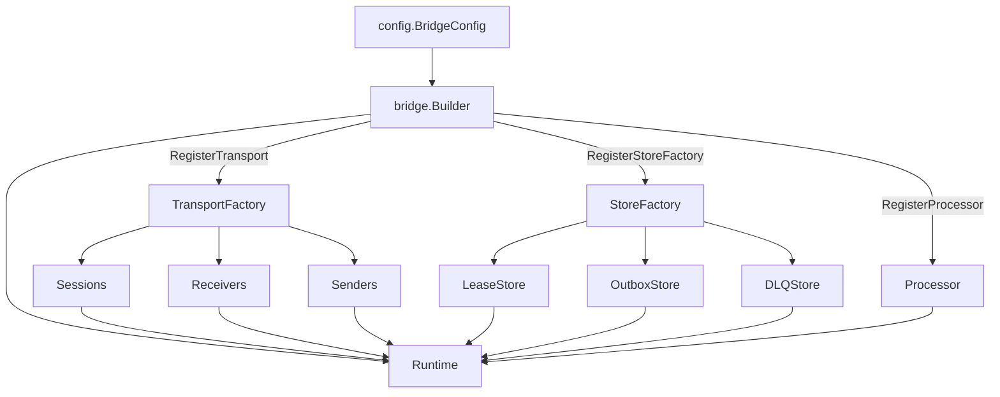
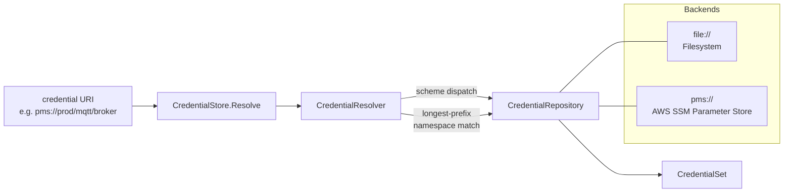
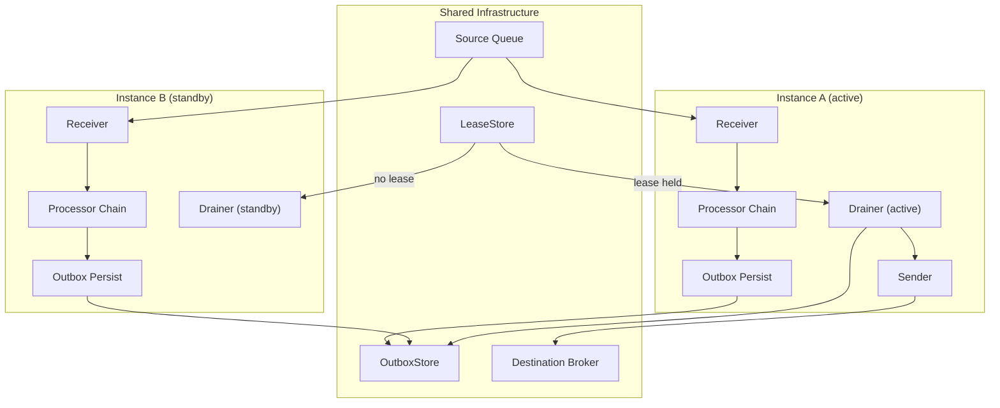

# GoBridge Architecture

## 1. System Overview

GoBridge is a message-bridge framework written in Go. It routes messages between heterogeneous transports -- MQTT, AWS SQS, Azure Service Bus, RabbitMQ (AMQP 0-9-1), AMQP 1.0 brokers (Artemis, Solace, Qpid) -- with pluggable middleware processing, durable outbox delivery, dead-letter queue management, and full observability.

The core module (`domain/`, `ports/`, `runtime/`, `bridge/`, `config/`) has zero external dependencies. Transport, store, and processor adapters live in separate Go modules within a `go.work` workspace so consumers only import what they need.

Key design goals:

- **Transport-agnostic message routing** between any combination of supported transports.
- **Pluggable middleware** for filtering, transformation, circuit-breaking, and multi-tenant validation.
- **Durable delivery** via an outbox pattern with fencing-token-based lease ownership.
- **Full observability** with structured logging, distributed tracing, and dimensional metrics.
- **Minimal coupling** -- the dependency rule ensures inner layers never import outer layers.

---

## 2. Hexagonal Architecture Layers



### Dependency Rule

Dependencies point inward. Each layer may only import from layers
closer to the center. The rules below are enforced by `make lint-arch`
(see `.go-arch-lint.yml`):

| Layer | May Import |
|---|---|
| `domain/` | Standard library only (no gobridge, no vendor) |
| `ports/` | `domain` |
| `config/` | `domain` (every bounded context), `ports`, `gopkg.in/yaml.v3`, and `github.com/go-viper/mapstructure/v2` (the only allowed external deps on the inner ring) |
| `observability/` | Standard library only |
| `logging/` | Standard library only |
| `circuitbreaker/` | `domain` (every bounded context), `ports` (`*Breaker` satisfies `ports.CircuitBreaker`; adapters depend on the port, not on this package) |
| `runtime/` | `domain`, `ports`, `observability`, `logging` |
| `validate/` | `domain`, `ports` |
| `bridge/` | `config`, `ports`, `runtime`, `domain`, `logging` |
| transport adapters | `ports`, `domain`, `logging`, vendor SDK only (no `bridge`, no `config`, no other adapters, no `circuitbreaker` package — wrap with `ports.CircuitBreaker` instead) |
| store impl adapters | `ports`, `domain`, `logging`, vendor SDK only (no aggregators) |
| store factory aggregators | `ports`, `domain`, `logging`, only their own store impl packages |
| config source adapters | `config`, `domain`, `logging`, vendor SDK only (the only adapter category allowed to import `config`) |
| credential adapters | `ports`, `domain`, `logging`, vendor SDK only |
| observability adapters | `ports`, `domain`, `logging`, vendor SDK only |
| cluster resolver adapters | `ports`, `domain`, `logging`, vendor SDK only |
| `processors/filter` | `ports`, `domain/shared`, `domain/messaging` (stdlib only) |
| `processors/tenant` | `ports`, `domain/shared`, `domain/messaging` (stdlib only) |
| `processors/transform` | `ports`, `domain/messaging`, `github.com/ohler55/ojg` (JSONPath) |
| `processors/circuitbreaker` | `ports`, `domain` contexts, the `circuitbreaker` package (the only processor allowed to depend on it because circuit-breaking IS its role) |
| `httpapi/` | `runtime`, `config`, `ports`, `domain`, `observability` |
| `cmd/`, `deployment/` | Composition roots — any project package, any vendor |

The architecture lint splits the umbrella `adapters/` into role-specific
components (one per transport technology, one per store backend, one
per processor role, etc.) so cross-adapter coupling — for example MQTT
importing AWS SDK, or `processors/filter` importing
`processors/transform` — fails lint immediately. There is no blanket
`adapters → adapters` rule and no umbrella `processors → processors`
rule.

### 2.1 Architecture Lint Components — Allowed Dependency Map

The diagram below summarises the policy expressed in
`.go-arch-lint.yml`. Read it inside-out: every arrow is an *allowed*
edge; absence of an arrow is a denied edge that `make lint-arch` will
reject. The terminology matches `DDD.md` (bounded contexts), `UBIQUITOUS.md`
(ubiquitous language), and the Clean / Hexagonal layer numbering used
throughout this document.

```text
                 ┌────────────────────── Layer 4: Composition root ───────────────────────┐
                 │  cmd/    deployment/      (anyProjectDeps, anyVendorDeps)               │
                 └─────────────────────────────────────────────────────────────────────────┘
                                                  │ wires
                                                  ▼
   ┌──────────────────── Layer 3: Interface Adapters (driving + driven) ────────────────────┐
   │                                                                                        │
   │  Driving:   httpapi ──┐                                                                │
   │             adapter_config_native_file, adapter_config_aws_dynamodb (only adapters     │
   │                                                                  allowed to import     │
   │                                                                  the config package)   │
   │                       │                                                                │
   │  Driven (transports — one component per technology, no sibling edges):                 │
   │     adapter_transport_mqtt_paho   adapter_transport_sqs   adapter_transport_servicebus │
   │     adapter_transport_amqp091     adapter_transport_amqp10  adapter_transport_http     │
   │                                                                                        │
   │  Driven (stores — leaves):                                                             │
   │     adapter_store_native_{memorylease, memoryoutbox, memorydlq,                        │
   │                            sqliteoutbox, sqlitedlq}                                    │
   │     adapter_store_aws_{dynamodblease, dynamodboutbox, dynamodbdlq}                     │
   │  Driven (store factories — only place that may import its own leaves):                 │
   │     adapter_store_native_factory ──▶ adapter_store_native_*                            │
   │     adapter_store_aws_factory    ──▶ adapter_store_aws_*                               │
   │                                                                                        │
   │  Driven (processor roles — one component per role, no sibling edges):                  │
   │     processor_filter   processor_tenant   processor_transform   processor_circuitbreaker│
   │                                                          │                             │
   │                                                          └─▶ circuitbreaker package    │
   │                                                             (only processor that may)  │
   │                                                                                        │
   │  Driven (credentials, observability export, cluster topology):                         │
   │     adapter_credentials_*  adapter_metrics_*  adapter_tracing_*  adapter_cluster_*     │
   └────────────────────────────────────────────────────────────────────────────────────────┘
                                          │ depends inward only
                                          ▼
   ┌─────────────── Layer 2: Application Services + Ports + Shared Kernel ──────────────┐
   │                                                                                    │
   │   bridge ──▶ runtime ──▶ ports                                                     │
   │     │          │           ▲                                                       │
   │     ▼          ▼           │                                                       │
   │   config ───▶ ports     validate                                                   │
   │                                                                                    │
   │   Cross-cutting utilities (stdlib-only, usable by any layer above):                │
   │      logging       observability       circuitbreaker (impl of ports.CircuitBreaker)│
   │                                                                                    │
   └────────────────────────────────────────────────────────────────────────────────────┘
                                          │
                                          ▼
   ┌────────────────────── Layer 1: Domain (decomposed by bounded context) ─────────────┐
   │                                                                                    │
   │   domain_shared                       (shared kernel — value objects, errors)      │
   │   domain_messaging                    (envelope, headers, transactions)            │
   │   domain_persistence ──▶ domain_messaging  (OutboxRecord embeds Envelope; the      │
   │                                              only documented sideways edge)        │
   │   domain_routing     ──▶ domain_shared, domain_messaging                           │
   │   domain_connectivity ─▶ domain_shared                                             │
   │   domain_clock                        (stdlib-only timing primitive)               │
   │                                                                                    │
   │   Every domain context: canUse [_no_external_deps_]  — stdlib-only, machine checked│
   └────────────────────────────────────────────────────────────────────────────────────┘
```

What this map enforces (the F-001 anti-coupling guarantees):

- No transport adapter can import another transport adapter
  (e.g. `adapter_transport_mqtt_paho` cannot reach
  `adapter_transport_sqs`). A bug or a vendor SDK in one transport
  cannot leak into another.
- No store implementation can import another store implementation; only
  the matching factory aggregator may compose its own leaves.
- No processor role can import another processor role
  (`processor_filter` and `processor_transform` are siblings, not a
  shared bucket). Only `processor_circuitbreaker` may import the
  `circuitbreaker` package because the breaker IS its job.
- No adapter can import the `circuitbreaker` package directly. Adapters
  that need resilience consume the `ports.CircuitBreaker` port and the
  composition root injects a concrete `*circuitbreaker.Breaker`.
- Only `adapter_config_native_file` and `adapter_config_aws_dynamodb`
  may import the `config` parser package.
- `cmd/` and `deployment/` are the only components with
  `anyProjectDeps + anyVendorDeps`. They are the boundary between the
  hexagon and the operating environment.

The mapping regression in `scripts/lint-arch-mapping-test.sh` pins one
sentinel package per component (every domain context, every
application-service component, every cross-cutting utility, every
adapter, every processor role, every composition-root component). Any
edit that broadens or merges a component will fail the regression
before it lands.

### 2.2 Resilience Ports

`ports.CircuitBreaker` (defined in `ports/resilience.go`) is the
single point of contact between adapters and the circuit-breaker
state machine. The concrete implementation in the `circuitbreaker/`
package satisfies that port; adapters such as
`adapters/mqtt/transport/paho/cb_sender.go` consume the port only.
The composition root (`cmd/`, `deployment/`) is the sole place that
constructs the concrete `*circuitbreaker.Breaker` and injects it into
adapters via their typed `Config`.

This split is the F-004 outcome: the breaker is a project-internal
resilience primitive, not an adapter dependency. New adapters that
need protection get a `CircuitBreaker ports.CircuitBreaker` field on
their `Config`, never a direct import of the `circuitbreaker`
package.

### Typed Plugin Config

Every plugin attachment point on the blueprint (transport sessions,
receivers, senders, subscriptions, bindings, and stores) carries a
typed `ports.PluginConfig` rather than an opaque `map[string]any`.
Adapters export a concrete `Config` struct that implements
`Kind() string` and `Validate() error`, and self-register a decoder on
`ports.DefaultRegistry` from an `init()` in their `register.go`. The
`config/` parser performs a two-stage decode (frame → registry-dispatched
typed config); `config/blueprint_marshal.go` round-trips the typed
`Config` back into the canonical `options:` wire form. The
`cfgshape` analyzer (`scripts/cfgshape/analyzer.go`) enforces the
shape across `ports/`, `domain/`, and `adapters/**` in `make lint`.

See `docs/typed-plugin-config.adoc` for the contract, the registry
API, the per-step checklist for adding a new plugin, and the
anti-patterns the analyzer rejects. The architectural framing lives in
`ARCH_LINT_PLAN.md` § F-003 / ARCH-003 (Closed via FIX-003).

---

## 3. Core Concepts

### Envelope

The normalized message unit flowing through the bridge. A pure value type defined in `domain/`.

| Field | Type | Description |
|---|---|---|
| `ID` | `string` | Unique message identifier |
| `Subject` | `string` | Logical event subject. Producer-supplied, never mutated by the runtime to inject a destination. Free-form and transport-agnostic. |
| `Payload` | `[]byte` | Raw message body |
| `Headers` | `map[string]any` | Metadata key-value pairs |
| `CreatedAt` | `time.Time` | Envelope creation timestamp |
| `ExpiresAt` | `time.Time` | Optional TTL expiry timestamp |

Methods: `Clone()` (deep copy including headers and payload), `IsExpired()`, `HasExpiry()`, `RemainingTTL()`.

### Delivery

A source-owned unit of work wrapping an `Envelope` plus transport-native acknowledgement semantics. Transport adapters implement the `Delivery` interface to map these operations to protocol-specific commands.

| Method | Signature | Purpose |
|---|---|---|
| `Envelope()` | `*messaging.Envelope` | Access the wrapped envelope |
| `Ack(ctx)` | `error` | Acknowledge successful processing |
| `Retry(ctx, after, reason)` | `error` | Request redelivery after a delay (e.g. SQS `ChangeMessageVisibility`) |
| `Extend(ctx, until)` | `error` | Extend processing deadline (e.g. SQS visibility extension) |

### Receiver

Reads deliveries from a transport. The `Run` method blocks until the context is cancelled or an unrecoverable error occurs.

```go
type Receiver interface {
    Run(ctx context.Context, emit func(context.Context, Delivery) error) error
}
```

### Sender / BatchSender

Egress interfaces for submitting envelopes to a transport. Senders receive an `OutboundMessage` so the transport destination is carried independently of the envelope.

```go
type OutboundMessage struct {
    Envelope *messaging.Envelope
    Address  string // transport destination from DispatchPlan.Address
}

type Sender interface {
    Send(ctx context.Context, msg OutboundMessage) error
}

type BatchSender interface {
    Sender
    SendBatch(ctx context.Context, msgs []OutboundMessage) (int, error)
}
```

`OutboundMessage.Address` is the resolved per-message destination (publish topic, routing key, queue URL, ...). `Envelope.Subject` is the logical event subject and is never overwritten with the destination — see [§ Subject vs. Address](#subject-vs-address).

### Session

Stateful transport connection lifecycle management for protocols that maintain long-lived connections (e.g. MQTT). Stateless transports (SQS, Azure Service Bus) do not use sessions.

| Method | Purpose |
|---|---|
| `Start(ctx)` | Establish the connection |
| `Reconcile(ctx, SessionPlan)` | Converge subscriptions/publishers to desired state |
| `Health(ctx)` | Report current connection health |
| `Events()` | Channel of lifecycle events (connected, disconnected, reconnecting, error) |
| `Close(ctx)` | Graceful shutdown |

### Route

A message route from a receiver through a processor chain to one or more sender bindings. Configured via `config.RouteDef` with: `receiver_id`, `delivery_mode`, `dispatch_mode`, `policy`, `bindings`, `processors`.

### RoutePolicy

Per-route behavior configuration:

| Field | Type | Description |
|---|---|---|
| `MaxInFlight` | `int` | Concurrency limit (default: 100) |
| `Backoff` | `BackoffPolicy` | Retry backoff: initial interval, max interval, multiplier |
| `DeliveryMode` | `DeliveryMode` | `direct_hold` or `shared_outbox` |
| `DispatchMode` | `DispatchMode` | `single` or `fan_out` |
| `AckAfter` | `AckBoundary` | `target_accept` or `outbox_persist` |
| `OnExpired` | `ExpiredAction` | `drop` or `dlq` |
| `OnPermanentFailure` | `FailureAction` | `drop` or `dlq` |
| `MaxReplayAttempts` | `int` | Max DLQ replay retries (default: 5) |
| `MaxOutboxDepth` | `int` | Backpressure limit (default: 10,000) |

### Binding

A concrete egress destination referencing a sender and address:

| Field | Description |
|---|---|
| `ID` | Binding identifier |
| `SenderID` | Reference to a configured sender |
| `SessionID` | Optional session for stateful transports |
| `Address` | Target address (queue URL, topic, etc.) |

### DestinationResolver

Optional runtime egress binding selection. Returns one or more `DispatchPlan` values per envelope. The default resolver uses static bindings from configuration.

```go
type DestinationResolver interface {
    Resolve(ctx context.Context, env *messaging.Envelope) ([]routing.DispatchPlan, error)
}
```

### Subject vs. Address

Two concepts are deliberately kept separate end-to-end:

- **`Envelope.Subject`** — the logical event subject. Set by the producer (or by an ingress mapping rule) and **never** mutated by the runtime to inject a destination. It is the value that filters, tenant rules, and downstream consumers reason about.
- **`DispatchPlan.Address`** (carried over the wire as **`ports.OutboundMessage.Address`**) — the transport destination chosen for one envelope at egress time: a publish topic, an AMQP routing key, a queue URL, an SSE channel, etc.

Runtime invariants:

- The runtime never writes the dispatch address into `env.Subject`. Both `direct_hold` and `shared_outbox` paths build an outbound envelope copy with the route's merged dispatch headers and pass the address out-of-band on `OutboundMessage.Address`.
- The shared-outbox store persists `OutboxRecord.Address` as a separate column from `OutboxRecord.Envelope.Subject`. Drainers read the address from the record, not from the persisted envelope.
- Egress hook events and DLQ entries record the outbound address as a distinct field; the `Envelope.Subject` they expose remains the logical event subject.

Per-transport carriers for the logical subject:

| Transport | Outbound destination from `OutboundMessage.Address` | Logical subject on the wire | Ingress mapping into `Envelope.Subject` |
|-----------|------------------------------------------------------|-----------------------------|------------------------------------------|
| MQTT | Publish topic (or sender `default_topic` when address is empty). Never derived from `Envelope.Subject`. | MQTT user property `gobridge.subject` | The `gobridge.subject` user property. The actual publish topic is preserved in `Headers["mqtt.topic"]`. |
| AMQP 0-9-1 | Routing key (when sender `routing_key` is empty). Never derived from `Envelope.Subject`. | AMQP header `gobridge.subject` | The `gobridge.subject` AMQP header. The broker's `Delivery.RoutingKey` is preserved in `Headers["amqp091.routing-key"]`. |
| AMQP 1.0 | Validated against the configured sender link address (empty allowed; mismatch fails fast). | `Message.Properties.Subject` | `Message.Properties.Subject` only — no fallback from the link address. |
| SQS | Sender-state today; reserved for dynamic queue selection. FIFO `MessageDeduplicationId` hashes the logical subject only, never the destination. | `Subject` message attribute | `Subject` message attribute only — no fallback from the queue URL/name. |
| Azure Service Bus | Sender-state today; reserved for dynamic entity selection. | `Message.Subject` | `Message.Subject` only — no fallback from the queue/topic name. |
| HTTP / SSE | Path is sender-state. | JSON field `subject` | JSON field `subject`. |

The `gobridge.subject` carrier is an explicit, application-visible name. The reserved `x-bridge.*` prefix is **not** used as the cross-transport subject carrier.

---

## 4. Message Flow



### Step-by-Step

1. **Runtime.Start** validates all configured routes and creates a `RouteRunner` for each.
2. **RouteRunner.Run** calls `receiver.Run(ctx, handleDelivery)`, which blocks and emits deliveries.
3. **handleDelivery** processes each message:
   - Acquires the concurrency semaphore (max in-flight control).
   - Strips reserved `x-bridge.*` headers from ingress to prevent injection.
   - Injects `x-bridge.correlation-id` if missing; sets `x-bridge.route-id` and `x-bridge.source-id`.
   - Starts a tracer span for the delivery.
   - Checks message expiry. If expired: routes to DLQ or drops per policy, then acks.
   - Runs the processor chain (onion/middleware model).
   - Dispatches based on delivery mode:
     - **direct_hold**: Resolves dispatch plans, builds an `OutboundMessage{Envelope: copy, Address: plan.Address}` with merged dispatch headers, calls `Sender.Send`. The source `Envelope.Subject` is left untouched. On success: ack. On transient error: retry with backoff. On permanent error: DLQ then ack.
     - **shared_outbox**: Resolves dispatch plans, persists outbox records that carry `OutboxRecord.Address` separately from the embedded envelope, then acks the source delivery. A separate `OutboxDrainer` reconstructs the `OutboundMessage` from the record and dispatches it.

---

## 5. Delivery Modes

### DirectHold

The source delivery is held open until egress completes. The runtime maintains end-to-end backpressure between the source transport and the target transport.



- **Ack** on successful egress send.
- **Retry** on transient error with backoff (e.g. SQS `ChangeMessageVisibility` delay).
- **DLQ + Ack** on permanent error (message cannot be retried).

### SharedOutbox

The source delivery is acknowledged after persisting to the outbox store, decoupling ingress from egress. This provides durability guarantees at the cost of eventual delivery.



The `OutboxDrainer` loop:

1. Claims pending outbox records with lease fencing (prevents duplicate sends across cluster members).
2. Sends each record via the appropriate `Sender`.
3. Marks records as completed on success.
4. Supports clustering via `LeaseStore` for single-active ownership of outbox partitions.

---

## 6. Processor Chain

Processors implement the onion/middleware pattern. Each processor wraps the next, forming a layered pipeline where cross-cutting concerns execute in order on the way in and in reverse on the way out.

```go
type ProcessorFunc func(ctx context.Context, env *messaging.Envelope) error

type Processor interface {
    Name() string
    Process(ctx context.Context, env *messaging.Envelope, next ProcessorFunc) error
}
```



### Built-in Processors

Each processor is a separate Go module under `processors/`.

| Processor | Module | Description |
|---|---|---|
| **filter** | `processors/filter` | Condition-based pass/drop/route with operators: `eq`, `ne`, `contains`, `regex`, `gt`, `lt`, `exists`, `in`. Returns `ErrMessageFiltered` on drop (ack without DLQ). |
| **transform** | `processors/transform` | JSON field mapping with JSONPath expressions, type coercion, and default values. |
| **circuitbreaker** | `processors/circuitbreaker` | Per-key state machine (`closed` -> `open` -> `half-open` -> `closed`). Returns `ErrUnavailable.WithRetryAfter()` when the circuit is open. |
| **tenant** | `processors/tenant` | Header-based tenant extraction, validation via `TenantValidator` port, optional usage tracking. |

---

## 7. Store Abstractions

Three store ports define the persistence contracts for the bridge runtime. All implementations must satisfy conformance test suites in `ports/storetest/`.

### LeaseStore

Distributed lease ownership for single-active scenarios. Implementations must use conditional writes to enforce fencing semantics.

```go
type LeaseStore interface {
    Acquire(ctx context.Context, leaseID string, ownerID string, ttl time.Duration, endpoints map[string]string) (persistence.LeaseToken, error)
    Renew(ctx context.Context, leaseID string, token persistence.LeaseToken, ttl time.Duration, endpoints map[string]string) (persistence.LeaseToken, error)
    Release(ctx context.Context, leaseID string, token persistence.LeaseToken) error
    Current(ctx context.Context, leaseID string) (persistence.LeaseInfo, error)
}
```

The `endpoints` parameter on `Acquire` and `Renew` stores the owner's reachable addresses alongside the lease record. Other instances retrieve these via `Current` to discover how to reach the lease owner for cluster-aware routing.

`LeaseToken` contains a monotonically increasing `Version` field that serves as a fencing token, preventing stale owners from continuing to operate after a lease transfer.

### OutboxStore

Durable outbox for reliable egress. All mutations that accept a `LeaseToken` must validate the fencing token and reject stale tokens atomically.

```go
type OutboxStore interface {
    Persist(ctx context.Context, records []persistence.OutboxRecord) error
    Claim(ctx context.Context, partitionKey, ownerID string, token persistence.LeaseToken, limit int) ([]persistence.OutboxRecord, error)
    Complete(ctx context.Context, recordIDs []string, token persistence.LeaseToken) error
    Expire(ctx context.Context, before time.Time) (int, error)
    QueryPending(ctx context.Context, partitionKey string, limit int) ([]persistence.OutboxRecord, error)
}
```

Outbox records are partitioned by session or binding identity via `persistence.OutboxPartitionKey()`.

### DLQStore

Dead-letter queue management for failed or rejected messages. `Write` is idempotent -- writing the same entry twice must not create a duplicate.

```go
type DLQStore interface {
    Write(ctx context.Context, entry routing.DLQEntry) error
    List(ctx context.Context, filter routing.DLQFilter) ([]routing.DLQEntry, error)
    Replay(ctx context.Context, entryIDs []string) error
    Purge(ctx context.Context, before time.Time) (int, error)
}
```

### Implementations

| Store | Backend | Use Case |
|---|---|---|
| `memorylease`, `memoryoutbox`, `memorydlq` | In-memory | Testing and development |
| `sqliteoutbox`, `sqlitedlq` | SQLite | Single-process production |
| `dynamodblease`, `dynamodboutbox`, `dynamodbdlq` | DynamoDB | Distributed production |

---

## 8. Configuration Model

Root type: `config.BridgeConfig` (YAML or JSON). The configuration model lives in the `config/` package and imports only `domain` types.

```yaml
bridge:
  id: my-bridge
  shutdown_timeout: 30s
  drain_timeout: 30s
  log_level: info

stores:
  lease:
    type: memory
  outbox:
    type: memory
  dlq:
    type: memory

sessions:
  - id: mqtt-session
    transport: mqtt
    options:
      broker_url: tcp://localhost:1883
      client_id: bridge-01

receivers:
  - id: mqtt-receiver
    transport: mqtt
    session_id: mqtt-session
    topics:
      - topic: "events/#"
        qos: 1

senders:
  - id: sqs-sender
    transport: sqs
    options:
      queue_url: https://sqs.us-west-1.amazonaws.com/123/my-queue

bindings:
  - id: to-sqs
    sender_id: sqs-sender
    address: my-queue

routes:
  - id: mqtt-to-sqs
    receiver_id: mqtt-receiver
    delivery_mode: direct_hold
    dispatch_mode: single
    bindings: [to-sqs]
    processors: [my-filter]
    policy:
      max_in_flight: 100
      on_permanent_failure: dlq

http:
  admin_addr: ":8080"
  monitor_addr: ":8081"
  admin_api_key: "secret-key"
```

### Configuration Sections

| Section | Purpose |
|---|---|
| `bridge` | Instance identity, shutdown behavior, log level |
| `stores` | Store backend selection for lease, outbox, and DLQ |
| `sessions` | Stateful transport connections (MQTT) |
| `receivers` | Ingress transport endpoints with subscription details |
| `senders` | Egress transport endpoints |
| `bindings` | Named egress destinations referencing senders |
| `routes` | Message routes: receiver -> processors -> bindings, with policy |
| `http` | Admin and monitor HTTP server addresses and authentication |

---

## 9. Composition Root (`bridge.Builder`)

The `bridge` package is the composition root that wires all components together. It is the only package that imports across layers.

```go
cfg, _ := config.ParseFile("bridge.yaml", config.FormatAuto)
rt, _ := bridge.NewBuilder(cfg).
    RegisterTransport("mqtt", mqttFactory).
    RegisterTransport("sqs", sqsFactory).
    RegisterStoreFactory("memory", memoryFactory).
    Build(ctx)
rt.Start(ctx)
```

### Builder Responsibilities

1. **Credential resolution** -- resolves credential URIs from session and transport config.
2. **Session creation** -- creates `Session` instances via `SessionFactory` for stateful transports.
3. **Receiver/Sender creation** -- creates ingress and egress instances via `ReceiverFactory` and `SenderFactory`.
4. **Store instantiation** -- creates `LeaseStore`, `OutboxStore`, and `DLQStore` via `StoreFactory`.
5. **Processor wiring** -- resolves processor references and builds the chain for each route.
6. **Runtime construction** -- assembles the `Runtime` with all resolved components.



---

## 10. HTTP API

Two HTTP servers expose operational and management interfaces.

### Admin Server (default `:8080`)

Requires API key authentication via `X-API-Key` header or `Bearer` token.

| Method | Endpoint | Description |
|---|---|---|
| `GET` | `/api/v1/admin/bridge` | Instance info |
| `POST` | `/api/v1/admin/bridge/start` | Start the bridge |
| `POST` | `/api/v1/admin/bridge/stop` | Stop the bridge |
| `GET` | `/api/v1/admin/routes` | List configured routes |
| `POST` | `/api/v1/admin/routes/{routeID}/inject` | Inject a message into a route |
| `GET` | `/api/v1/admin/dlq` | List DLQ entries |
| `GET` | `/api/v1/admin/dlq/messages` | Retrieve DLQ messages |
| `POST` | `/api/v1/admin/dlq/replay` | Replay DLQ entries |
| `POST` | `/api/v1/admin/dlq/purge` | Purge DLQ entries |

### Monitor Server (default `:8081`)

Health endpoints are unauthenticated. Topology and operational endpoints require authentication.

| Method | Endpoint | Auth | Description |
|---|---|---|---|
| `GET` | `/health` | No | Health check |
| `GET` | `/live` | No | Liveness probe |
| `GET` | `/ready` | No | Readiness probe |
| `GET` | `/topology` | Yes | Bridge topology graph |
| `GET` | `/routes` | Yes | Route status and metrics |
| `GET` | `/logs` | Yes | Recent log entries |

### CORS

CORS is disabled by default. Wildcard `*` origin is rejected at startup to prevent misconfiguration.

---

## 11. Observability

Three orthogonal observability concerns are supported through port interfaces with pluggable implementations.

### Metrics

Defined by `ports.MetricsExporter` with four metric kinds:

| Kind | Method | Description |
|---|---|---|
| Counter | `Counter(name, value, tags...)` | Monotonically increasing count |
| Gauge | `Gauge(name, value, tags...)` | Point-in-time value |
| Histogram | `Histogram(name, value, tags...)` | Distribution of observations |
| Timer | `Timer(name, duration, tags...)` | Duration recording (stored as milliseconds) |

Implementations: OTel OTLP (`adapters/otel/metrics`), CloudWatch (`adapters/aws/metrics/cloudwatch`). Default: `NoopExporter`.

Standard metric dimensions use `shared.Tag` with well-known keys: `route_id`, `session_id`, `lease_id`, `partition`, `queue_url`, `category`.

### Tracing

Defined by `ports.Tracer` and `ports.Span`. The runtime starts spans around `handleDelivery` for each message processed.

```go
type Tracer interface {
    StartSpan(ctx context.Context, name string, attrs ...shared.Tag) (context.Context, Span)
}

type Span interface {
    End()
    SetError(err error)
    AddEvent(name string, attrs ...shared.Tag)
    SetAttributes(attrs ...shared.Tag)
}
```

Implementation: OTel OTLP (`adapters/otel/tracing`). Default: `NoopTracer`.

### Structured Logging

The `observability` package provides a `CorrelationHandler` that wraps any `slog.Handler` to inject contextual fields into every log record:

- `correlation_id` from `x-bridge.correlation-id`
- `trace_id` and `span_id` from W3C traceparent

Context helpers: `WithCorrelationID(ctx, id)`, `WithTraceID(ctx, id)`, `WithSpanID(ctx, id)` and corresponding getters.

### Trace Context

`messaging.TraceContext` supports W3C traceparent parsing and formatting:

- `ParseTraceparent(s)` -- parses `"00-<traceID>-<spanID>-<flags>"`
- `FormatTraceparent(tc)` -- formats back to W3C string
- `ExtractTraceContext(headers)` / `InjectTraceContext(headers, tc)` -- header-level operations

---

## 12. Credentials

URI-based credential resolution with scheme dispatch and namespace matching.



### Port Interfaces

| Interface | Purpose |
|---|---|
| `CredentialStore` | Facade: `Resolve(ctx, uri) (*CredentialSet, error)` |
| `CredentialRepository` | Per-backend adapter: `Scheme()`, `Namespace()`, `Get()` |

### Credential Types

Defined in `domain/`:

| Type | Fields | Description |
|---|---|---|
| `PasswordCredential` | `Username`, `Password` | Username/password authentication |
| `TLSMaterial` | `CertPEM`, `KeyPEM`, `CAPEMs`, `InsecureSkipVerify` | TLS certificate and key material |
| `CredentialSet` | `Password *PasswordCredential`, `TLS *TLSMaterial` | Composite container; a single URI resolution can yield both |

The `runtime.CredentialResolver` performs scheme-based dispatch with longest-prefix namespace matching and optional TTL cache. Credential values are intentionally excluded from `String` and `GoString` methods to prevent accidental log exposure.

---

## 13. Module Layout

```
gobridge/
├── domain/                              # Pure value types (innermost ring)
├── ports/                               # Port interfaces
│   └── storetest/                       # Conformance test suites
├── circuitbreaker/                      # Standalone circuit breaker state machine
├── logging/                             # Trace and debug log level utilities
├── observability/                       # Context helpers, slog handler
├── config/                              # Declarative config model
├── validate/                            # Config validation
├── runtime/                             # Route execution engine
├── bridge/                              # Composition root (Builder)
├── httpapi/                             # Admin + monitor HTTP servers
├── adapters/
│   ├── mqtt/transport/paho/             # MQTT v5 (Paho/autopaho)
│   ├── aws/
│   │   ├── transport/sqs/               # AWS SQS
│   │   ├── store/                       # DynamoDB store factory
│   │   │   ├── dynamodblease/
│   │   │   ├── dynamodboutbox/
│   │   │   └── dynamodbdlq/
│   │   ├── credentials/ssm/            # AWS SSM credentials
│   │   ├── metrics/cloudwatch/          # CloudWatch metrics
│   │   ├── config/dynamodb/             # DynamoDB config loader
│   │   └── cluster/ecs/                # ECS cluster resolver
│   ├── azure/transport/servicebus/      # Azure Service Bus
│   ├── http/transport/                  # HTTP POST ingress, SSE egress
│   ├── native/
│   │   ├── store/                       # Memory + SQLite store factory
│   │   │   ├── memorylease/
│   │   │   ├── memoryoutbox/
│   │   │   ├── memorydlq/
│   │   │   ├── sqliteoutbox/
│   │   │   └── sqlitedlq/
│   │   ├── credentials/file/           # File-based credentials
│   │   ├── config/file/                # File config loader/watcher
│   │   └── cluster/                    # Native cluster resolver
│   └── otel/
│       ├── metrics/                     # OTel OTLP metrics
│       └── tracing/                     # OTel OTLP tracing
├── processors/
│   ├── filter/                          # Condition-based filtering
│   ├── transform/                       # JSON field mapping
│   ├── circuitbreaker/                  # Circuit breaker processor (wraps circuitbreaker/)
│   └── tenant/                          # Multi-tenant validation
├── cmd/gobridge/                        # Example binary
├── testutil/                            # Docker test helpers
│   ├── ddblocal/
│   ├── sqslocal/
│   ├── asblocal/
│   ├── s3local/
│   └── tlsgen/
└── tests/integration/                   # End-to-end tests
```

Each adapter and processor is a separate Go module within the `go.work` workspace. This ensures consumers only pull in the dependencies they need. For example, importing the SQS adapter brings in the AWS SDK, but the MQTT adapter does not.

---

## 14. Headers

### Reserved Prefix

All headers with the `x-bridge.` prefix are reserved for bridge-internal use. Transport adapters **must** strip these headers from external sources at ingress to prevent header injection attacks.

### Well-Known Headers

| Header | Purpose |
|---|---|
| `x-bridge.correlation-id` | End-to-end correlation across services |
| `x-bridge.causation-id` | Identifies the direct cause of this message |
| `x-bridge.idempotency-key` | Deduplication key for idempotent processing |
| `x-bridge.content-type` | Payload content type |
| `x-bridge.source-id` | Originating receiver identifier |
| `x-bridge.route-id` | Route that processed this message |
| `x-bridge.ordering-key` | Key for ordered delivery guarantees |
| `x-bridge.dedup-id` | Transport-level deduplication identifier |
| `x-bridge.tenant-id` | Tenant identifier for multi-tenant routing |
| `x-bridge.route-override` | Dynamic route override |
| `traceparent` | W3C Trace Context propagation |
| `tracestate` | W3C Trace Context vendor-specific state |

### Header Utilities

- `IsReservedHeader(key)` -- checks the `x-bridge.` prefix.
- `StripReservedHeaders(headers)` -- returns a copy with all reserved headers removed.
- `MergeHeaders(base, overlay, protectReserved)` -- merges header maps with optional reserved-key protection.
- `GetHeaderString(headers, key)` / `SetHeader(headers, key, value)` -- typed accessors.

---

## 15. Error Classification

All errors in the bridge pipeline are structured as `shared.BridgeError` with an `ErrorClass` that drives routing decisions.

### Error Classes

| Class | Behavior | Example |
|---|---|---|
| `Transient` | Retriable -- may succeed on retry | Connection lost, timeout, throttled |
| `Permanent` | Not retriable -- retry will not help | Bad payload, not authorized |
| `Expired` | Message TTL exceeded | Stale message past ExpiresAt |
| `Rejected` | Payload-level rejection | Payload too large, filtered, schema violation |

### Error Codes

**Recoverable (transient):** `TIMEOUT`, `CONNECTION_LOST`, `UNAVAILABLE`, `THROTTLED`, `BROKER_BUSY`, `TEMPORARY_AUTH_FAILURE`

**Permanent:** `NOT_AUTHORIZED`, `FORBIDDEN`, `NOT_FOUND`, `INVALID_PAYLOAD`, `PAYLOAD_TOO_LARGE`, `INVALID_TOPIC`, `PROTOCOL_ERROR`, `SCHEMA_VIOLATION`, `MESSAGE_EXPIRED`, `QOS_NOT_SUPPORTED`, `MESSAGE_FILTERED`

**Infrastructure / fencing:** `NOT_SUPPORTED`, `VERSION_MISMATCH`, `ALREADY_EXISTS`, `STALE_FENCING_TOKEN`, `DUPLICATE_RECORD`

### Special Sentinels

| Sentinel | Behavior |
|---|---|
| `ErrMessageFiltered` | Ack without DLQ -- the message was intentionally dropped by a filter processor |
| `ErrUnavailable.WithRetryAfter(d)` | Circuit breaker open -- includes a retry delay hint for the caller |

### Error API

```go
// Classification
be, ok := shared.AsBridgeError(err)
recoverable := shared.IsRecoverableError(err)
retryDelay := shared.GetRetryAfter(err)

// Construction and chaining
err := shared.ErrTimeout.Wrap(cause).With("queue_url", url)
err := shared.ErrUnavailable.WithRetryAfter(30 * time.Second)
```

Unknown error types (non-`BridgeError`) are treated as recoverable by default, ensuring safe retry behavior when interfacing with third-party code.

---

## 16. Clustered Deployment

GoBridge supports multi-instance clustered deployment for high availability. The clustering model uses lease-based coordination via a shared `LeaseStore` (typically DynamoDB) to ensure single-active ownership of outbox drain operations.

### Deployment Model



All instances run all routes identically. The `LeaseStore` determines which instance's `OutboxDrainer` actively drains and sends. The active instance holds the lease; standby instances persist to the outbox but do not drain until they acquire the lease.

### Instance Identity

Each runtime instance is assigned a unique identifier used as the lease owner ID:

- **Default (recommended):** Auto-generated 128-bit cryptographically random hex string via `crypto/rand`. Collision probability is astronomically small (~2^-64 for birthday attack at 2^32 instances).
- **Static:** Set via `WithInstanceID("my-id")` or `bridge.id` in config.

> **Important:** When using static instance IDs (e.g. for log correlation or operational clarity), each instance in the cluster **must** have a unique ID. Duplicate instance IDs cause two instances to claim the same lease owner identity, breaking fencing guarantees. The runtime does not validate uniqueness at startup. Use deployment-specific mechanisms (hostname, pod name, task ARN) to ensure uniqueness.

### Lease Lifecycle

The `SessionManager` manages the lease lifecycle for exclusive sessions:

1. **Acquire** -- Attempt to acquire the lease with the configured TTL (default 360s).
2. **Renew** -- Periodically renew with fencing token validation (default interval: TTL / MaxRenewFails).
3. **Step-down** -- After MaxRenewFails consecutive failures: clear lease ownership, wait StepDownGrace for in-flight completions, then release.
4. **Re-acquire** -- After step-down, loop back to acquire and resume on success.

The lease fencing token (monotonically increasing version) propagates through the entire outbox lifecycle: `Claim` and `Complete` operations validate the token, preventing stale owners from sending duplicates.

### Timeout Alignment

All clustered timing parameters are derived from `LeaseTTL` to avoid dead zones:

| Parameter | Default | Derivation |
|---|---|---|
| `LeaseTTL` | 360s | Base parameter; network-interruption tolerance |
| `RenewInterval` | 120s | `LeaseTTL / MaxRenewFails` (auto-derived when 0) |
| `RenewJitter` | 5s | Proportional to interval |
| `MaxRenewFails` | 3 | Consecutive failures before step-down |
| `StepDownGrace` | 15s | Grace for in-flight I/O completions |
| `staleClaimAge` | ~30s | `max(StepDownGrace) + 15s` (injected by builder) |

### Readiness and Role

The HTTP readiness probe (`/api/v1/monitor/ready`) returns a `role` field indicating the instance's operational state:

| Role | Meaning |
|---|---|
| `standalone` | No exclusive sessions configured; instance operates independently |
| `active` | At least one exclusive session holds the lease; drainers are active |
| `standby` | Exclusive sessions configured but no lease held; waiting to take over |

All roles return HTTP 200 (the instance is healthy and ready to serve). Load balancers should use the role to make routing decisions when appropriate.

### Design Trade-offs

The following are inherent characteristics of the chosen design, not bugs to be fixed:

**Failover Window (F1)** -- The failover window equals `LeaseTTL` (default 360s). This is fundamental to any lease-based system without active heartbeats. The 360s default prioritizes network-interruption tolerance over fast failover. Reducing the TTL increases store write costs and risk of spurious failovers under transient network issues.

**No Route Distribution (G1)** -- All instances run all routes identically. The system uses per-session lease fencing rather than route sharding. This simplifies deployment (every instance is identical) at the cost of redundant ingress work on standby instances.

**Standby Ingress Work (S1)** -- Standby instances poll, process, persist to outbox, and ack source deliveries -- all before the drainer (which is lease-gated) can drain. This is a direct consequence of the identical-instance design. A lease-aware receiver that pauses ingress on standby would add significant complexity and coupling between the ingress and lease layers.

**Single Backing Store (S11)** -- DynamoDB (or equivalent) is the sole distributed backing store for lease, outbox, and DLQ. DynamoDB's 99.999% availability SLA with global tables makes this a reasonable infrastructure choice. Adding a fallback store would require dual-write consistency, which is harder than the problem it solves.
