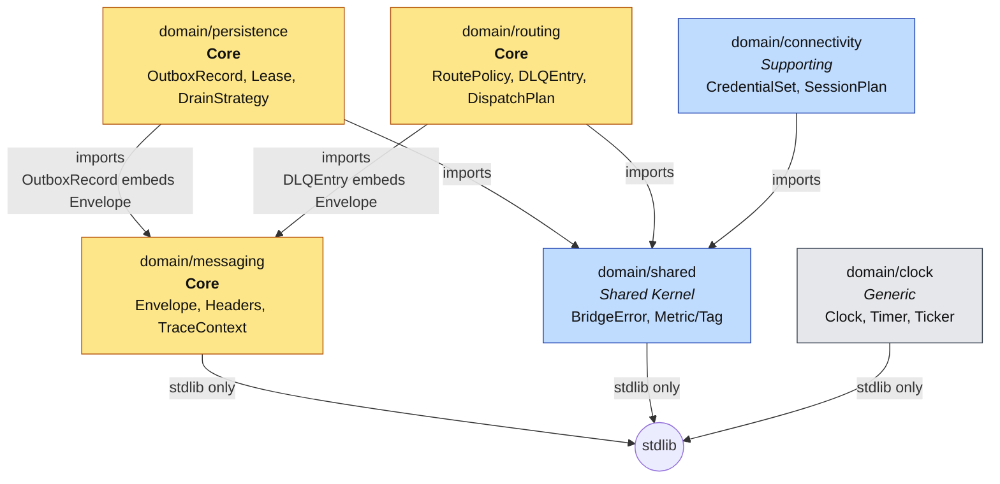
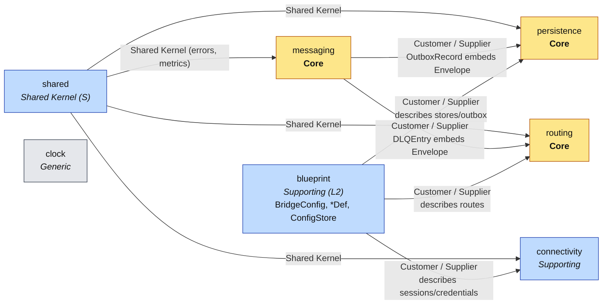

# GoBridge — Domain Model (DDD)

The GoBridge domain layer (`domain/`, Clean Architecture Layer 1) is split into six bounded contexts plus a cross-context `events` facts package. Each context owns its primitives, invariants, and ubiquitous-language terms; cross-context coupling is allow-listed in `.go-arch-lint.yml` and re-checked at file scope by `.golangci.yml` `depguard`.

For term definitions see [UBIQUITOUS.md](UBIQUITOUS.md).

---

## 1. Bounded contexts at a glance

| Context | Package | Subdomain | Purpose |
|---|---|---|---|
| Shared Kernel | `domain/shared` | Supporting | Errors (`BridgeError`, `ErrorClass`, `ErrorCode`), metric/tag taxonomy. Imported by every other context. |
| Messaging | `domain/messaging` | **Core** | The canonical `Envelope`, reserved header vocabulary (`x-bridge.*`), W3C Trace Context. |
| Persistence | `domain/persistence` | **Core** | `OutboxRecord` state machine (reliable egress), `LeaseInfo`+`LeaseToken` (cluster fencing), `DrainStrategy` polling policy. |
| Routing | `domain/routing` | **Core** | `RoutePolicy`, `DestinationBinding`, `DispatchPlan`, `DLQEntry` — route decisions and dead-letter records. |
| Connectivity | `domain/connectivity` | Supporting | `CredentialSet` (Password + TLS), `SessionPlan` (desired Subscriptions/Publishers), and the Layer-2 `ManagedSubscriptionStore` port for exact durable filter history. |
| Events | `domain/events` | Generic | Past-tense observability **facts** about the persistence, routing, connectivity, and configuration contexts (outbox lifecycle, lease fencing, DLQ ingress/redrive, credential rotation, blueprint commit). Constructed by application/runtime services via public constructors (e.g. `NewOutboxRecordClaimed`) **after** a transition succeeds and published through `ports.EventPublisher` — **not** raised by aggregates. Carry primitive payload fields only, so consumers deserialise without importing a producer context. |
| Clock | `domain/clock` | Generic | Time abstraction (`Clock`, `Timer`, `Ticker`). Stdlib-only, no `Sleep` by design — every wait must be cancellable. |

All seven `domain/` packages are stdlib-only at runtime (the `_no_external_deps_` sentinel in `.go-arch-lint.yml`). `domain/events` is the one package that owns no aggregate — it carries facts the application/runtime emit about the other contexts (see `domain/events/doc.go`).

In addition to the seven Layer-1 `domain/` packages above, GoBridge has a **Blueprint / Configuration** *supporting* subdomain that lives at Layer 2 (in `ports/blueprint*.go` plus the `config/` parser/store) and represents the parsed-but-not-yet-built shape of a bridge:

| Context | Package | Subdomain | Purpose |
|---|---|---|---|
| Blueprint / Configuration | `ports` (types) + `config` (parser/store) | Supporting (Layer 2) | The declarative bridge shape: `BridgeConfig`, `BridgeSettings`, `SessionDef`, `BindingDef`, `RouteDef`, `BlueprintValidationError`, `ConfigStore`. Consumed by `bridge.Builder` and the admin `httpapi`. The `ports/` blueprint types are **schema-tagged DTOs** — they carry yaml/json struct *tags* but the `ports` package has no yaml/json runtime *dependency*; the YAML/JSON parser, validator, merger and on-disk manager live in `config/`. |

The Blueprint context is a **Customer/Supplier** consumer of the Routing, Connectivity, and Persistence cores — it *describes* their runtime composition without owning their invariants. See §5 for the context-map edges.

---

## 2. Context map — who imports whom

The allowed-import edges above are the domain-context rules. Their machine-readable definitions and per-file `depguard` enforcement are documented in [LINT.md](LINT.md); the layer-level rules table lives in [ARCHITECTURE.md §2](ARCHITECTURE.md#2-hexagonal-architecture-layers). `persistence → messaging` is the one cross-context edge — `OutboxRecord.Envelope` is a `messaging.Envelope` value, so an outbox record IS a persisted envelope.

---

## 3. Aggregates, entities, value objects per context

The per-context catalogue — every aggregate, entity and value object with the
invariants it enforces — is on its own page:
[Aggregates, entities and value objects per context](docs/internals/ddd-aggregates.md).

## 4. Outer-ring consumers (who depends on the domain)

Layer-by-layer dependencies (composition root → adapters → application → ports → domain), the full per-component allowed-imports table, and the allow-listed inward edges from outer rings live in [ARCHITECTURE.md §2 Hexagonal Architecture Layers](ARCHITECTURE.md#2-hexagonal-architecture-layers). They are part of the runtime layering, not the domain model — kept out of this file so DDD.md stays bounded-context-shaped.

---

## 5. Cross-context relationships (context-map style)

- **Messaging is upstream** of persistence and routing. Persistence and routing model "an `Envelope` that has been persisted / has failed routing". Messaging is the publisher of the canonical message shape; persistence and routing are consumers (Customer/Supplier in DDD terms).
- **Shared is the Shared Kernel** — every other context depends on its error class/code taxonomy. Changes to `BridgeError` ripple everywhere; this is intentional and reviewed.
- **Connectivity, Routing, and Persistence do not know about each other.** They communicate only by exchanging `messaging.Envelope` and `shared.BridgeError` values through ports defined in Layer 2.
- **Blueprint (Layer 2)** is *upstream* in description but *downstream* in dependency: `bridge.Builder` consumes a `BridgeConfig` and produces concrete adapters for routing, connectivity, and persistence. The blueprint context defines no domain invariants of its own — it borrows the vocabulary of the cores it composes (Customer/Supplier).

---

## 6. Invariant summary (one line each)

| Invariant | Owner | Enforced by |
|---|---|---|
| Reserved-prefix headers (`x-bridge.*`) cannot be set by external sources at ingress | messaging | `StripReservedHeaders`, `MergeHeaders(protectReserved=true)` |
| `Envelope.Clone()` isolates mutable headers while sharing immutable payload backing; payload exposure copies and transformation replaces backing | messaging | `Clone`, `Payload`, `SetPayload` + `audit_deep_copy_test.go`, `envelope_shared_payload_test.go` |
| `traceparent` rejects non-`00`, all-zero IDs, non-low-hex | messaging | `ParseTraceparent` + `audit_tracecontext_test.go` |
| Outbox state machine: `pending → claimed → completed \| expired` | persistence | `OutboxStatus` constants + adapter contract tests |
| Lease fencing: only holder of current `LeaseToken{Owner,Version}` may write | persistence | `ClaimVersion` optimistic check, `ErrCodeStaleFencingToken` |
| Drain wait is always cancellable | persistence + clock | `DrainStrategy.NextInterval` + `Clock.After` |
| `RoutePolicy` zero-fields collapse to documented defaults | routing | `RoutePolicy.WithDefaults()` |
| Credentials redact in `String`/`GoString` | connectivity | `PasswordCredential.String`, `TLSMaterial.String` |
| `CredentialSet.Equal` is value-based for push-rotation dedup | connectivity | `CredentialSet.Equal` + tests |
| Time waits are cancellable; no `Sleep` exists | clock | `Clock` interface (no `Sleep` method) |
| Errors are classified by `ErrorClass` to drive retry / DLQ / drop | shared | `BridgeError.Class`, runtime classifier |

---

## 7. Where to read more

- **Architectural rules and lint:** `.go-arch-lint.yml`, `.golangci.yml` (depguard rules per context), `scripts/lint-arch-mapping-test.sh`.
- **Layer overview:** `ARCHITECTURE.md`.
- **Term glossary:** `UBIQUITOUS.md`.
- **Source of truth:** the `domain/<context>/doc.go` files describe each context in one paragraph at the top of the package.
