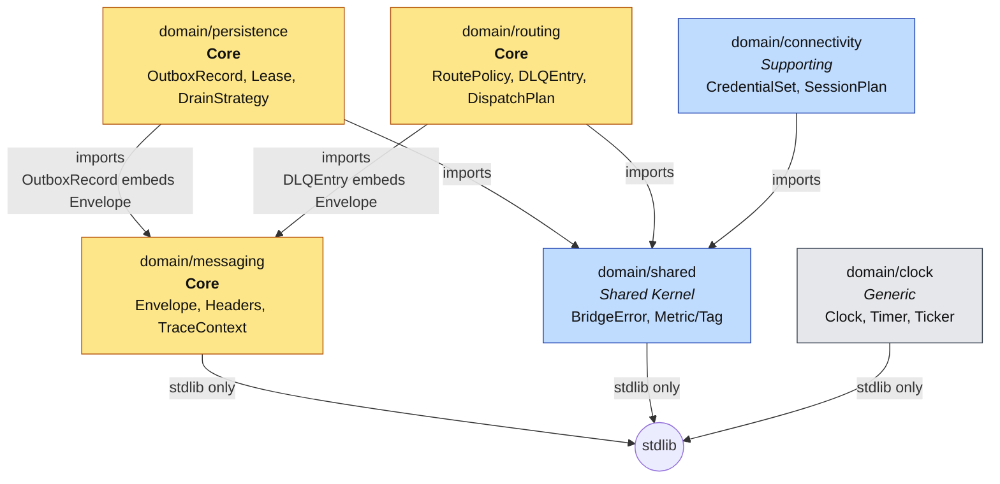
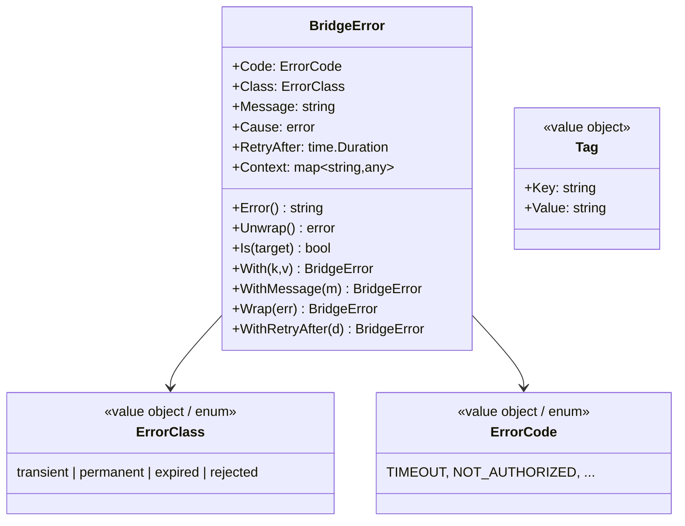
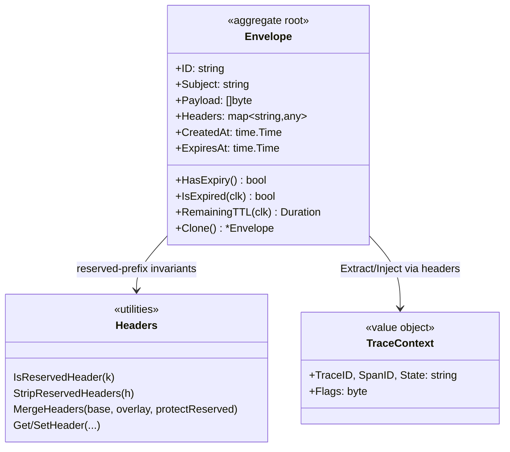
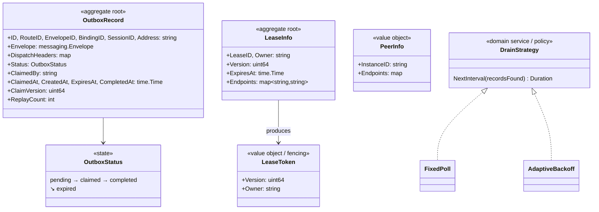
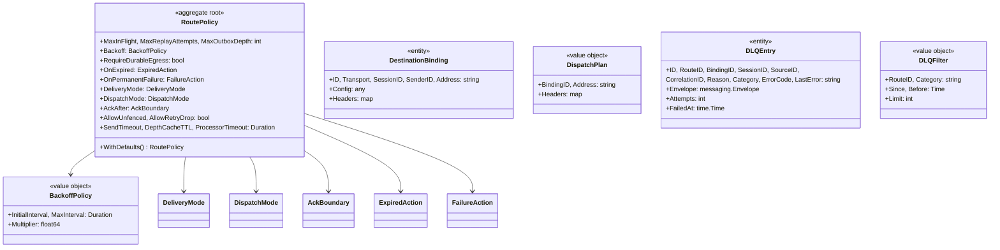
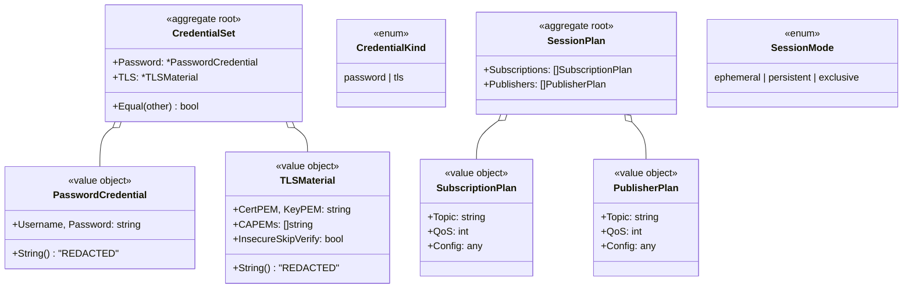
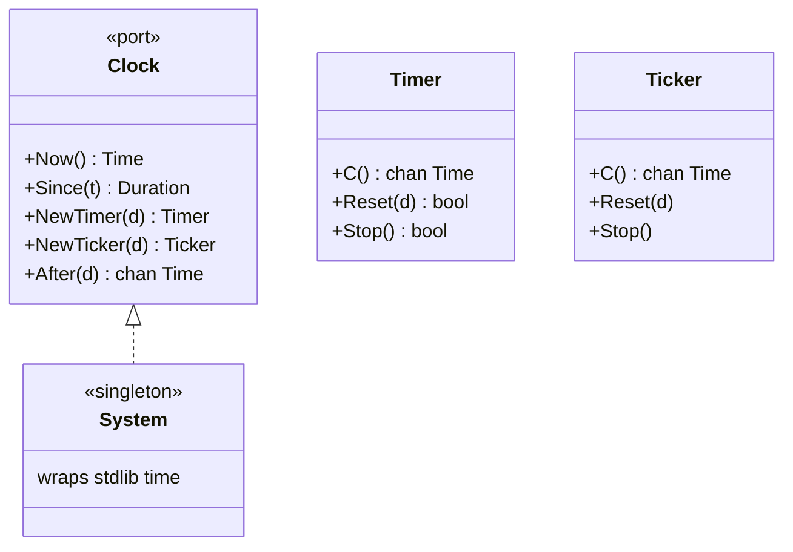
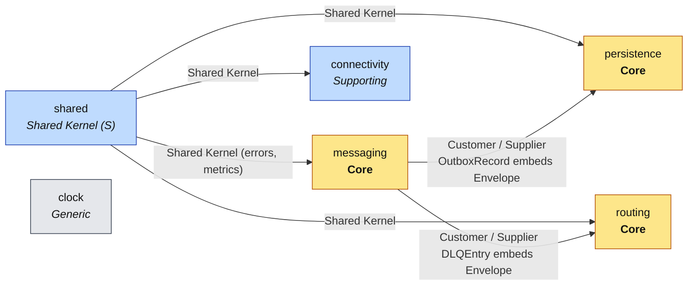

# GoBridge — Domain Model (DDD)

The GoBridge domain layer (`domain/`, Clean Architecture Layer 1) is split into six bounded contexts. Each context owns its primitives, invariants, and ubiquitous-language terms; cross-context coupling is allow-listed in `.go-arch-lint.yml` and re-checked at file scope by `.golangci.yml` `depguard`.

For term definitions see [UBIQUITOUS.md](UBIQUITOUS.md).

---

## 1. Bounded contexts at a glance

| Context | Package | Subdomain | Purpose |
|---|---|---|---|
| Shared Kernel | `domain/shared` | Supporting | Errors (`BridgeError`, `ErrorClass`, `ErrorCode`), metric/tag taxonomy. Imported by every other context. |
| Messaging | `domain/messaging` | **Core** | The canonical `Envelope`, reserved header vocabulary (`x-bridge.*`), W3C Trace Context. |
| Persistence | `domain/persistence` | **Core** | `OutboxRecord` state machine (reliable egress), `LeaseInfo`+`LeaseToken` (cluster fencing), `DrainStrategy` polling policy. |
| Routing | `domain/routing` | **Core** | `RoutePolicy`, `DestinationBinding`, `DispatchPlan`, `DLQEntry` — route decisions and dead-letter records. |
| Connectivity | `domain/connectivity` | Supporting | `CredentialSet` (Password + TLS), `SessionPlan` (desired Subscriptions/Publishers). |
| Clock | `domain/clock` | Generic | Time abstraction (`Clock`, `Timer`, `Ticker`). Stdlib-only, no `Sleep` by design — every wait must be cancellable. |

All six contexts are stdlib-only at runtime (the `_no_external_deps_` sentinel in `.go-arch-lint.yml`).

---

## 2. Context map — who imports whom

**Rules enforced by `.go-arch-lint.yml` (deps block):**

- `shared`, `messaging`, `clock` — no domain dependencies (stdlib only).
- `persistence` — `shared` + `messaging` only.
- `routing` — `shared` + `messaging` only.
- `connectivity` — `shared` only.
- No domain context may import another domain context outside this list.
- `.golangci.yml` adds six per-context `depguard` rules so violations surface at file scope before `go-arch-lint` runs.

**Pragmatic deviation (FIX-004 phase 5):** `persistence → messaging` is permitted because `OutboxRecord.Envelope` is a `messaging.Envelope` value — an outbox record IS a persisted envelope. Banning the edge would force an opaque payload-bytes + headers map and an Envelope reconstruction on every read.

---

## 3. Aggregates, entities, value objects per context

### 3.1 `domain/shared` — Shared Kernel

- **`BridgeError`** — structured error carrying classification (`Class`) and identity (`Code`). Treated as a copy-on-write value: `With*` methods return a clone. Used by every adapter and runtime component to drive retry / DLQ / drop decisions.
- **`ErrorClass`** — drives pipeline routing:
  `transient` → retry, `permanent` → DLQ, `expired` → expired-action policy, `rejected` → drop.
- **`ErrorCode`** — sentinel identity for `errors.Is` comparisons.
- Metric and tag-key constants — single source of truth for the metric taxonomy.

### 3.2 `domain/messaging` — Core (the canonical message)

- **`Envelope`** — aggregate root for the messaging context. Invariants:
  - `Clone()` deep-copies `Headers` and `Payload` so reference values are never shared between original and clone.
  - Expiry checks must take a `Clock` (no implicit `time.Now()`).
- **Reserved header invariant** — keys with prefix `x-bridge.` are bridge-internal. `IsReservedHeader` is case-insensitive; transport adapters must `StripReservedHeaders` at ingress to prevent injection. `MergeHeaders(..., protectReserved=true)` denies overlay overrides of reserved keys already in base.
- **`TraceContext`** — W3C Trace Context VO. `ParseTraceparent` rejects non-`00` versions, all-zero IDs, wrong lengths, non-lowercase hex.

### 3.3 `domain/persistence` — Core (reliable egress + cluster fencing)

**Invariants:**

- `OutboxRecord.Status` follows the state machine `pending → claimed → completed | expired`. Only the lease holder identified by `LeaseToken{Owner, Version}` may claim; `ClaimVersion` enforces fencing on optimistic update.
- `OutboxPartitionKey(sessionID, bindingID)` is the canonical key — `SESSION#<id>` if session is set, else `BINDING#<id>`.
- `LeaseInfo.Version` is monotonic. Stale-token writes return `shared.ErrCodeStaleFencingToken`.
- `DrainStrategy.NextInterval` is the **only** way the drainer learns its next wait. `FixedPoll` returns a constant ±25 % jitter; `AdaptiveBackoff` resets to `MinInterval` when records were found, else multiplies up to `MaxInterval`. `AdaptiveBackoff` is single-goroutine.

### 3.4 `domain/routing` — Core (route decisions + DLQ)

**Invariants:**

- `RoutePolicy.WithDefaults()` is the single canonical normalization step — every zero-or-invalid field collapses to a documented default (`DefaultMaxInFlight`, `DefaultSendTimeout`, …). Callers should not hand-fill defaults elsewhere.
- `DeliveryMode` (`direct_hold` | `shared_outbox`), `DispatchMode` (`single` | `fan_out`), `AckBoundary` (`target_accept` | `outbox_persist`) are exhaustive enums.
- `DLQEntry.Envelope` is the immutable snapshot of the envelope at failure; `Attempts` and `FailedAt` describe the failure event.

### 3.5 `domain/connectivity` — Supporting (auth + reconciliation shape)

**Invariants:**

- Credential types redact in `String()` / `GoString()` — the `%v` / `%+v` of a credential **never** discloses material.
- `CredentialSet.Equal` is a deep value comparison; push-credential adapters use it to dedup rotation events so no-change resolves do not emit.
- `SessionPlan` is the **desired** state of a transport session — adapters reconcile actual subscriptions/publishers toward this plan.

### 3.6 `domain/clock` — Generic (time abstraction)

**Invariant:** `Clock` exposes no `Sleep`. Every wait must be expressed as
`select { case <-ctx.Done(): case <-clk.After(d): }` so cancellability is enforced at the type level. Tests use `domain/clock/clocktest` (excluded from arch lint).

---

## 4. Outer-ring consumers (who depends on the domain)

The application/use-case ring (Layer 2) and adapters (Layer 3) depend **inward** on every relevant domain context. The diagram shows direction of dependency (A → B = A imports B).

```mermaid
flowchart LR
    subgraph L4 [Layer 4 - composition root]
        cmd
        deployment
    end
    subgraph L3 [Layer 3 - Interface Adapters]
        httpapi
        processors
        adapters_transport["adapter_transport_*<br/>mqtt/sqs/asb/amqp091/amqp10/http"]
        adapters_store["adapter_store_*<br/>memory/sqlite/dynamodb"]
        adapters_config["adapter_config_*"]
        adapters_creds["adapter_credentials_*"]
        adapters_obs["adapter_metrics_* / adapter_tracing_*"]
        adapters_cluster["adapter_cluster_*"]
    end
    subgraph L2 [Layer 2 - Application + Ports + Shared kernel]
        ports
        config
        runtime
        bridge
        validate
        circuitbreaker
        logging
        observability
    end
    subgraph L1 [Layer 1 - Domain]
        shared
        messaging
        persistence
        routing
        connectivity
        clock
    end

    L4 --> L3
    L4 --> L2
    L3 --> L2
    L3 --> L1
    L2 --> L1

    persistence --> shared
    persistence --> messaging
    routing --> shared
    routing --> messaging
    connectivity --> shared
```

Key allow-listed inward edges from outer rings (excerpt from `.go-arch-lint.yml`):

- `ports`, `config`, `runtime`, `validate`, `bridge`, `circuitbreaker` — may depend on **all** domain contexts (`shared`, `messaging`, `persistence`, `routing`, `connectivity`, `clock`).
- `config` is the only inner-ring component allowed external vendors (`yaml.v3`, `mapstructure`) — the domain is format-neutral.
- Each transport / store adapter category is split per technology so a flaw in one adapter cannot leak into another via shared types.

---

## 5. Cross-context relationships (context-map style)

- **Messaging is upstream** of persistence and routing. Persistence and routing model "an `Envelope` that has been persisted / has failed routing". Messaging is the publisher of the canonical message shape; persistence and routing are consumers (Customer/Supplier in DDD terms).
- **Shared is the Shared Kernel** — every other context depends on its error class/code taxonomy. Changes to `BridgeError` ripple everywhere; this is intentional and reviewed.
- **Connectivity, Routing, and Persistence do not know about each other.** They communicate only by exchanging `messaging.Envelope` and `shared.BridgeError` values through ports defined in Layer 2.

---

## 6. Invariant summary (one line each)

| Invariant | Owner | Enforced by |
|---|---|---|
| Reserved-prefix headers (`x-bridge.*`) cannot be set by external sources at ingress | messaging | `StripReservedHeaders`, `MergeHeaders(protectReserved=true)` |
| `Envelope.Clone()` deep-copies headers and payload | messaging | `Clone` + `audit_deep_copy_test.go` |
| `traceparent` rejects non-`00`, all-zero IDs, non-low-hex | messaging | `ParseTraceparent` + `audit_tracecontext_test.go` |
| Outbox state machine: `pending → claimed → completed \| expired` | persistence | `OutboxStatus` constants + adapter contract tests |
| Lease fencing: only holder of current `LeaseToken{Owner,Version}` may write | persistence | `ClaimVersion` optimistic check, `ErrCodeStaleFencingToken` |
| Drain wait is always cancellable | persistence + clock | `DrainStrategy.NextInterval` + `Clock.After` |
| `RoutePolicy` zero-fields collapse to documented defaults | routing | `RoutePolicy.WithDefaults()` |
| Credentials redact in `String`/`GoString` | connectivity | `PasswordCredential.String`, `TLSMaterial.String` |
| `CredentialSet.Equal` is value-based for push-rotation dedup | connectivity | `CredentialSet.Equal` + tests |
| Time waits are cancellable; no `Sleep` exists | clock | `Clock` interface (no `Sleep` method) |
| Errors are classified by `ErrorClass` to drive retry / DLQ / drop | shared | `BridgeError.Class`, runtime classifier |

---

## 7. Where to read more

- **Architectural rules and lint:** `.go-arch-lint.yml`, `.golangci.yml` (depguard rules per context), `scripts/lint-arch-mapping-test.sh`.
- **Layer overview:** `ARCHITECTURE.md`.
- **Term glossary:** `UBIQUITOUS.md`.
- **Source of truth:** the `domain/<context>/doc.go` files describe each context in one paragraph at the top of the package.
