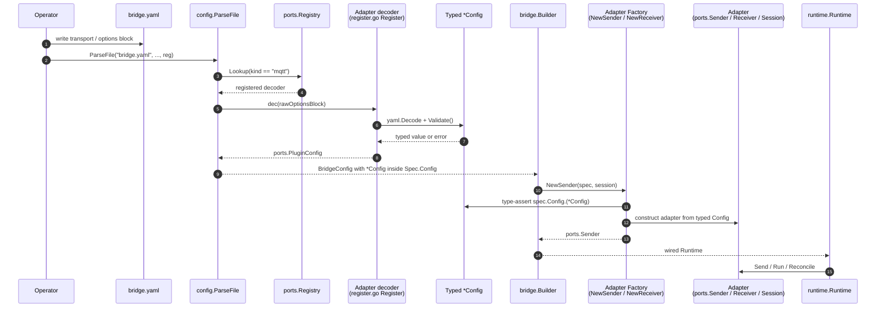

# Plugin Guide

This guide explains how to extend gobridge with custom transport adapters, store backends, credential repositories, observability exporters, and message processors.

All extension points follow the hexagonal architecture: implement a port interface from `ports/`, expose a typed `ports.PluginConfig`, register a decoder on a `*ports.Registry` via an exported `Register(reg *ports.Registry) error`, register the factory with the `bridge.Builder`, and gobridge handles the rest. The architectural framing for this contract lives in [DDD.md](DDD.md), [UBIQUITOUS.md](UBIQUITOUS.md), and [`docs/typed-plugin-config.adoc`](docs/typed-plugin-config.adoc).

> **Note on options decoding.** Adapters expose a
> typed `Config` struct (`ports.PluginConfig`) and ship an exported
> `Register(reg *ports.Registry) error` in `register.go` that the
> composition root calls explicitly — there is no `init()` side effect
> and no process-wide registry. The runtime never hands
> `map[string]any` to plugin code. See
> [Typed Plugin Config](#typed-plugin-config).


## Transport Adapters

Transport adapters connect gobridge to messaging systems. A transport provides message ingress (Receiver), egress (Sender), and optionally a stateful connection (Session).

### Port Interfaces

From `ports/transport.go`:

```go
type Delivery interface {
    Envelope() *messaging.Envelope
    Ack(ctx context.Context) error
    Retry(ctx context.Context, after time.Duration, reason error) error
    Extend(ctx context.Context, until time.Time) error
}

type Receiver interface {
    Run(ctx context.Context, emit func(context.Context, Delivery) error) error
}

// OutboundMessage carries an envelope together with the per-dispatch
// transport destination resolved by the runtime (DispatchPlan.Address).
// Senders MUST publish to OutboundMessage.Address — they MUST NOT read a
// destination out of OutboundMessage.Envelope.Subject (which is the
// logical event subject and is not a transport destination).
type OutboundMessage struct {
    Envelope *messaging.Envelope
    Address  string
}

type Sender interface {
    Send(ctx context.Context, msg OutboundMessage) error
}

type BatchResult struct {
    Index int   // index into the input slice
    Err   error // nil on success
}

type BatchSender interface {
    Sender
    SendBatch(ctx context.Context, msgs []OutboundMessage) ([]BatchResult, error)
}

type Session interface {
    Start(ctx context.Context) error
    Reconcile(ctx context.Context, plan connectivity.SessionPlan) error
    Health(ctx context.Context) SessionHealth
    Events() <-chan SessionEvent
    Close(ctx context.Context) error
}
```

### Transport Factory (ports-first)

To integrate with the builder, implement `ports.TransportFactory` (from
`ports/factories.go`). Each spec carries a typed `ports.PluginConfig`
the adapter has registered (see [Typed Plugin Config](#typed-plugin-config)
below — this is the single source of truth for adapter-specific
options, and it replaces the old `Options map[string]any` decoding):

```go
type TransportFactory interface {
    NewSession(ctx context.Context, spec ports.SessionSpec) (ports.Session, error)
    NewReceiver(ctx context.Context, spec ports.ReceiverSpec, session ports.Session) (ports.Receiver, error)
    NewSender(ctx context.Context, spec ports.SenderSpec, session ports.Session) (ports.Sender, error)
    Capabilities() []ports.Capability
}
```

The bridge converts the declarative `config.*Def` shapes into
`ports.*Spec` values, with the adapter's typed `PluginConfig`
already attached on `Spec.Config`, before invoking the factory. The
plugin only sees ports types, so a transport adapter never needs to
import `bridge` or `config` — its only inner-ring dependencies are
`ports` (and `domain`, `logging` as needed).

For stateless transports, `NewSession` should return `(nil, nil)`.

Optional companion interfaces (also in `ports`):

- `ports.VisibilityTimeoutProvider` — declares the source visibility
  timeout used by the runtime validator (e.g. SQS).

Transports that expose HTTP endpoints (e.g. the HTTP source / SSE
sink) deliberately do not have a port-level abstraction: HTTP handlers
are inherently HTTP, so the composition root wires them via the
adapter's concrete type rather than through `ports/` (keeping
`net/http` out of the inner ring).

### Registration

```go
builder.RegisterTransport("mytransport", myTransportFactory)
```

The `"mytransport"` name must match the `transport` field in config YAML:

```yaml
receivers:
  - id: my-receiver
    transport: mytransport
    options:
      endpoint: "..."
```

### Implementation Pattern

**Typical file layout:**

```
adapters/mycloud/transport/myqueue/
├── doc.go              # Package documentation
├── go.mod              # Separate module
├── config.go           # ReceiverConfig, SenderConfig, option parsing
├── errors.go           # Map SDK errors to shared.BridgeError
├── receiver.go         # ports.Receiver implementation
├── sender.go           # ports.Sender implementation
├── delivery.go         # ports.Delivery implementation
├── headers.go          # Transport-specific header mapping
├── factory.go          # Transport factory (ports.TransportFactory)
├── receiver_test.go    # Unit tests
└── sender_test.go
```

**Key implementation concerns:**

1. **Delivery mapping**: Map transport-native ack/nack/extend to `ports.Delivery`. For example, SQS maps `Ack` to `DeleteMessage`, `Retry` to `ChangeMessageVisibility`, `Extend` to visibility extension.

2. **Error mapping**: Create an `errors.go` that maps SDK error codes to `shared.BridgeError` with correct classification (Transient vs Permanent vs Rejected).

3. **Header mapping**: Map transport-native message properties to `messaging.Envelope.Headers` and vice versa. Strip `x-bridge.*` reserved headers at ingress.

4. **Typed config**: Export a concrete `Config` struct satisfying
   `ports.PluginConfig` and register its decoder via an exported
   `Register(reg *ports.Registry) error` in `register.go` (the
   composition root calls it explicitly; no `init()`, no process-wide
   registry). The adapter receives its already-decoded typed config via
   `Spec.Config` — it never decodes `map[string]any`, and plugin shapes
   never enter the core `config` package. See
   [Typed Plugin Config](#typed-plugin-config) below.

5. **Capabilities**: Return appropriate `ports.Capability` values:
   - `CapStatefulSession` -- transport uses sessions (e.g. MQTT)
   - `CapVisibilityExtension` -- supports deadline extension (e.g. SQS)
   - `CapSourceRedelivery` -- transport redelivers on nack (e.g. SQS)
   - `CapDelayedSend` -- supports delayed delivery
   - `CapSharedConsumer` -- broker load-balances one subscription across a consumer group (e.g. MQTT `$share`)
   - `CapExclusiveIdentity` -- session owns a unique client identity (lease-based single holder); **must be single-use** -- see the lifecycle note below

**Exclusive sessions are single-use.** A transport that declares
`CapExclusiveIdentity` must treat `Start`-after-`Close` as a permanent error:
once `Close` runs, a later `Start` returns `shared.ErrUnavailable` rather than
reconnecting. The runtime depends on this -- when a lease-owning session cannot
renew, it escalates to a terminal state (`ErrSessionUnrecoverable`), releases the
lease so a standby takes over, and lets the orchestrator restart the process with
a fresh session. A transport that silently reconnected a closed exclusive session
would break lease fencing. `CapExclusiveIdentity` is declared by paho MQTT
(always) and amqp091 (latched on first exclusive use); amqp10 does not advertise
the capability but is subject to the same single-use rule when run as an
exclusive session.

**Compile-time interface checks:**

```go
var _ ports.Receiver = (*Receiver)(nil)
var _ ports.Sender = (*Sender)(nil)
var _ ports.TransportFactory = (*Factory)(nil)
```

### Reference Implementations

- **Stateful (MQTT)**: `adapters/mqtt/transport/paho/` -- full Session
  with Reconcile; `paho.Factory` directly satisfies `ports.TransportFactory`.
- **Stateless (SQS)**: `adapters/aws/transport/sqs/` -- composes
  `ReceiverFactory` and `SenderFactory` into a unified `Factory` that
  also satisfies `ports.VisibilityTimeoutProvider`.
- **Stateless (ASB)**: `adapters/azure/transport/servicebus/` -- auto-
  extend message lock, batch send with size-limited batches.

## Store Adapters

Store adapters provide persistence for leases, outbox records, and DLQ entries.

### Port Interfaces

From `ports/stores.go`:

```go
type LeaseStore interface {
    Acquire(ctx context.Context, leaseID string, ownerID string, ttl time.Duration, endpoints map[string]string) (persistence.LeaseToken, error)
    Renew(ctx context.Context, leaseID string, token persistence.LeaseToken, ttl time.Duration, endpoints map[string]string) (persistence.LeaseToken, error)
    Release(ctx context.Context, leaseID string, token persistence.LeaseToken) error
    Current(ctx context.Context, leaseID string) (persistence.LeaseInfo, error)
}

type OutboxStore interface {
    Persist(ctx context.Context, records []*persistence.OutboxRecord) error
    Claim(ctx context.Context, partitionKey string, token persistence.LeaseToken, limit int) ([]*persistence.OutboxRecord, error)
    Complete(ctx context.Context, recordIDs []string, token persistence.LeaseToken) error
    Expire(ctx context.Context, before time.Time) (int, error)
    QueryPending(ctx context.Context, partitionKey string, limit int) ([]*persistence.OutboxRecord, error)
}

type DLQStore interface {
    Write(ctx context.Context, entry routing.DLQEntry) error
    List(ctx context.Context, filter routing.DLQFilter) ([]routing.DLQEntry, error)
    Replay(ctx context.Context, entryIDs []string) error
    Purge(ctx context.Context, before time.Time) (int, error)
}
```

### Store Factory (ports-first)

Implement `ports.StoreFactory` (from `ports/stores.go`):

```go
type StoreFactory interface {
    NewLeaseStore(ctx context.Context, cfg ports.PluginConfig) (LeaseStore, error)
    NewOutboxStore(ctx context.Context, cfg ports.PluginConfig, runtime OutboxRuntimeOptions) (OutboxStore, error)
    NewDLQStore(ctx context.Context, cfg ports.PluginConfig) (DLQStore, error)
}
```

Each method receives the typed `ports.PluginConfig` the adapter
registered on `*ports.Registry` (see
[Typed Plugin Config](#typed-plugin-config) below). The factory does
its own type assertion on the concrete config type — it never sees
`map[string]any`.

Optional companion interface:

- `ports.DistributedStoreFactory.IsDistributed() bool` — returns true
  when the store provides cross-process coordination. Required for
  clustered deployments.

Return `(nil, nil)` for store types the factory does not support.

### Registration

```go
builder.RegisterStoreFactory("mybackend", myStoreFactory)
```

Config:

```yaml
stores:
  lease:
    type: mybackend
    options:
      connection_string: "..."
```

### Conformance Testing

Use the built-in conformance test suites in `ports/storetest/`:

```go
func TestMyStore(t *testing.T) {
    store := mybackend.NewStore(/* ... */)
    storetest.RunDLQStoreTests(t, store)
    storetest.RunOutboxStoreTests(t, store)
    storetest.RunLeaseStoreTests(t, store, nil)
}
```

These suites verify all required behaviors (idempotency, filtering, fencing, etc.).

### Reference Implementations

- **Memory**: `adapters/native/store/memory*/` -- sync.Mutex + maps, good for tests
- **SQLite**: `adapters/native/store/sqlite*/` -- WAL mode, modernc.org/sqlite, JSON marshaling
- **DynamoDB**: `adapters/aws/store/dynamodb*/` -- conditional writes, GSIs, TTL compaction

## Credential Adapters

Credential adapters resolve secrets by URI scheme.

### Port Interfaces

From `ports/credentials.go`:

```go
type CredentialRepository interface {
    Scheme() string
    Namespace() string
    Get(ctx context.Context, uri string) (*connectivity.CredentialSet, error)
}

type CredentialAdmin interface {
    CredentialRepository
    Create(ctx context.Context, uri string, creds *connectivity.CredentialSet) error
    Update(ctx context.Context, uri string, creds *connectivity.CredentialSet, version int64) error
    Delete(ctx context.Context, uri string, version int64) error
    List(ctx context.Context, prefix string) ([]string, error)
}
```

### Registration

Register on the `CredentialResolver`:

```go
resolver := runtime.NewCredentialResolver()
resolver.Register(myRepo)
builder := bridge.NewBuilder(cfg, bridge.WithCredentialStore(resolver))
```

The resolver dispatches by URI scheme (`file://`, `pms://`, `vault://`) with longest-prefix namespace matching.

### Domain Types

`connectivity.CredentialSet` contains optional `*PasswordCredential` and `*TLSMaterial`. Credential values must never appear in logs.

### Reference Implementations

- **File**: `adapters/native/credentials/file/` -- scheme `"file"`, filesystem-based, supports CredentialAdmin
- **SSM**: `adapters/aws/credentials/ssm/` -- scheme `"pms"`, AWS Parameter Store

### Runtime Rotation

Transport sessions (or receivers/senders) that want to accept rotated
credentials on a live connection implement the
`bridge.CredentialAware` capability interface:

```go
type CredentialAware interface {
    ApplyCredentials(ctx context.Context, creds *connectivity.CredentialSet) error
}
```

The `bridge.CredentialRefresher` discovers participating transports
via a silent type assertion -- non-aware transports (HTTP, stateless
adapters) coexist cleanly in the same bridge.

`ApplyCredentials` receives the full `*CredentialSet` (password and
TLS material together); the implementation dispatches on what
changed and triggers the appropriate rebuild (reconnect for
stateful transports, client swap for stateless ones). See
[`docs/credentials-rotation.md`](docs/credentials-rotation.md) for
the full contract, per-transport behaviour matrix, and worked
examples of adding a new rotatable capability or writing a new
transport that participates in rotation.

A transport that authenticates on a live connection may call
`CredentialRefresher.NotifyAuthFailure(uri, err)` when the broker reports
`NOT_AUTHORIZED`, forcing an immediate credential re-resolve instead of waiting
for the poll interval (rate-limited per URI). Resolve and rotation observability
is built in and not your plugin's job: the resolver emits
`CredentialResolveFailure` and `CredentialStaleServed`, the refresher emits
`CredentialRotationApplied`, and the poll wrapper emits
`CredentialRefreshFailures`.

## Observability Adapters

### Metrics

Implement `ports.MetricsExporter`:

```go
type MetricsExporter interface {
    Counter(name string, value int64, tags ...shared.Tag)
    Gauge(name string, value float64, tags ...shared.Tag)
    Histogram(name string, value float64, tags ...shared.Tag)
    Timer(name string, duration time.Duration, tags ...shared.Tag)
    Flush(ctx context.Context) error
    Close(ctx context.Context) error
}
```

Pass to runtime: `runtime.WithMetrics(exporter)`.

Reference: `adapters/otel/metrics/` (OTLP), `adapters/aws/metrics/cloudwatch/`.

### Tracing

Implement `ports.Tracer`:

```go
type Tracer interface {
    StartSpan(ctx context.Context, name string, attrs ...shared.Tag) (context.Context, Span)
}

type Span interface {
    End()
    SetError(err error)
    AddEvent(name string, attrs ...shared.Tag)
    SetAttributes(attrs ...shared.Tag)
}
```

Pass to runtime: `runtime.WithTracer(tracer)`.

Reference: `adapters/otel/tracing/`.

## Processors

Processors form an onion-model middleware chain around message delivery.

### Port Interface

From `ports/processor.go`:

```go
type ProcessorFunc func(ctx context.Context, env *messaging.Envelope) error

type Processor interface {
    Name() string
    Process(ctx context.Context, env *messaging.Envelope, next ProcessorFunc) error
}
```

A processor can:
- **Pass through**: call `next(ctx, env)` to continue the chain
- **Modify**: mutate `env` before calling `next`
- **Short-circuit**: return an error without calling `next`
- **Filter**: return `shared.ErrMessageFiltered` to intentionally discard the message. The route's `on_filtered` policy governs the outcome -- default `drop` (dropped and counted as `MessagesFiltered`); set `on_filtered: dlq` to divert filtered messages to the DLQ instead

### Registration

```go
builder.RegisterProcessor("myproc", myProcessor)
```

Reference in route config:

```yaml
routes:
  - id: my-route
    receiver_id: mqtt-in
    processors: [myproc, transform]
    bindings: [to-sqs]
```

### Implementation Example

```go
package myprocessor

import (
    "context"
    "github.com/mariotoffia/gobridge/domain/messaging"
    "github.com/mariotoffia/gobridge/ports"
)

type Processor struct {
    name string
}

var _ ports.Processor = (*Processor)(nil)

func New(name string) *Processor {
    return &Processor{name: name}
}

func (p *Processor) Name() string { return p.name }

func (p *Processor) Process(ctx context.Context, env *messaging.Envelope, next ports.ProcessorFunc) error {
    // Pre-processing: enrich headers
    env.Headers = messaging.SetHeader(env.Headers, "x-enriched", "true")

    // Call next processor in chain
    if err := next(ctx, env); err != nil {
        return err
    }

    // Post-processing (after downstream completes)
    return nil
}
```

### Reference Implementations

- **filter**: `processors/filter/` -- condition evaluation with operators (eq, ne, contains, regex, gt, lt, exists, in), actions (pass, drop, route)
- **transform**: `processors/transform/` -- JSON field mapping with JSONPath, type coercion
- **circuitbreaker**: `processors/circuitbreaker/` -- per-key state machine, returns `shared.ErrUnavailable.WithRetryAfter()`. Wraps the `circuitbreaker/` package via the `ports.CircuitBreaker` resilience port; adapters that need protection consume the port (never the package). See [ARCHITECTURE.md §2.2 Resilience Ports](ARCHITECTURE.md#22-resilience-ports).
- **tenant**: `processors/tenant/` -- header-based tenant extraction, validation, usage tracking

### Concurrency and timeout contract

Every processor runs under a **per-processor time budget** (route policy
`ProcessorTimeout`, default 30s). The budget bounds a processor's **own**
execution time, not the whole downstream chain: the runtime disarms the timer
while the processor is blocked inside `next(...)` and rearms it when `next`
returns, so an outer processor is never charged for time spent deeper in the
chain. It is not a single shared budget that shrinks as the chain descends.

When a processor overruns its own budget the runtime cancels its context and the
delivery fails with `shared.ErrProcessorTimeout` (transient). A genuine overrun
is tagged `reason=processor-timeout` and increments the `ProcessorTimeouts`
metric. An overrun observed only because the route is shutting down is tagged
`reason=shutdown-grace-exceeded` and is **not** counted -- that is shutdown, not
a slow processor. A panicking processor returns `shared.ErrProcessorPanic`
(permanent).

Two hard rules for custom processors:

- **Honour context cancellation.** When the passed `ctx` is cancelled, stop work
  and return. The runtime cancels an over-budget processor's context to unwind
  it; a processor that ignores cancellation is abandoned as a leaked goroutine
  while the route refuses to merge its result.
- **Do not mutate the envelope after calling `next()`.** Read or write
  `env.Headers` only *before* you delegate to `next(ctx, env)`. Once you have
  called `next`, treat the envelope as read-only.

Both rules exist for the same reason. An abandoned, timed-out processor goroutine
still holds this frame's shared envelope clone. A processor that ignores
cancellation **and** keeps writing headers after `next()` can race a live outer
frame writing the same header map -- a concurrent map write, which crashes the
process. The shipped processors obey both rules, so the hazard is unreachable in
practice; a third-party processor that breaks the contract reintroduces it.

## Module Conventions

1. **Separate go.mod**: Every adapter and processor is its own Go module.
2. **Add to go.work**: `go work use ./adapters/mycloud/...` then `go work sync`.
3. **doc.go**: Every package needs a `doc.go` explaining its purpose.
4. **Compile-time checks**: `var _ ports.X = (*T)(nil)` for all implemented interfaces.
5. **Error mapping**: Transport adapters must have an `errors.go` mapping SDK errors to `shared.BridgeError`.
6. **Typed config**: Export a `ports.PluginConfig` and register its
   decoder via an exported `Register(reg *ports.Registry) error` in
   `register.go` (composition root calls it; no `init()`). See
   [Typed Plugin Config](#typed-plugin-config).
7. **Hexagonal direction**: Adapters depend on `ports`, `domain`, and
   their own SDK only. Adapters MUST NOT import `bridge`, `config`,
   `runtime`, or other unrelated adapters. The architecture lint step
   inside `make lint` enforces this; cross-adapter imports fail CI.
8. **Config-source adapters are special**: packages under
   `adapters/*/config/*` are the single category allowed to import
   `config` (they exist to load `*config.BridgeConfig`).

## Typed Plugin Config

Every pluggable component (transports, stores, processors, credential
sources, config sources) exposes a **typed** `Config` struct rather
than an opaque `map[string]any`. The runtime decodes the user's YAML
or JSON `options:` block into that typed struct **once**, at config-
parse time, and passes the typed value through `ports.*Spec.Config`
or directly to `StoreFactory` methods.

The full contract (including `cfgshape` analyzer rules, the wire
round-trip, error reporting, and per-step checklist) lives in
[`docs/typed-plugin-config.adoc`](docs/typed-plugin-config.adoc).
The summary below is enough to write a new adapter.

### End-to-end flow

The decoder, factory, and adapter are wired together implicitly via the
`*ports.Registry`. The sequence below traces a single transport `options:`
block from on-disk YAML to a running adapter at runtime.



Key invariants enforced along the path:

- The decoder runs **once**, at parse time. Adapter code never sees raw
  YAML/JSON or `map[string]any` (`cfgshape` rejects this).
- `Validate()` is mandatory and must do real work — empty bodies fail
  lint.
- `bridge.Builder` does not invent values; it propagates the typed
  `Config` the decoder produced into `*Spec.Config`.
- Adapter factories perform a single type assertion and return a clear
  error on mismatch. The runtime guarantees the assertion succeeds for
  correctly-registered plugins.

### The `PluginConfig` interface

From `ports/plugin_config.go`:

```go
type PluginConfig interface {
    Kind() string   // discriminator that ties this Go type to the YAML `transport:` / `type:` value
    Validate() error // pure: no I/O, no goroutines, runs once at parse time
}
```

Both methods are mandatory and both must do real work — an empty
`Validate()` is rejected by `make lint`.

### Registering the decoder

Each adapter ships a `register.go` exposing an exported
`Register(reg *ports.Registry) error` that attaches its decoder(s) to
the registry it is handed. There is **no process-wide singleton** and
**no `init()` side effect**: the composition root builds a
`*ports.Registry` with `ports.NewRegistry()` and calls each adapter's
`Register` explicitly.

```go
// adapters/mqtt/transport/paho/register.go
package paho

import (
    "errors"

    "github.com/mariotoffia/gobridge/ports"
)

// Register installs this adapter's PluginConfig decoder under the
// short ("mqtt") and fully-qualified ("mqtt.paho") discriminators.
func Register(reg *ports.Registry) error {
    dec := func(raw ports.RawConfig) (ports.PluginConfig, error) {
        var c Config
        if raw != nil {
            if err := raw.Decode(&c); err != nil {
                return nil, err
            }
        }
        if err := c.Validate(); err != nil {
            return nil, err
        }
        return &c, nil
    }
    return errors.Join(
        reg.Register("mqtt", dec),
        reg.Register("mqtt.paho", dec),
    )
}
```

Rules:

- One `register.go` file per adapter, exposing a single exported
  `Register(reg *ports.Registry) error`. The composition root wires it
  explicitly (typically via `builder.RegisterTransport` /
  `builder.RegisterStoreFactory`); registration is never an import
  side effect.
- A decoder must call `Validate()` and surface the error; the bridge
  treats parse-time errors as fatal.
- `reg.Register(kind, dec)` does **not** panic. It returns
  `ports.ErrDuplicateKind` (a typed `*shared.BridgeError`, recoverable
  via `errors.Is`) when `kind` is already registered, and
  `ports.ErrNilDecoder` when `dec` is nil. Use a separate `kind` per
  adapter or per dialect (e.g. `mqtt` and `mqtt.paho`), and join
  multiple registrations with `errors.Join` so the composition root
  sees every failure at once.

### Reading the typed config inside the factory

Factory methods receive `ports.PluginConfig` (for stores) or a
`Spec` struct whose `Config` field is `ports.PluginConfig` (for
transports). Type-assert to your concrete struct:

```go
func (f *Factory) NewSender(ctx context.Context, spec ports.SenderSpec, sess ports.Session) (ports.Sender, error) {
    cfg, ok := spec.Config.(*Config)
    if !ok {
        return nil, fmt.Errorf("paho: unexpected sender config type %T", spec.Config)
    }
    return newSender(cfg, sess), nil
}
```

The runtime guarantees `spec.Config` is the value the registered
decoder returned, so the type assertion is the only check required.

### Anti-patterns the lint rejects

The `cfgshape` analyzer (`scripts/cfgshape/analyzer.go`, run by
`make lint`) blocks the most common regressions:

- Adapters that accept `map[string]any` instead of a typed `Config`.
- `Config` types that omit `Kind()` or `Validate()`, or whose
  `Validate()` body is empty / returns `nil` unconditionally.
- `register.go` files that bypass `*ports.Registry`.
- Wire-format types (YAML/JSON tags, `json.RawMessage`) leaking
  into `domain/` or `ports/`.

If lint fires on a file you wrote, read the analyzer's message
verbatim — it points at the rule and the line.
