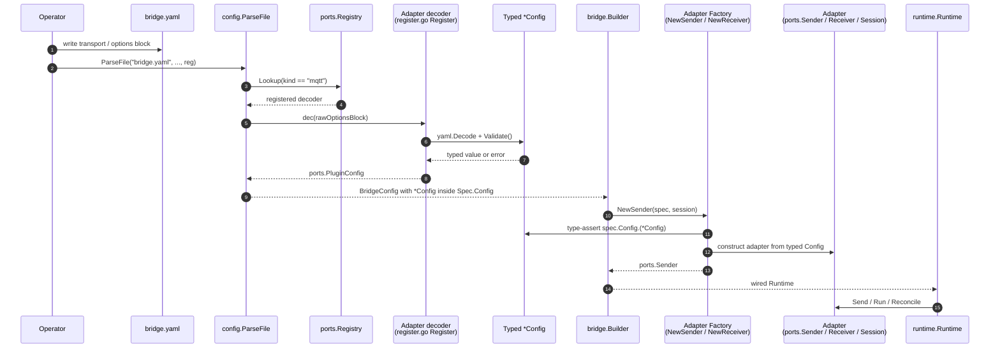

# Plugin Guide

## Overview

This guide explains how to extend gobridge with custom transport adapters, store backends, credential repositories, observability exporters, and message processors.

All extension points follow the hexagonal architecture: implement a port interface from `ports/`, expose a typed `ports.PluginConfig`, register a decoder on a `*ports.Registry` via an exported `Register(reg *ports.Registry) error`, register the factory with the `bridge.Builder`, and gobridge handles the rest. The architectural framing for this contract lives in [DDD.md](DDD.md), [UBIQUITOUS.md](UBIQUITOUS.md), and [`docs/typed-plugin-config.adoc`](docs/typed-plugin-config.adoc).

> **Note on options decoding.** Adapters expose a
> typed `Config` struct (`ports.PluginConfig`) and ship an exported
> `Register(reg *ports.Registry) error` in `register.go` that the
> composition root calls explicitly — there is no `init()` side effect
> and no process-wide registry. The runtime never hands
> `map[string]any` to plugin code. See
> [Typed Plugin Config](#typed-plugin-config).

## Adapter contracts by kind

Each adapter kind has its own contract page — the ports it implements, its
factory, its options, and how it registers:

| Kind | Page |
|---|---|
| Transports | [Transport adapters](docs/internals/plugin-transport-adapters.md) |
| Stores (lease, outbox, DLQ, managed subscriptions) | [Store adapters](docs/internals/plugin-store-adapters.md) |
| Credential sources and observability exporters | [Credential and observability adapters](docs/internals/plugin-credential-and-observability-adapters.md) |

Processors, the module conventions, and the typed-config contract below apply to
every kind.

## Binary composition (build tags)

The reference binary, `cmd/gobridge`, is a **blank root** when built without
tags: no transport, store or telemetry exporter is linked. The file config
source, `file://` credential store and admin/monitor HTTP API remain available.
`-admin-addr` plus `GOBRIDGE_ADMIN_API_KEY` enables repository-independent
authenticated startup; legacy boot-file `http:` settings remain supported.
A blank build does not supply listener/auth settings. Missing config leaves
the data plane idle and not ready. Unknown plugin kinds fail decoding. See
[control-plane startup](docs/aws-deployment/config-initialization.md#control-plane-startup).

Select **plugin families** at compile time with additive **family tags**:

| Tag | Links | Registry kinds added |
|---|---|---|
| None | File config source and file credential store only | None |
| `gobridge_mqtt` | Paho MQTT transport | `mqtt`, `mqtt.paho` |
| `gobridge_native` | Memory and SQLite stores | `memory`, `sqlite` |
| `gobridge_aws` | SQS transport and DynamoDB stores | `sqs`, `aws.sqs`, `dynamodb` |
| `gobridge_azure` | Azure Service Bus transport | `servicebus`, `azure.servicebus` |
| `gobridge_amqp091` | AMQP 0-9-1 transport | `amqp091`, `amqp.amqp091` |
| `gobridge_amqp10` | AMQP 1.0 transport | `amqp10`, `amqp.amqp10` |
| `gobridge_http` | HTTP transport (in the root module) | `http` |
| `gobridge_otel` | OTel metrics and tracing exporters | None |
| `gobridge_all` | Every family above | Union of their kinds |

Tags compose: `-tags gobridge_mqtt,gobridge_native` selects the Kubernetes
image's default set; `-tags gobridge_aws,gobridge_otel` selects SQS, DynamoDB
and OTel without MQTT or SQLite. The admin/monitor API does not need
`gobridge_http`; that tag selects the message transport. No tag registers
processors or switches the config source or credential backend. The AWS
deployment profile always links AWS, MQTT, native stores and HTTP, with [optional AMQP and Azure families](deployment/aws/ARCHITECTURE.md#image-source).

`gobridge -version` prints `gobridge <version> (<gitSHA>) families=[...]`,
with sorted family names and `dev` for unstamped metadata. Usage also lists
the compiled families; the startup log adds the exact decodable kinds. A blank
root warns that no transports or stores are linked and names the tag mechanism.
Build commands and version stamps are in [DEVELOPMENT.md](DEVELOPMENT.md#build).

An embedded initial document does not select plugin families. The entry point
decodes `main.initialConfigBase64`, filled by `go:embed`, then parses with the
normal typed registry. Only strict creation of an absent target is allowed.
See [initial configuration](docs/aws-deployment/config-initialization.md).
The `-seed-managed-subscriptions` operation described here is separate and
remains supported.

### Family files and lifecycle

Each family has a pair in `cmd/gobridge`, both in `package main`:
`plugins_<family>.go` with `//go:build gobridge_<family> || gobridge_all`,
and `plugins_<family>_stub.go` with
`//go:build !gobridge_<family> && !gobridge_all`.
Do not add platform conditions or GOOS/GOARCH filename suffixes.
The adapters' own `register.go` files stay untagged.

For a transport/store family, replace `Family` below with its Go name:

```go
func registerFamilyDecoders(reg *ports.Registry) error
func wireFamilyFactories(ctx context.Context, sup *bridge.Supervisor, logger *slog.Logger, metrics ports.MetricsExporter) error
func seedFamilyStores(ctx context.Context, b *bridge.Builder) error
```

Only store-providing families implement `seedFamilyStores`. It supplies the
same stores to the `-seed-managed-subscriptions` one-shot Builder as the wire
function supplies to the Supervisor. Keep decoder calls, factory wiring and
seed wiring together in the tagged file, with string-literal kind names.
Stubs have the same signatures and return nil without registering anything.

Untagged `plugins.go` explicitly calls each family from `registerAllDecoders`,
`wireAllFactories` and, for stores, `seedAllStores`; `main.go` and the seed
entry point call those aggregates. Do not hide registration in maps, loops,
function values or `init()`. A family's only `init()` is the one-line
`compiledFamilies = append(compiledFamilies, "<family>")` metadata append.
The narrow lint exceptions on existing family files cover metadata only.

OTel is the non-registry family. Its pair provides these hooks instead:

```go
func newMetricsExporter(ctx context.Context, logger *slog.Logger) (ports.MetricsExporter, func(context.Context) error, error)
func newTracer(ctx context.Context, logger *slog.Logger) (ports.Tracer, func(context.Context) error, error)
```

The stubs return `(nil, nil, nil)`, leaving the runtime's no-op defaults.
The tagged hooks construct OTLP exporters using `OTEL_EXPORTER_OTLP_ENDPOINT`
or the signal-specific `OTEL_EXPORTER_OTLP_METRICS_ENDPOINT` and
`OTEL_EXPORTER_OTLP_TRACES_ENDPOINT` variables. `run()` constructs them before
the Supervisor and factory wiring, passes the shared metrics exporter to
factories and the HTTP API, and owns their close functions through shutdown.
Hot-reloaded runtimes share them; they must not close them. Construction and
wiring errors fail startup rather than silently disabling a compiled family.
The AWS family loads the SDK's default AWS configuration and constructs a
DynamoDB client in both normal wiring and store seeding.

### Per-file registration symmetry

`make lint` runs `pluginsym -dir cmd/gobridge` over every non-test Go file,
regardless of the host platform or active tags. Its contract is:

1. **Matching kinds:** each file's adapter decoders and wired factory kinds
   must match after alias collapse. Supervisor and Builder calls count
   together; repeated wiring of the same kind is counted once.
2. **One owner:** an adapter import path may register in only one file.
3. **Empty stubs:** an inverse-tag stub must register and wire nothing.
4. **Exact constraints:** family and stub constraints must have the exact
   additive/inverse forms above, with no extra conditions.
5. **Blank root:** files without family tags must register and wire nothing.
   The untagged seed entry point is not an exception.

Kind arguments must be string literals; indirect calls are rejected.
Aliases such as `aws.sqs` and `sqs` count as one canonical kind. Because
each build includes or excludes a whole file, this per-file rule preserves
symmetry for every family combination. See [pluginsym](scripts/pluginsym/README.md)
for alias mappings and diagnostics.

### Adding a family

1. Add the tagged file and inverse stub, with explicit decoder/factory calls,
   any store-seeding function, and the metadata append.
2. Add the family calls to the aggregates in `plugins.go`. Keep untagged
   files free of direct adapter registrations.
3. Add each decoder adapter to `scripts/pluginsym`'s `adapterRegistrars`;
   extend `aliasMap` for its aliases and add its module requirements.
4. Add the required adapter modules to `cmd/gobridge/go.mod` under
   [RELEASE.md](RELEASE.md)'s versioning policy. Build tags trim the linked
   binary, not the module graph; published modules must not gain local replaces.
5. Add family-constrained tests per [TESTS.md](TESTS.md#52-no-build-tags).
   Keep `gobridge_all` coverage in `.golangci.yml`, both Makefile test targets and
   `.github/workflows/ci.yml` build/vet passes; retain untagged coverage too.
6. Update the family table above and deployment examples as needed.
   Run `make lint` and `make test` before committing.

## Processors

Processors form an onion-model middleware chain around message delivery.

### Port Interface

From `ports/processor.go`:

```go
type ProcessorFunc func(ctx context.Context, env *messaging.Envelope) error

type Processor interface {
    Name() string
    Process(ctx context.Context, env *messaging.Envelope, next ProcessorFunc) error
}
```

Envelope payload bytes are immutable at plugin boundaries. `Payload()` returns
a defensive copy and `SetPayload` installs a new owned backing. Runtime and
outbox clones may therefore share unchanged payload backing; processors must
use `SetPayload` for transformations and must not retain or mutate bytes
obtained through transport-specific internals.

A processor can:
- **Pass through**: call `next(ctx, env)` to continue the chain
- **Modify**: mutate `env` before calling `next`
- **Short-circuit**: return an error without calling `next`
- **Filter**: return `shared.ErrMessageFiltered` to intentionally discard the message. The route's `on_filtered` policy governs the outcome -- default `drop` (dropped and counted as `MessagesFiltered`); set `on_filtered: dlq` to divert filtered messages to the DLQ instead

### Registration

```go
builder.RegisterProcessor("myproc", myProcessor)
```

Reference in route config:

```yaml
routes:
  - id: my-route
    receiver_id: mqtt-in
    processors: [myproc, transform]
    bindings: [to-sqs]
```

### Implementation Example

```go
package myprocessor

import (
    "context"
    "github.com/mariotoffia/gobridge/domain/messaging"
    "github.com/mariotoffia/gobridge/ports"
)

type Processor struct {
    name string
}

var _ ports.Processor = (*Processor)(nil)

func New(name string) *Processor {
    return &Processor{name: name}
}

func (p *Processor) Name() string { return p.name }

func (p *Processor) Process(ctx context.Context, env *messaging.Envelope, next ports.ProcessorFunc) error {
    // Pre-processing: enrich headers
    env.Headers = messaging.SetHeader(env.Headers, "x-enriched", "true")

    // Call next processor in chain
    if err := next(ctx, env); err != nil {
        return err
    }

    // Post-processing (after downstream completes)
    return nil
}
```

### Reference Implementations

- **filter**: `processors/filter/` -- condition evaluation with operators (eq, ne, contains, regex, gt, lt, exists, in), actions (pass, drop, route)
- **transform**: `processors/transform/` -- JSON field mapping with JSONPath, type coercion
- **circuitbreaker**: `processors/circuitbreaker/` -- per-key state machine, returns `shared.ErrUnavailable.WithRetryAfter()`. Wraps the `circuitbreaker/` package via the `ports.CircuitBreaker` resilience port; adapters that need protection consume the port (never the package). See [ARCHITECTURE.md §2.2 Resilience Ports](ARCHITECTURE.md#22-resilience-ports).
- **tenant**: `processors/tenant/` -- header-based tenant extraction, validation, usage tracking

### Concurrency and timeout contract

Every processor runs under a **per-processor time budget** (route policy
`ProcessorTimeout`, default 30s). The budget bounds a processor's **own**
execution time, not the whole downstream chain: the runtime disarms the timer
while the processor is blocked inside `next(...)` and rearms it when `next`
returns, so an outer processor is never charged for time spent deeper in the
chain. It is not a single shared budget that shrinks as the chain descends.

When a processor overruns its own budget the runtime cancels its context and the
delivery fails with `shared.ErrProcessorTimeout` (transient). A genuine overrun
is tagged `reason=processor-timeout` and increments the `ProcessorTimeouts`
metric. An overrun observed only because the route is shutting down is tagged
`reason=shutdown-grace-exceeded` and is **not** counted -- that is shutdown, not
a slow processor. A panicking processor returns `shared.ErrProcessorPanic`
(permanent).

Two hard rules for custom processors:

- **Honour context cancellation.** When the passed `ctx` is cancelled, stop work
  and return. The runtime cancels an over-budget processor's context to unwind
  it; a processor that ignores cancellation is abandoned as a leaked goroutine
  while the route refuses to merge its result.
- **Do not mutate the envelope after calling `next()`.** Read or write
  `env.Headers` only *before* you delegate to `next(ctx, env)`. Once you have
  called `next`, treat the envelope as read-only.

Both rules exist for the same reason. An abandoned, timed-out processor goroutine
still holds this frame's shared envelope clone. A processor that ignores
cancellation **and** keeps writing headers after `next()` can race a live outer
frame writing the same header map -- a concurrent map write, which crashes the
process. The shipped processors obey both rules, so the hazard is unreachable in
practice; a third-party processor that breaks the contract reintroduces it.

## Module Conventions

1. **Separate go.mod**: Every adapter and processor is its own Go module.
2. **Add to go.work**: `go work use ./adapters/mycloud/...` then `go work sync`.
3. **doc.go**: Every package needs a `doc.go` explaining its purpose.
4. **Compile-time checks**: `var _ ports.X = (*T)(nil)` for all implemented interfaces.
5. **Error mapping**: Transport adapters must have an `errors.go` mapping SDK errors to `shared.BridgeError`.
6. **Typed config**: Export a `ports.PluginConfig` and register its
   decoder via an exported `Register(reg *ports.Registry) error` in
   `register.go` (composition root calls it; no `init()`). See
   [Typed Plugin Config](#typed-plugin-config).
7. **Hexagonal direction**: Adapters depend on `ports`, `domain`, and
   their own SDK only. Adapters MUST NOT import `bridge`, `config`,
   `runtime`, or other unrelated adapters. The architecture lint step
   inside `make lint` enforces this; cross-adapter imports fail CI.
8. **Config-source adapters are special**: packages under
   `adapters/*/config/*` are the single category allowed to import
   `config` (they exist to load `*config.BridgeConfig`).

## Typed Plugin Config

Every pluggable component (transports, stores, processors, credential
sources, config sources) exposes a **typed** `Config` struct rather
than an opaque `map[string]any`. The runtime decodes the user's YAML
or JSON `options:` block into that typed struct **once**, at config-
parse time, and passes the typed value through `ports.*Spec.Config`
or directly to `StoreFactory` methods.

The full contract (including `cfgshape` analyzer rules, the wire
round-trip, error reporting, and per-step checklist) lives in
[`docs/typed-plugin-config.adoc`](docs/typed-plugin-config.adoc).
The summary below is enough to write a new adapter.

### End-to-end flow

The decoder, factory, and adapter are wired together implicitly via the
`*ports.Registry`. The sequence below traces a single transport `options:`
block from on-disk YAML to a running adapter at runtime.



Key invariants enforced along the path:

- The decoder runs **once**, at parse time. Adapter code never sees raw
  YAML/JSON or `map[string]any` (`cfgshape` rejects this).
- `Validate()` is mandatory and must do real work — empty bodies fail
  lint.
- `bridge.Builder` does not invent values; it propagates the typed
  `Config` the decoder produced into `*Spec.Config`.
- Adapter factories perform a single type assertion and return a clear
  error on mismatch. The runtime guarantees the assertion succeeds for
  correctly-registered plugins.

### The `PluginConfig` interface

From `ports/plugin_config.go`:

```go
type PluginConfig interface {
    Kind() string   // discriminator that ties this Go type to the YAML `transport:` / `type:` value
    Validate() error // pure: no I/O, no goroutines, runs once at parse time
}
```

Both methods are mandatory and both must do real work — an empty
`Validate()` is rejected by `make lint`.

Typed transport configs may also implement narrowly scoped optional capabilities
from `ports/plugin_config.go`:

- `DurableSessionIdentityConfig` returns opaque, secret-safe fingerprints for
  transport-owned durable broker state and one broker/client ownership domain per
  canonical endpoint. Include effective storage identity only; exclude credentials
  and runtime tuning. Never return or log raw descriptors. A durable identity config
  must also implement `FreezableConfig`.
- `FreezableConfig` lets the adapter produce a deep-owned immutable configuration
  snapshot while intentionally preserving opaque runtime dependencies whose identity
  must remain stable. Core code never reflect-clones adapter configs.
  Initialization requires it for mutable custom configs, such as a config with
  a map or slice. Deeply immutable scalar value configs, such as a value struct
  containing only strings and numbers, need not implement it. See
  [initialization snapshots](docs/aws-deployment/config-initialization.md#snapshot-ownership).
- `ReplicaIdentityConfig` declares the effective per-replica identity strategy
  used by clustered shared consumers. Validation fails closed when a shared
  subscription cannot prove a strategy.
- `TransportFailoverTimingConfig` exposes one conservative complete post-takeover
  activation bound through `ServiceLevelFull`, including connect, cleanup/replay,
  recycle/reconnect, and final reconciliation exactly once. A declared
  `failover_slo` fails closed when the aggregate bound is unavailable; core code
  must not add nested phases again and remains transport-neutral.

These capabilities keep `bridge/` and `validate/` transport-neutral: core code
asserts the generic interface and never switches on a transport name or imports
an adapter config type.

### Registering the decoder

Each adapter ships a `register.go` exposing an exported
`Register(reg *ports.Registry) error` that attaches its decoder(s) to
the registry it is handed. There is **no process-wide singleton** and
**no `init()` side effect**: the composition root builds a
`*ports.Registry` with `ports.NewRegistry()` and calls each adapter's
`Register` explicitly.

```go
// adapters/mqtt/transport/paho/register.go
package paho

import (
    "errors"

    "github.com/mariotoffia/gobridge/ports"
)

// Register installs this adapter's PluginConfig decoder under the
// short ("mqtt") and fully-qualified ("mqtt.paho") discriminators.
func Register(reg *ports.Registry) error {
    dec := func(raw ports.RawConfig) (ports.PluginConfig, error) {
        var c Config
        if raw != nil {
            if err := raw.Decode(&c); err != nil {
                return nil, err
            }
        }
        if err := c.Validate(); err != nil {
            return nil, err
        }
        return &c, nil
    }
    return errors.Join(
        reg.Register("mqtt", dec),
        reg.Register("mqtt.paho", dec),
    )
}
```

Rules:

- One `register.go` file per adapter, exposing a single exported
  `Register(reg *ports.Registry) error`. The composition root wires it
  explicitly (typically via `builder.RegisterTransportFactory` /
  `builder.RegisterStoreFactory`); registration is never an import
  side effect.
- A decoder must call `Validate()` and surface the error; the bridge
  treats parse-time errors as fatal.
- `reg.Register(kind, dec)` does **not** panic. It returns
  `ports.ErrDuplicateKind` (a typed `*shared.BridgeError`, recoverable
  via `errors.Is`) when `kind` is already registered, and
  `ports.ErrNilDecoder` when `dec` is nil. Use a separate `kind` per
  adapter or per dialect (e.g. `mqtt` and `mqtt.paho`), and join
  multiple registrations with `errors.Join` so the composition root
  sees every failure at once.

### Reading the typed config inside the factory

Factory methods receive `ports.PluginConfig` (for stores) or a
`Spec` struct whose `Config` field is `ports.PluginConfig` (for
transports). Type-assert to your concrete struct:

```go
func (f *Factory) NewSender(ctx context.Context, spec ports.SenderSpec, sess ports.Session) (ports.Sender, error) {
    cfg, ok := spec.Config.(*Config)
    if !ok {
        return nil, fmt.Errorf("paho: unexpected sender config type %T", spec.Config)
    }
    return newSender(cfg, sess), nil
}
```

The runtime guarantees `spec.Config` is the value the registered
decoder returned, so the type assertion is the only check required.

### Anti-patterns the lint rejects

The `cfgshape` analyzer (`scripts/cfgshape/analyzer.go`, run by
`make lint`) blocks the most common regressions:

- Adapters that accept `map[string]any` instead of a typed `Config`.
- `Config` types that omit `Kind()` or `Validate()`, or whose
  `Validate()` body is empty / returns `nil` unconditionally.
- `register.go` files that bypass `*ports.Registry`.
- Wire-format types (YAML/JSON tags, `json.RawMessage`) leaking
  into `domain/` or `ports/`.

If lint fires on a file you wrote, read the analyzer's message
verbatim — it points at the rule and the line.
