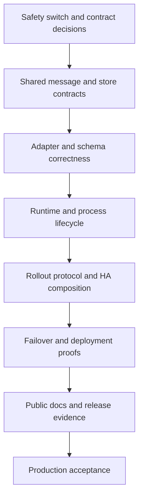

| 20 | done | LOW-18, LOW-19 (withdrawn), DOC-1, DOC-4, DOC-10, NEW-MEDIUM-16 |# Production Readiness Remediation Implementation Plan
> **For agentic workers:** REQUIRED SUB-SKILL: Use `subagent-driven-development` (recommended) or `executing-plans` to implement this plan task-by-task. Steps use checkbox (`- [ ]`) syntax for tracking.

**Goal:** Close every stable finding in the canonical `PROD_READY_ISSUES.md` ledger with tested behavior, truthful contracts, safe migrations, and release evidence.

**Plan status:** Chunks 1–16, 24 and 25 landed and are checked off below with their residuals; chunks 1–4 are the commits `cf86968f`, `84939bf5`, `f0c9685c`, `b781f741`. Chunk 17 is landed and closed; its deployment residual moved to Chunk 26 (an executed multi-member rollout proof on a local deployment, specified against local AWS emulation in `testutil/SPEC.md`). Chunk 27 (retiring the per-service emulator wrappers) has no dependencies and was scheduled BEFORE Chunk 26 — like Chunks 24 and 25, its number is identity, not execution order. Chunk 28 followed Chunk 26 with the rest of the deployment e2e matrix. **Chunks 29, 30 and 31 are landed.** 29 proved the confirm window on a deployed cohort and fixed three defects on the way (a committed config the document could not reproduce, a durable committed artifact that could not be decoded, and a convergence signal that rested on nothing); 30 closed the DynamoDB-overlay question by decision and handed its other two rows on; 31 changed the `direct_hold` gate to ask about source redelivery and proved it at every layer a unit run reaches. Their residuals were enqueued rather than carried: **Chunk 32** owned the plan-driven ingress session that blocked both the `direct_hold` deployed proof and the SQLite deployed store and is now landed, **Chunk 33** owns the Lambda topology and its unrun probe, and **Chunk 34** owns the two small rollout leftovers. A third cluster rollout mode, `cluster.rollout: independent`, was added alongside them at the operator's request: the admin API validates and writes, and every member applies the change itself with no barrier and no vote. The default is unchanged. **Chunk 18 was dropped from this document in `85c8c763` while its work was still open; the 2026-09-04 scan restored it below, after Chunk 34, and it is now landed.** The only open chunk is 33. The ledger re-verification at HEAD `b781f741` added 22 findings (HIGH-14…20, MEDIUM-18…25, LOW-20…26), withdrew LOW-7 and LOW-19, and downgraded MEDIUM-12 and BLOCKER-2; the coverage matrix and two new chunks (24, 25) absorb them. Chunks 24 and 25 are placed at the end of Phase 1 by dependency but carry P0 defects — schedule them immediately after Chunk 5.

**Architecture:** Keep domain and port contracts inward-facing. Change shared contracts and persistence formats before adapters, then wire composition roots, deployment, observability, and documentation. Coordinated rollout stays disabled in the shipped autoscaled high-availability facade until the static-member implementation and its deployment proof pass.

**Tech Stack:** Go 1.25+, Paho MQTT v0.23.0, SQLite, DynamoDB, AWS CDK, Docker, Markdown.

## Overview

The plan repairs message identity, MQTT protocol handling, outbox ordering and fencing, lifecycle bounds, cluster rollout, deployment safety, and operator evidence. Quality of Service (QoS) 1/2 remains at-least-once. The dead-letter queue (DLQ) remains loss-safe and can contain duplicates. A service-level objective (SLO) is accepted only for the failure modes covered by its formula and tests.

Each chunk is a reviewable implementation boundary. Run commands from the repository root unless a command uses `go -C` or `make -C`.

## Scope and non-goals

**In scope**
- Every stable ID in the canonical production-readiness ledger: 110 original + 22 added 2026-08-18 + the IDs added 2026-09-01…03 while executing Chunks 11 and 26–31 (NEW-BLOCKER-1…4, NEW-HIGH-6, NEW-HIGH-21, NEW-MEDIUM-26, NEW-MEDIUM-27, NEW-LOW-10…12, NEW-TEST-2, NEW-TEST-3). The 2026-09-04 scan counted 146 `### <ID>:` headings; the matrix below maps all of them. Withdrawn IDs (LOW-7, LOW-19) stay mapped for matrix totality but require no work.
- Port, schema, adapter, runtime, composition-root, deployment, test, alarm, runbook, and reference changes needed to close those IDs.
- Backward reads of existing SQLite and DynamoDB outbox data during ordering-key migration.
- Whole-cohort deployment rules while store or identity contracts change.

**Non-goals**
- Exactly-once delivery, lossless MQTT QoS 0, or atomic runtime application across a fleet.
- A universal broker claim beyond the broker and feature matrix proved by required tests.
- A durable per-message outcome ledger. Deployments that require one must add it as a separate product capability.
- Diff-based reload in this remediation. Accepted reloads keep full-session restart semantics.

## Global invariants

- `Envelope.Subject` remains logical; `OutboundMessage.Address` remains the transport destination.
- Every outbox terminal mutation is partition-scoped and lease-fenced. A stale owner cannot expire or complete work.
- A nil store result that permits source settlement means crash-durable persistence unless the configuration explicitly acknowledges volatility.
- Every progress-critical remote call has an operation deadline. Local deadmen and shutdown do not wait behind remote I/O.
- One process shutdown budget covers watchers, rollout, HTTP, runtime drain, sessions, stores, and telemetry.
- Tests use injected clocks, channels, and `testutil/wait`; no `time.Sleep` or wall-clock assertions.
- Behavior changes land before their public documentation. Unsafe rollout claims remain off until the proving chunk passes.
- Metrics are operational signals, not proof of per-message conservation.
- **No backward compatibility. GoBridge has never been deployed.** No store,
  table, or database anywhere holds data written by an earlier build, so there
  is nothing to migrate, backfill, or read in an older shape. A schema change is
  the new DDL and nothing else: no in-place column migration, no backfill job,
  no migration marker, no "legacy row" read path, no version gate, and no
  runbook step for upgrading existing data. Every chunk REMOVES such machinery
  from the code it touches rather than extending it. This invariant holds until
  the first real deployment; at that point migrations become a normal
  requirement and this line is deleted.

  The repository-wide sweep that established it removed: the SQLite outbox and
  DLQ in-place column migrations and the identity table rebuild; the DynamoDB
  `ClaimIndex`-absent degrade-to-scan path (the index is now REQUIRED and
  verified by preflight); the DynamoDB sort-key cross-scheme migration framing;
  the replay-budget `CreatedAt` fallback (with `WithOutboxPoisonMinAge` and the
  `PoisonMinAge` term); the legacy fixed drain-batch ceiling that `bridge.drain_timeout`
  fed alongside its real meaning (the supervisor's `Runtime.Stop` budget); a
  lease-row migration note; and the GSI migration runbook, replaced by a
  table-schema reference. Anything found later that
  reads or repairs data written by an earlier build is a defect against this
  invariant.

## Accepted tradeoffs

- Full-session reload is retained. The contract requires batched changes and states the QoS 0 and ephemeral-session loss window.
- DLQ writes remain synchronous with a bounded 10.5-second production hold. No spill queue is added unless a later design preserves durable evidence before source settlement.
- Route readiness means pipeline liveness, not recent target success. Delivery-stall metrics carry target availability.
- SQLite `replay_count` continues to count claims. Poisoning remains the claim-count **and** wall-clock-budget condition.
- Locator expiry and cold takeover retain skew-safe observation behavior. Runbooks budget clock skew and the full observation window.
- `ErrApplyInFlight` retains poll-to-resolution semantics through deep health.
- Cluster commit is store-atomic. Runtime apply is per member, with bounded retry, terminal replacement on unrecoverable divergence, fresh health, and fleet alarms.

## Migration and rollout rules

1. Chunk 1 disables unsafe coordinated-rollout admission and overlapping incompatible ECS replacement before any rollout rebuild.
2. Port and record contracts land before store adapters. Adding a fencing token to `OutboxStore.Expire` is a coordinated breaking change for external implementations: publish it in the next allowed API-breaking release, provide an adapter migration note with the old and new signatures, and update all in-repository implementations in the same release train.
3. Fenced expiry reuses existing partition fence state. SQLite validates and raises `outbox_partition_fence` in the expiry transaction; DynamoDB condition-checks the partition fence in each terminal write; memory checks `latestVersion`.
4. Ordering support adds a persisted `ordering_key` to every backend's schema. Per the no-backward-compatibility invariant there is no backfill, no migration marker and no index-active gate: no store holds a record written before the column, so the attribute is the single source of a record's key.
5. Any legacy read path, in-place column migration, or table rebuild encountered while working a chunk is DELETED, not extended. Store readiness depends on the current schema only.
6. Store/identity-incompatible releases use whole-cohort replacement with ingress quiesced. Coordinated rollout is not used to deploy its own prerequisites.

## Dependency order



Chunks within a phase may run in parallel only when their dependency line permits it.

## Issue-to-chunk coverage matrix

The **Primary issue IDs** column is the single authoritative mapping. Issue references in chunk details are cross-cutting and may repeat.

| Chunk | Status | Primary issue IDs |
|---|---|---|
| 1 | done | HIGH-9 (residual open, rechecked in 17), HIGH-10 |
| 2 | done | MEDIUM-7, MEDIUM-9, MEDIUM-10, MEDIUM-11, LOW-6, NEW-LOW-4 |
| 3 | done | HIGH-1, HIGH-8, NEW-HIGH-1, NEW-HIGH-2, LOW-17 |
| 4 | done | NEW-HIGH-3, MEDIUM-1, MEDIUM-13, MEDIUM-14, NEW-MEDIUM-4, LOW-10 |
| 5 | done | BLOCKER-3, NEW-MEDIUM-7, LOW-27 |
| 6 | done | NEW-HIGH-4, HIGH-18, HIGH-19, MEDIUM-8, NEW-MEDIUM-8, MEDIUM-22, LOW-16, LOW-24, LOW-25 |
| 7 | done | HIGH-13, MEDIUM-16, MEDIUM-17 |
| 8 | done | HIGH-11, HIGH-12, HIGH-14, MEDIUM-15, MEDIUM-18, MEDIUM-19, LOW-1, NEW-HIGH-5, NEW-LOW-1 |
| 9 | done | NEW-MEDIUM-1, NEW-MEDIUM-2, NEW-MEDIUM-3, NEW-MEDIUM-5, NEW-MEDIUM-6, NEW-LOW-9 |
| 10 | done | LOW-3, LOW-4, NEW-MEDIUM-12, NEW-MEDIUM-13, NEW-MEDIUM-14, NEW-MEDIUM-15, NEW-LOW-6 |
| 11 | done | HIGH-6, HIGH-15, HIGH-20, MEDIUM-3, MEDIUM-4, MEDIUM-6, MEDIUM-23, MEDIUM-25 (premise corrected; see the ledger), LOW-15, LOW-20, NEW-MEDIUM-9, NEW-TEST-1, NEW-HIGH-6 (found and closed while implementing this chunk) |
| 12 | done | LOW-7 (withdrawn), LOW-13, LOW-14, NEW-MEDIUM-10, NEW-MEDIUM-11, NEW-LOW-5 |
| 13 | done | LOW-5, LOW-11, LOW-12, MEDIUM-20, NEW-LOW-2, NEW-LOW-3 |
| 14 | done | HIGH-2, HIGH-7, LOW-2 |
| 15 | done | BLOCKER-2, MEDIUM-2, MEDIUM-12 (downgraded; hardening) |
| 16 | done | HIGH-5, MEDIUM-5, LOW-8, LOW-9, DOC-5 |
| 17 | done | BLOCKER-1 (deployment residual open, executed in 26), DOC-12 |
| 18 | done | HIGH-3, HIGH-4, TEST-3 (closed by Chunk 23's release gate), DOC-7, DOC-14 |
| 19 | done | DOC-3, DOC-6, DOC-13 |
| 20 | done | LOW-18, LOW-19 (withdrawn), DOC-1, DOC-4, DOC-10, NEW-MEDIUM-16 |
| 21 | done | DOC-8, DOC-15, NEW-LOW-7, NEW-LOW-8, LOW-26 |
| 22 | done | DOC-2, DOC-9, DOC-11 |
| 23 | done | TEST-1, TEST-2, TEST-4, TEST-5, TEST-6, TEST-7, TEST-8, TEST-9, TEST-10, TEST-11, TEST-12 |
| 24 | done | HIGH-16, MEDIUM-21, LOW-22, LOW-23 |
| 25 | done | HIGH-17, MEDIUM-24, LOW-21 |
| 26 | done | NEW-BLOCKER-1, NEW-BLOCKER-2, NEW-TEST-2 — and the deployment residual of Chunk 17's blocker, whose primary mapping stays there |
| 27 | done | none — test infrastructure; adds no issue mapping. Ran BEFORE 26. |
| 28 | done | NEW-BLOCKER-3 (fixed), NEW-LOW-10 (recorded, still open), NEW-LOW-11 (recorded while executing the matrix, still open; no other chunk names it) |
| 29 | done | NEW-TEST-3, NEW-MEDIUM-26, NEW-HIGH-21, NEW-BLOCKER-4 (its release-note residual closed in Chunk 34) |
| 30 | done | none — deployment coverage decided or handed on; adds no issue mapping |
| 31 | done | NEW-MEDIUM-27 |
| 32 | done | NEW-LOW-12 |
| 33 | **open** | none — deployment coverage breadth; adds no issue mapping |
| 34 | done | none — the release-note residual of Chunk 29's artifact fix and the roster rule of the `independent` rollout mode; adds no issue mapping |

## Phase 0: Stop unsafe claims and freeze accepted contracts

### Chunk 1: Deployment safety switch and reload contract

- **Issues:** HIGH-9, HIGH-10; prerequisite control for BLOCKER-1.
- **Goal:** Reject coordinated rollout in the autoscaled facade, force whole-cohort replacement for incompatible revisions, and retain documented full-session reload.
- **Dependencies:** None.
- **Files/packages:** `deployment/aws-filebased-config/cdk/constructs/gobridgedynamodbha/ha.go`, `deployment/aws-filebased-config/lib/bootstrap/rollout.go`, `bridge/supervisor.go`.
- **Tests:** `deployment/aws-filebased-config/cdk/constructs/gobridgedynamodbha/ha_test.go`, `deployment/aws-filebased-config/lib/bootstrap/rollout_test.go`, `bridge/supervisor_reload_test.go`.
- [x] Add failing tests for coordinated admission on interchangeable workers, incompatible revision overlap, and one-route changes restarting all sessions.
- [x] Run `go -C deployment/aws-filebased-config/cdk test -count=1 ./constructs/gobridgedynamodbha -run 'Test.*(Rollout|Replacement)'`; expect current synth assertions to fail.
- [x] Add the facade safety gate and whole-cohort deployment policy. Keep low-level rollout code available for custom/static-slot hosts.
- [x] Run the targeted CDK command and `go test -race -count=1 ./bridge -run 'Test.*Reload'`; expect pass.
- [x] Run `go -C deployment/aws-filebased-config/lib test -race -count=1 ./bootstrap -run 'Test.*ClusterReload'`.
- [x] Emit actionable rejection text and deployment events; defer final rollout capability docs to Chunk 17.
- [x] Accept when autoscaled workers cannot enable coordinated rollout or overlap incompatible identities, and reload tests pin full-session restart.
- **Landed:** `cf86968f`. **Residual (HIGH-9, carried to Chunk 17):** 0/100 constrains counts, not order — at desired ≥2 ECS still replaces in batches; nothing rejects startup beside an incompatible generation; `docs/aws-deployment/topologies.md:28` overclaims whole-cohort replacement.
- **Suggested commit title:** `fix deployment rollout safety defaults`

### Chunk 2: Explicit operational tradeoff contracts

- **Issues:** MEDIUM-7, MEDIUM-9, MEDIUM-10, MEDIUM-11, LOW-6, NEW-LOW-4.
- **Goal:** Close accepted tradeoffs through executable decision tests, metrics, and operator contracts instead of speculative concurrency or clock logic.
- **Dependencies:** Chunk 1.
- **Files/packages:** `runtime/dlq/router.go`, `runtime/cluster/locator.go`, `cmd/gobridge/reload.go`, `runtime/bridge_health.go`, `runtime/outbox/retry.go`, `docs/routes-and-runtime-reference.md`, `docs/runbooks/`.
- **Tests:** `runtime/dlq/router_test.go`, `runtime/cluster/locator_test.go`, `cmd/gobridge/reload_terminal_test.go`, `runtime/bridge_health_test.go`, `runtime/outbox/replay_budget_test.go`.
- [x] Add failing contract tests for the 10.5-second DLQ bound, skew/cold-takeover disclosure, poll-to-resolution state, liveness-only readiness, and claim-count poison semantics.
- [x] Run `go test -race -count=1 ./runtime/... ./cmd/gobridge -run 'Test.*ProductionContract'`; expect missing status or contract assertions to fail.
- [x] Add only the missing bounded status/metric surfaces; retain synchronous DLQ, skew-safe observation, and claim-count semantics.
- [x] Re-run the exact failing command above; expect pass.
- [x] Run `go test -race -count=1 ./runtime/... ./cmd/gobridge`.
- [x] Update route, failover, DLQ, and reload runbooks with the accepted behavior and alarm thresholds.
- [x] Accept when each tradeoff has a deterministic test, an operator signal, and no stronger guarantee in public text.
- **Landed:** `84939bf5` (`MetricDLQWriteHold`, `MetricRouteOwnerUnknown`, `reload_terminal_test.go`, `bridge_health_test.go`, `replay_budget_test.go`, runbooks). Add the new metrics to `docs/aws-deployment/monitoring.md` tables in Chunk 19 (DOC-3).
- **Suggested commit title:** `document and test production tradeoffs`

## Phase 1: Shared contracts, MQTT boundaries, and stores

### Chunk 3: MQTT provenance and durable message identity

- **Issues:** HIGH-1, HIGH-8, NEW-HIGH-1, NEW-HIGH-2, LOW-17.
- **Goal:** Make producer identity source-scoped, binary-safe, alias-stable, and observable on duplicate suppression.
- **Dependencies:** Chunk 2.
- **Files/packages:** `ports/transport.go`, `ports/storetest/`, `adapters/mqtt/transport/paho/acl_headers.go`, `adapters/mqtt/transport/paho/config_identity.go`, `runtime/route/dispatch.go`, `runtime/route/leakguard.go`, source adapters.
- **Tests:** `adapters/mqtt/transport/paho/generated_identity_test.go`, `headers_test.go`, `config_identity_test.go`, `runtime/route/dispatch_test.go`, source-adapter conformance tests.
- [x] Add failing hostile-marker, binary-correlation redelivery, URL-alias collision, duplicate metric, and source-ID stability tests.
- [x] Run `go -C adapters/mqtt/transport/paho test -race -count=1 ./... -run 'Test.*(Identity|Correlation|Generated)'`; expect spoofing and alias cases to fail.
- [x] Move generated provenance to private callback state, preserve raw Correlation Data with a stable encoded envelope ID, canonicalize effective endpoints, and meter all duplicate suppression.
- [x] Run the targeted adapter command and `go test -race -count=1 ./runtime/route ./ports/... -run 'Test.*(Identity|Duplicate)'`; expect pass.
- [x] Run `make test` to execute identity conformance for every source adapter.
- [x] Document authenticated producer ownership, source scoping, collision signals, and binary round trip.
- [x] Accept when hostile properties cannot set provenance, aliases collide at preflight, binary identity survives redelivery, and suppression is visible.
- **Landed:** `f0c9685c` (`acl_identity.go`, `config_identity.go` canonical endpoints, `MetricOutboxDuplicateSuppressed`, `ports/transporttest/identity.go`). Accepted residual: raw Correlation Data >256 B still mints a generated identity (pinned); the 193–256 B encoded band exceeds a downstream bridge's 256-character header cap (unverified by test — add a bridge-to-bridge round-trip test in Chunk 8 if that topology is supported).
- **Suggested commit title:** `fix mqtt identity trust boundaries`

### Chunk 4: MQTT wire limits, memory accounting, proxy TLS, and expiry

- **Issues:** NEW-HIGH-3, MEDIUM-1, MEDIUM-13, MEDIUM-14, NEW-MEDIUM-4, LOW-10.
- **Goal:** Reject invalid or over-limit egress before socket write and make ingress memory and proxy TLS match real protocol behavior.
- **Dependencies:** Chunk 3.
- **Files/packages:** `adapters/mqtt/transport/paho/acl_dial.go`, `acl_headers.go`, `acl_client.go`, `acl_net.go`, `config_ingress_memory.go`, `ingress_conn.go`.
- **Tests:** `connect_limits_test.go`, `headers_test.go`, `ingress_memory_test.go`, `acl_net_test.go`, authenticated MQTT integration tests.
- [x] Add failing tests for CONNACK Maximum Packet Size, 65,535-byte fields, expired envelopes, tiny-property amplification, uppercase and lowercase proxy variables, `NO_PROXY`, explicit direct mode, and proxy `ServerName`.
- [x] Run `go -C adapters/mqtt/transport/paho test -race -count=1 ./... -run 'Test.*(Packet|Header|Expiry|Proxy|IngressMemory)'`; expect limit and proxy cases to fail.
- [x] Capture limits by connection generation; make packet construction error-returning; return `ErrPayloadTooLarge`; fix memory formula and canonical proxy/TLS setup.
- [x] Re-run the exact failing command above; expect pass.
- [x] Run `make test-integration` for real broker limit and certificate validation.
- [x] Add rejection metrics and update MQTT memory, proxy, field-limit, and expiry contracts.
- [x] Accept when no over-limit packet reaches the wire, no field truncates, proxy TLS verifies the broker, and admitted memory covers legal metadata.
- **Landed:** `b781f741`. **Residual (MEDIUM-1, closed 2026-09-03):**
- [x] Budget the transient decode for the whole advertised packet (`max_payload_bytes + 128 KiB`, so ≈78,600 minimum properties at defaults) instead of `128 KiB / 5`, or reject property count pre-decode in `ingress_conn.go`; add a failing `config_ingress_memory` test for a zero-payload packet at the advertised maximum and a finite-cgroup long-running proof with maximum-count tiny properties. *(Closed by rejecting the count pre-decode: the guard truncates the User Property list to 129 on the raw bytes before the SDK decodes it (`ingress_conn_truncate.go`, `MQTTIngressUserPropertiesTruncated`), because the measured SDK cost is ≈1.3 KiB per five-byte property — ≈107 MB for one packet at the default advertised maximum — which no budget can honestly absorb. The crossing slot now budgets the SDK's measured decode buffers instead. Pinned by `TestIngressMemory_ZeroPayloadPacketAtAdvertisedMaximum_DecodesWithinCrossingSlot`, `ingress_conn_truncate_test.go`, and the finite-cgroup proof `TestMQTTIngressMemoryPropertyFlood` run by `scripts/test-mqtt-ingress-memory.sh`; the proof fails at 112 MB per packet and a 43 MB cgroup rise with truncation disabled, and passes at 185 KB per packet with it.)*
- **Suggested commit title:** `enforce mqtt wire and memory limits`

### Chunk 5: Lease-fenced outbox expiry and store call deadlines

- **Issues:** BLOCKER-3, NEW-MEDIUM-7.
- **Goal:** Fence expiry at the store transaction and bound expiry and depth calls.
- **Dependencies:** Chunk 2.
- **Files/packages:** `ports/stores.go`, `ports/storetest/`, `runtime/outbox/loop.go`, memory, SQLite, and DynamoDB outbox adapters.
- **Tests:** `ports/storetest/outbox_fencing.go`, `runtime/outbox/loop_test.go`, each adapter's conformance entry point.
- [x] Add failing conformance tests for a stale-owner expiry race and context-bound `Expire`/`CountPending`.
- [x] Run `go test -race -count=1 ./runtime/outbox ./ports/storetest -run 'Test.*(Expire|StoreDeadline)'`; expect signature or fencing failures.
- [x] Change `OutboxStore.Expire` to require `LeaseToken`; implement transactional fence checks and use `storeOpContext` for expiry and depth.
- [x] Run `go -C adapters/native/store/memoryoutbox test -race -count=1 ./... -run 'Test.*Expire'`, `go -C adapters/native/store/sqliteoutbox test -race -count=1 ./... -run 'Test.*Expire'`, and `go -C adapters/aws/store/dynamodboutbox test -race -count=1 ./... -run 'Test.*Expire'`; expect pass.
- [x] Run `make test-integration` for SQLite and DynamoDB Local stale-owner races.
- [x] Update port and architecture contracts, metrics, and migration notes; state that existing fence records need no schema rewrite.
- [x] Accept when a stale token cannot expire a pending row and black-holed expiry/depth returns within the configured operation budget.
- **Landed:** fence enforced in all three backends (memory under `s.mu`, SQLite in one transaction via the shared `partitionFenceVersion` helper, DynamoDB via an up-front fence raise plus a per-record `ConditionCheck` transaction); `Expire` and `CountPending` bounded by `storeOpContext`; an accepted sweep raises the high-water-mark; a refused sweep now backs off the drain cycle instead of being warn-logged, and a partially completed sweep still emits `MessagesExpired`. Conformance (`ExpireRejectsZeroToken`, `ExpireRejectsStaleVersion`, `ExpireAdvancesPartitionFence`) runs against all three real backends including DynamoDB Local; mutation-checked. Migration note in `CHANGELOG.md`; contracts in `ports/stores.go`, `ARCHITECTURE.md`, `PLUGIN.md`.
- **Also closed here:** LOW-27 — a DynamoDB expiry sweep interrupted by its operation deadline now resumes at the page it stopped on instead of restarting at the head, so a foreign backlog sitting at the front of the globally-hashed `ExpiryIndex` can no longer consume the whole budget before a partition reaches its own records. The cursor is an optimisation only: losing it costs a restarted pass, never correctness.
- **Suggested commit title:** `fence outbox expiry operations`

### Chunk 6: Cross-cycle ordering, reclaim, and DLQ idempotency

- **Issues:** NEW-HIGH-4, HIGH-18, HIGH-19, MEDIUM-8, NEW-MEDIUM-8, MEDIUM-22, LOW-16, LOW-24, LOW-25.
- **Goal:** Prevent same-key overtaking (including DynamoDB GSI lag and mid-batch claim discard), expose claimed backlog, release unattempted group tails, bound reclaim safely, and make repeated DLQ writes identify one terminal event.
- **Dependencies:** Chunk 5.
- **Files/packages:** `domain/persistence/outbox.go`, `ports/stores.go`, `ports/storetest/`, `runtime/outbox/`, `runtime/dlq/router.go`, SQLite/DynamoDB/memory outbox schemas, HA CDK data.
- **Tests:** ordering/release cases in `ports/storetest/outbox_fencing.go`, SQLite migration tests, DynamoDB Local tests, `runtime/dlq/router_test.go`.
- [x] Add failing A-stranded/B-pending ordering tests, claimed-depth tests, unsafe stale-window validation, and DLQ write-success/ACK-failure replay tests.
- [x] Add failing DynamoDB tests for (a) an older ordering-key sibling that is not yet visible in `ClaimIndex` while a younger one is (inject index lag through the fake client), (b) a 100-record claim whose 60th `TransactWriteItems` throttles or whose context expires — assert the first 59 are returned (or released), not stranded, and that `replay_count` is not charged, (c) an `Expire` whose second page fails still reports the first page's count; add a drainer test where the `default` branch (DLQ-write error / post-send `Complete` error) releases the unattempted tail; fix `delivery_hook_outbox_test.go:132,287` to expect a 1-based attempt.
- [x] Run `go -C adapters/native/store/memoryoutbox test -race -count=1 ./... -run 'Test.*Ordering'`, `go -C adapters/native/store/sqliteoutbox test -race -count=1 ./... -run 'Test.*Ordering'`, `go -C adapters/aws/store/dynamodboutbox test -race -count=1 ./... -run 'Test.*Ordering'`, and `go test -race -count=1 ./runtime/outbox ./runtime/dlq -run 'Test.*(Ordering|Stranded|DLQDuplicate)'`; expect overtaking and random IDs. *(The `-run` patterns above match nothing: tests are named after the behaviour they pin, not the batch, so the real commands are `-run 'TestOutboxStoreConformance|TestOutboxClaimedDepthConformance|TestOrderingKey|TestClaim_|TestExpire_'` per adapter and `-run 'TestDrainBatch_|TestProcessRecord_Attempt|TestEmitDepth_|TestRouter_'` for the runtime.)*
- [x] Persist/index `ordering_key`, block younger non-terminal siblings, report pending plus claimed/stranded state, validate reclaim floor, and derive stable DLQ entry identity.
- [x] Make the DynamoDB age-ordered claim path strongly consistent (LSI hash=PK/range=claim_sort read with `ConsistentRead`, or route ordering-keyed partitions to the consistent scan) or downgrade the DynamoDB ordering promise in ADR 0005/`ports/stores.go`; return partial claims on transient mid-batch failure and size the claim bound to the batch; release the group tail in the drainer's `default` branch; use `rec.ReplayCount()` for the attempt number; emit `MessagesExpired` for pages already flipped before an `Expire` error.
- [x] Re-run the exact failing commands above; expect pass.
- [x] Run `make test-integration` for SQLite migration and DynamoDB index/backfill behavior.
- [x] Publish the migration order, rollback limits, index-active gate, backfill marker, and duplicate contract. *(Superseded by the no-backward-compatibility invariant: there is no migration order, rollback limit, index-active gate or backfill marker to publish — only the schema and the duplicate contract, both documented.)*
- [x] Accept when legacy rows migrate without loss, same-key work cannot overtake, stranded work is visible/reclaimable, and DLQ redelivery is idempotent.
- **Landed:** ordering-key head-of-line rule added to the `Claim` contract and enforced by all three backends (SQLite: an `ordering_key` column, a partial index, and a `NOT EXISTS` sibling subquery; memory: a per-key blocker map under the store mutex; DynamoDB: client-side over a `ConsistentRead` base-table scan that now reads every NON-TERMINAL record so a stranded head is visible as a blocker). DynamoDB ordering is made honest rather than promised: a claim that sees ANY ordering key abandons the eventually-consistent `ClaimIndex` — having claimed nothing — and re-runs on the base table, so keyless partitions keep the O(limit) fast path and keyed ones pay the scan; no backfill, marker or index-active gate exists because nothing was ever deployed to migrate — the attribute is the single source of a record's key, and the SQLite store's whole in-place migration machinery (column migrations, the identity table rebuild, the legacy fence stamp) was deleted along with its tests. `Claim` may now return a SHORT batch with a nil error, so a mid-batch throttle/deadline no longer discards durably-claimed records (`DynamoDBOutboxClaimTruncated`), and the claim bound scales as `max(send_timeout, limit x 100ms)` capped at two minutes instead of reusing the per-message send timeout. New optional `ports.OutboxClaimedDepthReporter` feeds `OutboxClaimedDepth` so stranded work is visible where `CountPending` reads zero. The drain loop's `default` branch releases the unattempted ordering-group tail; hook attempt numbers are 1-based on the outbox path. DLQ entry identity is `sha256(envelope, route, binding, source)` and a duplicate refusal is reported as durable success (`DLQDuplicateSuppressed`), so a write-then-failed-settle records one terminal event instead of a row per redelivery. An explicit `stale_claim_duration` at or below the largest route `send_timeout` is now rejected and below the full batch ceiling warns; the HA fixture's own 20 s value was one such case and was corrected. Every new test is mutation-checked; conformance runs against all three real backends including DynamoDB Local. Contracts in `ports/stores.go`, ADR 0005, `ARCHITECTURE.md`, `PLUGIN.md`, `CHANGELOG.md`, the GSI migration runbook, and the monitoring/observability tables.
- **Also closed here:** LOW-25 — verified already fixed by Chunk 5's incremental sweep (`expireByStatus` returns its count on every error path and `maybeExpire` emits `MessagesExpired` before handling the error); pinned by a new page-failure regression so it cannot silently regress.
- **Suggested commit title:** `preserve outbox order across claims`

### Chunk 7: Store durability and fencing-compatible composition

- **Issues:** HIGH-13, MEDIUM-16, MEDIUM-17.
- **Goal:** Reject fencing-version regression and require operators to acknowledge process-volatile outbox or DLQ state.
- **Dependencies:** Chunks 5–6.
- **Files/packages:** `ports/stores.go`, `bridge/builder_prepare.go`, `adapters/native/store/config.go`, `factory.go`, production profile validation.
- **Tests:** `bridge/builder_prepare_test.go`, `adapters/native/store/factory_test.go`, reload/restart pairing tests.
- [x] Add failing tests for memory-lease/SQLite-outbox composition, unacknowledged memory outbox/DLQ, and nil-success durability wording. *(The nil-success boundary is prose in `ports/stores.go`, so what is pinned is the testable half of it: `TestNativeStoreFactory_DeclaresCrashDurability` asserts each factory answers the capability truthfully, since the guard's whole correctness rests on that answer.)*
- [x] Run `go test -race -count=1 ./bridge -run 'Test.*(Durability|LeaseOutbox)'` and `go -C adapters/native/store test -race -count=1 ./... -run 'Test.*Factory'`; expect unsafe pairings to build.
- [x] Define the crash-durable success boundary, add a store durability capability, reject volatile lease with durable fenced outbox, and add `acknowledge_volatile`.
- [x] Re-run the exact failing commands above; expect pass.
- [x] Run `make test` for every accepted lease/outbox pair across reload and reconstructed stores. *(`TestSupervisorReload_StoreDurability_AcceptedPairingsSwap` drives all three accepted pairings through a real supervisor reload, which reconstructs every store and re-runs the guard; `TestStoreFactory_MemoryLeaseVersionResetWedgesDurableOutboxFence` rebuilds the lease store against a surviving SQLite fence.)*
- [x] Name affected routes in warnings and exclude acknowledged volatile stores from the production profile docs.
- [x] Accept when every accepted pairing preserves monotonic fencing and volatile persistence cannot look crash-durable without explicit consent.
- **Landed:** `ports/stores.go` defines the crash-durable success boundary — a nil `OutboxStore.Persist` / `DLQAdmin.Write` means the record outlives this process, because the runtime settles the SOURCE on that nil — and adds the optional `ports.CrashDurableStoreFactory`; an undeclared factory is read as NOT durable, mirroring `DistributedStoreFactory`'s fail-closed default, so a durable store has to say so. `bridge/store_durability.go` rejects a volatile `LeaseStore` under a crash-durable `OutboxStore`, scoped to blueprints carrying a `shared_outbox` route: a fencing token only reaches the store from a drainer, so a durable outbox nothing drains cannot wedge. The wedge itself is proven, not asserted — `TestStoreFactory_MemoryLeaseVersionResetWedgesDurableOutboxFence` raises a real SQLite partition fence to version 2, rebuilds the in-memory lease (a restart), and shows the reissued version 1 rejected as `ErrStaleFencingToken`. The memory outbox and DLQ now fail closed on `acknowledge_volatile` exactly as the lease does on `acknowledge_single_replica`, and an accepted volatile store warns at startup naming the affected routes (capped at 20 plus a count). Two guards keep the pairing unreachable from a running system and both are pinned: cold start refuses it, and a live reload is refused earlier still by the backing-store repoint guard. Contracts in `ports/stores.go`, `ports/stores_outbox.go`, `UBIQUITOUS.md`, `CHANGELOG.md`; the store reference and every `memory`-store example in `docs/` and `ARCHITECTURE.md` were corrected — `docs/scenarios/05-durable-shared-outbox.md` had been publishing the rejected pairing (memory lease + SQLite outbox) as its headline configuration, along with a note calling it safe.
- **Also closed here:** an unrelated latent defect found in review — `deployment/aws-filebased-config/cdk/bridgecfg` emitted `MemoryConfig{}` for `WithMemoryOutbox`/`WithMemoryDLQ`, so every CDK app using them would have failed to boot once the acknowledgement gate landed; it now sets the flag the way `WithMemoryLease` already did. Two pre-existing contract gaps in the same factory were closed while classifying the new gate's error: the single-replica gate and the SQLite path/type checks returned unclassified `fmt.Errorf`, so the composition root could not tell an operator config error from a store I/O failure. All now carry `shared.ErrInvalidConfig`, and the unimplemented SQLite lease role carries `shared.ErrNotSupported` (a missing capability, not a bad config); `.go-arch-lint.yml` grants `adapter_store_native_factory` the `domain_shared` edge its AWS sibling already held, with the reason recorded inline. The stale `c10-memlease-split` planning identifier was removed repo-wide (19 references) — including two that had leaked into operator-facing telemetry as a `finding` log/error attribute, now the durable `risk=split-brain`.
- **Residual:** `docs/processors-and-stores.md` is 702 lines against the 600-line documentation limit; it was already 663 before this chunk, so splitting it is its own task.
- **Suggested commit title:** `enforce store durability contracts`

### Chunk 8: MQTT reservation, recovery, close, and settlement metrics

- **Issues:** HIGH-11, HIGH-12, HIGH-14, MEDIUM-15, MEDIUM-18, MEDIUM-19, LOW-1, NEW-HIGH-5, NEW-LOW-1.
- **Goal:** Release every reservation, never purge a live-connection publish, keep recovery within settlement bounds, close cooperatively (router before client), and measure loss/reconnect by lifecycle state.
- **Dependencies:** Chunks 3–4.
- **Files/packages:** `adapters/mqtt/transport/paho/acl_router_*`, `session_recovery.go`, `receiver.go`, `runtime/session/bounded.go`, `manager_lease.go`.
- **Tests:** covered-drop tests, `session_recovery_test.go`, `bug_prodready_session_test.go`, runtime session bounded-call tests.
- [x] Add failing enqueue-level reservation reuse, slow bounded send, close-deadline, close-cancelled cooldown, connection-epoch ACK, and QoS 0 emit-drop tests.
- [x] Add failing tests for (a) a publish enqueued after CONNACK and before `beginGrace` (both the autopaho-reconnect and the `discarding` recycle case) — assert dispatch and ack, not `stalePurged`, and that unsettled gauges are not cleared for the current client; (b) a QoS 1 arrival through `enqueueDispatch` while pending is full of grace-buffered QoS 0 — assert the oldest QoS 0 is evicted and the callback does not block; (c) `Session.Close` with a callback parked in `reserveQueueSlot` — assert `Close` returns within the router-shutdown path, not the full deadline.
- [x] Run `go -C adapters/mqtt/transport/paho test -race -count=1 ./... -run 'Test.*(Recovery|Close|Covered|Reconnect|Emit)'` and `go test -race -count=1 ./runtime/session -run 'Test.*Close'`; expect current defects.
- [x] Release reservations on every branch; derive recovery drain from settlement ceilings; pass a detached timeout to `Close`; bind cooldown to session lifetime; carry ACK epoch and drop reason.
- [x] Move the old-generation-is-dead transition to `OnConnectionDown` / after the old manager's `Disconnect` returns (or stamp items with `pr.Client`), and stop `clearUnsettledLocked` from touching current-client entries; evict pending QoS 0 before blocking QoS 1/2 in `reserveQueueSlot` (or give QoS 0 a non-blocking sub-budget) and fix the drop attribution; call `router.shutdown()` before `cm.Disconnect` in `Session.Close`.
- [x] Re-run the exact failing commands above with fake clocks and channels; expect pass.
- [x] Run `make test-integration` for a real broker reconnect and slow-target recovery.
- [x] Update settlement metrics and the stuck-settlement runbook inputs without changing at-least-once wording.
- [x] Accept when capacity is reusable, cooperative slowness does not restart unrelated routes, close obeys deadline, and every QoS 0 emit loss is counted.
- **Landed:** the router's connection generation now advances once per REPORTED connection teardown (`acl_router_generation.go`: `noteConnectionTornDown`, wired to autopaho's connection-down edge and to the return of every explicit `Disconnect`), and is opened by whichever of the connection-up callback or the replacement connection's first packet arrives first. That keeps a CONNACK backlog which beats the callback dispatchable, its acknowledgement live, and its unsettled bookkeeping intact. Gating on the teardown report is what makes the client pointer safe to use as generation identity: two Paho clients can be alive at once whenever a `Disconnect` times out while the replacement connects, so an unfamiliar client alone would thrash the generation between two live sockets and lift a recycle's discard window from the socket it exists to fence off. `MQTTAckAfterReconnect` is measured the same way — client identity, not the connection epoch, which also advances for a recycle on a live socket. `reserveQueueSlot` now reclaims the oldest reserved pending QoS 0 for a QoS 1/2 admission instead of parking Paho's publish-callback goroutine (the goroutine that also reads PINGRESP), and the QoS 0 drop log names the refusing bound. `retainCovered`'s covered-QoS 0 refusal returns its reservation — the leak that retired the whole ingress budget after `receive_maximum` drops. `Session.Close` stops the router before `cm.Disconnect` (unconditionally, and before every bounded network wait), and `closeSourceBounded` passes the release-timeout deadline into `Close` — the two are complementary: the deadline is safe only because a deadline-aborted close has still stopped ingress. A close that gives up waiting for in-flight handlers now returns a timeout instead of reporting success, and ingress refused during the disconnect is metered rather than silent. The five-second recovery drain limit is deleted: `reconcile_timeout` bounds only the adapter-owned teardown phase and the settlement wait runs under the recovery attempt budget, since every settlement path is already bounded by its own route's ceilings (proved in `runtime/bridge_ingress_quiescence_blackhole_test.go`). Only settlement recovery drains that way — reconcile-driven recycles keep the reconcile bound on both phases, because those callers can run on a context with no deadline of their own. The recovery cooldown is a stoppable timer bound to the session lifetime, and a refused emit is counted on the new `MQTTReceiverEmitRejected` (`outcome=recovering|lost`) — the QoS 0 half previously left no trace at production log levels.
- **Also closed here:** an adversarial review of the landed change found five further defects, all fixed and pinned: the connection-generation marker could be stranded by a connection that delivered nothing, so the NEXT connection's live backlog was purged; two overlapping Paho clients (a `Disconnect` that timed out while the replacement connected) thrashed the generation and purged traffic on a live socket; an old socket's first packet lifted a recycle's discard window; `MQTTAckAfterReconnect` measured from the connection epoch reported every settlement in a routine recycle drain as a guaranteed redelivery and swallowed real acknowledgement failures; and dropping the adapter bound on the settlement wait left it unbounded on the reconcile path, whose callers can run on a context with no deadline while holding the session serialization gate. An unrelated pre-existing race in `bridge/rollout_confirm_window_test.go` — it read the committed artifact immediately after waiting for the Confirmed state, which the driver writes afterwards — was fixed on the way past.
- **Residual:** `docs/transports/mqtt-behavior.md` sits exactly at the 600-line documentation limit; further additions there require the split this chunk did not take on. Two adversarial-review findings were left as accepted residuals, both pre-existing and outside this chunk: `Start`'s CM-install guard checks `s.closed` but not `s.terminalErr`, so a slow in-flight `Start` can install a live ConnectionManager on a session already declared terminal (Chunk 11 owns startup/shutdown ownership); and `recoveryAttemptTimeout()` returns 0 for modes outside Persistent/Exclusive, which `contextWithClockTimeout` turns into an already-cancelled context — unreachable today because `requestRecovery` rejects Ephemeral first.
- **Suggested commit title:** `bound mqtt settlement recovery`

### Chunk 9: MQTT acknowledgement and factory validation

- **Issues:** NEW-MEDIUM-1, NEW-MEDIUM-2, NEW-MEDIUM-3, NEW-MEDIUM-5, NEW-MEDIUM-6, NEW-LOW-9.
- **Goal:** Preserve broker reason codes and reject bad direct-library configuration before activation.
- **Dependencies:** Chunk 4.
- **Files/packages:** `adapters/mqtt/transport/paho/acl_client.go`, `errors.go`, `acl_dial.go`, `config_plugin.go`, `factory.go`, `topic_validator.go`, `session_reconcile_apply.go`.
- **Tests:** `errors_test.go`, `factory_test.go`, `topic_validator_test.go`, reconcile reason-code tests.
- [x] Add failing negative SUBACK/PUBACK, packet-budget, invalid filter/QoS, legal `$aws` topic, negative timeout, and plaintext-error-class tests.
- [x] Run `go -C adapters/mqtt/transport/paho test -race -count=1 ./... -run 'Test.*(Ack|PacketTimeout|Topic|Factory|Config)'`; expect generic errors or late failure.
- [x] Return acknowledgement data with SDK errors, classify reason first, set effective `PacketTimeout`, share factory/reconcile validators, permit legal `$` names, and return `ErrInvalidConfig`.
- [x] Re-run the exact failing command above; expect pass.
- [x] Run `make test` for parser, builder, and direct factory entry points.
- [x] Update MQTT options and error-classification references.
- [x] Accept when broker denials keep their class, configured deadlines govern, and invalid configuration cannot reach a broker.
- **Landed:** the ACL now returns the SUBACK / UNSUBACK / PUBACK alongside the SDK error — the SDK produces both for every reason code at or above `0x80` — and `publishResult.Acknowledged` separates "answered with `0x00`" from "never answered". Reconcile, `unsubscribeConfirmed` and `Sender.Send` classify the reason code FIRST and fall back to the SDK's own classification only when no acknowledgement arrived, so `0x87` is `FORBIDDEN` (permanent, DLQ'd on the first attempt) instead of `UNAVAILABLE` burning the replay budget; a partially accepted SUBACK also keeps its grants in `observedSubs` rather than discarding them with the failed call. `Session.packetTimeout` derives the SDK's per-packet budget from the longest deadline that encloses a packet operation — `reconcile_timeout`, `connect_timeout`, `reconnect_timeout`, the `timeout` of every sender registered through `NewSender`, and the 30 s sender default as a floor — because the SDK applies its own bound INSIDE the caller's context and its 10 s default silently overrode every one of them; no new configuration key. One consequence surfaced by the adversarial review: a SUBSCRIBE in flight when a session is closed now waits out `reconcile_timeout` rather than the SDK's old 10 s, so `integration_resilience_test.go` states the bound it asserts against instead of inheriting the 30 s default; the runtime is unaffected because shutdown cancels the context it passed to `Reconcile`. One `ValidateMQTTSubscription` is shared by `Factory.NewReceiver` and `reconcile`, checking the filter syntax and QoS 0–2 before the narrowing `byte` conversion (the SDK writes `qos & 0x03`, so `qos: 4` reached the broker as `0`); an empty topic is now rejected rather than skipped, because `sessionPlanFor` builds the plan from the same list the receiver seam was silently dropping it from. `ValidateMQTTTopic` no longer rejects the whole `$` prefix — only `$share/`, which can never name a publish destination — so `$aws/rules/...` reaches the broker and the broker's own denial is what classifies. Every configuration failure in the adapter returns `ErrInvalidConfig` (permanent) instead of `ErrInvalidPayload` (rejected, reserved for a message).
- **Proof:** `ack_reason_preservation_test.go`, `packet_timeout_test.go`, `subscription_validation_test.go`, `config_duration_signs_test.go`, `config_error_class_test.go`, the `$`-namespace cases in `topic_validator_test.go`, `benchmark_ack_validation_test.go`, and two integration tests in `integration_packet_ack_budget_test.go` — an in-process MQTT responder that answers SUBACK after 12 s (fails at the SDK's 10 s default without the fix) and a live Mosquitto publish into `$SYS`, which the broker refuses with reason `0x87` (classified `transient` without the fix).
- **Suggested commit title:** `validate mqtt operations before activation`

### Chunk 10: Route and bridge configuration validation

- **Issues:** LOW-3, LOW-4, NEW-MEDIUM-12, NEW-MEDIUM-13, NEW-MEDIUM-14, NEW-MEDIUM-15, NEW-LOW-6.
- **Goal:** Make pre-commit validation match runtime rules and remove retry/default edge cases.
- **Dependencies:** Chunks 7 and 9.
- **Files/packages:** `config/validate.go`, `validate/blueprint_graph.go`, `bridge/convert.go`, `runtime/validator.go`, `runtime/route/dispatch.go`, `retry.go`, `domain/routing/policy.go`.
- **Tests:** config, blueprint, runtime validator, retry, and dispatch unit tests.
- [x] Add failing tests for broker-health duration, negative intervals, multiplier below one, omitted versus explicit jitter, log-level aliases, zero wedge ceiling, and nil outbox.
- [x] Run `go test -race -count=1 ./config ./validate ./runtime/... ./bridge -run 'Test.*(Validate|Backoff|Wedge|NilOutbox)'`; expect validation seams to disagree.
- [x] Share strict rules across validation boundaries, represent jitter unset distinctly, treat zero wedge as unbounded, and terminalize invalid nil-outbox wiring.
- [x] Re-run the exact failing command above; expect pass.
- [x] Run `make test` to cover admin commit, startup, and direct builder paths.
- [x] Update route-policy and log-level references after defaults are fixed.
- [x] Accept when every bad value fails before durable commit and every construction path receives the same retry defaults.
- **Landed:** `backoff.jitter` is a `*float64` on the wire and `BackoffPolicy.JitterFactor` is tri-state in the domain — zero means UNSET and `WithDefaults` fills `DefaultJitterFactor` (0.2, the value only `NewDefaultBackoffPolicy` used to carry), while `JitterDisabled` is the explicit opt-out an operator spells `jitter: 0`; a single zero could not express both, which is why every config-loaded route retried un-jittered while programmatic ones staggered. `multiplier` must now be `>= 1` at all four boundaries (blueprint validator, builder, runtime start validator, `RoutePolicy.Validate`): a value in (0,1) is acceleration, not backoff. Negative `initial_interval` / `max_interval` and an invalid or non-positive `broker_health_step_down` are rejected BEFORE the config transaction's durable write instead of at apply, so they no longer enter the rollback/divergence path. `bridge.log_level` is validated against one enum table, `ports.ParseLogLevel`, which the config validator and all three composition roots (`cmd/gobridge` flag, file-based bootstrap, admin commit) now share — a value that validates always applies, `warning` is an accepted alias, and the two per-root switch statements are deleted. `boundedSend` arms no timer when the wedge ceiling is zero: `clk.NewTimer(0)` fires at once, so the documented "no bound" marked every send hung. A `shared_outbox` route with no `OutboxStore` wedges terminally rather than looping on a cap-less one-second retry; the delivery is left unsettled, so nothing is acked or dropped. Two adjacent test defects surfaced and are fixed: three HTTP integration tests POSTed without waiting for the receiver's started signal (a pre-existing 503 flake, reproduced on a clean tree), and two config tests used `log_level` as an arbitrary marker string.
- **Proof:** `validate/route_retry_bounds_test.go`, `bridge/retry_policy_defaults_test.go`, `config/validate_log_level_test.go`, `config/parser/backoff_jitter_tristate_test.go` (the tri-state through the real YAML decoder), `runtime/route/send_wedge_ceiling_test.go`, `runtime/route/shared_outbox_nil_store_test.go`, `runtime/drainer_config_details_test.go` (`TestRouteRunner_SharedOutbox_NilOutboxStore_Terminal`, rewritten from the retry-forever contract), `ports/log_level_test.go`, the new cases in `domain/routing/policy_backoff_test.go`, `runtime/validator_test.go` and `config/validate_hardening_test.go`, `tests/integration/integration_config_api_retry_bounds_test.go` — a real admin transaction per newly bounded field, asserting 422 AND a byte-identical config file, with a negative control that commits `multiplier: 1` and `jitter: 0` and reads the opt-out back off disk — plus `runtime/route/benchmark_retry_delay_test.go` and `validate/benchmark_blueprint_graph_test.go` for the two paths whose cost changed.
- **Suggested commit title:** `unify route configuration validation`

### Chunk 24: Route dispatch cancellation, redrive provenance, and retry accounting

- **Issues:** HIGH-16, MEDIUM-21, LOW-22, LOW-23.
- **Goal:** Never acknowledge-and-drop a delivery because the bridge cancelled itself; never delete DLQ evidence for a redrive that was dropped or re-DLQ'd; charge and back off retries from the right counter.
- **Dependencies:** Chunk 3. Schedule immediately after Chunk 5 — HIGH-16 is a loss path reachable on every SIGTERM until Chunk 11 lands.
- **Files/packages:** `runtime/route/dispatch.go`, `runtime/route/leakguard.go`, `runtime/bridge_routes.go`, `httpapi/admin_dlq.go`, `domain/shared/errors.go` (classification helper only if needed).
- **Tests:** `runtime/route/bounded_ctx_test.go`, `runtime/route/dispatch_test.go`, `runtime/route/mqtt_core1_test.go`, `runtime/redrive_fresh_id_test.go`, `httpapi/admin_dlq_redrive_test.go`.
- [x] Add failing tests: cancelled delivery context + generated-ID envelope + `on_permanent_failure: drop` (and no-DLQ-store) for send, processor, resolver, outbox build and persist paths — assert no ACK and no drop metric; a DLQ redrive of an adapter-identified entry whose first send fails transiently under drop policy — assert the entry is not deleted and the admin response is not success; a re-DLQ'd redrive reports non-success; send-path backoff grows with the ledger attempt for a count-less source; outbox-at-capacity and DLQ-write-failure retries do not advance the replay ledger.
- [x] Run `go test -race -count=1 ./runtime/... ./httpapi -run 'Test.*(Cancel|Redrive|Backoff|ReplayBudget)'`; expect current ACK/drop and success responses. *(Tests are named after the behaviour they pin: the real selectors are `-run 'TestCancelledDelivery|TestDeliveryPanic_UnderCancellation|TestSendRetryBackoff|TestOutboxBackpressure|TestDLQWriteFailureRetry|TestPersistTimeout|TestInjectRedrive|TestInject_'` for `./runtime/...` and `-run 'TestHandleDLQRedrive|TestHandleInject_'` for `./httpapi`.)*
- [x] Return early from every recoverable branch when `ctx.Err() != nil` or the error is `context.Canceled` (mirror the DeadlineExceeded branch); delete `messaging.HeaderGeneratedID` in `InjectRedrive`; make a synthetic delivery's terminal drop/re-DLQ surface as a non-success outcome to admin; use `effectiveAttempt` on the send path; stop charging backpressure/DLQ-write-failure retries to the ledger.
- [x] Re-run the exact failing command above; expect pass.
- [x] Run `make test`.
- [x] Update `docs/routes-and-runtime-reference.md` (retry accounting) and the DLQ redrive runbook (dropped redrive keeps evidence).
- [x] Accept when no cancellation can settle a message terminally, a dropped redrive keeps its DLQ entry, and retry backoff/budget reflect only genuine message failures.
- **Landed:** `abandonIfCancelled` guards every recoverable dispatch branch — send, processor chain, destination resolve, outbox depth check (both the failed query and the at-capacity arm), outbox build, outbox persist — plus the delivery-panic recovery in `runner.go`, whose cancel-stripping `WithoutCancel` retry was deleted. The delivery is left unsettled and the returned error carries the cancellation. The scope is pinned by `TestSendTimeout_StillPoisonsUncountableSource`: a send that blew only its own `SendTimeout` keeps its terminal behaviour. `retryOrFallback` split into a charged and an `Uncharged` variant; the uncharged one takes outbox-at-capacity, the depth-query failure, every DLQ-write failure, and the bounded-store `Persist` deadline (the same slow-store fault as the depth query). Every `RetryDelay` now reads `effectiveAttempt`, so a count-less source backs off. `InjectRedrive` strips `x-bridge.generated-id` AND the source transport's redelivery counters (via the newly exported `route.StripInboundReceiveCounts`) — the latter is usually what exhausted the cap, so inheriting it made the redrive a no-op. A new `terminalFailureRecorder` lets a synthetic delivery learn it was settled without delivery; `Inject`/`InjectRedrive` return it wrapped in the new `ports.ErrInjectNotDelivered`, the DLQ redrive keeps the entry and answers 207, and `POST .../inject` answers 422 with the reason (audit outcome `not_delivered`) instead of claiming a delivery. Tests are mutation-checked and cover both DLQ shapes (store and no store) because the DLQ router's own `ctx.Err()` refusal masks the loss when a store is present. Glossary terms **Abandoned delivery** and **Replay ledger** added; contracts in `docs/routes-and-runtime-reference.md`, `docs/http-api.md`, the poison-message runbook and `CHANGELOG.md`.
- **Suggested commit title:** `never settle a cancelled delivery terminally`

### Chunk 25: Session-failure lease handoff and manager timing validation

- **Issues:** HIGH-17, MEDIUM-24, LOW-21.
- **Goal:** A session failure on the deferred-connect path hands the lease over within one poll; derived lease timings cannot collapse to millisecond cadence unnoticed; the manager closes its source before releasing.
- **Dependencies:** Chunk 2. Schedule immediately after Chunk 24 — HIGH-17 delays every default-profile failover to ≥ `lease_ttl`.
- **Files/packages:** `runtime/session/manager_lease.go`, `runtime/session/manager.go`, `runtime/session/config.go`, `runtime/session/bounded.go`.
- **Tests:** `runtime/session/manager_lease_test.go` (or the existing single-use session tests), `runtime/session/config_test.go`, `runtime/session/config_derive_test.go`, `runtime/session/manager_close_ctx_test.go`.
- [x] Add failing tests: exclusive + deferred manager with a single-use fake session and a fake lease store — force a reconnect-reconcile failure, run `Run` twice, assert the second `Run` returns `ErrSessionUnrecoverable` **and** the re-acquired lease is released (a standby acquires within one poll); `Config.Validate` rejects `lease_ttl: 5s`/`max_renew_fails: 5` and `lease_ttl: 45s`/`max_renew_fails: 50` (or any resolution below the floor) instead of clamping to 1 ms; `Manager.Close` closes the source (bounded) before `Release` and skips release when the close did not complete.
- [x] Run `go test -race -count=1 ./runtime/session -run 'Test.*(SingleUse|Reacquire|Validate|Close)'`; expect the held lease, the accepted clamp, and the inverse ordering.
- [x] Set `escalatable=true` for a `Start` failure carrying `ErrTransportClosedPermanently` on the `!sessionStarted` branch (nothing was accepted, release is safe) or narrow the retain branch to the reconcile/managed-migration phase; resolve timings in `Validate` exactly as `EffectiveFailoverLeaseTiming` does and reject when the clamp fires or falls below a documented floor; reorder `Manager.Close`.
- [x] Re-run the exact failing command above; expect pass.
- [x] Run `make test` and the failover budget tests (`go test -race -count=1 ./bridge -run 'Test.*Failover'`).
- [x] Update `docs/routes-and-runtime-reference.md` lease table (validation floor) and the node-down runbook (session-failure handoff is one poll, not TTL).
- [x] Accept when a session failure never leaves a dead owner holding the lease, invalid cadence fails validation, and close-before-release holds on every manager path.
- **Landed:** `escalatable` no longer means "the re-acquire reconnect path" but "nothing has been accepted yet, so releasing is safe" — which the deferred first connect satisfies too. On the default `connect_after_lease` profile a session failure closes the source, releases the lease and restarts `Run`; that fresh `Run` has `sessionStarted=false`, re-seizes the lease through the store's same-owner fast path, and only then learns the single-use transport refuses `Start`-after-`Close`. It now RELEASES that re-seized lease before going terminal, so a standby takes over within one `acquire_poll_interval` instead of a full `lease_ttl` (45s HA / 360s default) held by a provably dead owner. The reconcile / managed-migration phase keeps its retain-until-TTL branch untouched: durable route work may still unwind there. The cadence resolution moved to the domain as `routing.LeaseTimingRequest.Resolve`, and THREE boundaries now share it — the session manager, the builder, and the blueprint validator — so none can judge a configuration by values the manager will not run, and an unserveable cadence is refused BEFORE the admin config transaction's durable write rather than at apply (the failure class chunk 23 closed for `broker_health_step_down`). `validate/session_lease_cadence.go` resolves the raw route session block through the same domain code; `bridge/lease_cadence_contract_test.go` pins the validator's baseline selection against the builder's across every shape an operator writes, in both deployment modes, so the two cannot drift into disagreeing about which configurations are valid. Validation rejects an exclusive session when the expiry-margin clamp had to CUT the renew interval or the per-call timeout, or when the resolved renew interval / acquire poll falls below the new documented `MinimumLeaseCadence` (250 ms). The clamp rule is what closes the DERIVED path — the pre-existing cross-field check only ran on a pinned `renew_interval`, and a derived cadence below the floor has always been clamped first, so the floor binds on pinned values. A clamp that only SHEDS JITTER stays accepted: the clamp trims jitter first by design and the remaining cadence is healthy, so rejecting it would turn blueprints the manager has always run into hard build failures. `lease_ttl: 5s` + `max_renew_fails: 5` and `lease_ttl: 45s` + `max_renew_fails: 50` both resolved to a 1 ms renew and a 1 ms standby poll with no error: the store then throttles and its throttling errors are counted as transient renew failures, so a self-inflicted overload ends in an ownership change. `Manager.Close` was the one lease-surrendering path that released BEFORE closing the source; it now reuses `closeSourceBounded` (detached, bounded, cooperative-abort margin) and skips the release when the close never returned, matching step-down, activation failure and session-failure recovery. `closeSourceBounded` returns `(error, bool)` and takes its ceiling from the caller, so `Close` — the only caller whose own return value is the teardown result — propagates the error and is bounded by the caller's remaining deadline rather than a budget of its own (`Runtime.Stop` closes managed sessions sequentially under ONE deadline, so a per-manager budget let n sessions overrun it n-fold, and the step-down-derived budget silently shortened the configured shutdown timeout). Adversarial review added one more: releasing on a permanent-closure marker assumed nothing of ours could still send, but a session can latch that marker ASYNCHRONOUSLY — the paho ingress-poison rejection returns at once and quiesces on a goroutine — so `releaseAndReturn` now closes the source under the bounded teardown before handing off and keeps the lease when that close never returns. The timing derivation moved to the new `runtime/session/config_timing.go` to keep both files inside the source-length budget.
- **Proof:** `runtime/session/session_failure_lease_handoff_test.go` (a single-use transport whose reconnect Reconcile fails, `Run` twice on the SAME manager, asserting the re-acquired version specifically is released so the first release cannot mask a missing second), the two new cases in `runtime/session/manager_close_ctx_test.go` (`TestManager_Close_ClosesSourceBeforeReleasingLease` ordering-based via the existing `seqLeaseStore`, `TestManager_Close_WedgedSourceSkipsLeaseRelease` reusing `wedgedCloseSession`), `TestSessionManager_DeferredConnect_WedgedCloseKeepsReseizedLease` as the hand-off negative control, `runtime/session/config_lease_cadence_test.go` — one case per rejection branch, because the two collapsed profiles alone also resolve to a sub-floor acquire poll and would have left the clamp and renew-floor branches pinned by nothing (`lease_ttl: 6s` / `max_renew_fails: 4` resolves ABOVE both floors and is caught only by the clamp; a pinned 100 ms `renew_interval` with a healthy poll is caught only by the renew floor), plus negative controls for both shipped presets, a cadence exactly on the floor, and a jitter-only clamp, `validate/session_lease_cadence_test.go` (the same branches through the blueprint validator, plus a control that an unparseable duration is reported once rather than twice), `domain/routing/lease_timing_test.go` (the derived TTL x failure-tolerance matrix, the jitter-only clamp, the pinned-interval jitter asymmetry, and the baseline rule), and `bridge/lease_cadence_preflight_test.go` — a real `Builder.Plan` per case, so the rejection is proved at the composition root before anything is built. Every new assertion was mutation-checked. `runtime/session/benchmark_lease_timing_test.go` pins the two paths whose cost changed: `Config.Validate` (now resolving the full cadence) and `Manager.Close` (now goroutine-raced).
- **Suggested commit title:** `release the lease on session-failure restart`

## Phase 2: Runtime and process lifecycle

### Chunk 11: Build, startup, apply, and shutdown ownership

- **Issues:** HIGH-6, HIGH-15, HIGH-20, MEDIUM-3, MEDIUM-4, MEDIUM-6, MEDIUM-23, MEDIUM-25, LOW-15, LOW-20, NEW-MEDIUM-9, NEW-TEST-1.
- **Goal:** Give resources one owner, make apply side-effect-free until install, put startup/shutdown under bounded contexts, keep in-flight deliveries alive through the drain budget on SIGTERM, and never publish a stopped runtime as current.
- **Dependencies:** Chunks 7 and 10.
- **Files/packages:** `bridge/builder_complete.go`, `bridge/supervisor.go`, `deployment/aws-filebased-config/lib/bootstrap/app.go`, `config.go`, file-based command main.
- **Tests:** builder cleanup tests, bootstrap lifecycle/SIGTERM tests, `commit_idempotent_test.go`.
- [x] Add failing monitor-collision, old-stop failure, expired-build cleanup, rejected-log-level, blocked watcher/rollout shutdown, and combined idempotency-wait tests.
- [x] Add failing tests for (a) cancelling the `Start` context while a sender blocks — the sender must observe a live context until the configured drain budget elapses, and only one `Stop` performs teardown with its error surfaced (both `cmd/gobridge` and `gobridge-filebased` roots); (b) an old-runtime `Stop` error during overlap, prepare/commit, and `applyPrepareCommit` — assert the supervisor/app either completes the swap or wedges (`Terminal()` true, `/live` non-200), never `Same(oldRt, Runtime())` with a stopped runtime, and that the AWS app rebuilds on the rollback re-emit; (c) `StartBridge` after a component-failure trip — assert the old runtime is stopped before the new one is published; (d) a prepare/commit swap whose old `Stop` consumes most of the phase deadline still completes construction; (e) a route whose receiver returns an error once — decide and pin either real re-entry or the documented process-restart semantics and delete the unreachable `route_dead` claim.
- [x] Run `go test -race -count=1 ./bridge -run 'Test.*(Build|Initial|Cleanup)'` and `go -C deployment/aws-filebased-config/lib test -race -count=1 ./bootstrap -run 'Test.*(Start|Stop|Commit|Apply)'`; expect current lifecycle failures.
- [x] Use detached bounded cleanup for built sessions, close plans until ownership transfer, stop installed runtime on every late failure, install log level with config, bound initial build, and thread one process context.
- [x] Run routes under `context.WithoutCancel(ctx)` + `rt.cancel` (or start runtimes under a child context the supervisor cancels only after `stopCurrent` returns); pass `WithShutdownTimeout`/`WithStopQuiesce` from `bridge.drain_timeout`/`shutdown_timeout` in the builder; make the second `Stop` return the first `Stop`'s error; on old-stop failure continue the swap or wedge (and in the AWS app clear the fingerprint and close `plan.plan`); `stopAbandoned` a terminal runtime in `StartBridge`; derive the construction deadline after the old `Stop`; make route isolation real or remove its claims.
- [x] Re-run the exact failing commands above; expect pass.
- [x] Run `make test`.
- [x] Emit phase-specific shutdown timeout diagnostics and resource-close failures.
- [x] Accept when every failure closes resources once, rejected config changes nothing live, and SIGTERM reaches final cleanup inside its budget.
- **Suggested commit title:** `make runtime lifecycle ownership bounded`

### Chunk 12: HTTP, start-empty, liveness, and live process settings

- **Issues:** LOW-7, LOW-13, LOW-14, NEW-MEDIUM-10, NEW-MEDIUM-11, NEW-LOW-5.
- **Goal:** Make process-level HTTP and shutdown behavior truthful and visible.
- **Dependencies:** Chunk 11.
- **Files/packages:** `httpapi/server.go`, `config_txn.go`, `cmd/gobridge/main.go`, `reload.go`, monitor health models.
- **Tests:** `httpapi/server_test.go`, config transaction tests, `cmd/gobridge/start_empty_test.go`, reload/liveness tests.
- [x] Add failing tests for complete commit response time, absent start-empty API, empty-runtime Full readiness, watcher health, wedged sentinel, and reloaded shutdown budget.
- [x] Run `go test -race -count=1 ./httpapi ./cmd/gobridge -run 'Test.*(Timeout|StartEmpty|Liveness|Watch|Shutdown)'`; expect current false states.
- [x] Derive write timeout from the longest response path; remove the false admin recovery claim; mark HTTP topology restart-required; expose empty/watch/wedged state; read current shutdown config.
- [x] Re-run the exact failing command above; expect pass.
- [x] Run `make test`.
- [x] Update command help, health payload docs, and restart-required field text.
- [x] Accept when automation receives an unambiguous response, start-empty never claims absent endpoints or Full service, and liveness sees terminal supervisor state.
- **Suggested commit title:** `make process health and http lifecycle truthful`

### Chunk 13: Session edge recovery and actionable health

- **Issues:** LOW-5, LOW-11, LOW-12, MEDIUM-20, NEW-LOW-2, NEW-LOW-3.
- **Goal:** Bound session churn and pinned windows, signal a lost durable session, while retaining managed-filter and at-least-once rules.
- **Dependencies:** Chunks 8–9 and 12.
- **Files/packages:** Paho `session_coverage.go`, `session_reconcile_apply.go`, `receiver.go`, `session_credentials.go`, `session_health.go`, runtime session manager files.
- **Tests:** orphan, QoS downgrade, ephemeral rejection, reconnect health, and settlement-grace tests.
- [x] Add failing wildcard-orphan, permanent downgrade (exclusive **and** persistent mode), ephemeral repeated-rejection, reconnect-cause, session-failure grace, and persistent/exclusive reconnect with `SessionPresent=false` tests (assert a session-tagged metric, a warning, and a `Health.LastError` latch until the next reconcile).
- [x] Run `go -C adapters/mqtt/transport/paho test -race -count=1 ./... -run 'Test.*(Orphan|Downgrade|Ephemeral|Reconnect)'` and `go test -race -count=1 ./runtime/session -run 'Test.*SessionFailure'`; expect current edge failures.
- [x] Require exact managed history for wildcard cleanup, terminalize confirmed permanent downgrade, define bounded ephemeral recycle, latch coded connect errors, and reuse settlement grace.
- [x] Re-run the exact failing commands above; expect pass.
- [x] Run `make test`.
- [x] Add bounded-code metrics and update broker outage and stuck-settlement runbooks.
- [x] Accept when no unmanaged guess claims wildcard cleanup, permanent incompatibility stops churn, pinned windows recover, and health names reconnect cause.
- **Landed:** three of the six defects were the same mistake — reporting an outcome the code had not verified — so each fix branches on the evidence instead of on the absence of an error. `unsubscribeOrphan` now splits UNSUBACK `0x00` (removed; the Debug convergence claim stands) from `0x11` (no subscription existed, so the orphan carries a wildcard or shared filter no delivered topic can name): the `0x11` case warns and points at managed subscriptions rather than logging a cleanup that did not happen. A broker QoS grant below the requested level is confirmed before it is believed: `noteQoSDowngrade` counts consecutive reconciles concluding the SAME (filter, requested, granted) grant and, at three, wraps `shared.ErrTransportClosedPermanently` so `runtime/session` escalates to a terminal restart instead of an endless retry (a persistent session looped at the supervisor's backoff cap; an exclusive one also released and re-seized its lease every cycle, resetting every standby's observation window). A refused emit is now classified by whether the session RESUMES, not merely by whether an ack callback exists: QoS 1/2 on an ephemeral session cannot be redelivered by any recycle, so it is acked through the once-guarded `Delivery.Ack`, dropped, and counted `outcome=lost` — the Receive-Maximum slot it used to pin for the life of the connection is released. Reconnect health gained two latches and two bounded-code metrics: `MQTTConnectFailures{session_id,code}` with the mapped cause held on `SessionHealth.LastError` until a connection comes up (`runtime/session` also stopped dropping `ev.Err` on `SessionReconnecting`), and `MQTTSessionResumeLost{session_id}` for a persistent/exclusive connect answered `Session Present=false`, latched until the next converged reconcile. Finally the session-failure hand-off reuses the step-down settlement grace through one shared `Manager.awaitSettlementGrace`: closing the source fences ingress but does not settle destination sends already accepted from it, so releasing immediately let a standby advance the fence underneath them.
- **Also closed here:** the durable-resume signal needed a cold-start exemption that does not blind the failover case it exists for, so `resumeExpectedLocked` answers from evidence — a prior connection on this session (autopaho sends `CleanStart` only on a ConnectionManager's initial connect), or a non-empty managed subscription history proving this `client_id` previously held broker-side filters, which is exactly the exclusive standby connecting after `session_expiry_interval`. An adversarial review of the landed change found and fixed three defects: the ephemeral drop called the RAW ack callback, so a runner that settled a delivery and then failed would have sent a second protocol acknowledgement; the resume-loss latch was cleared inside `reconcileApply`, which the empty-plan no-op short-circuit skips, so a sender-only session would have latched the loss forever (it now clears from a `reconcileUnderGate` defer registered first, hence run last, after the recovery and exclusive-disconnect defers can still fail the reconcile); and the SUBACK downgrade path reported whichever downgraded filter `toSub`'s map iteration yielded first, so with two downgraded filters the reported grant varied between reconciles and reset its own confirmation count — it now reports the topic-smallest, matching what `observedQoSDowngrade` reports for the same state. `docs/transports/mqtt-behavior.md` sat exactly at the 600-line documentation limit, so the split Chunk 8 deferred was taken here: `### Bounded recovery from an unsettled delivery` moved to `docs/transports/mqtt-settlement-recovery.md` (no existing anchor moved) leaving 496 lines behind, and the page is registered in `docs/index.md` and the `docs/transports/mqtt.md` table.
- **Residual:** the connect cause is exposed on `ports.SessionHealth.LastError`, the log, and the bounded `code` metric dimension — deliberately NOT on `ports.SessionHealthDetail` / `/deephealth`, which would put a raw transport error string on an HTTP surface the runtime has never used for error text; the bounded code is the operator-facing dimension and carries no secret. A confirmed permanent downgrade reached through the pre-renew-loop activation phase keeps its lease until natural TTL (`releaseAndReturn`'s existing permanent-marker branch treats every permanent failure as possibly-unsettled); nothing is unsettled for a QoS downgrade, so this is one TTL of avoidable failover delay on a config error a human must fix. On a persistent session confirmations two and three re-read the standing observed grant rather than a fresh SUBACK — an unchanged downgraded filter is deliberately never re-subscribed, so a reconnect is the only retest, and escalating is what produces one.
- **Suggested commit title:** `harden mqtt session edge recovery`

## Phase 3: Rollout protocol and HA composition

### Chunk 14: Rollout call bounds, independent deadman, and retryable safety state

- **Issues:** HIGH-2, HIGH-7, LOW-2.
- **Goal:** Keep local safety and shutdown progressing while rollout storage is unavailable.
- **Dependencies:** Chunk 11.
- **Files/packages:** `bridge/rollout_driver.go`, `rollout_loop.go`, `rollout_applier.go`, `rollout_applier_confirm.go`, rollout config/status.
- **Tests:** rollout black-hole, deadman, artifact, revert, and resignation unit tests.
- [x] Add failing context-ignoring store tests for every call class, deadman reversion, artifact retry, revert retry, terminal fallback, and five-second resignation.
- [x] Run `go test -race -count=1 ./bridge -run 'Test.*Rollout.*(Blocked|Deadman|Artifact|Revert|Resign)'`; expect hangs or latched success.
- [x] Add per-operation contexts, separate local deadman scheduling, verified retry state with bounded backoff, and terminal replacement when safe generation cannot be reached.
- [x] Re-run the exact failing command above under the test timeout; expect pass without leaked goroutines.
- [x] Run `make test`.
- [x] Emit operation class, age, retry, stale-status, and terminal-generation signals.
- [x] Accept when black-holed storage cannot suppress deadman, freshness, or shutdown and no completion latch precedes verification.
- **Landed:** per-operation budgets in `bridge/rollout_ops.go` for all six call classes, with ABANDONMENT rather than a bare deadline (a deadline expires the context, not the call) and a single-outstanding rule that caps a black-holed store at one parked goroutine instead of one per tick. The drive runs `rolloutApplier.tick`: local safety work first, so the confirm-window deadman fires off a cached deadline rather than behind a store read. Artifact write and revert are retryable, verified state (`rollout_recovery.go`) — the artifact is read back, because the store's monotonicity rule makes a stale write a no-op success. Signals: `ClusterRolloutStoreCalls{operation,outcome}`, `ClusterRolloutObservationAge`, `ClusterRolloutRetries{operation}`, `ClusterRolloutTerminal`, plus `observation_age_ms` / `stale` / `last_error` / `artifact_generation` / `terminal_generation` on `/deephealth` (where `applied` — declared but never populated — is now filled in).
- **Deviation from the work item, deliberate:** "terminal replacement" applies to the REVERT only. A member that cannot record the artifact is running the correct config and only its boot state is stale, so replacing it is the one action that would boot it on the older generation; it keeps retrying at the capped backoff under a standing alarm instead, and retracts the latch if the store returns. HIGH-7's remediation allows either ("retry with bounded backoff **or** terminate the unsafe member"), and this picks per case rather than uniformly.
- **Suggested commit title:** `bound rollout safety operations`

### Chunk 15: Rollout admission, deployment fingerprint, and baseline

- **Issues:** BLOCKER-2, MEDIUM-2, MEDIUM-12.
- **Goal:** Prove the same immutable deployment rules before vote and apply, with a durable generation-zero baseline.
- **Dependencies:** Chunks 10, 14.
- **Files/packages:** `deployment/aws-filebased-config/lib/bootstrap/config.go`, `rollout.go`, `registry.go`, `bridge/rollout_joiner.go`, rollout store ports/adapters.
- **Tests:** bootstrap rollout/profile tests, joiner tests, rollout store conformance.
- [x] Add failing genuine-live-change, invalid-blueprint vote, write-before-propose restart, and baseline-conflict tests.
- [x] Run `go -C deployment/aws-filebased-config/lib test -race -count=1 ./bootstrap -run 'Test.*Rollout'` and `go test -race -count=1 ./bridge -run 'Test.*(Rollout|CommittedArtifact)'`; expect current admission failures.
- [x] Define an immutable deployment-profile fingerprint, wire `WithBlueprintValidator`, and seed/verify generation zero before readiness through monotonic committed-artifact storage.
- [x] Re-run the exact failing commands above plus rollout-store conformance; expect pass.
- [x] Run `make test-integration` for DynamoDB Local baseline and restart behavior.
- [x] Record baseline generation/digest and profile mismatch in deep health and audit logs.
- [x] Accept when a real live-safe delta passes both vote/apply, invalid graph Nacks before commit, and no member boots uncommitted source bytes.
- **Landed:** `bridge.DeploymentProfileFingerprint` (`bridge/deployment_profile.go`) replaces the whole-config hash the HA construct stamped: it covers `deployment_mode`, the `bridge.cluster` shape and the three deployment-owned store identities, and nothing else, so a live-safe delta provably keeps the fingerprint while every deployment-provisioned field moves it. The same admission now runs at the VOTE (`appRolloutHost.PlanCandidate`) and BEFORE the reload seam proposes, so a forbidden config Nacks instead of being committed cohort-wide and then refused by everyone. `bridge.WithBlueprintValidator(config.Validate)` is wired in `lib/bootstrap/registry.go`, which covers the artifact-byte boot/reconcile paths the config manager never validated; the pinning test uses a dangling BINDING, which `Builder.Plan` accepts on its own. Generation zero is `ClusterRolloutDriver.SeedBaseline` + `CommittedBaseline`, driven by a new deployment-stamped `dynamodb_ha_baseline_config_digest`; `baseline_generation` / `baseline_digest` reach `/deephealth`, and the decision is audited as `cluster_rollout_baseline_seed`.
- **Deviations from the work item, deliberate (both found by the adversarial review of the first implementation):** (1) The seed runs AFTER the boot config is built and installed, not before boot resolution — still before any listener, so still before readiness. Seeding earlier let a config the process then refuses to start on become the artifact every peer recovers to, which no redeploy could dislodge because boot resolution kept handing that config back. (2) A generation-zero digest CONFLICT is not fatal: the established baseline wins and the member adopts and reports it. Failing closed there bricked a redeploy that changes the config, since no member can tell its own new baseline from a divergent one; overwriting would retarget every peer's recovery point. Divergent deployments are still caught — by the profile fingerprint, and by the cohort converging on one artifact.
- **Note:** the shipped autoscaled facade still refuses `rollout: coordinated` at synth, so the stamped baseline digest is inert on that path until static member slots land; it is stamped now so the runtime half is already proven when they do.
- **Note:** the durable session identity and the exclusive route `session_id` are deliberately OUT of the profile fingerprint. Adding a durable session is live-safe, and a fingerprint cannot express "a superset of the admitted sessions"; changing an existing one is still refused by the live-reload preflight, which owns that rule.
- **Suggested commit title:** `fix rollout admission and baseline`

### Chunk 16: Rollout convergence contract and fleet health

- **Issues:** HIGH-5, MEDIUM-5, LOW-8, LOW-9, DOC-5.
- **Goal:** Enforce the accepted store-atomic/per-member-apply contract with fresh divergence health and terminal repair.
- **Dependencies:** Chunks 14–15.
- **Files/packages:** `bridge/rollout_status.go`, rollout applier files, `httpapi/monitor.go`, bootstrap health mapping, alarm construct, ADR 0013.
- **Tests:** rollout apply-failure/restart tests, monitor response tests, alarm synth tests.
- [x] Add failing committed-not-applied, stale observation, missing convergence, roster abstention, and terminal replacement tests.
- [x] Run `go test -race -count=1 ./bridge ./httpapi -run 'Test.*Rollout'` and `go -C deployment/aws-filebased-config/lib test -race -count=1 ./bootstrap -run 'Test.*RolloutHealth'`; expect omitted fields.
- [x] Add `ObservedAt`, stale calculation, `Applied`, `Converged`, degraded rules, roster logging, bounded repair, and fleet convergence alarms.
- [x] Re-run the exact failing commands above; expect pass.
- [x] Run `make test`.
- [x] Rewrite ADR 0013 and source comments to state pre-commit barrier and post-commit per-member convergence.
- [x] Accept when mixed state is never hidden or permanent in a live member, stale observers degrade, and no text claims cohort-atomic runtime apply.
- **Landed:** the convergence window is now bounded in RATE rather than in total. `applyCommittedGeneration` (`bridge/rollout_apply.go`) used to give up permanently after three attempts — recording the generation in its own gate as if applied — so any cause outlasting three fast retries (a broker down ten minutes, a store throttling a burst) produced a permanently split cohort. It now runs unpaced for those attempts, then keeps retrying at the capped exponential backoff the other two local repairs already used, and declares itself terminal at the bound with a reason naming replacement. `Applied` is answered by comparing the running config's canonical digest against the one the cohort agreed on — not against a staged candidate, which a member that converged from the durable artifact or restarted never holds. `ConfirmPending`, `Converged` and `ObservedAt` reach `/deephealth`, and `bridge.RolloutStatus.DegradedState` is the single degraded rule both composition roots call (the reference binary published none of it). Fleet alarms: a new `ClusterRolloutDiverged` 0/1 gauge joins `ClusterRolloutTerminal` and `ClusterRolloutObservationAge` in `DefaultRollupMetrics()`, all three republished every tick — a level emitted once and then silent cannot sustain a multi-period alarm — and `gobridgealarms.AlarmsProps.EnableClusterRolloutAlarms` installs a fleet-maximum alarm on each, independent of deployment shape.
- **Adversarial review found and fixed nine defects in the first implementation**, six of them introduced by it. The load-bearing ones: an apply-class terminal latch suppressed the confirm-window deadman, so a member went on chasing a generation the cohort had abandoned and would have joined it if the cause cleared; `applyRepair` is a single generation-keyed slot, so a member owing both the active row's generation and an older durable artifact alternated between the two paths, resetting its own backoff and rebuilding the runtime every poll; the three repairs shared one terminal latch, so a completed revert retracted an artifact latch it had not fixed and a confirm of a generation whose revert had failed left "replace this member" standing while never recording the artifact; and the fleet alarms were installed only inside the DynamoDB-HA branch — the one facade that REJECTS a coordinated cohort at synth — so they could be created only where they can never fire.
- **Deviation from the work item, deliberate:** a PROVISIONAL commit (an open confirm window) never counts as divergence, in the gauge or in the degraded rule. The window exists precisely to handle a member that cannot converge, by reverting the whole cohort, so alarming there pages for the protocol working. `confirm_pending` carries the distinction to the operator.
- **Suggested commit title:** `publish rollout convergence truth`

### Chunk 17: Static HA member slots and rollout infrastructure

- **Issues:** BLOCKER-1, DOC-12; final closure also rechecks BLOCKER-2, HIGH-5, HIGH-7, HIGH-9.
- **Goal:** Add a production static-slot membership model, rollout table/permissions, and tested public fields without weakening the autoscaled safety gate.
- **Dependencies:** Chunks 1 and 14–16.
- **Files/packages:** HA CDK `data.go`, `ha.go`, bootstrap model, internal grants/registry, AWS deployment and cluster references.
- **Tests:** HA data/synth tests, grant checker tests, bootstrap parser tests, AWS integration fixture.
- [x] Add failing synth tests for two stable member slots, unique restart-stable `member_id`, rollout table, exact IAM, dependencies, and JSON field examples.
- [x] Run `go -C deployment/aws-filebased-config/cdk test -count=1 ./constructs/gobridgedynamodbha ./constructs/internal/grants ./registry` and `go -C deployment/aws-filebased-config/lib test -race -count=1 ./bootstrap -run 'Test.*Bootstrap'`; expect missing resources and fields.
- [x] Provision one stable service/task slot per roster member, create the retained rollout table, grant required data-plane calls, inject slot identity, and seed baseline before task readiness.
- [x] Re-run the exact failing commands above; expect pass.
- [x] Write the deployed propose-through-restart/revert proof for two members and keep it runnable: `make -C deployment/aws-filebased-config integration-aws` with `GOBRIDGE_INT_HA_ROLLOUT=1` runs `TestIntegration_HA_StaticSlotCoordinatedRolloutSurvivesRestart`. **Executing it needs a credentialed AWS sandbox and is Chunk 26's job, not this one's.**
- [x] Publish generated/tested cluster and bootstrap field tables; keep the interchangeable-worker facade rejection explicit.
- [x] Accept when the static-slot profile synthesizes a cohort that can complete rollout and rollback after restart, while autoscaled workers still cannot claim coordinated rollout. The executed multi-member run is Chunk 26.
- **Landed:** `MemberSlots` (`constructs/gobridgedynamodbha/static_slots.go`) turns the DynamoDB HA facade into a static member-slot profile: one single-task ECS service per roster member, each with its OWN task definition carrying its own restart-stable `member_id`. That is the whole point — an autoscaled service hands every replacement task a fresh ECS task id, so a member could never re-enter the roster it left, which is why the facade rejected a coordinated cohort at synth. The rejection is UNCHANGED and still fires whenever `MemberSlots` is nil; `MemberSlots` is the deployment ATTESTING its slots, cross-checked as a set against `bridge.cluster.members`, so neither the config nor the infrastructure can drift into the other. The control task is a member too (it runs the same clustered runtime from the same document, so it joins the same cohort). The construct also creates the retained, deletion-protected, TTL-free rollout table (`<bridge.id>-rollouts`, the same source as the three store names), grants every task role exactly the two calls the rollout store makes (`GetItem`, `PutItem` — no `DescribeTable`: unlike every other store adapter this one has no schema preflight, and its only `DescribeTable` caller is the waiter after a `CreateTable` that is deliberately not granted), and stamps the rollout table name and each slot identity into that slot's bootstrap. Baseline seeding needed no runtime change: Chunk 15 already seeds generation zero before any listener, and the digest was already stamped — this is the deployment that makes it reachable.
- **Fleet surfaces followed the shape, because a single-valued accessor is how N-1 slots go dark silently.** The ALB attachment registers every slot on the monitor target group and every worker slot on the transport group (previously `resolved.worker`, one service); the alarm construct installs one capacity alarm PER slot — which also keeps a metric-math alarm inside CloudWatch's input budget forever — and sums every slot in the fleet warm-standby alarm; and the rollout table joins the other three deployment-owned tables in the throttle/system-error alarms. The roster is bounded at eight worker slots for the one alarm that still has to sum.
- **Adversarial review found nine defects in the first implementation, three of them fatal to the deployed proof and one fatal to the existing one.** The load-bearing ones: the deployed proof read `rollout` at the top of `/deephealth` when it is nested under `config_watch`, so it would have found no members at all and failed after burning its full budget; it treated `baseline_generation == 0` as "no baseline" when `SeedBaseline` writes the artifact AT generation zero, so it would have failed a correct cohort (the digest is the discriminator); it discarded the `503` that `/deephealth` returns, with a full body, for any member that is not traffic-ready — which a member mid-swap is; the two new `CfnOutput`s resolve to empty strings on the autoscaled path, and CloudFormation rejects an empty Output value, which would have broken the pre-existing failover proof; and the worker slots depended only on the control slot, so CloudFormation would have replaced every slot in PARALLEL — each at `MinimumHealthyPercent=0` — taking the whole worker cohort down at once, exactly the gap the profile exists to avoid. The slots are now chained. Three synth tests were vacuous (the IAM one asserted actions the lease grant already puts on every role; the ALB one never built a transport target group because the harness config declares no HTTP receiver; the tag one was a substring over the template) and are now mutation-checked.
- **Scope handed to Chunk 26:** the deployment half of BLOCKER-1 — an EXECUTED multi-member propose/restart/rollback run. Everything this chunk provisions is pinned at synth (and the runtime half was proved over DynamoDB in Chunks 14–16), but no cohort has actually been stood up and rolled. That run is a separate piece of work with its own harness, so it is its own chunk rather than an open box on this one.
- **Deviations from the work item, deliberate:** (1) `MemberSlots` is an explicit prop rather than being inferred from `bridge.cluster.rollout: coordinated`, because inferring it would mean the synth-time rejection stops firing — the one thing the Goal forbids weakening — and would let a config edit silently change what infrastructure exists. (2) `EnsureTable` still runs and is still denied on a deployed member: the bootstrap already logs that a pre-provisioned table makes this expected, and the alternative (granting `CreateTable`, or keying the skip off the table name) either widens the grant or breaks the DynamoDB-Local integration test that relies on the name to auto-create.
- **Suggested commit title:** `add static-slot coordinated rollout profile`

### Chunk 26: Local AWS deployment harness and executed static-slot rollout proof

- **Issues:** BLOCKER-1 (deployment residual only; its primary mapping stays with Chunk 17, so this chunk adds no new mapping).
- **Goal:** Replace "tooling under investigation" with a real one — deploy the `aws-filebased-config` CDK profile against local emulation with no AWS account — then stand up a multi-member static-slot cohort on it and drive it through propose, commit, per-member convergence, member restart, and rollback.
- **Dependencies:** Chunks 17 and 27. **Runs after Chunk 27**, which vendors `testcontainers-floci-go` and proves floci against real gobridge tests on the smallest surface. Building a deployment harness on an emulator no test has exercised is the expensive order.
- **Design:** `testutil/SPEC.md`. Its §7 probe P1 (EFS through ECS) must be answered before this chunk starts; P2 (cdklocal) before its deploy step. Both probes may run in parallel with Chunk 27.
- **Files/packages:** `deployment/aws-filebased-config/cdk/integration/` (`harness.go`, new `ddbmirror_local.go`, new local fixtures under build tag `integration_local`), `deployment/aws-filebased-config/Makefile`, `testutil/ddblocal`, `testutil/mqttlocal`, `testutil/dockerexec`.
- **Tests:** one deployed multi-member cohort test per proved behaviour, under `integration_local`.
- **Emulation split — do not blur it.** Every AWS API except DynamoDB is served by floci; DynamoDB is served by DynamoDB Local via `AWS_ENDPOINT_URL_DYNAMODB`, because floci does not document `ConditionExpression` semantics and this chunk's split-brain and lease-handoff assertions are compare-and-swap. An emulator that silently accepts a failing condition would make those tests pass while the invariant is broken — a false green, which is worse than a red.
- **What a local run can and cannot prove — do not blur these either.** It proves the RUNTIME contract: distinct restart-stable `member_id`s reach the barrier, a live-safe delta is proposed once and committed once, every member applies it, a member killed mid-life rejoins under the same id and boots the COMMITTED generation rather than whatever its config source holds, and a rollback converges the cohort. Because floci runs ECS task definitions as real Docker containers, it also proves the synthesized shape WIRES identity correctly — one single-task service per slot, the id baked into that slot's task definition. It does not prove that AWS ECS hands a replacement task that identity; that still rests on Chunk 17's synth pins and the credentialed test Chunk 17 left runnable. Say which of the two any published claim rests on.
- [x] Add a failing deployed multi-member cohort test under `integration_local`: N slots, distinct `member_id`s, one rollout store, asserting one commit, all-member apply, and a single agreed generation.
- [x] Run `go -C deployment/aws-filebased-config/cdk test -tags=integration_local -count=1 ./integration/ -run 'TestLocal_StaticSlotCohort'`; expect no such harness.
- [x] Add the local branch to `RequireSandbox`: `GOBRIDGE_INT_LOCAL=1` synthesizes a `SandboxEnv` against floci instead of skipping on missing `GOBRIDGE_INT_*`. One branch in the existing function — no fork of the harness.
- [x] Point `DeployStack`/`DestroyStack` at `cdklocal` under the local branch, keeping the outputs-file contract identical.
- [x] Add `MirrorTable`: after deploy, copy each table's schema (keys, attributes, GSIs, LSIs, stream spec, TTL) from floci to DynamoDB Local, so CloudFormation still provisions the table while the data plane runs where conditional writes are real. Re-running against a warm DynamoDB Local must be a no-op.
- [x] Stand the containers on one network so the ECS task container resolves `floci`, `ddblocal` and `mosquitto` by name. Pick ONE mechanism — testcontainers with a dedicated network, or one compose file — not both. Leave `testutil/*` on per-binary containers and `dockerexec.FreePort()`.
- [x] If P1 showed floci does not carry a CloudFormation-declared EFS filesystem through to a shared Docker volume, add a harness-side CDK Aspect rewriting the synthesized `efsVolumeConfiguration`, beside the existing `ApplyDestroyAspect`. Never a test-mode branch inside `GoBridgeEfsConfig`.
- [x] Extend the cohort test to restart: stop one member, restart it under the SAME `member_id`, assert it boots the committed generation and rejoins without a new seat appearing.
- [x] Extend it to rollback: commit a second delta returning to the first config and require every member, the restarted one included, to converge.
- [x] Prove the confirm window on the same cohort: a member that cannot converge reverts the WHOLE cohort to the last confirmed generation rather than leaving it split. **Not this chunk's, and no longer open anywhere.** Removing a member makes it fail to ANSWER, which the barrier resolves earlier and differently, so what runs here proves that a change one member cannot take is applied by nobody. The confirm window itself went to Chunk 28, then to Chunk 29, which proved it on this same cohort — the lever is a subscription asking for a QoS the broker caps below it.
- [x] Add `make test-local-deploy` following the `test-integration` pattern — full log to `reports/`, print command/status/count/duration.
- [x] Re-run the exact failing command above; expect pass.
- [x] Run `make test-integration`, then `make lint` and `make test`.
- [x] Record in `PROD_READY_ISSUES.md` which half of BLOCKER-1 this closed and which still rests on synth plus the unexecuted credentialed run.
- [x] Accept when a deployed multi-member cohort has completed propose, commit, convergence, restart and rollback in an executed local run, `make test-local-deploy` is green from a clean checkout with no AWS credentials, and no published text claims deployed evidence that does not exist.
- **Landed, and the Exit gate is met.** `make test-local-deploy` deploys the `aws-filebased-config` profile with `cdklocal` against local emulation and drives it green: three single-task slots, distinct restart-stable `member_id`s read out of each slot's OWN task definition (not out of a service name), one membership epoch, one generation-zero baseline digest, four deployed tables mirrored to DynamoDB Local, then propose → commit → every member applies → a member's task replaced and rejoining under the same id on the committed generation → rollback converging the cohort → a change one member cannot take applied by nobody. `RequireSandbox` gained one local branch, `DeployStack`/`DestroyStack` swap the CLI and keep the outputs-file contract, and the rollout observation helpers moved into a shared `rollout_probe.go` parameterised by a probe, so the credentialed proof and the local one assert the same things about the same protocol.
- **Getting there took three defects out of shipped code, and only an executed cohort could have found them.** The candidate digest was not stable across a save and a reload — a nil list is persisted as an empty one — so the member proposing a change and every member reading it back derived different identities for it, and no cohort could ever reach quorum (`NEW-BLOCKER-1`, fixed in the canonical projection and pinned by `bridge/rollout_digest_roundtrip_test.go`). The seeder's pinned image ships no PyYAML, so it exits before writing and no deployed member ever gets a config — the profile could not have worked on real AWS either (`NEW-BLOCKER-2`; the repo's own seeder Dockerfile now installs and verifies it, and the two docs that claimed otherwise are corrected). The credentialed HA fixture could never synthesize and, once that was fixed, could never boot — vetted but never executed (`NEW-TEST-2`). The barrier's "a DIFFERENT rollout is already in flight" error now names both digests, because without them an operator cannot tell a genuinely different change from this defect.
- **Not covered, and named rather than blurred:** the confirm window proper — a member that ACCEPTS a change and then fails to run it. Removing a member makes it fail to ANSWER, which the barrier resolves earlier and differently; the phase that used to claim otherwise is renamed to what it proves. Driving accept-then-fail needs a change that builds on every member and runs on none, which is its own piece of work.
- **An adversarial review of the harness found one assertion that could not fail and several that could pass on a broken system; all are fixed.** The confirm-window phase asserted exactly the state the cohort is in the instant a commit returns, so it passed on "the proposal was never observed" — it now gates on the proposal actually being seen. `waitCohortAtGeneration` did not require `applied`, the one field separating a healthy cohort from a split one. Every wait believed a STALE observation, so a member that lost its view satisfied any wait for the generation it last saw forever. The roster check tested containment, not set equality, so a member the roster does not list was invisible — it is now a polled condition, which also makes "this member is gone" a thing the harness waits for rather than assumes. Subtests shared the converged generation, so after a failed first phase two later phases reported PASS having asserted about a generation the cohort was already sitting on; they now skip with the reason. The parent context was a quarter of the phase budgets it inherited. Two cross-run hazards went with them: the helper orphan sweeps match container names as a SUBSTRING and would have killed another test binary's emulators, so a crashed run is now reclaimed by network membership instead; and the endpoint variables were published with `t.Setenv`, so a second local test would have got the cached backend back with them restored — and a client with no endpoint resolves real AWS.
- **Still resting on synth plus an unexecuted credentialed run:** that AWS ECS hands a replacement task the slot's identity, that the declared task definition reaches ECS intact, and the deployment's container start ordering. Every published claim says which half it rests on.
- **Suggested commit title:** `prove static-slot rollout on a local deployment`

### Chunk 27: Retire the per-service AWS emulator wrappers

- **Issues:** none new — test infrastructure. It removes the LocalStack Community dependency and is the on-ramp for Chunks 26 and 28.
- **Goal:** Replace three per-service emulator wrapper packages with one emulator used directly, so 962 lines of Docker lifecycle code go away and the deployment work that follows builds on a dependency that already has test coverage.
- **Dependencies:** none. **Schedule this before Chunk 26** — it is the smallest surface on which floci is introduced, vendored and proved.
- **Design:** `testutil/SPEC.md` §1–§4.
- **Files/packages:** `testutil/s3local`, `testutil/localstack`, `testutil/sqslocal` (all deleted), the 21 test files importing them, `DEVELOPMENT.md`, `TESTS.md`.
- **Tests:** the 21 migrated files must assert exactly what they asserted before. This chunk changes infrastructure, not coverage — a migration that quietly weakens an assertion is a regression wearing a refactor's clothes.
- **Not migrated:** `ddblocal` stays on DynamoDB Local, and `mqttlocal`, `rabbitmqlocal`, `artemislocal`, `asblocal` stay on `dockerexec`. floci replaces AWS APIs, not brokers, and not the one emulator Amazon itself publishes.
- [x] Delete `testutil/s3local` — zero importers — and drop the `S3_ENDPOINT` row from `DEVELOPMENT.md`.
- [x] Migrate the 3 `testutil/localstack` importers to `testcontainers-floci-go` started once per test binary in `TestMain`, then delete the package and its `LOCALSTACK_ENDPOINT` row. Audit the LocalStack mentions across `docs/` — several are about AWS deployment, not the test helper.
- [x] Verify no migrated assertion depended on SecureString encryption at rest: floci stores those in clear, so such a test would pass for the wrong reason.
- [x] Migrate the 18 `testutil/sqslocal` importers the same way, moving `UniqueQueue` into the calling packages. Do not resurrect a wrapper package to hold it.
- [x] Delete `testutil/sqslocal`.
- [x] Decide keep-or-delete for `testutil/testcontent`: no Go importer, one mention in `docs/timing-audit.md`. Do not delete blind.
- [x] Update `TESTS.md` with the emulator split — which backend serves which AWS API, and why DynamoDB is not one of them.
- [x] Run `make test-integration`, then `make lint` and `make test`.
- [x] Accept when no `testutil` package wraps an AWS emulator, the 21 migrated files assert what they asserted before, and `make test-integration` is green without AWS credentials.
- **Landed:** one emulator, one helper. `testutil/flocilocal` starts a digest-pinned Floci container on `testutil/dockerexec` and hands out `Endpoint` / `AWSConfig`; `s3local`, `localstack` and `sqslocal` are gone — exactly 962 lines of Docker lifecycle, the number the Goal predicted. All 21 files migrated with **zero assertion lines changed**: the entire diff across them is helper swaps, import swaps and prose, and `tests/integration` reports the same 164 passing tests under `-race` as before. The LocalStack licence token goes with the package — `ErrNoAuthToken` was the sentinel that made three test packages skip on any machine without a repository secret, and floci needs none.
- **Deviation from the work item, deliberate and approved:** the emulator is started by our own `testutil/flocilocal` on `dockerexec`, not by `github.com/floci-io/testcontainers-floci-go`. Two facts decided it. `adapters/aws/credentials/ssm` and `adapters/aws/metrics/cloudwatch` are PUBLISHED modules, so the dependency lands in *their* `go.mod` — `testcontainers-go` plus roughly sixty indirect modules in two published manifests, not in a `testutil/*` module as the design assumed. And `testutil/localstack` was already a `bootstrap_module`, so `flocilocal` simply takes its slot and the release ceremony is unchanged — the public module bought nothing there either. What the module actually contributed was about fifteen lines that `dockerexec` already covers, with digest pinning, `MustSucceed`, orphan sweeping and log-on-failure it has no equivalent for, and `TESTS.md` §5 already requires a new container dependency to arrive as a `testutil/<thing>local` package. The Exit gate therefore reads: no `testutil` package wraps a PER-SERVICE AWS emulator — one wraps the one emulator. `testutil/SPEC.md` §3–§5 is updated to match, including Chunk 26's network mechanism, which becomes a harness-created Docker network plus `FLOCI_SERVICES_DOCKER_NETWORK` rather than `WithDedicatedNetwork()`.
- **The emulator was proved before anything was rewritten.** Both retired wrappers already honoured an endpoint environment variable that bypasses their Docker lifecycle, so pointing those at a hand-started floci container turned the 21 unmodified files into the compatibility probe: 10 SSM, 6 CloudWatch, the bootstrap app test and all 164 `tests/integration` tests passed against floci before a line was migrated. floci also answers `/_localstack/health`, so it is a genuine drop-in.
- **Adversarial review found two defects, one fatal to the multi-process suite.** `tests/longrunning` re-execs the test binary as a child and hands it `SQS_ENDPOINT` so parent and child share one emulator; after the rename that variable meant nothing, so every child would have started its own empty emulator and polled a queue that existed only in the parent's — both `chaos_process_kill_test.go` and `uc3sp_separate_process_failover_test.go`. Nothing would have caught it: `make test-integration` excludes `tests/longrunning`, and the failure needs a multi-hour suite to surface. Second, `Shutdown` was copied from `localstack`, which sweeps the whole container prefix; in a child process that sweep would have destroyed the emulator its parent was still using, so `Shutdown` now stops only the container it started and the comment says why. A third finding was in the new tests themselves: the `ForceStart` test asserted only that emulator state was fresh, which a `ForceStart` that leaked the old container would still pass — it now asserts the previous container is gone, and was mutation-checked against an implementation that reuses the running one.
- **A second review pass caught a defect the gates structurally cannot see.** `TestUC54_FIFODeduplication` sends a batch, then sends it again, and asserts the bridge delivers roughly one copy. It passed for years and failed on the new emulator, and `make test-integration` would never have told anyone: `tests/longrunning` is behind a build tag and is not in any gate. The cause is worth writing down because it is subtle — the local emulator deduplicates only against messages **still in the queue**, whereas real SQS remembers a deduplication id for five minutes whether or not the message was consumed. The test started its bridge before sending, so the duplicate batch arrived after its originals had already been consumed and nothing suppressed it. Fixed by enqueuing both batches before the bridge starts, which removes a race the test always had; both assertions are byte-identical and it now delivers exactly 100 of 100, using none of its 10% tolerance. The emulator gap is recorded in `testutil/SPEC.md` §6, measured rather than assumed.
- **Three FIFO tolerances were re-justified rather than left as inherited cover.** `TestUC55_FIFOOrdering` and `TestUC79_FIFOMultiGroupConcurrent` log ordering violations instead of asserting on them, and UC79 runs at a fifth of its intended volume, all because the retired emulator implemented no FIFO message-group locking. Measured against the current one: zero ordering violations, zero duplicates, all groups intact. The assertions are deliberately unchanged — tightening them widens coverage, which this chunk is not allowed to do — but every comment now states what is actually true and names the widening as its own future change, instead of citing a bug in a backend the repository no longer contains.
- **`testcontent` kept.** No Go importer, but it is pure assertion logic with its own tests, no container and no release-bootstrap cost, and it is exactly the TID-based lost/duplicate accounting Chunk 28's delivery tests need. The defect was discoverability, not deadness, so it is now listed in `TESTS.md` §7 beside the other fixtures.
- **`docs/` audit outcome:** every LocalStack mention under `docs/` and `deployment/aws-filebased-config/UBIQUITOUS.md` documents a *product* option — `endpoint`, `ssm_endpoint`, `WithEndpoint` — for pointing a user's own deployment at a local emulator. None is about the test helper, and all are left alone. The test-helper mentions in `TESTS.md`, `DEVELOPMENT.md`, `ARCHITECTURE.md` and `tests/longrunning/README.md` are updated, and `SQS_ENDPOINT` plus `S3_ENDPOINT` collapse into the single `FLOCI_ENDPOINT`.
- **SecureString check, verified rather than assumed:** the adapter writes `SecureString` and reads back with `WithDecryption: true`; its one undecrypted read takes `Parameter.Version` and never touches the value. No migrated assertion inspects stored ciphertext, so floci keeping those in clear cannot make one pass for the wrong reason.
- **Suggested commit title:** `retire per-service AWS emulator wrappers`

### Chunk 28: Deployment e2e matrix

- **Issues:** none new — coverage breadth. It closes the coverage the ALB and alarm emulation gaps would otherwise leave silent.
- **Goal:** Extend the local deployment suite past Chunk 26's rollout cohort to the rest of the topologies, so the profile's data plane, deployment shape, resilience and observability are each proved on a deployed stack rather than at synth.
- **Dependencies:** Chunk 26. Probe P3 (`testutil/SPEC.md` §7) gates the Lambda topology only.
- **Design:** `testutil/SPEC.md` §8 for the matrix, §6 for what each emulation gap costs.
- **Files/packages:** `deployment/aws-filebased-config/cdk/integration/`, `docs/`.
- **Tests:** one deployment test per topology in the matrix, under `integration_local`.
- [x] Add the data-plane topologies and their tests: single SQS↔SQS, MQTT↔SQS with `Subject`/`Address` mapping, and the control/worker cluster whose shared config file proves EFS sharing.
- [x] Add the deployment-shape tests: outputs well-formed, idempotent redeploy without service replacement, destroy leaving nothing. **The redeploy one records a gap instead:** the emulator's CloudFormation cannot update an `AWS::ECS::Service` — it reports the service it created as not found and then cannot roll back — so the test skips with that reason and idempotence stays a synth and credentialed question.
- [x] Add the least-privilege test: the task role's own credentials pass a granted call and are denied a non-granted one. **The denied half is not provable here:** the emulator does not evaluate IAM, so a call the role has no grant for succeeds and a "denied" assertion would pass against an empty policy. The granted half is executed as the role, and what stands in for the refusal is reading back the policy CloudFormation attached to the deployed role and requiring every SQS grant in it to name this deployment's own queues.
- [x] Add the resilience tests Chunk 26 did not cover: task restart losing no in-flight message, worker scale 1→3→1 without duplicate delivery, and DLQ redrive.
- [x] Prove the CONFIRM WINDOW on the deployed cohort, which Chunk 26 could not. **Attempted and still open, but no longer a guess.** Convergence is a SESSION-readiness question, so the sender-with-no-target the work item proposed cannot block it; only a session that cannot connect or a subscription that cannot be granted can. Neither is reachable through the admin config API on this profile: a session's transport options are a typed plugin config the overlay's wire form does not carry, and the one lever it does carry — a receiver's subscription list — was acked by only the member that proposed it, so the barrier aborted at the vote instead of committing provisionally. That ack behaviour is itself a finding and is recorded. **Scope handed to Chunk 29**, which owns both: closing it needs a change to the product surface, not another test. **Chunk 29 has since landed and proved it**, so nothing here is outstanding.
- [x] Cover the two emulation gaps rather than leaving them silent: assert the synthesized target-group health-check path is a path the container answers 200 on, and replay the alarm's own definition through `GetMetricData` against real metric volume to assert it crosses the configured threshold.
- [x] Drive alarm consequences with `SetAlarmState`. **Attempted and recorded:** the SNS subscription works — a plain publish to the alarm topic reaches the subscribed queue — but `SetAlarmState` does not run the alarm's actions on this emulator. The test proves the subscription with a probe publish first so the two failures cannot be confused, then skips with that measured reason. ELB routing and CloudWatch's evaluation state machine stay AWS's and are claimed by nobody.
- [x] Add the Lambda producer/consumer loop only if probe P3 passed; otherwise record it as out of local scope and leave it on `integration_aws`. **P3 was not run, so D5/E8 stay credentialed** and are recorded as such.
- [x] Run `make test-local-deploy`, `make test-integration`, then `make lint` and `make test`.
- [x] Add a `docs/` page for running the deployment suite locally, and record every matrix entry that has no local test together with the reason it cannot have one.
- [x] Accept when every topology in the matrix either has a passing test or a recorded reason it cannot have one locally, and `make test-local-deploy` is green from a clean checkout with no AWS credentials. **The confirm window is a BEHAVIOUR, not a topology, and it is the one open box: it has a recorded reason and a narrowed search space, not a test.**
- **Landed.** `make test-local-deploy` now deploys nine stacks and drives them: the SQS data plane, the MQTT↔SQS bridge in both directions, the control/worker cluster, the static-slot cohort, the deployment shape, a redeploy, a destroy, a task-restart proof, and the dead-letter and alarm surfaces. It is green in about twelve minutes with two skips that each carry a measured reason. `docs/aws-deployment/local-deployment-suite.md` is the durable record: every topology and behaviour with the test that proves it, and every entry that has no local test with the MEASURED reason — not an assumed one.
- **Executing the matrix took a shipped defect out of the CDK config builder that nothing else could have found.** `bridgecfg.WithRoute` synthesised the destination binding for the common one-sender route with no `address`, and the runtime validator requires one — so every config built through the documented builder path was refused at load and the deployed bridge came up on the empty default: alive, answering its liveness probe, bridging nothing (`NEW-BLOCKER-3`). It survived because no test had ever RUN a deployment built that way; the synth tests assert on the template, and the credentialed fixtures were vetted and never executed. Each `With*Sender` now records the destination it resolves to and `WithRoute` reads it back, pinned by a unit test that puts the builder's output through the same validator the runtime runs.
- **A harness defect of the same shape came out of running more than one stack per binary.** Every deployed stack bound its shared config filesystem to ONE per-run host directory, and the seeder writes the config document once and leaves an existing one alone — so the second stack's tasks booted the FIRST stack's config and addressed queues that had been destroyed with it. Each stack now gets its own directory; a stack's own tasks still share one, which is what the control-writes/workers-read profile needs. It could not appear in Chunk 26, which deployed exactly one stack.
- **What the MQTT topology cost, and why it is written the way it is.** An MQTT source has no visibility window, so hold-then-settle is unavailable to it and the durable path is the outbox; an outbox binding must name the session whose partition it drains; and a session that only PUBLISHES is never activated unless a route owns it — without that, every publish fails and even the dead-letter write is refused because nobody holds the session's lease. The fixture states each of those in a comment where it makes the choice.
- **Scope handed to Chunk 29:** the confirm window, and the ack behaviour that blocked it. The confirm window is still uncovered, and the attempt is worth more than the guess it replaced. The work item proposed a sender whose target does not exist; a deployed run establishes that this cannot work, because convergence is decided by session readiness and a sender has no part in it. It also establishes what the admin config API can and cannot propose. And it turned up a separate finding on the way: a receiver-subscription change reaches the barrier and is acked by only the member that proposed it, while a `log_level` change on the same cohort is acked 3/3 — so a coordinated cohort may not be able to agree on a subscription change at all, which nothing else would have shown.
- **Two findings recorded rather than fixed here.** `GoBridgeALBAttachment` publishes `https://` URLs unconditionally while the listener protocol is the operator's, so a plaintext listener is advertised as https (`NEW-LOW-10`); the shape proof asserts the durable half — absolute URLs on the deployed load balancer carrying the documented paths — and deliberately does not pin the scheme. And `GoBridgeSingle`/`GoBridgeCluster` do not run the config validator at synth the way the HA facade does, which is why an unloadable config could be deployed at all; the local suite is now the thing that catches it.
- **One of this chunk's own proofs was passing vacuously, and it took a gate to notice.** The restart test sent a batch to a running bridge and then stopped the task — but the bridge drained the whole batch faster than the stop could be issued, so every run restarted an IDLE task and proved nothing about losing work. Adding an assertion that the source still held work at the moment of the stop turned a green test red, which is how it was found. It now sends half the batch, stops the task WITHOUT waiting for the replacement, and sends the rest while the deployment has no consumer at all — so the restart matters on every run, not on the lucky ones.
- **The harness earns its keep on failure now.** A member that never becomes ready has its containers' logs printed, and a member that reports its configuration refused fails immediately with that reason instead of burning an eight-minute budget — which turned a 500-second timeout into a 25-second named failure on every config iteration this chunk needed.
- **Suggested commit title:** `extend local deployment e2e matrix`

### Chunk 29: Confirm-window proof and the member that does not vote — LANDED

- **Issues:** NEW-TEST-3 (the confirm window has no deployed proof), NEW-MEDIUM-26 (a subscription change is acked only by its proposer), and NEW-BLOCKER-4, found by running the cohort past a rollout that aborted.
- **Goal:** Close the one behaviour the deployed matrix could not reach — a change every member ACCEPTS and none can RUN must take the whole cohort back to the last confirmed generation — and fix or document the ack behaviour that blocked the attempt.
- **Dependencies:** Chunk 28, whose local cohort is where this runs.
- [x] Establish why a member does not vote on a subscription change. **It refuses to evaluate it, and the reason is the same class as NEW-BLOCKER-1 by a different route.** The admin config transaction API applies the MERGED value rather than the document it wrote, and an overlay cannot carry a typed plugin option — so a receiver's `topics` array arrives with every subscription's `Config` nil, while the same document parsed by a peer decodes each subscription through the registry. The two canonicalise differently, so a peer's `joinActive` finds an in-flight rollout whose digest is not its own and fails closed without staging or voting. `bridge.log_level` acks 3/3 because it touches no plugin config.
- [x] Make a member's failure to vote observable. The deadline abort now names the members that never voted, and each publishes its own reason in `config_watch.rollout.not_voting` — the only place a cause can live for a member that left no trace in the shared row. Proved on the deployed cohort, which recorded `rollout deadline exceeded with 2/3 acks; never voted: gobridge-ha-worker-2`.
- [x] Decide and document whether a subscription change is live-safe on a managed session. **It is, and that is what the managed-subscription store is for** — a durable session's *identity* cannot move, its subscription set can, and a reconcile converges both directions against the exact filter history (ADR 0003). The one case that is not buildable at all — a durable MQTT session with subscriptions and no `stores.managed_subscriptions` — is nacked at the vote by the candidate build rather than timing out. Recorded in `docs/cluster/operating.md` §Which changes roll live.
- [x] Add the deployed confirm-window phase, and fix what running it found. The lever is a subscription asking for a QoS the broker caps below it: acked 3/3, applied by all three members, refused by the broker. The first run CONFIRMED it instead of reverting — every member's ingress session is deferred-connect and lease-held, the readiness fold excludes such a session without the lease, and all three recorded convergence over an empty set a minute and a half before the broker's verdict arrived. That is NEW-HIGH-21, now fixed: convergence asks whether the answer rests on anything OBSERVED, and a member with nothing to prove waits for one that has something to prove. The deployed cohort now records `generation 4 was acked by the whole cohort and settled on "reverted"`.
- [x] Prove that a subscription change can be agreed by the whole cohort at all — the half NEW-MEDIUM-26 broke. Acked 3/3 and applied by every member on the deployed cohort.
- [x] Run `make test-local-deploy`, then `make lint` and `make test`.
- **What running it found, and what it cost.** The deployed cohort could not reach the phase at all: after the vote-abort phase leaves the shared document holding an uncommitted candidate, the next member to restart must recover from the durable committed artifact — and that artifact could never be decoded, because the JSON projection wrote every `time.Duration` as the bare number the decoder deliberately refuses. Three tasks exited 1 and the cohort went down together. That is NEW-BLOCKER-4, fixed in `config/parser/blueprint_marshal_duration.go`; it was reachable only by restarting a member after an abort, which nothing had done before.
- **Accept when** a deployed cohort has taken a change it accepted and could not run back to its last confirmed generation, and a member that does not vote says why in a surface an operator can read. **Both halves are met and proved on the deployed cohort.**
- **Suggested commit title:** `prove the confirm window on a deployed cohort`


### Chunk 30: The three deployment shapes the matrix has not stood up — LANDED, two rows handed on

- **Issues:** none new — coverage breadth. Each entry here is a shape an operator can choose today and that no deployed run has ever exercised.
- **Goal:** Close the three "not tested" rows the local deployment matrix records, or record why each cannot be closed, so the untested list is empty rather than merely written down.
- **Dependencies:** Chunk 28 for the harness. The Lambda item additionally needs `testutil/SPEC.md` extended.
- [x] **SQLite stores on a deployed task — handed to Chunk 32. The mount is fixed; the topology that would carry one is not.** The harness bind-mounted the config directory `0777`, which a SQLite store correctly refuses, where the shipped EFS access point creates it `755` owned by the container user — an accident of convenience, not a limit, and the harness now matches AWS. A deployed task's SQLite store accepts the mount. What blocks the row now is that the only local single-task shape needing one is an MQTT ingress on a durable session, and a plan-driven ingress session has no manager a `direct_hold` route can give it (NEW-LOW-12): the deployed task reports the right delivery mode and carries nothing. This row and the `direct_hold` row of Chunk 31 are one piece of work.
- [x] **Config held in DynamoDB. Decided rather than built: the profile should NOT expose an overlay layer, and both pages now say so.** Its admin config transaction API reads and writes the base document; an overlay changing underneath it makes the running config and the document the API commits to two different things — a commit flattens the overlay into the base, the next poll re-applies it, and nothing owns the result. For a coordinated cohort it is worse: the candidate identity a rollout agrees on is the digest of the effective config, so two independently-changing layers are two writers of it with no single point at which a change is proposed. Written up in `docs/configuration-overview.md` §Overlays and the admin config API do not compose and linked from `docs/config-stores.md` §DynamoDB Loader.
- [x] **Lambda either side of the bridge — handed to Chunk 33. Not started.** Probe P3 has still never been run, so the topology stays credentialed and `testutil/SPEC.md` §7 is unchanged.
- [x] Run `make test-local-deploy`, then `make lint` and `make test`.
- [x] Update the matrix and the untested list in `docs/aws-deployment/local-deployment-suite.md` for each item closed, and record the measured reason for any that cannot be.
- **Accept when** the untested list in that page is empty. **One of three closed here; the other two are handed on rather than left open.** DynamoDB is decided and documented. SQLite goes to Chunk 32, because the mount that blocked it is fixed and what blocks it now is the same defect that blocks Chunk 31's deployed proof. Lambda goes to Chunk 33, which owns its probe and its design extension.
- **Suggested commit title:** `close the untested deployment shapes`


### Chunk 31: Gate `direct_hold` on source redelivery, not on visibility extension — LANDED, deployed proof handed on

- **Issues:** NEW-MEDIUM-27.
- **Goal:** Stop forcing an MQTT route into an outbox that adds a failure domain and closes no window, by asking the question the mode actually depends on.
- **Dependencies:** none.
- [x] Replace the `CapVisibilityExtension` precondition with one expressing source redelivery, keeping the HTTP-endpoint branch. The refusal now names the precondition that failed rather than a capability nobody chose. AMQP 0-9-1 and AMQP 1.0, which declare redelivery and no visibility window, become admissible by the same argument.
- [x] Have the MQTT receiver declare that capability per ROUTE, through the new `ports.SourceRedeliveryConfig`, which the builder answers with the ingress session and the route's subscriptions in hand — the two facts the receiver's own options block does not carry. A route qualifies only when the broker keeps the session for this client id and every subscription is QoS 1 or 2.
- [x] Pin both directions: `adapters/mqtt/transport/paho/config_redelivery_test.go` covers the accepting and the refusing side and asserts the refusal names which precondition failed; `bridge/builder_source_redelivery_test.go` pins that it reaches the operator intact through the builder and the validator.
- [x] **Prove it on a deployed task — handed to Chunk 32. Attempted; got as far as the deployed task reporting `delivery_mode: direct_hold` with no outbox and no lease on that route, and no further.** No message crosses it: an MQTT receiver subscribes only when a session manager reconciles the plan, and the two ways to give its session a manager are a route lease block a `direct_hold` route may not have and a binding's outbox partition it does not own (NEW-LOW-12). The store half also resolved on the way — a durable session needs `stores.managed_subscriptions`, that is a property of the durable session the redelivery precondition demands rather than of the delivery mode, and the harness mount now accepts a SQLite one.
- [x] Re-check that the guidance and the validator now agree. `docs/routes-and-runtime-reference.md` §Delivery modes states the precondition, `docs/transport-configuration.md` records `source_redelivery` as per-route for MQTT with the rule, and `docs/transports/mqtt.md` §Source redelivery sets out both halves and the store that survives the change.
- **Accept when** an MQTT→SQS route deploys and carries messages with no outbox, no lease and no managed-subscription store, and a subscription that genuinely cannot redeliver is still refused. **The gate change is complete and the refusal half is proved at every layer; the outbox and the lease do go. Two corrections to the criterion itself, both measured:** the managed-subscription store stays, because it is a property of the durable session the redelivery precondition demands rather than of the delivery mode (ADR 0003), and the deployed run is handed to Chunk 32, which owns the defect that blocks it.
- **Suggested commit title:** `gate direct_hold on source redelivery`


### Chunk 32: A plan-driven ingress session needs a manager a `direct_hold` route can give it — LANDED

- **Issues:** NEW-LOW-12. Unblocks the deployed halves of Chunk 31 and of Chunk 30's SQLite row, which are one piece of work rather than two.
- **Goal:** Let the shape `direct_hold` exists to enable actually run: an MQTT ingress on a durable session, holding the source instead of copying it into an outbox.
- **Dependencies:** Chunks 30 and 31 (both landed). Nothing else.
- **What is already established, so this does not start from a guess.** An MQTT receiver establishes its subscriptions only when a session manager reconciles the session plan, and the builder refuses a build where the receiver's session has no manager — correctly, since it would otherwise subscribe to nothing and be silently inert. There are exactly two ways to give a session a manager today, and a `direct_hold` route can use neither: a route `session:` block is the lease-handoff wiring, which the mode refuses outright when the session is exclusive and which the route does not need; a binding's `session_id` says which outbox partition the binding's records live in, and the mode persists no records. Wiring the second anyway passes the build and produces a deployed task that reports `delivery_mode: direct_hold` and carries nothing. The gap is that the builder already knows the receiver is bound to the session and does not count that as managing it.
- [x] Decide what manages a plan-driven ingress session for a route that owns no outbox and holds no lease. **It is the receiver's own binding to the session**, and it is reconciled with the other two rather than added beside them: a session gets exactly one manager, and the runtime now refuses an id that is already a route-primary session or a session sender (and the reverse, in both directions), so the lease-bearing paths keep precedence by construction rather than by ordering. The new kind is an INGRESS SESSION (`Runtime.RegisterIngressSession`, `UBIQUITOUS.md`): a plain manager that starts the session, reconciles its plan and follows reconnects, with no lease and no outbox partition. It also joins the ingress settlement barrier, so a reconnect cannot race deliveries the route has already accepted — the route it carries is named by the new `RouteConfig.SourceSessionID` rather than inferred from a session pointer, which fixed the same gap on the binding-managed path.
- [x] Make the refusal name the new way out. The refusal now applies only where it is still true — a session declared `exclusive`, which is lease-held by definition and which a receiver cannot hold — and names both lease-bearing ways out plus the lease-less one. In a CLUSTERED deployment it does not offer `persistent`: every replica would connect with the same client id and the broker would pass the session between them forever.
- [x] Restore the local MQTT topology to a durable ingress session on `direct_hold`, with the SQLite managed-subscription store the durable session owes the broker, and assert BOTH that the deployed task reports the mode and that messages cross the route. `TestLocal_MQTTSubjectAndAddressMapping` asserts the mode, a connected ingress session holding no lease, the store file on the deployed mount, and messages crossing in both directions.
- [x] Run `make test-local-deploy`, then `make lint` and `make test`.
- [x] Update `docs/aws-deployment/local-deployment-suite.md`: the `direct_hold` delivery-mode row and the SQLite row of *Not yet stood up* close together or not at all. Both closed together.
- **What running it found, and what it cost.** Two things the plan did not anticipate. **A durable session's baseline had nowhere to come from.** A persistent or exclusive MQTT session does not start until its managed-subscription baseline exists, the DynamoDB HA facade seeds its table at deploy time, and on the single-task profile the store lives on the config mount that only the task can write — so the shape was unbuildable, not merely unproven. The attestation now travels in the bootstrap document (`managed_subscription_baselines`, stamped by `GoBridgeSingle` and validated at synth) and the runtime seeds it itself. It seeds on every APPLY rather than once at boot, which the deployed run proved necessary: the task routinely boots on the start-empty config because the seeder writes the document from another container with no ordering guarantee, so a boot-only seed skipped the session and every later restart failed the same way. The predicate for "needs a baseline" is the one the bridge itself applies — every persistent or exclusive MQTT session once the store is configured, subscriptions or not — because the store is also what lets a replacement remove filters a previous runtime installed. **A pre-existing break on the branch.** The commit that landed Chunk 18's broker-path work made `broker_health_step_down` required alongside a declared `failover_slo` and did not update the two deployment fixtures, so `TestLocal_StaticSlotCohort` and the MQTT topology could not deploy at all. Both now record the decision as `off`, with the reason: a single task has no standby, and the cohort's own confirm-window phase deliberately leaves every member unable to satisfy its subscriptions, which a positive threshold would read as an outage and answer by ending the process the phase is observing.
- **Accept when** an MQTT→SQS route deploys with no outbox, no lease and no outbox partition, carries messages, and its SQLite managed-subscription store lives on the deployed mount. **Met, and proved on the deployed task.**
- **Suggested commit title:** `manage a plan-driven ingress session without a lease`


### Chunk 33: Lambda either side of the bridge

- **Issues:** none new — coverage breadth. It is the last row of the local deployment matrix's *Not yet stood up* list, carried over from Chunk 30.
- **Goal:** Close the one deployment shape that has never been stood up anywhere but a credentialed account.
- **Dependencies:** Chunk 28 for the harness. Independent of Chunks 32 and 34.
- **The design documents are gone.** `testutil/SPEC.md`, `testutil/PLAN.md` and `testutil/PLAN_DDB_MIRROR.md` were scratch and are deleted; every durable thing in them was promoted first — the emulation decisions and their measured gaps to `docs/aws-deployment/local-deployment-suite.md`, the emulator split to `TESTS.md` §7 and the `testutil/flocilocal` package doc, and each probe answer to the harness code that depends on it (`cdklocal bootstrap` and the `AWS_ENDPOINT_URL_S3` requirement in `local_sandbox.go`, the schema mirror's rationale in `ddbmirror_local.go`). Earlier chunks in this document still cite those files; those citations are history. Of the four probes, P1 and P2 were answered and their answers are in the harness; **P4 is closed by decision, not by measurement** — it only ever asked whether the DynamoDB Local split was permanent, and the split is permanent for a reason no measurement of the general emulator can change: conditional-write semantics have to come from the reference implementation. Only P3 remains, and it is the first item below.
- **Why it is its own chunk.** It is the only remaining row that needs a probe answered and a design extended before a test can be written at all, so it is work with its own unknowns rather than an open box on a landed chunk.
- **What is already known about the emulator, before P3 runs — reported, not measured here.** floci documents both directions as working today, which narrows the probe rather than answering it. **SQS→Lambda:** `CreateEventSourceMapping` against a queue ARN; the emulator's own poller builds the standard `Records[]` SQS event, invokes the function, deletes on success and returns the batch with visibility reset on failure, so redrive and DLQ behave as the credentialed suite expects. `BatchSize`, `ReportBatchItemFailures` and FIFO attributes are honoured; `ScalingConfig` is stored but not enforced, so no assertion in the topology may rest on concurrency. **Lambda→SQS:** a launched function container has `AWS_ENDPOINT_URL` and credentials injected, so a plain SDK `SendMessage` inside the function reaches the emulator with no endpoint plumbing of our own. The one operational catch is name resolution — the injected endpoint and every returned `QueueUrl` carry the emulator's hostname, which must resolve from inside the function's container (floci's own guidance is `FLOCI_HOSTNAME`), and the harness already puts launched containers on `FLOCI_SERVICES_DOCKER_NETWORK`, so the name it hands out and the name on that network have to agree. Source: floci's `docs/services/lambda.md`. **It is a prior, not evidence.** None of it has been run here at all, and every row of this matrix is admitted on a measured answer. The emulator is no longer pinned — `testutil/flocilocal` pulls `floci/floci:latest` before every run, deliberately, because it ships often — so the probe's answer belongs to the image the run was on and is worth re-checking if the topology later breaks for no reason of ours.
- [ ] Run the probe, narrowed by the paragraph above to what is genuinely unknown: that a Go `provided.al2023` binary, packaged the way the harness would package it, is accepted and invoked through an SQS event source mapping, and that the emulator's hostname resolves from inside the launched container. It has never been run, so nothing below is committed to until it answers. Spike code lives in the scratchpad, never the repo; binaries get a `.out` suffix.
- [ ] Answer the three design questions the ECS topologies never raised — how a function's code is packaged for the emulator, how its event source mapping is asserted, and what a closed producer→bridge→consumer loop asserts on. They are stated in the *Not yet stood up* Lambda entry of `docs/aws-deployment/local-deployment-suite.md`, which is where the answers go; there is no separate design document any more.
- [ ] Write the test, then run `make test-local-deploy`, `make lint` and `make test`.
- [ ] Move the Lambda row of `docs/aws-deployment/local-deployment-suite.md` out of *Not yet stood up* and fill in its D5 topology row.
- **Accept when** a Go producer Lambda, the bridge and a Go consumer Lambda carry one message end to end on the local stack — or when P3's measured answer says the emulator cannot invoke one, recorded in both pages.
- **Suggested commit title:** `stand up the lambda deployment topology`


### Chunk 34: The last two residuals of the rollout work — LANDED

- **Issues:** the residual of NEW-BLOCKER-4, and the roster rule the independent mode inherits.
- **Goal:** Clear the two small things the rollout chunks left behind, so nothing about that work is carried in anyone's head.
- **Dependencies:** none.
- [x] **A cohort deployed before the artifact fix still holds an undecodable committed config.** The fix is forward-only: the next successful commit rewrites the artifact, so a rolling upgrade clears it while at least one member is still up, and a cohort whose members are ALL down in that window needs the artifact cleared by hand. Decide whether that is worth code (a boot-time decode failure that clears an artifact older than the running binary, under an explicit opt-in) or a release note, and do whichever. **Drop the item entirely if no cohort predating the fix exists** — it cannot affect a first deployment. **The item survives, and the answer is a release note.** A cohort predating the fix CAN exist: the committed-artifact code ships in every `v0.3.x` tag, and `config/parser/blueprint_marshal_duration.go` is absent from `v0.3.6`. It is not worth code — the opt-in destructive clear would be a permanent knob for a one-release migration, whereas the failure is loud, at boot, forward-only, and repaired by one `delete-item`. Written where an operator meets it: the CHANGELOG upgrade note, a runbook section (`docs/runbooks/cluster-config-rollout.md`), and the boot refusal itself now names the runbook.
- [x] **`cluster.rollout: independent` inherits the barrier's cohort-shape rules.** The delta classifier is shared, so a change to `bridge.cluster.members` is replacement-required under `independent` too — where the roster is unused and counts nothing. It is stricter than necessary, not unsafe. Either narrow the rule to the modes that have a barrier, or state in `docs/cluster/README.md` §Setup 3 that the roster still may not change live. **Not narrowed — documented, because the premise is wrong.** The roster is not unused outside the barrier: `DeploymentProfileFingerprint` folds it into the immutable deployment profile the shipped AWS HA deployment stamps and re-checks at every boot, and that topology provisions one task per roster entry. Narrowing would let an independent cohort take a live roster edit and then fail to restart. The rule stays; its refusal reason no longer explains itself only in terms of a barrier the mode does not run, and §Setup 3, the configuration reference and a unit test pin it.
- [x] Run `make lint` and `make test`.
- **Accept when** neither item needs to be remembered: each is closed, coded, or written down where an operator meets it. **Met.**
- **Suggested commit title:** `clear the rollout residuals`


### Chunk 18: Failure-mode-specific failover admission and proof — LANDED

- **Issues:** HIGH-3, HIGH-4, DOC-7, DOC-14. TEST-3 was mapped here and is closed: Chunk 23 built the published-profile proof (`TestUC3PublishedProfileFailover`, 45.8–46.1 s against a 90 s ceiling).
- **Goal:** Make broker-path policy explicit, compute truthful budgets, and publish both derived lease profiles with their full failover formulas.
- **Dependencies:** Chunks 13 and 17 (both landed).
- **Files/packages:** `runtime/session/config.go`, manager files, `bridge/failover_budget.go`, HA CDK validation, long-running failover tests, route and cluster references.
- **Tests:** failover budget unit tests, broker-path-isolation long-running test.
- **This section was deleted from the plan in `85c8c763` with none of its work done; the matrix still carried it as waiting and the status paragraph still called it the next one open.** What the 2026-09-04 scan measured, so the restored items start from facts rather than the 2026-08-18 trace:
  - HIGH-3 is open in code: `bridge/failover_budget.go` reads `StepDownGrace` and `ConnectAfterLease` from the session config and never reads `BrokerHealthStepDown`, so a declared `failover_slo` still admits a broker-health step-down longer than the objective.
  - HIGH-4 is open in code and in proof: `session.HAConfig` still leaves `BrokerHealthStepDown` at zero (disabled), and `tests/longrunning/` has no test that isolates ONE member's broker path while the store stays healthy — the broker tests there (`TestUC42`…`TestUC49`, `TestGAP_BrokerHardCrash_SharedOutbox`, `TestGAP_BrokerDisconnect_KeepAliveDetection`) take the broker down for every member.
  - DOC-7's original target is gone rather than fixed: `ARCHITECTURE.md` was rewritten to 290 lines and no longer states any failover figure. The full admission formula now lives in `docs/routes-and-runtime-reference.md` §Declared failover budget, but no page evaluates it at the shipped defaults, so an operator still cannot read the enforced bound for either profile.
  - DOC-14 is open: `docs/routes-and-runtime-reference.md` shows only the 360 s standalone `lease_ttl` default; the 45 s clustered profile (`session.HAConfig`) appears only as a passing mention in `docs/runbooks/node-down-failover.md`.
- [x] Add failing divergent-policy, impossible broker-path SLO, activation-edge and isolated-broker-path tests.
- [x] Run `go test -race -count=1 ./bridge ./runtime/session -run 'Test.*Failover'`; expect missing delay/release terms.
- [x] Add owner-death and broker-path formulas, explicit HA policy admission, and activation-state arming independent of event delivery.
- [x] Run unit tests and `make test-integration`; expect pass.
- [x] Run `make test-long-running` for process death, broker-path isolation, fencing advance, Full readiness, and message conservation.
- [x] Replace TTL-only figures with both derived profiles, full formulas evaluated at the defaults, measured endpoint, and sample requirements.
- [x] Prove the published profile end to end — done by Chunk 23 (`TestUC3PublishedProfileFailover`).
- **Accept when** every claimed failure mode passes admission and measured SLO; disabled broker-path failover is an explicit deployment decision, not a default assumption. **Met.**
- **Landed.** `broker_health_step_down` is TRI-state — absent, `off`, or a positive duration (`routing.ParseBrokerPathPolicy` / `BrokerPathFailoverOff`) — and a declared `failover_slo` REFUSES the absent state at all three boundaries that share the one domain rule: the blueprint validator (before the config transaction's durable write), the builder, and `session.Config.Validate`. So a disabled broker path is now a written decision, never an inherited default. Admission evaluates two failure-specific formulas and admits the objective against both; the disclosure log for an undeclared objective states where the second one stands (`broker_path_failover=undeclared|off|<duration>`, with its budget when on). The arming defect is closed at its root: the outage clock was gated on a delivered `SessionConnected` event, which the paho session evicts under an event storm, so a converged owner could stay permanently disarmed — it now arms from a completed post-acquire activation whose session reports Connected (`everConverged`, split from the reconnect counter `connectedOnce`). The adversarial review then found three defects the chunk's own tests had not: (1) a stepping-down owner re-entered the acquire loop with no delay and won the CAS on the row it had just released, against a standby asleep for up to a full poll — taking back a partition it had proved it could not serve, and costing the standby a whole failed activation; a broker-path step-down is now terminal for that process, which is also what makes the published formula true; (2) the outage clock survived into the next lease term of the same manager, so a term ended by a fencing loss while the clock was armed stepped down on its first renew tick — `beginBrokerPathTerm` resets it at the one funnel every term passes through, closing the hazard `Manager.notConvergedSince` had only documented; (3) a subscription-free exclusive EGRESS session has a `Reconcile` that issues no broker call at all, so activation alone proved nothing about connectivity — the gate is now `serving` ("this term reached the point where it is DUE to serve"), and an activation that completes against a disconnected source starts the outage clock at that instant rather than waiting for a convergence that may never come. Three budget under-counts were corrected with it (the second store call a detection round makes once a renew streak has reached `max_renew_fails`, the straddling standby Acquire that loses its observation CAS and pays another poll, and a zero `step_down_grace` the manager substitutes its default for), and `checkedDurationSum` now rejects a negative term rather than shrinking a budget into passing. `docs/failover-budget.md` publishes both formulas, both derived lease profiles evaluated at the shipped defaults (standalone 360s TTL → 1097.5s owner-death, `broker_health_step_down` + 382.5s broker-path; clustered HA 45s TTL → 336.5s and + 290s), the measured endpoint and its sample requirements — DERIVED-checked by `tests/docsexamples/failover_profile_doc_test.go`, which builds the shipped profiles and compares every published figure against what the bridge itself discloses. `tests/longrunning/broker_path_isolation_test.go` is the end-to-end proof the suite lacked: two members reach ONE broker through a `netfault` proxy each, the owner's proxy is cut while DynamoDB stays healthy, and the test asserts the isolated owner keeps renewing, `BrokerHealthStepDown` is emitted, the healthy standby takes over at `ServiceLevelFull` with exactly ONE fencing increment, and no message is lost — measured 8.5 s against a 25 s ceiling and a 30 s lease TTL, so the takeover proves a voluntary release rather than an expiry. Mutation-checked: with `broker_health_step_down` at its historical zero the standby never takes over.
- **Residual (none blocking):** a lease `Release` the store REFUSES degrades the broker-path timeline to the owner-death path, and the transport's own detection latency (an MQTT keepalive) runs before the threshold clock starts. Both are stated in `docs/failover-budget.md` and left to measured error-budget evidence, on the same footing as the owner-death formula's treatment of backend failure. The escalation's blast radius is process-wide — every route in the pod restarts with it — which is decided, not overlooked: every shipped exclusive transport is single-use, so a step-down close already poisoned the next `Start` and forced the same restart one round trip later. It is written on the page beside the threshold guidance, because the cost of a false positive is that restart. A third review round confirmed the classification, the `Health`-based arming, the marker hand-off and the step-down resolver sound, and added three small fixes: `BrokerHealthStepDown` is counted only when the hand-off actually completed (a wedged close keeps the lease and now counts nothing), the impossible nil step-down outcome fails closed instead of falling through to a re-acquire, and `ports.Session` states the connect-edge contract the recovery side depends on — the outage clock is cleared ONLY by a delivered `SessionConnected` plus a successful reconcile, so a transport that reconnects silently would let a healthy owner surrender its lease.
- **Suggested commit title:** `prove failure mode failover budgets`


## Phase 4: Operator contracts and release evidence

### Chunk 19: Monitoring, ingress, and stuck-settlement guidance — LANDED

- **Issues:** DOC-3, DOC-6, DOC-13.
- **Goal:** Make loss, divergence, decoded-memory risk, and settlement stalls actionable.
- **Dependencies:** Chunks 4, 8, 13, 16, 18.
- **Files/packages:** `docs/aws-deployment/monitoring.md` (split into a metric catalogue plus `alarms.md` and `logging-and-dashboards.md`), `docs/troubleshooting.md`, MQTT options docs, `docs/runbooks/stuck-mqtt-settlement.md`, runbook index, `adapters/aws/metrics/cloudwatch`.
- **Tests:** alarm synth assertions plus derived doc checks next to each source of truth. `scripts/doccheck` was NOT created: the repository's established idiom is a doc test beside the thing it derives from (`ports/cluster_reference_doc_test.go`), and `tests/docsexamples` already exists for docs-as-fixtures, so a fourth mechanism would have been a new module for file reads.
- [x] Add failing checks for the complete alarm inventory, callback enforcement wording, and runbook index/required symptoms. Landed as `domain/shared/metrics_reference_doc_test.go` (shared metric constants ↔ catalogue, both directions), `adapters/mqtt/transport/paho/metrics_reference_doc_test.go` (adapter constants ↔ the diagnostic table), `adapters/mqtt/transport/paho/ingress_caps_doc_test.go` (the published property caps and default byte bound ↔ the constants), `adapters/aws/metrics/cloudwatch/rollup_reference_doc_test.go` (`DefaultRollupMetrics` ↔ the published list), `deployment/.../gobridgedynamodbha/alarm_inventory_doc_test.go` (synthesized alarms ↔ the inventory, plus every dimensionless alarm has a rollup copy) and `tests/docsexamples/runbook_index_test.go`.
- [x] Run the checks; expect stale assertions. 17 shared metrics undocumented, 38 alarms against an inventory naming 4, one adapter metric undocumented, no stuck-settlement runbook.
- [x] Update built-in versus hand-authored alarms, rollup/sampler needs, decoded property memory boundary, thresholds, diagnosis, and safe recovery.
- [x] Re-run the exact failing commands above; expect pass. Every assertion also mutation-checked.
- [x] Run `make test`.
- [x] Verify each metric name **and dimension** against source constants and each alarm against synth output. This found a real defect, fixed here: the four MQTT alarms the CDK bundle provisions (`MQTTIngressPoisonDropped`, `ReconcileFailures`, `MQTTSessionTakeover`, `MQTTQoSDowngraded`) are dimensionless, the metrics are emitted per `session_id`, and none was in `DefaultRollupMetrics()` — so all four sat at `INSUFFICIENT_DATA` permanently, indistinguishable from health. Added to the rollup list, with benchmarks measuring what a rollup match costs on the emission path (~30 ns and 2 allocations; list length costs nothing).
- [x] Accept when an operator can distinguish drop, reconnect, divergence, store, and pinned-window causes without source inspection. **Met.**
- **Residual for Chunk 21:** `docs/index.md`'s runbook count is now pinned by a test rather than removed, and the pre-existing broken anchors in `troubleshooting.md`/`mqtt-behavior.md` and the `_template.md` placeholder link are untouched.
- **Suggested commit title:** `complete production monitoring guidance`

### Chunk 20: Public runtime, cluster, and shutdown contracts — LANDED

- **Issues:** LOW-18, LOW-19, DOC-1, DOC-4, DOC-10, NEW-MEDIUM-16.
- **Goal:** Make architecture, glossary, readiness, shutdown, role, and session transport text match tested behavior.
- **Dependencies:** Chunks 2, 11–13, 16–19.
- **Files/packages:** `ARCHITECTURE.md`, append-only `UBIQUITOUS.md`, deployment/configuration references, AWS configuration, node-down runbook, `spec/httpapi/components.yaml`, `docs/release-notes.md`, ADR 0015 (supersedes 0006), `ports` (exported role vocabulary).
- **Tests:** monitor behavior tests, registry capability tests, documentation contract checks. As in Chunk 19, `scripts/doccheck` was NOT created: each check lives beside the thing it derives from — `ports/architecture_reference_doc_test.go` (the `DLQStore` listing ↔ `ports.DLQStore` by reflection; the cluster section ↔ the rollout modes), `httpapi/public_contract_doc_test.go` (bare `/ready` ↔ `ports.LevelFull`; role vocabulary ↔ `ports.RoleActive/RoleStandby/RoleStandalone`; both `ARCHITECTURE.md` endpoint tables ↔ `spec/httpapi/http-api.yaml`; redrive wording in the OpenAPI components, release notes and ADR index), `tests/docsexamples/session_transport_enum_test.go` (the `sessions[].transport` enum ↔ the kinds whose registered factory reports `CapStatefulSession`, composed from the real adapters), `tests/docsexamples/shutdown_headroom_test.go` (every published YAML example with both budgets keeps `drain_timeout`/`max_drain_timeout` below `shutdown_timeout`), `lib/bootstrap/bootstrap_field_reference_test.go` (the `node_role` row states the single-writer posture) and `runtime/allow_unfenced_glossary_doc_test.go` (the latest glossary row is validation-only). The session-transport check lives in `tests/docsexamples`, not `./validate`: `validate` cannot import adapters, and the enum is a registry fact, not a validator rule.
- [x] Add failing checks for DLQ inject-then-delete, current `AllowUnfenced`, bare Full readiness, shutdown headroom, runtime role names, and stateful transport enum.
- [x] Run `go test -race -count=1 ./httpapi ./validate -run 'Test.*(Ready|SessionTransport)'` and the doc-contract tests; expect failures. All eleven failed on the stale claim: `Replay` in the port listing, `/api/v1/admin/dlq/replay` and a `/logs` monitor row nothing registers, "started and healthy" for the bare probe, `leader` in the runbook, `sqs`/`servicebus`/`http` as session transports, four 30 s/30 s examples, "non-operative" `node_role`, "permitting writes" for `AllowUnfenced`, and a cluster section that still denied the barrier ADR 0013 introduced.
- [x] Correct the pages; append the glossary correction without editing prior rows; show process budget above drain and the real production rollout state. `ports.RoleActive/RoleStandby/RoleStandalone` replace the duplicated unexported strings in `runtime` and `ports` so the docs can be checked against an exported symbol. ADR 0015 records the shipped inject-then-delete redrive and supersedes ADR 0006, whose claim-by-delete design the code no longer implements; the OpenAPI `DLQRedriveRequest` description and the release notes still carried the old wording.
- [x] Re-run the exact failing commands above; expect pass. Every assertion mutation-checked (eleven mutations, each caught).
- [x] Run `make test`.
- [x] Check every role, endpoint, and interface name against exported symbols rather than source line numbers. Roles: `ports.Role*`; endpoints: the OpenAPI paths the handlers are registered from; interface: `reflect.TypeFor[ports.DLQStore]()`.
- [x] Accept when docs describe implemented DLQ redrive, validation-only `AllowUnfenced`, Full readiness, valid session transports, and bounded shutdown. **Met.**
- **Residual for Chunk 21:** `ARCHITECTURE.md` is still over the 500-line threshold; its "Failover Window equals `LeaseTTL`" trade-off paragraph is DOC-7 (Chunk 18) and was not touched.
- **Suggested commit title:** `correct public runtime contracts`

### Chunk 21: Reference structure and generated drift checks — LANDED

- **Issues:** DOC-8, DOC-15, NEW-LOW-7, NEW-LOW-8, LOW-26.
- **Goal:** Make references structurally testable, keep each Markdown file within 500 lines, and enforce the no-planning-identifier rule in source.
- **Dependencies:** Chunks 10 and 20.
- **Files/packages:** deployment guide, MQTT options pages, configuration and route references, docs index/template, CI documentation checker.
- **Tests:** link, anchor, table-shape, field-presence, line-count, and generated-reference checks. As in Chunks 19 and 20, `scripts/doccheck` was NOT created — a fourth mechanism for reading files would contradict two landed chunks. Structure checks that derive from no single package live in `tests/docsexamples` (`markdown_corpus_test.go` + `markdown_links_test.go` + `markdown_governance_test.go`, with `markdown_scanner_test.go` pinning the scanner's own blind spots and `markdown_scanner_bench_test.go` measuring what the gate costs); field-presence checks live beside their source of truth (`ports/route_policy_reference_doc_test.go` for `ports.PolicyDef`/`BackoffDef`, `adapters/mqtt/transport/paho/session_options_reference_doc_test.go` for `paho.SessionOptions`/`SenderOptions`, including nested `will.*`/`tls.*` keys).
- [x] Add failing documentation checks for broken anchors, source-line links, SQLite retention table shape, replay budget/jitter rows, counts, and file length.
- [x] Run the checks; expect current structure failures. Nine broken links/anchors, 111 Go source-LINE citations, 3 hand-maintained counts, 1 detached table row, 18 pages past the threshold, and `assert_stable_client_identity` / `replay_budget` undocumented.
- [x] Repair links and tables, remove hand-maintained counts, split oversized pages with relative links, and fence template literals. Fifteen topic pages carry the split content; the four canonical root documents became hubs with a contents table, their detail under `docs/internals/`. `TestGovernedMarkdown_EveryPageIsReachable` pins that no split page loses its only inbound link.
- [x] Add a lint that rejects `Chunk N`, `RECONFIG-n`, `Phase-n`, `Finding N`, `c13-…` style tokens in non-test Go source; rewrite the affected comments as plain-English rules. `scripts/lint-planning-refs.sh --self-test` runs in `make lint`; it is a gate with no annotation escape hatch, and its self-test proves both directions (eight planning shapes flagged, seven durable references and a `_test.go` file allowed). 388 sites were rewritten. `design §N` became `ADR 0013` / `ADR 0014` — the accepted decisions those sections record — rather than a longer path, and `batch N` is deliberately outside the pattern because a batch is a real thing this bridge sends.
- [x] Re-run the exact failing commands above; expect pass. Every assertion mutation-checked.
- [x] Run `make lint` to catch formatting and repository checks.
- [x] Add the checker to pull-request CI with actionable file/line output. `make lint` and `make test` already run on every pull request; a dedicated fast step reports a documentation regression in seconds rather than after the full suite.
- [x] Accept when links resolve, field tables contain tested keys, no governed Markdown file exceeds 500 lines, and no count needs manual maintenance. **Met.**
- **Residual for a later chunk:** the planning-reference gate scopes to non-test Go source, as the chunk specified; `_test.go` files still carry planning identifiers. `docs/troubleshooting.md` reached the threshold partly by dropping five decorative horizontal rules between headed sections.
- **Suggested commit title:** `add tested markdown references`

### Chunk 22: Published image, MQTT examples, and Kubernetes profile — LANDED

- **Issues:** DOC-2, DOC-9, DOC-11.
- **Goal:** Publish current image facts and provide examples that build and run as written.
- **Dependencies:** Chunks 7, 9–12, 17, 20–21.
- **Files/packages:** `README.md`, deployment guide, three MQTT scenario pages, `deployment/kubernetes/`, Docker build, example-validation tests.
- **Tests:** real-builder example tests and Docker-backed Kubernetes profile test under `tests/integration/`. The builder test lives in `tests/docsexamples` (`published_examples_builder_test.go`), not `./bridge`: the root module cannot import the adapter modules a real build needs, and that module already owns the example corpus and its scanner. The DynamoDB factory preflights over the network, so `type: dynamodb` stores are built by SQLite declared distributed; processors named by a scenario's Go snippet and `credentials_uri` backends are the only other stand-ins.
- [x] Add failing tests that parse/build every published MQTT config and run the Kubernetes image through probes, flow, reload, SIGTERM, and restart. `TestPublishedExamples_CompleteConfigsPassTheRealBuilder` runs every complete example through `bridge.Builder.Build` (which constructs adapters but connects nothing); `TestKubernetesProfile_ProbesFlowReloadSigtermRestart` builds the profile image and drives it with the manifest's own args, env, probes and grace. `TestPublishedImageReferences_FencesPinByDigest` and `TestPublishedImageText_DoesNotDenyTheRegistry` pin DOC-2.
- [x] Run `go -C tests/docsexamples test -race -count=1 ./... -run 'TestPublishedExamples'` and `go -C tests/integration test -race -count=1 ./... -run 'TestKubernetesProfile'`; expect current failures. 24 complete examples failed the builder: MQTT sessions no route manages (the flagship Scenario 1 included), ephemeral `direct_hold` sources the redelivery gate refuses, a scenario whose three-destination shared-outbox fan-out the runtime cannot drain, `direct_hold` fan-out, missing DLQ and managed-subscription stores, AMQP senders without `mandatory`, a resolver mode that does not exist, bindings without addresses, clustered receivers without `$share` or a replica identity, and ingress budgets two scenarios exceeded. The Kubernetes run then found a runtime defect: a session named on a `direct_hold` binding got no session manager, so it never connected while `/ready?level=subscribed` answered 200. Fixed in `runtime/bridge_start.go`, pinned by `runtime/session_sender_direct_hold_test.go`.
- [x] Add managed-subscription stores/baselines, coherent non-AWS composition root and secret path, configured listeners/probes, and digest-resolved image text. `Builder.SeedManagedSubscriptionBaselines` and the reference binary's `-seed-managed-subscriptions` flag seed the baseline; `GOBRIDGE_ADMIN_API_KEY` / `GOBRIDGE_MONITOR_API_KEY` carry the keys; `deployment/kubernetes/` holds the Dockerfile, manifest and README; the reference binary is framed as the profile's composition root rather than a demo.
- [x] Re-run the exact failing commands above; expect pass. Every documented assertion was watched red first.
- [x] Run `make test-integration` for the built image and local Kubernetes fixture. The profile test ran green under Docker (`reports/k8s-profile-run4.log`); the full target is in the final acceptance run.
- [x] Document guarded `latest`, require digest pins, and state the shipped AWS image versus the maintained Kubernetes profile. `README.md`, `docs/container-deployment.md`, `docs/deployment-guide.md`, the upgrade runbook and the AWS profile README.
- [x] Accept when every copied config passes the real builder and the manifest completes the full tested lifecycle. **Met.**
- **Residual:** Scenario 4 (fan-out with filtering) and Scenario 5 (durable shared outbox) were reshaped to what the runtime drains — fan-out under the outbox is to several addresses of the route's one session sender — because no single route can fan out to different senders; the prose about per-binding processor chains in Scenario 4 was not re-verified against the runtime and deserves its own check. The docs builder test costs ~13 s under `-race` (SQLite stores per example).
- **Suggested commit title:** `ship tested deployment examples`

### Chunk 23: Secure broker matrix and required release evidence — LANDED

- **Issues:** TEST-1, TEST-2, TEST-4, TEST-5, TEST-6, TEST-7, TEST-8, TEST-9, TEST-10, TEST-11, TEST-12 — and TEST-3, which chunk 18 owns but whose remediation (a release proof on the published lease profile) is exactly what this gate needed, so it was built here rather than stubbed.
- **Goal:** Compile long-running code on every pull request and gate release claims on authenticated broker behavior.
- **Dependencies:** Chunks 4, 8–9, 18, 22.
- **Files/packages:** `.github/workflows/ci.yml`, `Makefile`, `TESTS.md`, `testutil/mqttlocal/`, `testutil/netfault/` (new), `testutil/tlsgen/`, `tests/longrunning/`, `tests/docsexamples/`, `docs/transports/mqtt-broker-support.md` (new).
- **Tests:** authenticated direct TLS, mutual TLS, proxy TLS, credential failure/rotation, WebSocket/shared-subscription, server-limit, network-fault, multi-URL, Last Will, volume, soak, fuzz, and selected broker-family tests.
- **Deviation from the written work, and why.** The chunk says "scheduled" for the release subset, the soak and the fuzz gates. Nothing carrying the `longrunning` tag runs in a GitHub workflow — that was a standing instruction, and `docs/internals/testing-slow-suites.md` already recorded it — so the release subset and the soak became named `make` targets run on a developer machine, and the pull request gets the half that is safe to run in the cloud: the module is COMPILED (`go vet -tags=longrunning`) on every PR and in `make lint`. Fuzz targets are not longrunning-tagged, so their seed corpora keep running in `make test` and a `workflow_dispatch` fuzz job mutates on demand; it is deliberately not on a cron, because this repository's nightly schedule is paused.
- [x] Add failing fixture tests and CI assertions proving the long-running module is compiled/vetted, release subsets are selected by exact test names, and exercised message counts match their descriptions. `tests/docsexamples/longrunning_gate_test.go` — the gate lives in the default build because that is the only place a pull request looks. `go test -run` treats a pattern matching nothing as SUCCESS, so a renamed proof would leave the release gate green having run nothing; every name in `RELEASE_LONGRUNNING_TESTS` and `FUZZ_TARGETS` is pinned against the source by AST.
- [x] Run the two named commands; expect missing fixture or matrix cases. The long-running module compiled but nothing selected it; the matrix pattern matched 32 tests, of which WebSocket, ServerLimit and MultiURL had **zero** and Will had two config-decode unit tests. The volume check immediately found four use cases advertising a workload they did not exercise (UC1 5,000/1,000; UC22 500/100 per rule; UC55 1,000/200; UC62 10,000/5,000).
- [x] Add certificate/auth broker fixtures, bounded partition/half-open/latency/loss controls, positive multi-URL failover, Last Will observer, PR compile/vet jobs, release subsets, and an explicit supported broker-feature matrix. `mqttlocal.WithAuth/WithTLS/WithMutualTLS` (Mosquitto's PBKDF2-SHA512 password entry rendered in Go, so a secure fixture still costs one container); `tlsgen.Options.SignedBy` for a CA-issued leaf, which is what mutual TLS needs; `testutil/netfault` for partition, half-open, latency and endpoint withdrawal. Per-segment packet loss is deliberately not modelled — a TCP proxy dropping application bytes corrupts the stream rather than losing a segment, and half-open is the honest application-visible form.
- [x] Add a reported release-volume conservation case, a 60-minute soak with a shorter pull-request profile, and time-bounded fuzzing for MQTT properties and envelope round trips. `TestGAP_ReleaseVolumeConservation` derives its volume from the receiving session's Receive Maximum (192) refilled 25 times and REPORTS duplicates rather than forbidding them; `TestUC68_Soak` takes `GOBRIDGE_SOAK_DURATION` (5 min in the suite, 60 min via `make test-soak`), and refuses an unparseable value rather than silently running the short profile; three new fuzz targets.
- [x] Run `make test-integration`; expect pass for authenticated direct/proxy flows.
- [x] Run `make test-long-running` for the required release subset and finite-cgroup proof.
- [x] Narrow every unproved broker claim; record tested image versions, protocols, authentication, server limits, fault profile, message count, soak duration, and fuzz duration. `docs/transports/mqtt-broker-support.md`. Every proved row names the test that fails if it regresses, and a check pins those names against the source; the "not proved" section names other broker products, AWS IoT Core, broker-side HA and MQTT v3.1.1 explicitly.
- [x] Accept when pull requests catch compile drift, each published broker-feature claim has real authenticated evidence, network faults recover within their bounds, counts are truthful, and gates run for their declared durations. **Met.**
- **Found while doing it, and fixed:** the envelope fuzz target found within seconds that an envelope ID which is not valid UTF-8 does not survive the durable JSON form — `encoding/json` substitutes U+FFFD, so a DLQ or outbox record came back keyed by a DIFFERENT identity than the one that went in and a redrive could not be matched to the original. Construction now refuses such an ID.
- **Measured, not assumed:** published-profile failover 45.8–46.1 s against a 90 s ceiling across three runs (45 s lease TTL, real SIGKILL, no release left behind — the successor waits out the whole TTL because a killed owner leaves no release); conservation `published=4800 unique=4801 total=4888 duplicates=87 dlq=0` across a broker restart. `make test-release-gate` finishes green in 271 s plus the finite-cgroup proof. The first conservation run failed and was right to: the compressed 5 s-TTL lease profile bounds a renew call at one second, which sustained outbox write load makes it miss, so the owner stepped down mid-stream. Conservation under load is measured on the profile that ships.
- **Found in the gate's own runs, and both were test defects rather than product ones.** Running the subset as a subset — sequentially, on a machine already warm — is what surfaced them; neither reproduces on an idle run of the test alone.
- **Found in the gate's own first run:** `TestUC12_RollingRestart_NoMessageLoss` passed alone (30 s) and failed inside the release subset (70 s). It moved to `lrLoadSurvivingSessionConfig` on the same reasoning as the conservation test — three instances draining a shared outbox is sustained store load, and its rolling restart is GRACEFUL, so nothing waits out a TTL and the longer profile costs the proof nothing. It then passed the gate three times. Every test whose point IS the wait still uses the compressed profile.
- **Resolved, and the first two diagnoses were both wrong.** `TestUC12_RollingRestart_NoMessageLoss` failed inside the subset while passing alone. It was NOT host load — the run that finally explained it had every other proof at its normal timing — and it was NOT the lease profile, because the compressed profile failed identically. The gate's own barriers were the fault, twice over. A wall-clock barrier ("1,000 delivered within 60 s") is an undeclared THROUGHPUT assertion inside a test whose claim is that no message is lost across a rolling restart; throughput is asserted by the tests written for it. Replacing it with `lrWaitForProgress` — give up when the count STOPS MOVING, not when a clock runs out — turned the useless "condition not met in 60 s" into `stalled at 3/1000 — nothing delivered for 30 s`, and that message contained the second mistake: 30 s is exactly the source queue's visibility timeout, and when a visibility extension fails, SQS redelivering the message IS the recovery. The gate was giving up at the precise moment recovery was due. The stall window is now derived from that cycle (`3 * lrSourceVisibilityTimeout`) rather than picked, and the whole subset passes: UC12 at 55 s inside the gate against 25 s alone, which is the pause-and-recover the derivation predicts.
- **Found by running the whole suite, not just the subset:** six more proofs waited on raw deliveries and asserted on distinct messages — the same defect as below, in `TestUC12`, `TestUC13`, `TestUC3ClusterFailover`, `TestUC33`, `TestUC42` and `TestRES005`. All six deliberately induce a redelivery, so all six could read a correct at-least-once outcome as a lost message. Fixed at each site; four sibling tests already waited correctly, and intermediate progress barriers still count raw deliveries because that is what they gate.
- **Found by `make fuzz`, and it was the gate finding its own flaw:** `FuzzRenderAddress` raced each call against a 100 ms wall clock in a goroutine. Fuzzing saturates every core, so that budget measures scheduler latency, not the code; it failed on a loaded host and wrote a bogus crasher into the corpus. The same input renders in 4 microseconds. The race is gone and the input is kept as a seed.
- **Found in the gate's third run:** the shared separate-process failover assertion WAITED on the raw delivery count and ASSERTED on the distinct-payload count. A failover produces duplicates, so the wait could return with 400 deliveries of which one was a repeat and one payload had not arrived — a correct at-least-once outcome the test read as a lost message. It had been latent since the test was written; the published profile's longer window is what made it likely enough to see. The wait now counts the same quantity the assertion checks, and both profiles report their duplicate count.
- **Fixed while here, because it broke three times in one afternoon:** `audit/test-timing-allowlist.txt` keyed its entries by FILE AND LINE NUMBER, so any edit above an allowed `time.Sleep` shifted it and failed `audit-test-timings` on a file nobody had touched at that line. `scripts/audit-timing-filter.awk` now keys on the file and the code. Verified in three directions: a stale line number passes, a genuinely new sleep is still flagged, and editing an allowlisted sleep's own code is still flagged — the exemption is for that call, not for a path.
- **Residual for a later chunk:** the broker matrix rests on one product (Mosquitto 2.0.22). A second broker family needs a fixture, not new tests — the proofs are written against the session API. `SessionHealth.ReceiveMaximum` reports the window a session ADVERTISES, not one negotiated with the broker; the field is right and its doc now says so, but an operator reading `/deephealth` could still read it the other way.
- **Suggested commit title:** `gate releases on secure broker evidence`

## Final production acceptance phase

- [ ] Re-extract unique stable issue IDs from `PROD_READY_ISSUES.md` (every `### <ID>:` heading) and from the matrix. Require the two counts to be equal (146 at the 2026-09-04 scan), no missing IDs, and no duplicate primary mapping (withdrawn IDs count as mapped).
- [ ] Prove every BLOCKER and HIGH regression at its real composition boundary, including stale expiry, hostile identity, ordering migration, shutdown, rollout, broker-path failover, the reconnect-window ack race, SIGTERM drain in both shipped binaries, cancellation never settling terminally, session-failure lease handoff, DynamoDB claim ordering/partial claims, and no stopped runtime published as current.
- [ ] Prove the two-member static-slot deployment through propose, vote, commit, apply, convergence, restart, failed apply, revert, and bounded SIGTERM.
- [ ] Prove message conservation and alarms for duplicate risk, suppression, drop, expiry, DLQ, reconnect, and stranded claims.
- [ ] Run `make test-integration`; require green Docker-backed adapters, secure broker paths, examples, and deployment lifecycle — including the `lib/bootstrap` package whose last recorded runs (2026-08-11) flaked on `TestApp_CommitAppliesExactlyOnceWithActiveWatcher` and `TestIntegration_AppCoordinatedRolloutOverDynamoDB`.
- [ ] Run `make test-long-running`; require green process death, broker-path isolation, published SLO, no-loss, broker-kill, and finite-cgroup tests.
- [ ] Run the final repository gates exactly as required by `AGENTS.md`:
```bash
make lint
make test
```
- [ ] Review generated reports under `reports/`; no pre-existing failure is accepted.
- [ ] Confirm coordinated rollout remains disabled for autoscaled workers and is enabled only for the proved static-slot profile.
- [ ] Accept production readiness only when every behavioral exit criterion above is green and public claims match the tested profile.
- **Suggested commit title:** `complete production readiness remediation`

### Acceptance run 2026-09-04 at `b7f51cd2` — NOT ACCEPTED

Every item above was attempted or measured; the boxes stay open because three chunks are open. What each item returned:

| Item | Verdict | Evidence |
|---|---|---|
| ID re-extraction | **green after repair** | 146 `### <ID>:` headings in the ledger, 146 unique IDs in the matrix, no missing, no duplicate primary. Before the repair the matrix mapped 133 and left 13 unmapped (NEW-BLOCKER-1…4, NEW-HIGH-6, NEW-HIGH-21, NEW-MEDIUM-26, NEW-MEDIUM-27, NEW-LOW-10…12, NEW-TEST-2, NEW-TEST-3); rows 18–21, 23, 27 and 28 said *waiting* for landed chunks; rows 29–34 did not exist. |
| BLOCKER/HIGH regressions | **red** | HIGH-3 and HIGH-4 are open in code (Chunk 18, restored above). Every other BLOCKER and HIGH is closed in the ledger with a pinning test. |
| Two-member static-slot deployment | **green as last run** | `TestLocal_StaticSlotCohort` and the Chunk 29 confirm-window phase, last executed 2026-09-03 through `make test-local-deploy`; not re-run today. |
| Conservation and alarms | **green as last run** | `make test-release-gate` 2026-09-04 08:13 green (7 proofs, 300 s); `TestLocal_DeadLetterAndAlarms` in the local deployment suite. |
| `make test-integration` | **green, one commit stale** | `reports/test-integration.log` 2026-09-04 01:38 green including `lib/bootstrap` (13.7 s, both formerly flaky tests pass). `b7f51cd2` (08:22) touched only `tests/integration/kubernetes_profile_test.go` under that suite. |
| `make test-long-running` | **not green at HEAD** | The full run in `reports/test-long-running.log` (00:12) failed `TestTask14_ProcessKillBoundaries`, `TestGAP_BrokerHardCrash_SharedOutbox` and `TestGAP_BrokerDisconnect_KeepAliveDetection` on a collector whose `count()` returned zero — a test defect fixed in `b7f51cd2`. All three pass in isolation at HEAD (26 s, 25 s, 17 s). The full suite has not been re-run since the fix. `make test-soak` (`reports/test-soak.log`, 23:34) failed its heap assertion because the collector retained 360k envelopes; the same commit switched it to a counting collector, and the hour-long profile has not been re-run either. |
| `make lint` / `make test` | **green at HEAD** | Both run 2026-09-04 08:27–08:33: lint exit 0, 93 packages ok. |
| Reports review | **done** | No pre-existing failure other than the two stale long-running logs above, both explained by the fixed collector. |
| Coordinated rollout disabled for autoscaled workers | **green** | `TestGoBridgeDynamoDBHA_RejectsCoordinatedRolloutOnInterchangeableWorkers`, `TestApp_ClusterReload_InterchangeableWorkerRefusesCoordinatedBoot`, `TestGoBridgeDynamoDBHA_AutoscaledProfileProvisionsNoRolloutInfrastructure`; static slots opt in explicitly through `MemberSlots`. |
| Accept | **no** | Blocked by Chunk 18 (HIGH-3, HIGH-4, DOC-7, DOC-14), Chunk 32 (NEW-LOW-12 and the two *Not yet stood up* rows it closes), Chunk 33 (Lambda topology), the open NEW-LOW-10 and NEW-LOW-11, and a full `make test-long-running` plus `make test-soak` green run at or after `b7f51cd2`. |

