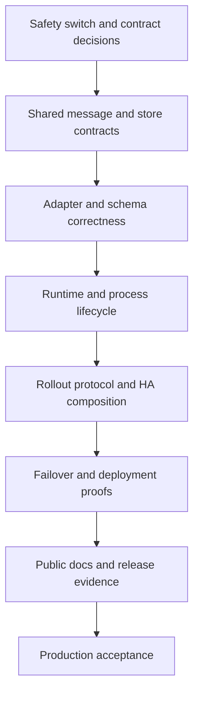

# Production Readiness Remediation Implementation Plan
> **For agentic workers:** REQUIRED SUB-SKILL: Use `subagent-driven-development` (recommended) or `executing-plans` to implement this plan task-by-task. Steps use checkbox (`- [ ]`) syntax for tracking.

**Goal:** Close every stable finding in the canonical `PROD_READY_ISSUES.md` ledger with tested behavior, truthful contracts, safe migrations, and release evidence.

**Plan status:** Chunks 1–7 landed and are checked off below with their residuals; chunks 1–4 are the commits `cf86968f`, `84939bf5`, `f0c9685c`, `b781f741`. The ledger re-verification at HEAD `b781f741` added 22 findings (HIGH-14…20, MEDIUM-18…25, LOW-20…26), withdrew LOW-7 and LOW-19, and downgraded MEDIUM-12 and BLOCKER-2; the coverage matrix and two new chunks (24, 25) absorb them. Chunks 24 and 25 are placed at the end of Phase 1 by dependency but carry P0 defects — schedule them immediately after Chunk 5.

**Architecture:** Keep domain and port contracts inward-facing. Change shared contracts and persistence formats before adapters, then wire composition roots, deployment, observability, and documentation. Coordinated rollout stays disabled in the shipped autoscaled high-availability facade until the static-member implementation and its deployment proof pass.

**Tech Stack:** Go 1.25+, Paho MQTT v0.23.0, SQLite, DynamoDB, AWS CDK, Docker, Markdown.

## Overview

The plan repairs message identity, MQTT protocol handling, outbox ordering and fencing, lifecycle bounds, cluster rollout, deployment safety, and operator evidence. Quality of Service (QoS) 1/2 remains at-least-once. The dead-letter queue (DLQ) remains loss-safe and can contain duplicates. A service-level objective (SLO) is accepted only for the failure modes covered by its formula and tests.

Each chunk is a reviewable implementation boundary. Run commands from the repository root unless a command uses `go -C` or `make -C`.

## Scope and non-goals

**In scope**
- All 132 stable IDs in the canonical production-readiness ledger (110 original + 22 added 2026-08-18). Withdrawn IDs (LOW-7, LOW-19) stay mapped for matrix totality but require no work.
- Port, schema, adapter, runtime, composition-root, deployment, test, alarm, runbook, and reference changes needed to close those IDs.
- Backward reads of existing SQLite and DynamoDB outbox data during ordering-key migration.
- Whole-cohort deployment rules while store or identity contracts change.

**Non-goals**
- Exactly-once delivery, lossless MQTT QoS 0, or atomic runtime application across a fleet.
- A universal broker claim beyond the broker and feature matrix proved by required tests.
- A durable per-message outcome ledger. Deployments that require one must add it as a separate product capability.
- Diff-based reload in this remediation. Accepted reloads keep full-session restart semantics.

## Global invariants

- `Envelope.Subject` remains logical; `OutboundMessage.Address` remains the transport destination.
- Every outbox terminal mutation is partition-scoped and lease-fenced. A stale owner cannot expire or complete work.
- A nil store result that permits source settlement means crash-durable persistence unless the configuration explicitly acknowledges volatility.
- Every progress-critical remote call has an operation deadline. Local deadmen and shutdown do not wait behind remote I/O.
- One process shutdown budget covers watchers, rollout, HTTP, runtime drain, sessions, stores, and telemetry.
- Tests use injected clocks, channels, and `testutil/wait`; no `time.Sleep` or wall-clock assertions.
- Behavior changes land before their public documentation. Unsafe rollout claims remain off until the proving chunk passes.
- Metrics are operational signals, not proof of per-message conservation.
- **No backward compatibility. GoBridge has never been deployed.** No store,
  table, or database anywhere holds data written by an earlier build, so there
  is nothing to migrate, backfill, or read in an older shape. A schema change is
  the new DDL and nothing else: no in-place column migration, no backfill job,
  no migration marker, no "legacy row" read path, no version gate, and no
  runbook step for upgrading existing data. Every chunk REMOVES such machinery
  from the code it touches rather than extending it. This invariant holds until
  the first real deployment; at that point migrations become a normal
  requirement and this line is deleted.

  The repository-wide sweep that established it removed: the SQLite outbox and
  DLQ in-place column migrations and the identity table rebuild; the DynamoDB
  `ClaimIndex`-absent degrade-to-scan path (the index is now REQUIRED and
  verified by preflight); the DynamoDB sort-key cross-scheme migration framing;
  the replay-budget `CreatedAt` fallback (with `WithOutboxPoisonMinAge` and the
  `PoisonMinAge` term); the legacy fixed drain-batch ceiling that `bridge.drain_timeout`
  fed alongside its real meaning (the supervisor's `Runtime.Stop` budget); a
  lease-row migration note; and the GSI migration runbook, replaced by a
  table-schema reference. Anything found later that
  reads or repairs data written by an earlier build is a defect against this
  invariant.

## Accepted tradeoffs

- Full-session reload is retained. The contract requires batched changes and states the QoS 0 and ephemeral-session loss window.
- DLQ writes remain synchronous with a bounded 10.5-second production hold. No spill queue is added unless a later design preserves durable evidence before source settlement.
- Route readiness means pipeline liveness, not recent target success. Delivery-stall metrics carry target availability.
- SQLite `replay_count` continues to count claims. Poisoning remains the claim-count **and** wall-clock-budget condition.
- Locator expiry and cold takeover retain skew-safe observation behavior. Runbooks budget clock skew and the full observation window.
- `ErrApplyInFlight` retains poll-to-resolution semantics through deep health.
- Cluster commit is store-atomic. Runtime apply is per member, with bounded retry, terminal replacement on unrecoverable divergence, fresh health, and fleet alarms.

## Migration and rollout rules

1. Chunk 1 disables unsafe coordinated-rollout admission and overlapping incompatible ECS replacement before any rollout rebuild.
2. Port and record contracts land before store adapters. Adding a fencing token to `OutboxStore.Expire` is a coordinated breaking change for external implementations: publish it in the next allowed API-breaking release, provide an adapter migration note with the old and new signatures, and update all in-repository implementations in the same release train.
3. Fenced expiry reuses existing partition fence state. SQLite validates and raises `outbox_partition_fence` in the expiry transaction; DynamoDB condition-checks the partition fence in each terminal write; memory checks `latestVersion`.
4. Ordering support adds a persisted `ordering_key` to every backend's schema. Per the no-backward-compatibility invariant there is no backfill, no migration marker and no index-active gate: no store holds a record written before the column, so the attribute is the single source of a record's key.
5. Any legacy read path, in-place column migration, or table rebuild encountered while working a chunk is DELETED, not extended. Store readiness depends on the current schema only.
6. Store/identity-incompatible releases use whole-cohort replacement with ingress quiesced. Coordinated rollout is not used to deploy its own prerequisites.

## Dependency order



Chunks within a phase may run in parallel only when their dependency line permits it.

## Issue-to-chunk coverage matrix

The **Primary issue IDs** column is the single authoritative mapping. Issue references in chunk details are cross-cutting and may repeat.

| Chunk | Status | Primary issue IDs |
|---|---|---|
| 1 | done | HIGH-9 (residual open, rechecked in 17), HIGH-10 |
| 2 | done | MEDIUM-7, MEDIUM-9, MEDIUM-10, MEDIUM-11, LOW-6, NEW-LOW-4 |
| 3 | done | HIGH-1, HIGH-8, NEW-HIGH-1, NEW-HIGH-2, LOW-17 |
| 4 | done | NEW-HIGH-3, MEDIUM-1 (residual open), MEDIUM-13, MEDIUM-14, NEW-MEDIUM-4, LOW-10 |
| 5 | done | BLOCKER-3, NEW-MEDIUM-7, LOW-27 |
| 6 | done | NEW-HIGH-4, HIGH-18, HIGH-19, MEDIUM-8, NEW-MEDIUM-8, MEDIUM-22, LOW-16, LOW-24, LOW-25 |
| 7 | done | HIGH-13, MEDIUM-16, MEDIUM-17 |
| 8 | done | HIGH-11, HIGH-12, HIGH-14, MEDIUM-15, MEDIUM-18, MEDIUM-19, LOW-1, NEW-HIGH-5, NEW-LOW-1 |
| 9 | done | NEW-MEDIUM-1, NEW-MEDIUM-2, NEW-MEDIUM-3, NEW-MEDIUM-5, NEW-MEDIUM-6, NEW-LOW-9 |
| 10 | done | LOW-3, LOW-4, NEW-MEDIUM-12, NEW-MEDIUM-13, NEW-MEDIUM-14, NEW-MEDIUM-15, NEW-LOW-6 |
| 11 | done | HIGH-6, HIGH-15, HIGH-20, MEDIUM-3, MEDIUM-4, MEDIUM-6, MEDIUM-23, MEDIUM-25 (premise corrected; see the ledger), LOW-15, LOW-20, NEW-MEDIUM-9, NEW-TEST-1 |
| 12 | done | LOW-7 (withdrawn), LOW-13, LOW-14, NEW-MEDIUM-10, NEW-MEDIUM-11, NEW-LOW-5 |
| 13 | waiting | LOW-5, LOW-11, LOW-12, MEDIUM-20, NEW-LOW-2, NEW-LOW-3 |
| 14 | waiting | HIGH-2, HIGH-7, LOW-2 |
| 15 | waiting | BLOCKER-2, MEDIUM-2, MEDIUM-12 (downgraded; hardening) |
| 16 | waiting | HIGH-5, MEDIUM-5, LOW-8, LOW-9, DOC-5 |
| 17 | waiting | BLOCKER-1, DOC-12 |
| 18 | waiting | HIGH-3, HIGH-4, TEST-3, DOC-7, DOC-14 |
| 19 | waiting | DOC-3, DOC-6, DOC-13 |
| 20 | waiting | LOW-18, LOW-19 (withdrawn), DOC-1, DOC-4, DOC-10, NEW-MEDIUM-16 |
| 21 | waiting | DOC-8, DOC-15, NEW-LOW-7, NEW-LOW-8, LOW-26 |
| 22 | waiting | DOC-2, DOC-9, DOC-11 |
| 23 | waiting | TEST-1, TEST-2, TEST-4, TEST-5, TEST-6, TEST-7, TEST-8, TEST-9, TEST-10, TEST-11, TEST-12 |
| 24 | done | HIGH-16, MEDIUM-21, LOW-22, LOW-23 |
| 25 | waiting | HIGH-17, MEDIUM-24, LOW-21 |

## Phase 0: Stop unsafe claims and freeze accepted contracts

### Chunk 1: Deployment safety switch and reload contract

- **Issues:** HIGH-9, HIGH-10; prerequisite control for BLOCKER-1.
- **Goal:** Reject coordinated rollout in the autoscaled facade, force whole-cohort replacement for incompatible revisions, and retain documented full-session reload.
- **Dependencies:** None.
- **Files/packages:** `deployment/aws-filebased-config/cdk/constructs/gobridgedynamodbha/ha.go`, `deployment/aws-filebased-config/lib/bootstrap/rollout.go`, `bridge/supervisor.go`.
- **Tests:** `deployment/aws-filebased-config/cdk/constructs/gobridgedynamodbha/ha_test.go`, `deployment/aws-filebased-config/lib/bootstrap/rollout_test.go`, `bridge/supervisor_reload_test.go`.
- [x] Add failing tests for coordinated admission on interchangeable workers, incompatible revision overlap, and one-route changes restarting all sessions.
- [x] Run `go -C deployment/aws-filebased-config/cdk test -count=1 ./constructs/gobridgedynamodbha -run 'Test.*(Rollout|Replacement)'`; expect current synth assertions to fail.
- [x] Add the facade safety gate and whole-cohort deployment policy. Keep low-level rollout code available for custom/static-slot hosts.
- [x] Run the targeted CDK command and `go test -race -count=1 ./bridge -run 'Test.*Reload'`; expect pass.
- [x] Run `go -C deployment/aws-filebased-config/lib test -race -count=1 ./bootstrap -run 'Test.*ClusterReload'`.
- [x] Emit actionable rejection text and deployment events; defer final rollout capability docs to Chunk 17.
- [x] Accept when autoscaled workers cannot enable coordinated rollout or overlap incompatible identities, and reload tests pin full-session restart.
- **Landed:** `cf86968f`. **Residual (HIGH-9, carried to Chunk 17):** 0/100 constrains counts, not order — at desired ≥2 ECS still replaces in batches; nothing rejects startup beside an incompatible generation; `docs/aws-deployment/overview.md:73-76` overclaims whole-cohort replacement.
- **Suggested commit title:** `fix deployment rollout safety defaults`

### Chunk 2: Explicit operational tradeoff contracts

- **Issues:** MEDIUM-7, MEDIUM-9, MEDIUM-10, MEDIUM-11, LOW-6, NEW-LOW-4.
- **Goal:** Close accepted tradeoffs through executable decision tests, metrics, and operator contracts instead of speculative concurrency or clock logic.
- **Dependencies:** Chunk 1.
- **Files/packages:** `runtime/dlq/router.go`, `runtime/cluster/locator.go`, `cmd/gobridge/reload.go`, `runtime/bridge_health.go`, `runtime/outbox/retry.go`, `docs/routes-and-runtime-reference.md`, `docs/runbooks/`.
- **Tests:** `runtime/dlq/router_test.go`, `runtime/cluster/locator_test.go`, `cmd/gobridge/reload_terminal_test.go`, `runtime/bridge_health_test.go`, `runtime/outbox/replay_budget_test.go`.
- [x] Add failing contract tests for the 10.5-second DLQ bound, skew/cold-takeover disclosure, poll-to-resolution state, liveness-only readiness, and claim-count poison semantics.
- [x] Run `go test -race -count=1 ./runtime/... ./cmd/gobridge -run 'Test.*ProductionContract'`; expect missing status or contract assertions to fail.
- [x] Add only the missing bounded status/metric surfaces; retain synchronous DLQ, skew-safe observation, and claim-count semantics.
- [x] Re-run the exact failing command above; expect pass.
- [x] Run `go test -race -count=1 ./runtime/... ./cmd/gobridge`.
- [x] Update route, failover, DLQ, and reload runbooks with the accepted behavior and alarm thresholds.
- [x] Accept when each tradeoff has a deterministic test, an operator signal, and no stronger guarantee in public text.
- **Landed:** `84939bf5` (`MetricDLQWriteHold`, `MetricRouteOwnerUnknown`, `reload_terminal_test.go`, `bridge_health_test.go`, `replay_budget_test.go`, runbooks). Add the new metrics to `docs/aws-deployment/monitoring.md` tables in Chunk 19 (DOC-3).
- **Suggested commit title:** `document and test production tradeoffs`

## Phase 1: Shared contracts, MQTT boundaries, and stores

### Chunk 3: MQTT provenance and durable message identity

- **Issues:** HIGH-1, HIGH-8, NEW-HIGH-1, NEW-HIGH-2, LOW-17.
- **Goal:** Make producer identity source-scoped, binary-safe, alias-stable, and observable on duplicate suppression.
- **Dependencies:** Chunk 2.
- **Files/packages:** `ports/transport.go`, `ports/storetest/`, `adapters/mqtt/transport/paho/acl_headers.go`, `adapters/mqtt/transport/paho/config_identity.go`, `runtime/route/dispatch.go`, `runtime/route/leakguard.go`, source adapters.
- **Tests:** `adapters/mqtt/transport/paho/generated_identity_test.go`, `headers_test.go`, `config_identity_test.go`, `runtime/route/dispatch_test.go`, source-adapter conformance tests.
- [x] Add failing hostile-marker, binary-correlation redelivery, URL-alias collision, duplicate metric, and source-ID stability tests.
- [x] Run `go -C adapters/mqtt/transport/paho test -race -count=1 ./... -run 'Test.*(Identity|Correlation|Generated)'`; expect spoofing and alias cases to fail.
- [x] Move generated provenance to private callback state, preserve raw Correlation Data with a stable encoded envelope ID, canonicalize effective endpoints, and meter all duplicate suppression.
- [x] Run the targeted adapter command and `go test -race -count=1 ./runtime/route ./ports/... -run 'Test.*(Identity|Duplicate)'`; expect pass.
- [x] Run `make test` to execute identity conformance for every source adapter.
- [x] Document authenticated producer ownership, source scoping, collision signals, and binary round trip.
- [x] Accept when hostile properties cannot set provenance, aliases collide at preflight, binary identity survives redelivery, and suppression is visible.
- **Landed:** `f0c9685c` (`acl_identity.go`, `config_identity.go` canonical endpoints, `MetricOutboxDuplicateSuppressed`, `ports/transporttest/identity.go`). Accepted residual: raw Correlation Data >256 B still mints a generated identity (pinned); the 193–256 B encoded band exceeds a downstream bridge's 256-character header cap (unverified by test — add a bridge-to-bridge round-trip test in Chunk 8 if that topology is supported).
- **Suggested commit title:** `fix mqtt identity trust boundaries`

### Chunk 4: MQTT wire limits, memory accounting, proxy TLS, and expiry

- **Issues:** NEW-HIGH-3, MEDIUM-1, MEDIUM-13, MEDIUM-14, NEW-MEDIUM-4, LOW-10.
- **Goal:** Reject invalid or over-limit egress before socket write and make ingress memory and proxy TLS match real protocol behavior.
- **Dependencies:** Chunk 3.
- **Files/packages:** `adapters/mqtt/transport/paho/acl_dial.go`, `acl_headers.go`, `acl_client.go`, `acl_net.go`, `config_ingress_memory.go`, `ingress_conn.go`.
- **Tests:** `connect_limits_test.go`, `headers_test.go`, `ingress_memory_test.go`, `acl_net_test.go`, authenticated MQTT integration tests.
- [x] Add failing tests for CONNACK Maximum Packet Size, 65,535-byte fields, expired envelopes, tiny-property amplification, uppercase and lowercase proxy variables, `NO_PROXY`, explicit direct mode, and proxy `ServerName`.
- [x] Run `go -C adapters/mqtt/transport/paho test -race -count=1 ./... -run 'Test.*(Packet|Header|Expiry|Proxy|IngressMemory)'`; expect limit and proxy cases to fail.
- [x] Capture limits by connection generation; make packet construction error-returning; return `ErrPayloadTooLarge`; fix memory formula and canonical proxy/TLS setup.
- [x] Re-run the exact failing command above; expect pass.
- [x] Run `make test-integration` for real broker limit and certificate validation.
- [x] Add rejection metrics and update MQTT memory, proxy, field-limit, and expiry contracts.
- [x] Accept when no over-limit packet reaches the wire, no field truncates, proxy TLS verifies the broker, and admitted memory covers legal metadata.
- **Landed:** `b781f741`. **Residual (MEDIUM-1, still open in this chunk):**
- [ ] Budget the transient decode for the whole advertised packet (`max_payload_bytes + 128 KiB`, so ≈78,600 minimum properties at defaults) instead of `128 KiB / 5`, or reject property count pre-decode in `ingress_conn.go`; add a failing `config_ingress_memory` test for a zero-payload packet at the advertised maximum and a finite-cgroup long-running proof with maximum-count tiny properties.
- **Suggested commit title:** `enforce mqtt wire and memory limits`

### Chunk 5: Lease-fenced outbox expiry and store call deadlines

- **Issues:** BLOCKER-3, NEW-MEDIUM-7.
- **Goal:** Fence expiry at the store transaction and bound expiry and depth calls.
- **Dependencies:** Chunk 2.
- **Files/packages:** `ports/stores.go`, `ports/storetest/`, `runtime/outbox/loop.go`, memory, SQLite, and DynamoDB outbox adapters.
- **Tests:** `ports/storetest/outbox_fencing.go`, `runtime/outbox/loop_test.go`, each adapter's conformance entry point.
- [x] Add failing conformance tests for a stale-owner expiry race and context-bound `Expire`/`CountPending`.
- [x] Run `go test -race -count=1 ./runtime/outbox ./ports/storetest -run 'Test.*(Expire|StoreDeadline)'`; expect signature or fencing failures.
- [x] Change `OutboxStore.Expire` to require `LeaseToken`; implement transactional fence checks and use `storeOpContext` for expiry and depth.
- [x] Run `go -C adapters/native/store/memoryoutbox test -race -count=1 ./... -run 'Test.*Expire'`, `go -C adapters/native/store/sqliteoutbox test -race -count=1 ./... -run 'Test.*Expire'`, and `go -C adapters/aws/store/dynamodboutbox test -race -count=1 ./... -run 'Test.*Expire'`; expect pass.
- [x] Run `make test-integration` for SQLite and DynamoDB Local stale-owner races.
- [x] Update port and architecture contracts, metrics, and migration notes; state that existing fence records need no schema rewrite.
- [x] Accept when a stale token cannot expire a pending row and black-holed expiry/depth returns within the configured operation budget.
- **Landed:** fence enforced in all three backends (memory under `s.mu`, SQLite in one transaction via the shared `partitionFenceVersion` helper, DynamoDB via an up-front fence raise plus a per-record `ConditionCheck` transaction); `Expire` and `CountPending` bounded by `storeOpContext`; an accepted sweep raises the high-water-mark; a refused sweep now backs off the drain cycle instead of being warn-logged, and a partially completed sweep still emits `MessagesExpired`. Conformance (`ExpireRejectsZeroToken`, `ExpireRejectsStaleVersion`, `ExpireAdvancesPartitionFence`) runs against all three real backends including DynamoDB Local; mutation-checked. Migration note in `CHANGELOG.md`; contracts in `ports/stores.go`, `ARCHITECTURE.md`, `PLUGIN.md`.
- **Also closed here:** LOW-27 — a DynamoDB expiry sweep interrupted by its operation deadline now resumes at the page it stopped on instead of restarting at the head, so a foreign backlog sitting at the front of the globally-hashed `ExpiryIndex` can no longer consume the whole budget before a partition reaches its own records. The cursor is an optimisation only: losing it costs a restarted pass, never correctness.
- **Suggested commit title:** `fence outbox expiry operations`

### Chunk 6: Cross-cycle ordering, reclaim, and DLQ idempotency

- **Issues:** NEW-HIGH-4, HIGH-18, HIGH-19, MEDIUM-8, NEW-MEDIUM-8, MEDIUM-22, LOW-16, LOW-24, LOW-25.
- **Goal:** Prevent same-key overtaking (including DynamoDB GSI lag and mid-batch claim discard), expose claimed backlog, release unattempted group tails, bound reclaim safely, and make repeated DLQ writes identify one terminal event.
- **Dependencies:** Chunk 5.
- **Files/packages:** `domain/persistence/outbox.go`, `ports/stores.go`, `ports/storetest/`, `runtime/outbox/`, `runtime/dlq/router.go`, SQLite/DynamoDB/memory outbox schemas, HA CDK data.
- **Tests:** ordering/release cases in `ports/storetest/outbox_fencing.go`, SQLite migration tests, DynamoDB Local tests, `runtime/dlq/router_test.go`.
- [x] Add failing A-stranded/B-pending ordering tests, claimed-depth tests, unsafe stale-window validation, and DLQ write-success/ACK-failure replay tests.
- [x] Add failing DynamoDB tests for (a) an older ordering-key sibling that is not yet visible in `ClaimIndex` while a younger one is (inject index lag through the fake client), (b) a 100-record claim whose 60th `TransactWriteItems` throttles or whose context expires — assert the first 59 are returned (or released), not stranded, and that `replay_count` is not charged, (c) an `Expire` whose second page fails still reports the first page's count; add a drainer test where the `default` branch (DLQ-write error / post-send `Complete` error) releases the unattempted tail; fix `delivery_hook_outbox_test.go:132,287` to expect a 1-based attempt.
- [x] Run `go -C adapters/native/store/memoryoutbox test -race -count=1 ./... -run 'Test.*Ordering'`, `go -C adapters/native/store/sqliteoutbox test -race -count=1 ./... -run 'Test.*Ordering'`, `go -C adapters/aws/store/dynamodboutbox test -race -count=1 ./... -run 'Test.*Ordering'`, and `go test -race -count=1 ./runtime/outbox ./runtime/dlq -run 'Test.*(Ordering|Stranded|DLQDuplicate)'`; expect overtaking and random IDs. *(The `-run` patterns above match nothing: tests are named after the behaviour they pin, not the batch, so the real commands are `-run 'TestOutboxStoreConformance|TestOutboxClaimedDepthConformance|TestOrderingKey|TestClaim_|TestExpire_'` per adapter and `-run 'TestDrainBatch_|TestProcessRecord_Attempt|TestEmitDepth_|TestRouter_'` for the runtime.)*
- [x] Persist/index `ordering_key`, block younger non-terminal siblings, report pending plus claimed/stranded state, validate reclaim floor, and derive stable DLQ entry identity.
- [x] Make the DynamoDB age-ordered claim path strongly consistent (LSI hash=PK/range=claim_sort read with `ConsistentRead`, or route ordering-keyed partitions to the consistent scan) or downgrade the DynamoDB ordering promise in ADR 0005/`ports/stores.go`; return partial claims on transient mid-batch failure and size the claim bound to the batch; release the group tail in the drainer's `default` branch; use `rec.ReplayCount()` for the attempt number; emit `MessagesExpired` for pages already flipped before an `Expire` error.
- [x] Re-run the exact failing commands above; expect pass.
- [x] Run `make test-integration` for SQLite migration and DynamoDB index/backfill behavior.
- [x] Publish the migration order, rollback limits, index-active gate, backfill marker, and duplicate contract. *(Superseded by the no-backward-compatibility invariant: there is no migration order, rollback limit, index-active gate or backfill marker to publish — only the schema and the duplicate contract, both documented.)*
- [x] Accept when legacy rows migrate without loss, same-key work cannot overtake, stranded work is visible/reclaimable, and DLQ redelivery is idempotent.
- **Landed:** ordering-key head-of-line rule added to the `Claim` contract and enforced by all three backends (SQLite: an `ordering_key` column, a partial index, and a `NOT EXISTS` sibling subquery; memory: a per-key blocker map under the store mutex; DynamoDB: client-side over a `ConsistentRead` base-table scan that now reads every NON-TERMINAL record so a stranded head is visible as a blocker). DynamoDB ordering is made honest rather than promised: a claim that sees ANY ordering key abandons the eventually-consistent `ClaimIndex` — having claimed nothing — and re-runs on the base table, so keyless partitions keep the O(limit) fast path and keyed ones pay the scan; no backfill, marker or index-active gate exists because nothing was ever deployed to migrate — the attribute is the single source of a record's key, and the SQLite store's whole in-place migration machinery (column migrations, the identity table rebuild, the legacy fence stamp) was deleted along with its tests. `Claim` may now return a SHORT batch with a nil error, so a mid-batch throttle/deadline no longer discards durably-claimed records (`DynamoDBOutboxClaimTruncated`), and the claim bound scales as `max(send_timeout, limit x 100ms)` capped at two minutes instead of reusing the per-message send timeout. New optional `ports.OutboxClaimedDepthReporter` feeds `OutboxClaimedDepth` so stranded work is visible where `CountPending` reads zero. The drain loop's `default` branch releases the unattempted ordering-group tail; hook attempt numbers are 1-based on the outbox path. DLQ entry identity is `sha256(envelope, route, binding, source)` and a duplicate refusal is reported as durable success (`DLQDuplicateSuppressed`), so a write-then-failed-settle records one terminal event instead of a row per redelivery. An explicit `stale_claim_duration` at or below the largest route `send_timeout` is now rejected and below the full batch ceiling warns; the HA fixture's own 20 s value was one such case and was corrected. Every new test is mutation-checked; conformance runs against all three real backends including DynamoDB Local. Contracts in `ports/stores.go`, ADR 0005, `ARCHITECTURE.md`, `PLUGIN.md`, `CHANGELOG.md`, the GSI migration runbook, and the monitoring/observability tables.
- **Also closed here:** LOW-25 — verified already fixed by Chunk 5's incremental sweep (`expireByStatus` returns its count on every error path and `maybeExpire` emits `MessagesExpired` before handling the error); pinned by a new page-failure regression so it cannot silently regress.
- **Suggested commit title:** `preserve outbox order across claims`

### Chunk 7: Store durability and fencing-compatible composition

- **Issues:** HIGH-13, MEDIUM-16, MEDIUM-17.
- **Goal:** Reject fencing-version regression and require operators to acknowledge process-volatile outbox or DLQ state.
- **Dependencies:** Chunks 5–6.
- **Files/packages:** `ports/stores.go`, `bridge/builder_prepare.go`, `adapters/native/store/config.go`, `factory.go`, production profile validation.
- **Tests:** `bridge/builder_prepare_test.go`, `adapters/native/store/factory_test.go`, reload/restart pairing tests.
- [x] Add failing tests for memory-lease/SQLite-outbox composition, unacknowledged memory outbox/DLQ, and nil-success durability wording. *(The nil-success boundary is prose in `ports/stores.go`, so what is pinned is the testable half of it: `TestNativeStoreFactory_DeclaresCrashDurability` asserts each factory answers the capability truthfully, since the guard's whole correctness rests on that answer.)*
- [x] Run `go test -race -count=1 ./bridge -run 'Test.*(Durability|LeaseOutbox)'` and `go -C adapters/native/store test -race -count=1 ./... -run 'Test.*Factory'`; expect unsafe pairings to build.
- [x] Define the crash-durable success boundary, add a store durability capability, reject volatile lease with durable fenced outbox, and add `acknowledge_volatile`.
- [x] Re-run the exact failing commands above; expect pass.
- [x] Run `make test` for every accepted lease/outbox pair across reload and reconstructed stores. *(`TestSupervisorReload_StoreDurability_AcceptedPairingsSwap` drives all three accepted pairings through a real supervisor reload, which reconstructs every store and re-runs the guard; `TestStoreFactory_MemoryLeaseVersionResetWedgesDurableOutboxFence` rebuilds the lease store against a surviving SQLite fence.)*
- [x] Name affected routes in warnings and exclude acknowledged volatile stores from the production profile docs.
- [x] Accept when every accepted pairing preserves monotonic fencing and volatile persistence cannot look crash-durable without explicit consent.
- **Landed:** `ports/stores.go` defines the crash-durable success boundary — a nil `OutboxStore.Persist` / `DLQAdmin.Write` means the record outlives this process, because the runtime settles the SOURCE on that nil — and adds the optional `ports.CrashDurableStoreFactory`; an undeclared factory is read as NOT durable, mirroring `DistributedStoreFactory`'s fail-closed default, so a durable store has to say so. `bridge/store_durability.go` rejects a volatile `LeaseStore` under a crash-durable `OutboxStore`, scoped to blueprints carrying a `shared_outbox` route: a fencing token only reaches the store from a drainer, so a durable outbox nothing drains cannot wedge. The wedge itself is proven, not asserted — `TestStoreFactory_MemoryLeaseVersionResetWedgesDurableOutboxFence` raises a real SQLite partition fence to version 2, rebuilds the in-memory lease (a restart), and shows the reissued version 1 rejected as `ErrStaleFencingToken`. The memory outbox and DLQ now fail closed on `acknowledge_volatile` exactly as the lease does on `acknowledge_single_replica`, and an accepted volatile store warns at startup naming the affected routes (capped at 20 plus a count). Two guards keep the pairing unreachable from a running system and both are pinned: cold start refuses it, and a live reload is refused earlier still by the backing-store repoint guard. Contracts in `ports/stores.go`, `ports/stores_outbox.go`, `UBIQUITOUS.md`, `CHANGELOG.md`; the store reference and every `memory`-store example in `docs/` and `ARCHITECTURE.md` were corrected — `docs/scenarios/05-durable-shared-outbox.md` had been publishing the rejected pairing (memory lease + SQLite outbox) as its headline configuration, along with a note calling it safe.
- **Also closed here:** an unrelated latent defect found in review — `deployment/aws-filebased-config/cdk/bridgecfg` emitted `MemoryConfig{}` for `WithMemoryOutbox`/`WithMemoryDLQ`, so every CDK app using them would have failed to boot once the acknowledgement gate landed; it now sets the flag the way `WithMemoryLease` already did. Two pre-existing contract gaps in the same factory were closed while classifying the new gate's error: the single-replica gate and the SQLite path/type checks returned unclassified `fmt.Errorf`, so the composition root could not tell an operator config error from a store I/O failure. All now carry `shared.ErrInvalidConfig`, and the unimplemented SQLite lease role carries `shared.ErrNotSupported` (a missing capability, not a bad config); `.go-arch-lint.yml` grants `adapter_store_native_factory` the `domain_shared` edge its AWS sibling already held, with the reason recorded inline. The stale `c10-memlease-split` planning identifier was removed repo-wide (19 references) — including two that had leaked into operator-facing telemetry as a `finding` log/error attribute, now the durable `risk=split-brain`.
- **Residual:** `docs/processors-and-stores.md` is 702 lines against the 600-line documentation limit; it was already 663 before this chunk, so splitting it is its own task.
- **Suggested commit title:** `enforce store durability contracts`

### Chunk 8: MQTT reservation, recovery, close, and settlement metrics

- **Issues:** HIGH-11, HIGH-12, HIGH-14, MEDIUM-15, MEDIUM-18, MEDIUM-19, LOW-1, NEW-HIGH-5, NEW-LOW-1.
- **Goal:** Release every reservation, never purge a live-connection publish, keep recovery within settlement bounds, close cooperatively (router before client), and measure loss/reconnect by lifecycle state.
- **Dependencies:** Chunks 3–4.
- **Files/packages:** `adapters/mqtt/transport/paho/acl_router_*`, `session_recovery.go`, `receiver.go`, `runtime/session/bounded.go`, `manager_lease.go`.
- **Tests:** covered-drop tests, `session_recovery_test.go`, `bug_prodready_session_test.go`, runtime session bounded-call tests.
- [x] Add failing enqueue-level reservation reuse, slow bounded send, close-deadline, close-cancelled cooldown, connection-epoch ACK, and QoS 0 emit-drop tests.
- [x] Add failing tests for (a) a publish enqueued after CONNACK and before `beginGrace` (both the autopaho-reconnect and the `discarding` recycle case) — assert dispatch and ack, not `stalePurged`, and that unsettled gauges are not cleared for the current client; (b) a QoS 1 arrival through `enqueueDispatch` while pending is full of grace-buffered QoS 0 — assert the oldest QoS 0 is evicted and the callback does not block; (c) `Session.Close` with a callback parked in `reserveQueueSlot` — assert `Close` returns within the router-shutdown path, not the full deadline.
- [x] Run `go -C adapters/mqtt/transport/paho test -race -count=1 ./... -run 'Test.*(Recovery|Close|Covered|Reconnect|Emit)'` and `go test -race -count=1 ./runtime/session -run 'Test.*Close'`; expect current defects.
- [x] Release reservations on every branch; derive recovery drain from settlement ceilings; pass a detached timeout to `Close`; bind cooldown to session lifetime; carry ACK epoch and drop reason.
- [x] Move the old-generation-is-dead transition to `OnConnectionDown` / after the old manager's `Disconnect` returns (or stamp items with `pr.Client`), and stop `clearUnsettledLocked` from touching current-client entries; evict pending QoS 0 before blocking QoS 1/2 in `reserveQueueSlot` (or give QoS 0 a non-blocking sub-budget) and fix the drop attribution; call `router.shutdown()` before `cm.Disconnect` in `Session.Close`.
- [x] Re-run the exact failing commands above with fake clocks and channels; expect pass.
- [x] Run `make test-integration` for a real broker reconnect and slow-target recovery.
- [x] Update settlement metrics and the stuck-settlement runbook inputs without changing at-least-once wording.
- [x] Accept when capacity is reusable, cooperative slowness does not restart unrelated routes, close obeys deadline, and every QoS 0 emit loss is counted.
- **Landed:** the router's connection generation now advances once per REPORTED connection teardown (`acl_router_generation.go`: `noteConnectionTornDown`, wired to autopaho's connection-down edge and to the return of every explicit `Disconnect`), and is opened by whichever of the connection-up callback or the replacement connection's first packet arrives first. That keeps a CONNACK backlog which beats the callback dispatchable, its acknowledgement live, and its unsettled bookkeeping intact. Gating on the teardown report is what makes the client pointer safe to use as generation identity: two Paho clients can be alive at once whenever a `Disconnect` times out while the replacement connects, so an unfamiliar client alone would thrash the generation between two live sockets and lift a recycle's discard window from the socket it exists to fence off. `MQTTAckAfterReconnect` is measured the same way — client identity, not the connection epoch, which also advances for a recycle on a live socket. `reserveQueueSlot` now reclaims the oldest reserved pending QoS 0 for a QoS 1/2 admission instead of parking Paho's publish-callback goroutine (the goroutine that also reads PINGRESP), and the QoS 0 drop log names the refusing bound. `retainCovered`'s covered-QoS 0 refusal returns its reservation — the leak that retired the whole ingress budget after `receive_maximum` drops. `Session.Close` stops the router before `cm.Disconnect` (unconditionally, and before every bounded network wait), and `closeSourceBounded` passes the release-timeout deadline into `Close` — the two are complementary: the deadline is safe only because a deadline-aborted close has still stopped ingress. A close that gives up waiting for in-flight handlers now returns a timeout instead of reporting success, and ingress refused during the disconnect is metered rather than silent. The five-second recovery drain limit is deleted: `reconcile_timeout` bounds only the adapter-owned teardown phase and the settlement wait runs under the recovery attempt budget, since every settlement path is already bounded by its own route's ceilings (proved in `runtime/bridge_ingress_quiescence_blackhole_test.go`). Only settlement recovery drains that way — reconcile-driven recycles keep the reconcile bound on both phases, because those callers can run on a context with no deadline of their own. The recovery cooldown is a stoppable timer bound to the session lifetime, and a refused emit is counted on the new `MQTTReceiverEmitRejected` (`outcome=recovering|lost`) — the QoS 0 half previously left no trace at production log levels.
- **Also closed here:** an adversarial review of the landed change found five further defects, all fixed and pinned: the connection-generation marker could be stranded by a connection that delivered nothing, so the NEXT connection's live backlog was purged; two overlapping Paho clients (a `Disconnect` that timed out while the replacement connected) thrashed the generation and purged traffic on a live socket; an old socket's first packet lifted a recycle's discard window; `MQTTAckAfterReconnect` measured from the connection epoch reported every settlement in a routine recycle drain as a guaranteed redelivery and swallowed real acknowledgement failures; and dropping the adapter bound on the settlement wait left it unbounded on the reconcile path, whose callers can run on a context with no deadline while holding the session serialization gate. An unrelated pre-existing race in `bridge/rollout_confirm_window_test.go` — it read the committed artifact immediately after waiting for the Confirmed state, which the driver writes afterwards — was fixed on the way past.
- **Residual:** `docs/transports/mqtt-behavior.md` sits exactly at the 600-line documentation limit; further additions there require the split this chunk did not take on. Two adversarial-review findings were left as accepted residuals, both pre-existing and outside this chunk: `Start`'s CM-install guard checks `s.closed` but not `s.terminalErr`, so a slow in-flight `Start` can install a live ConnectionManager on a session already declared terminal (Chunk 11 owns startup/shutdown ownership); and `recoveryAttemptTimeout()` returns 0 for modes outside Persistent/Exclusive, which `contextWithClockTimeout` turns into an already-cancelled context — unreachable today because `requestRecovery` rejects Ephemeral first.
- **Suggested commit title:** `bound mqtt settlement recovery`

### Chunk 9: MQTT acknowledgement and factory validation

- **Issues:** NEW-MEDIUM-1, NEW-MEDIUM-2, NEW-MEDIUM-3, NEW-MEDIUM-5, NEW-MEDIUM-6, NEW-LOW-9.
- **Goal:** Preserve broker reason codes and reject bad direct-library configuration before activation.
- **Dependencies:** Chunk 4.
- **Files/packages:** `adapters/mqtt/transport/paho/acl_client.go`, `errors.go`, `acl_dial.go`, `config_plugin.go`, `factory.go`, `topic_validator.go`, `session_reconcile_apply.go`.
- **Tests:** `errors_test.go`, `factory_test.go`, `topic_validator_test.go`, reconcile reason-code tests.
- [x] Add failing negative SUBACK/PUBACK, packet-budget, invalid filter/QoS, legal `$aws` topic, negative timeout, and plaintext-error-class tests.
- [x] Run `go -C adapters/mqtt/transport/paho test -race -count=1 ./... -run 'Test.*(Ack|PacketTimeout|Topic|Factory|Config)'`; expect generic errors or late failure.
- [x] Return acknowledgement data with SDK errors, classify reason first, set effective `PacketTimeout`, share factory/reconcile validators, permit legal `$` names, and return `ErrInvalidConfig`.
- [x] Re-run the exact failing command above; expect pass.
- [x] Run `make test` for parser, builder, and direct factory entry points.
- [x] Update MQTT options and error-classification references.
- [x] Accept when broker denials keep their class, configured deadlines govern, and invalid configuration cannot reach a broker.
- **Landed:** the ACL now returns the SUBACK / UNSUBACK / PUBACK alongside the SDK error — the SDK produces both for every reason code at or above `0x80` — and `publishResult.Acknowledged` separates "answered with `0x00`" from "never answered". Reconcile, `unsubscribeConfirmed` and `Sender.Send` classify the reason code FIRST and fall back to the SDK's own classification only when no acknowledgement arrived, so `0x87` is `FORBIDDEN` (permanent, DLQ'd on the first attempt) instead of `UNAVAILABLE` burning the replay budget; a partially accepted SUBACK also keeps its grants in `observedSubs` rather than discarding them with the failed call. `Session.packetTimeout` derives the SDK's per-packet budget from the longest deadline that encloses a packet operation — `reconcile_timeout`, `connect_timeout`, `reconnect_timeout`, the `timeout` of every sender registered through `NewSender`, and the 30 s sender default as a floor — because the SDK applies its own bound INSIDE the caller's context and its 10 s default silently overrode every one of them; no new configuration key. One consequence surfaced by the adversarial review: a SUBSCRIBE in flight when a session is closed now waits out `reconcile_timeout` rather than the SDK's old 10 s, so `integration_resilience_test.go` states the bound it asserts against instead of inheriting the 30 s default; the runtime is unaffected because shutdown cancels the context it passed to `Reconcile`. One `ValidateMQTTSubscription` is shared by `Factory.NewReceiver` and `reconcile`, checking the filter syntax and QoS 0–2 before the narrowing `byte` conversion (the SDK writes `qos & 0x03`, so `qos: 4` reached the broker as `0`); an empty topic is now rejected rather than skipped, because `sessionPlanFor` builds the plan from the same list the receiver seam was silently dropping it from. `ValidateMQTTTopic` no longer rejects the whole `$` prefix — only `$share/`, which can never name a publish destination — so `$aws/rules/...` reaches the broker and the broker's own denial is what classifies. Every configuration failure in the adapter returns `ErrInvalidConfig` (permanent) instead of `ErrInvalidPayload` (rejected, reserved for a message).
- **Proof:** `ack_reason_preservation_test.go`, `packet_timeout_test.go`, `subscription_validation_test.go`, `config_duration_signs_test.go`, `config_error_class_test.go`, the `$`-namespace cases in `topic_validator_test.go`, `benchmark_ack_validation_test.go`, and two integration tests in `integration_packet_ack_budget_test.go` — an in-process MQTT responder that answers SUBACK after 12 s (fails at the SDK's 10 s default without the fix) and a live Mosquitto publish into `$SYS`, which the broker refuses with reason `0x87` (classified `transient` without the fix).
- **Suggested commit title:** `validate mqtt operations before activation`

### Chunk 10: Route and bridge configuration validation

- **Issues:** LOW-3, LOW-4, NEW-MEDIUM-12, NEW-MEDIUM-13, NEW-MEDIUM-14, NEW-MEDIUM-15, NEW-LOW-6.
- **Goal:** Make pre-commit validation match runtime rules and remove retry/default edge cases.
- **Dependencies:** Chunks 7 and 9.
- **Files/packages:** `config/validate.go`, `validate/blueprint_graph.go`, `bridge/convert.go`, `runtime/validator.go`, `runtime/route/dispatch.go`, `retry.go`, `domain/routing/policy.go`.
- **Tests:** config, blueprint, runtime validator, retry, and dispatch unit tests.
- [x] Add failing tests for broker-health duration, negative intervals, multiplier below one, omitted versus explicit jitter, log-level aliases, zero wedge ceiling, and nil outbox.
- [x] Run `go test -race -count=1 ./config ./validate ./runtime/... ./bridge -run 'Test.*(Validate|Backoff|Wedge|NilOutbox)'`; expect validation seams to disagree.
- [x] Share strict rules across validation boundaries, represent jitter unset distinctly, treat zero wedge as unbounded, and terminalize invalid nil-outbox wiring.
- [x] Re-run the exact failing command above; expect pass.
- [x] Run `make test` to cover admin commit, startup, and direct builder paths.
- [x] Update route-policy and log-level references after defaults are fixed.
- [x] Accept when every bad value fails before durable commit and every construction path receives the same retry defaults.
- **Landed:** `backoff.jitter` is a `*float64` on the wire and `BackoffPolicy.JitterFactor` is tri-state in the domain — zero means UNSET and `WithDefaults` fills `DefaultJitterFactor` (0.2, the value only `NewDefaultBackoffPolicy` used to carry), while `JitterDisabled` is the explicit opt-out an operator spells `jitter: 0`; a single zero could not express both, which is why every config-loaded route retried un-jittered while programmatic ones staggered. `multiplier` must now be `>= 1` at all four boundaries (blueprint validator, builder, runtime start validator, `RoutePolicy.Validate`): a value in (0,1) is acceleration, not backoff. Negative `initial_interval` / `max_interval` and an invalid or non-positive `broker_health_step_down` are rejected BEFORE the config transaction's durable write instead of at apply, so they no longer enter the rollback/divergence path. `bridge.log_level` is validated against one enum table, `ports.ParseLogLevel`, which the config validator and all three composition roots (`cmd/gobridge` flag, file-based bootstrap, admin commit) now share — a value that validates always applies, `warning` is an accepted alias, and the two per-root switch statements are deleted. `boundedSend` arms no timer when the wedge ceiling is zero: `clk.NewTimer(0)` fires at once, so the documented "no bound" marked every send hung. A `shared_outbox` route with no `OutboxStore` wedges terminally rather than looping on a cap-less one-second retry; the delivery is left unsettled, so nothing is acked or dropped. Two adjacent test defects surfaced and are fixed: three HTTP integration tests POSTed without waiting for the receiver's started signal (a pre-existing 503 flake, reproduced on a clean tree), and two config tests used `log_level` as an arbitrary marker string.
- **Proof:** `validate/route_retry_bounds_test.go`, `bridge/retry_policy_defaults_test.go`, `config/validate_log_level_test.go`, `config/parser/backoff_jitter_tristate_test.go` (the tri-state through the real YAML decoder), `runtime/route/send_wedge_ceiling_test.go`, `runtime/route/shared_outbox_nil_store_test.go`, `runtime/drainer_config_details_test.go` (`TestRouteRunner_SharedOutbox_NilOutboxStore_Terminal`, rewritten from the retry-forever contract), `ports/log_level_test.go`, the new cases in `domain/routing/policy_backoff_test.go`, `runtime/validator_test.go` and `config/validate_hardening_test.go`, `tests/integration/integration_config_api_retry_bounds_test.go` — a real admin transaction per newly bounded field, asserting 422 AND a byte-identical config file, with a negative control that commits `multiplier: 1` and `jitter: 0` and reads the opt-out back off disk — plus `runtime/route/benchmark_retry_delay_test.go` and `validate/benchmark_blueprint_graph_test.go` for the two paths whose cost changed.
- **Suggested commit title:** `unify route configuration validation`

### Chunk 24: Route dispatch cancellation, redrive provenance, and retry accounting

- **Issues:** HIGH-16, MEDIUM-21, LOW-22, LOW-23.
- **Goal:** Never acknowledge-and-drop a delivery because the bridge cancelled itself; never delete DLQ evidence for a redrive that was dropped or re-DLQ'd; charge and back off retries from the right counter.
- **Dependencies:** Chunk 3. Schedule immediately after Chunk 5 — HIGH-16 is a loss path reachable on every SIGTERM until Chunk 11 lands.
- **Files/packages:** `runtime/route/dispatch.go`, `runtime/route/leakguard.go`, `runtime/bridge_routes.go`, `httpapi/admin_dlq.go`, `domain/shared/errors.go` (classification helper only if needed).
- **Tests:** `runtime/route/bounded_ctx_test.go`, `runtime/route/dispatch_test.go`, `runtime/route/mqtt_core1_test.go`, `runtime/redrive_fresh_id_test.go`, `httpapi/admin_dlq_redrive_test.go`.
- [x] Add failing tests: cancelled delivery context + generated-ID envelope + `on_permanent_failure: drop` (and no-DLQ-store) for send, processor, resolver, outbox build and persist paths — assert no ACK and no drop metric; a DLQ redrive of an adapter-identified entry whose first send fails transiently under drop policy — assert the entry is not deleted and the admin response is not success; a re-DLQ'd redrive reports non-success; send-path backoff grows with the ledger attempt for a count-less source; outbox-at-capacity and DLQ-write-failure retries do not advance the replay ledger.
- [x] Run `go test -race -count=1 ./runtime/... ./httpapi -run 'Test.*(Cancel|Redrive|Backoff|ReplayBudget)'`; expect current ACK/drop and success responses. *(Tests are named after the behaviour they pin: the real selectors are `-run 'TestCancelledDelivery|TestDeliveryPanic_UnderCancellation|TestSendRetryBackoff|TestOutboxBackpressure|TestDLQWriteFailureRetry|TestPersistTimeout|TestInjectRedrive|TestInject_'` for `./runtime/...` and `-run 'TestHandleDLQRedrive|TestHandleInject_'` for `./httpapi`.)*
- [x] Return early from every recoverable branch when `ctx.Err() != nil` or the error is `context.Canceled` (mirror the DeadlineExceeded branch); delete `messaging.HeaderGeneratedID` in `InjectRedrive`; make a synthetic delivery's terminal drop/re-DLQ surface as a non-success outcome to admin; use `effectiveAttempt` on the send path; stop charging backpressure/DLQ-write-failure retries to the ledger.
- [x] Re-run the exact failing command above; expect pass.
- [x] Run `make test`.
- [x] Update `docs/routes-and-runtime-reference.md` (retry accounting) and the DLQ redrive runbook (dropped redrive keeps evidence).
- [x] Accept when no cancellation can settle a message terminally, a dropped redrive keeps its DLQ entry, and retry backoff/budget reflect only genuine message failures.
- **Landed:** `abandonIfCancelled` guards every recoverable dispatch branch — send, processor chain, destination resolve, outbox depth check (both the failed query and the at-capacity arm), outbox build, outbox persist — plus the delivery-panic recovery in `runner.go`, whose cancel-stripping `WithoutCancel` retry was deleted. The delivery is left unsettled and the returned error carries the cancellation. The scope is pinned by `TestSendTimeout_StillPoisonsUncountableSource`: a send that blew only its own `SendTimeout` keeps its terminal behaviour. `retryOrFallback` split into a charged and an `Uncharged` variant; the uncharged one takes outbox-at-capacity, the depth-query failure, every DLQ-write failure, and the bounded-store `Persist` deadline (the same slow-store fault as the depth query). Every `RetryDelay` now reads `effectiveAttempt`, so a count-less source backs off. `InjectRedrive` strips `x-bridge.generated-id` AND the source transport's redelivery counters (via the newly exported `route.StripInboundReceiveCounts`) — the latter is usually what exhausted the cap, so inheriting it made the redrive a no-op. A new `terminalFailureRecorder` lets a synthetic delivery learn it was settled without delivery; `Inject`/`InjectRedrive` return it wrapped in the new `ports.ErrInjectNotDelivered`, the DLQ redrive keeps the entry and answers 207, and `POST .../inject` answers 422 with the reason (audit outcome `not_delivered`) instead of claiming a delivery. Tests are mutation-checked and cover both DLQ shapes (store and no store) because the DLQ router's own `ctx.Err()` refusal masks the loss when a store is present. Glossary terms **Abandoned delivery** and **Replay ledger** added; contracts in `docs/routes-and-runtime-reference.md`, `docs/http-api.md`, the poison-message runbook and `CHANGELOG.md`.
- **Suggested commit title:** `never settle a cancelled delivery terminally`

### Chunk 25: Session-failure lease handoff and manager timing validation

- **Issues:** HIGH-17, MEDIUM-24, LOW-21.
- **Goal:** A session failure on the deferred-connect path hands the lease over within one poll; derived lease timings cannot collapse to millisecond cadence unnoticed; the manager closes its source before releasing.
- **Dependencies:** Chunk 2. Schedule immediately after Chunk 24 — HIGH-17 delays every default-profile failover to ≥ `lease_ttl`.
- **Files/packages:** `runtime/session/manager_lease.go`, `runtime/session/manager.go`, `runtime/session/config.go`, `runtime/session/bounded.go`.
- **Tests:** `runtime/session/manager_lease_test.go` (or the existing single-use session tests), `runtime/session/config_test.go`, `runtime/session/config_derive_test.go`, `runtime/session/manager_close_ctx_test.go`.
- [x] Add failing tests: exclusive + deferred manager with a single-use fake session and a fake lease store — force a reconnect-reconcile failure, run `Run` twice, assert the second `Run` returns `ErrSessionUnrecoverable` **and** the re-acquired lease is released (a standby acquires within one poll); `Config.Validate` rejects `lease_ttl: 5s`/`max_renew_fails: 5` and `lease_ttl: 45s`/`max_renew_fails: 50` (or any resolution below the floor) instead of clamping to 1 ms; `Manager.Close` closes the source (bounded) before `Release` and skips release when the close did not complete.
- [x] Run `go test -race -count=1 ./runtime/session -run 'Test.*(SingleUse|Reacquire|Validate|Close)'`; expect the held lease, the accepted clamp, and the inverse ordering.
- [x] Set `escalatable=true` for a `Start` failure carrying `ErrTransportClosedPermanently` on the `!sessionStarted` branch (nothing was accepted, release is safe) or narrow the retain branch to the reconcile/managed-migration phase; resolve timings in `Validate` exactly as `EffectiveFailoverLeaseTiming` does and reject when the clamp fires or falls below a documented floor; reorder `Manager.Close`.
- [x] Re-run the exact failing command above; expect pass.
- [x] Run `make test` and the failover budget tests (`go test -race -count=1 ./bridge -run 'Test.*Failover'`).
- [x] Update `docs/routes-and-runtime-reference.md` lease table (validation floor) and the node-down runbook (session-failure handoff is one poll, not TTL).
- [x] Accept when a session failure never leaves a dead owner holding the lease, invalid cadence fails validation, and close-before-release holds on every manager path.
- **Landed:** `escalatable` no longer means "the re-acquire reconnect path" but "nothing has been accepted yet, so releasing is safe" — which the deferred first connect satisfies too. On the default `connect_after_lease` profile a session failure closes the source, releases the lease and restarts `Run`; that fresh `Run` has `sessionStarted=false`, re-seizes the lease through the store's same-owner fast path, and only then learns the single-use transport refuses `Start`-after-`Close`. It now RELEASES that re-seized lease before going terminal, so a standby takes over within one `acquire_poll_interval` instead of a full `lease_ttl` (45s HA / 360s default) held by a provably dead owner. The reconcile / managed-migration phase keeps its retain-until-TTL branch untouched: durable route work may still unwind there. The cadence resolution moved to the domain as `routing.LeaseTimingRequest.Resolve`, and THREE boundaries now share it — the session manager, the builder, and the blueprint validator — so none can judge a configuration by values the manager will not run, and an unserveable cadence is refused BEFORE the admin config transaction's durable write rather than at apply (the failure class chunk 23 closed for `broker_health_step_down`). `validate/session_lease_cadence.go` resolves the raw route session block through the same domain code; `bridge/lease_cadence_contract_test.go` pins the validator's baseline selection against the builder's across every shape an operator writes, in both deployment modes, so the two cannot drift into disagreeing about which configurations are valid. Validation rejects an exclusive session when the expiry-margin clamp had to CUT the renew interval or the per-call timeout, or when the resolved renew interval / acquire poll falls below the new documented `MinimumLeaseCadence` (250 ms). The clamp rule is what closes the DERIVED path — the pre-existing cross-field check only ran on a pinned `renew_interval`, and a derived cadence below the floor has always been clamped first, so the floor binds on pinned values. A clamp that only SHEDS JITTER stays accepted: the clamp trims jitter first by design and the remaining cadence is healthy, so rejecting it would turn blueprints the manager has always run into hard build failures. `lease_ttl: 5s` + `max_renew_fails: 5` and `lease_ttl: 45s` + `max_renew_fails: 50` both resolved to a 1 ms renew and a 1 ms standby poll with no error: the store then throttles and its throttling errors are counted as transient renew failures, so a self-inflicted overload ends in an ownership change. `Manager.Close` was the one lease-surrendering path that released BEFORE closing the source; it now reuses `closeSourceBounded` (detached, bounded, cooperative-abort margin) and skips the release when the close never returned, matching step-down, activation failure and session-failure recovery. `closeSourceBounded` returns `(error, bool)` and takes its ceiling from the caller, so `Close` — the only caller whose own return value is the teardown result — propagates the error and is bounded by the caller's remaining deadline rather than a budget of its own (`Runtime.Stop` closes managed sessions sequentially under ONE deadline, so a per-manager budget let n sessions overrun it n-fold, and the step-down-derived budget silently shortened the configured shutdown timeout). Adversarial review added one more: releasing on a permanent-closure marker assumed nothing of ours could still send, but a session can latch that marker ASYNCHRONOUSLY — the paho ingress-poison rejection returns at once and quiesces on a goroutine — so `releaseAndReturn` now closes the source under the bounded teardown before handing off and keeps the lease when that close never returns. The timing derivation moved to the new `runtime/session/config_timing.go` to keep both files inside the source-length budget.
- **Proof:** `runtime/session/session_failure_lease_handoff_test.go` (a single-use transport whose reconnect Reconcile fails, `Run` twice on the SAME manager, asserting the re-acquired version specifically is released so the first release cannot mask a missing second), the two new cases in `runtime/session/manager_close_ctx_test.go` (`TestManager_Close_ClosesSourceBeforeReleasingLease` ordering-based via the existing `seqLeaseStore`, `TestManager_Close_WedgedSourceSkipsLeaseRelease` reusing `wedgedCloseSession`), `TestSessionManager_DeferredConnect_WedgedCloseKeepsReseizedLease` as the hand-off negative control, `runtime/session/config_lease_cadence_test.go` — one case per rejection branch, because the two collapsed profiles alone also resolve to a sub-floor acquire poll and would have left the clamp and renew-floor branches pinned by nothing (`lease_ttl: 6s` / `max_renew_fails: 4` resolves ABOVE both floors and is caught only by the clamp; a pinned 100 ms `renew_interval` with a healthy poll is caught only by the renew floor), plus negative controls for both shipped presets, a cadence exactly on the floor, and a jitter-only clamp, `validate/session_lease_cadence_test.go` (the same branches through the blueprint validator, plus a control that an unparseable duration is reported once rather than twice), `domain/routing/lease_timing_test.go` (the derived TTL x failure-tolerance matrix, the jitter-only clamp, the pinned-interval jitter asymmetry, and the baseline rule), and `bridge/lease_cadence_preflight_test.go` — a real `Builder.Plan` per case, so the rejection is proved at the composition root before anything is built. Every new assertion was mutation-checked. `runtime/session/benchmark_lease_timing_test.go` pins the two paths whose cost changed: `Config.Validate` (now resolving the full cadence) and `Manager.Close` (now goroutine-raced).
- **Suggested commit title:** `release the lease on session-failure restart`

## Phase 2: Runtime and process lifecycle

### Chunk 11: Build, startup, apply, and shutdown ownership

- **Issues:** HIGH-6, HIGH-15, HIGH-20, MEDIUM-3, MEDIUM-4, MEDIUM-6, MEDIUM-23, MEDIUM-25, LOW-15, LOW-20, NEW-MEDIUM-9, NEW-TEST-1.
- **Goal:** Give resources one owner, make apply side-effect-free until install, put startup/shutdown under bounded contexts, keep in-flight deliveries alive through the drain budget on SIGTERM, and never publish a stopped runtime as current.
- **Dependencies:** Chunks 7 and 10.
- **Files/packages:** `bridge/builder_complete.go`, `bridge/supervisor.go`, `deployment/aws-filebased-config/lib/bootstrap/app.go`, `config.go`, file-based command main.
- **Tests:** builder cleanup tests, bootstrap lifecycle/SIGTERM tests, `commit_idempotent_test.go`.
- [x] Add failing monitor-collision, old-stop failure, expired-build cleanup, rejected-log-level, blocked watcher/rollout shutdown, and combined idempotency-wait tests.
- [x] Add failing tests for (a) cancelling the `Start` context while a sender blocks — the sender must observe a live context until the configured drain budget elapses, and only one `Stop` performs teardown with its error surfaced (both `cmd/gobridge` and `gobridge-filebased` roots); (b) an old-runtime `Stop` error during overlap, prepare/commit, and `applyPrepareCommit` — assert the supervisor/app either completes the swap or wedges (`Terminal()` true, `/live` non-200), never `Same(oldRt, Runtime())` with a stopped runtime, and that the AWS app rebuilds on the rollback re-emit; (c) `StartBridge` after a component-failure trip — assert the old runtime is stopped before the new one is published; (d) a prepare/commit swap whose old `Stop` consumes most of the phase deadline still completes construction; (e) a route whose receiver returns an error once — decide and pin either real re-entry or the documented process-restart semantics and delete the unreachable `route_dead` claim.
- [x] Run `go test -race -count=1 ./bridge -run 'Test.*(Build|Initial|Cleanup)'` and `go -C deployment/aws-filebased-config/lib test -race -count=1 ./bootstrap -run 'Test.*(Start|Stop|Commit|Apply)'`; expect current lifecycle failures.
- [x] Use detached bounded cleanup for built sessions, close plans until ownership transfer, stop installed runtime on every late failure, install log level with config, bound initial build, and thread one process context.
- [x] Run routes under `context.WithoutCancel(ctx)` + `rt.cancel` (or start runtimes under a child context the supervisor cancels only after `stopCurrent` returns); pass `WithShutdownTimeout`/`WithStopQuiesce` from `bridge.drain_timeout`/`shutdown_timeout` in the builder; make the second `Stop` return the first `Stop`'s error; on old-stop failure continue the swap or wedge (and in the AWS app clear the fingerprint and close `plan.plan`); `stopAbandoned` a terminal runtime in `StartBridge`; derive the construction deadline after the old `Stop`; make route isolation real or remove its claims.
- [x] Re-run the exact failing commands above; expect pass.
- [x] Run `make test`.
- [x] Emit phase-specific shutdown timeout diagnostics and resource-close failures.
- [x] Accept when every failure closes resources once, rejected config changes nothing live, and SIGTERM reaches final cleanup inside its budget.
- **Suggested commit title:** `make runtime lifecycle ownership bounded`

### Chunk 12: HTTP, start-empty, liveness, and live process settings

- **Issues:** LOW-7, LOW-13, LOW-14, NEW-MEDIUM-10, NEW-MEDIUM-11, NEW-LOW-5.
- **Goal:** Make process-level HTTP and shutdown behavior truthful and visible.
- **Dependencies:** Chunk 11.
- **Files/packages:** `httpapi/server.go`, `config_txn.go`, `cmd/gobridge/main.go`, `reload.go`, monitor health models.
- **Tests:** `httpapi/server_test.go`, config transaction tests, `cmd/gobridge/start_empty_test.go`, reload/liveness tests.
- [x] Add failing tests for complete commit response time, absent start-empty API, empty-runtime Full readiness, watcher health, wedged sentinel, and reloaded shutdown budget.
- [x] Run `go test -race -count=1 ./httpapi ./cmd/gobridge -run 'Test.*(Timeout|StartEmpty|Liveness|Watch|Shutdown)'`; expect current false states.
- [x] Derive write timeout from the longest response path; remove the false admin recovery claim; mark HTTP topology restart-required; expose empty/watch/wedged state; read current shutdown config.
- [x] Re-run the exact failing command above; expect pass.
- [x] Run `make test`.
- [x] Update command help, health payload docs, and restart-required field text.
- [x] Accept when automation receives an unambiguous response, start-empty never claims absent endpoints or Full service, and liveness sees terminal supervisor state.
- **Suggested commit title:** `make process health and http lifecycle truthful`

### Chunk 13: Session edge recovery and actionable health

- **Issues:** LOW-5, LOW-11, LOW-12, MEDIUM-20, NEW-LOW-2, NEW-LOW-3.
- **Goal:** Bound session churn and pinned windows, signal a lost durable session, while retaining managed-filter and at-least-once rules.
- **Dependencies:** Chunks 8–9 and 12.
- **Files/packages:** Paho `session_coverage.go`, `session_reconcile_apply.go`, `receiver.go`, `session_credentials.go`, `session_health.go`, runtime session manager files.
- **Tests:** orphan, QoS downgrade, ephemeral rejection, reconnect health, and settlement-grace tests.
- [x] Add failing wildcard-orphan, permanent downgrade (exclusive **and** persistent mode), ephemeral repeated-rejection, reconnect-cause, session-failure grace, and persistent/exclusive reconnect with `SessionPresent=false` tests (assert a session-tagged metric, a warning, and a `Health.LastError` latch until the next reconcile).
- [x] Run `go -C adapters/mqtt/transport/paho test -race -count=1 ./... -run 'Test.*(Orphan|Downgrade|Ephemeral|Reconnect)'` and `go test -race -count=1 ./runtime/session -run 'Test.*SessionFailure'`; expect current edge failures.
- [x] Require exact managed history for wildcard cleanup, terminalize confirmed permanent downgrade, define bounded ephemeral recycle, latch coded connect errors, and reuse settlement grace.
- [x] Re-run the exact failing commands above; expect pass.
- [x] Run `make test`.
- [x] Add bounded-code metrics and update broker outage and stuck-settlement runbooks.
- [x] Accept when no unmanaged guess claims wildcard cleanup, permanent incompatibility stops churn, pinned windows recover, and health names reconnect cause.
- **Landed:** three of the six defects were the same mistake — reporting an outcome the code had not verified — so each fix branches on the evidence instead of on the absence of an error. `unsubscribeOrphan` now splits UNSUBACK `0x00` (removed; the Debug convergence claim stands) from `0x11` (no subscription existed, so the orphan carries a wildcard or shared filter no delivered topic can name): the `0x11` case warns and points at managed subscriptions rather than logging a cleanup that did not happen. A broker QoS grant below the requested level is confirmed before it is believed: `noteQoSDowngrade` counts consecutive reconciles concluding the SAME (filter, requested, granted) grant and, at three, wraps `shared.ErrTransportClosedPermanently` so `runtime/session` escalates to a terminal restart instead of an endless retry (a persistent session looped at the supervisor's backoff cap; an exclusive one also released and re-seized its lease every cycle, resetting every standby's observation window). A refused emit is now classified by whether the session RESUMES, not merely by whether an ack callback exists: QoS 1/2 on an ephemeral session cannot be redelivered by any recycle, so it is acked through the once-guarded `Delivery.Ack`, dropped, and counted `outcome=lost` — the Receive-Maximum slot it used to pin for the life of the connection is released. Reconnect health gained two latches and two bounded-code metrics: `MQTTConnectFailures{session_id,code}` with the mapped cause held on `SessionHealth.LastError` until a connection comes up (`runtime/session` also stopped dropping `ev.Err` on `SessionReconnecting`), and `MQTTSessionResumeLost{session_id}` for a persistent/exclusive connect answered `Session Present=false`, latched until the next converged reconcile. Finally the session-failure hand-off reuses the step-down settlement grace through one shared `Manager.awaitSettlementGrace`: closing the source fences ingress but does not settle destination sends already accepted from it, so releasing immediately let a standby advance the fence underneath them.
- **Also closed here:** the durable-resume signal needed a cold-start exemption that does not blind the failover case it exists for, so `resumeExpectedLocked` answers from evidence — a prior connection on this session (autopaho sends `CleanStart` only on a ConnectionManager's initial connect), or a non-empty managed subscription history proving this `client_id` previously held broker-side filters, which is exactly the exclusive standby connecting after `session_expiry_interval`. An adversarial review of the landed change found and fixed three defects: the ephemeral drop called the RAW ack callback, so a runner that settled a delivery and then failed would have sent a second protocol acknowledgement; the resume-loss latch was cleared inside `reconcileApply`, which the empty-plan no-op short-circuit skips, so a sender-only session would have latched the loss forever (it now clears from a `reconcileUnderGate` defer registered first, hence run last, after the recovery and exclusive-disconnect defers can still fail the reconcile); and the SUBACK downgrade path reported whichever downgraded filter `toSub`'s map iteration yielded first, so with two downgraded filters the reported grant varied between reconciles and reset its own confirmation count — it now reports the topic-smallest, matching what `observedQoSDowngrade` reports for the same state. `docs/transports/mqtt-behavior.md` sat exactly at the 600-line documentation limit, so the split Chunk 8 deferred was taken here: `### Bounded recovery from an unsettled delivery` moved to `docs/transports/mqtt-settlement-recovery.md` (no existing anchor moved) leaving 496 lines behind, and the page is registered in `docs/index.md` and the `docs/transports/mqtt.md` table.
- **Residual:** the connect cause is exposed on `ports.SessionHealth.LastError`, the log, and the bounded `code` metric dimension — deliberately NOT on `ports.SessionHealthDetail` / `/deephealth`, which would put a raw transport error string on an HTTP surface the runtime has never used for error text; the bounded code is the operator-facing dimension and carries no secret. A confirmed permanent downgrade reached through the pre-renew-loop activation phase keeps its lease until natural TTL (`releaseAndReturn`'s existing permanent-marker branch treats every permanent failure as possibly-unsettled); nothing is unsettled for a QoS downgrade, so this is one TTL of avoidable failover delay on a config error a human must fix. On a persistent session confirmations two and three re-read the standing observed grant rather than a fresh SUBACK — an unchanged downgraded filter is deliberately never re-subscribed, so a reconnect is the only retest, and escalating is what produces one.
- **Suggested commit title:** `harden mqtt session edge recovery`

## Phase 3: Rollout protocol and HA composition

### Chunk 14: Rollout call bounds, independent deadman, and retryable safety state

- **Issues:** HIGH-2, HIGH-7, LOW-2.
- **Goal:** Keep local safety and shutdown progressing while rollout storage is unavailable.
- **Dependencies:** Chunk 11.
- **Files/packages:** `bridge/rollout_driver.go`, `rollout_loop.go`, `rollout_applier.go`, `rollout_applier_confirm.go`, rollout config/status.
- **Tests:** rollout black-hole, deadman, artifact, revert, and resignation unit tests.
- [x] Add failing context-ignoring store tests for every call class, deadman reversion, artifact retry, revert retry, terminal fallback, and five-second resignation.
- [x] Run `go test -race -count=1 ./bridge -run 'Test.*Rollout.*(Blocked|Deadman|Artifact|Revert|Resign)'`; expect hangs or latched success.
- [x] Add per-operation contexts, separate local deadman scheduling, verified retry state with bounded backoff, and terminal replacement when safe generation cannot be reached.
- [x] Re-run the exact failing command above under the test timeout; expect pass without leaked goroutines.
- [x] Run `make test`.
- [x] Emit operation class, age, retry, stale-status, and terminal-generation signals.
- [x] Accept when black-holed storage cannot suppress deadman, freshness, or shutdown and no completion latch precedes verification.
- **Landed:** per-operation budgets in `bridge/rollout_ops.go` for all six call classes, with ABANDONMENT rather than a bare deadline (a deadline expires the context, not the call) and a single-outstanding rule that caps a black-holed store at one parked goroutine instead of one per tick. The drive runs `rolloutApplier.tick`: local safety work first, so the confirm-window deadman fires off a cached deadline rather than behind a store read. Artifact write and revert are retryable, verified state (`rollout_recovery.go`) — the artifact is read back, because the store's monotonicity rule makes a stale write a no-op success. Signals: `ClusterRolloutStoreCalls{operation,outcome}`, `ClusterRolloutObservationAge`, `ClusterRolloutRetries{operation}`, `ClusterRolloutTerminal`, plus `observation_age_ms` / `stale` / `last_error` / `artifact_generation` / `terminal_generation` on `/deephealth` (where `applied` — declared but never populated — is now filled in).
- **Deviation from the work item, deliberate:** "terminal replacement" applies to the REVERT only. A member that cannot record the artifact is running the correct config and only its boot state is stale, so replacing it is the one action that would boot it on the older generation; it keeps retrying at the capped backoff under a standing alarm instead, and retracts the latch if the store returns. HIGH-7's remediation allows either ("retry with bounded backoff **or** terminate the unsafe member"), and this picks per case rather than uniformly.
- **Suggested commit title:** `bound rollout safety operations`

### Chunk 15: Rollout admission, deployment fingerprint, and baseline

- **Issues:** BLOCKER-2, MEDIUM-2, MEDIUM-12.
- **Goal:** Prove the same immutable deployment rules before vote and apply, with a durable generation-zero baseline.
- **Dependencies:** Chunks 10, 14.
- **Files/packages:** `deployment/aws-filebased-config/lib/bootstrap/config.go`, `rollout.go`, `registry.go`, `bridge/rollout_joiner.go`, rollout store ports/adapters.
- **Tests:** bootstrap rollout/profile tests, joiner tests, rollout store conformance.
- [ ] Add failing genuine-live-change, invalid-blueprint vote, write-before-propose restart, and baseline-conflict tests.
- [ ] Run `go -C deployment/aws-filebased-config/lib test -race -count=1 ./bootstrap -run 'Test.*Rollout'` and `go test -race -count=1 ./bridge -run 'Test.*(Rollout|CommittedArtifact)'`; expect current admission failures.
- [ ] Define an immutable deployment-profile fingerprint, wire `WithBlueprintValidator`, and seed/verify generation zero before readiness through monotonic committed-artifact storage.
- [ ] Re-run the exact failing commands above plus rollout-store conformance; expect pass.
- [ ] Run `make test-integration` for DynamoDB Local baseline and restart behavior.
- [ ] Record baseline generation/digest and profile mismatch in deep health and audit logs.
- [ ] Accept when a real live-safe delta passes both vote/apply, invalid graph Nacks before commit, and no member boots uncommitted source bytes.
- **Suggested commit title:** `fix rollout admission and baseline`

### Chunk 16: Rollout convergence contract and fleet health

- **Issues:** HIGH-5, MEDIUM-5, LOW-8, LOW-9, DOC-5.
- **Goal:** Enforce the accepted store-atomic/per-member-apply contract with fresh divergence health and terminal repair.
- **Dependencies:** Chunks 14–15.
- **Files/packages:** `bridge/rollout_status.go`, rollout applier files, `httpapi/monitor.go`, bootstrap health mapping, alarm construct, ADR 0013.
- **Tests:** rollout apply-failure/restart tests, monitor response tests, alarm synth tests.
- [ ] Add failing committed-not-applied, stale observation, missing convergence, roster abstention, and terminal replacement tests.
- [ ] Run `go test -race -count=1 ./bridge ./httpapi -run 'Test.*Rollout'` and `go -C deployment/aws-filebased-config/lib test -race -count=1 ./bootstrap -run 'Test.*RolloutHealth'`; expect omitted fields.
- [ ] Add `ObservedAt`, stale calculation, `Applied`, `Converged`, degraded rules, roster logging, bounded repair, and fleet convergence alarms.
- [ ] Re-run the exact failing commands above; expect pass.
- [ ] Run `make test`.
- [ ] Rewrite ADR 0013 and source comments to state pre-commit barrier and post-commit per-member convergence.
- [ ] Accept when mixed state is never hidden or permanent in a live member, stale observers degrade, and no text claims cohort-atomic runtime apply.
- **Suggested commit title:** `publish rollout convergence truth`

### Chunk 17: Static HA member slots and rollout infrastructure

- **Issues:** BLOCKER-1, DOC-12; final closure also rechecks BLOCKER-2, HIGH-5, HIGH-7, HIGH-9.
- **Goal:** Add a production static-slot membership model, rollout table/permissions, and tested public fields without weakening the autoscaled safety gate.
- **Dependencies:** Chunks 1 and 14–16.
- **Files/packages:** HA CDK `data.go`, `ha.go`, bootstrap model, internal grants/registry, AWS deployment and cluster references.
- **Tests:** HA data/synth tests, grant checker tests, bootstrap parser tests, AWS integration fixture.
- [ ] Add failing synth tests for two stable member slots, unique restart-stable `member_id`, rollout table, exact IAM, dependencies, and JSON field examples.
- [ ] Run `go -C deployment/aws-filebased-config/cdk test -count=1 ./constructs/gobridgedynamodbha ./constructs/internal/grants ./registry` and `go -C deployment/aws-filebased-config/lib test -race -count=1 ./bootstrap -run 'Test.*Bootstrap'`; expect missing resources and fields.
- [ ] Provision one stable service/task slot per roster member, create the retained rollout table, grant required data-plane calls, inject slot identity, and seed baseline before task readiness.
- [ ] Re-run the exact failing commands above; expect pass.
- [ ] Run `make -C deployment/aws-filebased-config integration-aws` for propose through restart/revert on two deployed members.
- [ ] Publish generated/tested cluster and bootstrap field tables; keep the interchangeable-worker facade rejection explicit.
- [ ] Accept when the static-slot profile completes rollout and rollback after restart, while autoscaled workers still cannot claim coordinated rollout.
- **Suggested commit title:** `add static-slot coordinated rollout profile`

### Chunk 18: Failure-mode-specific failover admission and proof

- **Issues:** HIGH-3, HIGH-4, TEST-3, DOC-7, DOC-14.
- **Goal:** Make broker-path policy explicit, compute truthful budgets, and prove the published 30–60-second profile.
- **Dependencies:** Chunks 13 and 17.
- **Files/packages:** `runtime/session/config.go`, manager files, `bridge/failover_budget.go`, HA CDK validation, long-running failover tests, architecture and route references.
- **Tests:** failover budget unit tests, broker-path-isolation long-running test, published-profile separate-process test.
- [ ] Add failing divergent-policy, impossible broker-path SLO, activation-edge, isolated broker path, and published 49-second profile tests.
- [ ] Run `go test -race -count=1 ./bridge ./runtime/session -run 'Test.*Failover'`; expect missing delay/release terms.
- [ ] Add owner-death and broker-path formulas, explicit HA policy admission, and activation-state arming independent of event delivery.
- [ ] Run unit tests and `make test-integration`; expect pass.
- [ ] Run `make test-long-running` for process death, broker-path isolation, fencing advance, Full readiness, and message conservation.
- [ ] Replace TTL-only figures with both derived profiles, full formulas, measured endpoint, and sample requirements.
- [ ] Accept when every claimed failure mode passes admission and measured SLO; disabled broker-path failover is an explicit deployment decision, not a default assumption.
- **Suggested commit title:** `prove failure mode failover budgets`

## Phase 4: Operator contracts and release evidence

### Chunk 19: Monitoring, ingress, and stuck-settlement guidance

- **Issues:** DOC-3, DOC-6, DOC-13.
- **Goal:** Make loss, divergence, decoded-memory risk, and settlement stalls actionable.
- **Dependencies:** Chunks 4, 8, 13, 16, 18.
- **Files/packages:** `docs/aws-deployment/monitoring.md`, MQTT options/behavior docs, `docs/runbooks/stuck-mqtt-settlement.md`, runbook index, alarm construct.
- **Tests:** alarm synth assertions and `scripts/doccheck/main_test.go`.
- [ ] Add failing checks for the complete alarm inventory, callback enforcement wording, and runbook index/required symptoms.
- [ ] Run `go -C deployment/aws-filebased-config/cdk test -count=1 ./constructs/gobridgealarms` and `go test -race -count=1 ./scripts/doccheck -run 'Test.*(Alarm|Ingress|Runbook)'`; expect stale assertions.
- [ ] Update built-in versus hand-authored alarms, rollup/sampler needs, decoded property memory boundary, thresholds, diagnosis, and safe recovery.
- [ ] Re-run the exact failing commands above; expect pass.
- [ ] Run `make test`.
- [ ] Verify each metric name against source constants and each alarm against synth output.
- [ ] Accept when an operator can distinguish drop, reconnect, divergence, store, and pinned-window causes without source inspection.
- **Suggested commit title:** `complete production monitoring guidance`

### Chunk 20: Public runtime, cluster, and shutdown contracts

- **Issues:** LOW-18, LOW-19, DOC-1, DOC-4, DOC-10, NEW-MEDIUM-16.
- **Goal:** Make architecture, glossary, readiness, shutdown, role, and session transport text match tested behavior.
- **Dependencies:** Chunks 2, 11–13, 16–19.
- **Files/packages:** `ARCHITECTURE.md`, append-only `UBIQUITOUS.md`, deployment/configuration references, AWS configuration, node-down runbook.
- **Tests:** monitor behavior tests, registry capability tests, documentation contract checks.
- [ ] Add failing checks for DLQ inject-then-delete, current `AllowUnfenced`, bare Full readiness, shutdown headroom, runtime role names, and stateful transport enum.
- [ ] Run `go test -race -count=1 ./httpapi ./validate -run 'Test.*(Ready|SessionTransport)'` and `go test -race -count=1 ./scripts/doccheck -run 'Test.*PublicContract'`; expect failures.
- [ ] Correct the pages; append the glossary correction without editing prior rows; show process budget above drain and the real production rollout state.
- [ ] Re-run the exact failing commands above; expect pass.
- [ ] Run `make test`.
- [ ] Check every role, endpoint, and interface name against exported symbols rather than source line numbers.
- [ ] Accept when docs describe implemented DLQ redrive, validation-only `AllowUnfenced`, Full readiness, valid session transports, and bounded shutdown.
- **Suggested commit title:** `correct public runtime contracts`

### Chunk 21: Reference structure and generated drift checks

- **Issues:** DOC-8, DOC-15, NEW-LOW-7, NEW-LOW-8, LOW-26.
- **Goal:** Make references structurally testable, keep each Markdown file within 500 lines, and enforce the no-planning-identifier rule in source.
- **Dependencies:** Chunks 10 and 20.
- **Files/packages:** deployment guide, MQTT options pages, configuration and route references, docs index/template, CI documentation checker.
- **Tests:** link, anchor, table-shape, field-presence, line-count, and generated-reference checks.
- [ ] Add failing documentation checks for broken anchors, source-line links, SQLite retention table shape, replay budget/jitter rows, counts, and file length.
- [ ] Run `go test -race -count=1 ./scripts/doccheck -run 'Test.*(Link|Table|Field|LineCount)'`; expect current structure failures.
- [ ] Repair links and tables, remove hand-maintained counts, split oversized pages with relative links, and fence template literals.
- [ ] Add a lint (forbidigo rule or script under `make lint`) that rejects `Chunk N`, `RECONFIG-n`, `Phase-n`, `Finding N`, `c13-…` style tokens in non-test Go source; rewrite the 29 `Chunk N`, 13 `RECONFIG-n`, and related comments as plain-English rules.
- [ ] Re-run the exact failing command above; expect pass.
- [ ] Run `make lint` to catch formatting and repository checks.
- [ ] Add the checker to pull-request CI with actionable file/line output.
- [ ] Accept when links resolve, field tables contain tested keys, no governed Markdown file exceeds 500 lines, and no count needs manual maintenance.
- **Suggested commit title:** `add tested markdown references`

### Chunk 22: Published image, MQTT examples, and Kubernetes profile

- **Issues:** DOC-2, DOC-9, DOC-11.
- **Goal:** Publish current image facts and provide examples that build and run as written.
- **Dependencies:** Chunks 7, 9–12, 17, 20–21.
- **Files/packages:** `README.md`, deployment guide, three MQTT scenario pages, `deployment/kubernetes/`, Docker build, example-validation tests.
- **Tests:** real-builder example tests and Docker-backed Kubernetes profile test under `tests/integration/`.
- [ ] Add failing tests that parse/build every published MQTT config and run the Kubernetes image through probes, flow, reload, SIGTERM, and restart.
- [ ] Run `go test -race -count=1 ./bridge -run 'TestPublishedExamples'` and `go -C tests/integration test -race -count=1 ./... -run 'TestKubernetesProfile'`; expect current failures.
- [ ] Add managed-subscription stores/baselines, coherent non-AWS composition root and secret path, configured listeners/probes, and digest-resolved image text.
- [ ] Re-run the exact failing commands above; expect pass.
- [ ] Run `make test-integration` for the built image and local Kubernetes fixture.
- [ ] Document guarded `latest`, require digest pins, and state the shipped AWS image versus the maintained Kubernetes profile.
- [ ] Accept when every copied config passes the real builder and the manifest completes the full tested lifecycle.
- **Suggested commit title:** `ship tested deployment examples`

### Chunk 23: Secure broker matrix and required release evidence

- **Issues:** TEST-1, TEST-2, TEST-4, TEST-5, TEST-6, TEST-7, TEST-8, TEST-9, TEST-10, TEST-11, TEST-12.
- **Goal:** Compile long-running code on every pull request and gate release claims on authenticated broker behavior.
- **Dependencies:** Chunks 4, 8–9, 18, 22.
- **Files/packages:** `.github/workflows/ci.yml`, release workflow, `TESTS.md`, `testutil/mqttlocal/`, `tests/longrunning/`, broker support docs.
- **Tests:** authenticated direct TLS, mutual TLS, proxy TLS, credential failure/rotation, WebSocket/shared-subscription, server-limit, network-fault, multi-URL, Last Will, volume, soak, fuzz, and selected broker-family tests.
- [ ] Add failing fixture tests and CI assertions proving the long-running module is compiled/vetted, release subsets are selected by exact test names, and exercised message counts match their descriptions.
- [ ] Run `go -C tests/longrunning test -race -count=1 -tags=longrunning -run '^$' ./...` and `go -C adapters/mqtt/transport/paho test -race -count=1 ./... -run 'Test.*(TLS|Credential|WebSocket|ServerLimit|MultiURL|Will)'`; expect missing fixture or matrix cases.
- [ ] Add certificate/auth broker fixtures, bounded partition/half-open/latency/loss controls, positive multi-URL failover, Last Will observer, PR compile/vet jobs, scheduled/release subsets, and an explicit supported broker-feature matrix.
- [ ] Add a reported release-volume conservation case, a scheduled 60-minute soak with a shorter pull-request profile, and scheduled time-bounded fuzzing for MQTT properties and envelope round trips.
- [ ] Run `make test-integration`; expect pass for authenticated direct/proxy flows.
- [ ] Run `make test-long-running` for the required release subset and finite-cgroup proof.
- [ ] Narrow every unproved broker claim; record tested image versions, protocols, authentication, server limits, fault profile, message count, soak duration, and fuzz duration.
- [ ] Accept when pull requests catch compile drift, each published broker-feature claim has real authenticated evidence, network faults recover within their bounds, counts are truthful, and scheduled soak/fuzz gates run for their declared durations.
- **Suggested commit title:** `gate releases on secure broker evidence`

## Final production acceptance phase

- [ ] Re-extract unique stable issue IDs from `PROD_READY_ISSUES.md` and the matrix. Require 132 ledger IDs, 132 primary mappings, no missing IDs, and no duplicate primary mapping (withdrawn IDs count as mapped).
- [ ] Prove every BLOCKER and HIGH regression at its real composition boundary, including stale expiry, hostile identity, ordering migration, shutdown, rollout, broker-path failover, the reconnect-window ack race, SIGTERM drain in both shipped binaries, cancellation never settling terminally, session-failure lease handoff, DynamoDB claim ordering/partial claims, and no stopped runtime published as current.
- [ ] Prove the two-member static-slot deployment through propose, vote, commit, apply, convergence, restart, failed apply, revert, and bounded SIGTERM.
- [ ] Prove message conservation and alarms for duplicate risk, suppression, drop, expiry, DLQ, reconnect, and stranded claims.
- [ ] Run `make test-integration`; require green Docker-backed adapters, secure broker paths, examples, and deployment lifecycle — including the `lib/bootstrap` package whose last recorded runs (2026-08-11) flaked on `TestApp_CommitAppliesExactlyOnceWithActiveWatcher` and `TestIntegration_AppCoordinatedRolloutOverDynamoDB`.
- [ ] Run `make test-long-running`; require green process death, broker-path isolation, published SLO, no-loss, broker-kill, and finite-cgroup tests.
- [ ] Run the final repository gates exactly as required by `AGENTS.md`:
```bash
make lint
make test
```
- [ ] Review generated reports under `reports/`; no pre-existing failure is accepted.
- [ ] Confirm coordinated rollout remains disabled for autoscaled workers and is enabled only for the proved static-slot profile.
- [ ] Accept production readiness only when every behavioral exit criterion above is green and public claims match the tested profile.
- **Suggested commit title:** `complete production readiness remediation`
