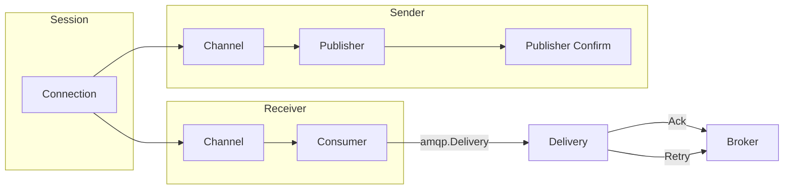

# amqp091 — AMQP 0-9-1 Transport Adapter

Transport adapter for RabbitMQ (AMQP 0-9-1) implementing `ports.Session`, `ports.Receiver`, `ports.Sender`, and `ports.BatchSender`.

Uses the [rabbitmq/amqp091-go](https://github.com/rabbitmq/amqp091-go) client library.

## Architecture

A `Session` owns a single AMQP connection with automatic reconnection (exponential backoff, 1 s initial, 30 s max). `Receiver` and `Sender` each open their own AMQP channel from that connection.



`Reconcile` declares exchanges, queues, and bindings from a `SessionPlan`. It runs on first connect and again after each reconnect. `Start` fails when the initial reconcile fails (the topology is not in place — messages would be silently unroutable), and after a reconnect the session reports `Connected`/emits `SessionConnected` only once reconcile has succeeded.

## Settlement Mapping

| `ports.Delivery` Method | AMQP 0-9-1 Operation | Notes |
|---|---|---|
| `Ack(ctx)` | `delivery.Ack(false)` | Single-message acknowledgement |
| `Retry(ctx, after, reason)` | `delivery.Nack(false, true)` | Requeue **immediately**; AMQP 0-9-1 has no native delayed redelivery. When `after > 0` the adapter emits `AMQP091DelayedRetryUnhonored` (every occurrence) and a `Warn` log (once per consumer channel). Guard poison messages broker-side with `x-delivery-limit` (quorum queues) or a dead-letter exchange — without one, a message that always fails hot-loops on a classic queue. |
| `Extend(ctx, deadline)` | — | Returns `ErrNotSupported`; AMQP 0-9-1 has no visibility timeout |

Settlement is guaranteed at-most-once via a mutex-guarded flag on each
`Delivery` (`mu sync.Mutex` + `settled bool`): the first Ack/Retry wins and
every subsequent settlement call on the same delivery is a no-op. (It is not
a `sync.Once`; the only `sync.Once` on a delivery dedups the delayed-retry
warning, not settlement.)

## Header Mapping

### System Properties (ingress and egress)

| AMQP 0-9-1 Property | Envelope Header Key | Go Type |
|---|---|---|
| `MessageId` | `amqp091.message-id` | `string` |
| `CorrelationId` | `amqp091.correlation-id` | `string` |
| `ContentType` | `amqp091.content-type` | `string` |
| `ContentEncoding` | `amqp091.content-encoding` | `string` |
| `ReplyTo` | `amqp091.reply-to` | `string` |
| `Type` | `amqp091.type` | `string` |
| `AppId` | `amqp091.app-id` | `string` |
| `DeliveryMode` | `amqp091.delivery-mode` | `uint8` (egress also accepts `int`/`float`/`"1"`/`"2"`/`"transient"`/`"persistent"` — YAML/JSON header values coerce) |
| `Priority` | `amqp091.priority` | `uint8` |
| `Expiration` | `amqp091.expiration` | `string` (ingress: relative TTL in ms → absolute envelope `ExpiresAt`; empty/negative/**over-range** → no expiry) |
| `Timestamp` | `amqp091.timestamp` | `time.Time` (egress also accepts POSIX-seconds `int`/`float64` or an RFC3339 `string`; **out-of-range seconds → ignored**) |

> **End-to-end TTL.** An inbound AMQP per-message `Expiration` (a *relative*
> TTL) is mapped to the envelope's *absolute* `ExpiresAt`, so the countdown is
> not restarted at each bridge hop (egress re-derives the remaining relative
> TTL from `ExpiresAt`). A message whose in-bridge dwell (outbox persistence +
> retry backoff) outlives its remaining TTL is therefore handled by the
> route's expiry disposition (`OnExpired=dlq` dead-letters it, `OnExpired=drop`
> drops-with-metric) — correct and observable, never silent — where a
> per-hop-restarted TTL previously let it flow through.

### Delivery-only Properties (ingress)

| AMQP 0-9-1 Property | Envelope Header Key | Go Type |
|---|---|---|
| `Exchange` | `amqp091.exchange` | `string` |
| `RoutingKey` | `amqp091.routing-key` | `string` |
| `DeliveryTag` | `amqp091.delivery-tag` | `uint64` |
| `Redelivered` | `amqp091.redelivered` | `bool` |
| `ConsumerTag` | `amqp091.consumer-tag` | `string` |

User-defined AMQP headers pass through directly. Reserved `x-bridge.*` headers are stripped at ingress to prevent injection.

## Error Mapping

| AMQP Code | Name | `domain.BridgeError` | Transient |
|---|---|---|---|
| 320 | connection-forced | `ErrConnectionLost` | yes |
| 403 | access-refused | `ErrNotAuthorized` | no |
| 404 | not-found | `ErrNotFound` | no |
| 405 | not-allowed | `ErrForbidden` | no |
| 406 | not-implemented | `ErrNotSupported` | no |
| 501, 502, 503, 505 | frame/syntax/command/unexpected-frame | `ErrProtocolError` | no |
| 504 | channel-error | `ErrUnavailable` | yes |
| 530 | not-allowed | `ErrForbidden` | no |
| 540 | not-implemented | `ErrNotSupported` | no |
| 541 | internal-error | `ErrUnavailable` | yes |

Network errors and `context.DeadlineExceeded` map to `ErrTimeout`. `context.Canceled` maps to `ErrUnavailable`.

**Reconnect-race exception:** the receiver retries two permanent-classified errors with a bounded budget (10 attempts, ~30 s of capped backoff) instead of failing the component immediately, because during a reconnect window they are transient broker races: `404` (consume racing the session's topology reconcile after a broker restart) and `403` on an **exclusive** consumer (the broker holds the stale exclusive consumer for ~2× heartbeat after a partition). Each retry emits `AMQP091ReconnectRaceRetried` and a `Warn`; once the budget is exhausted the original error fails the component.

## Configuration Reference

### SessionOptions

| Field | Type | Default | Description |
|---|---|---|---|
| `BrokerURL` | `string` | — (required) | AMQP URI, e.g. `amqp://localhost:5672/` |
| `Username` | `string` | `""` | Broker username. When set, **overrides** any userinfo embedded in `BrokerURL` (so rotated credentials win — see Credentials) |
| `Password` | `shared.Secret` | `""` | Broker password; redacted in logs/marshals. Same override semantics as `Username` |
| `Vhost` | `string` | `""` | AMQP virtual host (overrides the URI path when set) |
| `Heartbeat` | `time.Duration` | `10s` | Connection heartbeat interval |
| `ConnectTimeout` | `time.Duration` | `30s` | Dial timeout per attempt |
| `ReconnectDelay` | `time.Duration` | `1s` | Initial delay before reconnect |
| `ReconnectMaxDelay` | `time.Duration` | `30s` | Backoff cap for reconnect delays |
| `ReconnectMultiplier` | `float64` | `2.0` | Backoff growth factor per failed attempt |
| `TLS` | `*TLSConfig` | `nil` | TLS settings; when enabled, dials with `amqp.DialConfig` using `cfg.TLSClientConfig` (there is no `amqp091.DialTLS`) |

In the plugin options map these live under the `session:` block (snake_case keys: `broker_url`, `heartbeat`, `connect_timeout`, `reconnect_delay`, `reconnect_max_delay`, `reconnect_multiplier`, `username`, `password`, `vhost`, `tls`). A top-level `credentials_uri` key selects the credential-store entry resolved at build time.

#### TLSConfig

| Field | Type | Default | Description |
|---|---|---|---|
| `Enable` | `bool` | `false` | Activate TLS |
| `CACertFile` | `string` | `""` | Path to CA certificate PEM |
| `CertFile` | `string` | `""` | Path to client certificate PEM |
| `KeyFile` | `string` | `""` | Path to client private key PEM |
| `CACertPEM` | `shared.Secret` | `""` | In-memory CA PEM (overrides `CACertFile`; used by credential rotation) |
| `CertPEM` | `shared.Secret` | `""` | In-memory client cert PEM (overrides `CertFile`) |
| `KeyPEM` | `shared.Secret` | `""` | In-memory client key PEM (overrides `KeyFile`) |
| `InsecureSkipVerify` | `bool` | `false` | Skip server certificate verification |

### ReceiverConfig

| Field | Type | Default | Description |
|---|---|---|---|
| `QueueName` | `string` | `""` | Queue to consume from |
| `ConsumerTag` | `string` | `""` | Consumer tag; auto-generated if empty |
| `AutoAck` | `bool` | `false` | **Rejected for managed routes** (`Config.Validate` and the managed factory refuse it): broker auto-ack acknowledges on delivery and silently drops messages when a downstream step fails. The default (false) provides at-least-once settlement |
| `Exclusive` | `bool` | `false` | Exclusive consumer. After a partition the broker may hold the stale exclusive consumer for ~2× heartbeat; the receiver retries the resulting `403` with a bounded budget (see Error Mapping) |
| `PrefetchCount` | `int` | `10` | QoS prefetch count |
| `PrefetchSize` | `int` | `0` | QoS prefetch size in bytes |

### SenderConfig

| Field | Type | Default | Description |
|---|---|---|---|
| `Exchange` | `string` | `""` | Target exchange |
| `RoutingKey` | `string` | `""` | Fallback routing key. The per-dispatch `OutboundMessage.Address` from the dispatch plan wins; `RoutingKey` applies only when `Address` is empty. Never derived from `Envelope.Subject`. The logical subject is propagated as the AMQP header `gobridge.subject`. |
| `Mandatory` | `bool` | `false` | Return unroutable messages so a publish that matches no binding fails instead of vanishing. **⚠️ Silent-drop warning:** with the default `false`, a publish to an exchange with **no matching binding** is *confirmed and then discarded by the broker* — the bridge sees a successful confirm and acks the source, so the message is **gone with zero telemetry**. The `basic.return` listener only engages when `Mandatory: true`. Enable it on any route where an unroutable message must not be lost silently. Note: mandatory batches publish sequentially (a `basic.return` carries no delivery tag, so attribution needs one-in-flight ordering) |
| `Immediate` | `bool` | `false` | **Deprecated / rejected**: RabbitMQ removed `basic.publish` `immediate` in 3.0 and closes the channel when it is set. `Config.Validate` refuses it |
| `DeliveryMode` | `string` | `"persistent"` | Default persistence for every publish: `"persistent"` (AMQP delivery-mode 2 — survives a broker restart on a durable queue) or `"transient"` (delivery-mode 1 — lost on broker restart even on a durable classic queue). A per-message `amqp091.delivery-mode` envelope header overrides it. **Quorum queues** always persist messages regardless of this knob; it matters for durable classic queues |
| `Timeout` | `time.Duration` | `30s` | Per-publish timeout (applied when context has no deadline) |

### Options Map Keys

Configuration structs can be built from `map[string]any` via `SessionOptionsFromMap`, `ReceiverConfigFromOptions`, and `SenderConfigFromOptions`. Map keys use snake_case: `broker_url`, `heartbeat`, `connect_timeout`, `reconnect_delay`, `queue_name`, `consumer_tag`, `auto_ack`, `prefetch_count`, `exchange`, `routing_key`, `delivery_mode`, etc.

In bridge YAML, transport options use the **nested** shape (the strict decoder rejects flat keys), and **durations must be strings with a unit** (`"30s"`, `"500ms"`). A bare number is rejected by the strict decoder (a bare `heartbeat: 30` would decode as 30 *nanoseconds*); as defense in depth for decode paths that bypass it, `Config.Validate` also rejects any non-zero duration below `1ms`.

```yaml
options:
  credentials_uri: "aws-secrets://gobridge/rabbit-a"   # optional
  session:
    broker_url: "amqp://rabbit-a.internal:5672/"
    heartbeat: "10s"
  receiver:
    queue_name: "orders.inbound"
    prefetch_count: 64
  sender:
    exchange: "orders"
    routing_key: "orders.bridged"
    delivery_mode: "persistent"
  subscription:            # auto-declared topology for subscriptions
    exchange: "orders"
    exchange_type: "topic"
    durable: true
    queue_arguments:
      x-queue-type: "quorum"
      x-delivery-limit: 5   # poison-message guard for immediate-requeue retries
```

## Capabilities

The `Factory` advertises three base capabilities, plus a conditional fourth
(`CapExclusiveIdentity`) that appears only once an exclusive consumer has
been built:

| Capability | Constant | Meaning |
|---|---|---|
| Stateful session | `ports.CapStatefulSession` | Session maintains a persistent connection with reconnection |
| Source redelivery | `ports.CapSourceRedelivery` | Failed messages can be requeued to the source queue via nack |
| Plan-driven subscriptions | `ports.CapPlanDrivenSubscriptions` | Receivers subscribe (queue-declare + bind + consume) only when the session manager reconciles the `SessionPlan`; a receiver on an unmanaged session is inert, so the builder enforces a manager |
| Exclusive identity (conditional) | `ports.CapExclusiveIdentity` | Advertised **only after** an exclusive consumer has been built, so the supervisor picks the serialized (PrepareCommit) swap mode instead of overlapping two exclusive consumers on the same queue |

## Usage Example

The example below is compile-checked by `example_readme_test.go` (a Go
`Example` without an `Output:` comment — compiled by `go test`, never
executed).

```go
ctx := context.Background()
logger := slog.New(slog.NewTextHandler(os.Stderr, nil))

// Create and start a session. Start dials AND reconciles: a nil return
// means the connection is up and the declared topology (if a plan was
// installed) is in place.
sess := amqp091.NewSession(amqp091.SessionOptions{
    BrokerURL:      "amqp://localhost:5672/",
    Heartbeat:      10 * time.Second,
    ConnectTimeout: 30 * time.Second,
}, connectivity.SessionEphemeral, logger)

if err := sess.Start(ctx); err != nil {
    logger.Error("session start failed", "error", err)
    return
}
defer func() { _ = sess.Close(ctx) }()

// Declare exchange, queue, and binding (plan-driven; re-applied on
// every reconnect before the session reports Connected again).
err := sess.Reconcile(ctx, connectivity.SessionPlan{
    Subscriptions: []connectivity.SubscriptionPlan{{
        Topic: "my-queue",
        Config: &amqp091.Config{Subscription: amqp091.SubscriptionParams{
            Exchange:     "my-exchange",
            ExchangeType: "direct",
            RoutingKey:   "events",
            Durable:      true,
        }},
    }},
})
if err != nil {
    logger.Error("reconcile failed", "error", err)
    return
}

// Create a sender. Publishes are persistent by default (survive a
// broker restart on a durable queue); set DeliveryMode to
// amqp091.DeliveryModeTransient to opt out.
sender := amqp091.NewSender(amqp091.SenderConfig{
    Exchange:   "my-exchange",
    RoutingKey: "events",
    Session:    sess,
    Logger:     logger,
})

// Publish a message.
env := messaging.MustEnvelope(messaging.EnvelopeInput{
    ID:      "msg-1",
    Subject: "events",
    Payload: []byte(`{"event":"created"}`),
})
if err := sender.Send(ctx, ports.OutboundMessage{Envelope: env, Address: "events"}); err != nil {
    logger.Error("send failed", "error", err)
}

// Create a receiver and consume.
receiver := amqp091.NewReceiver(amqp091.ReceiverConfig{
    QueueName:     "my-queue",
    PrefetchCount: 10,
    Session:       sess,
    Logger:        logger,
})

_ = receiver.Run(ctx, func(ctx context.Context, del ports.Delivery) error {
    e := del.Envelope()
    logger.Info("received", "id", e.ID(), "payload", string(e.Payload()))
    return del.Ack(ctx)
})
// After Run returns, release the consumer with Close. A direct embedder's
// graceful stop already self-closes the consumer channel, so Close is an
// idempotent safety call here (the managed runtime calls it for you after
// draining in-flight deliveries).
_ = receiver.Close(ctx)
```

## Factory

`Factory` implements `ports.TransportFactory`: it advertises `Capabilities`,
validates addresses (`AddressValidator`), reports whether a config requires
exclusive identity, and creates sessions (`NewSession`). Receivers and senders
are built by the sibling `ReceiverFactory` and `SenderFactory`. Construct the
transport factory with `NewFactory`:

```go
factory := amqp091.NewFactory(logger, metricsExporter)
```

## Reconnection

The session runs a background goroutine that monitors `NotifyClose` from the AMQP connection. On disconnect:

1. Emits `SessionDisconnected`, then `SessionReconnecting` per attempt.
2. Retries with exponential backoff (`reconnect_delay` → `reconnect_max_delay`, × `reconnect_multiplier`) plus jitter.
3. Re-runs `Reconcile` with the stored `SessionPlan` **before** the session reports `Connected`. If reconcile fails, the freshly dialed connection is dropped and the whole attempt (dial + reconcile) retries with backoff — `Health().Connected` stays `false` and **no** `SessionConnected` is emitted, so consumers cannot race onto a connection whose queues/bindings are missing.
4. Emits `SessionConnected` (and `SessionReconciled`) only after reconcile succeeds.

`Close` is safe to race with `Start` or a reconnect in flight: a connection dialed after `Close` began is closed, never installed (no leaked TCP connections or ghost consumers).

Receiver detects channel closure and waits for `SessionConnected` or `SessionReconciled` before re-establishing its consumer.

Sender re-opens its channel (with publisher confirms) on the next `Send` call after a channel error.

## Publishing & Confirms

Every publish awaits a broker confirm. `SendBatch` (non-mandatory) is **pipelined**: all messages are published with deferred confirmations, then all confirms are awaited — throughput is no longer bounded to one confirm round-trip per message. Per-message error attribution is preserved. With `Mandatory: true`, batches fall back to sequential one-in-flight publishing so `basic.return` (which carries no delivery tag) can be attributed to the right message.

## Credentials

`credentials_uri` selects a credential-store entry resolved at build time; rotation re-applies it on the live session (`ApplyCredentials` → redial). Explicit `Username`/`Password` (including rotated material) **override any userinfo embedded in `BrokerURL`** — otherwise rotation would report success while the session kept redialing with the stale embedded credentials. When both are present the session emits a `Warn` (at construction and on each rotation, with the URL redacted): the embedded userinfo is dead config and should be removed from `broker_url`.
