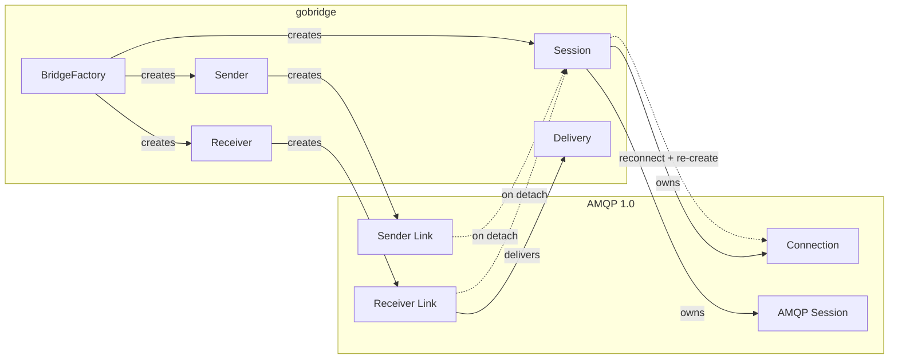
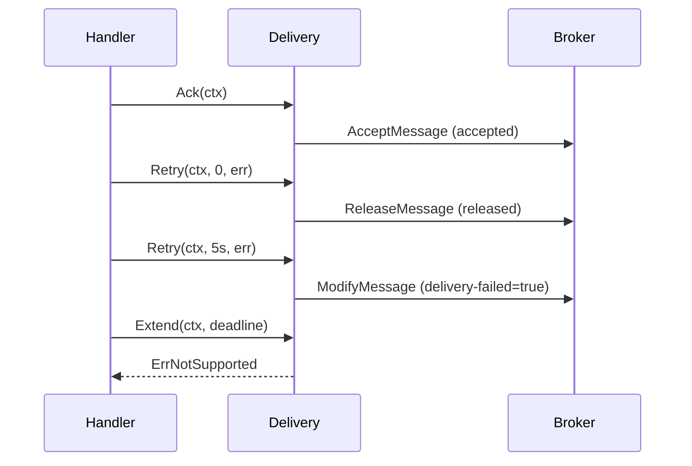

# AMQP 1.0 Transport Adapter

Transport adapter for AMQP 1.0 (OASIS standard) brokers. Implements `ports.Session`, `ports.Receiver`, `ports.Sender`, and `ports.BatchSender`. Tested with Apache ActiveMQ Artemis, Solace PubSub+, Apache Qpid, and any broker that speaks the AMQP 1.0 wire protocol.

Built on [github.com/Azure/go-amqp](https://github.com/Azure/go-amqp).

## Architecture



`Session` owns the TCP connection and AMQP session. Receivers and senders create links on that session. When a link detaches or the connection drops, the session reconnects with exponential backoff (1s initial, 30s max, 25% jitter). Links re-create themselves on the next operation.

### Settlement Flow



Settlement is idempotent. Only the first call on a `Delivery` performs the disposition; subsequent calls are no-ops.

## Settlement Mapping

| `ports.Delivery` method | AMQP 1.0 disposition | Notes |
|---|---|---|
| `Ack(ctx)` | `AcceptMessage` — accepted | Message removed from queue |
| `Retry(ctx, 0, err)` | `ReleaseMessage` — released | Immediate redelivery to any consumer |
| `Retry(ctx, >0, err)` | `ModifyMessage` — delivery-failed=true | Signals broker to schedule retry |
| `Extend(ctx, deadline)` | — | Returns `ErrNotSupported`; AMQP 1.0 uses credit-based flow, not visibility timeouts |

## Header Mapping

Standard AMQP 1.0 message properties map to envelope headers with the `amqp10.` prefix. Application properties pass through directly. Reserved bridge headers (`x-bridge.*`) are stripped at ingress.

| AMQP 1.0 property | Envelope header key |
|---|---|
| `message-id` | `amqp10.message-id` |
| `correlation-id` | `amqp10.correlation-id` |
| `content-type` | `amqp10.content-type` |
| `content-encoding` | `amqp10.content-encoding` |
| `subject` | `amqp10.subject` |
| `to` | `amqp10.to` |
| `reply-to` | `amqp10.reply-to` |
| `group-id` | `amqp10.group-id` |
| `group-sequence` | `amqp10.group-sequence` |
| `reply-to-group-id` | `amqp10.reply-to-group-id` |
| `creation-time` | `amqp10.creation-time` |
| `absolute-expiry-time` | `amqp10.absolute-expiry-time` |
| `delivery-count` (header) | `amqp10.delivery-count` |

On egress, envelope headers with the `amqp10.` prefix are mapped back to AMQP 1.0 message properties. Other non-reserved headers become application properties.

## Error Mapping

AMQP 1.0 error conditions are classified into `domain.BridgeError` categories so the runtime can decide between retry and dead-letter.

| AMQP 1.0 condition | BridgeError sentinel | Class |
|---|---|---|
| `amqp:not-found` | `ErrNotFound` | Permanent |
| `amqp:unauthorized-access` | `ErrNotAuthorized` | Permanent |
| `amqp:not-allowed` | `ErrForbidden` | Permanent |
| `amqp:not-implemented` | `ErrNotSupported` | Permanent |
| `amqp:invalid-field` | `ErrInvalidPayload` | Permanent |
| `amqp:decode-error` | `ErrProtocolError` | Permanent |
| `amqp:resource-limit-exceeded` | `ErrThrottled` | Transient |
| `amqp:link:transfer-limit-exceeded` | `ErrThrottled` | Transient |
| `amqp:connection:forced` | `ErrConnectionLost` | Transient |
| `amqp:link:detach-forced` | `ErrConnectionLost` | Transient |
| `amqp:connection:framing-error` | `ErrProtocolError` | Permanent |
| `amqp:session:errant-link` | `ErrUnavailable` | Transient |
| `amqp:link:message-size-exceeded` | `ErrPayloadTooLarge` | Permanent |
| `amqp:internal-error` | `ErrUnavailable` | Transient |
| `context.DeadlineExceeded` | `ErrTimeout` | Transient |
| `context.Canceled` | `ErrUnavailable` | Transient |

Unrecognized conditions fall through to `ErrUnavailable`. Heuristic matching on error messages covers network-level failures (connection reset, broken pipe, EOF).

## Configuration

### SessionOptions

| Field | Type | Default | Description |
|---|---|---|---|
| `Address` | `string` | — (required) | Broker URL, e.g. `amqp://localhost:5672` |
| `ConnectTimeout` | `time.Duration` | `30s` | Dial timeout per connection attempt |
| `ReconnectDelay` | `time.Duration` | `1s` | Initial delay before reconnect; grows exponentially to 30s |
| `IdleTimeout` | `time.Duration` | `2m` | Connection idle timeout sent to broker |
| `MaxFrameSize` | `uint32` | `65536` | Maximum AMQP frame size in bytes |
| `Username` | `string` | — | SASL PLAIN username |
| `Password` | `string` | — | SASL PLAIN password |
| `TLS` | `*TLSConfig` | `nil` | TLS settings (CA cert, client cert, skip verify) |
| `ContainerID` | `string` | — | AMQP container ID; identifies this client to the broker |

### TLSConfig

| Field | Type | Default | Description |
|---|---|---|---|
| `Enable` | `bool` | `false` | Enable TLS |
| `CACertFile` | `string` | — | Path to CA certificate PEM |
| `CertFile` | `string` | — | Path to client certificate PEM |
| `KeyFile` | `string` | — | Path to client private key PEM |
| `InsecureSkipVerify` | `bool` | `false` | Skip server certificate verification |

### ReceiverConfig

| Field | Type | Default | Description |
|---|---|---|---|
| `Address` | `string` | — (required) | Queue or topic address to consume from |
| `LinkCredit` | `uint32` | `10` | Prefetch credit; controls how many messages the broker sends ahead |
| `DurabilityMode` | `uint32` | `0` | AMQP durability level for the receiver link |
| `Session` | `*Session` | — | Parent session (set by factory) |
| `Logger` | `*slog.Logger` | — | Logger; falls back to session logger |
| `Metrics` | `ports.MetricsExporter` | noop | Metrics exporter |

### SenderConfig

| Field | Type | Default | Description |
|---|---|---|---|
| `Address` | `string` | — (required) | Target address to publish to |
| `Timeout` | `time.Duration` | `30s` | Send timeout per message |
| `DurabilityMode` | `uint32` | `0` | AMQP durability level for the sender link |
| `Session` | `*Session` | — | Parent session (set by factory) |
| `Logger` | `*slog.Logger` | — | Logger; falls back to session logger |
| `Metrics` | `ports.MetricsExporter` | noop | Metrics exporter |

All configs can be built from `map[string]any` via `SessionOptionsFromMap`, `ReceiverConfigFromOptions`, and `SenderConfigFromOptions` for declarative bridge definitions.

## Capabilities

`BridgeFactory.Capabilities()` reports:

- **`CapStatefulSession`** — The transport maintains a persistent connection with automatic reconnection. Unlike AMQP 0-9-1, AMQP 1.0 does not declare queues or exchanges; links are created lazily when receivers and senders start.

AMQP 1.0 does **not** support:

- Queue/exchange declaration (topology is broker-managed)
- Visibility timeout extension (`Extend` returns `ErrNotSupported`)
- Native batch send (messages are sent individually over the link)

## Usage

```go
package main

import (
    "context"
    "log/slog"

    "github.com/mariotoffia/gobridge/adapters/amqp/transport/amqp10"
    "github.com/mariotoffia/gobridge/domain"
    "github.com/mariotoffia/gobridge/ports"
)

func main() {
    ctx := context.Background()
    logger := slog.Default()

    // Create session
    sess := amqp10.NewSession(amqp10.SessionOptions{
        Address:     "amqp://localhost:5672",
        ContainerID: "my-service",
    }, domain.SessionModeReadWrite, logger)

    if err := sess.Start(ctx); err != nil {
        panic(err)
    }
    defer sess.Close(ctx)

    // Create receiver
    recv, err := amqp10.NewReceiver(amqp10.ReceiverConfig{
        Address:    "queue://orders",
        LinkCredit: 20,
    }, sess)
    if err != nil {
        panic(err)
    }

    // Create sender
    sender, err := amqp10.NewSender(amqp10.SenderConfig{
        Address: "queue://notifications",
    }, sess)
    if err != nil {
        panic(err)
    }
    defer sender.Close(ctx)

    // Run receiver loop
    err = recv.Run(ctx, func(ctx context.Context, del ports.Delivery) error {
        env := del.Envelope()
        slog.Info("received", "id", env.ID(), "subject", env.Subject)

        // Forward to another queue
        if err := sender.Send(ctx, env); err != nil {
            return del.Retry(ctx, 0, err)
        }

        return del.Ack(ctx)
    })
    if err != nil {
        slog.Error("receiver stopped", "error", err)
    }
}
```

### Using BridgeFactory

For declarative setups, use `BridgeFactory` which implements `ports.TransportFactory`:

```go
factory := amqp10.NewFactory(logger, metricsExporter)

// The bridge runtime calls these with config.SessionDef, config.ReceiverDef, etc.
session, _ := factory.NewSession(ctx, sessionDef)
receiver, _ := factory.NewReceiver(ctx, receiverDef, session)
sender, _ := factory.NewSender(ctx, senderDef, session)
```

## Reconnection

The session runs a background monitor goroutine. On connection loss:

1. Receivers and senders detect link errors and call `notifyDisconnect`.
2. The session clears its connection state and emits `SessionDisconnected`.
3. The monitor retries with exponential backoff (1s -> 2s -> 4s -> ... -> 30s cap, 25% jitter).
4. On success, it emits `SessionConnected` and re-runs `Reconcile` if a plan exists.
5. Receivers and senders re-create their links on the next operation.

Subscribe to `sess.Events()` to observe lifecycle transitions (`SessionConnected`, `SessionDisconnected`, `SessionReconnecting`, `SessionReconciled`, `SessionError`).

## Metrics

The adapter emits timers and counters via `ports.MetricsExporter`:

| Metric | Type | Description |
|---|---|---|
| `amqp10.connect.latency` | Timer | Time to establish connection |
| `amqp10.reconcile.latency` | Timer | Time to reconcile session plan |
| `amqp10.receive.latency` | Timer | Time per receive operation |
| `amqp10.send.latency` | Timer | Time per send operation |
| `amqp10.accept.latency` | Timer | Time to accept (ack) a message |
| `amqp10.reconnects` | Counter | Successful reconnections |
| `amqp10.event.dropped` | Counter | Session events dropped (full channel) |
