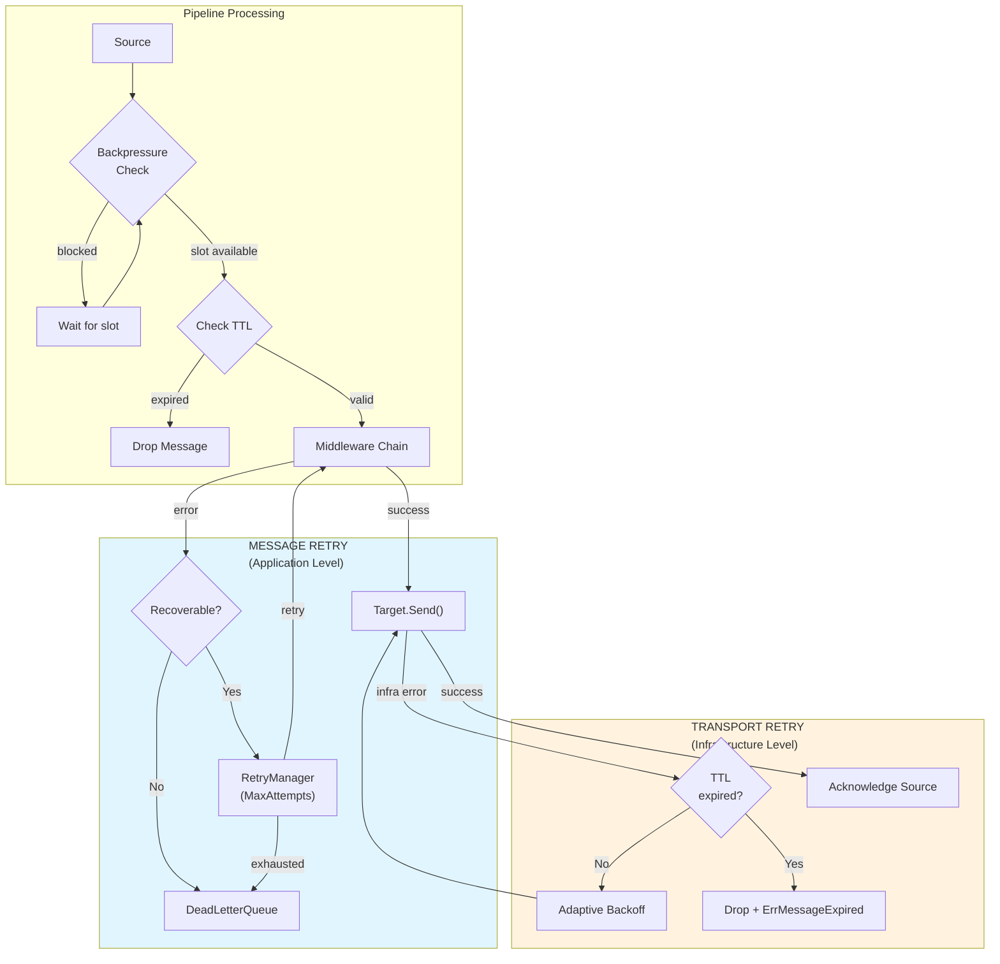

# Bridge Core

The core package implements the main runtime components for GoBridge:

- **Bridge**: Main runtime coordinating pipelines and routes
- **Pipeline**: Message flow from Source through Middlewares to Target
- **Route**: Chain of Pipelines for complex message flows

## ⚠️ Two Distinct Retry Systems

GoBridge implements **two separate retry systems**. Understanding when each applies is critical:

| System | Used By | Purpose | Limit |
|--------|---------|---------|-------|
| **Transport Retry** | Target.Send() | Infrastructure failures | Message TTL |
| **Message Retry** | RetryManager | Application failures | MaxAttempts |

### When Each System Is Used



## Configuration Hierarchy

### Transport Retry Configuration

```
Bridge (default) → Connection (override)
```

```go
// Bridge level default
bridge := core.NewBridge("my-bridge",
    core.WithTransportRetry(types.TransportRetryConfig{
        InitialBackoff: 500 * time.Millisecond,
        MaxBackoff:     2 * time.Minute,
    }),
)

// Connection level override
mqttConfig := &mqtt.MQTTConnectionConfig{
    ID: "mqtt-1",
    TransportRetry: &types.TransportRetryConfig{
        MaxBackoff: 5 * time.Minute, // Override just this
    },
}
```

### Flow Control Configuration

```
Bridge (default) → Pipeline (override)
```

```go
// Bridge level default
bridge := core.NewBridge("my-bridge",
    core.WithFlowControl(types.FlowControlConfig{
        MaxInFlight:       200,
        DefaultMessageTTL: 5 * time.Minute,
    }),
)

// Pipeline level override
pipeline := core.NewPipeline(id, mode, source, target, chain,
    core.PipelineWithFlowControl(types.FlowControlConfig{
        MaxInFlight: 50, // Lower for this specific pipeline
    }),
)
```

## Pipeline Flow Control

The pipeline implements backpressure using a semaphore:

1. **MaxInFlight**: Limits concurrent messages (default: 100)
2. **DefaultMessageTTL**: Applied to messages without explicit TTL (default: 120s)

When `MaxInFlight` is reached, the pipeline blocks until a slot is available.

## Creating a Bridge

```go
bridge := core.NewBridge("my-bridge",
    // Registries
    core.WithSourceRegistry(sourceRegistry),
    core.WithTargetRegistry(targetRegistry),
    core.WithMiddlewareRegistry(middlewareRegistry),
    
    // Transport retry defaults
    core.WithTransportRetry(types.TransportRetryConfig{
        InitialBackoff: time.Second,
        MaxBackoff:     5 * time.Minute,
    }),
    
    // Flow control defaults
    core.WithFlowControl(types.FlowControlConfig{
        MaxInFlight:       100,
        DefaultMessageTTL: 2 * time.Minute,
    }),
)

// Start the bridge
if err := bridge.Start(ctx); err != nil {
    log.Fatal(err)
}
defer bridge.Close()
```

## Creating a Pipeline

```go
// With message retry (application failures)
retryManager := retry.NewMemoryRetryManager(types.RetryPolicy{
    MaxAttempts:       5,
    InitialBackoff:    time.Second,
    BackoffMultiplier: 2.0,
}, dlq)

pipeline := core.NewPipeline(
    "mqtt-to-sqs",
    types.PipelineModeSimplex,
    mqttSource,
    sqsTarget,
    middlewareChain,
    core.WithRetryManager(retryManager),
    core.WithDeadLetterQueue(dlq),
    core.PipelineWithFlowControl(types.FlowControlConfig{
        MaxInFlight: 50,
    }),
)

if err := pipeline.Start(ctx); err != nil {
    log.Fatal(err)
}
defer pipeline.Close()
```

## Related Documentation

- [ARCHITECTURE.md](../types/ARCHITECTURE.md) - Main architecture overview
- [ARCHITECTURE-MIDDLEWARE.md](../types/ARCHITECTURE-MIDDLEWARE.md) - Middleware and error handling
- [ARCHITECTURE-TRANSPORTS.md](../types/ARCHITECTURE-TRANSPORTS.md) - Transport implementations
