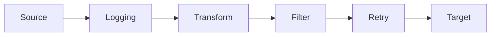
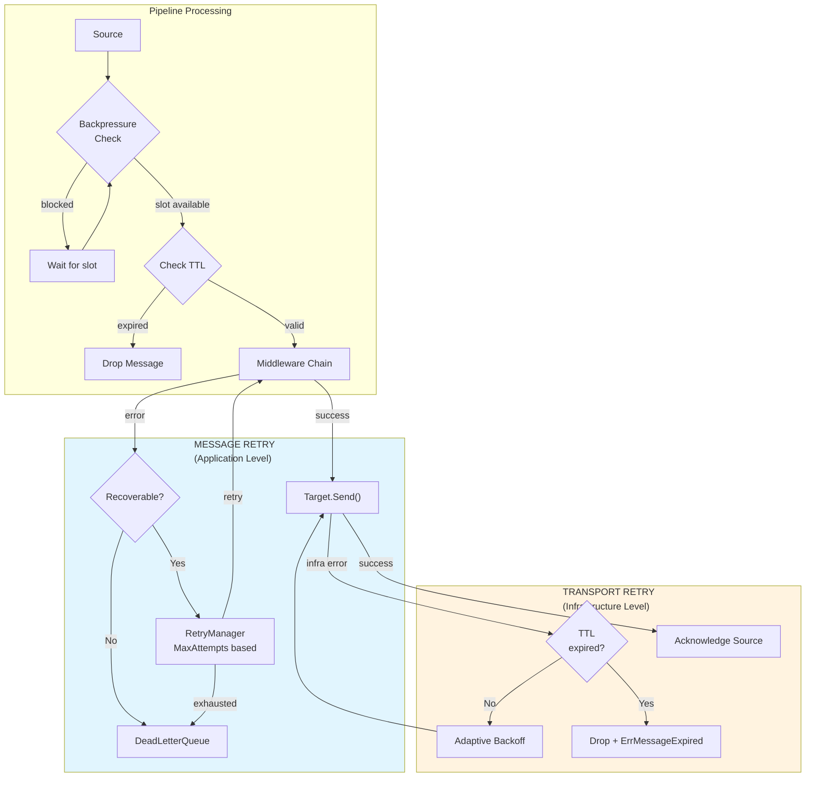
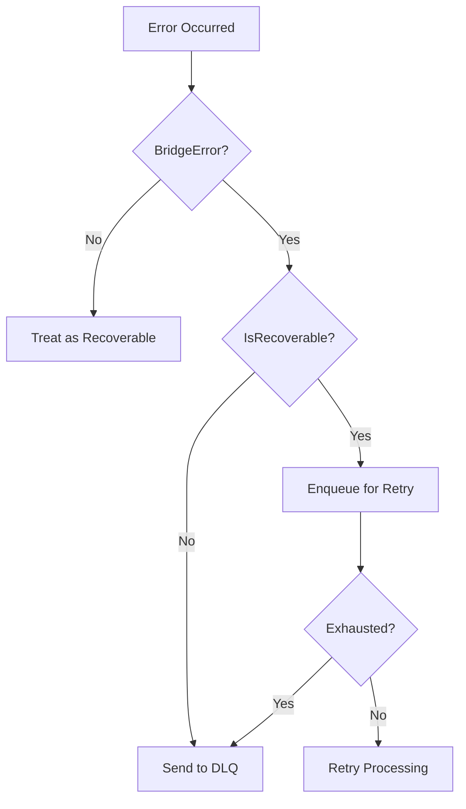

# Middleware Architecture

This document describes the middleware and error handling systems in GoBridge.

**Related Documentation:**
- [ARCHITECTURE.md](./ARCHITECTURE.md) - Main architecture overview
- [ARCHITECTURE-TRANSPORTS.md](./ARCHITECTURE-TRANSPORTS.md) - Transport implementations

## Middleware Chain

Middlewares process messages in a pipeline between Source and Target.



### Middleware Interface

```go
type Middleware interface {
    Name() string
    Process(ctx context.Context, msg *Message, next MiddlewareFunc) error
}

type MiddlewareFunc func(ctx context.Context, msg *Message) error
```

### Creating Middleware

```go
// Using MiddlewareAdapter for simple cases
loggingMW := types.NewMiddlewareAdapter("logging",
    func(ctx context.Context, msg *types.Message, next types.MiddlewareFunc) error {
        log.Printf("Processing message: %s", msg.ID)
        err := next(ctx, msg)
        if err != nil {
            log.Printf("Message failed: %v", err)
        }
        return err
    },
)

// Implementing the interface for complex cases
type TransformMiddleware struct {
    transformer Transformer
}

func (m *TransformMiddleware) Name() string { return "transform" }

func (m *TransformMiddleware) Process(ctx context.Context, msg *types.Message, next types.MiddlewareFunc) error {
    transformed, err := m.transformer.Transform(msg.Payload)
    if err != nil {
        return types.ErrInvalidPayload.Wrap(err)
    }
    msg.Payload = transformed
    return next(ctx, msg)
}
```

### Middleware Chain

```go
chain := types.NewMiddlewareChain(
    loggingMiddleware,
    transformMiddleware,
    filterMiddleware,
)

// Process a message
err := chain.Process(ctx, msg, func(ctx context.Context, msg *types.Message) error {
    return target.Send(ctx, *msg)
})
```

---

## Built-in Middleware

### Filter Middleware

Filters messages based on conditions:

```go
// middleware/filter/
filter := filter.New(filter.Config{
    Conditions: []filter.Condition{
        {Field: "topic", Operator: "prefix", Value: "sensors/"},
        {Field: "payload.type", Operator: "eq", Value: "temperature"},
    },
    Mode: filter.ModeAll, // or ModeAny
})
```

### Transform Middleware

Transforms message payloads:

```go
// middleware/transform/
transform := transform.NewJSON(transform.JSONConfig{
    Mappings: []transform.Mapping{
        {Source: "$.data.temp", Target: "$.temperature"},
        {Source: "$.metadata.id", Target: "$.deviceId"},
    },
})
```

### Logging Middleware

Logs message processing:

```go
// bridge/middleware/transport/logging/
correlation := logging.NewCorrelationMiddleware()
publish := logging.NewPublishLogging(logger)
subscribe := logging.NewSubscribeLogging(logger)
```

---

## ⚠️ Two Distinct Retry Systems

GoBridge has **TWO separate retry systems** serving different purposes. Understanding when each is used is critical.

### Retry Systems Comparison

| Aspect | Transport Retry | Message Retry |
|--------|-----------------|---------------|
| **Location** | Target.Send() / Connection | Middleware / Pipeline |
| **Purpose** | Infrastructure failures | Application failures |
| **Limit** | Message TTL | MaxAttempts |
| **Config** | `TransportRetryConfig` | `RetryPolicy` |
| **Hierarchy** | Bridge → Connection | Pipeline level |
| **Examples** | DNS down, broker unreachable | Transform error, validation |

### When Each System Is Used



### Transport Retry (Infrastructure Level)

Used by `Target.Send()`, `Connection.Start()`, and `Source.Subscribe()` for infrastructure failures.

**Key characteristics:**
- **TTL-based**: Retries until message TTL expires (no attempt limit)
- **Adaptive backoff**: Longer delays for infrastructure errors (DNS, connection refused)
- **Native retry aware**: Skips retry for QoS 1/2 MQTT (broker handles durability)

```go
// TransportRetryConfig - for infrastructure failures
type TransportRetryConfig struct {
    InitialBackoff                  time.Duration // Default: 1s
    MaxBackoff                      time.Duration // Default: 5m
    Multiplier                      float64       // Default: 2.0
    Jitter                          float64       // Default: 0.1
    InfrastructureBackoffMultiplier float64       // Default: 2.0 (extra for DNS/network)
    SkipNativeRetry                 *bool         // Default: true (skip for QoS 1/2)
}

// Configure at Bridge level (default)
bridge := core.NewBridge("my-bridge",
    core.WithTransportRetry(types.TransportRetryConfig{
        InitialBackoff: 500 * time.Millisecond,
        MaxBackoff:     3 * time.Minute,
    }),
)

// Override at Connection level
mqttConn := &mqtt.MQTTConnectionConfig{
    ID: "mqtt-1",
    TransportRetry: &types.TransportRetryConfig{
        InitialBackoff: time.Second,
        MaxBackoff:     5 * time.Minute,
    },
}
```

### Message Retry (Application Level)

Used by `RetryManager` and retry middleware for application-level failures.

**Key characteristics:**
- **Attempt-based**: Limited by MaxAttempts
- **Standard backoff**: Exponential with jitter
- **Middleware integration**: Works with pipeline middleware chain

```go
// RetryPolicy - for application failures  
type RetryPolicy struct {
    MaxAttempts       int           // Maximum retry attempts
    InitialBackoff    time.Duration // First retry delay
    MaxBackoff        time.Duration // Maximum delay
    BackoffMultiplier float64       // Backoff growth rate
    Jitter            float64       // Randomness (0.0-1.0)
    RetryableErrors   []ErrorCode   // Optional: specific errors to retry
}

// Configure at Pipeline level
policy := types.RetryPolicy{
    MaxAttempts:       5,
    InitialBackoff:    time.Second,
    MaxBackoff:        time.Minute,
    BackoffMultiplier: 2.0,
    Jitter:            0.1,
}

retryManager := retry.NewMemoryRetryManager(policy, dlq)

pipeline := core.NewPipeline(id, mode, source, target, chain,
    core.WithRetryManager(retryManager),
    core.WithDeadLetterQueue(dlq),
)
```

### Flow Control and Backpressure

The pipeline implements flow control to prevent unbounded message processing:

```go
// FlowControlConfig - pipeline level
type FlowControlConfig struct {
    MaxInFlight       int           // Max concurrent messages (default: 100)
    DefaultMessageTTL time.Duration // TTL for messages without explicit TTL (default: 120s)
}

// Configure at Bridge level (default)
bridge := core.NewBridge("my-bridge",
    core.WithFlowControl(types.FlowControlConfig{
        MaxInFlight:       200,
        DefaultMessageTTL: 5 * time.Minute,
    }),
)

// Override at Pipeline level
pipeline := core.NewPipeline(id, mode, source, target, chain,
    core.PipelineWithFlowControl(types.FlowControlConfig{
        MaxInFlight:       50,
        DefaultMessageTTL: 2 * time.Minute,
    }),
)
```

### Retry Middleware

```go
// Create retry middleware for application-level retry
retryMW := types.RetryMiddleware("retry", retryManager, policy)

// Add to chain (should be last before target)
chain := types.NewMiddlewareChain(
    loggingMW,
    transformMW,
    retryMW,
)
```

---

## Dead Letter Queue

### DLQ Interface

```go
type DeadLetterQueue interface {
    Send(ctx context.Context, msg Message, reason error) error
    Consume(ctx context.Context) (<-chan *DLQMessage, error)
    Count(ctx context.Context) (int64, error)
    Purge(ctx context.Context) error
    Replay(ctx context.Context, filter DLQFilter) (replayed int64, err error)
}

type DLQMessage struct {
    Message   Message
    Reason    string
    FailedAt  time.Time
    RetryInfo *RetryInfo
    SourceID  string
}
```

### Using DLQ

```go
// Create DLQ
dlq := retry.NewMemoryDLQ()

// Messages automatically sent to DLQ when:
// 1. Retry attempts exhausted
// 2. Permanent error encountered

// Replay messages from DLQ
replayed, err := dlq.Replay(ctx, types.DLQFilter{
    Topic:       "sensors/#",
    Since:       time.Now().Add(-24 * time.Hour),
    MaxMessages: 100,
})
```

---

## Error Classification

### Error Types



### Recoverable Errors

| Error | Code | Description |
|-------|------|-------------|
| `ErrTimeout` | TIMEOUT | Request timed out |
| `ErrConnectionLost` | CONNECTION_LOST | Connection dropped |
| `ErrUnavailable` | UNAVAILABLE | Service unavailable |
| `ErrThrottled` | THROTTLED | Rate limited |
| `ErrBrokerBusy` | BROKER_BUSY | Target overloaded |

### Permanent Errors

| Error | Code | Description |
|-------|------|-------------|
| `ErrNotAuthorized` | NOT_AUTHORIZED | Auth failed |
| `ErrForbidden` | FORBIDDEN | Permission denied |
| `ErrInvalidPayload` | INVALID_PAYLOAD | Bad message format |
| `ErrPayloadTooLarge` | PAYLOAD_TOO_LARGE | Exceeds size limit |
| `ErrNotFound` | NOT_FOUND | Resource missing |

### Creating Errors

```go
// Wrap underlying error with classification
return types.ErrTimeout.Wrap(err)

// Add context
return types.ErrThrottled.
    With("topic", topic).
    WithRetryAfter(5 * time.Second).
    Wrap(err)

// Check error type
if types.IsBridgeError(err, types.ErrThrottled) {
    // Handle throttling
}

// Check recoverability
if types.IsRecoverableError(err) {
    // Retry
} else {
    // Send to DLQ
}
```

---

## Middleware Registry

The bridge maintains a registry of middleware factories:

```go
type MiddlewareRegistry struct {
    factories map[string]MiddlewareFactory
}

// Register middleware
registry := core.NewMiddlewareRegistry()
registry.Register("logging", func() types.Middleware {
    return logging.NewMiddleware(logger)
})
registry.Register("transform", func() types.Middleware {
    return transform.NewMiddleware(config)
})

// Create chain by names
chain, err := registry.CreateChain("logging", "transform", "filter")
```

---

## Best Practices

1. **Order Matters**: Place retry middleware last before target
2. **Early Filtering**: Filter messages early to reduce processing
3. **Idempotent Operations**: Design middlewares to be idempotent
4. **Error Context**: Add context to errors for debugging
5. **Metrics**: Emit metrics from middleware for monitoring
6. **Backpressure**: Respect channel capacity in long-running operations
