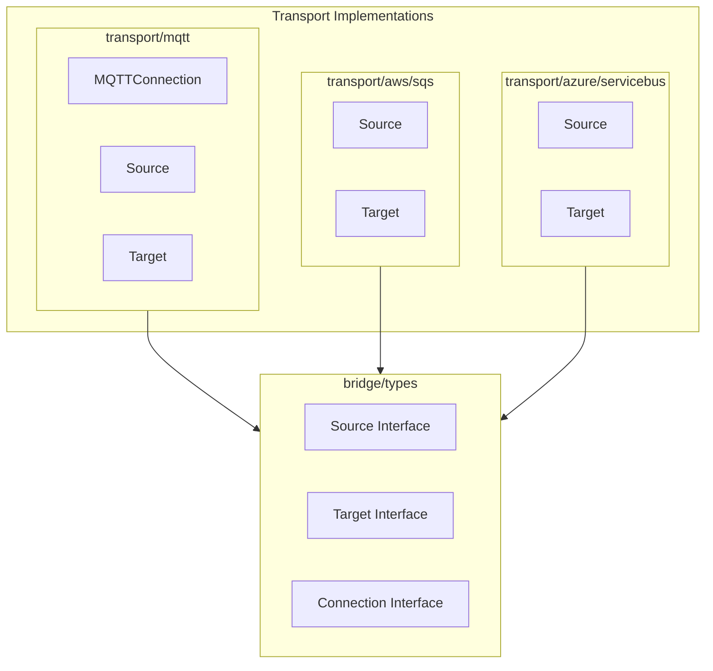
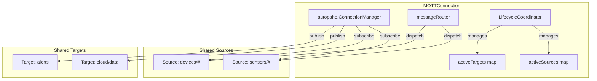
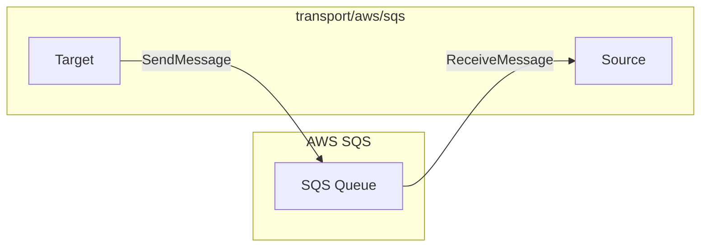
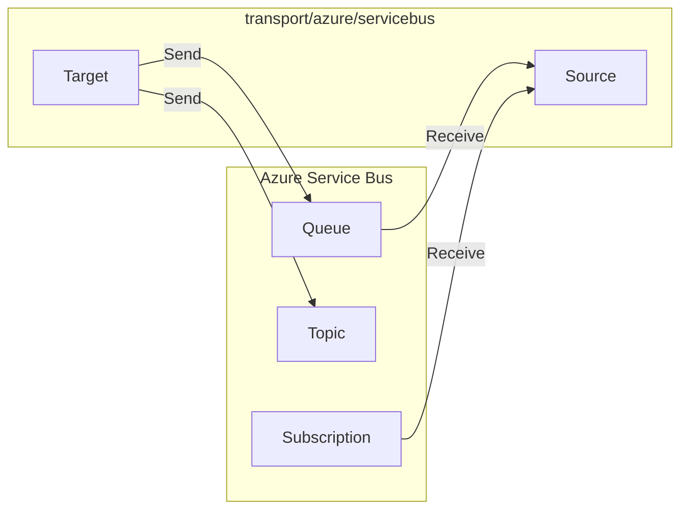

# Transport Architecture

This document describes the transport layer implementations in GoBridge.

**Related Documentation:**
- [ARCHITECTURE.md](./ARCHITECTURE.md) - Main architecture overview
- [ARCHITECTURE-MIDDLEWARE.md](./ARCHITECTURE-MIDDLEWARE.md) - Middleware system

## Transport Overview

Transports implement the `Source`, `Target`, and `Connection` interfaces for specific message brokers.



---

## MQTT Transport

The MQTT transport uses Eclipse Paho with autopaho for automatic reconnection.

### Architecture



### Shared Connection Pattern

MQTT sources and targets share a single TCP connection:

```go
// Create shared connection
conn, _ := mqtt.NewConnection(&mqtt.MQTTConnectionConfig{
    ID: "mqtt-1",
    Connection: mqtt.ConnectionConfig{
        BrokerURLs: []string{"tcp://broker:1883"},
        ClientID:   "my-client",
    },
})
conn.Start(ctx, nil)

// Create sources/targets that share the connection
source, _ := conn.CreateSource(ctx, sourceConfig)
target, _ := conn.CreateTarget(ctx, targetConfig)

// Sources/targets share the underlying client
// Closing source/target does NOT close the connection
source.Close()
target.Close()

// Only closing the connection disconnects
conn.Close()
```

### Lifecycle Coordination

For atomic topic changes:

```go
coordinator := conn.LifecycleCoordinator()
txn, _ := coordinator.BeginTransaction(ctx)

txn.AddSource(newSourceConfig)
txn.RemoveSource("old-source-id")
txn.UpdateSource("update-id", updatedConfig)

result, _ := txn.Commit(ctx)
// result.AddedSources, result.RemovedSources
```

### Configuration

```go
type ConnectionConfig struct {
    BrokerURL             string          // Single broker (deprecated)
    BrokerURLs            []string        // Multiple brokers for HA
    ClientID              string
    Credentials           *types.Credentials
    CleanStart            bool
    SessionExpiryInterval uint32
    KeepAlive             uint16
    ConnectTimeout        time.Duration
    TLS                   *TLSConfig
}

type MQTTConnectionSettings struct {
    // Implements types.ConnectionSettingsConfig
    // RequiresReconnect() detects which changes need reconnect
}
```

---

## AWS SQS Transport

The SQS transport provides Source and Target implementations for AWS SQS queues.

### Architecture



### Source Features

- Long polling for efficient message retrieval
- Visibility timeout management
- Automatic message deletion on Ack
- Return to queue on Nack

### Target Features

- Message batching with `SendBatch`
- Message attributes support
- Delay queue support

---

## Azure Service Bus Transport

The Service Bus transport supports both queues and topics.

### Architecture



---

## Implementing a New Transport

### Step 1: Create Config Types

```go
// transport/mytransport/config.go
package mytransport

type SourceConfigImpl struct {
    ID         string
    // Transport-specific fields
}

func (c *SourceConfigImpl) GetID() string { return c.ID }
func (c *SourceConfigImpl) GetTransportType() types.TransportType {
    return "MyTransport"
}
// ... implement types.SourceConfig
```

### Step 2: Implement Source

```go
// transport/mytransport/source.go
type Source struct {
    config   *SourceConfigImpl
    messages chan *types.SourceMessage
    running  atomic.Bool
}

func (s *Source) Start(ctx context.Context) error {
    // Connect and start receiving
}

func (s *Source) Messages() <-chan *types.SourceMessage {
    return s.messages
}

func (s *Source) Close() error {
    // Cleanup
}
```

### Step 3: Implement Target

```go
// transport/mytransport/target.go
type Target struct {
    config *TargetConfigImpl
}

func (t *Target) Send(ctx context.Context, msg types.Message) error {
    // Send message, return BridgeError on failure
}

func (t *Target) SendBatch(ctx context.Context, msgs []types.Message) (int, error) {
    // Batch send
}
```

### Step 4: Create Factory

```go
// transport/mytransport/factory.go
type Factory struct{}

func (f *Factory) CreateSource(ctx context.Context, config types.SourceConfig) (types.Source, error) {
    cfg := config.(*SourceConfigImpl)
    return NewSource(cfg)
}

func (f *Factory) SupportedTransports() []types.TransportType {
    return []types.TransportType{"MyTransport"}
}
```

### Step 5: Register with Bridge

```go
bridge.SourceRegistry().RegisterFactory(&mytransport.Factory{})
bridge.TargetRegistry().RegisterFactory(&mytransport.Factory{})
```

---

## Error Handling

All transports should return `*types.BridgeError` with proper classification:

```go
// Recoverable errors - pipeline will retry
types.ErrTimeout
types.ErrConnectionLost
types.ErrUnavailable
types.ErrThrottled

// Permanent errors - pipeline sends to DLQ
types.ErrNotAuthorized
types.ErrForbidden
types.ErrInvalidPayload
types.ErrPayloadTooLarge
```

### Example Error Mapping

```go
func (t *Target) Send(ctx context.Context, msg types.Message) error {
    err := t.client.Publish(msg)
    if err == nil {
        return nil
    }
    
    // Map transport-specific errors to bridge errors
    switch {
    case isTimeout(err):
        return types.ErrTimeout.Wrap(err)
    case isAuthError(err):
        return types.ErrNotAuthorized.Wrap(err)
    case isPayloadTooLarge(err):
        return types.ErrPayloadTooLarge.Wrap(err)
    default:
        return types.ErrUnavailable.Wrap(err)
    }
}
```

---

## Capabilities

Each transport reports its capabilities:

```go
func (s *Source) Capabilities() types.Capabilities {
    caps := types.Capabilities{}
    caps.AddType(types.CapabilityReceiveAtLeastOnce)
    caps.AddType(types.CapabilityRedelivery)
    caps.AddType(types.CapabilityOrdering)
    return caps
}
```

### Available Capabilities

| Capability | Description |
|------------|-------------|
| `CapabilityReceiveAtLeastOnce` | At-least-once delivery |
| `CapabilityReceiveExactOnce` | Exactly-once delivery |
| `CapabilityReceiveAtMostOnce` | At-most-once delivery |
| `CapabilityRedelivery` | Nack returns message |
| `CapabilityExtendTimeout` | Visibility timeout extension |
| `CapabilityOrdering` | Message ordering preserved |
| `CapabilityPublishAtLeastOnce` | Publish with acknowledgment |
| `CapabilityNativeRetry` | Built-in retry support |
