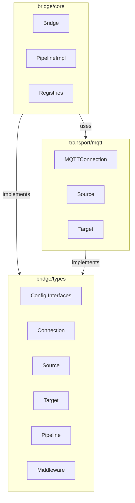
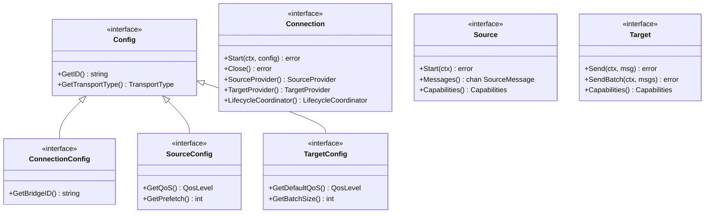
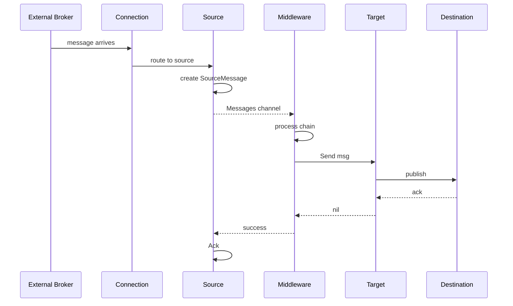
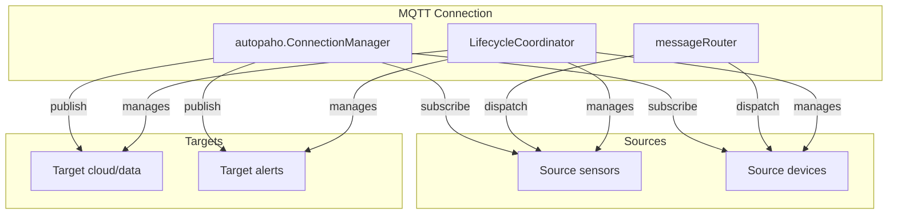
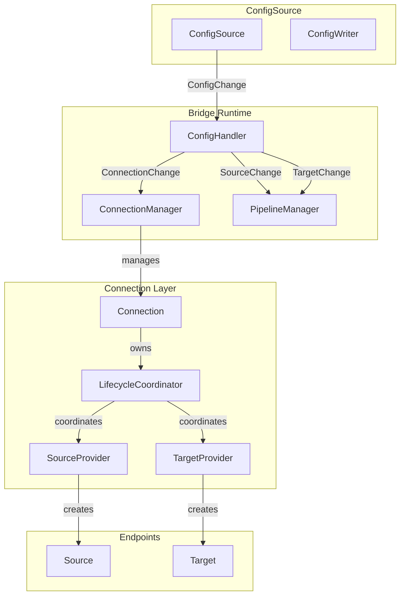
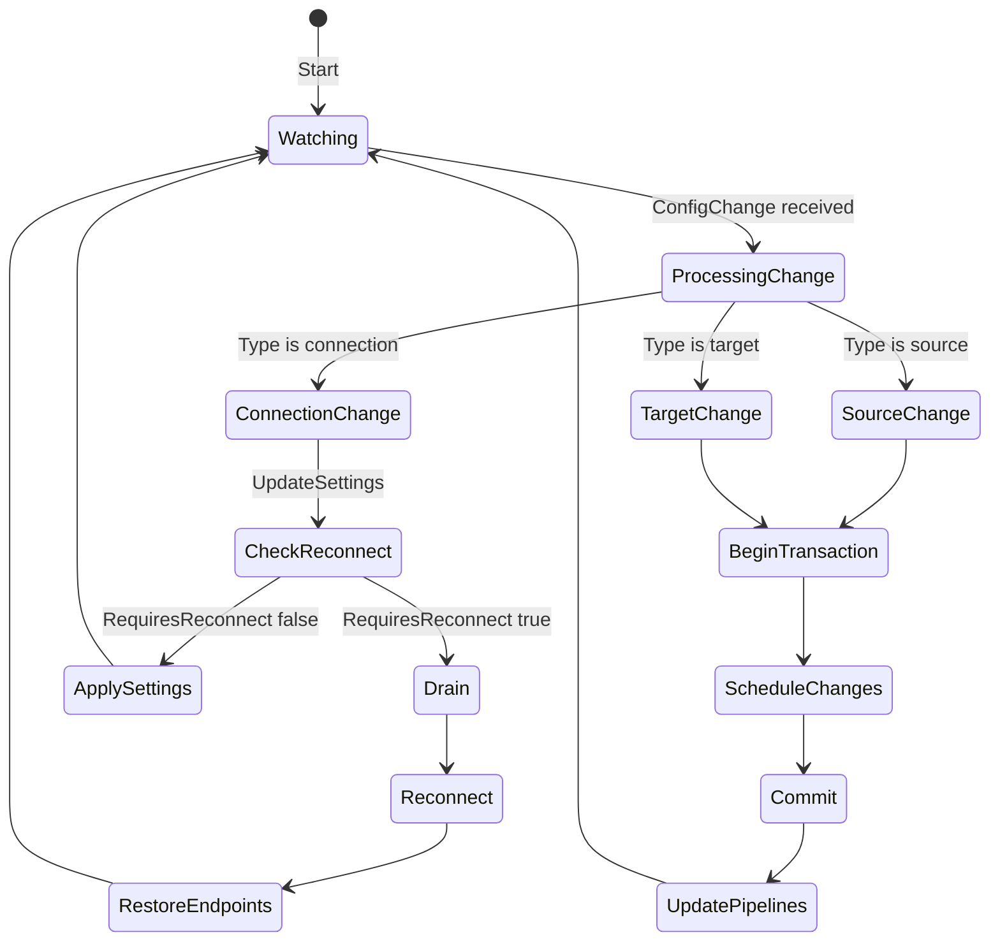
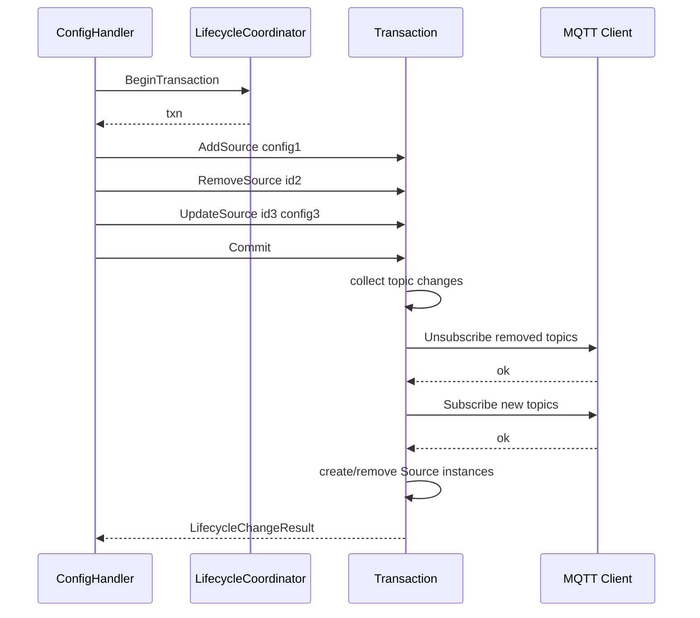
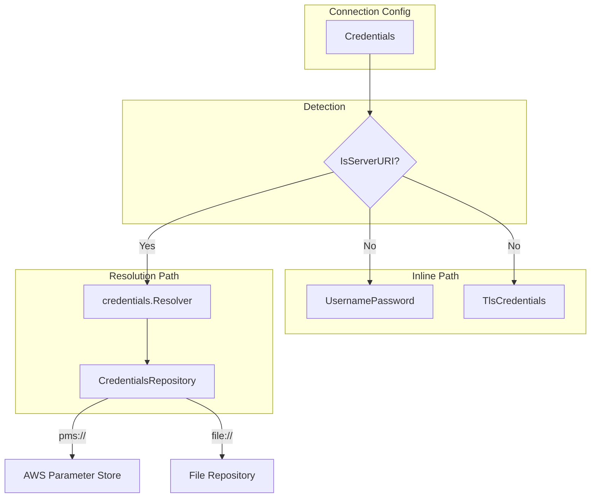

# Bridge Architecture

This document describes the architecture of the gobridge message bridge system.

## System Overview

The bridge provides a flexible, type-safe abstraction for connecting message sources to targets through configurable pipelines.



## Interface Hierarchy

The type system is designed around composable interfaces:



## Message Flow

Messages flow from Source through Middleware to Target:



## Connection Architecture

Connections can provide Sources and Targets that share the underlying transport:



## Configuration System

The configuration system supports dynamic updates:



## Configuration Change Flow

How configuration changes are processed:



## Lifecycle Transaction

Atomic changes to Sources/Targets on shared connections:



## Credentials System

The credentials system supports both inline credentials and URI-based resolution:



### Credential Types

- **Inline**: Actual credentials embedded in configuration
  - `UsernamePasswordCredentials`: Username and password
  - `TlsCredentials`: Certificates and keys (PEM encoded)

- **URI-based**: References to external credential stores
  - `pms://tenant/app/creds`: AWS Parameter Store
  - `file://path/to/creds`: Local file system

### ServerURI Detection

A string is considered a serverURI if it matches the pattern `[a-z]+://.*`:

```go
func IsServerURI(s string) bool {
    idx := strings.Index(s, "://")
    if idx <= 0 {
        return false
    }
    scheme := s[:idx]
    for _, c := range scheme {
        if c < 'a' || c > 'z' {
            return false
        }
    }
    return true
}
```

## Registry Interfaces

The system uses optional admin interfaces for CRUD operations:

### ConnectionRegistry (Read-only)

```go
type ConnectionRegistry interface {
    GetConnection(id string) (Connection, error)
    ListConnections() ([]Connection, error)
    CreateConnection(ctx context.Context, config ConnectionConfig) (Connection, error)
}
```

### ConnectionAdminRegistry (Optional CRUD)

```go
type ConnectionAdminRegistry interface {
    ConnectionRegistry
    UpdateConnection(ctx context.Context, id string, settings ConnectionSettingsConfig) error
    DeleteConnection(ctx context.Context, id string) error
    GetOrCreateConnection(ctx context.Context, config ConnectionConfig) (Connection, error)
}
```

### CredentialsRepository (Read-only)

```go
type CredentialsRepository interface {
    GetScheme() string
    GetNamespace() string
    GetCredentials(serverURI string) (*Credentials, error)
}
```

### CredentialsAdminRepository (Optional CRUD)

```go
type CredentialsAdminRepository interface {
    CredentialsRepository
    CreateCredentials(ctx context.Context, serverURI string, creds *Credentials) error
    UpdateCredentials(ctx context.Context, serverURI string, creds *Credentials, version int64) error
    DeleteCredentials(ctx context.Context, serverURI string, version int64) error
    ListCredentials(ctx context.Context, prefix string) ([]string, error)
}
```

## Key Design Principles

1. **Minimal Reconnect**: Connection updates check if reconnect is actually needed
2. **Source/Target as Unit**: Topic changes create/destroy/replace instances
3. **Lifecycle Coordinator**: For shared connections, coordinate changes atomically
4. **Drain-First**: Always drain in-flight messages before disruptive changes
5. **Optional Admin**: Admin interfaces are optional extensions of read-only interfaces
