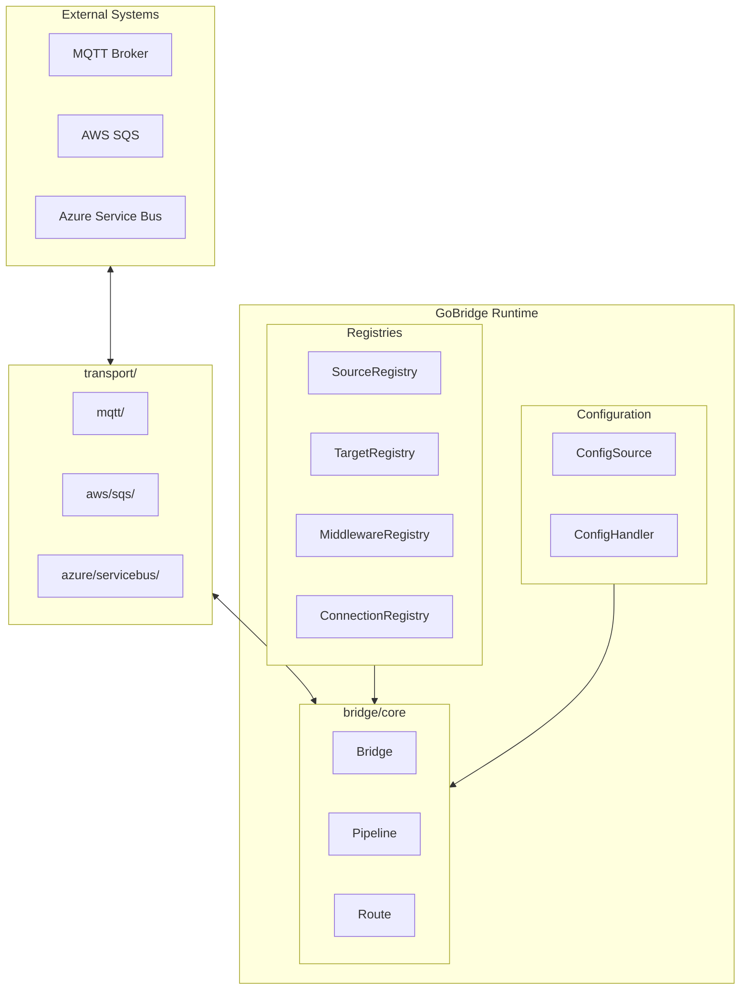
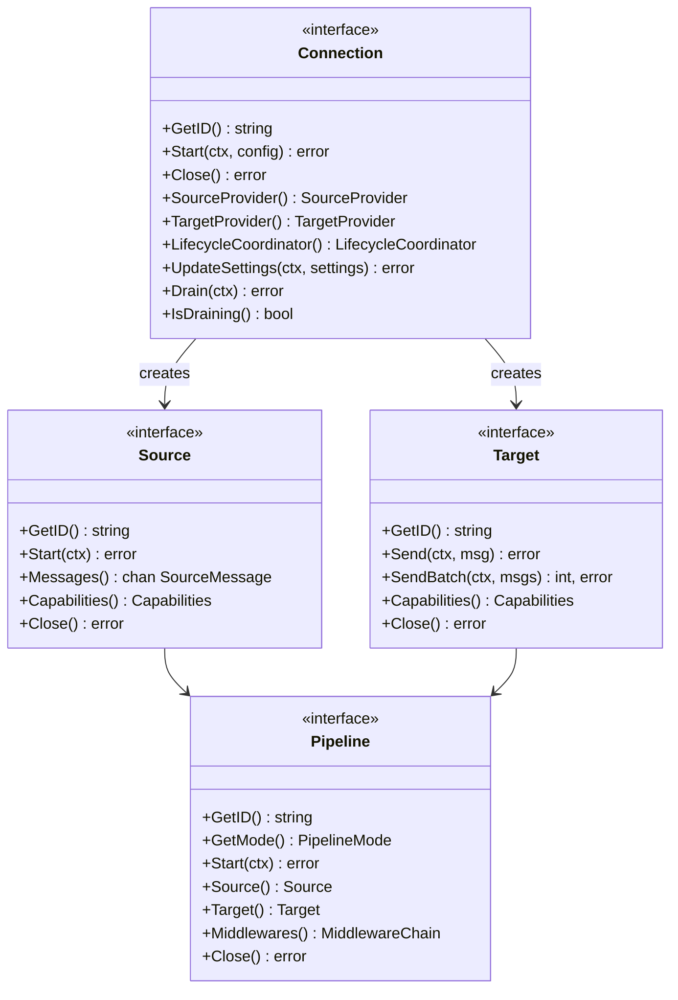
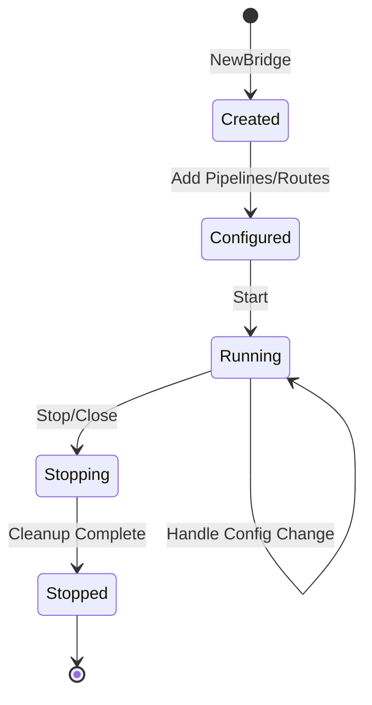
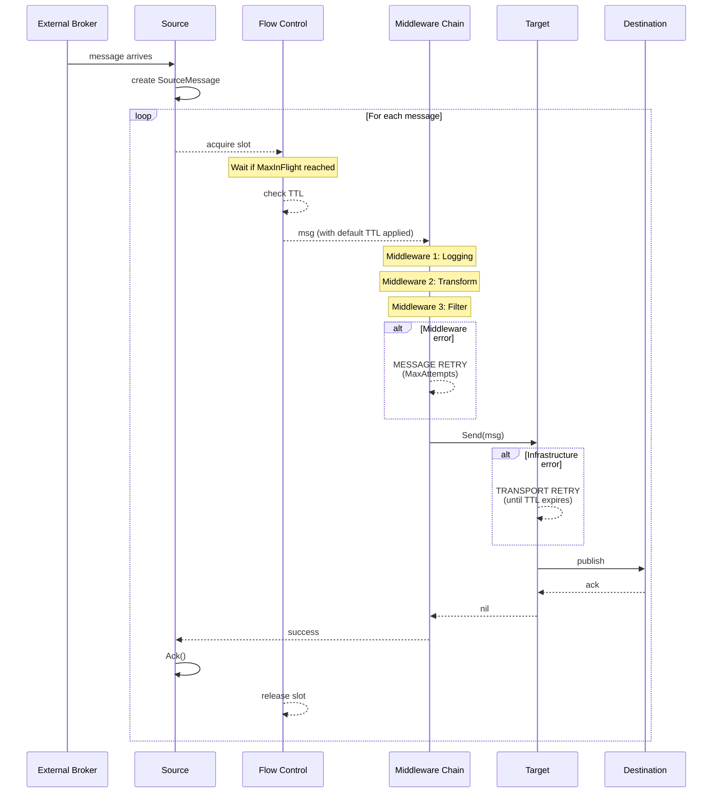
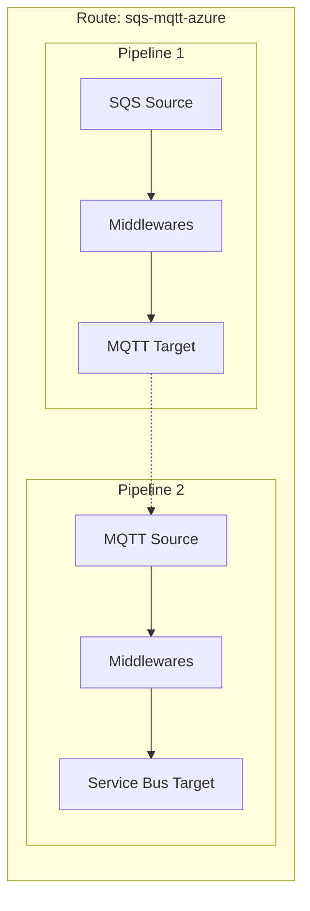
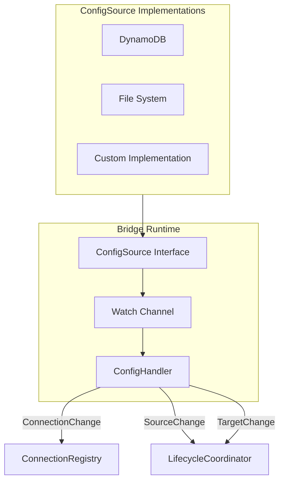
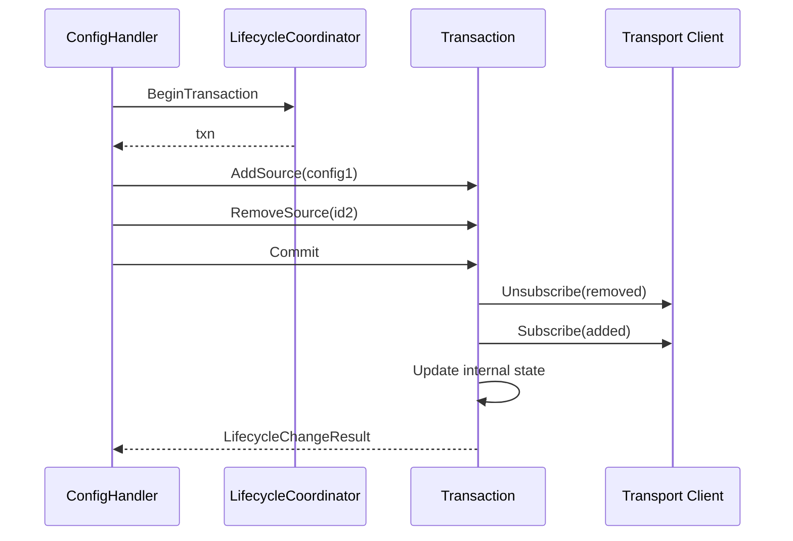
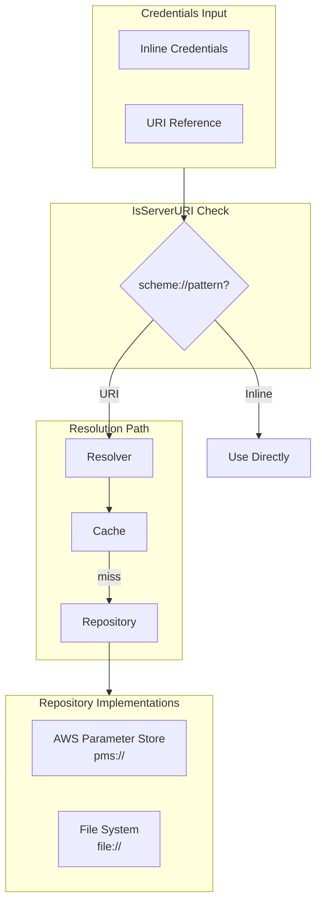
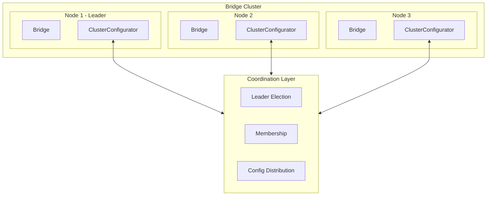

# GoBridge Architecture

This document provides a comprehensive overview of the GoBridge message bridge system architecture.

**Related Documentation:**
- [ARCHITECTURE-TRANSPORTS.md](./ARCHITECTURE-TRANSPORTS.md) - Transport implementations
- [ARCHITECTURE-MIDDLEWARE.md](./ARCHITECTURE-MIDDLEWARE.md) - Middleware and retry system
- [MISSING.md](./MISSING.md) - Missing features for production readiness

## Table of Contents

1. [System Overview](#system-overview)
2. [Core Concepts](#core-concepts)
3. [Bridge Runtime](#bridge-runtime)
4. [Pipeline Architecture](#pipeline-architecture)
5. [Configuration System](#configuration-system)
6. [Credentials System](#credentials-system)
7. [Clustering](#clustering)

---

## System Overview

GoBridge is a flexible, type-safe message bridge for connecting message sources to targets through configurable pipelines. It supports multiple transports (MQTT, SQS, Azure Service Bus) and provides middleware chains for message transformation, filtering, and error handling.



## Core Concepts

### Package Structure

```
gobridge/
├── bridge/                    # Core bridge abstractions
│   ├── core/                  # Runtime implementations
│   │   ├── bridge.go          # Main Bridge runtime
│   │   ├── pipeline.go        # Pipeline implementation
│   │   ├── route.go           # Route implementation
│   │   ├── config_handler.go  # Dynamic config handling
│   │   └── *_registry.go      # Factory registries
│   ├── credentials/           # Credential management
│   │   ├── resolver.go        # URI-based credential resolution
│   │   └── builders/          # Fluent credential builders
│   ├── registry/              # Connection registry
│   └── types/                 # Interface definitions
├── config/                    # Configuration sources
│   ├── aws/dynamodb/          # DynamoDB config source
│   └── file/                  # File-based config
├── credentials/               # Credential repositories
│   ├── aws/pms/               # AWS Parameter Store
│   └── file/                  # File-based credentials
├── middleware/                # Middleware implementations
│   ├── filter/                # Message filtering
│   ├── retry/                 # Retry and DLQ
│   └── transform/             # Message transformation
├── metrics/                   # Metrics exporters
│   ├── aws/cloudwatch/        # CloudWatch metrics
│   └── otel/                  # OpenTelemetry
└── transport/                 # Transport implementations
    ├── mqtt/                  # MQTT v5 transport
    ├── aws/sqs/               # AWS SQS transport
    └── azure/servicebus/      # Azure Service Bus
```

### Key Interfaces



---

## Bridge Runtime

The `Bridge` is the central runtime that orchestrates all components.

### Bridge Structure

```go
type Bridge struct {
    id                 string
    sourceRegistry     types.SourceRegistry
    targetRegistry     types.TargetRegistry
    middlewareRegistry *MiddlewareRegistry
    configSource       types.ConfigSource
    
    // Transport retry defaults (Connection level override)
    transportRetry     types.TransportRetryConfig
    
    // Flow control defaults (Pipeline level override)
    flowControl        types.FlowControlConfig
    
    pipelines          map[string]types.Pipeline
    routes             map[string]types.Route
}
```

### Bridge Lifecycle



### Creating a Bridge

```go
// Create bridge with options
bridge := core.NewBridge("my-bridge",
    core.WithSourceRegistry(sourceRegistry),
    core.WithTargetRegistry(targetRegistry),
    core.WithMiddlewareRegistry(middlewareRegistry),
    core.WithConfigSource(configSource),
)

// Register transport factories
bridge.SourceRegistry().RegisterFactory(mqttFactory)
bridge.TargetRegistry().RegisterFactory(sqsFactory)

// Create and add pipelines
pipeline, _ := bridge.CreatePipeline(ctx, "mqtt-to-sqs",
    mqttSourceConfig,
    sqsTargetConfig,
    []string{"logging", "transform"},
)
bridge.AddPipeline(pipeline)

// Start the bridge
bridge.Start(ctx)
defer bridge.Close()
```

---

## Pipeline Architecture

Pipelines connect Sources to Targets through Middleware chains.

### ⚠️ Two Retry Systems

GoBridge has **two separate retry systems**:

| System | Location | Purpose | Limit |
|--------|----------|---------|-------|
| **Transport Retry** | Target.Send() | Infrastructure failures | Message TTL |
| **Message Retry** | RetryManager | Application failures | MaxAttempts |

See [ARCHITECTURE-MIDDLEWARE.md](./ARCHITECTURE-MIDDLEWARE.md) for detailed explanation.

### Flow Control

Pipelines implement backpressure and message TTL:

```go
bridge := core.NewBridge("my-bridge",
    // Transport retry defaults (for infrastructure failures)
    core.WithTransportRetry(types.TransportRetryConfig{
        InitialBackoff: time.Second,
        MaxBackoff:     5 * time.Minute,
    }),
    
    // Flow control defaults
    core.WithFlowControl(types.FlowControlConfig{
        MaxInFlight:       100,             // Backpressure limit
        DefaultMessageTTL: 2 * time.Minute, // For messages without TTL
    }),
)
```

### Message Flow



### Pipeline Modes

- **Simplex**: One-way flow (Source → Target)
- **Duplex**: Bidirectional flow (Source ↔ Target)

### Routes

Routes chain multiple Pipelines together:



---

## Configuration System

### Configuration Sources



### Dynamic Configuration

The system supports runtime configuration changes:

```go
type ConfigChange struct {
    Type      ConfigChangeType  // add, update, delete
    Item      ConfigItem
    Timestamp time.Time
}

type ConfigChangeHandler interface {
    HandleConnectionChange(ctx, change) error
    HandleSourceChange(ctx, change) error
    HandleTargetChange(ctx, change) error
    HandleBatchChanges(ctx, changes) error
}
```

### Lifecycle Coordination

For shared connections (like MQTT), atomic changes are coordinated:



---

## Credentials System

### Credential Types

```go
type Credentials struct {
    Type        []CredentialsType  // UsernamePassword, TLS
    Credentials []any              // Inline or URI references
}

type UsernamePasswordCredentials struct {
    Username string
    Password string
}

type TlsCredentials struct {
    CertPEM            string
    KeyPEM             string
    CaPEM              []string
    InsecureSkipVerify bool
}
```

### Credential Resolution



### Credentials Builder

```go
// Build credentials fluently
creds, _ := builders.NewCredentialsBuilder().
    WithUsernamePassword("admin", "secret").
    WithCertFile("/path/to/cert.pem").
    WithKeyFile("/path/to/key.pem").
    WithCAFiles("/path/to/ca-chain.pem").
    Build()

// Generate self-signed for testing
testCreds, _ := builders.GenerateTestCredentials("localhost")
```

---

## Clustering

The `ClusterConfigurator` interface enables multi-node deployments:



### Cluster Features

- **Leader Election**: Cluster-wide decisions
- **Shared Subscriptions**: Coordinated message consumption
- **Drain Coordination**: Graceful node shutdown
- **Configuration Filtering**: Node-specific config views

```go
type ClusterConfigurator interface {
    ConfigSource  // Filtered config view
    
    GetIdentity() BridgeIdentity
    RequestDrain(ctx context.Context) error
    IsDraining() bool
    IsLeader() bool
    WaitForReady(ctx context.Context) error
}
```

---

## Key Design Principles

1. **Interface-First**: All components defined as interfaces in `bridge/types`
2. **Pluggable Transports**: Easy to add new message brokers
3. **Middleware Chains**: Composable message processing
4. **Optional Admin**: CRUD interfaces extend read-only base interfaces
5. **Graceful Lifecycle**: Drain-first approach for all changes
6. **Credential Abstraction**: Support inline and external credential stores
7. **Dynamic Configuration**: Runtime updates without restart
