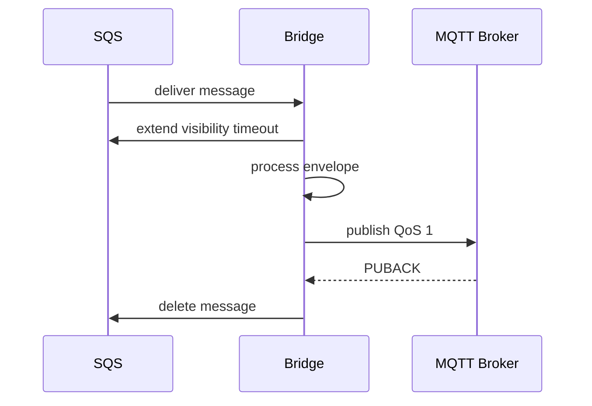
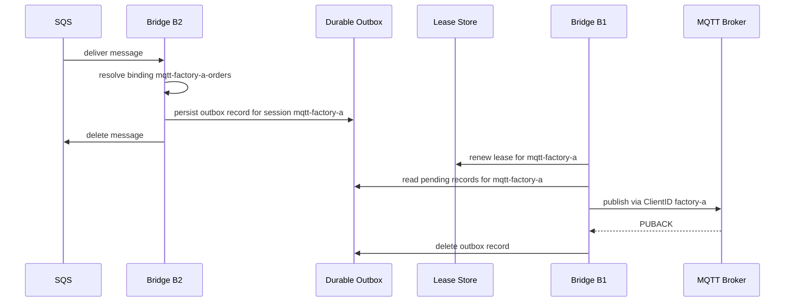
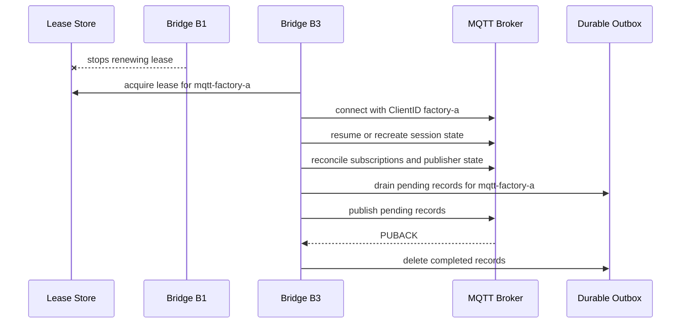

# Proposed Architecture Examples

This document gives worked examples for the proposed GoBridge architecture.

It is intended to make the other proposal documents concrete.

Related documents:

- [ARCHITECTURE_NEW.md](./ARCHITECTURE_NEW.md)
- [ARCHITECTURE_NEW-TRANSPORTS.md](./ARCHITECTURE_NEW-TRANSPORTS.md)
- [ARCHITECTURE_NEW-MIDDLEWARE.md](./ARCHITECTURE_NEW-MIDDLEWARE.md)
- [ARCHITECTURE_NEW-CLUSTERING.md](./ARCHITECTURE_NEW-CLUSTERING.md)
- [ARCHITECTURE_NEW-MODULES.md](./ARCHITECTURE_NEW-MODULES.md)
- [ARCHITECTURE_NEW-STORES.md](./ARCHITECTURE_NEW-STORES.md)
- [ARCHITECTURE_RECORDS.md](./ARCHITECTURE_RECORDS.md)

## Reading Guide

Each example answers five questions:

1. What owns ingress?
2. When does the bridge become the durable owner?
3. Which target binding is selected?
4. Who is allowed to send?
5. How does failover behave?

## Example 1: MQTT Source To SQS Target

### Use Case

- devices publish telemetry to MQTT
- the bridge forwards to SQS for downstream batch processing

### Desired Behavior

- MQTT may reconnect without losing the logical subscription
- SQS is the durable system of record after acceptance
- the bridge does not need an outbox because the target is already durable

### Conceptual Configuration

```yaml
sessions:
  - id: mqtt-telemetry
    transport: mqtt
    client_id: bridge-telemetry
    session_mode: persistent

receivers:
  - id: mqtt-telemetry-rx
    session_id: mqtt-telemetry
    subscriptions:
      - topic: devices/+/telemetry
        qos: 1

senders:
  - id: sqs-telemetry
    transport: sqs
    queue: telemetry-ingress
```

### Runtime Flow

1. the MQTT session receives a QoS 1 publish
2. the receiver creates a `Delivery`
3. processors validate and normalize the envelope
4. the SQS sender sends the envelope to the queue
5. after SQS accepts the message, the MQTT delivery is acknowledged

### Failure Behavior

- if the bridge crashes before SQS accepts the message, the MQTT side may redeliver according to session and QoS semantics
- if the bridge crashes after SQS accepts the message but before local completion bookkeeping, duplicates are possible
- idempotent downstream processing is still required

## Example 2: SQS Source To MQTT Target With DirectHold

### Use Case

- one SQS queue carries commands for a single MQTT device gateway
- the bridge and MQTT sender run on the same instance
- the target broker is reliably available
- low-latency forwarding is more important than cross-instance failover

### Why DirectHold Is Appropriate

This is a co-located single-binding route:

- one SQS receiver, one MQTT sender, same process
- no fan-out
- the MQTT session is not exclusive or is standalone
- SQS supports visibility extension

### Conceptual Configuration

```yaml
sessions:
  - id: mqtt-gateway
    transport: mqtt
    client_id: bridge-gateway
    session_mode: persistent

receivers:
  - id: sqs-commands-rx
    transport: sqs
    queue: device-commands

senders:
  - id: mqtt-gateway-tx
    session_id: mqtt-gateway
    transport: mqtt

routes:
  - id: sqs-to-gateway
    receiver_id: sqs-commands-rx
    sender_id: mqtt-gateway-tx
    delivery_mode: direct_hold
    dispatch_mode: single
    policy:
      max_in_flight: 10
      ack_after: target_accept
```

### Runtime Flow



1. the bridge receives the SQS message
2. the bridge extends the SQS visibility timeout
3. processors validate and normalize the envelope
4. the MQTT sender publishes at QoS 1
5. after `PUBACK`, the bridge deletes the SQS message

### Failure Behavior

- if the bridge crashes before MQTT accepts: SQS visibility timeout expires, another receive attempt occurs
- if the bridge crashes after `PUBACK` but before SQS delete: SQS redelivers, but the MQTT broker has already accepted the message (duplicate at MQTT level)
- if MQTT is temporarily unavailable: SQS visibility extension keeps the message invisible while the bridge retries; if retries exhaust, SQS makes the message visible again
- no outbox is involved; no cross-instance failover is possible

### When To Switch To SharedOutbox

Switch to `SharedOutbox` mode if any of these conditions emerge:

- the bridge must run as multiple instances for availability
- the MQTT session must be exclusive and lease-managed
- fan-out to multiple MQTT clients is needed
- the MQTT broker has extended downtime periods

## Example 3: SQS Source To One Of Many MQTT Named Clients

### Use Case

- one SQS queue carries commands for many factories
- each factory must publish through its own MQTT `ClientID`
- only one live connection may exist for each `ClientID`

### Why This Example Matters

This is the core clustered case:

- ingress can scale out across many bridge instances
- egress for one MQTT client is still single-active
- the bridge must select both target client and target topic per message

### Conceptual Configuration

```yaml
sessions:
  - id: mqtt-factory-a
    transport: mqtt
    client_id: factory-a
    session_mode: exclusive
    broker_urls: ["ssl://broker-a:8883"]

  - id: mqtt-factory-b
    transport: mqtt
    client_id: factory-b
    session_mode: exclusive
    broker_urls: ["ssl://broker-a:8883"]

receivers:
  - id: sqs-orders-rx
    transport: sqs
    queue: factory-orders

senders:
  - id: mqtt-publisher
    transport: mqtt

bindings:
  - id: mqtt-factory-a-orders
    sender_id: mqtt-publisher
    session_id: mqtt-factory-a
    address_template: factory/a/orders/{device_id}
    options:
      qos: 1

  - id: mqtt-factory-b-orders
    sender_id: mqtt-publisher
    session_id: mqtt-factory-b
    address_template: factory/b/orders/{device_id}
    options:
      qos: 1
```

### Conceptual Resolver

```go
func Resolve(ctx context.Context, env *Envelope) ([]DispatchPlan, error) {
    factory, _ := env.Headers["factory"].(string)
    deviceID, _ := env.Headers["device_id"].(string)

    switch factory {
    case "A":
        return []DispatchPlan{{
            BindingID: "mqtt-factory-a-orders",
            Address:   "factory/a/orders/" + deviceID,
        }}, nil
    case "B":
        return []DispatchPlan{{
            BindingID: "mqtt-factory-b-orders",
            Address:   "factory/b/orders/" + deviceID,
        }}, nil
    default:
        return nil, fmt.Errorf("no MQTT route for factory %q", factory)
    }
}
```

### Runtime Flow

1. any bridge instance receives the SQS message
2. processors validate the command and normalize headers
3. `DestinationResolver` selects the binding and concrete topic
4. the bridge writes an outbox entry keyed by route, message ID, binding ID, and session ID
5. the bridge deletes the SQS message
6. the bridge instance that owns the lease for that MQTT session drains the outbox partition
7. it publishes to the resolved topic through the correct connected client
8. after broker acceptance, the outbox entry is removed

### Important Consequence

The bridge instance that consumed from SQS does not need to be the same instance that publishes to MQTT.

That is intentional.

## Example 4: Failover For Example 3

### Topology

- three bridge instances: `B1`, `B2`, `B3`
- shared lease store
- shared durable outbox
- one exclusive MQTT session for `ClientID=factory-a`

Initial ownership:

- `B2` receives some SQS messages
- `B1` holds the lease for `mqtt-factory-a`
- `B1` is therefore the only bridge allowed to publish for that client

### Normal Flow Before Failure



### Failure Event

Now `B1` crashes after some SQS messages have already been accepted into the outbox.

### Failover Flow



### What Is Preserved

- SQS messages that were not yet deleted remain in SQS
- SQS messages already deleted remain in the durable outbox
- the new owner reconnects with the same `ClientID`
- pending records for that client continue from the outbox partition

### What Can Still Happen

- duplicate publish after crash at the wrong point
- brief publish pause while the lease expires and a new owner connects

This is still acceptable because the goal is at-least-once delivery with minimal loss, not impossible exactly-once guarantees across SQS and MQTT.

## Example 5: MQTT Shared Subscription To Azure Service Bus

### Use Case

- an MQTT 5 broker supports shared subscriptions
- many bridge instances should process one logical subscription
- each processed message should be forwarded to Azure Service Bus

### Conceptual Configuration

```yaml
sessions:
  - id: mqtt-shared-ingress
    transport: mqtt
    client_id: bridge-shared-member
    session_mode: persistent

receivers:
  - id: mqtt-shared-rx
    session_id: mqtt-shared-ingress
    subscriptions:
      - topic: $share/bridge-group/devices/+/events
        qos: 1

senders:
  - id: asb-events
    transport: azure-service-bus
    entity: device-events
```

### Runtime Flow

1. the broker assigns each matching message to one active bridge session
2. the bridge processes the envelope
3. the Azure sender sends to the target entity
4. after Azure accepts the message, the MQTT delivery is progressed

### Why No Lease Is Needed

The broker is already doing the distribution work.

The bridge cluster coordinates membership only.

## Example 6: Kinesis To MQTT And Azure Service Bus

### Use Case

- a Kinesis stream receives events from many producers
- some events go to MQTT factory clients
- all events also go to Azure Service Bus for audit

Kinesis is not currently implemented in this repository, but the architecture should support it.

### Ownership Model

- shard lease decides which bridge reads a shard
- outbox persists one record per resolved dispatch plan
- MQTT session lease decides which bridge may publish for an exclusive client
- Azure send may be performed by any bridge instance able to drain that binding

### Conceptual Runtime Flow

1. bridge `B4` owns Kinesis shard `shard-003`
2. `B4` reads record `R1`
3. processors normalize the envelope
4. resolver returns two dispatch plans:
   - MQTT binding `mqtt-factory-a-orders`
   - Azure binding `asb-audit`
5. `B4` writes two outbox entries
6. `B4` checkpoints the Kinesis record
7. the bridge owning MQTT session `mqtt-factory-a` drains and publishes the MQTT entry
8. any eligible bridge drains and sends the Azure entry
9. each outbox entry is removed independently after target acceptance

### Why This Works

Source ownership, message ownership, and session ownership are decoupled.

That means:

- Kinesis scaling follows shard count
- MQTT scaling follows number of exclusive client sessions
- Azure scaling follows sender capacity

## Example 7: Fan-Out To Multiple MQTT Clients

### Use Case

- one source message must be sent to more than one MQTT client
- each client has its own exclusive session

### Resolver Result

The resolver returns multiple dispatch plans:

```go
[]DispatchPlan{
    {BindingID: "mqtt-factory-a-orders", Address: "factory/a/orders/42"},
    {BindingID: "mqtt-factory-b-orders", Address: "factory/b/orders/42"},
}
```

### Runtime Rule

- the bridge writes one durable outbox record per dispatch plan
- the source is only acked or checkpointed after all required records are durable
- each session owner drains its own partition independently

### Consequence

Partial success is visible and recoverable:

- if client `factory-a` succeeds and `factory-b` is offline, only the second outbox record remains pending

## Example 8: Message Expires During Downtime

### Use Case

- an SQS message is bridged to MQTT
- target broker is down for longer than the message lifetime

### Runtime Flow

1. bridge receives the SQS message
2. bridge resolves the destination binding
3. bridge writes the outbox entry with `ExpiresAt`
4. bridge deletes the SQS message
5. broker remains unavailable
6. when the bridge retries replay, it finds the message expired
7. the entry is dropped or sent to DLQ according to route policy

### Important Rule

The bridge does not publish stale data just because it was durably stored.

Expiry is checked again before replay.

## Summary

These examples show the intended operating model:

- source durability and target durability are treated separately
- exclusive MQTT clients are handled through lease-based session ownership
- runtime routing to the correct client and topic is handled through `DestinationBinding` and `DestinationResolver`
- outbox-backed replay makes clustered failover practical
