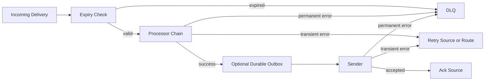
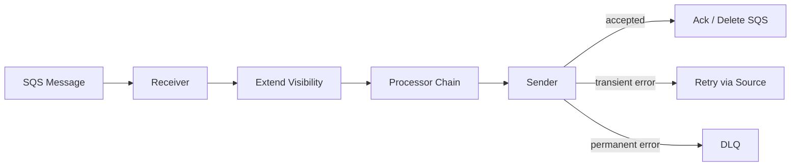
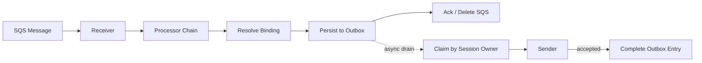

# Proposed Middleware And Delivery Architecture

This document describes how message processing, retries, expiry, outbox handling, and DLQ behavior should work in the proposed GoBridge architecture.

Related documents:

- [ARCHITECTURE_NEW.md](./ARCHITECTURE_NEW.md)
- [ARCHITECTURE_NEW-CLUSTERING.md](./ARCHITECTURE_NEW-CLUSTERING.md)
- [ARCHITECTURE_NEW-TRANSPORTS.md](./ARCHITECTURE_NEW-TRANSPORTS.md)
- [ARCHITECTURE_NEW-EXAMPLES.md](./ARCHITECTURE_NEW-EXAMPLES.md)
- [ARCHITECTURE_NEW-MODULES.md](./ARCHITECTURE_NEW-MODULES.md)
- [ARCHITECTURE_NEW-STORES.md](./ARCHITECTURE_NEW-STORES.md)
- [ARCHITECTURE_RECORDS.md](./ARCHITECTURE_RECORDS.md)

## Principle

Middleware should process messages.

The runtime should manage delivery.

That is the most important simplification in the redesign.

## What Middleware Should Do

Middleware, or processors, should be limited to:

- validation
- filtering
- transformation
- enrichment
- routing decisions
- idempotency key calculation
- observability annotations

Middleware may inspect and modify the envelope, but it should not own transport lifecycle.

## What The Runtime Should Do

The runtime owns:

- backpressure
- expiry
- source ack timing
- destination retry policy
- durable outbox behavior
- DLQ movement
- session reconciliation
- cluster lease interactions

These concerns cut across transports and should not be modeled as ordinary processors.

## Proposed Processor Contract

Conceptually:

```go
type Processor interface {
    Name() string
    Process(ctx context.Context, env *Envelope, next ProcessorFunc) error
}

type ProcessorFunc func(ctx context.Context, env *Envelope) error
```

This remains intentionally close to the current middleware chain because the message transformation part is already simple enough.

## Route Execution Model



## Expiry

The runtime checks expiry at three points:

1. before processor execution
2. before durable outbox persistence
3. before actual send or replay

Rules:

- expired messages are never retried
- expired messages may be dropped or archived depending on route policy
- transport-native expiry is only derived from remaining lifetime

## Retry Model

The redesign replaces "two retry systems" with one route-level delivery policy plus source-native behavior.

There are still two places where retry may happen in practice, but they are no longer modeled as unrelated subsystems:

- source-native retry or redelivery
- route-managed retry through outbox or scheduler

The bridge should answer one question:

"Who owns the message now?"

If the source still owns it:

- use `Delivery.Retry()`

If the bridge owns it durably:

- use outbox replay or scheduled retry

That is easier to reason about than separate transport retry and message retry stacks.

## Recommended Error Classes

The runtime should classify errors into four buckets:

| Class | Meaning | Typical Action |
|------|---------|----------------|
| `Transient` | Retry may succeed later | retry through source or outbox |
| `Permanent` | Retry will not help | send to DLQ |
| `Expired` | Message is stale | drop or archive |
| `Rejected` | Policy or authorization rejection | DLQ with clear reason |

The current `BridgeError` model can be kept if desired, but route behavior should be described in terms of delivery ownership instead of where the error happened.

## Backpressure

Backpressure must be explicit and safe.

Rules:

- `MaxInFlight` is route policy, not transport guesswork
- reliable routes must block or slow down, not drop
- local queue overflow is only acceptable for explicitly best-effort routes

This matters most for MQTT:

- QoS 1 and 2 semantics are undermined if the bridge drops after the transport delivers to the process
- MQTT 5 `Receive Maximum` should be aligned with route in-flight limits when possible

## Idempotency Contract

Idempotency is required for all cluster-safe reliable routes to handle Failure Scenario 2 (consumer dies after outbox persist but before source ack, causing redelivery and potential duplicate outbox entries).

### Idempotency Key Location

The idempotency key lives in the standard header `x-bridge.idempotency-key`. Processors may compute and set this header. If not set by a processor, the runtime derives a default key from `Envelope.ID + BindingID`.

### Deduplication Mechanism

The primary deduplication mechanism is conditional writes at the `OutboxStore` level. `OutboxStore.Persist` uses a condition that rejects records where a record with the same `EnvelopeID + BindingID` already exists in the same partition.

This is more reliable than a separate deduplication store because it is atomic with the persist operation itself.

### Startup Validation

The startup validator must reject `SharedOutbox` routes that do not have either:

- a processor configured to compute the idempotency key, or
- a non-empty `Envelope.ID` guaranteed by the source transport

This ensures that the conditional write deduplication has a meaningful key to check against.

### Deduplication Window

Completed and expired outbox entries are retained for a configurable compaction grace period (default: 1 hour) before physical deletion. During this window, conditional writes can detect duplicates. After compaction, duplicates from extremely delayed redeliveries are possible but are operationally acceptable for at-least-once semantics.

## Durable Outbox

The outbox is the key missing runtime primitive for reliable egress.

It is required when:

- the source is durable
- the target is stateful or intermittently connected
- the source must be acked before target acceptance would otherwise be known

Example:

- SQS -> MQTT QoS 1 with intermittent broker availability

Safe behavior:

1. receive SQS message
2. process envelope
3. persist to outbox
4. ack SQS message
5. publish from outbox
6. remove from outbox after broker acceptance

Unsafe behavior:

1. receive SQS message
2. try to publish directly to MQTT
3. ack SQS after an in-memory handoff only

That loses messages across process restarts.

## Delivery Modes

The runtime supports two delivery modes for routes bridging from durable sources to stateful targets. The mode is an explicit route policy field.

### DirectHold Mode

In `DirectHold` mode, the source retains message visibility until the target accepts the message. No outbox persistence is required. The bridge extends the source visibility timeout while processing and sending.



Validation requirements:

- Source transport supports the `VisibilityExtension` capability
- `DispatchMode=Single` (no fan-out)
- MQTT QoS 1 or 2
- Consumer and sender are co-located on the same bridge instance
- Target session is not subject to lease handoff (non-exclusive or standalone)

Use when:

- Single-process deployment
- Low-latency is more important than cross-instance failover
- Target is reliably available

### SharedOutbox Mode

In `SharedOutbox` mode, the bridge takes durable ownership via the outbox before acking the source. This enables cross-instance handoff and survives process restarts.



Validation requirements:

- Configured shared `OutboxStore`
- Configured `LeaseStore` for exclusive sessions
- MQTT QoS 1 or 2 for reliable routes
- All dispatch plans durably written before source ack for fan-out

Use when:

- Clustered deployment with multiple bridge instances
- Exclusive MQTT session may be handed off
- Target may be intermittently unavailable
- Fan-out to multiple destinations

### MQTT QoS Completion Rules

For outbox-backed MQTT routes, the outbox entry completion depends on QoS level:

- QoS 1: mark `completed` on `PUBACK`
- QoS 2: mark `completed` on `PUBCOMP`
- QoS 0: invalid for reliable outbox-backed routes

### Startup Validation Errors

The startup validator produces clear error messages for invalid delivery mode configurations:

- `direct_hold invalid: resolver fan-out is enabled`
- `direct_hold invalid: target session requires lease handoff`
- `direct_hold invalid: source does not support visibility extension`
- `shared_outbox invalid: no OutboxStore configured`
- `shared_outbox invalid: no LeaseStore configured for exclusive session`
- `shared_outbox invalid: no idempotency key processor configured and source does not guarantee Envelope.ID`
- `shared_outbox invalid: fan-out cardinality exceeds OutboxStore transaction limit (100)`
- `reliable MQTT route invalid: qos=0`

## Poison Message Protection

A poison message in the outbox can cause an infinite crash loop: the sender crashes on the message, the lease transfers to a new owner, the new owner reclaims the same message, and crashes again.

### Replay Count

Every `OutboxRecord` carries a `ReplayCount` field that tracks how many times the record has been claimed for replay. The replay count is incremented on each `Claim` operation.

### Max Replay Policy

The route policy defines a `MaxReplayAttempts` (default: 5). When a record's `ReplayCount` exceeds this limit, the runtime must:

1. Move the record to the DLQ with category `PoisonMessage` and the last error.
2. Mark the outbox record as `expired` to prevent further claims.
3. Continue draining the remaining records in the partition.

This is distinct from the message-level retry count, which applies before the message reaches the outbox.

### Interaction With Error Classification

If a sender returns a `Permanent` error during outbox replay, the message is sent to the DLQ immediately without waiting for replay count exhaustion.

If a sender returns a `Transient` error, the record remains in `claimed` state. If the claim times out (owner crash or unresponsiveness), it reverts to `pending` with an incremented `ReplayCount`.

## DLQ

The DLQ remains a runtime concern.

DLQ entries should include:

- the envelope
- failure category
- reason
- route ID
- source transport
- target transport
- attempt counts
- timestamps

Conceptual type:

```go
type DLQEntry struct {
    Envelope      Envelope
    RouteID       string
    BindingID     string
    SessionID     string
    SourceID      string
    CorrelationID string
    Reason        string
    Category      string
    ErrorCode     string
    LastError     string
    FailedAt      time.Time
    Attempts      int
}
```

### DLQ Store Interface

The DLQ should be queryable and support selective replay:

```go
type DLQFilter struct {
    RouteID    string
    Category   string
    Since      time.Time
    Before     time.Time
    Limit      int
}

type DLQStore interface {
    Write(ctx context.Context, entry DLQEntry) error
    List(ctx context.Context, filter DLQFilter) ([]DLQEntry, error)
    Replay(ctx context.Context, entryIDs []string) error
    Purge(ctx context.Context, before time.Time) (int, error)
}
```

DLQ replay should reset the attempt counter, apply a configurable rate limit, and re-enter the full pipeline including the processor chain. Replay requires explicit operator action and should never be automatic.

## Route Policies

Suggested policy shape:

```go
type RoutePolicy struct {
    MaxInFlight          int
    Backoff              BackoffPolicy
    RequireDurableEgress bool
    OnExpired            ExpiredAction
    OnPermanentFailure   FailureAction
}
```

Possible actions:

- `Drop`
- `DLQ`
- `Retry`

## MQTT Examples

### MQTT Source To SQS Target

Recommended:

- MQTT QoS 1 or 2
- persistent session when offline continuity matters
- idempotent downstream handling

Flow:

1. MQTT session receives publish
2. envelope passes processor chain
3. sender submits to SQS
4. source delivery is acked only after SQS acceptance

No durable outbox is usually needed because SQS is already the durable target boundary.

### SQS Source To MQTT Target

Recommended:

- SQS source
- MQTT QoS 1 or 2
- durable outbox when MQTT downtime or process restart durability matters

Flow:

1. receive SQS message
2. process envelope
3. persist to outbox
4. ack SQS
5. replay outbox into MQTT on active session

## Processor Best Practices

1. Keep processors idempotent.
2. Keep processors transport-agnostic.
3. Add routing and idempotency headers early.
4. Reject malformed envelopes before expensive enrichment.
5. Do not implement destination retry loops inside processors.
6. Do not mutate session state inside processors.

## Route Runner Decomposition

The route runner is responsible for backpressure, expiry checking, processor chain execution, outbox persistence, sender dispatch, DLQ routing, retry logic, ack timing, and lease interaction. To keep it testable and avoid a god object, these responsibilities should be decomposed into composable stages:

- `ExpiryGuard`: check expiry at entry, before outbox persist, and before send/replay.
- `ProcessorChain`: execute the processor chain on the envelope.
- `OutboxWriter`: persist to outbox when durable egress is required.
- `SenderDispatcher`: dispatch to sender, possibly via resolver and binding selection.
- `AckCoordinator`: manage source ack boundary timing.
- `DLQRouter`: route permanent failures and expired messages to DLQ.

Each stage is independently testable. The route runner composes them into the route execution pipeline.

## Migration Notes

The current design has middleware mixed with delivery semantics through:

- `RetryManager`
- flow control defaults
- pipeline TTL checks

Recommended migration:

1. keep the middleware chain type
2. move retry and expiry to route runner
3. add outbox-backed route policy
4. limit middleware to envelope processing

That preserves the ergonomic part of the current design while removing the part that makes runtime reasoning hard.
