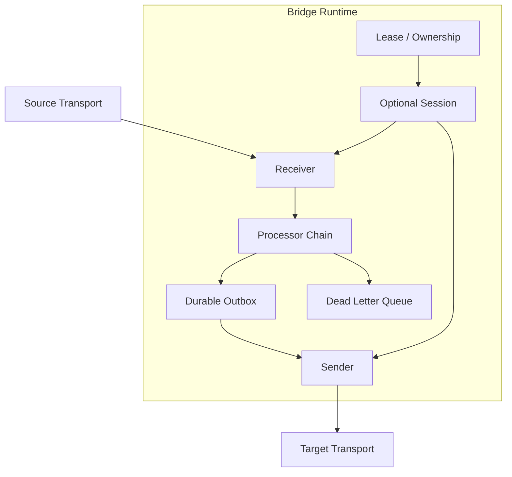
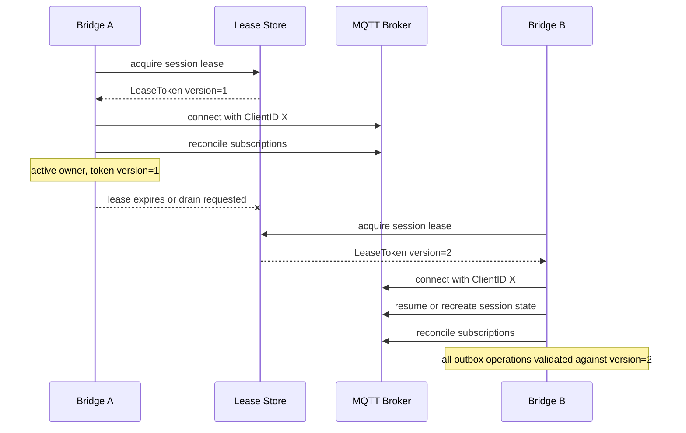
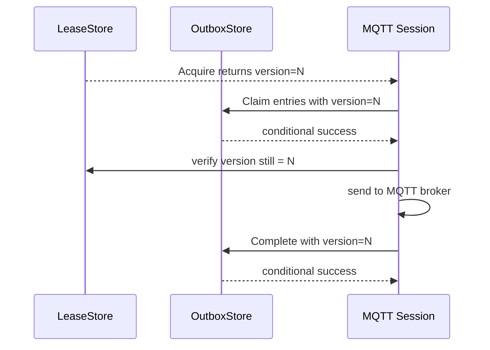

# GoBridge Proposed Architecture

This document describes a proposed replacement architecture for GoBridge.

It is written as a redesign document, not as a description of the current implementation.
The current implementation is documented in:

- [ARCHITECTURE.md](./ARCHITECTURE.md)
- [ARCHITECTURE-TRANSPORTS.md](./ARCHITECTURE-TRANSPORTS.md)
- [ARCHITECTURE-MIDDLEWARE.md](./ARCHITECTURE-MIDDLEWARE.md)

Related proposal documents:

- [ARCHITECTURE_NEW-TRANSPORTS.md](./ARCHITECTURE_NEW-TRANSPORTS.md)
- [ARCHITECTURE_NEW-MIDDLEWARE.md](./ARCHITECTURE_NEW-MIDDLEWARE.md)
- [ARCHITECTURE_NEW-CLUSTERING.md](./ARCHITECTURE_NEW-CLUSTERING.md)
- [ARCHITECTURE_NEW-EXAMPLES.md](./ARCHITECTURE_NEW-EXAMPLES.md)
- [ARCHITECTURE_NEW-MODULES.md](./ARCHITECTURE_NEW-MODULES.md)
- [ARCHITECTURE_NEW-STORES.md](./ARCHITECTURE_NEW-STORES.md)
- [ARCHITECTURE_RECORDS.md](./ARCHITECTURE_RECORDS.md)

## Why A New Architecture

The current type system models the same concerns multiple times:

- `Source`, `Target`, and `Connection`
- `Publisher`, `SubscriberSource`, and `Subscriber`
- topic-level config, pipeline-level config, and connection-level lifecycle coordination

That makes the transport surface wider than the runtime actually needs.

The redesign has four primary goals:

1. Keep the core generic and small.
2. Make MQTT session behavior a first-class concept instead of hiding it behind endpoint objects.
3. Support reliable bridging through downtime and failover.
4. Preserve enough flexibility to support MQTT, SQS/SNS, and Azure Service Bus without special-casing the core.

## Design Goals

- One mental model for all transports.
- Explicit session ownership for stateful transports.
- Explicit delivery ownership for reliable bridging.
- A single expiry model in the bridge core.
- Middleware that is simple and transport-agnostic.
- Cluster coordination that deals with ownership and leases, not protocol details.

## Non-Goals

- The core will not emulate transport features that do not exist.
- The core will not invent exactly-once guarantees across heterogeneous brokers.
- The core will not hide the difference between stateless transports and session-oriented transports.

## Core Model

The proposed core model is built from six concepts:

- `Envelope`: the normalized message being moved through the bridge.
- `Delivery`: a source-owned unit of work that can be acked, retried, or extended.
- `Receiver`: reads deliveries from a transport.
- `Sender`: submits envelopes to a transport.
- `Session`: owns network identity and remote state when the transport is stateful.
- `Lease`: optional cluster ownership for single-active and failover scenarios.

Conceptual types:

```go
type Envelope struct {
    ID        string
    Subject   string
    Payload   []byte
    Headers   map[string]any
    CreatedAt time.Time
    ExpiresAt time.Time
}

type Delivery interface {
    Envelope() *Envelope
    Ack(ctx context.Context) error
    Retry(ctx context.Context, after time.Duration, reason error) error
    Extend(ctx context.Context, until time.Time) error
}

type Receiver interface {
    Run(ctx context.Context, emit func(context.Context, Delivery) error) error
}

type Sender interface {
    Send(ctx context.Context, env *Envelope) error
}

type BatchSender interface {
    Sender
    SendBatch(ctx context.Context, envs []*Envelope) (int, error)
}

type SessionEvent struct {
    Type      SessionEventType
    Err       error
    Timestamp time.Time
}

type Session interface {
    Start(ctx context.Context) error
    Reconcile(ctx context.Context, plan SessionPlan) error
    Health(ctx context.Context) SessionHealth
    Events() <-chan SessionEvent
    Close(ctx context.Context) error
}

type LeaseToken struct {
    Version uint64
    Owner   string
}

type Lease interface {
    Acquire(ctx context.Context) (LeaseToken, error)
    Renew(ctx context.Context, token LeaseToken) (LeaseToken, error)
    Release(ctx context.Context, token LeaseToken) error
    Owner() string
}
```

## Store Interfaces

The runtime requires two store interfaces for clustered and reliable operation. These are port interfaces and live in `bridge/types/`, not in `bridge/runtime/`, so that technology modules can implement them without importing the runtime package.

### LeaseStore

```go
type LeaseInfo struct {
    LeaseID   string
    Owner     string
    Version   uint64
    ExpiresAt time.Time
}

type LeaseStore interface {
    Acquire(ctx context.Context, leaseID string, ownerID string, ttl time.Duration) (LeaseToken, error)
    Renew(ctx context.Context, leaseID string, token LeaseToken, ttl time.Duration) (LeaseToken, error)
    Release(ctx context.Context, leaseID string, token LeaseToken) error
    Current(ctx context.Context, leaseID string) (LeaseInfo, error)
}
```

Rules:

- `Acquire` must succeed only if the lease is unowned or expired. It must set `Version` to a value higher than any previous version for the same lease.
- `Renew` must validate the caller's `LeaseToken.Version` against the stored version. On mismatch, it must return an error.
- `Release` must validate the token before releasing.
- All operations must be safe for concurrent callers from different bridge instances.
- DynamoDB implementation uses conditional writes with `ConditionExpression` to enforce these invariants.

### OutboxStore

```go
type OutboxStatus string

const (
    OutboxPending   OutboxStatus = "pending"
    OutboxClaimed   OutboxStatus = "claimed"
    OutboxCompleted OutboxStatus = "completed"
    OutboxExpired   OutboxStatus = "expired"
)

type OutboxRecord struct {
    ID            string
    RouteID       string
    EnvelopeID    string
    BindingID     string
    SessionID     string
    Address       string
    Envelope      Envelope
    DispatchHeaders map[string]any
    Status        OutboxStatus
    ClaimedBy     string
    ClaimVersion  uint64
    ReplayCount   int
    CreatedAt     time.Time
    ExpiresAt     time.Time
    CompletedAt   time.Time
}

type OutboxStore interface {
    Persist(ctx context.Context, records []OutboxRecord) error
    Claim(ctx context.Context, partitionKey string, ownerID string, token LeaseToken, limit int) ([]OutboxRecord, error)
    Complete(ctx context.Context, recordIDs []string, token LeaseToken) error
    Expire(ctx context.Context, before time.Time) (int, error)
    QueryPending(ctx context.Context, partitionKey string, limit int) ([]OutboxRecord, error)
}
```

### Outbox State Machine

Valid transitions:

```
pending   -> claimed    (by partition owner via Claim)
pending   -> expired    (by expiry sweep via Expire)
claimed   -> completed  (on target acceptance via Complete)
claimed   -> pending    (on claim timeout or owner crash, reclaimed by new owner)
claimed   -> expired    (on expiry check before send)
completed -> [deleted]  (by async compaction)
expired   -> [deleted]  (by async compaction)
```

Rules:

- `Persist` must use conditional writes to reject duplicate records with the same `EnvelopeID + BindingID` combination. This is the primary idempotency mechanism.
- `Claim` must accept a `LeaseToken` and store the `ClaimVersion` on claimed entries. Entries in `claimed` state whose `ClaimedBy` has an older `ClaimVersion` than the current lease version may be reclaimed.
- `Complete` must validate the caller's `LeaseToken.Version` against the `ClaimVersion` on the record.
- `Expire` sweeps entries where `ExpiresAt < now` and marks them as `expired`.
- Physical deletion is async compaction after `completed` or `expired`, using DynamoDB TTL or equivalent.

## Runtime Topology



Interpretation:

- Stateless transports may use a `Receiver` or `Sender` without a `Session`.
- Stateful transports such as MQTT use a `Session` that owns identity and remote state.
- The bridge only acks the source when delivery ownership has safely moved forward.

## Routes And Policies

A route becomes:

- one receiver
- zero or one session
- one processor chain
- zero or one outbox
- one logical sender
- one delivery policy

The sender may be:

- a direct transport sender
- an egress dispatcher that selects one concrete binding per message

Conceptual route policy:

```go
type RoutePolicy struct {
    MaxInFlight        int
    RetryBackoff       BackoffPolicy
    RetryUntilExpired  bool
    RequireDurableEgress bool
    AckAfter           AckBoundary
}
```

`AckBoundary` is the critical concept:

- `AckAfterTargetAccept`: ack after target accepts the message.
- `AckAfterOutboxPersist`: ack after message is durably written to the outbox.

For stateful and unreliable egress links, `AckAfterOutboxPersist` is the safe default.

## Egress Resolution

Some routes need to choose the concrete target at runtime.

Examples:

- one SQS queue feeds many MQTT named clients
- one Kinesis stream feeds both MQTT and Azure Service Bus
- one logical subject must be rendered to different transport addresses

The core model should stay small, so this should be modeled as a route-level egress decision instead of adding transport-specific logic to `Envelope`.

Conceptually:

```go
type DestinationBinding struct {
    ID        string
    Transport string
    SessionID string
    SenderID  string
    Address   string
    Options   map[string]any
}

type DispatchPlan struct {
    BindingID string
    Address   string
    Headers   map[string]any
}

type DestinationResolver interface {
    Resolve(ctx context.Context, env *Envelope) ([]DispatchPlan, error)
}
```

Rules:

- `BindingID` identifies the concrete target binding to use.
- `SessionID` identifies which stateful session must own the send when the target is session-oriented.
- `Address` is the concrete transport address such as MQTT topic, SQS queue URL, or Service Bus entity.
- fan-out is represented as multiple `DispatchPlan` results for one envelope.

This is the missing abstraction for "publish to topic X via client Y".

## Standard Headers

`Envelope.Headers` remains `map[string]any` for extensibility, but the architecture defines a standard header set that the runtime and transport adapters must populate and propagate.

### Reserved Prefix

All bridge-internal headers use the prefix `x-bridge.`. Transport adapters must strip headers with this prefix from external sources at ingress to prevent header injection.

### Well-Known Header Constants

```go
const (
    HeaderCorrelationID   = "x-bridge.correlation-id"
    HeaderCausationID     = "x-bridge.causation-id"
    HeaderIdempotencyKey  = "x-bridge.idempotency-key"
    HeaderContentType     = "x-bridge.content-type"
    HeaderSourceID        = "x-bridge.source-id"
    HeaderRouteID         = "x-bridge.route-id"
    HeaderOrderingKey     = "x-bridge.ordering-key"
    HeaderDeduplicationID = "x-bridge.dedup-id"
    HeaderTraceParent     = "traceparent"
    HeaderTraceState      = "tracestate"
)
```

### Propagation Rules

- `CorrelationID`: generated by the runtime at ingress if not already present. Propagated through outbox and into egress headers. Included in DLQ entries, log entries, and trace spans.
- `CausationID`: the `Envelope.ID` of the event that caused this message. Set by processors if applicable.
- `IdempotencyKey`: required for `SharedOutbox` delivery mode. Default computation: `Envelope.ID + BindingID`. Used for outbox deduplication via conditional writes.
- `ContentType`: MIME type of the payload. Mapped to/from transport-native content type fields (MQTT 5 Content Type, etc.).
- `SourceID`: set by the runtime to identify the originating receiver.
- `RouteID`: set by the runtime to identify the active route.
- `OrderingKey`: mapped bidirectionally to transport-native ordering constructs (SQS FIFO `MessageGroupId`, Azure Service Bus `SessionId`).
- `DeduplicationID`: mapped to SQS FIFO `MessageDeduplicationId` and similar transport deduplication fields.
- `traceparent` / `tracestate`: W3C Trace Context propagation across transport boundaries.

### Transport Header Mapping

Transport adapters must map between standard headers and transport-native fields:

| Standard Header | MQTT 5 | SQS | Azure Service Bus |
|----------------|--------|-----|-------------------|
| `CorrelationID` | Correlation Data user property | Message attribute | `CorrelationId` |
| `ContentType` | Content Type property | Message attribute | `ContentType` |
| `OrderingKey` | user property | `MessageGroupId` (FIFO) | `SessionId` |
| `DeduplicationID` | user property | `MessageDeduplicationId` (FIFO) | n/a |
| `traceparent` | user property | Message attribute | Application property |

### Validation

- Processors and resolvers must validate header values before using them for routing decisions.
- MQTT topic construction must sanitize header-derived values to reject wildcard characters (`+`, `#`) and validate topic segment structure.
- Type assertion failures on standard headers should produce `Rejected` errors, not panics.

## Expiry Model

The redesign replaces relative TTL inside the bridge core with an absolute expiry timestamp.

Rules:

- `Envelope.ExpiresAt` is the canonical bridge expiry.
- Remaining transport TTL is derived from `ExpiresAt - now`.
- A transport may expose its own expiry field, but the bridge core never uses transport-native TTL as its source of truth.

This fixes a major ambiguity in the current design:

- retry budget
- broker message expiry
- visibility timeout

are related, but they are not the same thing.

## Ownership Modes

The bridge supports three ownership modes.

### Standalone

One bridge instance owns the route.

Use when:

- there is only one process
- the target transport is queue-like and naturally durable

### Single-Active

One bridge instance owns a named session or exclusive client identity at a time.

Use when:

- MQTT `ClientID` must be unique
- a broker policy allows only one named client
- a route must preserve a single logical session

This mode requires a `Lease`.

### Shared-Consumer

Multiple bridge instances participate concurrently, but the transport decides how work is shared.

Use when:

- MQTT v5 shared subscriptions are available
- queue transports already support concurrent consumers

In this mode the cluster coordinates membership, not per-message routing.

## Stateful Sessions

Stateful transports must own their state in one place: the session.

A session is responsible for:

- network connection lifecycle
- remote identity
- persistent subscription state
- reconnect and re-authentication
- reconciling desired state after reconnect

Endpoints must not each carry their own hidden connection state.

This is especially important for MQTT, where the session owns:

- `ClientID`
- clean start / clean session behavior
- session expiry
- subscriptions
- unacknowledged QoS 1 and 2 messages

## Session Reconciliation

Instead of creating and deleting source objects transactionally, the new architecture makes the desired session state explicit.

```go
type SessionPlan struct {
    Subscriptions []SubscriptionPlan
    Publishers    []PublisherPlan
}
```

The rule is:

- configuration produces a desired `SessionPlan`
- the session reconciles actual remote state to that plan

This is simpler than coordinating add/remove/update operations across source and target objects because it matches how MQTT actually behaves.

## Reliable Delivery Through Downtime

The bridge must distinguish three phases:

1. Message received from source.
2. Message accepted into bridge ownership.
3. Message accepted by destination ownership.

For a reliable bridge:

- if the destination is currently down, write to the outbox before acking the source
- replay from the outbox when connectivity returns
- discard expired outbox entries before send

This gives a clean answer to the question "what happens while the bridge is down?"

The answer is:

- queue-like sources keep the message until ack
- outbox-backed routes retain accepted messages locally
- stateful broker sessions may retain messages remotely
- expired messages are dropped before replay

## Failover Between Bridges

Failover is treated as ownership transfer, not endpoint migration.



The transport-specific behavior differs:

- MQTT persistent sessions can resume remote state.
- SQS does not need a session transfer; consumers just start polling.
- Azure Service Bus sessions represent ordered processing groups, not transport connection identity.

## Cluster Summary

The clustered design is based on three independent ownership boundaries:

- source ownership: who may receive or checkpoint from the source
- message ownership: whether the source or the bridge outbox currently owns durability
- session ownership: who may use an exclusive target identity such as an MQTT `ClientID`

That separation is what allows:

- active/active source consumption
- single-active MQTT publishing where required
- fast failover without inventing ad hoc migration logic

The detailed cluster patterns are documented in [ARCHITECTURE_NEW-CLUSTERING.md](./ARCHITECTURE_NEW-CLUSTERING.md).

## Configuration Model

The configuration model is split into three layers:

- `SessionSpec`: transport connection identity and remote session behavior
- `ReceiverSpec`: ingress behavior
- `SenderSpec`: egress behavior

Important rule:

- endpoint specs reference a session by ID
- endpoint specs do not embed full connection settings when using a shared session

That removes duplicated configuration and makes ownership explicit.

## Suggested Package Shape

```text
bridge/
  types/
    envelope.go
    delivery.go
    session.go
    route.go
    lease.go
    policy.go
    stores.go
    headers.go
    factories.go
  runtime/
    bridge.go
    route_runner.go
    session_manager.go
    outbox.go
    dlq.go
```

All port interfaces (`LeaseStore`, `OutboxStore`, `SessionFactory`, `ReceiverFactory`, `SenderFactory`, `DestinationResolver`) live in `bridge/types/`. The `bridge/runtime/` package depends on `bridge/types/` only. Technology adapter modules import `bridge/types/`, never `bridge/runtime/`.

Transport packages then implement:

- session adapters when needed
- receiver adapters
- sender adapters

For the multi-module workspace layout, see [ARCHITECTURE_NEW-MODULES.md](./ARCHITECTURE_NEW-MODULES.md).

## Mapping From The Current Model

| Current | Proposed |
|--------|----------|
| `Message` with `TTL` | `Envelope` with `ExpiresAt` |
| `SourceMessage` | `Delivery` |
| `Source` | `Receiver` |
| `Target` | `Sender` |
| `Connection` | `Session` when stateful |
| `LifecycleCoordinator` | `Session.Reconcile()` |
| `Publisher` / `SubscriberSource` | removed from core |
| topic or client chosen inside endpoint config | `DestinationResolver` + `DestinationBinding` |
| `TransportRetry` + `RetryManager` | route delivery policy + outbox + DLQ |

## What This Solves

- MQTT reconnect becomes a session concern.
- Single-owner MQTT clients become a lease concern.
- Subscription migration becomes session reconciliation.
- Runtime selection of target client and topic becomes an egress binding concern.
- Expiry becomes unambiguous.
- Queue transports remain simple.
- Middleware becomes smaller because it no longer owns transport behavior.

## Lease Fencing Protocol

The `LeaseToken` returned from `Acquire` and `Renew` carries a monotonically increasing `Version` that acts as a fencing token. This prevents a stale owner from continuing to operate after a lease transfer.

Rules:

- `Acquire` returns a `LeaseToken` with a version higher than any previous token for the same lease.
- `Renew` validates the caller's current token and returns a new token with the same or higher version.
- `Release` validates the caller's token before releasing.
- All `OutboxStore` mutations (claim, complete) must accept and validate the fencing token. A stale token must be rejected atomically.
- The session owner must verify its fencing token before each outbox drain batch. If the token is stale, the owner must immediately stop sending and disconnect.

This prevents the split-brain scenario where a GC pause or network partition allows a stale owner to resume publishing after a new owner has already acquired the lease.



If the version check fails at any point, the bridge must stop all outbox drain and send operations for that session.

## Open Implementation Questions

- Should the durable outbox be pluggable from day one or start with one implementation?
- Should lease ownership live in the bridge runtime or in a cluster package?
- How much of the current `Capabilities` model is still worth preserving?

The architecture records document captures the proposed answers.
