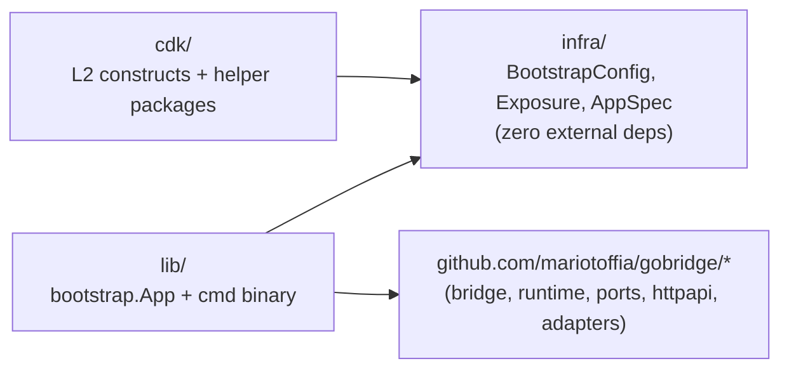
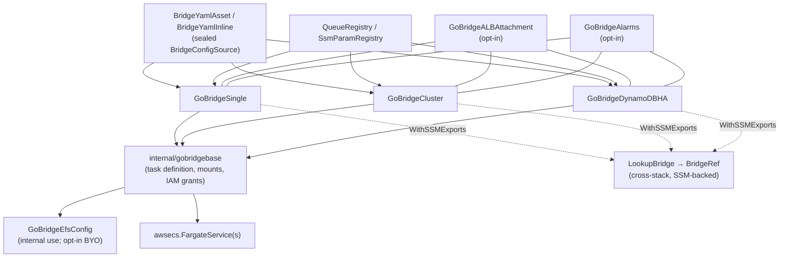
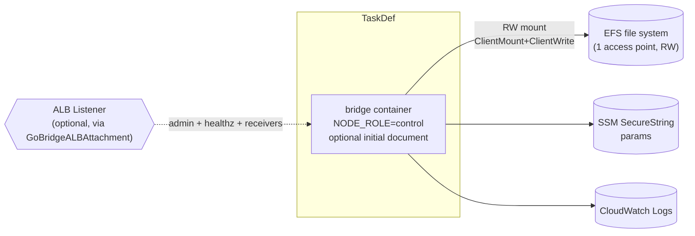
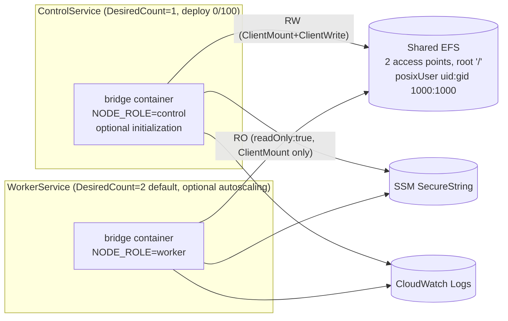

# aws-filebased-config — Architecture

## Overview

Internal architecture of the deployment profile: Go module layering, CDK construct composition, single vs cluster topology, the synth-time validation pipeline ("tier B"), and why peer discovery is EFS-mediated instead of Cloud Map. End-to-end AWS architecture (VPC, ALB) lives in [docs/aws-deployment/overview.md](../../docs/aws-deployment/overview.md), which maps to the topology, storage, image, construct, and IAM (JSON policy) pages beside it. The DDD mapping lives in [../../DDD.md](../../DDD.md) and the local glossary in [UBIQUITOUS.md](./UBIQUITOUS.md).

> Sections and table rows marked **(planned)** describe the target
> architecture of work in flight; each marker is removed when the behavior it
> describes lands. Unmarked text describes the code as it is.

The profile supports two **config sources** for the hot-reloadable bridge
config: `file` (YAML on EFS) and
`dynamodb` (a single CAS-versioned `current` item read by
`adapters/aws/config/dynamodb`). The bootstrap config selects the source; the
name "filebased" in the module path predates this generalization.

Design goals:

- Keep configuration reads, observations, and strict creation behind ports.
- Start the control plane independently of data-plane activation.
- Preserve existing target config and read-only worker authority.
- Build configured images without a separate configuration-distribution service.

## Module Topology

Three Go modules, with public modules following the common release train:



**Dependency rule.** `infra/` imports nothing outside the standard library — CDK consumers never pull in the runtime tree, and the runtime never imports CDK. `lib/model/BootstrapConfig` and `infra.BootstrapConfig` are intentional duplicates so each module can stand alone; equivalence is guarded by tests.

**Publication.** `infra` and `cdk` are release-train members.
Publication of a compatible `lib` module remains pending. Published copies
must carry no `replace` directives and must pin released sibling versions
before an external app can build without a repository checkout. See the
[release graph](../../RELEASE.md#canonical-release-graph).

`cdk/` ships six public L2 constructs plus four supporting packages. There is **no L3 wrapper** — consumers compose the L2s directly inside their own `awscdk.Stack`.

| Path | Role |
|------|------|
| `cdk/constructs/gobridgesingle/` | `GoBridgeSingle` facade. |
| `cdk/constructs/gobridgecluster/` | `GoBridgeCluster` independent filesystem scale-out facade. |
| `cdk/constructs/gobridgedynamodbha/` | `GoBridgeDynamoDBHA` coordinated active/warm-standby facade and `DynamoDBHAData`. |
| `cdk/constructs/` (`efs_config.go`) | `GoBridgeEfsConfig` shared EFS + access points. |
| `cdk/constructs/gobridgealbattachment/` | `GoBridgeALBAttachment` listener-rule wiring. |
| `cdk/constructs/gobridgealarms/` | `GoBridgeAlarms` opinionated CloudWatch bundle. |
| `cdk/gobridgecdk/` | Public facade: `BridgeYamlAsset`, `BridgeYamlInline`, sealed `BridgeConfigSource`, `LookupBridge`, `BridgeRef`. |
| `cdk/bridgecfg/` | Fluent builder for `*ports.BridgeConfig`. |
| `cdk/registry/` | `QueueRegistry`, `SsmParamRegistry` and their typed `Ref` accessors. |
| `cdk/ssmexports/` | Functional options (`IncludeARNs()`) for the cross-stack export contract. |
| `cdk/constructs/internal/{gobridgebase,grants,singleton,validation}/` | Private shared machinery — facades MUST NOT be bypassed. |

## Construct Composition

All three facades route through the same private base; the diagram is the same task-definition shape for Single, Cluster, and DynamoDB HA — only topology resources and service invariants differ.



`GoBridgeEfsConfig` is normally created and owned by the facade; consumers may pass an instance in to override KMS / throughput / removal policy / backup. `GoBridgeALBAttachment` and `GoBridgeAlarms` are independent opt-ins. Cross-stack consumption is via `gobridgecdk.LookupBridge` (returns a `*BridgeRef` exposing the same accessor surface as the producing constructs).

**EFS is conditional.** The facade provisions EFS only when
something needs a filesystem: the config source is `file`, or the parsed yaml
declares SQLite store paths. With the `dynamodb` config source and DynamoDB
stores, `GoBridgeDynamoDBHA` deploys with **no EFS resources at all** — the
config yaml was that topology's only remaining filesystem use.

## Runtime config sources

`Bootstrap.ConfigSource` selects the runtime configuration source; empty means
`file`. Single and DynamoDB HA support both sources. A DynamoDB source creates
one facade-owned config table with string `PK`/`SK`, on-demand billing,
point-in-time recovery, AWS-managed encryption and retention on deletion or
replacement. It has no TTL. The facade stamps its table-name token into a copy
of `Bootstrap.ConfigDynamoDB`; caller-owned settings are never mutated. All HA
task definitions, including static member slots, share this same config table,
separate from the lease, outbox, managed-subscription and rollout tables.

Control receives `GrantReadWriteData`; workers receive `GrantReadData`. Only
`watch_mode: streams` enables a `KEYS_ONLY` stream and `GrantStreamRead` for both
roles. An omitted watch mode is stamped as `poll`.

The control process may initialize an absent document through
`ports.ConfigInitializer.CreateIfAbsent`. The source uses `ports.Loader`;
there is no new core SDK dependency. Creation is atomic at version 1, ignores
the source version, and rereads the winner. Existing invalid or legacy documents
remain untouched. Version-zero CAS is not strict creation because it can adopt
a versionless row.

The initial document can be embedded in the binary. No separate S3 config
asset, download grant, or seeder container is used. Switching sources does not
migrate existing configuration. See the
[initialization contract](../../docs/aws-deployment/config-initialization.md).

Without a filesystem, `EfsConfig()` returns nil, task mounts and NFS ingress are
omitted, and no EFS or EFS-KMS grants are added. The ALB attachment omits the
optional `efs-id` SSM export, and the alarm bundle omits its EFS I/O alarm.
`LookupBridge` uses an optional `ValueFromLookup` to determine EFS presence;
`EfsID()` is nil before that lookup resolves or when the producer has no EFS.
The presence result is context-cached and must be refreshed after changing the
producer between filesystem-backed and EFS-free config.

| | `file` (default) | `dynamodb` |
|---|---|---|
| Backing store | YAML on EFS | One item, `PK = "config#"+bridge_id`, `SK = "current"`, monotonic `version` |
| Watch | EFS poll (fsnotify unreliable on NFS) | Strongly consistent poll (default) or DynamoDB Streams (`watch_mode: streams`) |
| Admin API writes | `parser.FileStore` guarded by the single-writer rule (control node only) | The loader itself — a `ports.ConditionalConfigStore`; control-only authority despite CAS capability |
| Topology limits | all | `filesystem_replicated` rejected (workers boot from the shared filesystem by definition) |

The profile always runs exactly one `config.Layer` (a base, never an
overlay): the admin config transaction API and the rollout candidate digest
both require a single writer identity for the effective config.

## Image source

`gobridgecdk` exposes a sealed `BridgeImageSource` (same pattern as
`BridgeConfigSource`). The required `Image` prop accepts only that sealed type;
constructs use its identical internal alias to avoid the lookup/ALB import cycle.

| Constructor | Behaviour |
|-------------|-----------|
| `ImageFromRegistry(ref)` | Digest-pinned registry reference — today's flow. |
| `ImageFromEcrRepository(repo, tag)` | Consumer-managed ECR. |
| `ImageFromGoBuild(props)` | `DockerImageAsset` running `go install <package>@<version>` against a compatible published module, with the facade's parsed config automatically embedded. No repository checkout. Nil `BuildTags` derives optional families through `DeriveBuildTags`. |

The profile binary's base families are aws, mqtt, native stores and http;
`gobridge_amqp091`, `gobridge_amqp10` and `gobridge_azure` are additive
compile-time families shared with the `cmd/gobridge` tag convention
(`PLUGIN.md`).

`ImageFromGoBuild` requires a published compatible lib-module version; it never
falls back to a branch or `latest`. The default package is
`github.com/mariotoffia/gobridge/deployment/aws-filebased-config/lib/cmd/gobridge-filebased`.
Optional family registration and publication of a compatible module are separate
prerequisites: deriving a tag does not register a decoder or factory. Until those
prerequisites are available, keep using a pinned registry image or consumer ECR
image. Custom commands can use explicit `BuildTags` (including an empty slice)
to bypass derivation, but must implement the profile's bootstrap and health check.
When config is embedded, they must also support `-initial-config-digest`.

The generated Dockerfile stamps `main.version` with the module version and
`main.gitSHA` with `module@<version>`, identifying the published source without
claiming to know its Git commit. Digest-pinned builder/runtime bases and a nonroot
user match the root Dockerfile. The temporary context is always staged into the
cloud assembly before removal, even if app-wide asset staging is disabled.
It carries `initial-config-<hash>.goenv` for native Go linker settings, avoiding
operating-system argument limits without unsupported `@responsefile` syntax.
The command decodes `main.initialConfigBase64`. The generated build verifies
`/gobridge-filebased -initial-config-digest` against the staged document's SHA-256
hash. Both entry points handle the probe before runtime or network startup,
printing the hash rather than the document. An older command that ignores the
stamp or lacks the probe cannot silently produce a passing build.
Registry and ECR images are
unchanged by CDK; consumers build their own initial document or supply the
target separately. `BridgeConfig` still declares validation and grants.
`Platform` supports `linux/amd64` and `linux/arm64`; the same selection configures
Docker and the Fargate task. Both builder and runtime overrides
must support that platform. Registry/ECR constructors target
`linux/amd64`.

## Single vs Cluster

### `GoBridgeSingle`



One Fargate service, `DesiredCount=1`, deployment policy `MinHealthyPercent=0 / MaxHealthyPercent=100` (full drain before replace — eliminates concurrent EFS RW writers across rolling deploys). The control role gets EFS `ClientMount`+`ClientWrite`; SSM/Logs grants are derived from the parsed yaml.

### `GoBridgeCluster`



Both access points share the same root path and the same posix user (uid/gid `1000:1000`); the **RW/RO split is enforced at IAM and at the ECS volume level (`readOnly: true`)**, not by POSIX ownership. The control role and worker role are split for EFS grants only — `ClientMount`+`ClientWrite` for control, `ClientMount` only for workers; SQS, SSM and Logs grants are identical between roles since both task families process messages.

`DesiredCount=1` preserves the single file-config writer and is not exposed as a
prop. Workers default to two and may opt in to CPU target-tracking autoscaling
via `AutoScalingProps{Min, Max, TargetCPU}`. Only control can initialize absent
config; workers read it through the normal loader and observer.

### `GoBridgeDynamoDBHA`

`GoBridgeDynamoDBHA` is a separate `dynamodb_coordinated_ha` topology, not a
mode switch inside `GoBridgeCluster`. It reuses two `gobridgebase.New` calls for
one config-control task definition and one worker task definition. The control
service desired count is one and the worker service minimum is two. Every task
runs the clustered runtime and can own a lease; node role controls config-write authority through EFS or config-table grants. Selected private subnets span at least two Availability
Zones. Both services use a 0/100 replacement policy with AZ rebalancing
disabled — the control service to prevent overlapping config writers, the worker
service to prevent an incompatible revision running as a second cohort — and the
worker service depends on the control service. Missing config keeps workers idle;
no container-dependency gate is needed for configuration.

The facade owns exactly three on-demand, PITR-enabled, retained tables through
`DynamoDBHAData`: `PK`-only lease with TTL omitted, `PK`/`SK` outbox with
`ExpiryIndex`, `RecordIDIndex`, and `ClaimIndex`, and `storage_identity`-keyed
managed-subscription history. It validates names from the parsed store configs,
then runs the builder admission path without AWS calls before creating
resources. The facade stamps the canonical admitted-config fingerprint and exact
table identities into bootstrap; every process checks its selected-source config against
those expectations before planning stores or transports. Static endpoints and per-replica Exclusive MQTT client-ID suffixes
are rejected; the bootstrap composition root registers `EcsEndpointResolver`
for clustered configs.

The generation-zero baseline uses `bridge.DeploymentBaselineContentDigest`
for both file and DynamoDB sources. It normalizes only the top-level version
for recognition, since initialization assigns target version 1 independently
of the embedded version. The committed artifact retains the actual stored
version and full `bridge.ConfigArtifactDigest`.

`GoBridgeAlarms` reads this facade to add warm-standby, DynamoDB, existing
runtime lease/outbox/DLQ, and external `FailureToFullDuration` alarms. The
failure duration is emitted by the credentialed external probe, not runtime.
Missing samples are non-breaching, while the release probe immediately queries
CloudWatch for its exact sample.

## Tier B: parse, validate, derive

Tier B turns a `BridgeConfigSource` into IAM grants and CDK errors. It catches
known shape and reference errors at synth; runtime discovery still verifies
the actual AWS resources.

### Phase 1 — Constructor (fast-fail)

Errors thrown immediately at the construct call site. Implemented in `cdk/constructs/internal/validation/`.

1. yaml parses (`config.ParseFile`).
2. Stage-1 validators (`config/validate.go`).
3. Filesystem-topology constraints from `validateFilesystemProfile`: no `delivery_mode: shared_outbox`, no `route.session` lease.
4. Typed plugin configuration validation; literal credentials are permitted.
5. SQLite store paths must sit under the EFS mount root.
6. Cluster only: workers must not reference RW-only paths.

Both `BridgeYamlAsset(path)` and `BridgeYamlInline(cfg)` use the same typed
parse and validation path. The resulting logical config is the input to
optional Go-build embedding, not a separate runtime S3 asset.

The image builder also calls `bridgecfg.ValidateEmbeddedSQSConfig`. It rejects
all SQS queue URLs, including literals, and requires receiver/sender queue
references on their own options. SQS binding addresses must be physical names
or `sqs.QueueAddress` (`sqs:queue`). A document-wide check rejects unresolved
CDK tokens. Resolved target URLs remain runtime-only.

`ScanForPlaintextSecrets` is an explicit utility. Neither `Builder.Build` nor
Phase 1 runs it; literal credentials are permitted.

### Phase 2 — `construct.validate()` (aggregated)

Errors are collected via `Annotations.of(scope).addError(...)` so a single `cdk synth` reports **every** missing reference, not iteration-by-iteration:

1. Each SQS name/tag reference resolves through `QueueRegistry.ResolveQueue`;
   tag selection requires an explicit `BindQueueTags(name, tags, prefix)`
   declaration on a registered handle. Ambiguous mappings fail synthesis.
2. Each SSM URI must have an `SsmParamRegistry` entry.
3. Each `bridge.cluster.endpoints` value parses as a URL.

`QueueRegistry` and `SsmParamRegistry` are **conditionally required** props — tier B inspects yaml first; the prop becomes required only if the parsed config uses adapter types that need it. Missing-when-needed surfaces as a typed synth error, never a nil panic.

### Phase 3 — Grant derivation

Per-adapter grant functions live under `cdk/constructs/internal/grants/`.
The shared base calls `GrantSQSConfig`, using the same `ResolveQueue` path as
validation for receiver, sender, and binding references. It retains exact
queue handles for message permissions and deployment dependencies:

| Adapter family | Grant |
|----------------|-------|
| SQS receiver | `ReceiveMessage`, `DeleteMessage`, `GetQueueAttributes`, `GetQueueUrl`; `ChangeMessageVisibility` when `auto_extend: true`. |
| SQS sender | `queue.GrantSendMessages(role)`. |
| SQS tag selection | Additional native `ListQueues` and `ListQueueTags` reads only in tag mode; queue handles still scope message operations and dependencies. |
| SSM credential | `param.GrantRead(role)` (covers `ssm:GetParameter` + `kms:Decrypt` for AWS-managed keys). |
| CloudWatch Logs | `logGroup.GrantWrite(role)`. |
| EFS | Per role: control `ClientMount`+`ClientWrite`; worker `ClientMount` only. |
| EFS CMK | Auto-granted when `EfsKmsKey` prop is set. |
| Config table | Control `GrantReadWriteData`; worker `GrantReadData`; both `GrantStreamRead` only when `watch_mode: streams`. No config-asset read grant. |

Adding a new plugin requires a matching pair of files (`bridgecfg/<kind>.go` and `internal/grants/<kind>.go`) — enforced by the CI check against `*ports.Registry`.

## Endpoint discovery

The profile does not provision Cloud Map. `EcsEndpointResolver` reads each
task's endpoint through ECS metadata. Coordinated HA records holder endpoints
in DynamoDB leases. Filesystem-replicated scale-out does not gain a distributed
lease store by sharing EFS; it rejects lease-managed routes and shared outboxes.

## Singleton constraint

**One `GoBridgeSingle`, `GoBridgeCluster`, or `GoBridgeDynamoDBHA` per stack tree.**
Separate stacks may host separate bridges.

| Layer | Enforcement |
|-------|-------------|
| Synth | Scope scan (`cdk/constructs/internal/singleton`) errors when more than one facade is found in the same Stack tree. |
| Operator | Cross-account / cross-stack collisions are operator responsibility; no custom resource enforcement. |
| Docs | Prominent warning in [README.md](./README.md). |

The bridge identity is taken from the deployed yaml's `bridge.name` (validated against `^[a-zA-Z0-9][a-zA-Z0-9_-]{0,62}$` in Phase 1). It is reused as the log group middle segment, alarm name prefix and EFS construct ID. **There is no `Name` prop** on `SingleProps` / `ClusterProps` — single source of truth eliminates the deploy-vs-config drift class.

## Source resolution & cross-stack lookup

`gobridgecdk` exposes a sealed `BridgeConfigSource` with two constructors:

| Constructor | Behaviour |
|-------------|-----------|
| `BridgeYamlAsset(path)` | Reads and parses local config for validation, grants, and optional Go-build embedding; no separate S3 config asset. |
| `BridgeYamlInline(*ports.BridgeConfig)` | Supplies typed config through the same validation and optional embedding path. |

For cross-stack consumption, the producer publishes typed accessors via SSM Parameter Store (soft-coupled — no `Fn.importValue`):

```go
attachment.WithSSMExports("/bridges/prod", ssmexports.IncludeARNs())
```

The consumer resolves them with `gobridgecdk.LookupBridge`, which returns a `*BridgeRef` exposing `AdminURL()`, `HealthzURL()`, `PublicDnsName()`, optional `AlbARN()` / `ClusterARN()` / `EfsID()`, and a `ManifestVersion()` sentinel that fails synth fast on a producer/consumer schema mismatch. Implementation is `awsssm.StringParameter_FromStringParameterName` (deploy-time CDK token); the manifest sentinel uses `awsssm.StringParameter_ValueFromLookup` so it materialises as a real synth-time string in `cdk.context.json`.

## Runtime Library (`lib/bootstrap`)

`lib/bootstrap.NewApp(cfg, opts...)` loads static `BootstrapConfig` and wires
one selected config source. File updates retain the single-control-writer
guard; DynamoDB updates use CAS. Both enforce read-only worker configuration
authority. Production never creates a missing backend table.

With valid bootstrap, admin and monitor stay live while the data plane awaits
valid config. The optional initial source uses `ports.Loader`; strict target
creation uses `ports.ConfigInitializer`. Existing watcher paths report
`ConfigPresent`, `ConfigMissing`, and `ConfigReadError` through
`ports.ConfigObserver`. No additional polling service is introduced.

`config.Initialize` validates the target or creates an absent document using
an initial `ports.Loader`, then reloads and admits the winner. Its admission
callback receives an isolated snapshot. Mutable custom plugin configs require
`ports.FreezableConfig`; deeply immutable scalar value configs do not.
Authorization and first-activation tracking remain composition-root concerns.

`Manager.Observe` supports one authoritative `config.Layer`, discovering the
observer capability on its watcher or loader. It rejects overlays; the existing
config-only `Watch` API remains unchanged. The host calls `Manager.NotifyIdle`
only after quiescence, clearing confirmed running state without discarding a
newer desired config. Neither method creates a second polling service.

After first activation, confirmed absence stops new intake. Standalone operation
drains, releases resources, and goes idle; a later valid document builds a new
runtime. Clustered deletion or uncertain teardown signals process exit and
replacement, never continued processing or live cluster idling.
Read errors retain the last successful runtime as degraded.
First activation is not readiness: a standby can activate without reaching Full.
Returning to idle does not rearm initialization in that process. Watch ordering
must preserve deletion and subsequent recreation, including a reset version.

Reload uses overlap by default and prepare/commit for exclusive identities.
Reference cells keep the control-plane servers independent of runtime swaps.
Clustered updates still follow the barrier or whole-cohort replacement rules.

Authenticated `POST /api/v1/admin/config` accepts a complete YAML or JSON
document through the shared typed decoder and strict target creation. It
rereads the winner and reports conflict, committed-not-applied, or uncertain
write outcomes without compensating deletion. See
[initial creation](../../docs/aws-deployment/config-initialization.md#operator-creation-and-rollout).

| Project context | Touched here |
|-----------------|--------------|
| `bridge` | `lib/bootstrap` calls `bridge.NewBuilder`, registers transports/stores, drives `Build`/`Prepare`/`Complete`. |
| `runtime` | `bootstrap.App` owns the active `*runtime.Runtime`; swap mode mirrors runtime semantics. |
| `config` | `Initialize` handles strict creation; `Manager.Observe` reports source state and `NotifyIdle` acknowledges completed runtime quiescence. |
| `httpapi` | Config transactions persist through `parser.FileStore` or the shared DynamoDB loader; runtime apply and rollout coordination use the same paths for either source. |
| `ports` | `ports.CapExclusiveIdentity` drives swap-mode selection. |

See [../../DDD.md](../../DDD.md) for the project model and
[UBIQUITOUS.md](./UBIQUITOUS.md) for profile terms. The
[initialization contract](../../docs/aws-deployment/config-initialization.md)
covers creation races, operator creation, artifact visibility, and SQS selection.

## Failure Modes & Guards

| Concern | Guard |
|---------|-------|
| Production with custom SSM endpoint | `Validate()` rejects `SSMEndpoint != "" && !DevMode`. |
| Memory exhaustion on bootstrap file | 1 MiB file size cap (`maxBootstrapFileSize`). |
| Concurrent reload races | `App.mu` serializes `applyLogicalConfig`. |
| Reload failure | `recoverPrevious` rebuilds last-good logical config; admin/monitor stay up. |
| Stale runtime on watch shutdown | `Stop` waits for `watchWg` before tearing down dependencies. |
| Bad new runtime in prepare/commit | Old runtime stopped *before* commit; `recoverPrevious` re-attempts. |
| Concurrent EFS RW writers across deploys | Control deploy policy `MinHealthyPercent=0 / MaxHealthyPercent=100`. |
| Worker writes via admin API | Defence in depth: EFS mount `readOnly:true` AND ALB rule routes admin paths to control TG only. |
| Multiple facades in same stack | `cdk/constructs/internal/singleton` synth-time scope scan. |
| Missing `QueueRegistry` / `SsmParamRegistry` entry | Tier B Phase 2 aggregates via `Annotations.of(scope).addError(...)` — every missing reference reported in one synth, with typed remediation message. |
| Literal credential in embedded config | Allowed; artifact readers can recover it. Base64 is not secrecy. |
| ALB priority collision | Attachment ctor errors when consumer rule already uses `[BasePriority, BasePriority+99]`. |
| Existing target differs from embedded config | Never overwrite during initialization; normal validation and HA fingerprint checks still apply. |
| Concurrent admin writes, `dynamodb` source | `SaveIfVersion` conditional put → `shared.ErrVersionMismatch`; no lost update, no single-writer assumption. |
| Oversized config item | Adapter pre-checks 390 KiB before `PutItem` — descriptive error instead of an opaque `ValidationException`. |

## Extension Points

- **Custom credential store**: `WithCredentialStore` on `App`.
- **Custom SSM resolver**: `WithParameterResolver` (e.g. test fixtures, Vault wrapper).
- **Custom CDK wiring**: compose `BridgeYamlInline(cfg)` over a hand-built `*ports.BridgeConfig` from `cdk/bridgecfg/`. The facades (`GoBridgeSingle` / `GoBridgeCluster` / `GoBridgeDynamoDBHA`) are the supported integration boundary; **bypassing them by composing `cdk/constructs/internal/gobridgebase` directly is not supported** — the package is internal precisely so the singleton / tier-B / mount-policy invariants stay enforceable.
- **Custom transport/store**: not exposed via `App` — build a sibling deployment profile. **(planned)** The AMQP 0-9-1, AMQP 1.0 and Azure Service Bus families become compile-time opt-ins via the shared `gobridge_<family>` build tags; custom plugins still need their own composition.
- **Custom image pipeline**: pass `ImageFromRegistry` / `ImageFromEcrRepository` to keep building the image yourself; `ImageFromGoBuild` is the zero-checkout build path once a compatible module is published.

## Related Docs

| Doc | Scope |
|-----|-------|
| [README.md](./README.md) | Construct surface, quickstarts, secrets policy, what-it-provisions. |
| [UBIQUITOUS.md](./UBIQUITOUS.md) | Profile-local glossary. |
| [../../DDD.md](../../DDD.md) | Project-wide DDD model. |
| [docs/aws-deployment/overview.md](../../docs/aws-deployment/overview.md) | End-to-end AWS architecture (VPC, ALB), and the page map to the topology, storage, image, construct, and IAM pages. |
