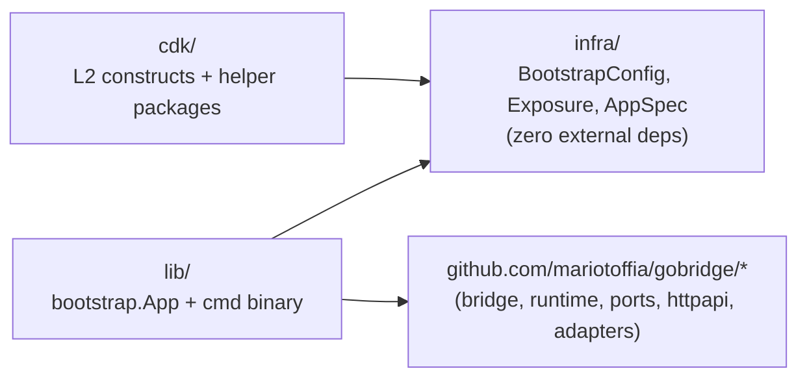
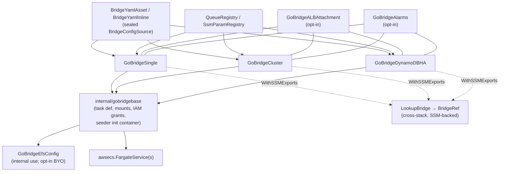
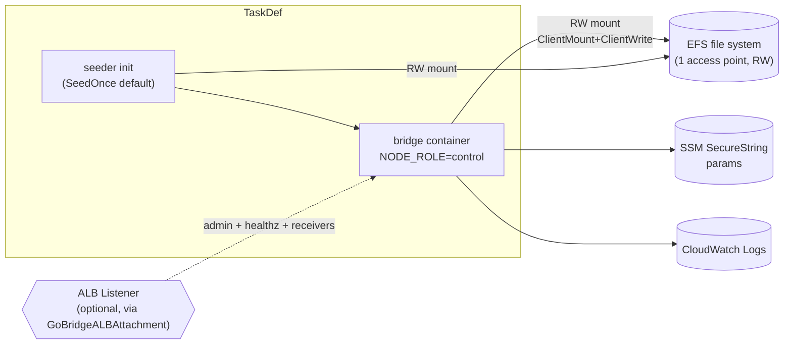
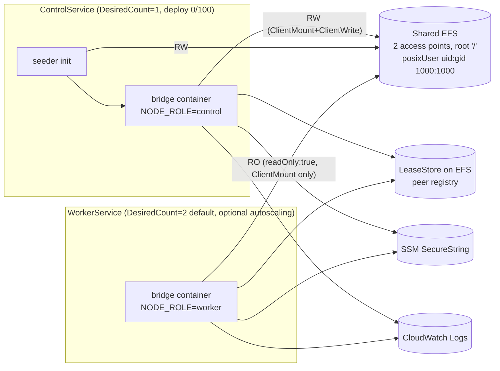

# aws-filebased-config — Architecture

Internal architecture of the deployment profile: Go module layering, CDK construct composition, single vs cluster topology, the synth-time validation pipeline ("tier B"), and why peer discovery is EFS-mediated instead of Cloud Map. End-to-end AWS architecture (VPC, ALB) lives in [docs/aws-deployment/overview.md](../../docs/aws-deployment/overview.md), which maps to the topology, storage, image, construct, and IAM (JSON policy) pages beside it. The DDD mapping lives in [../../DDD.md](../../DDD.md) and the local glossary in [UBIQUITOUS.md](./UBIQUITOUS.md).

> Sections and table rows marked **(planned)** describe the target
> architecture of work in flight; each marker is removed when the behavior it
> describes lands. Unmarked text describes the code as it is.

The profile supports two **config sources** for the hot-reloadable bridge
config **(planned)**: `file` (YAML on EFS — today's only source) and
`dynamodb` (a single CAS-versioned `current` item read by
`adapters/aws/config/dynamodb`). The bootstrap config selects the source; the
name "filebased" in the module path predates this generalization.

## Module Topology

Three Go modules, separately versionable:



**Dependency rule.** `infra/` imports nothing outside the standard library — CDK consumers never pull in the runtime tree, and the runtime never imports CDK. `lib/model/BootstrapConfig` and `infra.BootstrapConfig` are intentional duplicates so each module can stand alone; equivalence is guarded by tests.

**Published modules (planned).** All three modules join the release train
(`scripts/release/modules.json`) and are tagged `<module-dir>/vX.Y.Z` like
every published module. Published copies carry no `replace` directives and
pin real sibling versions, so an external Go CDK app consumes them with plain
`go get` — no repository checkout. The `deployment/` internal-only rule in
`RELEASE.md` gains this profile as its explicit exception.

`cdk/` ships six public L2 constructs plus four supporting packages. There is **no L3 wrapper** — consumers compose the L2s directly inside their own `awscdk.Stack`.

| Path | Role |
|------|------|
| `cdk/constructs/gobridgesingle/` | `GoBridgeSingle` facade. |
| `cdk/constructs/gobridgecluster/` | `GoBridgeCluster` independent filesystem scale-out facade. |
| `cdk/constructs/gobridgedynamodbha/` | `GoBridgeDynamoDBHA` coordinated active/warm-standby facade and `DynamoDBHAData`. |
| `cdk/constructs/` (`efs_config.go`) | `GoBridgeEfsConfig` shared EFS + access points. |
| `cdk/constructs/gobridgealbattachment/` | `GoBridgeALBAttachment` listener-rule wiring. |
| `cdk/constructs/gobridgealarms/` | `GoBridgeAlarms` opinionated CloudWatch bundle. |
| `cdk/gobridgecdk/` | Public facade: `BridgeYamlAsset`, `BridgeYamlInline`, sealed `BridgeConfigSource`, `LookupBridge`, `BridgeRef`. |
| `cdk/bridgecfg/` | Fluent builder for `*ports.BridgeConfig` + `ScanForPlaintextSecrets`. |
| `cdk/registry/` | `QueueRegistry`, `SsmParamRegistry` and their typed `Ref` accessors. |
| `cdk/ssmexports/` | Functional options (`IncludeARNs()`) for the cross-stack export contract. |
| `cdk/constructs/internal/{gobridgebase,grants,seeder,singleton,validation}/` | Private shared machinery — facades MUST NOT be bypassed. |

## Construct Composition

All three facades route through the same private base; the diagram is the same task-definition shape for Single, Cluster, and DynamoDB HA — only topology resources and service invariants differ.



`GoBridgeEfsConfig` is normally created and owned by the facade; consumers may pass an instance in to override KMS / throughput / removal policy / backup. `GoBridgeALBAttachment` and `GoBridgeAlarms` are independent opt-ins. Cross-stack consumption is via `gobridgecdk.LookupBridge` (returns a `*BridgeRef` exposing the same accessor surface as the producing constructs).

**EFS is conditional (planned).** The facade provisions EFS only when
something needs a filesystem: the config source is `file`, or the parsed yaml
declares SQLite store paths. With the `dynamodb` config source and DynamoDB
stores, `GoBridgeDynamoDBHA` deploys with **no EFS resources at all** — the
config yaml was that topology's only remaining filesystem use.

## Config sources (planned)

The consumer's `Bootstrap.ConfigSource` field selects where the bridge config
lives; the facade derives everything else from it.

| | `file` (default) | `dynamodb` |
|---|---|---|
| Backing store | YAML on EFS | One `current` item, `PK = "config#"+bridge_id`, monotonic `version` |
| Provisioned by | `GoBridgeEfsConfig` | Facade-owned DynamoDB table (on-demand, PITR, retained); table name stamped into bootstrap like `ContainerMemoryBytes` |
| Watch | EFS poll (fsnotify unreliable on NFS) | Strongly consistent poll (default) or DynamoDB Streams (`watch_mode: streams`) |
| Seeder | Copies the synth-validated asset to EFS | Conditional `PutItem` of the synth-marshalled JSON; same `SeedOnce` / `Overwrite` / `AbortDeploy` drift modes |
| Admin API writes | `parser.FileStore` guarded by the single-writer rule (control node only) | The loader itself — a `ports.ConditionalConfigStore`, CAS-safe for any writer |
| IAM | EFS `ClientMount`/`ClientWrite` split | Control `GrantReadWriteData`, workers `GrantReadData`, both `GrantStreamRead` in streams mode |
| Topology limits | all | `filesystem_replicated` rejected (workers boot from the shared filesystem by definition) |

The profile always runs exactly one `config.Layer` (a base, never an
overlay): the admin config transaction API and the rollout candidate digest
both require a single writer identity for the effective config.

## Image source (planned)

`gobridgecdk` exposes a sealed `BridgeImageSource` (same pattern as
`BridgeConfigSource`), replacing the raw required `Image awsecs.ContainerImage`
prop:

| Constructor | Behaviour |
|-------------|-----------|
| `ImageFromRegistry(ref)` | Digest-pinned registry reference — today's flow. |
| `ImageFromEcrRepository(repo, tag)` | Consumer-managed ECR. |
| `ImageFromGoBuild(props)` | `DockerImageAsset` over an embedded two-stage Dockerfile that runs `go install <package>@<version>` against the published lib module — no repository checkout. `BuildTags` selects optional plugin families; left nil, the facade derives them from the parsed yaml (`DeriveBuildTags`). |

The profile binary's base families are aws, mqtt, native stores and http;
`gobridge_amqp091`, `gobridge_amqp10` and `gobridge_azure` are additive
compile-time families shared with the `cmd/gobridge` tag convention
(`PLUGIN.md`).

## Single vs Cluster

### `GoBridgeSingle`



One Fargate service, `DesiredCount=1`, deployment policy `MinHealthyPercent=0 / MaxHealthyPercent=100` (full drain before replace — eliminates concurrent EFS RW writers across rolling deploys). The control role gets EFS `ClientMount`+`ClientWrite`; SSM/Logs grants are derived from the parsed yaml.

### `GoBridgeCluster`



Both access points share the same root path and the same posix user (uid/gid `1000:1000`); the **RW/RO split is enforced at IAM and at the ECS volume level (`readOnly: true`)**, not by POSIX ownership. The control role and worker role are split for EFS grants only — `ClientMount`+`ClientWrite` for control, `ClientMount` only for workers; SQS, SSM and Logs grants are identical between roles since both task families process messages.

`DesiredCount=1` for the control service is a runtime invariant (single LeaseStore writer semantics) and is **not** exposed as a prop. Workers default to two and may opt in to CPU target-tracking autoscaling via `AutoScalingProps{Min, Max, TargetCPU}`. The seeder init container runs only in the control task; workers boot from EFS and their readiness blocks until the yaml is present.

### `GoBridgeDynamoDBHA`

`GoBridgeDynamoDBHA` is a separate `dynamodb_coordinated_ha` topology, not a
mode switch inside `GoBridgeCluster`. It reuses two `gobridgebase.New` calls for
one config-control task definition and one worker task definition. The control
service desired count is one and the worker service minimum is two. Every task
runs the clustered runtime and can own a lease; node role controls only EFS
config-write authority. Selected private subnets span at least two Availability
Zones. Both services use a 0/100 replacement policy with AZ rebalancing
disabled — the control service to prevent overlapping config writers, the worker
service to prevent an incompatible revision running as a second cohort — and the
worker service depends on the control service so the config seeder runs first.

The facade owns exactly three on-demand, PITR-enabled, retained tables through
`DynamoDBHAData`: `PK`-only lease with TTL omitted, `PK`/`SK` outbox with
`ExpiryIndex`, `RecordIDIndex`, and `ClaimIndex`, and `storage_identity`-keyed
managed-subscription history. It validates names from the parsed store configs,
then runs the Task 9 builder admission path source-safely before creating
resources. The facade stamps the canonical admitted-config fingerprint and exact
table identities into bootstrap; every process checks its EFS config against
those expectations before planning stores or transports. Static endpoints and per-replica Exclusive MQTT client-ID suffixes
are rejected; the bootstrap composition root registers `EcsEndpointResolver`
for clustered configs.

`GoBridgeAlarms` reads this facade to add warm-standby, DynamoDB, existing
runtime lease/outbox/DLQ, and external `FailureToFullDuration` alarms. The
failure duration is emitted by the credentialed external probe, not runtime.
Missing samples are non-breaching, while the release probe immediately queries
CloudWatch for its exact sample.

## Tier B: parse, validate, derive

Tier B is the synth-time pipeline that turns a `BridgeConfigSource` into IAM grants and CDK errors. It runs in three phases; central design promise: **misconfigurations fail at `cdk synth`, not at runtime.**

### Phase 1 — Constructor (fast-fail)

Errors thrown immediately at the construct call site. Implemented in `cdk/constructs/internal/validation/`.

1. yaml parses (`config.ParseFile`).
2. Stage-1 validators (`config/validate.go`).
3. Filesystem-topology constraints from `validateFilesystemProfile`: no `delivery_mode: shared_outbox`, no `route.session` lease.
4. Plaintext credential scan (`cdk/bridgecfg/secrets.go::ScanForPlaintextSecrets`).
5. SQLite store paths must sit under the EFS mount root.
6. Cluster only: workers must not reference RW-only paths.

Both `BridgeYamlAsset(path)` and `BridgeYamlInline(cfg)` go through the **same** Phase 1 walker — the inline path marshals via `config.MarshalYAML` and re-parses via `config.ParseFile` so what was validated is what gets seeded.

### Phase 2 — `construct.validate()` (aggregated)

Errors are collected via `Annotations.of(scope).addError(...)` so a single `cdk synth` reports **every** missing reference, not iteration-by-iteration:

1. Each SQS queue name in yaml must have a `QueueRegistry` entry (typed remediation message: `registry.AddQueue("X", queue)`).
2. Each SSM URI must have an `SsmParamRegistry` entry.
3. Each `bridge.cluster.endpoints` value parses as a URL.

`QueueRegistry` and `SsmParamRegistry` are **conditionally required** props — tier B inspects yaml first; the prop becomes required only if the parsed config uses adapter types that need it. Missing-when-needed surfaces as a typed synth error, never a nil panic.

### Phase 3 — Grant derivation

Per-adapter grant functions live one-file-per-kind under `cdk/constructs/internal/grants/`. Tier B walks the parsed yaml and emits IAM via CDK's typed grant methods (no manual ARN construction):

| Adapter family | Grant |
|----------------|-------|
| SQS receiver | `queue.GrantConsumeMessages(role)` always; `queue.Grant(role, "sqs:ChangeMessageVisibility")` additionally when `auto_extend: true`. |
| SQS sender | `queue.GrantSendMessages(role)`. |
| SSM credential | `param.GrantRead(role)` (covers `ssm:GetParameter` + `kms:Decrypt` for AWS-managed keys). |
| CloudWatch Logs | `logGroup.GrantWrite(role)`. |
| EFS | Per role: control `ClientMount`+`ClientWrite`; worker `ClientMount` only. |
| EFS CMK | Auto-granted when `EfsKmsKey` prop is set. |
| Config table **(planned)** | Control `GrantReadWriteData`; worker `GrantReadData`; both `GrantStreamRead` when `watch_mode: streams`; seeder RW + asset read. |

Adding a new plugin requires a matching pair of files (`bridgecfg/<kind>.go` and `internal/grants/<kind>.go`) — enforced by the CI check against `*ports.Registry`.

## No Cloud Map — LeaseStore peer discovery

`GoBridgeCluster` deliberately does not provision a Cloud Map namespace. Peer discovery is EFS-mediated through the LeaseStore.

- Each task self-detects its reachable address via `EcsEndpointResolver` (`adapters/aws/cluster/ecs/resolver.go`), which queries the ECS task metadata endpoint.
- The resolved endpoints are passed to the runtime via `runtime.WithClusterEndpoints(...)`; the call site lives in `bridge/builder_prepare.go` (`Builder.prepare → rtOpts = append(rtOpts, runtime.WithClusterEndpoints(endpoints))`, invoked through `Builder.Build` or `Builder.Plan`).
- The runtime registers itself in the LeaseStore on EFS; siblings discover the live set by reading the same store.

**Why not Cloud Map.**

- One fewer AWS service to permission, observe and pay for; EFS is already required for hot-reloadable yaml and SQLite outbox/lease state.
- Discovery is a property of the membership store, not DNS — no "DNS TTL vs reality" gap, no SRV record plumbing, no `servicediscovery:*` IAM.
- Workers and control read the same store they already mount; nothing new joins the trust boundary.

**Trade-off.** Peer-discovery latency is bounded by the LeaseStore TTL / poll interval, not by DNS TTL. Acceptable for this profile because: single-region / single-account is a non-goal-of-multi-region scope (see Singleton constraint), membership churn is low (deploys are gated by `MinHealthyPercent=0`), and the LeaseStore is on EFS which is already tail-latency-bounded by the workload itself.

## Singleton constraint

**One `GoBridgeSingle`, `GoBridgeCluster`, OR `GoBridgeDynamoDBHA` per AWS account.** Multiple instances in the same account are forbidden.

| Layer | Enforcement |
|-------|-------------|
| Synth | Scope scan (`cdk/constructs/internal/singleton`) errors when more than one facade is found in the same Stack tree. |
| Operator | Cross-account / cross-stack collisions are operator responsibility; no custom resource enforcement. |
| Docs | Prominent warning in [README.md](./README.md). |

The bridge identity is taken from the deployed yaml's `bridge.name` (validated against `^[a-zA-Z0-9][a-zA-Z0-9_-]{0,62}$` in Phase 1). It is reused as the log group middle segment, alarm name prefix and EFS construct ID. **There is no `Name` prop** on `SingleProps` / `ClusterProps` — single source of truth eliminates the deploy-vs-config drift class.

## Source resolution & cross-stack lookup

`gobridgecdk` exposes a sealed `BridgeConfigSource` with two constructors:

| Constructor | Behaviour |
|-------------|-----------|
| `BridgeYamlAsset(path)` | `s3assets.NewAsset` reads the file for upload; tier B parses the same file from disk. Single synth pass, no drift concern. |
| `BridgeYamlInline(*ports.BridgeConfig)` | Marshals via `config.MarshalYAML`, builds an asset from the bytes, re-parses via `config.ParseFile` so tier B walks the same structure that gets seeded. |

For cross-stack consumption, the producer publishes typed accessors via SSM Parameter Store (soft-coupled — no `Fn.importValue`):

```go
attachment.WithSSMExports("/bridges/prod", ssmexports.IncludeARNs())
```

The consumer resolves them with `gobridgecdk.LookupBridge`, which returns a `*BridgeRef` exposing `AdminURL()`, `HealthzURL()`, `PublicDnsName()`, optional `AlbARN()` / `ClusterARN()` / `EfsID()`, and a `ManifestVersion()` sentinel that fails synth fast on a producer/consumer schema mismatch. Implementation is `awsssm.StringParameter_FromStringParameterName` (deploy-time CDK token); the manifest sentinel uses `awsssm.StringParameter_ValueFromLookup` so it materialises as a real synth-time string in `cdk.context.json`.

## Runtime Library (`lib/bootstrap`)

`lib/bootstrap.NewApp(cfg, opts...)` loads `BootstrapConfig` from env (`GOBRIDGE_FILEBASED_BOOTSTRAP_JSON` or `…_FILE`, max 1 MiB), watches the bootstrap-selected config source, swaps the active `*runtime.Runtime` without restart, resolves `pms://` SSM secrets and starts the admin / monitor / transport HTTP servers. **(planned)** Source selection lives behind one seam — `(*App).newConfigSource` returns the `config.Layer`, the `ports.ConfigStore` for the admin API, and the single-writer posture: `file` polls `ConfigFilePath` on EFS with the control-node-only write guard; `dynamodb` uses the `adapters/aws/config/dynamodb` loader as Loader, Watcher **and** `ports.ConditionalConfigStore`, so CAS replaces the single-writer guard. Start-empty triggers on `shared.ErrNotFound` from any source, not only a missing file. Reload uses `swapModeOverlap` by default; `swapModePrepareCommit` whenever any transport advertises `ports.CapExclusiveIdentity`. Reference cells (`bridgeConfigRef`, `runtimeRef`, `apiKeysRef`, `transportHandlerRef`) decouple HTTP servers from reload mechanics. Profile guard `validateFilesystemProfile` rejects `route.delivery_mode = shared_outbox` and `route.session != nil`.

| Project context | Touched here |
|-----------------|--------------|
| `bridge` | `lib/bootstrap` calls `bridge.NewBuilder`, registers transports/stores, drives `Build`/`Prepare`/`Complete`. |
| `runtime` | `bootstrap.App` owns the active `*runtime.Runtime`; swap mode mirrors runtime semantics. |
| `config` | `config.Manager` + file `Loader/Watcher` produce `*ports.BridgeConfig`. |
| `httpapi` | Mounted with `ConfigStore = config.FileStore{Path}` so PUTs persist back to EFS. |
| `ports` | `ports.CapExclusiveIdentity` drives swap-mode selection. |

See [../../DDD.md](../../DDD.md) for the project-level model and [UBIQUITOUS.md](./UBIQUITOUS.md) for profile-local terminology (`Bootstrap config`, `Logical vs Applied state`, `Topology`, `NodeRole`, `Swap mode`, `Parameter reference`, plus the new tier-B terms `BridgeConfigSource`, `BridgeRef`, `LookupBridge`, `QueueRegistry`, `SsmParamRegistry`, `OnConfigDrift`).

## Failure Modes & Guards

| Concern | Guard |
|---------|-------|
| Production with custom SSM endpoint | `Validate()` rejects `SSMEndpoint != "" && !DevMode`. |
| Memory exhaustion on bootstrap file | 1 MiB file size cap (`maxBootstrapFileSize`). |
| Concurrent reload races | `App.mu` serializes `applyLogicalConfig`. |
| Reload failure | `recoverPrevious` rebuilds last-good logical config; admin/monitor stay up. |
| Stale runtime on watch shutdown | `Stop` waits for `watchWg` before tearing down dependencies. |
| Bad new runtime in prepare/commit | Old runtime stopped *before* commit; `recoverPrevious` re-attempts. |
| Concurrent EFS RW writers across deploys | Control deploy policy `MinHealthyPercent=0 / MaxHealthyPercent=100`. |
| Worker writes via admin API | Defence in depth: EFS mount `readOnly:true` AND ALB rule routes admin paths to control TG only. |
| Multiple facades in same stack | `cdk/constructs/internal/singleton` synth-time scope scan. |
| Missing `QueueRegistry` / `SsmParamRegistry` entry | Tier B Phase 2 aggregates via `Annotations.of(scope).addError(...)` — every missing reference reported in one synth, with typed remediation message. |
| Plaintext credential in yaml | Phase 1 hard error from `ScanForPlaintextSecrets` — no opt-out. |
| ALB priority collision | Attachment ctor errors when consumer rule already uses `[BasePriority, BasePriority+99]`. |
| Config table drift at deploy **(planned)** | Seeder drift modes: `SeedOnce` conditional put, `AbortDeploy` exits 10 on hash mismatch, `Overwrite` CAS-bumps `version`. |
| Concurrent admin writes, `dynamodb` source **(planned)** | `SaveIfVersion` conditional put → `shared.ErrVersionMismatch`; no lost update, no single-writer assumption. |
| Oversized config item **(planned)** | Adapter pre-checks 390 KiB before `PutItem` — descriptive error instead of an opaque `ValidationException`. |

## Extension Points

- **Custom credential store**: `WithCredentialStore` on `App`.
- **Custom SSM resolver**: `WithParameterResolver` (e.g. test fixtures, Vault wrapper).
- **Custom CDK wiring**: compose `BridgeYamlInline(cfg)` over a hand-built `*ports.BridgeConfig` from `cdk/bridgecfg/`. The facades (`GoBridgeSingle` / `GoBridgeCluster` / `GoBridgeDynamoDBHA`) are the supported integration boundary; **bypassing them by composing `cdk/constructs/internal/gobridgebase` directly is not supported** — the package is internal precisely so the singleton / tier-B / mount-policy invariants stay enforceable.
- **Custom transport/store**: not exposed via `App` — fork `factoryRegistry` or build a sibling deployment profile. **(planned)** The AMQP 0-9-1, AMQP 1.0 and Azure Service Bus families become compile-time opt-ins via the shared `gobridge_<family>` build tags; truly custom plugins still mean a sibling profile.
- **Custom image pipeline (planned)**: pass `ImageFromRegistry` / `ImageFromEcrRepository` to keep building the image yourself; `ImageFromGoBuild` is the zero-checkout default path.

## Related Docs

| Doc | Scope |
|-----|-------|
| [README.md](./README.md) | Construct surface, quickstarts, secrets policy, what-it-provisions. |
| [UBIQUITOUS.md](./UBIQUITOUS.md) | Profile-local glossary. |
| [../../DDD.md](../../DDD.md) | Project-wide DDD model. |
| [docs/aws-deployment/overview.md](../../docs/aws-deployment/overview.md) | End-to-end AWS architecture (VPC, ALB), and the page map to the topology, storage, image, construct, and IAM pages. |
