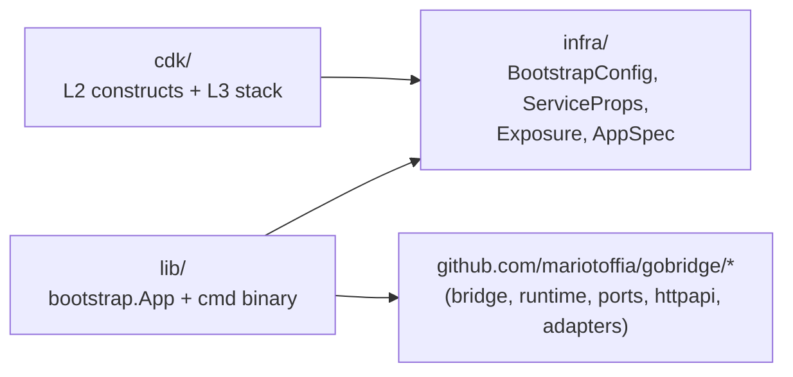
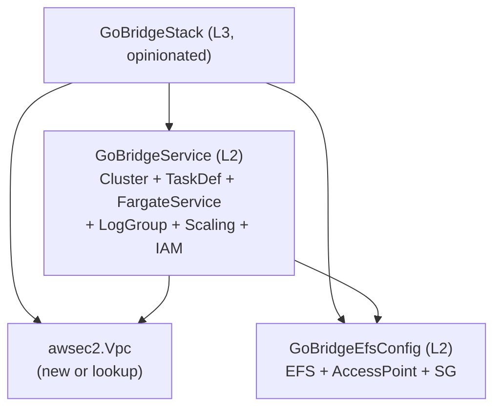
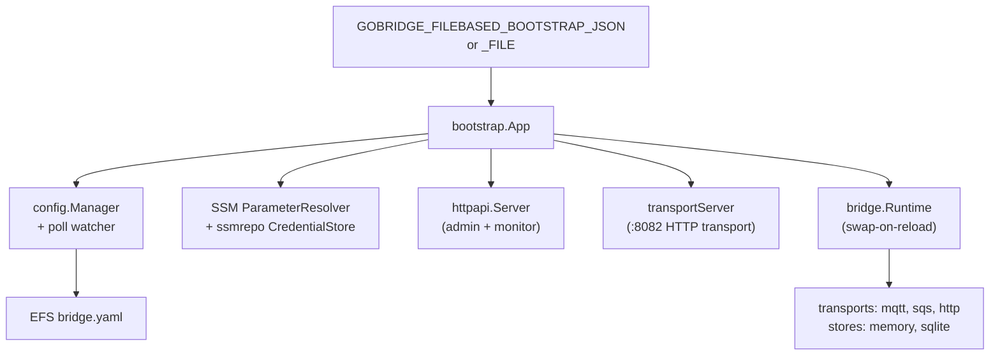

# aws-filebased-config — Architecture

This document covers the **internal** architecture of the deployment profile: how the Go modules layer, how the runtime composition works, and how it maps onto the project's DDD model. For end-to-end AWS architecture (VPC, ALB, IAM JSON), see [docs/aws-deployment/overview.md](../../docs/aws-deployment/overview.md).

## 1. Module Topology

Three independent Go modules (separately versionable):

**Dependency rule:** `infra/` has zero external deps. CDK consumers never pull the runtime tree. The runtime never imports CDK.

`lib/model/BootstrapConfig` and `infra.BootstrapConfig` are intentional duplicates so each module can stand alone; tests guard the equivalence.

## 2. CDK Composition

L2 constructs are the **integration boundary** for external stacks. L3 is a convenience wrapper for default-VPC / single-tenant deployments and exposes only a subset of knobs (no `Cluster`, no `LogRetention`, no `Scaling*`, no `SsmParameterArns`).

Wiring done by `GoBridgeService`:

1. EFS access point mounted as a named volume; container mount is **read-only**.
2. Container env `GOBRIDGE_FILEBASED_BOOTSTRAP_JSON` carries the marshalled `BootstrapConfig`.
3. Task role granted `elasticfilesystem:ClientMount|ClientRead` and `ssm:GetParameter` over `SsmParameterArns`.
4. Service security group added as ingress on the EFS SG (port 2049).
5. Auto-scaling target tracking on CPU (disabled when `ScalingMaxCapacity == 0`).

## 3. Runtime Library (`lib/bootstrap`)

### Reload Strategy (`applyLogicalConfig`)

| Mode                    | Trigger                                                                 | Sequence |
|-------------------------|--------------------------------------------------------------------------|----------|
| `swapModeOverlap`       | No transport advertises `CapExclusiveIdentity`.                          | Build + Start new runtime → install plan → Stop old. |
| `swapModePrepareCommit` | Any session-bound transport (e.g. exclusive MQTT identity).              | `Builder.Prepare` → Stop old → `Complete` → Start new → install. On failure: `recoverPrevious` rebuilds last-good. |

A serialized mutex around `applyLogicalConfig` ensures reload races never produce two live runtimes simultaneously beyond the planned overlap window.

### Profile Guard

`validateFilesystemProfile` rejects routes incompatible with shared-EFS coordination:

- `route.delivery_mode = shared_outbox` → fail.
- `route.session != nil` → fail.

Reason: shared-outbox lease/fencing requires DynamoDB-backed coordination, not available in this profile.

### Reference Cells

`bridgeConfigRef`, `runtimeRef`, `apiKeysRef`, `transportHandlerRef` — small `sync.RWMutex`-guarded holders so the admin/monitor HTTP servers and the transport HTTP server can read live state without coupling to reload mechanics.

## 4. Bootstrap vs Bridge Config

Two-layer model:

| Layer            | Owner          | Format       | Delivery                        | Mutability        |
|------------------|----------------|--------------|---------------------------------|-------------------|
| Bootstrap        | Platform / IaC | JSON         | env var (preferred) or file     | per task revision |
| Bridge (logical) | App / Dev      | YAML or JSON | EFS file mount                  | hot-reloadable    |

Secrets live **only** in SSM. Bootstrap holds *references* (`pms://...` or `/path/to/param`); the runtime resolves them on every reload and patches the resolved bridge config (`resolveInputs`) for HTTP receivers/senders. Embedded `Config.APIKey` overrides any SSM ref.

## 5. DDD Alignment

The deployment profile is a **service / application layer** for the existing DDD model defined in [DDD.md](../../DDD.md) and [UBIQUITOUS.md](../../UBIQUITOUS.md). It does **not** introduce new aggregates.

| Project context                | Touched here                                                                 |
|--------------------------------|------------------------------------------------------------------------------|
| `bridge` (Composition root)    | `lib/bootstrap` calls `bridge.NewBuilder`, registers transports/stores, and drives the `Build` / `Prepare` / `Complete` lifecycle. |
| `runtime` (Engine)             | `bootstrap.App` owns the active `*runtime.Runtime`; reload swap mode mirrors `runtime` semantics. |
| `config` (Declarative model)   | `config.Manager` + file `Loader/Watcher` produce `*ports.BridgeConfig`. |
| `httpapi` (Admin/Monitor)      | Mounted with `ConfigStore = config.FileStore{Path}` so PUTs persist back to EFS. |
| `ports` (Capabilities)         | `ports.CapExclusiveIdentity` drives swap-mode selection. |

### Profile-Local Concepts (see [UBIQUITOUS.md](./UBIQUITOUS.md))

- **Bootstrap config** — deployment-owned runtime parameters, distinct from `ports.BridgeConfig`.
- **Logical vs Applied state** — the same bridge config tracked at two points: last seen on disk (`logicalRef`) vs what the running runtime was built from (`appliedRef`). Diverge only after a rejected reload.
- **Topology** (`single`, `filesystem_replicated`) — determines which routing features are permitted.
- **NodeRole** (`control`, `worker`) — declared on every replica; used by `validateFilesystemProfile` and future coordination hooks.
- **Swap mode** — `overlap` vs `prepare_commit`.
- **Parameter reference** — `pms://` URI or absolute SSM path.

These terms are *additive* to the project's ubiquitous language — they describe deployment-time state that does not exist in the core domain.

## 6. Failure Modes & Guards

| Concern                           | Guard |
|-----------------------------------|-------|
| Production with custom SSM endpoint | `Validate()` rejects `SSMEndpoint != "" && !DevMode`. |
| Memory exhaustion on bootstrap file | 1 MiB file size cap (`maxBootstrapFileSize`). |
| Concurrent reload races            | `App.mu` serializes `applyLogicalConfig`. |
| Reload failure                     | `recoverPrevious` rebuilds last-good logical config; admin/monitor stay up. |
| Stale runtime on watch shutdown    | `Stop` waits for `watchWg` before tearing down dependencies. |
| Bad new runtime in prepare/commit  | Old runtime stopped *before* commit; `recoverPrevious` re-attempts. |

## 7. Extension Points

- **Custom credential store**: `WithCredentialStore` on `App`.
- **Custom SSM resolver**: `WithParameterResolver` (e.g. for tests / Vault wrapper).
- **Custom transport/store**: not exposed via `App` — fork `factoryRegistry` or build a sibling deployment profile.
- **Custom CDK wiring**: bypass L3, compose L2 `GoBridgeService` + `GoBridgeEfsConfig` inside your stack; pass an existing `Cluster`, `EfsConfig`, and your own ALB.
