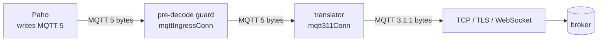

# 0022 — Speak MQTT 3.1.1 by translating the wire below the MQTT 5 client

Status: accepted
Date: 2026-10-08
Deciders: GoBridge core
Amended by: 0023 (a reconnect the broker resumed replays no retained messages),
0024 (switching the protocol version keeps the broker state key and the managed
subscription history, and a live reload no longer refuses it)
Relates to: [0010](0010-mqtt-loop-prevention-contract.md) (`no_local` is
rejected on MQTT 3.1.1, so loop prevention never disappears without notice),
[0011](0011-cluster-client-id-uniqueness.md) (on MQTT 3.1.1 a short-lived
connection feeds the same takeover streak and penalty),
[0021](0021-contain-mqtt-recovery-and-ingress-reject-in-session.md) (the
translator reports what it refuses through the same pre-decode reject path),
[0003](0003-mqtt-persistent-session-hygiene.md) (switching the protocol version
of a durable session is a durable-identity change for the managed-subscription
history)

## Context

The `mqtt` transport (`adapters/mqtt/transport/paho`) spoke MQTT 5.0 only. It
is built on `github.com/eclipse/paho.golang` v0.23.0, which writes protocol
level 5 into every CONNECT. The library's maintainers have declined MQTT 3.1.1
support (eclipse/paho.golang#6, #89 and #273; #104 was closed unmerged).

Brokers and managed services that speak only MQTT 3.1.1 could therefore not be
bridged. Examples are Azure IoT Hub, legacy device fleets, and brokers
configured for 3.1.1.

MQTT 3.1.1 and MQTT 5 are close on the wire. They differ in:

- the protocol level in CONNECT (4 for 3.1.1, 5 for MQTT 5);
- the property block MQTT 5 adds to most packets, which MQTT 3.1.1 does not
  have;
- reason codes on acknowledgements, which MQTT 3.1.1 mostly does not have;
- MQTT 5 features with no 3.1.1 form: AUTH, topic aliases, No Local, Retain As
  Published, Retain Handling, session expiry, and a DISCONNECT sent by the
  server.

MQTT 3.1 (protocol name `MQIsdp`, level 3) is a third wire format, different
from 3.1.1 (protocol name `MQTT`, level 4).

## Decision

**The `mqtt` transport speaks MQTT 3.1.1 when `options.session.protocol_version`
is `v3.1.1`. A translator between Paho and the socket turns the MQTT 5 packets
Paho writes into MQTT 3.1.1, and the broker's MQTT 3.1.1 packets back into
MQTT 5. Paho, the pre-decode guard, the router, delivery, reconcile and every
session behaviour keep MQTT 5 semantics. An option MQTT 3.1.1 cannot express is
rejected when the configuration is validated. A packet it cannot express fails
the write and drops the connection. Behaviour that MQTT 3.1.1 can only offer in
a weaker form is documented and warned once at session start.**

### Configuration

- `options.session.protocol_version` takes `v5` or `v3.1.1`. An empty or
  absent value means `v5`, so existing configurations, their content
  fingerprints and their durable identities do not change. Any other value is
  rejected, and so is a value that is not a string.
- The value names the exact version. `mqtt3` would be ambiguous, because MQTT
  3.1 and 3.1.1 differ on the wire. The values never look like numbers: the
  options decoder is strict, so an unquoted YAML `5` would decode as an integer
  and fail. MQTT 3.1 is not supported.
- On `v3.1.1` the configuration is rejected with `INVALID_CONFIG` when it sets
  any of these:

| Option | Why it is rejected |
|---|---|
| `no_local: true` | MQTT 3.1.1 has no No-Local. Loop prevention must not disappear without notice ([ADR 0010](0010-mqtt-loop-prevention-contract.md)). |
| `session_expiry_interval` other than 0 | MQTT 3.1.1 cannot send it. The broker decides how long a session lives. |
| `password` without `username` | MQTT 3.1.1 forbids it (MQTT-3.1.2-22). |
| `clean_start: true` with `session_mode: persistent` | No MQTT 3.1.1 wire form exists (see the Clean Session mapping below). Exclusive already forces `clean_start` to false, and Ephemeral ignores it. |

- One validator, `SessionOptions.validateProtocol`, holds these rules. Every
  path that can build or change a session runs it:
  - registry decode (`Config.Validate`, the rules that do not need the session
    mode);
  - factory build, CDK and deployment preflight (`ValidateEffectiveSession`,
    every rule);
  - `credentials_uri` resolution (`Config.ApplyCredentials`, the
    username/password rule);
  - live credential rotation (`Session.ApplyCredentials`), on the candidate and
    before any credential or TLS change, so a rejected rotation leaves the
    working session untouched;
  - `NewSession`, which records the result before it applies any default.
    `Start` then returns it without dialling.
- A zero `session_expiry_interval` on a Persistent or Exclusive session is
  still replaced with 86400 locally, so durable identity and redelivery
  admission keep their meaning. On MQTT 3.1.1 this happens without the usual
  warning, because the value is never sent.
- When the version is `v3.1.1`, `NewSession` logs one Warn that lists what the
  session cannot do: carry headers or message identity, see a takeover reason,
  see a publish refusal, or avoid retained replay on a reconnect the broker did
  not resume or on a QoS re-check. It also says that the broker controls the
  in-flight window, which must fit `receive_maximum`, and the session lifetime.
- **Durable identity.** On `v3.1.1`, `DurableSessionIdentity` appends the
  protocol version as one more identity part. On `v5` the parts are unchanged,
  so every existing fingerprint stays the same. A broker need not resume one
  protocol's persistent session from the other (AWS IoT Core does not), so
  switching a Persistent or Exclusive session between versions is a
  durable-identity change, handled like a `client_id` change.
  `DurableSessionIdentityDomains`, the client-ID collision check, stays
  protocol-independent: two sessions with one client ID on one broker collide
  whatever their versions.

### Where the translator sits

- The translator is a `net.Conn` wrapper, `mqtt311Conn`, in
  `adapters/mqtt/transport/paho/acl_mqtt311_conn.go`. The `acl_` prefix is
  required: `scripts/aclcheck` allows an import of Paho's `packets` package
  only in `acl_*.go` files.
- `attemptGuardedConnection` wraps the dialled stream in the translator only on
  `v3.1.1`. The chain is then raw stream → translator → pre-decode guard →
  Paho. On `v5` the chain is unchanged.
- The translator is the only code that reads or writes the MQTT 3.1.1 wire
  format.
- No new dependency. Outbound packets are decoded with Paho's own
  `packets.ReadPacket`. Inbound MQTT 3.1.1 packets are small and are parsed by
  hand with the existing Variable Byte Integer helpers.
- Every connection gets a fresh translator. Its two pieces of state shared
  between the read and the write goroutine, the UNSUBSCRIBE packet-id map and
  the inbound in-flight set, sit behind one mutex and end with the connection.

### Outbound: Paho → broker

Paho serialises every packet write through the guard's lock, so the bytes of
two packets never interleave. The translator buffers bytes until it holds one
whole MQTT 5 packet, translates it, and writes the MQTT 3.1.1 form. A packet
with no MQTT 3.1.1 form fails the write, and the connection drops. Nothing is
weakened without notice.

| MQTT 5 packet | MQTT 3.1.1 output |
|---|---|
| CONNECT | Protocol name `MQTT`, level 4. Properties and will properties are dropped. Clean Session is derived as shown below. A password without a username is an error. |
| PUBLISH | Fixed header, topic, packet id (QoS above 0) and payload. Properties are dropped. An empty topic (a topic alias) is an error. |
| PUBACK, PUBREC, PUBREL, PUBCOMP | Fixed header and packet id. Reason code and properties are dropped. PUBREL keeps flags `0x2`. Paho's PUBREL with reason `0x92` for an unknown PUBREC becomes a plain PUBREL. |
| SUBSCRIBE | Packet id, then each filter with its requested QoS. No Local or Retain As Published is an error. Retain Handling and properties are dropped. |
| UNSUBSCRIBE | Packet id and filters. The translator records how many filters the packet id carried, for the UNSUBACK. |
| PINGREQ | Unchanged. |
| DISCONNECT, reason `0x00` | MQTT 3.1.1 DISCONNECT. The broker discards the Last Will, as an MQTT 5 broker does for `0x00`. |
| DISCONNECT, any other reason | Nothing is written. |
| AUTH | Error. Paho never sends it today. |

**Why a non-zero DISCONNECT writes nothing.** Its only senders are the guard's
reject (`0x95`, `0x81`) and Paho's own error paths, and in both cases the
caller closes the socket next. An MQTT 5 broker publishes the Last Will after a
DISCONNECT with any non-zero reason (MQTT-3.1.2-8). An MQTT 3.1.1 broker
publishes it after an unclean close, but discards it after any DISCONNECT.
Writing nothing keeps the outcome the same.

**Clean Session mapping.** The inputs are the MQTT 5 CONNECT's Clean Start flag
and its Session Expiry Interval (absent means 0).

| Clean Start | Session Expiry Interval | Clean Session | Who produces it |
|---|---|---|---|
| 1 | 0 | 1 | Ephemeral, on every connect |
| 0 | above 0 | 0 | Persistent and Exclusive, including recovery connects |
| 0 | 0 | 1 | Not produced today. In MQTT 5 it means "resume, then end the session on close"; the nearest 3.1.1 form ends the session at once. |
| 1 | above 0 | error | Persistent with `clean_start: true`. Rejected at validation; the translator fails closed if it is reached anyway. |

autopaho sends Clean Start only on the first connection of a connection
manager. Every reconnect sends 0, and the table maps that correctly.

### Inbound: broker → Paho

The translator frames one MQTT 3.1.1 packet at a time. It validates the fixed
header and the Remaining Length before it allocates anything, and hands out the
equivalent MQTT 5 bytes.

**Exact MQTT 3.1.1 validation.** This is a trust boundary. Paho's MQTT 5
decoder accepts bytes that are not valid MQTT 3.1.1: `40 03 00 01 87`, for
example, decodes as an MQTT 5 PUBACK with reason "Not authorized". Each rule
therefore stands on its own. These are malformed:

- fixed-header flags other than DUP, QoS and RETAIN on PUBLISH, or other than
  `0x2` on PUBREL;
- a Remaining Length other than 2 for CONNACK, PUBACK, PUBREC, PUBREL, PUBCOMP
  and UNSUBACK, or other than 0 for PINGRESP;
- a CONNACK with reserved flag bits, or with Session Present set and a
  non-zero return code;
- a zero packet id where one is required;
- a SUBACK return code other than `0x00`, `0x01`, `0x02` and `0x80`;
- a PUBLISH with QoS 3, DUP on QoS 0, an empty topic, a topic longer than the
  packet, a topic that is not well-formed UTF-8, or a topic containing `+`,
  `#` or U+0000;
- a packet an MQTT 3.1.1 server never sends: CONNECT, SUBSCRIBE, UNSUBSCRIBE,
  PINGREQ, DISCONNECT, AUTH and the reserved types.

| MQTT 3.1.1 packet | MQTT 5 output |
|---|---|
| CONNACK | The same flags, the return code mapped as below, and empty properties. |
| PUBLISH | A recomputed Remaining Length and empty properties. The in-flight rules below apply first. |
| PUBACK, PUBREC, PUBREL, PUBCOMP | Unchanged. The 2-byte form is valid MQTT 5 and means success with no properties. |
| SUBACK | Empty properties, then the return codes unchanged. `0x00`, `0x01`, `0x02` and `0x80` mean the same in MQTT 5. |
| UNSUBACK | Empty properties, then one Success (`0x00`) for each filter the UNSUBSCRIBE carried. An unknown packet id is malformed. |
| PINGRESP | Unchanged. |

| MQTT 3.1.1 CONNACK return code | MQTT 5 reason code |
|---|---|
| 0, connection accepted | `0x00` |
| 1, unacceptable protocol version | `0x84`, unsupported protocol version |
| 2, identifier rejected | `0x85`, client identifier not valid |
| 3, server unavailable | `0x88`, server unavailable |
| 4, bad user name or password | `0x86`, bad user name or password |
| 5, not authorized | `0x87`, not authorized |
| any other value | malformed |

The translated CONNACK carries no properties, so Paho uses the MQTT 5
defaults: Receive Maximum 65535, Maximum QoS 2, retain and shared subscriptions
available, and no Maximum Packet Size. The existing CONNACK handling (error
classification, `ErrNotAuthorized`, resume-loss detection) works unchanged.

**Inbound in-flight set.**

- The translator keeps the set of inbound QoS 1 and QoS 2 packet ids it has
  handed to Paho and not yet seen settled. An id leaves the set when Paho
  writes the PUBACK (QoS 1) or the PUBCOMP (QoS 2). QoS 0 is not counted. This
  is the window an MQTT 5 broker enforces for Receive Maximum.
- *Retransmission.* MQTT 3.1.1 lets a broker resend an unacknowledged PUBLISH
  on the same connection (EMQX `retry_interval`). MQTT 5 forbids it
  (MQTT-4.4.0-1). Paho tracks acks by packet id, so settling a late copy after
  the broker has reused the id would ack a newer, unsettled message. A QoS 1
  or QoS 2 PUBLISH whose id is already in the set is therefore dropped before
  Paho sees it. The settlement of the original delivery acks it.
  A QoS 1 copy can also cross the PUBACK on the wire. So a DUP copy of an id
  whose PUBACK the translator already wrote is dropped too, unless that id has
  since been admitted again. When the broker reuses an id, it sends the first
  copy with DUP clear, and that copy arrives before any DUP copy.
- *Window overflow.* A new packet id that would grow the set beyond the
  session's `receive_maximum` is a broker window violation. Without this check,
  the router's admission wait and Paho's unbuffered publish channel would block
  the read loop. Closing the socket does not release them, so the session would
  wedge instead of reconnecting. The packet takes the violation path below
  instead, before Paho sees it. Nothing is acked or lost, the broker redelivers
  on resume, and the Error log names the remedy: raise `receive_maximum` to at
  least the broker's per-client in-flight limit.

**Oversized PUBLISH.**

- MQTT 3.1.1 cannot advertise a Maximum Packet Size, so a compliant broker
  forwards a PUBLISH of any size, up to a Remaining Length of 268,435,455
  bytes.
- A reject at the guard would drop the connection, and the broker would
  redeliver the packet on every `clean_start=false` resume. Any publisher could
  then stop the session for good.
- The translator never buffers more than the payload cap. It reads the topic
  and packet id, keeps the first `max_payload_bytes + 1` payload bytes, and
  hands Paho an MQTT 5 PUBLISH with that truncated payload at once. It discards
  the rest of the payload at the start of the next read.
- The truncated packet fits the guard's limit. The router's existing ingress
  cap (payload above `max_payload_bytes`) then acks and drops it in receive
  order, counted on `MQTTIngressPoisonDropped`.
- The head goes first because Paho fails the connection when a PINGRESP is not
  read within one keep-alive interval, and that PINGRESP queues behind the
  oversized payload. With the head delivered first, the ack can reach the
  broker while the drain still runs. If the drain then outlasts the
  keep-alive, the broker already holds the ack and does not redeliver.
- The ack can still wait behind earlier unsettled deliveries, because acks go
  out in receive order. The broker's own maximum packet size (Mosquitto
  `max_packet_size`, EMQX `max_packet_size`) bounds the transfer time.
- No new metric, queue or ack path is added.

**Violations.** A malformed packet, a packet of any other type above the
guard's maximum packet size, and a window overflow take the guard's reporting
path, `Session.rejectPredecodeIngress` ([ADR
0021](0021-contain-mqtt-recovery-and-ingress-reject-in-session.md)): it counts
`MQTTIngressRejected`, sets the service level to None, applies the reject-streak
backoff and starts the readiness hold-down. The translator then closes the raw
connection without writing a DISCONNECT, so the broker publishes the Last Will.
Later reads return the same error.

### Version checks above the translator

Above the translator, the session checks the protocol version only for these:

- installing the translator in `attemptGuardedConnection`;
- the validator and the startup warning described above, and skipping the
  expiry-coercion warning;
- `DurableSessionIdentity`, described above;
- egress: on MQTT 3.1.1 the sender builds a publish with only topic, QoS,
  retain and payload, before field and packet-size validation. A header that
  could never be sent (over 65,535 bytes, or not valid UTF-8) therefore cannot
  fail a publish that can be sent;
- takeover damping: MQTT 3.1.1 has no DISCONNECT `0x8E`. A connection that
  drops within `connectionStabilityWindow` (30 s) of coming up therefore feeds
  the existing takeover streak and penalty ([ADR
  0011](0011-cluster-client-id-uniqueness.md)). It gets its own log line and
  does not count `MQTTSessionTakeover`, because the cause is inferred, not
  reported;
- the message id: a content-hash id is derived only on a `v3.1.1` session.
  This entry was added later; see the
  [2026-10-08 addendum](#addendum-2026-10-08-opt-in-content-hash-message-id);
- the subscription record a resumed session keeps, added by
  [ADR 0023](0023-keep-resumed-mqtt-311-subscriptions.md).

The transport kind stays `mqtt`, so no core Go code changes. Every core rule
keyed on the kind keeps working: `max_mqtt_sessions`, the managed-subscription
store and its seeding, the durable identity snapshot, clustered `$share`
validation, and the registry and plugin checks.

## Consequences

These behave as on MQTT 5: ack after settlement in receive order; QoS 0, 1 and
2; session resume and resume-loss detection from Session Present; startup
grace, covered-retain and orphan cleanup; the managed-subscription history;
settlement recovery and unit-rebuild containment; the poison escape;
credential rotation; TLS, WebSocket and proxies; multi-URL failover;
keep-alive; Last Will; the cluster and lease rules; `client_id_suffix`; QoS
downgrade detection (SUBACK carries the granted QoS); `max_mqtt_sessions`; and
the circuit breaker.

These degrade. Each is documented in
[MQTT 3.1.1](../transports/mqtt-311.md) and named in the startup warning where
it applies.

| Behaviour | On MQTT 3.1.1 |
|---|---|
| Headers and identity | Only topic, payload, QoS and RETAIN cross the wire. On egress every header, the subject and the expiry are dropped before validation. On ingress every message gets a minted id and is count-less (see below), unless the session opts into a content-hash id (see the [2026-10-08 addendum](#addendum-2026-10-08-opt-in-content-hash-message-id)). |
| Session takeover | Seen only as a connection that drops within 30 s of coming up. It feeds the takeover streak and penalty (1 s doubling to 64 s) without counting `MQTTSessionTakeover`. The exclusive lease is still the owner guarantee. |
| Publish refusal | PUBACK and PUBREC carry no reason code. A broker that refuses a publish acks it (Mosquitto) or closes the connection, which surfaces as `ErrConnectionLost` (retryable). `throttle_retry_after` never applies. |
| Subscribe refusal | SUBACK `0x80` is the only failure code. It keeps its MQTT 5 meaning, `ErrUnavailable` (transient), so a broker ACL denial is not classified `ErrForbidden`. |
| Retained replay | No Retain Handling. A reconnect the broker resumed sends no SUBSCRIBE for an unchanged filter, so it replays nothing ([ADR 0023](0023-keep-resumed-mqtt-311-subscriptions.md)). Retained messages are delivered again, marked `mqtt.retained=true`, on a reconnect the broker did not resume (a fresh or lost session), on the first connection after a process start, and on a QoS re-check. |
| Flow control | `receive_maximum` is not sent; the translator enforces it. The broker's per-client in-flight limit must not exceed it (defaults: Mosquitto `max_inflight_messages` 20, EMQX `max_inflight` 32, AWS IoT 100). A broker that sends more is refused on every connection, with nothing acked and the remedy logged. The session never wedges. |
| Maximum packet size | Not advertised. An oversized PUBLISH is acked and dropped instead of being refused by the broker. Egress has no broker limit to check, so its cap falls back to the protocol maximum. |
| UNSUBACK detail | Every filter reports Success. Managed cleanup always takes its connection-recycle path. A broker that refuses an UNSUBSCRIBE anyway looks like success, so the broker must permit UNSUBSCRIBE for every filter the session subscribes. |
| Session lifetime | Broker policy (defaults: Mosquitto never expires a session, EMQX after 2 h, AWS IoT after 1 h). `session_expiry_interval` is rejected. |
| Shared subscriptions | `$share/` depends on the broker. Mosquitto, EMQX, HiveMQ, VerneMQ and AWS IoT accept it from 3.1.1 clients; Azure Event Grid disconnects the client. `shared_consumer` stays declared, because capabilities are per transport, not per configuration. |
| Error classification | CONNACK return codes 1–5 map to the nearest MQTT 5 code. There is no server-busy (`0x89`) or quota (`0x97`) signal. |

Carrying no headers has these consequences on ingress:

- None of these arrive: `mqtt.message-id`, correlation data, subject, expiry,
  content type, response topic, `traceparent`, user properties.
- Every message gets a minted id and `x-bridge.generated-id`. This is the
  default; `message_id: content_hash` replaces it (see the
  [2026-10-08 addendum](#addendum-2026-10-08-opt-in-content-hash-message-id)).
- The message is count-less: it has no stable key and no native receive count.
  With a finite `max_replay_attempts`, the route's replay cap treats every
  retry decision for it as already at the cap. That covers recoverable
  processor failures and non-deadline outbox persist failures as well as sends.
  The message is dead-lettered or dropped on its first failure instead of being
  retried through redelivery.
- `max_replay_attempts: 0` opts the route into unbounded retry instead. That is
  the existing contract for count-less sources, now true of every MQTT 3.1.1
  message with a minted id.
- `direct_hold` sinks a message whose send keeps failing as
  `unstable_identity` once `send_retry_budget` is spent.
- `shared_outbox` cannot deduplicate a broker redelivery.

Not available, and nothing to reject, because the adapter never sets them:
topic alias, subscription identifiers, enhanced authentication (AUTH),
request/response information, server reference and will properties.

Not possible on MQTT 3.1.1: a session expiry interval, broker-side message
expiry, publish refusal verdicts, a takeover reason, and header carriage
without changing the payload.

Switching a Persistent or Exclusive session between `v5` and `v3.1.1` is a
durable-identity change. The Supervisor and the AWS runtime refuse it as a live
reload, and the managed-subscription history needs the documented migration
([managed-filter migration](../runbooks/mqtt-managed-subscription-migration.md)).
Drain the backlog before switching. For an Ephemeral session a protocol change
is an ordinary rebuild, because the typed configuration is part of the reload
unit's content identity.

## Rejected alternatives

- **A second client stack (`eclipse/paho.mqtt.golang`) inside the adapter.**
  The router, delivery and session code are written against paho.golang types
  (`paho.Publish`, `PublishReceived`, `Client.Ack`,
  `autopaho.ConnectionManager`). The v3 library sends manual acks in call
  order, while MQTT 3.1.1 §4.6 requires receive order. It has open QoS 2
  duplicate-delivery bugs (eclipse/paho.mqtt.golang#768, #788, #791) and
  cannot report Session Present after an automatic reconnect
  (eclipse/paho.mqtt.golang#582). The result would be two reconnect engines
  and a large refactor.
- **A separate `mqtt311` adapter, as AMQP 0-9-1 and AMQP 1.0 are separate.** It
  would duplicate or fork the session behaviour the `mqtt` adapter has
  hardened: grace window, orphan cleanup, poison escape, recovery, managed
  subscriptions, credential rotation and takeover damping. It would also add a
  second kind to every core rule that matches the kind name: the
  `max_mqtt_sessions` count, the managed-subscription store gate, the
  documentation enum test, the plugin and registry checks, the CDK image
  source, and the build tags. The precedent does not fit: AMQP 0-9-1 and 1.0
  are different protocols, while MQTT 3.1.1 and 5 differ in a version byte and
  an absent property block.
- **No-Local through the broker "bridge bit".** Setting `0x80` on the protocol
  level (`try_private`) takes about five lines, but only Mosquitto and VerneMQ
  honour it. EMQX honours it only with `ignore_loop_deliver`, and HiveMQ, AWS
  IoT and Azure are unknown. Loop prevention would depend on the broker without
  the operator knowing. `no_local` is rejected instead.
- **A header envelope.** An opt-in payload wrapper for bridge-to-bridge hops
  would carry headers over MQTT 3.1.1. It changes the payload every non-bridge
  consumer sees. Not done.
- **Suppress retained replay.** On a reconnect with Session Present over MQTT
  3.1.1, the session could keep the broker-confirmed subscription set and skip
  the re-SUBSCRIBE. That touches the reconcile and the QoS-grant reset logic.
  Deferred, then done in [ADR 0023](0023-keep-resumed-mqtt-311-subscriptions.md).
- **Out of scope:** MQTT 3.1, automatic fallback from MQTT 5 to 3.1.1, and a
  CDK builder option for the protocol version.

## Addendum 2026-10-08: opt-in content-hash message id

The Consequences above say every MQTT 3.1.1 message gets a minted id and is
count-less. That stays the default. A session can now choose a content-hash id
instead.

**Why.** An MQTT 3.1.1 PUBLISH carries only the topic, the payload, QoS, RETAIN
and DUP. It has no properties, so no producer id can arrive. A minted id
changes on every broker redelivery and is marked `x-bridge.generated-id`, so:

- the replay cap cannot count retries. With a finite `max_replay_attempts`, a
  message whose processing fails is dead-lettered or dropped on its first
  failure;
- `shared_outbox` cannot recognise a broker redelivery, so the message can
  reach downstream twice. That is normal at-least-once delivery.

**Decision.** `options.session.message_id` takes `random` or `content_hash`.

- `random` is the default, and an omitted key means `random`. Every delivery
  gets a fresh random id, marked `x-bridge.generated-id`, as described above.
  Nothing is ever dropped as a duplicate.
- `content_hash` sets the id to `mqtt-sha256:` followed by the unpadded
  base64url SHA-256 of, in order: the session's effective client id (after
  `client_id_suffix`); the session's broker URLs as one field, each in the
  canonical form the durable session identity uses, userinfo removed, in
  configured order, joined by a newline; the topic; and the payload. Every
  field except the payload is prefixed with its byte length as a big-endian
  8-byte integer. QoS, RETAIN and DUP are not hashed.
- A broker redelivery and a retained replay to the same session keep their id.
  The same topic and payload from another session, with another client id or
  another broker, get a different id.
- The id is not marked `x-bridge.generated-id`. It is the envelope id, so it is
  the replay-cap key, the outbox duplicate key, an input to the DLQ entry id
  (with the route, binding and source ids), and the input
  to the deduplication id each sender derives: SQS FIFO
  `MessageDeduplicationId`, Service Bus `MessageId`, HTTP `Idempotency-Key`,
  and `mqtt.message-id` on MQTT 5 egress.
- `content_hash` requires `protocol_version: v3.1.1`. On MQTT 5 it is rejected
  with `INVALID_CONFIG` when the configuration is validated, because an MQTT 5
  producer can send its own id in the `mqtt.message-id` user property or in
  correlation data. Any value other than `random` and `content_hash` is
  rejected.
- The list under "Version checks above the translator" gains one entry: a
  content-hash id is derived only on a `v3.1.1` session.

**An exception to the identity contract.** The envelope identity contract on
`ports.Receiver` requires source-scoped uniqueness: two distinct source
messages that reach one receiver must not share an `Envelope.ID`. A
content-hash id breaks that rule by design: two distinct messages with
identical content (same session, topic and payload) collide. The operator opts
into the exception per session, and `random` keeps the rule. The contract's
other rule, redelivery stability, holds: every redelivery to the session
carries the same id, so the id is not marked generated.

**Hash scope.** The hash covers the broker session (client id and broker
URLs), the topic and the payload. Rejected alternatives:

- *Topic and payload only.* Identical messages that two sessions feed into one
  binding would share an id and collide across the sessions.
- *Adding the MQTT packet id.* It would keep two concurrent identical messages
  apart. But a broker that does not resend with the original packet id gives a
  redelivery a new id; AWS IoT Core documents redelivery with a different
  packet id. The ids would then be unstable without being marked generated,
  which the identity contract forbids.
- *Using the hash only as the retry-count key, with a random envelope id.* It
  would keep identical messages apart in the outbox, the DLQ and downstream,
  but needs a runtime change. Rejected as larger than the opt-in warrants.

**Consequences.**

- On every route, `direct_hold` included, two different messages with
  identical content share one replay budget (retries of both count against one
  `max_replay_attempts`) and one DLQ entry (the second dead-letter write is
  suppressed and counted only on `DLQDuplicateSuppressed`). On `shared_outbox`
  the second is also acked and dropped as a duplicate, counted only on
  `OutboxDuplicateSuppressed`. A downstream sink that deduplicates on the id
  can collapse them too.
- An outbox row keeps its identity while it is pending or claimed, and for
  `retention` (default `1h`) after it was delivered. During a sink outage,
  identical messages hours apart can collapse.
- Retries are counted, so a failing delivery on a Persistent or Exclusive
  QoS 1/2 session is retried by a connection recycle, and on MQTT 3.1.1 a
  reconnect the broker did not resume replays retained messages ([ADR 0023](0023-keep-resumed-mqtt-311-subscriptions.md)).
- That trade-off is why `random` stays the default. `content_hash` suits only
  payloads in which every distinct message carries something unique: a
  timestamp, a sequence number or an event id. It does not suit heartbeats
  (`alive`), status values (`ON`, `OFF`), raw readings (`21.5`) or commands
  that can repeat (a second `{"cmd":"open","valve":3}` can be dropped).
- Headers still do not cross an MQTT 3.1.1 hop. The header envelope stays
  rejected, and GoBridge does not encode metadata in the topic either: the
  client on the other side of the broker can be any MQTT client.

Operator guidance is on [MQTT 3.1.1](../transports/mqtt-311-message-ids.md).
