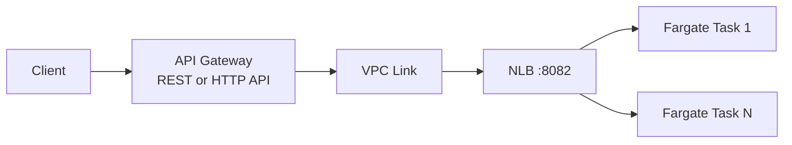

# API Gateway and custom domains

## API Gateway Integration

Use API Gateway to expose the transport port (`:8082`) externally while
keeping admin and monitor traffic on the internal ALB.

### REST API vs HTTP API

| Feature | REST API | HTTP API |
|---------|----------|----------|
| Cost | $3.50/M requests | $1.00/M requests |
| Usage plans / API keys | Yes | No |
| WAF integration | Yes | No |
| Request validation | Yes | No |
| Lambda authorizers | Yes | Yes |
| WebSocket support | No (use WebSocket API) | No |
| Latency | Higher | Lower |

**Recommendation:** Use **REST API** when you need usage plans, API keys, WAF,
or request validation. Use **HTTP API** for lower cost and latency.

### VPC Link + NLB Pattern

API Gateway requires a **Network Load Balancer (NLB)**, not an ALB, for VPC
Link integration. Deploy the NLB alongside the existing ALB, targeting the
same Fargate tasks on port 8082.



### OpenAPI Snippet for Transport Endpoints

```yaml
openapi: "3.0.3"
info:
  title: GoBridge Transport API
  version: "1.0"
paths:
  /transport/http/receivers/{id}/messages:
    post:
      summary: Ingest a message
      security:
        - apiKey: []
      parameters:
        - name: id
          in: path
          required: true
          schema:
            type: string
      requestBody:
        required: true
        content:
          application/json:
            schema:
              type: object
              required: [subject, payload]
              properties:
                subject:
                  type: string
                payload:
                  type: string
                  format: byte
                headers:
                  type: object
                expires_at:
                  type: string
                  format: date-time
      responses:
        "200":
          description: Message accepted
        "401":
          description: Invalid or missing API key
  /transport/http/senders/{id}/events:
    get:
      summary: SSE event stream
      security:
        - apiKey: []
      parameters:
        - name: id
          in: path
          required: true
          schema:
            type: string
      responses:
        "200":
          description: SSE stream
          content:
            text/event-stream: {}
components:
  securitySchemes:
    apiKey:
      type: apiKey
      in: header
      name: X-API-Key
```

### Usage Plans and API Keys (CDK)

```go
api := apigw.NewRestApi(stack, jsii.String("BridgeAPI"), &apigw.RestApiProps{
    RestApiName: jsii.String("gobridge-transport"),
    Deploy:      jsii.Bool(true),
})

plan := api.AddUsagePlan(jsii.String("Standard"), &apigw.UsagePlanProps{
    Name:     jsii.String("standard"),
    Throttle: &apigw.ThrottleSettings{
        RateLimit:  jsii.Number(100),
        BurstLimit: jsii.Number(200),
    },
    Quota: &apigw.QuotaSettings{
        Limit:  jsii.Number(10000),
        Period: apigw.Period_DAY,
    },
})

key := api.AddApiKey(jsii.String("ClientKey"), &apigw.ApiKeyOptions{
    ApiKeyName: jsii.String("client-1"),
})
plan.AddApiKey(key)
```

See [CDK Scenario 3](../scenarios/cdk/03-api-gateway.md) for the full API
Gateway CDK setup.

---

## Custom Domain

Route external traffic through a branded domain with TLS termination.

### Setup Steps

1. **Request an ACM certificate** in the same region as the API Gateway
   (or `us-west-1` for edge-optimized APIs).
2. **Create a custom domain name** on the API Gateway and attach the
   certificate.
3. **Map the base path** (e.g., `/v1`) to the deployed stage.
4. **Create a Route 53 alias record** pointing the custom domain to the
   API Gateway distribution.

```go
domain := apigw.NewDomainName(stack, jsii.String("APIDomain"),
    &apigw.DomainNameProps{
        DomainName:  jsii.String("api.example.com"),
        Certificate: cert,
        EndpointType: apigw.EndpointType_REGIONAL,
    },
)

domain.AddBasePathMapping(api, &apigw.BasePathMappingOptions{
    BasePath: jsii.String("v1"),
})

route53.NewARecord(stack, jsii.String("APIAlias"), &route53.ARecordProps{
    Zone:       zone,
    RecordName: jsii.String("api"),
    Target:     route53.RecordTarget_FromAlias(
        route53targets.NewApiGatewayDomain(domain),
    ),
})
```

---
