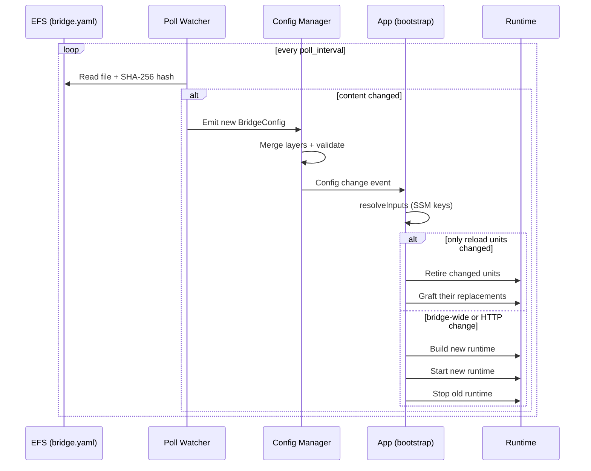
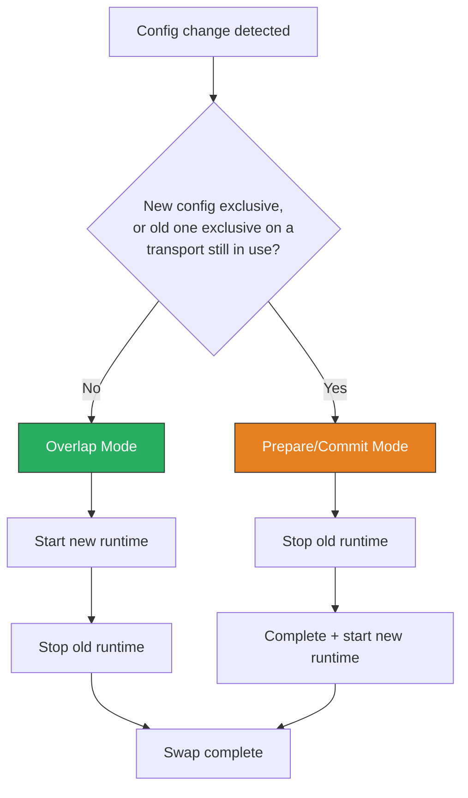

# Hot-reload and production config updates

## Hot-Reload

GoBridge watches the bootstrap-selected config source: a file with a poll-based
watcher, or a DynamoDB config item with strongly consistent polling or Streams.
Both feed the same config manager and runtime apply path without process restart.
Clustered deployments retain their existing rollout barrier or whole-cohort
replacement requirements; changing the source does not bypass them.

### Reload Sequence (file source)



### Why Poll Mode Instead of Notify

The bootstrap library forces **poll mode** (`ModePoll`) for file watching.
The default `notify` mode uses `fsnotify` (kernel inotify/kqueue events),
which does not reliably propagate across NFS mounts. EFS is an NFS-based
file system, so writes from one Fargate task or an external writer may not
trigger inotify events on other tasks. Poll mode reads the file at a fixed
interval and compares SHA-256 hashes, which works reliably regardless of the
underlying filesystem.

### Poll Interval Tuning (file source)

| Environment | Recommended `poll_interval` | Rationale |
|-------------|----------------------------|-----------|
| Development | `"1s"` (default) | Fast feedback during local iteration. |
| Staging | `"5s"` | Balance between responsiveness and EFS read cost. |
| Production | `"5s"` to `"30s"` | Lower EFS I/O; config changes are infrequent. |

### DynamoDB source

DynamoDB config polling defaults to `30s`; `poll_interval` overrides it. The
loader watches the version of the `current` item for `config#<bridge_id>` and
also serves as the admin `ConditionalConfigStore`, so commits use atomic
compare-and-swap rather than the file source single-writer assumption. Streams
mode uses the same loader and requires an enabled stream and read permissions;
`config_dynamodb.stream_poll_interval` controls its `GetRecords` cadence.
The adapter falls back to polling if Streams is unavailable.

The EFS update procedure below applies to the file source. For DynamoDB, update
the selected item through CAS-aware tooling or admin transactions, preserving
its monotonically increasing version. A missing item starts the transaction at
version zero; the first successful CAS commit creates version one. Other source
errors fail the transaction rather than falling back to an empty config. Config
validation, runtime apply and cluster rollout coordination remain unchanged.

Admin applies and watcher updates are serialized within each process. For the
DynamoDB source, an update older than either the latest logical config or the
running config is ignored before it can change runtime or health state. This
prevents a delayed admin apply from undoing a newer writer's change. A superseded
commit remains successful without applying or rolling back its older version;
the response confirms that the write succeeded, not that its version is still
running. Replaying the same version retains content-based deduplication and can
retry a failed apply. Restoring old content through CAS creates a new version.
This ordering rule does not apply to operator-controlled file versions, to
coordinated boot/barrier decisions, or to recovery of the last good runtime.

### In-place reload

A change reconnects only what it touches. The bootstrap library splits each
configuration into **reload units**: groups of sessions, receivers, senders,
bindings and routes joined by the ids they reference (a `session_id`, a
binding's `sender_id`, a route's `receiver_id`, `bindings` and `session`
block). On a change it compares the units of the running and the new
configuration. A unit whose content is the same in both keeps running
untouched: its sessions stay connected and its routes keep delivering. A unit
that changed, or was removed, is drained, stopped and removed from the running
runtime; a unit that changed, or was added, is built over the running runtime's
stores and started inside it. Routes that share a session are one unit, so give
each tenant its own sessions when tenants must not disturb each other. See
[ADR 0018](../adr/0018-reload-in-place-by-unit.md).

The in-place attempt runs after the same deployment-profile admission and
cluster checks as every apply, with the secrets and the MQTT memory profile
resolved once for it and for the full swap that may follow. The bootstrap
library falls back to the [full swap](#swap-modes) when:

- the change touches a bridge-wide section: `bridge`, `stores`, `config_watch`
  or `http`;
- the outbox stale-claim duration changes (derived from the largest route
  `step_down_grace` unless `stores.outbox` sets `stale_claim_duration`);
- a changed, added or removed unit uses the `http` transport, whose endpoints
  cannot be unmounted from the transport server or mounted twice, or a
  transport with no registered factory, whose capabilities cannot be read;
- no runtime is running.

When an added unit claims an exclusive broker identity, or a retired unit holds
one on a transport an added unit still attaches to (the
`bridge.RequiresSerializedSwap` rule under [Swap Modes](#swap-modes), asked of
the retired units against the added ones), the retired units stop before their
replacements are built; otherwise the replacements are built first. Inside the
runtime a replaced unit always stops before its replacement starts, so a
changed unit has a short gap — its drain plus its start — even on SQS, where a
full overlap swap has none. Unchanged units have no gap.

A successful in-place reload keeps the same runtime and transport factories,
restarts the post-swap convergence watch, and logs:

```text
bootstrap: reloaded in place  outcome=applied retired_routes=[...] added_routes=[...] retired_sessions=[...] added_sessions=[...]
```

A failure logs `bootstrap: in-place reload failed` with the same fields, the
outcome and the error, and ends one of three ways:

- **unchanged** — nothing was retired, or the retired units were rebuilt from
  the running configuration and put back. The runtime keeps serving the old
  configuration, unless a shutdown, terminal failure or configuration fence
  stopped it meanwhile, which that path handles as it would without a reload,
  and the change is rejected like any failed apply;
- **torn** — units were retired and could not be restored, or the runtime
  stopped running before the rest were retired. The runtime is stopped and the
  previous configuration rebuilt, as after a failed prepare/commit swap;
- **wedged** — a retired unit, a part built for a serialized reload, or the
  torn runtime did not stop cleanly, so its sessions may still hold their broker
  identities. The process wedges, `/live`
  fails and the orchestrator replaces the task
  ([ADR 0004](../adr/0004-single-use-runtime-lifecycle.md)).

### Keeping MQTT tenants connected

The MQTT memory profile reserves 25% of task memory for MQTT ingress and gives
each MQTT session that can receive an equal share: every session a receiver
uses, and every persistent or exclusive session in use. For a session that
leaves `ingress_memory_budget_bytes` unset, the share becomes its
`ingress_memory_budget_bytes`, and its `receive_maximum` is derived from it.
Both are part of the session's reload unit. So adding or removing one such
MQTT session changes the share of every other unpinned MQTT session, and every
one of those units is replaced: each tenant's MQTT session disconnects and
connects again.

In a multi-tenant deployment, set `ingress_memory_budget_bytes` on every MQTT
session. A pinned budget is kept as it is, and `receive_maximum` is then
derived from the budget, the payload size and the session's own routes, so a
tenant added or removed elsewhere leaves the session connected. Pick a budget
no larger than the share at the largest number of such sessions you plan for
(25% of task memory divided by that number): a pinned budget above the current
share is rejected, and the share shrinks as sessions are added.

```yaml
sessions:
  - id: tenant-a
    transport: mqtt
    session_mode: persistent
    options:
      session:
        broker_url: tls://broker.example.com:8883
        client_id: bridge-tenant-a
        ingress_memory_budget_bytes: 67108864   # 64 MiB: the share of a 1 GiB task at 4 MQTT sessions
```

See the [ingress byte model](../transports/mqtt-options.md#ingress-byte-model)
for what the budget must hold.

### Swap Modes

When a config change cannot be reloaded in place, the bootstrap library must
swap the old runtime for a new one. The swap strategy is **auto-detected** from
the new config through `bridge.RequiresSerializedSwap`, the same check the
Supervisor uses.

**Overlap mode** (default): The new runtime is started first, then the old
runtime is stopped. This provides zero-downtime for stateless transports
like HTTP and SQS where multiple concurrent listeners are safe.

**Prepare/commit mode**: The old runtime is stopped first, then the new
runtime is built and started. It is selected when the incoming config claims
an exclusive broker identity, or when the running config holds one on a
transport the incoming config still uses — an ordinary consumer is refused
beside an exclusive one that is still attached. A config claims an identity
when:

- the config declares it — `session_mode: exclusive`, a route `session` block,
  or a session a route binding names by `session_id`. The last two always run a
  single-owner, lease-managed session whatever the session's own mode says
  (this is how AMQP 1.0 is caught);
- the transport advertises `CapExclusiveIdentity` — MQTT always, where two
  connections with one client ID disconnect each other;
- the transport reports it from a receiver's config — an exclusive AMQP 0-9-1
  consumer, or a Service Bus receiver pinned to one `session_id`.

A transport the incoming config no longer uses cannot contend for anything the
old runtime holds on it, so dropping a transport altogether keeps overlap.



If the new runtime fails to start in prepare/commit mode, the bootstrap
library attempts to **recover the previous configuration** by rebuilding and
restarting the old runtime. This prevents a bad config push from leaving the
bridge in a stopped state.

---

## Config Updates in Production

Follow this workflow for safe configuration updates in production.

### Update Flow

1. **Update the YAML on EFS.** Use CI/CD, a manual mount, or the admin API
   config-transaction flow (open → patch → commit). The commit enforces
   optimistic concurrency via the `version` field (check-and-set). There is no
   `PUT /config` endpoint — see
   [HTTP API — Config transactions](../http-api-admin.md#config-transactions).

2. **Poll watcher detects the change.** Within one `poll_interval` cycle, the
   watcher reads the file, computes the SHA-256 hash, and detects the
   difference.

3. **Config is parsed and validated.** The YAML is deserialized into a
   `BridgeConfig` struct. The `validateFilesystemProfile` function checks
   topology constraints (e.g. `shared_outbox` routes are rejected under
   `filesystem_replicated` topology).

4. **SSM parameters are resolved.** The `resolveInputs` function reads
   `admin_api_key_param`, `monitor_api_key_param`, and any
   `http_receiver_api_key_params` / `http_sender_api_key_params` from SSM
   Parameter Store with decryption.

5. **The change is applied.** When only reload units changed, the running
   runtime is reloaded in place and only those units reconnect. Otherwise the
   appropriate swap mode (overlap or prepare/commit) is selected and the
   runtime is replaced.

6. **If validation or build fails:** The change is rejected, the last good
   runtime continues running, and a warning is logged:
   ```
   bootstrap: config reload rejected; keeping last good runtime  error="..."
   ```

### The Version Field

The `version` field in `BridgeConfig` is an integer counter incremented on
each config commit via the admin API. When multiple instances share the same
config file on EFS, this field provides optimistic concurrency control:

```yaml
version: 7
bridge:
  id: my-bridge
  deployment_mode: clustered
# ...
```

A config-transaction commit includes the current `version` value. The write
succeeds only if the on-disk version matches. If another instance updated the
file first, the commit fails with a conflict (`409`), and you should re-read
and retry. A `version` of `0` (or absent) means the config has never been
committed through the API.

---
