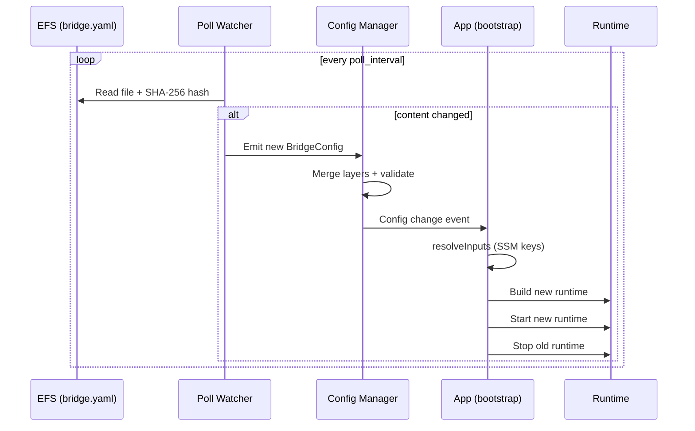
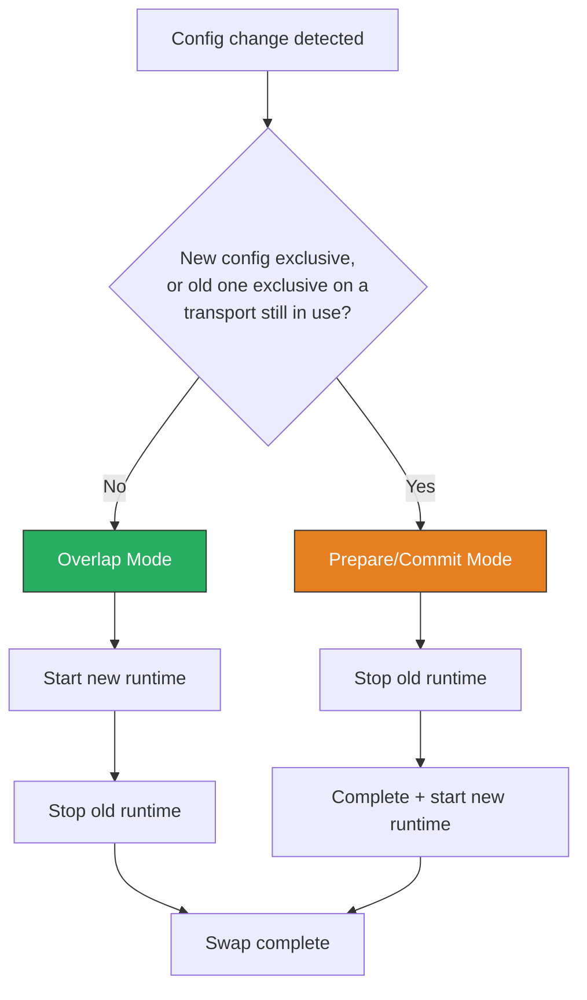

# Hot-reload and production config updates

## Hot-Reload

GoBridge watches the bootstrap-selected config source: a file with a poll-based
watcher, or a DynamoDB config item with strongly consistent polling or Streams.
Both feed the same config manager and runtime apply path without process restart.
Clustered deployments retain their existing rollout barrier or whole-cohort
replacement requirements; changing the source does not bypass them.

### Reload Sequence (file source)



### Why Poll Mode Instead of Notify

The bootstrap library forces **poll mode** (`ModePoll`) for file watching.
The default `notify` mode uses `fsnotify` (kernel inotify/kqueue events),
which does not reliably propagate across NFS mounts. EFS is an NFS-based
file system, so writes from one Fargate task or an external writer may not
trigger inotify events on other tasks. Poll mode reads the file at a fixed
interval and compares SHA-256 hashes, which works reliably regardless of the
underlying filesystem.

### Poll Interval Tuning (file source)

| Environment | Recommended `poll_interval` | Rationale |
|-------------|----------------------------|-----------|
| Development | `"1s"` (default) | Fast feedback during local iteration. |
| Staging | `"5s"` | Balance between responsiveness and EFS read cost. |
| Production | `"5s"` to `"30s"` | Lower EFS I/O; config changes are infrequent. |

### DynamoDB source

DynamoDB config polling defaults to `30s`; `poll_interval` overrides it. The
loader watches the version of the `current` item for `config#<bridge_id>` and
also serves as the admin `ConditionalConfigStore`, so commits use atomic
compare-and-swap rather than the file source single-writer assumption. Streams
mode uses the same loader and requires an enabled stream and read permissions;
`config_dynamodb.stream_poll_interval` controls its `GetRecords` cadence.
The adapter falls back to polling if Streams is unavailable.

The EFS update procedure below applies to the file source. For DynamoDB, update
the selected item through CAS-aware tooling or admin transactions, preserving
its monotonically increasing version. A missing item starts the transaction at
version zero; the first successful CAS commit creates version one. Other source
errors fail the transaction rather than falling back to an empty config. Config
validation, runtime apply and cluster rollout coordination remain unchanged.

Admin applies and watcher updates are serialized within each process. For the
DynamoDB source, an update older than either the latest logical config or the
running config is ignored before it can change runtime or health state. This
prevents a delayed admin apply from undoing a newer writer's change. A superseded
commit remains successful without applying or rolling back its older version;
the response confirms that the write succeeded, not that its version is still
running. Replaying the same version retains content-based deduplication and can
retry a failed apply. Restoring old content through CAS creates a new version.
This ordering rule does not apply to operator-controlled file versions, to
coordinated boot/barrier decisions, or to recovery of the last good runtime.

### Swap Modes

When a config change is detected, the bootstrap library must swap the old
runtime for the new one. The swap strategy is **auto-detected** from the new
config through `bridge.RequiresSerializedSwap`, the same check the Supervisor
uses.

**Overlap mode** (default): The new runtime is started first, then the old
runtime is stopped. This provides zero-downtime for stateless transports
like HTTP and SQS where multiple concurrent listeners are safe.

**Prepare/commit mode**: The old runtime is stopped first, then the new
runtime is built and started. It is selected when the incoming config claims
an exclusive broker identity, or when the running config holds one on a
transport the incoming config still uses — an ordinary consumer is refused
beside an exclusive one that is still attached. A config claims an identity
when:

- the config declares it — `session_mode: exclusive`, or a route `session`
  block, which is always single-owner (this is how AMQP 1.0 is caught);
- the transport advertises `CapExclusiveIdentity` — MQTT always, where two
  connections with one client ID disconnect each other;
- the transport reports it from a receiver's config — an exclusive AMQP 0-9-1
  consumer, or a Service Bus receiver pinned to one `session_id`.

A transport the incoming config no longer uses cannot contend for anything the
old runtime holds on it, so dropping a transport altogether keeps overlap.



If the new runtime fails to start in prepare/commit mode, the bootstrap
library attempts to **recover the previous configuration** by rebuilding and
restarting the old runtime. This prevents a bad config push from leaving the
bridge in a stopped state.

---

## Config Updates in Production

Follow this workflow for safe configuration updates in production.

### Update Flow

1. **Update the YAML on EFS.** Use CI/CD, a manual mount, or the admin API
   config-transaction flow (open → patch → commit). The commit enforces
   optimistic concurrency via the `version` field (check-and-set). There is no
   `PUT /config` endpoint — see
   [HTTP API — Config transactions](../http-api-admin.md#config-transactions).

2. **Poll watcher detects the change.** Within one `poll_interval` cycle, the
   watcher reads the file, computes the SHA-256 hash, and detects the
   difference.

3. **Config is parsed and validated.** The YAML is deserialized into a
   `BridgeConfig` struct. The `validateFilesystemProfile` function checks
   topology constraints (e.g. `shared_outbox` routes are rejected under
   `filesystem_replicated` topology).

4. **SSM parameters are resolved.** The `resolveInputs` function reads
   `admin_api_key_param`, `monitor_api_key_param`, and any
   `http_receiver_api_key_params` / `http_sender_api_key_params` from SSM
   Parameter Store with decryption.

5. **New runtime is built and swapped in.** The appropriate swap mode
   (overlap or prepare/commit) is selected and the runtime is replaced.

6. **If validation or build fails:** The change is rejected, the last good
   runtime continues running, and a warning is logged:
   ```
   bootstrap: config reload rejected; keeping last good runtime  error="..."
   ```

### The Version Field

The `version` field in `BridgeConfig` is an integer counter incremented on
each config commit via the admin API. When multiple instances share the same
config file on EFS, this field provides optimistic concurrency control:

```yaml
version: 7
bridge:
  id: my-bridge
  deployment_mode: clustered
# ...
```

A config-transaction commit includes the current `version` value. The write
succeeds only if the on-disk version matches. If another instance updated the
file first, the commit fails with a conflict (`409`), and you should re-read
and retry. A `version` of `0` (or absent) means the config has never been
committed through the API.

---
