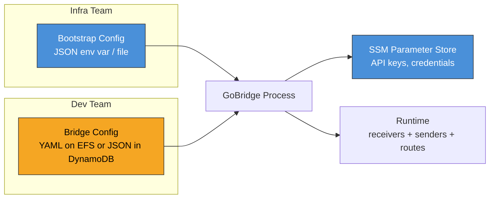

# Configuration on AWS

## Overview

GoBridge uses two configuration artifacts that separate deployment
concerns from application concerns. The **bootstrap config** controls
infrastructure-level settings (listen addresses, SSM parameter references,
topology). The **bridge config** defines the message routing logic (receivers,
senders, routes, sessions). This separation lets infrastructure teams manage
deployment parameters independently of the development team's routing rules.

For generic deployment considerations, see [Deployment Guide](../deployment-guide.md).
For architecture overview, see [AWS Overview](overview.md).

---

## Two Config Layers

These are two kinds of input, not an overlay stack. The bootstrap settings select
exactly one runtime `config.Layer` for the bridge document.



| Aspect | Bootstrap Config | Bridge Config |
|--------|------------------|---------------|
| **Owner** | Infrastructure / platform team | Development / application team |
| **Format** | JSON | YAML (or JSON) |
| **Delivery** | Environment variable or file | EFS mount or DynamoDB config table |
| **Mutability** | Immutable per task revision | Hot-reloadable at runtime |
| **Contains** | Listen addresses, SSM refs, topology | Receivers, senders, routes, sessions |
| **Sensitive data** | SSM parameter references for bootstrap API keys | Literal values or credential references; embedded literals are visible to artifact readers |

---

## Bootstrap Config Reference

The bootstrap config is defined by the `BootstrapConfig` struct in
`deployment/aws/infra/bootstrap.go`. You supply it as
inline JSON via the `GOBRIDGE_AWS_BOOTSTRAP_JSON` environment variable
or as a file path via `GOBRIDGE_AWS_BOOTSTRAP_FILE`.

With valid bootstrap settings, the control plane starts live but not ready and
the data plane stays idle until a valid bridge document can activate. An
optional embedded initial source can create an absent target during initial
startup; existing documents are never overwritten. After activation, standalone
deletion drains to idle and permits a later rebuild. Clustered deletion or
uncertain teardown requires process exit and replacement. Read failures retain
the last successful config as degraded.
See [initial configuration and observations](config-initialization.md).

An omitted or empty `config_source` means `file` in every topology, including
DynamoDB HA. Set it explicitly to `dynamodb` to select the config table; choosing
DynamoDB message stores alone does not change the config source.
DynamoDB polling defaults to 30 seconds.
Streams mode requires an enabled table stream and stream-read permissions; the
adapter falls back to polling when streams are unavailable. Library callers can
inject an emulator client with `WithDynamoDBClient`; the config loader, runtime
stores and derived streams client share its connection settings.

### Field Reference

| Field | Type | Required | Default | Description |
|-------|------|----------|---------|-------------|
| `bridge_id` | `string` | Yes | -- | Deployment identity used to select the config document and identify the control plane before a valid document activates. |
| `config_source` | `string` | No | `"file"` | Bridge config source: `"file"` or `"dynamodb"`. Empty normalizes to `"file"`. Single and DynamoDB HA CDK facades provision the config table and its role-scoped grants only when `"dynamodb"` is selected; the file source provisions no config table. The filesystem-replicated facade rejects DynamoDB at synth. Only control may initialize an absent document; workers remain read-only. No seeder container or S3 config asset is used. |
| `config_dynamodb` | `object` | For DynamoDB | -- | DynamoDB config-source settings: `table_name` (required at runtime; CDK provisions and overwrites it), `watch_mode` (`"poll"` by default or `"streams"`), and `stream_poll_interval` (optional positive Go duration for the streams `GetRecords` cadence). Must be absent for the file source. |
| `config_file_path` | `string` | For file | -- | Absolute path to bridge YAML or JSON. CDK defaults it to `<MountPath>/bridge.yaml` and requires it below the EFS mount; library callers may use a local file. Required at runtime for the file source and must be empty for DynamoDB. |
| `admin_api_key_param` | `string` | Yes | -- | SSM parameter name or `pms://` URI for the admin API key. Resolved at startup and on every config reload. The value is a single key or a JSON map of named keys — see [Admin key parameter value](#admin-key-parameter-value). |
| `node_role` | `string` | No | `"control"` | Configuration authority: `"control"` or `"worker"`. Only control may initialize or update shared config. File control uses the single-writer guard; DynamoDB updates use compare-and-swap (CAS). Workers have read-only config access in runtime wiring and deployed grants. The role does not select the monitor's failover role (`active`, `standby`, or `standalone`); either task family may process messages after activation. |
| `topology` | `string` | No | `"single"` | Deployment topology: `"single"` (one replica), `"filesystem_replicated"` (N replicas sharing EFS), or `"dynamodb_coordinated_ha"` (the active/warm-standby profile stamped by `GoBridgeDynamoDBHA`). The HA value additionally requires the four `dynamodb_ha_*` identities below. |
| `member_id` | `string` | No | `""` | This node's STABLE identity in a coordinated cluster rollout cohort. Required whenever the logical config sets `bridge.cluster.rollout: coordinated`, and it MUST appear verbatim in that config's `bridge.cluster.members`: the barrier freezes the roster as its membership epoch and counts acknowledgements against it, so an absent or drifting id aborts every rollout. Unlike `instance_id` it MUST survive a restart -- it is the cohort identity a restarted task rejoins under. Stamped per slot by `GoBridgeDynamoDBHA` when `MemberSlots` is set; empty for every non-coordinated deployment, including the autoscaled worker shape, whose interchangeable tasks have no such identity. |
| `dynamodb_ha_lease_table_name` | `string` | No | `""` | Deployment-owned expectation: the physical DynamoDB table backing `stores.lease`. Stamped only by `GoBridgeDynamoDBHA`; the runtime refuses to boot a logical config whose lease table differs, so a tampered or stale document from either config source cannot bypass synth-time admission. Required when `topology` is `"dynamodb_coordinated_ha"`. |
| `dynamodb_ha_outbox_table_name` | `string` | No | `""` | As above, for `stores.outbox`. Required when `topology` is `"dynamodb_coordinated_ha"`, and must differ from the other two table names. |
| `dynamodb_ha_managed_subscriptions_table_name` | `string` | No | `""` | As above, for `stores.managed_subscriptions`. Required when `topology` is `"dynamodb_coordinated_ha"`, and must differ from the other two table names. |
| `dynamodb_ha_config_fingerprint` | `string` | No | `""` | 64-character SHA-256 hex of the IMMUTABLE deployment profile: `deployment_mode`, the `bridge.cluster` shape, and the identity of every deployment-owned store. It is NOT a hash of the whole document, so every later operator config change still matches it while every deployment-provisioned change moves it. Required (and validated for shape) when `topology` is `"dynamodb_coordinated_ha"`. |
| `dynamodb_ha_baseline_config_digest` | `string` | No | `""` | 64-character SHA-256 hex digest identifying the content this deployment admitted. Both file and DynamoDB sources use `bridge.DeploymentBaselineContentDigest`, which normalizes only the top-level `version` to zero for comparison. Initialization assigns target version 1 independently of the embedded version; every editable field remains covered. A coordinated member uses this identity to establish the generation-zero committed artifact before serving. That artifact retains the actual stored version and full, version-sensitive `bridge.ConfigArtifactDigest`. Empty disables baseline seeding; malformed values fail startup. |
| `dynamodb_ha_rollout_table_name` | `string` | No | `""` (adapter default `gobridge-rollouts`) | DynamoDB table backing the coordinated rollout barrier's shared state: the current proposal, the per-member acknowledgements, and the durable last-committed config artifact. Read only when the logical config sets `bridge.cluster.rollout: coordinated`. `GoBridgeDynamoDBHA` provisions the table and stamps its name when `MemberSlots` is set, deriving it as `<bridge.id>-rollouts` from the shared config document. The task role is granted only `dynamodb:GetItem` and `dynamodb:PutItem` on it, so the runtime's best-effort `CreateTable` preflight is denied and logged on every boot -- expected, because the deployment owns the table. |
| `poll_interval` | `string` | No | `"1s"` (file), `"30s"` (DynamoDB) | Go duration string for how often the poll watcher checks the selected config source for changes. Empty, unparseable, or non-positive values use the source-specific default. |
| `container_memory_bytes` | `uint64` | No | `1073741824` | Runtime container hard limit used by the MQTT memory profile. CDK overwrites this field from the effective Fargate `MemoryMiB`; do not set it independently in CDK deployments. |
| `reserved_memory_bytes` | `uint64` | No | `0` | Non-MQTT memory already committed to other runtime components. This reservation plus the profile's 25% MQTT ingress allocation must leave at least 20% of `container_memory_bytes` as headroom. |
| `admin_addr` | `string` | No | `":8080"` | Listen address for the admin HTTP server. |
| `monitor_addr` | `string` | No | `":8081"` | Listen address for the monitor HTTP server. |
| `cors_origins` | `string` | No | `""` | Comma-separated CORS allowed origins. Empty disables CORS. Wildcard `*` is rejected. |
| `transport_http_addr` | `string` | No | `":8082"` | Listen address for the HTTP transport server (ingress/egress). |
| `monitor_api_key_param` | `string` | No | `""` | SSM parameter for the monitor API key. When empty, the admin key is used for monitor endpoints. |
| `http_receiver_api_key_params` | `map[string]string` | No | `{}` | Map of receiver ID to SSM parameter name. Resolves API keys for HTTP receiver endpoints. |
| `http_sender_api_key_params` | `map[string]string` | No | `{}` | Map of sender ID to SSM parameter name. Resolves API keys for HTTP sender (SSE) endpoints. |
| `aws_region` | `string` | No | `""` | Override AWS region for SSM and DynamoDB clients. Normally inherited from the task role / environment. |
| `ssm_endpoint` | `string` | No | `""` | Custom SSM endpoint URL. Requires `dev_mode: true`. Used for LocalStack or other local emulators. |
| `metrics_exporter` | `string` | No | `""` | Runtime metrics backend. `""` or `"noop"` emits nothing; `"cloudwatch"` publishes runtime metrics through the `adapters/aws/metrics/cloudwatch` exporter. Any other value fails validation. |
| `metrics_namespace` | `string` | No | `"GoBridge/Runtime"` | CloudWatch namespace used when `metrics_exporter` is `"cloudwatch"`. Empty defaults to `GoBridge/Runtime` (mirrors `domain/shared.MetricNamespace`). |
| `instance_id` | `string` | No | `""` | Value of the per-task `instance_id` metric dimension. Empty lets the exporter derive `"<hostname>-<pid>"`, already unique per Fargate task; set it for a deterministic operator-chosen identity. |
| `dev_mode` | `bool` | No | `false` | Enables local development features. Required when `ssm_endpoint` is set. Injects static test credentials for SSM. With a DynamoDB config source, calls `EnsureTable` at startup; production never creates the config table. |
| `credential_file_path` | `string` | No | `""` | Base directory backing `file://` credential URIs. Empty registers no file store (SSM `pms://` is always registered); set it to enable `file://` credentials in this profile. |
| `credential_poll_interval` | `string` | No | `"5m"` | Go duration string for the credential rotation poll cadence. Empty, unparseable, or non-positive falls back to 5 minutes. Shrink it to reduce the auth-failure window of a hard rotation. |
| `credential_poll_jitter` | `string` | No | ~10% of interval | Go duration of ±jitter applied per poll so a fleet does not stampede the secrets backend on the same tick. Empty or invalid defaults to a tenth of the effective poll interval; a parseable `"0"` disables jitter. |
| `credential_emit_on_start` | `bool` | No | `true` | Whether the poll wrapper emits an initial rotation on start. Default (unset → `true`) surfaces a rotation that landed in the build→watch window; set `false` to restore the legacy silent-baseline behavior. |
| `managed_subscription_baselines` | `map[string][]string` | No | `{}` | Per persistent or exclusive MQTT session, the exact topic filters its broker identity already holds; an empty list attests a new identity with no subscriptions. A durable session cannot start without its baseline. Once valid config is available, runtime seeds the configured local store before building the bridge. Seeding is idempotent and additive: remove obsolete filters from the attestation after runtime cleanup, or the next boot adds them again. Entries for sessions absent from the logical config are skipped with a warning; `GoBridgeSingle` rejects mismatched attestations at synth. `GoBridgeDynamoDBHA` creates its own DynamoDB baselines at deploy time and leaves this map empty. This operation is separate from initial configuration creation. See [MQTT durable sessions](../transports/mqtt-durable-sessions.md#managed-subscription-history). |

### Admin key parameter value

`admin_api_key_param` resolves to one string, read by shape so a single parameter
can carry either one operator key or a set of named keys:

| Value | Interpretation |
|-------|----------------|
| Plain string (first non-space byte is not `{`) | Legacy single admin key, folded under the name `admin`. |
| JSON object `{"alice":"<key>","bob":"<key>"}` | Named admin keys (name → key). Each name becomes the audit `Actor` when that key authenticates. |

Every key, including the folded `admin`, must be at least 16 characters; every
name must match `[a-z0-9._-]+` and be at most 64 characters. Malformed JSON whose
first non-space byte is `{` is a **hard startup error** — it is never treated as
a literal key. The same detection runs on reload, so rotating the parameter to a
JSON map (or back to a single key) needs no redeploy; a malformed value at
rotation time fails closed — the server then matches no key and rejects every
admin request until the value is corrected.

You populate the parameter (SecureString); the CDK constructs do not write it.
See [named admin keys](../http-api.md#named-admin-keys) for the audit and matching
semantics.

### Validation Rules

The bootstrap loader calls `Normalized()` to apply defaults and then `Validate()`.
Validation fails if:

- `bridge_id` is empty.
- `config_source` is not `"file"` or `"dynamodb"` after normalization.
- The file source has an empty `config_file_path` or a non-null `config_dynamodb`.
- The DynamoDB source has no `config_dynamodb.table_name`, has a non-empty
  `config_file_path`, or uses the `"filesystem_replicated"` topology.
- `config_dynamodb.watch_mode` is not empty, `"poll"`, or `"streams"`, or a
  supplied `config_dynamodb.stream_poll_interval` is not a positive Go duration.
- `admin_api_key_param` is empty.
- `node_role` is not `"control"` or `"worker"` (after normalization).
- `topology` is not `"single"`, `"filesystem_replicated"` or `"dynamodb_coordinated_ha"` (after normalization).
- `metrics_exporter` is set to anything other than `""`, `"noop"`, or `"cloudwatch"`.
- `ssm_endpoint` is set but `dev_mode` is `false`.
- `container_memory_bytes` is zero after normalization, or
  `reserved_memory_bytes` alone leaves less than 20% headroom.
- An included MQTT session cannot fit its payload, receive/dispatch window, raw
  predecode crossing packet, and route concurrency in its equal share of the 25%
  MQTT ingress reservation. Every session referenced by a `ReceiverDef` consumes
  one share even without a route. Every referenced Persistent/Exclusive session
  also consumes a deduplicated share with route concurrency zero because durable
  state may resume stale backlog before cleanup. Ephemeral sender-only sessions
  with no receiver/subscription do not consume a share.

When `metrics_exporter` is `"cloudwatch"`, the CDK base grants
`cloudwatch:PutMetricData` scoped by a `cloudwatch:namespace` condition to the
effective metrics namespace (`metrics_namespace`, or `GoBridge/Runtime` when
empty). No CloudWatch write permission is granted for the `noop` exporter.

---

## Bridge Config on EFS

With `config_source: file`, the bridge config lives on EFS mounted into every Fargate
task through an EFS access point. The access point pins a POSIX owner and
exposes the file-system root, so every task reads the config at the same
in-container path. A typical mapping:

| Layer | Path |
|-------|------|
| EFS access point root | `/` (the access point exposes the file-system root) |
| Container mount point | `/var/lib/gobridge` (access point mounted via the task-def EFS volume) |
| Bridge config file (in container) | `/var/lib/gobridge/bridge.yaml` |
| Bridge config file (raw EFS path) | `/bridge.yaml` (what a host mounting the file system directly sees) |
| `config_file_path` in bootstrap | `/var/lib/gobridge/bridge.yaml` (the in-container path the runtime reads) |

The control process can create the file using an
[embedded initial document](config-initialization.md). To update an existing
document, use a config transaction or an atomic external writer.

> **Pre-deploy checklist item — write atomically.** Whichever method you use,
> the writer MUST write to a temporary file on the same EFS file system and then
> `rename` it over `config_file_path` — never truncate and rewrite the file in
> place. The poll watcher can read a torn in-place write mid-flight; a
> partial-but-valid document carrying only `bridge.id` (an empty route graph is
> permitted — `config/validate.go`) swaps live and **stops forwarding
> traffic while `/health` and `/ready` stay green**. See
> [External config writers must write atomically](../runbooks/external-config-atomic-writes.md).

### CI/CD Pipeline

A CodeBuild step mounts the EFS file system and writes the config as part of
the deployment pipeline:

```bash
# In your buildspec.yml post_build phase
aws efs describe-mount-targets --file-system-id $EFS_ID
# Mount EFS via EFS mount helper (requires amazon-efs-utils)
mount -t efs -o tls $EFS_ID:/ /mnt/efs
# The access point roots at "/", so this is the container's /var/lib/gobridge/bridge.yaml
tmp=$(mktemp /mnt/efs/.bridge.yaml.XXXXXX)
cp bridge.yaml "$tmp"
mv "$tmp" /mnt/efs/bridge.yaml
umount /mnt/efs
```

This approach is best when config changes go through the same review and CI
process as code changes.

### Manual via AWS CLI

For ad-hoc updates or debugging, mount EFS from a bastion host or Cloud9
environment:

```bash
# Install the EFS mount helper
sudo yum install -y amazon-efs-utils

# Mount
sudo mkdir -p /mnt/efs
sudo mount -t efs -o tls fs-0123456789abcdef0:/ /mnt/efs

# Write config (access point roots at "/", so this is the container's /var/lib/gobridge/bridge.yaml)
tmp=$(sudo mktemp /mnt/efs/.bridge.yaml.XXXXXX)
sudo cp bridge.yaml "$tmp"
sudo mv "$tmp" /mnt/efs/bridge.yaml

# Unmount
sudo umount /mnt/efs
```

These commands replace an existing document. Validate the staged config first;
for clustered deployments, follow the
[cluster rollout procedure](../runbooks/cluster-config-rollout.md) before writing.
For an absent target, authenticated `POST /api/v1/admin/config` accepts a
complete YAML or JSON document through the registry-aware decoder and strict
creation capability. It is not an update transaction against a missing
document. See [initial-create outcomes](config-initialization.md#operator-creation-and-rollout).

You can update existing bridge config through the admin API config-transaction
flow, which writes the new config durably and applies it in-band to the running
runtime. There is **no `PUT /config` endpoint**: config changes go through a
transaction (open → patch → commit), and the commit does the check-and-set on
the `version` field. See [HTTP API — Config transactions](../http-api-admin.md#config-transactions)
for the full endpoint contract and commit outcomes.

```bash
API=https://bridge.internal:8080
KEY="$ADMIN_API_KEY"

# 1. Open a transaction against the current version.
TXN=$(curl -s -X POST -H "X-API-Key: $KEY" \
  "$API/api/v1/admin/config/transactions" | jq -r .txn_id)

# 2. Stage a partial BridgeConfig overlay. PATCH is merge-only and cannot carry
#    a plugin `options` block (an unknown field -> HTTP 400) or clear a field.
curl -s -X PATCH -H "X-API-Key: $KEY" -H "Content-Type: application/json" \
  "$API/api/v1/admin/config/transactions/$TXN" \
  -d '{"routes":[{"id":"orders","receiver_id":"in","bindings":["to-sqs"]}]}'

# 3. Inspect the pending, redacted preview.
curl -s -H "X-API-Key: $KEY" \
  "$API/api/v1/admin/config/transactions/$TXN"

# 4. Commit: validate, CAS on version, persist, then apply in-band.
curl -s -X POST -H "X-API-Key: $KEY" \
  "$API/api/v1/admin/config/transactions/$TXN/commit"
```

To abandon a pending change during a bad rollout, discard the transaction
instead of committing it — the running runtime is untouched:

```bash
curl -s -X DELETE -H "X-API-Key: $KEY" \
  "$API/api/v1/admin/config/transactions/$TXN"
```

A commit persists to `config_file_path` on EFS and returns a `status`
(`committed`, `committed_applying`, `rolled_back`, `committed_not_applied`) —
[read the outcome table](../http-api-admin.md#config-transactions) before treating a
non-200 as success. To roll a committed change back, open a new transaction and
re-commit the previous config, or restore the file at its source (see
[Config rollback](../runbooks/config-rollback.md)).

---

Hot-reload mechanics and the production update procedure are on their own page: [Hot-reload and production config updates](config-reload.md).

## Environment Variable Injection

The CDK construct serializes the entire `BootstrapConfig` as a JSON string
and injects it into the ECS task definition as the
`GOBRIDGE_AWS_BOOTSTRAP_JSON` environment variable. At startup, the
bootstrap library reads and parses this variable.

### Complete Example

```json
{
  "bridge_id": "orders-bridge-prod",
  "config_file_path": "/var/lib/gobridge/bridge.yaml",
  "topology": "single",
  "node_role": "control",
  "poll_interval": "10s",
  "admin_addr": ":8080",
  "monitor_addr": ":8081",
  "transport_http_addr": ":8082",
  "admin_api_key_param": "/gobridge/prod/admin-api-key",
  "monitor_api_key_param": "/gobridge/prod/monitor-api-key",
  "http_receiver_api_key_params": {
    "webhook-receiver": "/gobridge/prod/webhook-api-key"
  },
  "http_sender_api_key_params": {
    "sse-sender": "/gobridge/prod/sse-api-key"
  }
}
```

### Loading Precedence

The bootstrap library checks environment variables in this order:

1. `GOBRIDGE_AWS_BOOTSTRAP_JSON` -- inline JSON string. Used when set.
2. `GOBRIDGE_AWS_BOOTSTRAP_FILE` -- path to a JSON file on disk.

If neither is set, startup fails with an error. The inline JSON approach is
preferred for ECS because it avoids an additional file mount and keeps
the bootstrap config versioned with the task definition.

### File Size Limit

The bootstrap config file (when using `GOBRIDGE_AWS_BOOTSTRAP_FILE`)
is limited to **1 MiB** to prevent accidental or malicious memory exhaustion.

---

## Topology Modes

The `topology` field in the bootstrap config controls how multiple bridge
replicas coordinate. Choose the topology that matches your availability and
feature requirements.

| Feature | `single` | `filesystem_replicated` | `dynamodb_coordinated_ha` |
|---------|----------|-------------------------|---------------------------|
| Replicas | 1 | Control + N workers | Control + at least 2 workers |
| Config source | `file` (default) or `dynamodb` | `file` only | `file` (default) or `dynamodb` |
| Config writes | Control only | Control only; workers read-only | Control only; workers read-only, including with CAS |
| EFS | Required for file config or SQLite paths | Required | Omitted with DynamoDB config and DynamoDB stores |
| `shared_outbox` routes | Yes | No | Required for coordinated routes |
| Route session leases | Yes | No | Required for coordinated routes |
| `deployment_mode: clustered` | Yes | Yes | Required |
| `bridge.cluster.endpoints` | Optional | Optional | Static endpoints rejected; ECS resolver supplies them |
| Config update propagation | Normal standalone reload rules | Poll detection; clustered changes require cohort replacement | Source watch plus coordinated rollout with static member slots; otherwise cohort replacement |

### Single Topology

The `single` topology runs one Fargate task. It supports the full feature
set including `shared_outbox` delivery mode and route session leases. This
is the simplest deployment and is appropriate when your throughput fits within
a single task.

### Filesystem-Replicated Topology

The `filesystem_replicated` topology runs N Fargate tasks that all mount the
same EFS file system. Each replica independently polls the bridge config file
and builds its own runtime. This provides independent horizontal scaling, not
coordinated high availability, with these restrictions:

- **No `shared_outbox` routes.** Durable outbox delivery requires distributed
  state coordination. Use `direct_hold` delivery mode instead, or switch to
  the `GoBridgeDynamoDBHA` topology. Config source and message-state stores are
  separate choices.
- **No route session leases.** Lease-based route ownership requires a shared
  lease store. Routes run on all replicas simultaneously.

The `validateFilesystemProfile` function enforces these constraints at config
load time. If a bridge config contains `shared_outbox` routes or route
session definitions, the reload is rejected with a descriptive error.

See [CDK Scenario 5](../scenarios/cdk/05-multi-bridge-cluster.md) for a
`filesystem_replicated` deployment example.

### DynamoDB-Coordinated HA Topology

`GoBridgeDynamoDBHA` uses DynamoDB lease, outbox, and managed-subscription stores
for active/warm-standby coordination. It accepts either config source; selecting
`dynamodb` for config removes EFS when no SQLite paths are used. The config table
is separate from the HA data tables and the optional rollout table. See
[topology and worker-shape rules](topologies.md).

---

## Minimal Bridge Config Example

For reference, here is a minimal bridge config YAML that pairs with the
bootstrap JSON shown above:

```yaml
version: 1
bridge:
  id: orders-bridge-prod
  deployment_mode: standalone
  # Process shutdown budget on SIGTERM; in this image the runtime drain
  # (drain_timeout) runs inside it, so keep this above the drain budgets below.
  shutdown_timeout: "45s"
  drain_timeout: "30s"
  # Outbox drain batch ceiling (distinct from drain_timeout, which bounds
  # Runtime.Stop): min(batchCount * per_record_drain_timeout, max_drain_timeout).
  per_record_drain_timeout: "3s"
  max_drain_timeout: "20s"
  log_level: info

stores:
  dlq:
    type: dynamodb
    options:
      table_name: gobridge-dlq

sessions:
  - id: mqtt-session
    transport: mqtt
    options:
      session:
        broker_url: "ssl://broker.example.com:8883"
        client_id: "orders-bridge"
      credentials_uri: "pms://gobridge/prod/mqtt-credentials"

receivers:
  - id: sqs-receiver
    transport: sqs
    options:
      queue_name: orders

senders:
  - id: mqtt-sender
    transport: mqtt
    session_id: mqtt-session

bindings:
  - id: mqtt-binding
    sender_id: mqtt-sender
    # Naming the session on the binding is what makes the bridge manage it:
    # a session nobody manages never connects, and every publish fails.
    session_id: mqtt-session
    address: "devices/{{.Header.device_id}}/commands"

routes:
  - id: sqs-to-mqtt
    receiver_id: sqs-receiver
    bindings: [mqtt-binding]
    policy:
      max_in_flight: 50
      on_permanent_failure: dlq
```

For the complete field-by-field reference of all bridge config options, see
[Configuration Reference](../configuration-reference.md).

Embedded SQS config uses stable physical queue names or `queue_tags` with an
optional `queue_name_prefix`; all embedded queue URLs are rejected.
Use binding address `sqs:queue` for a tag-selected sender. See
[queue references](config-initialization.md#queue-references-in-embedded-documents).
