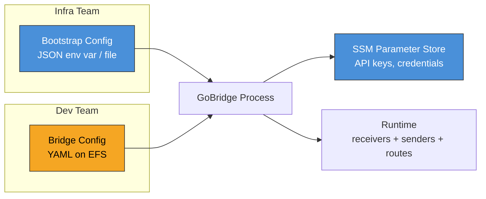
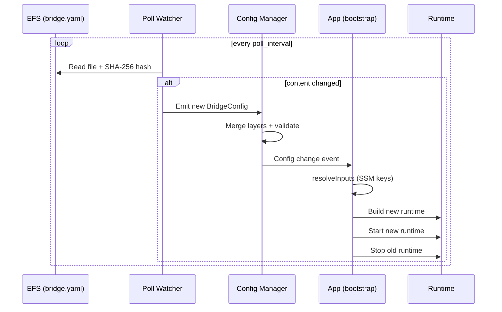
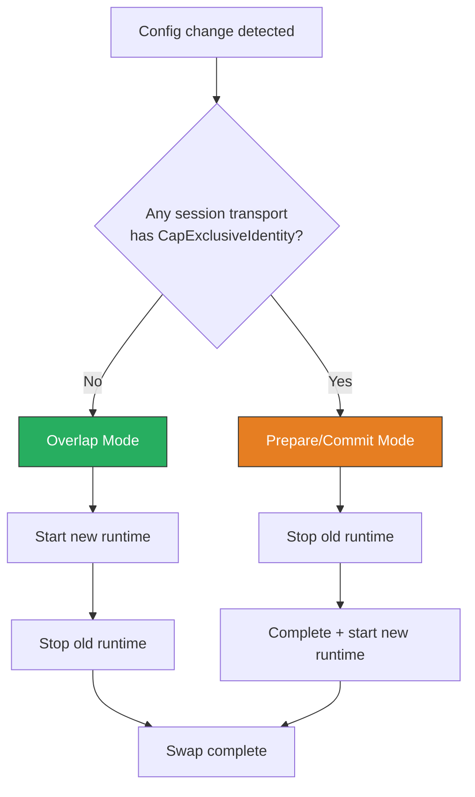

# Configuration on AWS

GoBridge uses a two-layer configuration model that separates deployment
concerns from application concerns. The **bootstrap config** controls
infrastructure-level settings (listen addresses, SSM parameter references,
topology). The **bridge config** defines the message routing logic (receivers,
senders, routes, sessions). This separation lets infrastructure teams manage
deployment parameters independently of the development team's routing rules.

For generic deployment considerations, see [Deployment Guide](../deployment-guide.md).
For architecture overview, see [AWS Overview](overview.md).

---

## Two Config Layers



| Aspect | Bootstrap Config | Bridge Config |
|--------|------------------|---------------|
| **Owner** | Infrastructure / platform team | Development / application team |
| **Format** | JSON | YAML (or JSON) |
| **Delivery** | Environment variable or file | EFS mount |
| **Mutability** | Immutable per task revision | Hot-reloadable at runtime |
| **Contains** | Listen addresses, SSM refs, topology | Receivers, senders, routes, sessions |
| **Sensitive data** | SSM parameter *references* only | No secrets (resolved at runtime) |

---

## Bootstrap Config Reference

The bootstrap config is defined by the `BootstrapConfig` struct in
`deployment/aws-filebased-config/infra/bootstrap.go`. You supply it as
inline JSON via the `GOBRIDGE_FILEBASED_BOOTSTRAP_JSON` environment variable
or as a file path via `GOBRIDGE_FILEBASED_BOOTSTRAP_FILE`.

### Field Reference

| Field | Type | Required | Default | Description |
|-------|------|----------|---------|-------------|
| `bridge_id` | `string` | Yes | -- | Unique identifier for this bridge instance. Used as the `bridge.id` in the default logical config when no bridge config file exists yet. |
| `config_file_path` | `string` | Yes | -- | Absolute path to the bridge config YAML as seen inside the container (the EFS mount point), e.g. `/var/lib/gobridge/bridge.yaml`. |
| `admin_api_key_param` | `string` | Yes | -- | SSM parameter name or `pms://` URI for the admin API key. Resolved at startup and on every config reload. The value is a single key or a JSON map of named keys — see [Admin key parameter value](#admin-key-parameter-value). |
| `node_role` | `string` | No | `"control"` | Role of this node: `"control"` or `"worker"`. **Reserved / non-operative at runtime** -- every node starts the transport, admin, and monitor servers regardless of this value. Validated for shape and consumed only at deploy time by the CDK single/cluster facades (per-service role + synth validation). Reserved for future multi-node coordination. |
| `topology` | `string` | No | `"single"` | Deployment topology: `"single"` (one replica) or `"filesystem_replicated"` (N replicas sharing EFS). |
| `poll_interval` | `string` | No | `"1s"` | Go duration string for how often the poll watcher checks the bridge config file for changes. |
| `container_memory_bytes` | `uint64` | No | `1073741824` | Runtime container hard limit used by the MQTT memory profile. CDK overwrites this field from the effective Fargate `MemoryMiB`; do not set it independently in CDK deployments. |
| `reserved_memory_bytes` | `uint64` | No | `0` | Non-MQTT memory already committed to other runtime components. This reservation plus the profile's 25% MQTT ingress allocation must leave at least 20% of `container_memory_bytes` as headroom. |
| `admin_addr` | `string` | No | `":8080"` | Listen address for the admin HTTP server. |
| `monitor_addr` | `string` | No | `":8081"` | Listen address for the monitor HTTP server. |
| `cors_origins` | `string` | No | `""` | Comma-separated CORS allowed origins. Empty disables CORS. Wildcard `*` is rejected. |
| `transport_http_addr` | `string` | No | `":8082"` | Listen address for the HTTP transport server (ingress/egress). |
| `monitor_api_key_param` | `string` | No | `""` | SSM parameter for the monitor API key. When empty, the admin key is used for monitor endpoints. |
| `http_receiver_api_key_params` | `map[string]string` | No | `{}` | Map of receiver ID to SSM parameter name. Resolves API keys for HTTP receiver endpoints. |
| `http_sender_api_key_params` | `map[string]string` | No | `{}` | Map of sender ID to SSM parameter name. Resolves API keys for HTTP sender (SSE) endpoints. |
| `aws_region` | `string` | No | `""` | Override AWS region for SSM calls. Normally inherited from the task role / environment. |
| `ssm_endpoint` | `string` | No | `""` | Custom SSM endpoint URL. Requires `dev_mode: true`. Used for LocalStack or other local emulators. |
| `metrics_exporter` | `string` | No | `""` | Runtime metrics backend. `""` or `"noop"` emits nothing; `"cloudwatch"` publishes runtime metrics through the `adapters/aws/metrics/cloudwatch` exporter. Any other value fails validation. |
| `metrics_namespace` | `string` | No | `"GoBridge/Runtime"` | CloudWatch namespace used when `metrics_exporter` is `"cloudwatch"`. Empty defaults to `GoBridge/Runtime` (mirrors `domain/shared.MetricNamespace`). |
| `instance_id` | `string` | No | `""` | Value of the per-task `instance_id` metric dimension. Empty lets the exporter derive `"<hostname>-<pid>"`, already unique per Fargate task; set it for a deterministic operator-chosen identity. |
| `dev_mode` | `bool` | No | `false` | Enables local development features. Required when `ssm_endpoint` is set. Injects static test credentials for SSM. |
| `credential_file_path` | `string` | No | `""` | Base directory backing `file://` credential URIs. Empty registers no file store (SSM `pms://` is always registered); set it to enable `file://` credentials in this profile. |
| `credential_poll_interval` | `string` | No | `"5m"` | Go duration string for the credential rotation poll cadence. Empty, unparseable, or non-positive falls back to 5 minutes. Shrink it to reduce the auth-failure window of a hard rotation. |
| `credential_poll_jitter` | `string` | No | ~10% of interval | Go duration of ±jitter applied per poll so a fleet does not stampede the secrets backend on the same tick. Empty or invalid defaults to a tenth of the effective poll interval; a parseable `"0"` disables jitter. |
| `credential_emit_on_start` | `bool` | No | `true` | Whether the poll wrapper emits an initial rotation on start. Default (unset → `true`) surfaces a rotation that landed in the build→watch window; set `false` to restore the legacy silent-baseline behavior. |

### Admin key parameter value

`admin_api_key_param` resolves to one string, read by shape so a single parameter
can carry either one operator key or a set of named keys:

| Value | Interpretation |
|-------|----------------|
| Plain string (first non-space byte is not `{`) | Legacy single admin key, folded under the name `admin`. |
| JSON object `{"alice":"<key>","bob":"<key>"}` | Named admin keys (name → key). Each name becomes the audit `Actor` when that key authenticates. |

Every key, including the folded `admin`, must be at least 16 characters; every
name must match `[a-z0-9._-]+` and be at most 64 characters. Malformed JSON whose
first non-space byte is `{` is a **hard startup error** — it is never treated as
a literal key. The same detection runs on reload, so rotating the parameter to a
JSON map (or back to a single key) needs no redeploy; a malformed value at
rotation time fails closed — the server then matches no key and rejects every
admin request until the value is corrected.

You populate the parameter (SecureString); the CDK constructs do not write it.
See [named admin keys](../http-api.md#named-admin-keys) for the audit and matching
semantics.

### Validation Rules

The bootstrap loader calls `Normalized()` to apply defaults and then `Validate()`.
Validation fails if:

- `bridge_id` is empty.
- `config_file_path` is empty.
- `admin_api_key_param` is empty.
- `node_role` is not `"control"` or `"worker"` (after normalization).
- `topology` is not `"single"` or `"filesystem_replicated"` (after normalization).
- `metrics_exporter` is set to anything other than `""`, `"noop"`, or `"cloudwatch"`.
- `ssm_endpoint` is set but `dev_mode` is `false`.
- `container_memory_bytes` is zero after normalization, or
  `reserved_memory_bytes` alone leaves less than 20% headroom.
- An included MQTT session cannot fit its payload, receive/dispatch window, raw
  predecode crossing packet, and route concurrency in its equal share of the 25%
  MQTT ingress reservation. Every session referenced by a `ReceiverDef` consumes
  one share even without a route. Every referenced Persistent/Exclusive session
  also consumes a deduplicated share with route concurrency zero because durable
  state may resume stale backlog before cleanup. Ephemeral sender-only sessions
  with no receiver/subscription do not consume a share.

When `metrics_exporter` is `"cloudwatch"`, the CDK base grants
`cloudwatch:PutMetricData` scoped by a `cloudwatch:namespace` condition to the
effective metrics namespace (`metrics_namespace`, or `GoBridge/Runtime` when
empty). No CloudWatch write permission is granted for the `noop` exporter.

---

## Bridge Config on EFS

The bridge config YAML lives on an EFS file system mounted into every Fargate
task through an EFS access point. The access point pins a POSIX owner and
exposes the file-system root, so every task reads the config at the same
in-container path. A typical mapping:

| Layer | Path |
|-------|------|
| EFS access point root | `/` (the access point exposes the file-system root) |
| Container mount point | `/var/lib/gobridge` (access point mounted via the task-def EFS volume) |
| Bridge config file (in container) | `/var/lib/gobridge/bridge.yaml` |
| Bridge config file (raw EFS path) | `/bridge.yaml` (what a host mounting the file system directly sees) |
| `config_file_path` in bootstrap | `/var/lib/gobridge/bridge.yaml` (the in-container path the runtime reads) |

You should write the bridge config to EFS using one of the following methods.

> **Pre-deploy checklist item — write atomically.** Whichever method you use,
> the writer MUST write to a temporary file on the same EFS file system and then
> `rename` it over `config_file_path` — never truncate and rewrite the file in
> place. The poll watcher can read a torn in-place write mid-flight; a
> partial-but-valid document carrying only `bridge.id` (an empty route graph is
> permitted — `config/validate.go:47-63`) swaps live and **stops forwarding
> traffic while `/health` and `/ready` stay green**. See
> [External config writers must write atomically](../runbooks/external-config-atomic-writes.md).
> The `cp` commands below overwrite in place; replace them with a
> temp-file-plus-`mv` on the same mount for production writers.

### Init Container

Add an init container to the ECS task definition that copies the config from
S3, a CodeArtifact archive, or an embedded default:

```json
{
  "name": "config-init",
  "image": "amazon/aws-cli:latest",
  "essential": false,
  "command": [
    "s3", "cp",
    "s3://my-config-bucket/gobridge/bridge.yaml",
    "/var/lib/gobridge/bridge.yaml"
  ],
  "mountPoints": [
    {
      "sourceVolume": "gobridge-efs",
      "containerPath": "/var/lib/gobridge"
    }
  ]
}
```

The main container declares a `dependsOn` with condition `SUCCESS` on the
init container.

### CI/CD Pipeline

A CodeBuild step mounts the EFS file system and writes the config as part of
the deployment pipeline:

```bash
# In your buildspec.yml post_build phase
aws efs describe-mount-targets --file-system-id $EFS_ID
# Mount EFS via EFS mount helper (requires amazon-efs-utils)
mount -t efs -o tls $EFS_ID:/ /mnt/efs
# The access point roots at "/", so this is the container's /var/lib/gobridge/bridge.yaml
cp bridge.yaml /mnt/efs/bridge.yaml
umount /mnt/efs
```

This approach is best when config changes go through the same review and CI
process as code changes.

### Manual via AWS CLI

For ad-hoc updates or debugging, mount EFS from a bastion host or Cloud9
environment:

```bash
# Install the EFS mount helper
sudo yum install -y amazon-efs-utils

# Mount
sudo mkdir -p /mnt/efs
sudo mount -t efs -o tls fs-0123456789abcdef0:/ /mnt/efs

# Write config (access point roots at "/", so this is the container's /var/lib/gobridge/bridge.yaml)
sudo cp bridge.yaml /mnt/efs/bridge.yaml

# Unmount
sudo umount /mnt/efs
```

You can also update bridge config through the admin API config-transaction
flow, which writes the new config durably and applies it in-band to the running
runtime. There is **no `PUT /config` endpoint**: config changes go through a
transaction (open → patch → commit), and the commit does the check-and-set on
the `version` field. See [HTTP API — Config transactions](../http-api.md#config-transactions)
for the full endpoint contract and commit outcomes.

```bash
API=https://bridge.internal:8080
KEY="$ADMIN_API_KEY"

# 1. Open a transaction against the current version.
TXN=$(curl -s -X POST -H "X-API-Key: $KEY" \
  "$API/api/v1/admin/config/transactions" | jq -r .txn_id)

# 2. Stage a partial BridgeConfig overlay. PATCH is merge-only and cannot carry
#    a plugin `options` block (an unknown field -> HTTP 400) or clear a field.
curl -s -X PATCH -H "X-API-Key: $KEY" -H "Content-Type: application/json" \
  "$API/api/v1/admin/config/transactions/$TXN" \
  -d '{"routes":[{"id":"orders","receiver_id":"in","bindings":["to-sqs"]}]}'

# 3. Inspect the pending, redacted preview.
curl -s -H "X-API-Key: $KEY" \
  "$API/api/v1/admin/config/transactions/$TXN"

# 4. Commit: validate, CAS on version, persist, then apply in-band.
curl -s -X POST -H "X-API-Key: $KEY" \
  "$API/api/v1/admin/config/transactions/$TXN/commit"
```

To abandon a pending change during a bad rollout, discard the transaction
instead of committing it — the running runtime is untouched:

```bash
curl -s -X DELETE -H "X-API-Key: $KEY" \
  "$API/api/v1/admin/config/transactions/$TXN"
```

A commit persists to `config_file_path` on EFS and returns a `status`
(`committed`, `committed_applying`, `rolled_back`, `committed_not_applied`) —
[read the outcome table](../http-api.md#config-transactions) before treating a
non-200 as success. To roll a committed change back, open a new transaction and
re-commit the previous config, or restore the file at its source (see
[Config rollback](../runbooks/config-rollback.md)).

---

## Hot-Reload

GoBridge watches the bridge config file for changes using a poll-based
watcher. When the file content changes, the runtime is rebuilt and swapped
in without process restart.

### Reload Sequence



### Why Poll Mode Instead of Notify

The bootstrap library forces **poll mode** (`ModePoll`) for file watching.
The default `notify` mode uses `fsnotify` (kernel inotify/kqueue events),
which does not reliably propagate across NFS mounts. EFS is an NFS-based
file system, so writes from one Fargate task or an external writer may not
trigger inotify events on other tasks. Poll mode reads the file at a fixed
interval and compares SHA-256 hashes, which works reliably regardless of the
underlying filesystem.

### Poll Interval Tuning

| Environment | Recommended `poll_interval` | Rationale |
|-------------|----------------------------|-----------|
| Development | `"1s"` (default) | Fast feedback during local iteration. |
| Staging | `"5s"` | Balance between responsiveness and EFS read cost. |
| Production | `"5s"` to `"30s"` | Lower EFS I/O; config changes are infrequent. |

### Swap Modes

When a config change is detected, the bootstrap library must swap the old
runtime for the new one. The swap strategy is **auto-detected** based on the
transport capabilities declared by the registered factories.

**Overlap mode** (default): The new runtime is started first, then the old
runtime is stopped. This provides zero-downtime for stateless transports
like HTTP and SQS where multiple concurrent listeners are safe.

**Prepare/commit mode**: The old runtime is stopped first, then the new
runtime is built and started. This is required for transports that declare
the `CapExclusiveIdentity` capability (e.g. MQTT), where two simultaneous
connections with the same client ID would cause disconnects.



If the new runtime fails to start in prepare/commit mode, the bootstrap
library attempts to **recover the previous configuration** by rebuilding and
restarting the old runtime. This prevents a bad config push from leaving the
bridge in a stopped state.

---

## Config Updates in Production

Follow this workflow for safe configuration updates in production.

### Update Flow

1. **Update the YAML on EFS.** Use CI/CD, a manual mount, or the admin API
   config-transaction flow (open → patch → commit). The commit enforces
   optimistic concurrency via the `version` field (check-and-set). There is no
   `PUT /config` endpoint — see
   [HTTP API — Config transactions](../http-api.md#config-transactions).

2. **Poll watcher detects the change.** Within one `poll_interval` cycle, the
   watcher reads the file, computes the SHA-256 hash, and detects the
   difference.

3. **Config is parsed and validated.** The YAML is deserialized into a
   `BridgeConfig` struct. The `validateFilesystemProfile` function checks
   topology constraints (e.g. `shared_outbox` routes are rejected under
   `filesystem_replicated` topology).

4. **SSM parameters are resolved.** The `resolveInputs` function reads
   `admin_api_key_param`, `monitor_api_key_param`, and any
   `http_receiver_api_key_params` / `http_sender_api_key_params` from SSM
   Parameter Store with decryption.

5. **New runtime is built and swapped in.** The appropriate swap mode
   (overlap or prepare/commit) is selected and the runtime is replaced.

6. **If validation or build fails:** The change is rejected, the last good
   runtime continues running, and a warning is logged:
   ```
   bootstrap: config reload rejected; keeping last good runtime  error="..."
   ```

### The Version Field

The `version` field in `BridgeConfig` is an integer counter incremented on
each config commit via the admin API. When multiple instances share the same
config file on EFS, this field provides optimistic concurrency control:

```yaml
version: 7
bridge:
  id: my-bridge
  deployment_mode: clustered
# ...
```

A config-transaction commit includes the current `version` value. The write
succeeds only if the on-disk version matches. If another instance updated the
file first, the commit fails with a conflict (`409`), and you should re-read
and retry. A `version` of `0` (or absent) means the config has never been
committed through the API.

---

## Environment Variable Injection

The CDK construct serializes the entire `BootstrapConfig` as a JSON string
and injects it into the ECS task definition as the
`GOBRIDGE_FILEBASED_BOOTSTRAP_JSON` environment variable. At startup, the
bootstrap library reads and parses this variable.

### Complete Example

```json
{
  "bridge_id": "orders-bridge-prod",
  "config_file_path": "/var/lib/gobridge/bridge.yaml",
  "topology": "single",
  "node_role": "control",
  "poll_interval": "10s",
  "admin_addr": ":8080",
  "monitor_addr": ":8081",
  "transport_http_addr": ":8082",
  "admin_api_key_param": "/gobridge/prod/admin-api-key",
  "monitor_api_key_param": "/gobridge/prod/monitor-api-key",
  "http_receiver_api_key_params": {
    "webhook-receiver": "/gobridge/prod/webhook-api-key"
  },
  "http_sender_api_key_params": {
    "sse-sender": "/gobridge/prod/sse-api-key"
  }
}
```

### Loading Precedence

The bootstrap library checks environment variables in this order:

1. `GOBRIDGE_FILEBASED_BOOTSTRAP_JSON` -- inline JSON string. Used when set.
2. `GOBRIDGE_FILEBASED_BOOTSTRAP_FILE` -- path to a JSON file on disk.

If neither is set, startup fails with an error. The inline JSON approach is
preferred for ECS because it avoids an additional file mount and keeps
the bootstrap config versioned with the task definition.

### File Size Limit

The bootstrap config file (when using `GOBRIDGE_FILEBASED_BOOTSTRAP_FILE`)
is limited to **1 MiB** to prevent accidental or malicious memory exhaustion.

---

## Topology Modes

The `topology` field in the bootstrap config controls how multiple bridge
replicas coordinate. Choose the topology that matches your availability and
feature requirements.

| Feature | `single` | `filesystem_replicated` |
|---------|----------|-------------------------|
| Replicas | 1 | N |
| Config source | EFS (single writer) | EFS (shared, poll-synced) |
| `shared_outbox` routes | Yes | No |
| Route session leases | Yes | No |
| `deployment_mode: clustered` | Yes | Yes |
| `bridge.cluster.endpoints` | Optional | Recommended |
| Config update propagation | Immediate (single instance) | Within `poll_interval` |

### Single Topology

The `single` topology runs one Fargate task. It supports the full feature
set including `shared_outbox` delivery mode and route session leases. This
is the simplest deployment and is appropriate when your throughput fits within
a single task.

### Filesystem-Replicated Topology

The `filesystem_replicated` topology runs N Fargate tasks that all mount the
same EFS file system. Each replica independently polls the bridge config file
and builds its own runtime. This provides horizontal scaling and high
availability, but with restrictions:

- **No `shared_outbox` routes.** Durable outbox delivery requires distributed
  state coordination. Use `direct_hold` delivery mode instead, or switch to
  the HA/DynamoDB config profile.
- **No route session leases.** Lease-based route ownership requires a shared
  lease store. Routes run on all replicas simultaneously.

The `validateFilesystemProfile` function enforces these constraints at config
load time. If a bridge config contains `shared_outbox` routes or route
session definitions, the reload is rejected with a descriptive error.

See [CDK Scenario 5](../scenarios/cdk/05-multi-bridge-cluster.md) for a
`filesystem_replicated` deployment example.

---

## Minimal Bridge Config Example

For reference, here is a minimal bridge config YAML that pairs with the
bootstrap JSON shown above:

```yaml
version: 1
bridge:
  id: orders-bridge-prod
  deployment_mode: standalone
  shutdown_timeout: "30s"
  # Outbox drain batch ceiling (distinct from drain_timeout, which bounds
  # Runtime.Stop): min(batchCount * per_record_drain_timeout, max_drain_timeout).
  per_record_drain_timeout: "3s"
  max_drain_timeout: "30s"
  log_level: info

sessions:
  - id: mqtt-session
    transport: mqtt
    options:
      session:
        broker_url: "ssl://broker.example.com:8883"
        client_id: "orders-bridge"
      credentials_uri: "pms://gobridge/prod/mqtt-credentials"

receivers:
  - id: sqs-receiver
    transport: sqs
    options:
      queue_url: "https://sqs.eu-west-1.amazonaws.com/123456789012/orders"

senders:
  - id: mqtt-sender
    transport: mqtt
    session_id: mqtt-session

bindings:
  - id: mqtt-binding
    sender_id: mqtt-sender
    address: "devices/{{.Header.device_id}}/commands"

routes:
  - id: sqs-to-mqtt
    receiver_id: sqs-receiver
    bindings: [mqtt-binding]
    policy:
      max_in_flight: 50
      on_permanent_failure: dlq
```

For the complete field-by-field reference of all bridge config options, see
[Configuration Reference](../configuration-reference.md).
