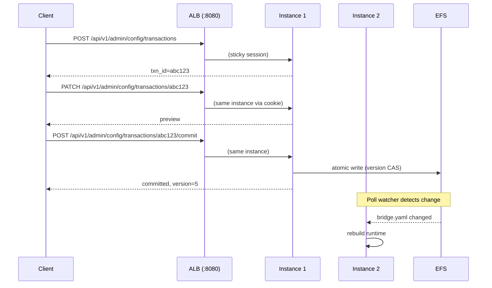
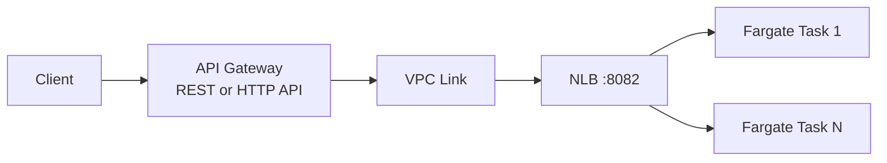
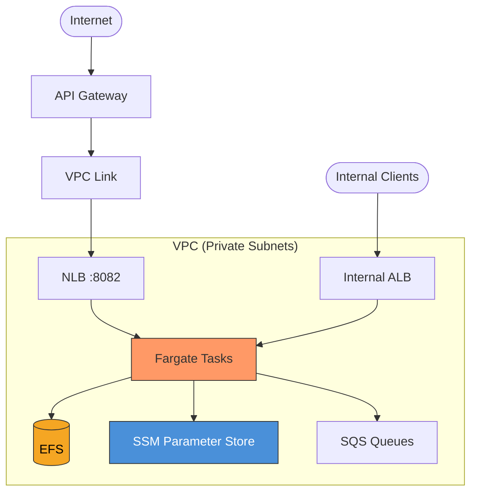

# HTTP API & Networking on AWS

GoBridge exposes three HTTP servers on separate ports: **admin**, **monitor**,
and **transport**. On AWS these are fronted by an internal Application Load
Balancer (ALB) and, optionally, an API Gateway for external access. This guide
covers port architecture, ALB configuration, config transactions with sticky
sessions, API Gateway integration, authentication, CORS, SSE egress, and the
overall network topology.

For port defaults and generic networking guidance, see
[Deployment Guide](../deployment-guide.md#networking-and-ports). For endpoint
details, see [Credentials & HTTP API](../credentials-and-http-api.md).

---

## Port Architecture

Each server listens on a dedicated port and maps to its own ALB target group.

| Port | Server | Default Address | Target Group | Health Check | Stickiness |
|------|--------|-----------------|--------------|--------------|------------|
| 8080 | Admin | `:8080` | `admin-tg` | Use monitor port (see below) | Recommended |
| 8081 | Monitor | `:8081` | `monitor-tg` | `GET /api/v1/monitor/live` | Not needed |
| 8082 | Transport | `:8082` | `transport-tg` | Use monitor port (see below) | Not needed |

Override default addresses with the `admin_addr`, `monitor_addr`, and
`transport_http_addr` fields in the `BootstrapConfig`.

> **Health check note:** The health probe endpoints (`/health`, `/live`,
> `/ready`) are registered only on the **monitor server** (port 8081). For
> **all three** ALB target groups (admin on 8080, monitor on 8081, transport on
> 8082), configure the health check to use port 8081 with path
> **`/api/v1/monitor/live`** — not `/health`. `/live` reports process liveness
> and stays 200 after a clean stop, so all three planes stay reachable while the
> bridge is paused or unhealthy; `/health` is a traffic-gating readiness signal
> and would drain the plane from the ALB exactly when an operator needs it — the
> admin API to start or diagnose the bridge, and the monitor API (`/deephealth`,
> `/topology`, `/routes`) to inspect why. Health-checking the **transport** plane
> on `/live` keeps a cleanly-stopped-but-alive instance in rotation (it will
> reject ingress until it resumes or is replaced), trading brief ingress errors
> during a rare deliberate pause for stable data-plane capacity across routine
> config swaps that briefly flip `/health`. The root `Dockerfile` defines a container `HEALTHCHECK` that runs
> the binary directly (`["/usr/local/bin/gobridge-filebased", "-healthcheck"]`)
> — the distroless image ships no shell, `curl`, or `wget`, so probe the binary,
> not a URL tool. The `-healthcheck` flag hits the local monitor `/live`
> endpoint.

---

## ALB Configuration

Use an **internal ALB** for admin and monitor traffic. Expose the transport
port externally only when HTTP ingress or SSE egress is required.

### Health Check Settings

| Setting | Value | Rationale |
|---------|-------|-----------|
| Interval | 15 s | Balances detection speed against probe overhead |
| Timeout | 5 s | Ample margin over the monitor health handler latency |
| Healthy threshold | 2 | Two consecutive passes before routing traffic |
| Unhealthy threshold | 2 | Two consecutive failures before draining |
| Path | `/api/v1/monitor/live` | Process-liveness signal; stays 200 after a clean stop, so the admin/transport target groups are not drained while the bridge is paused or unhealthy |
| Port override | `8081` | Health probes are on the monitor server only |
| Matcher | `200` | Only route traffic to live (non-terminal) instances |

### CDK Listener Rule Example

```go
import (
    elbv2 "github.com/aws/aws-cdk-go/awscdk/v2/awselasticloadbalancingv2"
    "github.com/aws/jsii-runtime-go"
)

// Internal ALB for admin and monitor traffic
alb := elbv2.NewApplicationLoadBalancer(stack, jsii.String("BridgeALB"),
    &elbv2.ApplicationLoadBalancerProps{
        Vpc:            vpc,
        InternetFacing: jsii.Bool(false),
    },
)

// Admin target group with sticky sessions
adminTG := elbv2.NewApplicationTargetGroup(stack, jsii.String("AdminTG"),
    &elbv2.ApplicationTargetGroupProps{
        Vpc:                vpc,
        Port:               jsii.Number(8080),
        Protocol:           elbv2.ApplicationProtocol_HTTP,
        TargetType:         elbv2.TargetType_IP,
        HealthCheck: &elbv2.HealthCheck{
            Path:                    jsii.String("/api/v1/monitor/live"), // liveness: keep admin reachable while paused/unhealthy
            Port:                    jsii.String("8081"),
            Interval:                awscdk.Duration_Seconds(jsii.Number(15)),
            Timeout:                 awscdk.Duration_Seconds(jsii.Number(5)),
            HealthyThresholdCount:   jsii.Number(2),
            UnhealthyThresholdCount: jsii.Number(2),
        },
        StickinessCookieDuration: awscdk.Duration_Minutes(jsii.Number(5)),
    },
)

// Listener on port 443 with path-based routing
listener := alb.AddListener(jsii.String("HTTPS"), &elbv2.BaseApplicationListenerProps{
    Port:        jsii.Number(443),
    Certificates: &[]elbv2.IListenerCertificate{cert},
})

listener.AddTargetGroups(jsii.String("AdminRule"), &elbv2.AddApplicationTargetGroupsProps{
    TargetGroups: &[]elbv2.IApplicationTargetGroup{adminTG},
    Conditions:   &[]elbv2.ListenerCondition{
        elbv2.ListenerCondition_PathPatterns(&[]*string{
            jsii.String("/api/v1/admin/*"),
        }),
    },
    Priority: jsii.Number(10),
})
```

See [CDK Scenario 2](../scenarios/cdk/02-custom-vpc.md) for a complete ALB
sticky session CDK example.

---

## Config Transactions & Load Balancing

The admin API exposes a **two-phase transaction model** for configuration
updates. Transaction state is held in memory on a single instance, which has
critical implications for load-balanced deployments.

### Transaction Flow



### Transaction Endpoints

| Method | Path | Description |
|--------|------|-------------|
| `GET` | `/api/v1/admin/config` | Current effective config (redacted) |
| `POST` | `/api/v1/admin/config/transactions` | Begin a new transaction (optional `ttl` in body) |
| `GET` | `/api/v1/admin/config/transactions/{txnID}` | Preview the merged config |
| `PATCH` | `/api/v1/admin/config/transactions/{txnID}` | Apply a config overlay |
| `POST` | `/api/v1/admin/config/transactions/{txnID}/commit` | Validate and write to disk |
| `DELETE` | `/api/v1/admin/config/transactions/{txnID}` | Rollback (discard) |

Transactions auto-expire after 5 minutes by default (max 30 minutes). Only one
transaction can be active at a time per instance.

### Plugin-Options Guard on Commit

A config overlay is a partial document merged over the current config. If a
`PATCH` overlay respecifies a receiver, sender, or session entry but omits its
typed plugin `options` (broker URL, credentials, and other transport settings),
the merge would erase them. The transaction manager refuses that commit and
returns **422** with `config commit would erase plugin options`, naming the
entry that would lose its options. Include the full `options` block for any
entry you respecify, or leave the entry out of the overlay entirely.

### Approaches for Multi-Instance Deployments

| Approach | How | Best for |
|----------|-----|----------|
| ALB sticky sessions | Cookie-based stickiness on `admin-tg` (5 min duration) | Multi-instance, API-driven config |
| Dedicated control node | `NodeRole: control` handles all admin traffic (single instance) | Cluster topology ([Scenario 5](../scenarios/cdk/05-multi-bridge-cluster.md)) |
| CI/CD pipeline | Write config to EFS directly, bypass admin API entirely | GitOps workflows |

### Version CAS (Check-and-Set)

On commit, the transaction manager reads the on-disk config version and
compares it against the version captured when the transaction was created. If
another instance committed a different version in the meantime, the commit
fails with `errVersionConflict` (HTTP 409):

```json
{
  "error": "config version conflict: expected version 4 but file has version 5; re-read the config and retry"
}
```

The client must re-read the current config, create a new transaction, re-apply
patches, and retry the commit.

### NFS/EFS Atomicity Caveat

On network filesystems the check-read and write are **not perfectly atomic**.
The version CAS provides best-effort protection against concurrent updates from
multiple instances, but there is a small race window. For concurrent
config management, use the **DynamoDB-backed config profile** instead, which
provides atomic conditional writes.

---

## API Gateway Integration

Use API Gateway to expose the transport port (`:8082`) externally while
keeping admin and monitor traffic on the internal ALB.

### REST API vs HTTP API

| Feature | REST API | HTTP API |
|---------|----------|----------|
| Cost | $3.50/M requests | $1.00/M requests |
| Usage plans / API keys | Yes | No |
| WAF integration | Yes | No |
| Request validation | Yes | No |
| Lambda authorizers | Yes | Yes |
| WebSocket support | No (use WebSocket API) | No |
| Latency | Higher | Lower |

**Recommendation:** Use **REST API** when you need usage plans, API keys, WAF,
or request validation. Use **HTTP API** for lower cost and latency.

### VPC Link + NLB Pattern

API Gateway requires a **Network Load Balancer (NLB)**, not an ALB, for VPC
Link integration. Deploy the NLB alongside the existing ALB, targeting the
same Fargate tasks on port 8082.



### OpenAPI Snippet for Transport Endpoints

```yaml
openapi: "3.0.3"
info:
  title: GoBridge Transport API
  version: "1.0"
paths:
  /transport/http/receivers/{id}/messages:
    post:
      summary: Ingest a message
      security:
        - apiKey: []
      parameters:
        - name: id
          in: path
          required: true
          schema:
            type: string
      requestBody:
        required: true
        content:
          application/json:
            schema:
              type: object
              required: [subject, payload]
              properties:
                subject:
                  type: string
                payload:
                  type: string
                  format: byte
                headers:
                  type: object
                expires_at:
                  type: string
                  format: date-time
      responses:
        "200":
          description: Message accepted
        "401":
          description: Invalid or missing API key
  /transport/http/senders/{id}/events:
    get:
      summary: SSE event stream
      security:
        - apiKey: []
      parameters:
        - name: id
          in: path
          required: true
          schema:
            type: string
      responses:
        "200":
          description: SSE stream
          content:
            text/event-stream: {}
components:
  securitySchemes:
    apiKey:
      type: apiKey
      in: header
      name: X-API-Key
```

### Usage Plans and API Keys (CDK)

```go
api := apigw.NewRestApi(stack, jsii.String("BridgeAPI"), &apigw.RestApiProps{
    RestApiName: jsii.String("gobridge-transport"),
    Deploy:      jsii.Bool(true),
})

plan := api.AddUsagePlan(jsii.String("Standard"), &apigw.UsagePlanProps{
    Name:     jsii.String("standard"),
    Throttle: &apigw.ThrottleSettings{
        RateLimit:  jsii.Number(100),
        BurstLimit: jsii.Number(200),
    },
    Quota: &apigw.QuotaSettings{
        Limit:  jsii.Number(10000),
        Period: apigw.Period_DAY,
    },
})

key := api.AddApiKey(jsii.String("ClientKey"), &apigw.ApiKeyOptions{
    ApiKeyName: jsii.String("client-1"),
})
plan.AddApiKey(key)
```

See [CDK Scenario 3](../scenarios/cdk/03-api-gateway.md) for the full API
Gateway CDK setup.

---

## Custom Domain

Route external traffic through a branded domain with TLS termination.

### Setup Steps

1. **Request an ACM certificate** in the same region as the API Gateway
   (or `us-west-1` for edge-optimized APIs).
2. **Create a custom domain name** on the API Gateway and attach the
   certificate.
3. **Map the base path** (e.g., `/v1`) to the deployed stage.
4. **Create a Route 53 alias record** pointing the custom domain to the
   API Gateway distribution.

```go
domain := apigw.NewDomainName(stack, jsii.String("APIDomain"),
    &apigw.DomainNameProps{
        DomainName:  jsii.String("api.example.com"),
        Certificate: cert,
        EndpointType: apigw.EndpointType_REGIONAL,
    },
)

domain.AddBasePathMapping(api, &apigw.BasePathMappingOptions{
    BasePath: jsii.String("v1"),
})

route53.NewARecord(stack, jsii.String("APIAlias"), &route53.ARecordProps{
    Zone:       zone,
    RecordName: jsii.String("api"),
    Target:     route53.RecordTarget_FromAlias(
        route53targets.NewApiGatewayDomain(domain),
    ),
})
```

---

## Authentication Patterns

GoBridge supports multiple authentication layers. Choose based on your
security requirements and operational model.

| Pattern | Scope | How it works | Best for |
|---------|-------|--------------|----------|
| `X-API-Key` header | Admin, Monitor, Transport | SSM-sourced key, SHA-256 constant-time comparison | Single-tenant, operator-managed |
| API Gateway API keys | Transport (via APIGW) | APIGW validates key before forwarding; `x-api-key` header | Multi-tenant with usage plans |
| Lambda authorizer | Transport (via APIGW) | Custom Lambda validates JWT/OAuth token | OAuth/OIDC integration |
| Cognito User Pool | Transport (via APIGW) | APIGW validates Cognito JWT directly | AWS-native user management |
| Mutual TLS (mTLS) | Transport (via APIGW) | Client certificate validated by APIGW or NLB | High-security machine-to-machine |

The admin server accepts a single key or several **named** keys: set
`AdminAPIKeyParam` to one value (folded under the name `admin`) or to a JSON
object of named keys. A named key attributes each admin action to the operator's
key name in the audit log. See
[named admin keys](../http-api.md#named-admin-keys) and
[admin key parameter value](configuration.md#admin-key-parameter-value).

### Layered Authentication

You can combine multiple layers. For example:

1. **API Gateway** validates an API key (rate limiting, usage tracking).
2. **GoBridge** validates a per-receiver `api_key` (transport-level auth).
3. **Lambda authorizer** validates a JWT for identity (fine-grained access).

The API Gateway key and the GoBridge `api_key` are independent secrets.
Configure the GoBridge key via `HTTPReceiverAPIKeyParams` in the bootstrap
config, which resolves the key from SSM at startup.

### Auth-Failure Throttling

Failed authentication attempts against the admin and monitor servers are
counted per actor in a fixed window. After 5 failures within 1 minute the
server returns **429** `too many failed authentication attempts` and emits an
`auth.throttled` audit event; each failed attempt before that emits
`auth.failure`. Tune the window with `auth_failure_limit` and
`auth_failure_window` in the server config (0 uses the defaults above).

The throttle key is the transport peer (`RemoteAddr` host); it ignores
`X-Forwarded-For` and key names, so a client cannot partition the throttle.
Audit attribution is separate: a successful admin request is attributed to the
matched admin key name, and the network address (leftmost `X-Forwarded-For` hop
else `RemoteAddr`) is recorded as `client_addr`. `X-Forwarded-For` is
client-spoofable unless a trusted edge overwrites it — terminate and normalize
XFF at the ALB so `client_addr` and the failure-path actor are authoritative.

---

## CORS Configuration

CORS is disabled by default and must be explicitly configured. Wildcard
origins (`*`) are rejected at startup.

### GoBridge CORS

Set the `cors_origins` field in the bootstrap config or the `http.cors_origins`
field in the bridge YAML:

```yaml
http:
  cors_origins: "https://dashboard.example.com,https://admin.example.com"
```

Allowed headers: `Content-Type`, `X-API-Key`, `Authorization`.
Allowed methods: `GET`, `POST`, `OPTIONS`.

### API Gateway CORS

When using API Gateway, configure CORS at the Gateway level. This is
independent of the GoBridge CORS setting and applies to the transport
endpoints exposed through the Gateway.

```go
api := apigw.NewRestApi(stack, jsii.String("BridgeAPI"), &apigw.RestApiProps{
    DefaultCorsPreflightOptions: &apigw.CorsOptions{
        AllowOrigins: &[]*string{jsii.String("https://dashboard.example.com")},
        AllowMethods: &[]*string{jsii.String("GET"), jsii.String("POST"), jsii.String("OPTIONS")},
        AllowHeaders: &[]*string{
            jsii.String("Content-Type"),
            jsii.String("X-API-Key"),
            jsii.String("Authorization"),
        },
    },
})
```

---

## SSE Egress

The HTTP transport adapter supports **Server-Sent Events (SSE)** for egress
streaming via `GET /transport/http/senders/{id}/events`.

### ALB Idle Timeout

The default ALB idle timeout is **60 seconds**. SSE connections are long-lived
and will be terminated if no data flows within the idle window. Increase the
timeout to match your expected event frequency:

```go
alb.SetAttribute(jsii.String("idle_timeout.timeout_seconds"), jsii.String("300"))
```

> **Tip:** The SSE endpoint sends periodic heartbeat events. If your heartbeat
> interval is 30 seconds, an ALB idle timeout of 120 seconds provides
> comfortable margin.

### Alternative: WebSocket API

For long-lived connections with bidirectional communication, consider the
**API Gateway WebSocket API**. This avoids ALB idle timeout issues entirely
and supports push notifications from the bridge to connected clients.

---

## Network Topology

The following diagram shows the complete network path for a production
deployment with both internal and external access.



### Traffic Flow Summary

| Source | Path | Target Port | Purpose |
|--------|------|-------------|---------|
| External clients | Internet --> API Gateway --> VPC Link --> NLB | 8082 | Message ingress/egress |
| Internal services | VPC --> ALB | 8080 | Admin API, config management |
| Internal services | VPC --> ALB | 8081 | Monitoring, health checks |
| Monitoring tools | VPC --> ALB | 8081 | Prometheus scraping, dashboards |

### Security Group Rules

| Rule | Source | Destination | Port | Protocol |
|------|--------|-------------|------|----------|
| ALB to Fargate | ALB SG | Task SG | 8080, 8081 | TCP |
| NLB to Fargate | NLB CIDR (subnet) | Task SG | 8082 | TCP |
| Fargate to EFS | Task SG | EFS SG | 2049 | TCP |
| Fargate to SSM | Task SG | VPC Endpoint SG | 443 | TCP |
| Fargate to SQS | Task SG | VPC Endpoint SG | 443 | TCP |

> **NLB note:** Network Load Balancers do not have security groups. Instead,
> the target security group must allow traffic from the NLB subnet CIDR range.

---

## Related Guides

| Guide | Description |
|-------|-------------|
| [AWS Deployment Overview](overview.md) | Architecture, EFS, SSM, CDK constructs |
| [Configuration on AWS](configuration.md) | Config updates in production, hot-reload |
| [Credentials & HTTP API](../credentials-and-http-api.md) | Full endpoint reference, credential URIs |
| [Deployment Guide](../deployment-guide.md) | Platform-agnostic port and networking guidance |
| [CDK Scenario 2](../scenarios/cdk/02-custom-vpc.md) | ALB sticky session CDK code |
| [CDK Scenario 3](../scenarios/cdk/03-api-gateway.md) | API Gateway CDK code |
| [CDK Scenario 5](../scenarios/cdk/05-multi-bridge-cluster.md) | Multi-instance cluster with control node |
