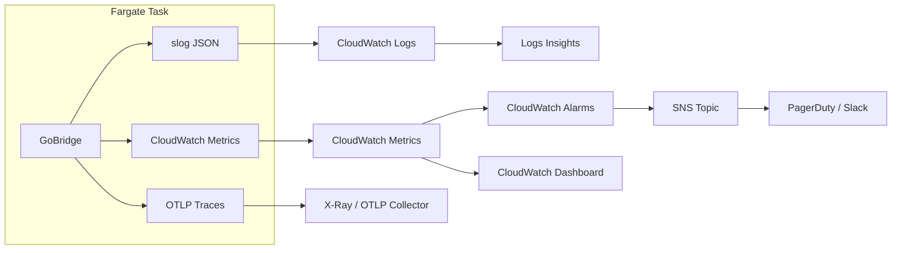

# Monitoring & Observability on AWS

GoBridge provides three observability pillars -- structured logging, metrics, and
distributed tracing -- through pluggable port interfaces. On AWS, these map to
CloudWatch Logs, CloudWatch Metrics, and X-Ray (via an OTLP sidecar). This guide
covers how to configure each pillar, set up alarms, build dashboards, and connect
everything to Grafana.

For architecture overview, see [AWS Overview](overview.md).
For generic observability guidance, see [Deployment Guide](../deployment-guide.md#observability).

---

## Observability Architecture

The following diagram shows how telemetry data flows from a Fargate task to the
AWS services that store, alert, and visualize it.



**Key design decisions:**

- Logs go to CloudWatch Logs via the Fargate `awslogs` log driver -- no agent needed.
- Metrics use the CloudWatch adapter (`adapters/aws/metrics/cloudwatch/`) and call
  `PutMetricData` directly, avoiding the CloudWatch agent.
- Traces export via OTLP HTTP to an AWS Distro for OpenTelemetry (ADOT) sidecar
  container, which forwards spans to X-Ray.

---

## Structured Logging

GoBridge uses Go's `slog` package with a JSON handler. The
`observability.CorrelationHandler` wraps any `slog.Handler` and automatically
injects `correlation_id`, `trace_id`, and `span_id` from context into every log
record.

### Setup

```go
import (
    "log/slog"
    "os"

    "github.com/mariotoffia/gobridge/observability"
    "github.com/mariotoffia/gobridge/runtime"
)

jsonHandler := slog.NewJSONHandler(os.Stderr, &slog.HandlerOptions{
    Level: slog.LevelInfo,
})
logger := slog.New(observability.NewCorrelationHandler(jsonHandler))

rt := runtime.New(
    runtime.WithLogger(logger),
)
```

### JSON Log Format

Every log line is a single JSON object on stderr. The Fargate `awslogs` driver
sends each line to CloudWatch Logs as-is:

```json
{
  "time": "2026-04-06T10:15:32.004Z",
  "level": "INFO",
  "msg": "delivery completed",
  "route_id": "ingest",
  "envelope_id": "e-abc123",
  "correlation_id": "corr-7f3a9b",
  "trace_id": "4bf92f3577b34da6a3ce929d0e0e4736",
  "span_id": "00f067aa0ba902b7",
  "latency_ms": 12
}
```

### Log Levels

| Level | Usage |
|-------|-------|
| `ERROR` | Delivery failures, transport disconnects, store errors |
| `WARN` | Circuit breaker state changes, config reload warnings, DLQ writes |
| `INFO` | Startup, shutdown, delivery completions, lease acquisitions |
| `DEBUG` | Per-message flow details, header parsing, resolver decisions |

### CloudWatch Logs Insights Queries

Find errors in the last hour:

```
fields @timestamp, @message
| filter level = "ERROR"
| sort @timestamp desc
| limit 50
```

Track configuration reload events:

```
fields @timestamp, msg, error
| filter msg like /config reload/
| sort @timestamp desc
```

Trace a single request by correlation ID:

```
fields @timestamp, msg, correlation_id, route_id
| filter correlation_id = "abc-123"
| sort @timestamp asc
```

Count errors by route over the last 24 hours:

```
fields route_id
| filter level = "ERROR"
| stats count(*) as error_count by route_id
| sort error_count desc
```

---

## CloudWatch Metrics

The CloudWatch metrics adapter publishes metrics under the `GoBridge/Runtime`
namespace (defined by `domain.MetricNamespace`). It buffers counter, gauge,
histogram, and timer metrics in memory and flushes them periodically via
`PutMetricData`. Histograms and timers are aggregated into `StatisticSet` values
(min/max/sum/count) to minimize API calls.

### Go Bootstrap

```go
import (
    cwmetrics "github.com/mariotoffia/gobridge/adapters/aws/metrics/cloudwatch"
    "github.com/mariotoffia/gobridge/runtime"
)

exporter, err := cwmetrics.New(ctx, "GoBridge/Runtime",
    cwmetrics.WithRegion("eu-west-1"),
    cwmetrics.WithFlushInterval(30*time.Second),
    cwmetrics.WithBufferSize(1000),
)
if err != nil {
    log.Fatalf("metrics init: %v", err)
}
defer exporter.Close(ctx)

rt := runtime.New(
    runtime.WithMetrics(exporter),
)
```

### Configuration Options

| Option | Default | Description |
|--------|---------|-------------|
| `WithRegion(r)` | SDK default | AWS region for the CloudWatch API |
| `WithNamespace(ns)` | constructor arg | CloudWatch metric namespace |
| `WithFlushInterval(d)` | 60s | How often buffered metrics flush |
| `WithBufferSize(n)` | 1000 | Max buffered non-histogram metrics before async flush |
| `WithDefaultTags(tags...)` | none | Tags added to every metric as dimensions |
| `WithEndpoint(url)` | AWS default | Custom endpoint (for LocalStack) |
| `WithLogger(l)` | nil (silent) | Structured logger for dropped/requeued metrics & invalid dimensions |
| `WithMaxRetryDatums(n)` | 10000 | Bound on datums requeued after a failed `PutMetricData` before the oldest are dropped |

### Key Metrics

| Metric | Dimensions | Unit | Description |
|--------|-----------|------|-------------|
| `MessagesReceived` | `route_id`, `transport` | Count | Messages received from transports |
| `MessagesSent` | `route_id`, `transport` | Count | Messages successfully sent |
| `MessagesDropped` | `route_id` | Count | Messages dropped (filter, expired) |
| `RouteErrors` | `route_id` | Count | Delivery errors by route |
| `DeliveryE2ELatency` | `route_id` | Milliseconds | End-to-end delivery latency |
| `OutboxDepth` | `partition` | Count | Pending outbox records |
| `DLQEntries` | `route_id`, `category` | Count | Messages written to DLQ |
| `LeaseAcquireFailures` | `lease_id` | Count | Failed lease acquisitions |
| `LeaseExpiries` | `lease_id` | Count | Leases that expired without renewal |
| `SQSVisibilityExtensions` | `transport` | Count | SQS visibility timeout extensions |

Dimensions map directly to `domain.Tag` key-value pairs. Standard dimension keys
include `route_id`, `lease_id`, `session_id`, `partition`, `category`, and
`transport`.

> **Dimension cardinality warning.** CloudWatch bills and indexes per unique
> dimension-value combination, and each distinct combination is a separate
> metric. Do **not** use unbounded/high-cardinality values such as `queue_url`
> (full ARNs/URLs), message IDs, or per-request identifiers as dimensions — they
> explode cost and make dashboards unusable. Prefer low-cardinality keys
> (`route_id`, `transport`, `category`). The exporter enforces the CloudWatch
> hard limits defensively: dimensions with an empty name or value are dropped,
> name/value are truncated to 256 bytes, and at most 30 dimensions are kept per
> metric; excess/invalid dimensions are dropped with a logged warning rather
> than silently truncated. Configure a logger via `WithLogger` to observe these
> events.

---

## CloudWatch Alarms

### Recommended Alarms

| Alarm | Metric / Source | Threshold | Period | Action |
|-------|----------------|-----------|--------|--------|
| Unhealthy Tasks | ECS `RunningTaskCount` | < desired count | 1 min | SNS (critical) |
| High Error Rate | `RouteErrors` / `MessagesReceived` | > 5% | 5 min | SNS (high) |
| CPU Utilization | ECS `CPUUtilization` | > 80% | 5 min | SNS (warn) |
| Memory Utilization | ECS `MemoryUtilization` | > 80% | 5 min | SNS (warn) |
| DLQ Growing | `DLQEntries` | > 0 (sum) | 5 min | SNS (high) |
| Outbox Depth Critical | `OutboxDepth` | > 10,000 | 5 min | SNS (critical) |
| Lease Acquire Failures | `LeaseAcquireFailures` | > 3 (sum) | 5 min | SNS (critical) |

### Built-In Alarm Provisioning

The CloudWatch adapter provides `DefaultAlarms` and `EnsureAlarms` to create
alarms programmatically. `DefaultAlarms` returns pre-defined alarm definitions
for outbox depth, DLQ entries, lease expiries, lease acquire failures, and SQS
visibility extensions:

```go
import cwmetrics "github.com/mariotoffia/gobridge/adapters/aws/metrics/cloudwatch"

alarms := cwmetrics.DefaultAlarms("GoBridge/Runtime",
    "arn:aws:sns:eu-west-1:123456789012:gobridge-alerts",
)

err := cwmetrics.EnsureAlarms(ctx, cwClient, alarms)
if err != nil {
    log.Fatalf("alarm setup: %v", err)
}
```

### CDK Alarm Examples

Create alarms in CDK (Go):

```go
import (
    "github.com/aws/aws-cdk-go/awscdk/v2/awscloudwatch"
    "github.com/aws/jsii-runtime-go"
)

// DLQ entries alarm
awscloudwatch.NewAlarm(stack, jsii.String("DLQEntriesAlarm"), &awscloudwatch.AlarmProps{
    AlarmName:          jsii.String("GoBridge-DLQEntries-Warning"),
    Metric: awscloudwatch.NewMetric(&awscloudwatch.MetricProps{
        Namespace:  jsii.String("GoBridge/Runtime"),
        MetricName: jsii.String("DLQEntries"),
        Statistic:  jsii.String("Sum"),
        Period:     awscdk.Duration_Minutes(jsii.Number(5)),
    }),
    Threshold:          jsii.Number(0),
    EvaluationPeriods:  jsii.Number(1),
    ComparisonOperator: awscloudwatch.ComparisonOperator_GREATER_THAN_THRESHOLD,
    TreatMissingData:   awscloudwatch.TreatMissingData_NOT_BREACHING,
    AlarmDescription:   jsii.String("[WARNING] DLQ entries detected"),
})

// High error rate alarm (composite math expression)
errMetric := awscloudwatch.NewMetric(&awscloudwatch.MetricProps{
    Namespace:  jsii.String("GoBridge/Runtime"),
    MetricName: jsii.String("RouteErrors"),
    Statistic:  jsii.String("Sum"),
    Period:     awscdk.Duration_Minutes(jsii.Number(5)),
})
recvMetric := awscloudwatch.NewMetric(&awscloudwatch.MetricProps{
    Namespace:  jsii.String("GoBridge/Runtime"),
    MetricName: jsii.String("MessagesReceived"),
    Statistic:  jsii.String("Sum"),
    Period:     awscdk.Duration_Minutes(jsii.Number(5)),
})

awscloudwatch.NewAlarm(stack, jsii.String("ErrorRateAlarm"), &awscloudwatch.AlarmProps{
    AlarmName: jsii.String("GoBridge-ErrorRate-High"),
    Metric: awscloudwatch.NewMathExpression(&awscloudwatch.MathExpressionProps{
        Expression: jsii.String("(errors / received) * 100"),
        UsingMetrics: &map[string]awscloudwatch.IMetric{
            "errors":   errMetric,
            "received": recvMetric,
        },
        Period: awscdk.Duration_Minutes(jsii.Number(5)),
    }),
    Threshold:          jsii.Number(5),
    EvaluationPeriods:  jsii.Number(1),
    ComparisonOperator: awscloudwatch.ComparisonOperator_GREATER_THAN_THRESHOLD,
    AlarmDescription:   jsii.String("[HIGH] Error rate exceeds 5%"),
})
```

Add SNS actions for notifications:

```go
alarmAction := awscloudwatchactions.NewSnsAction(snsTopic)
dlqAlarm.AddAlarmAction(alarmAction)
dlqAlarm.AddOkAction(alarmAction)
```

---

## CloudWatch Dashboard

A well-designed dashboard provides at-a-glance health for the bridge. Organize
widgets into four rows.

### Recommended Layout

| Row | Widget | Metric | Type |
|-----|--------|--------|------|
| 1 | Throughput | `MessagesReceived`, `MessagesSent` | Line graph |
| 1 | Error Rate | `RouteErrors` / `MessagesReceived` | Number (%) |
| 2 | Delivery Latency | `DeliveryE2ELatency` (p50, p99) | Line graph |
| 2 | In-Flight Messages | `bridge.inflight` | Gauge |
| 3 | Outbox Depth | `OutboxDepth` | Area chart |
| 3 | DLQ Entries | `DLQEntries` | Bar chart |
| 4 | ECS CPU/Memory | ECS `CPUUtilization`, `MemoryUtilization` | Stacked area |
| 4 | Task Count | ECS `RunningTaskCount` | Number |

### Dashboard JSON (Abbreviated)

```json
{
  "widgets": [
    {
      "type": "metric",
      "x": 0, "y": 0, "width": 12, "height": 6,
      "properties": {
        "title": "Message Throughput",
        "metrics": [
          ["GoBridge/Runtime", "MessagesReceived", { "stat": "Sum", "period": 60 }],
          ["GoBridge/Runtime", "MessagesSent", { "stat": "Sum", "period": 60 }]
        ],
        "view": "timeSeries",
        "region": "eu-west-1",
        "period": 60
      }
    },
    {
      "type": "metric",
      "x": 12, "y": 0, "width": 12, "height": 6,
      "properties": {
        "title": "Error Rate (%)",
        "metrics": [
          [{ "expression": "(m1 / m2) * 100", "label": "Error %", "id": "e1" }],
          ["GoBridge/Runtime", "RouteErrors", { "stat": "Sum", "period": 300, "id": "m1", "visible": false }],
          ["GoBridge/Runtime", "MessagesReceived", { "stat": "Sum", "period": 300, "id": "m2", "visible": false }]
        ],
        "view": "timeSeries",
        "region": "eu-west-1"
      }
    },
    {
      "type": "metric",
      "x": 0, "y": 6, "width": 12, "height": 6,
      "properties": {
        "title": "Delivery Latency (ms)",
        "metrics": [
          ["GoBridge/Runtime", "DeliveryE2ELatency", { "stat": "p50", "period": 60 }],
          ["GoBridge/Runtime", "DeliveryE2ELatency", { "stat": "p99", "period": 60 }]
        ],
        "view": "timeSeries",
        "region": "eu-west-1"
      }
    },
    {
      "type": "metric",
      "x": 12, "y": 6, "width": 12, "height": 6,
      "properties": {
        "title": "Outbox & DLQ",
        "metrics": [
          ["GoBridge/Runtime", "OutboxDepth", { "stat": "Maximum", "period": 60 }],
          ["GoBridge/Runtime", "DLQEntries", { "stat": "Sum", "period": 60 }]
        ],
        "view": "timeSeries",
        "region": "eu-west-1"
      }
    }
  ]
}
```

---

## Distributed Tracing

GoBridge supports distributed tracing through the `ports.Tracer` interface. The
OTLP tracing adapter (`adapters/otel/tracing/`) exports spans over HTTP to any
OTLP-compatible collector.

### ADOT Sidecar on Fargate

Deploy the AWS Distro for OpenTelemetry (ADOT) collector as a sidecar container
in the same Fargate task definition. The collector receives OTLP spans and
forwards them to X-Ray.

```yaml
# ECS task definition excerpt
containerDefinitions:
  - name: gobridge
    image: 123456789012.dkr.ecr.eu-west-1.amazonaws.com/gobridge:latest
    # ...

  - name: adot-collector
    image: public.ecr.aws/aws-observability/aws-otel-collector:latest
    command: ["--config=/etc/ecs/otel-config.yaml"]
    portMappings:
      - containerPort: 4318
        protocol: tcp
```

### Go Bootstrap

```go
import oteltracing "github.com/mariotoffia/gobridge/adapters/otel/tracing"

tracer, err := oteltracing.New(ctx,
    oteltracing.WithEndpoint("http://localhost:4318"),
    oteltracing.WithServiceName("gobridge"),
    oteltracing.WithServiceVersion("1.0.0"),
    oteltracing.WithEnvironment("production"),
    oteltracing.WithSamplerRatio(0.1),
)
if err != nil {
    log.Fatalf("tracer init: %v", err)
}
defer tracer.Close(ctx)

rt := runtime.New(
    runtime.WithTracer(tracer),
)
```

### Trace Propagation

The runtime creates a `bridge.deliver` span around each message delivery. The
span carries `route_id`, `envelope_id`, and `subject` as attributes. W3C
`traceparent` headers are extracted from ingress messages and propagated through
the bridge. If no trace context exists, the tracer starts a new root span.

### Sampling Strategy

| Environment | Ratio | Rationale |
|-------------|-------|-----------|
| Development | `1.0` | Capture every span for debugging |
| Staging | `0.5` | Moderate coverage with reasonable cost |
| Production | `0.1` | 10% sampling balances cost and visibility |

Unsampled messages still receive `correlation_id` in logs, so you can always
search CloudWatch Logs by correlation ID even without a matching trace.

### Cost Considerations

X-Ray charges per trace recorded and per trace scanned. At 0.1 sampling with
10,000 messages/minute, you record approximately 1,000 traces/minute. Use the
[Total Cost of Ownership](tco.md) guide to estimate tracing costs for your
throughput.

---

## Log-Based Metric Filters

CloudWatch metric filters extract numeric metrics from log patterns. Use them for
events that are logged but not emitted as explicit metrics.

### Recommended Filters

| Filter Name | Pattern | Metric |
|-------------|---------|--------|
| Circuit breaker open | `{ $.msg = "circuit breaker state change" && $.new_state = "open" }` | `CircuitBreakerOpen` |
| Config reload failure | `{ $.msg = "config reload rejected" }` | `ConfigReloadFailures` |
| Error log count | `{ $.level = "ERROR" }` | `ErrorLogCount` |
| Delivery panics | `{ $.msg = "delivery panic recovered" }` | `DeliveryPanics` |

### CDK Metric Filter Example

```go
import (
    "github.com/aws/aws-cdk-go/awscdk/v2/awslogs"
    "github.com/aws/jsii-runtime-go"
)

awslogs.NewMetricFilter(stack, jsii.String("CircuitBreakerOpenFilter"),
    &awslogs.MetricFilterProps{
        LogGroup:       logGroup,
        FilterName:     jsii.String("CircuitBreakerOpen"),
        FilterPattern:  awslogs.FilterPattern_All(
            awslogs.FilterPattern_StringValue(
                jsii.String("$.msg"), jsii.String("="), jsii.String("circuit breaker state change"),
            ),
            awslogs.FilterPattern_StringValue(
                jsii.String("$.new_state"), jsii.String("="), jsii.String("open"),
            ),
        ),
        MetricNamespace: jsii.String("GoBridge/Logs"),
        MetricName:      jsii.String("CircuitBreakerOpen"),
        MetricValue:     jsii.String("1"),
        DefaultValue:    jsii.Number(0),
    },
)

awslogs.NewMetricFilter(stack, jsii.String("ErrorLogFilter"),
    &awslogs.MetricFilterProps{
        LogGroup:       logGroup,
        FilterName:     jsii.String("ErrorLogCount"),
        FilterPattern:  awslogs.FilterPattern_StringValue(
            jsii.String("$.level"), jsii.String("="), jsii.String("ERROR"),
        ),
        MetricNamespace: jsii.String("GoBridge/Logs"),
        MetricName:      jsii.String("ErrorLogCount"),
        MetricValue:     jsii.String("1"),
        DefaultValue:    jsii.Number(0),
    },
)
```

You can then create alarms on these log-derived metrics using the same approach
shown in the CloudWatch Alarms section. Place them in the `GoBridge/Logs`
namespace to distinguish them from runtime-emitted metrics.

---

## Connecting to Grafana

If your organization uses Grafana, you can query CloudWatch, X-Ray, and
CloudWatch Logs through native data source plugins.

### IAM Role for Grafana

Create a read-only IAM role that Grafana assumes:

```json
{
  "Version": "2012-10-17",
  "Statement": [
    {
      "Effect": "Allow",
      "Action": [
        "cloudwatch:DescribeAlarmsForMetric",
        "cloudwatch:GetMetricData",
        "cloudwatch:GetMetricStatistics",
        "cloudwatch:ListMetrics",
        "logs:GetLogEvents",
        "logs:GetLogGroupFields",
        "logs:GetQueryResults",
        "logs:StartQuery",
        "logs:StopQuery",
        "xray:GetTraceSummaries",
        "xray:BatchGetTraces",
        "xray:GetServiceGraph"
      ],
      "Resource": "*"
    }
  ]
}
```

### Data Source Configuration

| Data Source | Plugin | Namespace / Settings |
|-------------|--------|---------------------|
| CloudWatch Metrics | `cloudwatch` | Namespace: `GoBridge/Runtime` |
| CloudWatch Logs | `cloudwatch` | Log group: `/ecs/gobridge` |
| X-Ray Traces | `x-ray` | Region: match your deployment |

### Dashboard Panels

| Panel | Query |
|-------|-------|
| Throughput | CloudWatch: `SUM(MessagesReceived)`, `SUM(MessagesSent)` over 1 min |
| Error rate | CloudWatch math: `(RouteErrors / MessagesReceived) * 100` |
| p99 latency | CloudWatch: `p99(DeliveryE2ELatency)` over 1 min |
| Outbox depth | CloudWatch: `MAX(OutboxDepth)` over 1 min |
| Log search | CloudWatch Logs Insights: filter by `correlation_id` or `route_id` |
| Trace drilldown | X-Ray: search by trace ID from log panel link |

The `correlation_id` field is the join key across all three data sources.

---

## Summary

| Pillar | AWS Service | GoBridge Adapter | Config |
|--------|-------------|-----------------|--------|
| Logging | CloudWatch Logs | `observability.CorrelationHandler` | `runtime.WithLogger(logger)` |
| Metrics | CloudWatch Metrics | `adapters/aws/metrics/cloudwatch` | `runtime.WithMetrics(exporter)` |
| Tracing | X-Ray via ADOT | `adapters/otel/tracing` | `runtime.WithTracer(tracer)` |

See [CDK Scenario 4](../scenarios/cdk/04-production-stack.md) for a complete
production stack that wires monitoring, alarms, and dashboards together.
For cost implications of observability, see [Total Cost of Ownership](tco.md).
