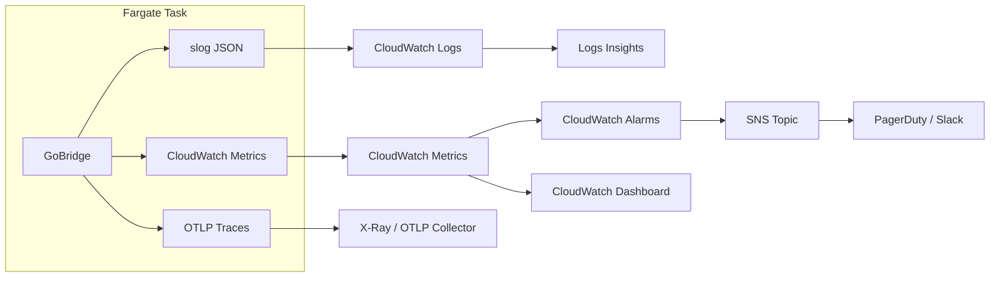

# Monitoring & Observability on AWS

GoBridge provides three observability pillars -- structured logging, metrics, and
distributed tracing -- through pluggable port interfaces. On AWS, these map to
CloudWatch Logs, CloudWatch Metrics, and X-Ray (via an OTLP sidecar). This guide
covers how to configure each pillar, set up alarms, build dashboards, and connect
everything to Grafana.

For architecture overview, see [AWS Overview](overview.md).
For generic observability guidance, see [Deployment Guide](../deployment-guide.md#observability).

---

## Observability Architecture

The following diagram shows how telemetry data flows from a Fargate task to the
AWS services that store, alert, and visualize it.



**Key design decisions:**

- Logs go to CloudWatch Logs via the Fargate `awslogs` log driver -- no agent needed.
- Metrics use the CloudWatch adapter (`adapters/aws/metrics/cloudwatch/`) and call
  `PutMetricData` directly, avoiding the CloudWatch agent.
- Traces export via OTLP HTTP to an AWS Distro for OpenTelemetry (ADOT) sidecar
  container, which forwards spans to X-Ray.

---

## Structured Logging

GoBridge uses Go's `slog` package with a JSON handler. The
`observability.CorrelationHandler` wraps any `slog.Handler` and automatically
injects `correlation_id`, `trace_id`, and `span_id` from context into every log
record.

### Setup

```go
import (
    "log/slog"
    "os"

    "github.com/mariotoffia/gobridge/observability"
    "github.com/mariotoffia/gobridge/runtime"
)

jsonHandler := slog.NewJSONHandler(os.Stderr, &slog.HandlerOptions{
    Level: slog.LevelInfo,
})
logger := slog.New(observability.NewCorrelationHandler(jsonHandler))

rt := runtime.New(
    runtime.WithLogger(logger),
)
```

### JSON Log Format

Every log line is a single JSON object on stderr. The Fargate `awslogs` driver
sends each line to CloudWatch Logs as-is:

```json
{
  "time": "2026-04-06T10:15:32.004Z",
  "level": "INFO",
  "msg": "delivery completed",
  "route_id": "ingest",
  "envelope_id": "e-abc123",
  "correlation_id": "corr-7f3a9b",
  "trace_id": "4bf92f3577b34da6a3ce929d0e0e4736",
  "span_id": "00f067aa0ba902b7",
  "latency_ms": 12
}
```

### Log Levels

| Level | Usage |
|-------|-------|
| `ERROR` | Delivery failures, transport disconnects, store errors |
| `WARN` | Circuit breaker state changes, config reload warnings, DLQ writes |
| `INFO` | Startup, shutdown, delivery completions, lease acquisitions |
| `DEBUG` | Per-message flow details, header parsing, resolver decisions |

### CloudWatch Logs Insights Queries

Find errors in the last hour:

```text
fields @timestamp, @message
| filter level = "ERROR"
| sort @timestamp desc
| limit 50
```

Track configuration reload events:

```text
fields @timestamp, msg, error
| filter msg like /config reload/
| sort @timestamp desc
```

Trace a single request by correlation ID:

```text
fields @timestamp, msg, correlation_id, route_id
| filter correlation_id = "abc-123"
| sort @timestamp asc
```

Count errors by route over the last 24 hours:

```text
fields route_id
| filter level = "ERROR"
| stats count(*) as error_count by route_id
| sort error_count desc
```

---

## CloudWatch Metrics

The CloudWatch metrics adapter publishes metrics under the `GoBridge/Runtime`
namespace (defined by `shared.MetricNamespace`). It buffers counter, gauge,
histogram, and timer metrics in memory and flushes them periodically via
`PutMetricData`. Histograms and timers are aggregated into `StatisticSet` values
(min/max/sum/count) to minimize API calls.

> **No percentile latency.** A `StatisticSet` carries only Min, Max, Sum, and
> SampleCount, so CloudWatch can derive Average, Minimum, Maximum, Sum, and
> SampleCount — never `p50`, `p95`, or `p99`. Every GoBridge histogram and timer,
> including all `*Latency` metrics such as `DeliveryE2ELatency`, publishes this
> way. Chart latency with `Average` and `Maximum`; a percentile statistic returns
> no data.

### Go Bootstrap

```go
import (
    cwmetrics "github.com/mariotoffia/gobridge/adapters/aws/metrics/cloudwatch"
    "github.com/mariotoffia/gobridge/runtime"
)

exporter, err := cwmetrics.New(ctx, "GoBridge/Runtime",
    cwmetrics.WithRegion("eu-west-1"),
    cwmetrics.WithFlushInterval(30*time.Second),
    cwmetrics.WithBufferSize(1000),
)
if err != nil {
    log.Fatalf("metrics init: %v", err)
}
defer exporter.Close(ctx)

rt := runtime.New(
    runtime.WithMetrics(exporter),
)
```

### Configuration Options

| Option | Default | Description |
|--------|---------|-------------|
| `WithRegion(r)` | SDK default | AWS region for the CloudWatch API |
| `WithNamespace(ns)` | constructor arg | CloudWatch metric namespace |
| `WithFlushInterval(d)` | 60s | How often buffered metrics flush |
| `WithBufferSize(n)` | 1000 | Max buffered non-histogram metrics before async flush |
| `WithDefaultTags(tags...)` | none | Tags added to every metric as dimensions |
| `WithEndpoint(url)` | AWS default | Custom endpoint (for LocalStack) |
| `WithLogger(l)` | `slog.Default()` | Structured logger for dropped/requeued metrics & invalid dimensions. `WithLogger(nil)` suppresses this logging. |
| `WithMaxRetryDatums(n)` | 10000 | Bound on datums requeued after a failed `PutMetricData` before the oldest are dropped |
| `WithRollupMetrics(names...)` | none | Emit a second, **dimensionless** copy of each named metric so zero-dimension alarms can match. Pass `DefaultRollupMetrics()...`. |
| `WithInstanceTag(id)` | none | Add the `instance_id` dimension (never applied to rollup copies) so per-task series in a fleet do not collide. |

A single background flusher goroutine drains the buffer on the flush interval,
governed so a slow `PutMetricData` cannot stack overlapping flushes.

`DefaultRollupMetrics()` returns `OutboxDepth`, `LeaseExpiries`, `DLQEntries`,
`LeaseAcquireFailures`, `CredentialRefreshFailures`, `SQSVisibilityExtensions`,
and the silent-loss + backlog signals `DLQDepth`, `MessagesDropped`,
`MessagesExpired`, and `MessagesFiltered`.

`CredentialRefreshFailures` and `DLQDepth` are the dimensionless entries. Each is
emitted with **no** runtime dimension, yet is rolled up so it still fires on
instance-tagged fleets: with `WithInstanceTag`, the base series carries only
`instance_id`, which a zero-dimension alarm would miss, so the dimensionless
rollup copy gives the alarm something to match. Without instance tagging the base
and rollup copies coincide — a harmless double count (`DLQDepth` is a gauge whose
rollup takes the fleet `Maximum`). `CredentialRefreshFailures` has **no** default
alarm; add your own if you want to alert on a secrets backend that is unreachable
or denying access. `MessagesDropped/Expired/Filtered` carry `route_id`, so their
rollup copies are what the default fleet alarms below match.

### Key Metrics

The runtime emits the following metrics under `GoBridge/Runtime`. Dimensions are
the exact `shared.Tag` keys set at each emission site. Every `*Latency` metric is
Milliseconds published as a `StatisticSet` (no percentiles); `OutboxDepth` is a
Count gauge; everything else is a Count counter.

**Messages & delivery**

| Metric | Dimensions | Unit | Description |
|--------|-----------|------|-------------|
| `MessagesReceived` | `route_id` | Count | Messages received from transports |
| `MessagesSent` | `route_id` | Count | Messages sent successfully (ingress ack and outbox drain) |
| `MessagesDropped` | `route_id`, `reason` | Count | A terminal drop settled WITHOUT a DLQ record and WITHOUT a successful send: permanent, rejected, or retry-unsupported under a drop policy, or a missing DLQ store. Not a filter, not an expiry. |
| `MessagesFiltered` | `route_id`, `processor` | Count | A processor deliberately discarded the message (`ErrMessageFiltered`) under `OnFiltered=drop` — a policy discard, distinct from a fault drop. `processor` is omitted when the drop is unattributed. |
| `MessagesExpired` | `route_id` | Count | Message expired before delivery under `OnExpired=drop`. The drain-path bulk sweep also tags `session_id`. |
| `RouteErrors` | `route_id` | Count | Delivery errors by route |
| `DeliveryE2ELatency` | `route_id` | Milliseconds | End-to-end delivery latency (StatisticSet — chart `Average`/`Maximum`) |
| `ReceiveCountUnparseable` | `route_id` | Count | Redelivery-count header was present but not an integer; receiveCount failed open to a first delivery |

`MessagesReceived`, `MessagesSent`, `MessagesDropped`, `MessagesFiltered`,
`MessagesExpired`, `DLQEntries`, and in-flight close the conservation law
`received = sent + dropped + filtered + expired + dlq + inflight`. A rising
`MessagesDropped` is the single signal for silent message loss, so keep it split
from the intentional filter and TTL counters.

**Outbox**

| Metric | Dimensions | Unit | Description |
|--------|-----------|------|-------------|
| `OutboxDepth` | `partition` | Count (gauge) | TRUE pending backlog — dual-emitter (ingress + drain), see the depth note below |
| `OutboxClaimBatchSize` | `partition` | Count (gauge) | Records the drainer CLAIMED on its last poll — a liveness/throughput signal that saturates at the claim ceiling; NOT the backlog (kept separate from `OutboxDepth`) |
| `OutboxClaimedDepth` | `partition` | Count (gauge) | Records currently CLAIMED — work an owner took but has not driven to a terminal state (via the store's optional `OutboxClaimedDepthReporter`). `OutboxDepth` at zero with a STANDING non-zero value here is stranded work, or an ordering-key group stalled behind a stranded head. Normal in-flight work returns to zero every cycle |
| `OutboxDepthFailures` | `partition` | Count | Drain cycles where a supported depth reporter's count query FAILED (real DB/read error, not "unsupported"). On such a cycle `OutboxDepth` is deliberately NOT emitted so the missing-data alarm fires; a rising value means the depth query itself is broken |
| `OutboxPersistLatency` | `route_id` | Milliseconds | Persist-call latency |
| `OutboxDrainLatency` | `session_id` | Milliseconds | Drain-batch latency |
| `OutboxClaimRecoveries` | `session_id` | Count | Claimed records with a replay count > 1 (recovered after a crash) |
| `OutboxClaimConflicts` | `partition` | Count | Per-record claim transactions aborted by concurrent Persist/Claim/Complete contention |
| `OutboxCompletions` | `route_id` | Count | Records durably completed after a successful send |
| `OutboxDeferred` | `route_id` | Count | Claimed records the drainer could not process this cycle (batch deadline hit) and released for the next drain |
| `OutboxReplayCount` | `route_id` | Count | Records re-attempted after a prior claim |
| `OutboxRecordFailures` | `route_id` | Count | Records that failed processing this drain cycle |
| `OutboxDuplicateRisk` | `route_id` | Count | Complete failed after a successful send — the message may be re-delivered |
| `OutboxDuplicateSuppressed` | `route_id` | Count | Ingress persist rejected because the outbox already holds that envelope identity; the source was acked without a new record. Benign for a redelivery — a sustained rate on one route means that source's producers are reusing envelope IDs, and each suppression discards a distinct message |
| `OutboxExpiredBeforeSend` | `route_id` | Count | Record expired before the drainer launched its send |
| `OutboxDrainStalled` | `session_id`, `route_id` | Count | Drain batch whose in-flight sends did not return within the watchdog grace (a sender ignoring `ctx`) |
| `DrainSkippedNoLease` | `session_id`, `route_id` | Count | Drain cycle skipped because the drainer held no lease |

> **`OutboxDepth` reports the true backlog; `OutboxClaimBatchSize` is liveness.**
> This partition-keyed depth gauge is emitted from two sites, each reporting a
> real pending count (never a claim-batch size): the ingress path emits the
> pending count it observed (bounded by `MaxOutboxDepth`), and the drain path
> emits the EXACT remaining pending count read from the store's optional
> `ports.OutboxDepthReporter` capability — a dedicated COUNT primitive that does
> not saturate at the claim ceiling — so a deep backlog reports its real size.
> On a store that has **not** adopted `OutboxDepthReporter` yet, the drain path
> falls back to the claimed count (a saturating LOWER BOUND) to keep the gauge
> continuous; implement the capability on your outbox store for an exact,
> unbounded depth signal. The default depth alarms read the `Maximum` statistic
> and treat missing data as breaching (silence means the drainer/bridge died).
> The honest per-cycle claim size is published SEPARATELY as
> `OutboxClaimBatchSize`, so a full batch can never masquerade as a shallow
> backlog. When a store DOES support the capability but its count query hits a
> REAL failure (a DB/read error, distinct from "not implemented"), the drainer
> does NOT fall back to the claimed count — it SKIPS the `OutboxDepth` emission
> for that cycle (so a persistently broken query trips the breaching-on-missing
> alarm rather than hiding behind a saturating lower bound) and records it on
> `OutboxDepthFailures` plus a structured error log.

**Store health**

These two counters are emitted by the store adapters (not the runtime core) and
publish under the same `GoBridge/Runtime` namespace whenever the store's metrics
exporter is wired -- which the runtime does. Both carry an adapter-owned
dimension, so the zero-dimension rollup alarms do not match them; alarm on the
dimensioned series.

| Metric | Dimensions | Unit | Description |
|--------|-----------|------|-------------|
| `DynamoDBOutboxClaimScanPages` | `partition` | Count | Number of DynamoDB Query pages a single outbox `Claim` scanned, emitted only when that count crosses 8. The scan path pages the whole partition to guarantee oldest-first delivery, so a sustained deep backlog (draining after an egress outage on an exclusive session) makes each Claim O(backlog) and the drain quadratic. Two things put a claim on that path: a table without the `ClaimIndex` GSI, or a partition whose records carry ordering keys (a GSI cannot prove a record has no older unseen sibling, so keyed claims read the base table consistently -- see ADR 0005). On a table that HAS `ClaimIndex`, a rising value means ordering keys, not a missing index; the store logs which once per process. |
| `DynamoDBOutboxClaimTruncated` | `partition` | Count | A `Claim` that ended early because a per-record transaction failed transiently (throttle, deadline, network) AFTER earlier records were already durably claimed. The short batch is returned rather than discarded, so nothing is stranded; a rising value usually means sustained throttling or a claim budget too small for the batch size. |
| `SQLiteStoreUnhealthy` | `entity` | Count | A fatal SQLite outbox storage fault -- disk full, corruption, read-only, or not-a-database (`entity=outbox`). Classified PERMANENT because no retry clears it without operator action. The drain loop keeps polling and records stay durable -- this is an observability signal, not a halt -- so alert on it directly: it means free disk / restore the file, distinct from transient throttling noise. |

The DynamoDB DLQ **unbounded delete-all** (`DeleteByFilter` with no cap, i.e.
`Limit <= 0`) logs one throttled WARN --
`dynamodbdlq: unbounded delete-all exceeded max_scan_pages and is still running`
-- once it pages past `max_scan_pages`. It still pages to exhaustion; the WARN is
informational (a large purge is running), not an error. Narrow the filter's time
range to bound it.

Keyless partitions never pay that cost: the required `ClaimIndex` GSI serves
them in O(limit). Only ordering-keyed partitions reach the scan, because no
eventually-consistent index can prove a keyed record has no older unseen
sibling; the bounded alternative would be a local secondary index on
`(PK, claim_sort)` read with `ConsistentRead`, which can only be created with the
table. See [ADR 0005](../adr/0005-outbox-partition-claim-design.md) and the
[outbox table schema runbook](../runbooks/dynamodb-outbox-table-schema.md).

**Lease**

| Metric | Dimensions | Unit | Description |
|--------|-----------|------|-------------|
| `LeaseAcquireLatency` | `lease_id` | Milliseconds | Lease-acquire latency |
| `LeaseRenewLatency` | `lease_id` | Milliseconds | Lease-renew latency |
| `LeaseAcquireFailures` | `lease_id` | Count | Failed lease acquisitions |
| `LeaseExpiries` | `lease_id` | Count | Leases that expired without renewal (step-down) |
| `LeaseTransfers` | `lease_id` | Count | Lease re-acquired by this instance (hand-off) |

**DLQ**

| Metric | Dimensions | Unit | Description |
|--------|-----------|------|-------------|
| `DLQEntries` | `route_id`, `category` | Count | Messages written to the DLQ (an INGRESS COUNTER — only ever increases) |
| `DLQDepth` | none | Count (gauge) | CURRENT outstanding DLQ entries — the standing backlog "right now", so a stale burst after traffic stops is visible. Sampled via the store's optional `ports.DLQDepthReporter`; emitted as a dimensionless fleet total. |
| `DLQWriteFailures` | none | Count | DLQ write attempts that failed after retries, or were skipped with no held lease |
| `DLQDuplicateSuppressed` | none | Count | DLQ writes the store refused as an existing entry — the same terminal event recorded twice, collapsed onto one row and reported as success. A rising value means settlement is failing after DLQ writes land, not that the DLQ store is unhealthy |
| `DLQRedrives` | `route_id` | Count | DLQ entries an admin redrive re-injected successfully |
| `DLQRedriveFailures` | `route_id` | Count | Redrive attempts that failed during or after the claim |

**Circuit breaker**

| Metric | Dimensions | Unit | Description |
|--------|-----------|------|-------------|
| `CircuitBreakerStateChanged` | `processor`, `key`, `to` | Count | Every open/half-open/closed transition (`to` is the new state) |
| `CircuitBreakerTrips` | `processor`, `key` | Count | Transitions into the open state |
| `CircuitBreakerRejections` | `processor`, `key` | Count | Calls rejected while the breaker is open |

**Processor**

| Metric | Dimensions | Unit | Description |
|--------|-----------|------|-------------|
| `ProcessorPanics` | `route_id`, `processor` | Count | Processor panics recovered in the chain |
| `ProcessorTimeouts` | `route_id` | Count | Processor invocations that exceeded the per-processor timeout |

**Session & route**

| Metric | Dimensions | Unit | Description |
|--------|-----------|------|-------------|
| `MQTTReconnects` | `session_id` | Count | Session reconnects (historical wire name; emitted transport-agnostically by the session manager) |
| `ReconcileFailures` | `session_id` | Count | Reconcile-on-reconnect failures |
| `SessionRestarts` | `session_id` | Count | Per-session supervised restarts (isolated, capped backoff) |
| `RouteRestarts` | `route_id` | Count | Per-route supervised restarts (isolated, jittered capped backoff) |
| `DeliveryPanics` | `route_id` | Count | Delivery-goroutine panics recovered in the route runner |

**Credentials**

| Metric | Dimensions | Unit | Description |
|--------|-----------|------|-------------|
| `CredentialRefreshFailures` | none | Count | Credential resolve failures during rotation polling (initial seed and periodic). No dimension by design (the URI may hold secrets). Rolled up for instance-tagged fleets; no default alarm. |
| `CredentialRotationApplied` | none | Count | Rotations applied to a live transport — one per target whose `ApplyCredentials` succeeded (a URI shared by N sessions counts N on one rotation). Success counterpart to `CredentialRefreshFailures`. Not rolled up; no default alarm. |
| `CredentialResolveFailure` | `code` | Count | Repository fetch failures at the resolver choke point, tagged with the bounded error code (`NOT_AUTHORIZED`, `UNAVAILABLE`, `NOT_FOUND`, …) so a permission denial is distinguishable from a backend outage. Covers build-time resolves, rotation polls, and reactive re-resolves. Not rolled up; no default alarm. |
| `CredentialStaleServed` | `code` | Count | Stale-while-error serves — the resolver returned an expired last-known-good credential after a retryable fetch error (`code` is the retryable error). A rising value flags a secrets backend unreachable longer than the cache TTL. Never emitted for permanent errors. Not rolled up; no default alarm. |

**Transport (SQS)**

The SQS adapter self-instruments twelve metrics, all tagged by `queue_url`
(bounded cardinality). Five are latency timers (Milliseconds, StatisticSet);
seven are counters. All emit on both the programmatic and config-driven paths
(see the note below).

| Metric | Dimensions | Unit | Description |
|--------|-----------|------|-------------|
| `SQSPollLatency` | `queue_url` | Milliseconds | `ReceiveMessage` long-poll round-trip latency |
| `SQSReceiveLatency` | `queue_url` | Milliseconds | Per-message receive-to-convert latency |
| `SQSDeleteLatency` | `queue_url` | Milliseconds | `DeleteMessage` (ack) call latency |
| `SQSSendLatency` | `queue_url` | Milliseconds | `SendMessage` call latency |
| `SQSSendBatchLatency` | `queue_url` | Milliseconds | `SendMessageBatch` call latency |
| `SQSVisibilityExtensions` | `queue_url` | Count | Explicit `Extend` `ChangeMessageVisibility` calls |
| `SQSAutoExtends` | `queue_url` | Count | Successful background auto-extend `ChangeMessageVisibility` calls |
| `SQSMalformedMessages` | `queue_url` | Count | Messages that failed envelope conversion |
| `SQSDroppedAttributes` | `queue_url` | Count | Envelope headers dropped from a send over the SQS attribute count/size budget |
| `SQSPollErrors` | `queue_url` | Count | `ReceiveMessage` poll failures |
| `SQSSettlementErrors` | `queue_url` | Count | Failed Ack (`DeleteMessage`) and Retry (`ChangeMessageVisibility`) settlement calls |
| `SQSAutoExtendFailures` | `queue_url` | Count | Failed background auto-extend `ChangeMessageVisibility` calls |

`SQSPollErrors`, `SQSSettlementErrors`, and `SQSAutoExtendFailures` are failure
counters — a poll, settlement, or auto-extend failure that was previously only a
Warn log and thus metrics-invisible. Alert on a rising rate on any of the three.

**Exporter self-metrics**

| Metric | Dimensions | Unit | Description |
|--------|-----------|------|-------------|
| `ExporterDroppedDatums` | none | Count | Datums accepted into the export pipeline then lost: buffer hard cap, retry-buffer overflow on requeue, or a non-retryable (validation-class) `PutMetricData` rejection after buffering |
| `ExporterRejectedDatums` | none | Count | Emissions rejected at `add()` before entering the pipeline: the value was NaN or ±Inf |

Dimensions map directly to `shared.Tag` key-value pairs. The dimension keys in
use are `route_id`, `session_id`, `lease_id`, `partition`, `entity`, `category`,
`reason`, `processor`, `key`, `to`, `queue_url`, and `instance_id` (added by
`WithInstanceTag`, never on rollup copies).

The generic `AckLatency` and `VisibilityExtensions` metrics are emitted **only**
by the opt-in `runtime.NewInstrumentedReceiver` /
`runtime.NewInstrumentedReceiverCapabilityPreserving` wrappers (a library API
for embedders); the SQS and Service Bus adapters self-instrument under
adapter-specific names (`SQSReceiveLatency`, `ASBReceiveLatency`, `SQSVisibilityExtensions`, …).

> **Adapter metrics now emit on the config-driven path (SQS).** The SQS
> factory threads a `MetricsExporter` into every receiver and sender it builds,
> so the adapter's twelve SQS metrics (`SQSReceiveLatency`, `SQSPollLatency`,
> `SQSDeleteLatency`, `SQSSendLatency`, `SQSSendBatchLatency`,
> `SQSVisibilityExtensions`, `SQSAutoExtends`, `SQSMalformedMessages`,
> `SQSDroppedAttributes`, `SQSPollErrors`, `SQSSettlementErrors`,
> `SQSAutoExtendFailures`) now report when the transport is built from
> configuration or a plugin — not only on the programmatic path. Earlier
> builds left `cfg.Metrics` nil on the factory path and each adapter fell back
> to a no-op exporter, so these series were silently absent on config-driven
> deployments. Pass the exporter as `sqs.NewFactory(logger, metrics)` (the
> runtime wires this for you). The Service Bus factory does **not** yet thread
> a metrics exporter, so `ASBReceiveLatency` and the other ASB series still
> emit only when the adapter is constructed programmatically with an explicit
> `cfg.Metrics`; on the factory path they fall back to no-op.

> **Dimension cardinality warning.** CloudWatch bills and indexes per unique
> dimension-value combination, and each distinct combination is a separate
> metric. Do **not** use unbounded/high-cardinality values such as message IDs,
> correlation IDs, or per-request identifiers as dimensions — they explode cost
> and make dashboards unusable. Prefer low-cardinality keys (`route_id`,
> `category`, `partition`). The exporter enforces the CloudWatch
> hard limits defensively: dimensions with an empty name or value are dropped,
> name/value are truncated to 256 bytes, and at most 30 dimensions are kept per
> metric; excess/invalid dimensions are dropped with a logged warning rather
> than silently truncated. These events are logged via `slog.Default()` unless
> a logger is set with `WithLogger` (or suppressed with `WithLogger(nil)`).

### Rollup and Self-Metrics

`WithRollupMetrics` emits a second copy of each named metric with **no
dimensions** so a dimensionless alarm can match it; rollup copies never carry the
`instance_id` tag. The exporter also emits two zero-dimension health counters
through its own pipeline. `ExporterRejectedDatums` counts emissions rejected at
`add()` time before they enter the pipeline: the value was NaN or ±Inf, which
would otherwise fail the whole all-or-nothing `PutMetricData` batch.
`ExporterDroppedDatums` counts datums that entered the pipeline and were then
lost: the buffer hard cap, retry-buffer overflow on requeue, or a non-retryable
(validation-class) `PutMetricData` rejection after buffering.

---

## CloudWatch Alarms

### Recommended Alarms

| Alarm | Metric / Source | Threshold | Period | Action |
|-------|----------------|-----------|--------|--------|
| Unhealthy Tasks | ECS `RunningTaskCount` | < desired count | 1 min | SNS (critical) |
| High Error Rate | `RouteErrors` / `MessagesReceived` | > 5% | 5 min | SNS (high) |
| CPU Utilization | ECS `CPUUtilization` | > 80% | 5 min | SNS (warn) |
| Memory Utilization | ECS `MemoryUtilization` | > 80% | 5 min | SNS (warn) |
| DLQ Growing | `DLQEntries` | > 0 (sum) | 5 min | SNS (high) |
| DLQ Depth | `DLQDepth` | > 0 (max) | 5 min | SNS (warn) |
| Message Loss | `MessagesDropped` | > 0 (sum) | 5 min | SNS (critical) |
| TTL Loss (sustained) | `MessagesExpired` | > 0 (sum, 3 periods) | 5 min ×3 | SNS (warn) |
| Outbox Depth Critical | `OutboxDepth` | > 10,000 | 5 min | SNS (critical) |
| Lease Acquire Failures | `LeaseAcquireFailures` | > 3 (sum) | 5 min | SNS (critical) |
| Outbox Backlog Deep | `DynamoDBOutboxClaimScanPages` | > 0 (sum) | 15 min | SNS (warn) |
| Store Unhealthy | `SQLiteStoreUnhealthy` | > 0 (sum) | 5 min | SNS (critical) |

`DynamoDBOutboxClaimScanPages` and `SQLiteStoreUnhealthy` are store-adapter
counters that carry dimensions (`partition`, `entity`) and are **not** part of
`DefaultAlarms` / `DefaultRollupMetrics`. Alarm on the dimensioned series --
summed across partitions for the scan-pages counter, or on `entity=outbox` for
the store-health counter. `SQLiteStoreUnhealthy` applies to single-instance
SQLite outbox deployments; DynamoDB deployments watch the scan-pages counter
instead.

### Built-In Alarm Provisioning

The CloudWatch adapter provides `DefaultAlarms` and `EnsureAlarms` to create
alarms programmatically. `DefaultAlarms` returns pre-defined alarm definitions
for outbox depth, DLQ entries, lease expiries, lease acquire failures, SQS
visibility extensions, and the silent-loss signals — `DLQDepth` (backlog > 0),
`MessagesDropped` (any terminal loss, critical), and sustained `MessagesExpired`
(TTL loss). These alarm definitions carry **no dimensions**, so they
match only the zero-dimension **rollup** series. Configure the exporter with
`WithRollupMetrics(cwmetrics.DefaultRollupMetrics()...)` and the **same
namespace** you pass to `DefaultAlarms`, or every alarm sits at
`INSUFFICIENT_DATA`.

```go
import cwmetrics "github.com/mariotoffia/gobridge/adapters/aws/metrics/cloudwatch"

alarms := cwmetrics.DefaultAlarms("GoBridge/Runtime",
    "arn:aws:sns:eu-west-1:123456789012:gobridge-alerts",
)

err := cwmetrics.EnsureAlarms(ctx, cwClient, alarms)
if err != nil {
    log.Fatalf("alarm setup: %v", err)
}
```

The runtime does **not** call `EnsureAlarms` for you — alarm provisioning is a
deploy-time concern. In CDK, the `GoBridgeAlarms` construct exposes a rollup
alarm set declaratively via `EnableRollupAlarms` (opt-in, off by default). It
requires an exporter configured with rollup metrics whose namespace matches the
construct's `RollupMetricsNamespace`; a mismatch leaves the alarms at
`INSUFFICIENT_DATA`.

> **The new silent-loss alarms ship in `DefaultAlarms()`, not yet in the CDK
> construct.** `DefaultAlarms()`/`EnsureAlarms()` provision the `DLQDepth`,
> `MessagesDropped`, and `MessagesExpired` alarms described above. The
> `GoBridgeAlarms` CDK construct currently creates only `OutboxDepth`,
> `DLQEntries`, `LeaseExpiries`, and `LeaseAcquireFailures`; adding the
> silent-loss alarms to the construct is tracked separately. Until then, provision
> them via `DefaultAlarms()`/`EnsureAlarms()` (the Go call above) or an equivalent
> hand-authored CDK alarm.

> **`DLQDepth` requires the composition-root DLQ sampler to be active.** The
> `GoBridge-DLQDepth-Warning` alarm uses `TreatMissingData=notBreaching`, so with
> NO sampler emitting `DLQDepth` it sits silent rather than false-alarming. The
> gauge is emitted only when the composition root calls `runtime.ReportDLQDepth`
> on a periodic cadence against a DLQ store that implements
> `ports.DLQDepthReporter` (see the store/DLQ wiring). Until that sampler is
> wired, the alarm cannot fire — verify the sampler is running before relying on
> it. (`notBreaching` is deliberate: `breaching` would false-alarm every fleet
> until the sampler lands.)

### CDK Alarm Examples

Create alarms in CDK (Go):

```go
import (
    "github.com/aws/aws-cdk-go/awscdk/v2/awscloudwatch"
    "github.com/aws/jsii-runtime-go"
)

// DLQ entries alarm
awscloudwatch.NewAlarm(stack, jsii.String("DLQEntriesAlarm"), &awscloudwatch.AlarmProps{
    AlarmName:          jsii.String("GoBridge-DLQEntries-Warning"),
    Metric: awscloudwatch.NewMetric(&awscloudwatch.MetricProps{
        Namespace:  jsii.String("GoBridge/Runtime"),
        MetricName: jsii.String("DLQEntries"),
        Statistic:  jsii.String("Sum"),
        Period:     awscdk.Duration_Minutes(jsii.Number(5)),
    }),
    Threshold:          jsii.Number(0),
    EvaluationPeriods:  jsii.Number(1),
    ComparisonOperator: awscloudwatch.ComparisonOperator_GREATER_THAN_THRESHOLD,
    TreatMissingData:   awscloudwatch.TreatMissingData_NOT_BREACHING,
    AlarmDescription:   jsii.String("[WARNING] DLQ entries detected"),
})

// High error rate alarm (composite math expression)
errMetric := awscloudwatch.NewMetric(&awscloudwatch.MetricProps{
    Namespace:  jsii.String("GoBridge/Runtime"),
    MetricName: jsii.String("RouteErrors"),
    Statistic:  jsii.String("Sum"),
    Period:     awscdk.Duration_Minutes(jsii.Number(5)),
})
recvMetric := awscloudwatch.NewMetric(&awscloudwatch.MetricProps{
    Namespace:  jsii.String("GoBridge/Runtime"),
    MetricName: jsii.String("MessagesReceived"),
    Statistic:  jsii.String("Sum"),
    Period:     awscdk.Duration_Minutes(jsii.Number(5)),
})

awscloudwatch.NewAlarm(stack, jsii.String("ErrorRateAlarm"), &awscloudwatch.AlarmProps{
    AlarmName: jsii.String("GoBridge-ErrorRate-High"),
    Metric: awscloudwatch.NewMathExpression(&awscloudwatch.MathExpressionProps{
        Expression: jsii.String("(errors / received) * 100"),
        UsingMetrics: &map[string]awscloudwatch.IMetric{
            "errors":   errMetric,
            "received": recvMetric,
        },
        Period: awscdk.Duration_Minutes(jsii.Number(5)),
    }),
    Threshold:          jsii.Number(5),
    EvaluationPeriods:  jsii.Number(1),
    ComparisonOperator: awscloudwatch.ComparisonOperator_GREATER_THAN_THRESHOLD,
    AlarmDescription:   jsii.String("[HIGH] Error rate exceeds 5%"),
})
```

Add SNS actions for notifications:

```go
alarmAction := awscloudwatchactions.NewSnsAction(snsTopic)
dlqAlarm.AddAlarmAction(alarmAction)
dlqAlarm.AddOkAction(alarmAction)
```

---

## CloudWatch Dashboard

A well-designed dashboard provides at-a-glance health for the bridge. Organize
widgets into four rows.

### Recommended Layout

| Row | Widget | Metric | Type |
|-----|--------|--------|------|
| 1 | Throughput | `MessagesReceived`, `MessagesSent` | Line graph |
| 1 | Error Rate | `RouteErrors` / `MessagesReceived` | Number (%) |
| 2 | Delivery Latency | `DeliveryE2ELatency` (Average, Maximum) | Line graph |
| 2 | In-Flight Messages | per-route `in_flight` (monitor deep-health JSON) | Gauge |
| 3 | Outbox Depth | `OutboxDepth` | Area chart |
| 3 | DLQ Entries | `DLQEntries` | Bar chart |
| 4 | ECS CPU/Memory | ECS `CPUUtilization`, `MemoryUtilization` | Stacked area |
| 4 | Task Count | ECS `RunningTaskCount` | Number |

In-flight count is not published to CloudWatch. The monitor deep-health
response reports it per route as `in_flight` (backed by `RouteRunner.InFlight()`
in `runtime/route/runner.go`); scrape that endpoint if you want it on a widget.

### Dashboard JSON (Abbreviated)

```json
{
  "widgets": [
    {
      "type": "metric",
      "x": 0, "y": 0, "width": 12, "height": 6,
      "properties": {
        "title": "Message Throughput",
        "metrics": [
          ["GoBridge/Runtime", "MessagesReceived", { "stat": "Sum", "period": 60 }],
          ["GoBridge/Runtime", "MessagesSent", { "stat": "Sum", "period": 60 }]
        ],
        "view": "timeSeries",
        "region": "eu-west-1",
        "period": 60
      }
    },
    {
      "type": "metric",
      "x": 12, "y": 0, "width": 12, "height": 6,
      "properties": {
        "title": "Error Rate (%)",
        "metrics": [
          [{ "expression": "(m1 / m2) * 100", "label": "Error %", "id": "e1" }],
          ["GoBridge/Runtime", "RouteErrors", { "stat": "Sum", "period": 300, "id": "m1", "visible": false }],
          ["GoBridge/Runtime", "MessagesReceived", { "stat": "Sum", "period": 300, "id": "m2", "visible": false }]
        ],
        "view": "timeSeries",
        "region": "eu-west-1"
      }
    },
    {
      "type": "metric",
      "x": 0, "y": 6, "width": 12, "height": 6,
      "properties": {
        "title": "Delivery Latency (ms)",
        "metrics": [
          ["GoBridge/Runtime", "DeliveryE2ELatency", { "stat": "Average", "period": 60 }],
          ["GoBridge/Runtime", "DeliveryE2ELatency", { "stat": "Maximum", "period": 60 }]
        ],
        "view": "timeSeries",
        "region": "eu-west-1"
      }
    },
    {
      "type": "metric",
      "x": 12, "y": 6, "width": 12, "height": 6,
      "properties": {
        "title": "Outbox & DLQ",
        "metrics": [
          ["GoBridge/Runtime", "OutboxDepth", { "stat": "Maximum", "period": 60 }],
          ["GoBridge/Runtime", "DLQEntries", { "stat": "Sum", "period": 60 }]
        ],
        "view": "timeSeries",
        "region": "eu-west-1"
      }
    }
  ]
}
```

---

## Distributed Tracing

GoBridge supports distributed tracing through the `ports.Tracer` interface. The
OTLP tracing adapter (`adapters/otel/tracing/`) exports spans over HTTP to any
OTLP-compatible collector.

> **Not wired in the `aws-filebased-config` profile.** That deployment profile
> has no `traces_exporter` surface and provisions no OTLP collector; wiring a
> tracer requires a custom composition root (the wiring point is documented in
> `deployment/aws-filebased-config/lib/bootstrap/registry.go`).

### ADOT Sidecar on Fargate

Deploy the AWS Distro for OpenTelemetry (ADOT) collector as a sidecar container
in the same Fargate task definition. The collector receives OTLP spans and
forwards them to X-Ray.

```yaml
# ECS task definition excerpt
containerDefinitions:
  - name: gobridge
    image: 123456789012.dkr.ecr.eu-west-1.amazonaws.com/gobridge:latest
    # ...

  - name: adot-collector
    image: public.ecr.aws/aws-observability/aws-otel-collector:latest
    command: ["--config=/etc/ecs/otel-config.yaml"]
    portMappings:
      - containerPort: 4318
        protocol: tcp
```

### Go Bootstrap

```go
import oteltracing "github.com/mariotoffia/gobridge/adapters/otel/tracing"

tracer, err := oteltracing.New(ctx,
    oteltracing.WithEndpoint("http://localhost:4318"),
    oteltracing.WithServiceName("gobridge"),
    oteltracing.WithServiceVersion("1.0.0"),
    oteltracing.WithEnvironment("production"),
    oteltracing.WithSamplerRatio(0.1),
)
if err != nil {
    log.Fatalf("tracer init: %v", err)
}
defer tracer.Close(ctx)

rt := runtime.New(
    runtime.WithTracer(tracer),
)
```

### Trace Propagation

The runtime creates a `bridge.handleDelivery` span around each message delivery.
The span carries `route_id`, `envelope_id`, and — when an ingress `traceparent`
is present — `trace_id` as attributes. W3C `traceparent` headers are extracted
from ingress messages and propagated through the bridge. If no trace context
exists, the tracer starts a new root span.

### Sampling Strategy

| Environment | Ratio | Rationale |
|-------------|-------|-----------|
| Development | `1.0` | Capture every span for debugging |
| Staging | `0.5` | Moderate coverage with reasonable cost |
| Production | `0.1` | 10% sampling balances cost and visibility |

Unsampled messages still receive `correlation_id` in logs, so you can always
search CloudWatch Logs by correlation ID even without a matching trace.

### Cost Considerations

X-Ray charges per trace recorded and per trace scanned. At 0.1 sampling with
10,000 messages/minute, you record approximately 1,000 traces/minute. Use the
[Total Cost of Ownership](tco.md) guide to estimate tracing costs for your
throughput.

---

## Log-Based Metric Filters

CloudWatch metric filters extract numeric metrics from log patterns. Use them for
events that are logged but not emitted as explicit metrics.

### Recommended Filters

| Filter Name | Pattern | Metric |
|-------------|---------|--------|
| Circuit breaker open | `{ $.msg = "circuit breaker state change" && $.to = "open" }` | `CircuitBreakerOpen` |
| Config reload failure | `{ $.msg = "*config reload rejected*" }` | `ConfigReloadFailures` |
| Error log count | `{ $.level = "ERROR" }` | `ErrorLogCount` |

### CDK Metric Filter Example

```go
import (
    "github.com/aws/aws-cdk-go/awscdk/v2/awslogs"
    "github.com/aws/jsii-runtime-go"
)

awslogs.NewMetricFilter(stack, jsii.String("CircuitBreakerOpenFilter"),
    &awslogs.MetricFilterProps{
        LogGroup:       logGroup,
        FilterName:     jsii.String("CircuitBreakerOpen"),
        FilterPattern:  awslogs.FilterPattern_All(
            awslogs.FilterPattern_StringValue(
                jsii.String("$.msg"), jsii.String("="), jsii.String("circuit breaker state change"),
            ),
            awslogs.FilterPattern_StringValue(
                jsii.String("$.to"), jsii.String("="), jsii.String("open"),
            ),
        ),
        MetricNamespace: jsii.String("GoBridge/Logs"),
        MetricName:      jsii.String("CircuitBreakerOpen"),
        MetricValue:     jsii.String("1"),
        DefaultValue:    jsii.Number(0),
    },
)

awslogs.NewMetricFilter(stack, jsii.String("ErrorLogFilter"),
    &awslogs.MetricFilterProps{
        LogGroup:       logGroup,
        FilterName:     jsii.String("ErrorLogCount"),
        FilterPattern:  awslogs.FilterPattern_StringValue(
            jsii.String("$.level"), jsii.String("="), jsii.String("ERROR"),
        ),
        MetricNamespace: jsii.String("GoBridge/Logs"),
        MetricName:      jsii.String("ErrorLogCount"),
        MetricValue:     jsii.String("1"),
        DefaultValue:    jsii.Number(0),
    },
)
```

You can then create alarms on these log-derived metrics using the same approach
shown in the CloudWatch Alarms section. Place them in the `GoBridge/Logs`
namespace to distinguish them from runtime-emitted metrics.

---

## Connecting to Grafana

If your organization uses Grafana, you can query CloudWatch, X-Ray, and
CloudWatch Logs through native data source plugins.

### IAM Role for Grafana

Create a read-only IAM role that Grafana assumes:

```json
{
  "Version": "2012-10-17",
  "Statement": [
    {
      "Effect": "Allow",
      "Action": [
        "cloudwatch:DescribeAlarmsForMetric",
        "cloudwatch:GetMetricData",
        "cloudwatch:GetMetricStatistics",
        "cloudwatch:ListMetrics",
        "logs:GetLogEvents",
        "logs:GetLogGroupFields",
        "logs:GetQueryResults",
        "logs:StartQuery",
        "logs:StopQuery",
        "xray:GetTraceSummaries",
        "xray:BatchGetTraces",
        "xray:GetServiceGraph"
      ],
      "Resource": "*"
    }
  ]
}
```

### Data Source Configuration

| Data Source | Plugin | Namespace / Settings |
|-------------|--------|---------------------|
| CloudWatch Metrics | `cloudwatch` | Namespace: `GoBridge/Runtime` |
| CloudWatch Logs | `cloudwatch` | Log group: `/ecs/gobridge` |
| X-Ray Traces | `x-ray` | Region: match your deployment |

### Dashboard Panels

| Panel | Query |
|-------|-------|
| Throughput | CloudWatch: `SUM(MessagesReceived)`, `SUM(MessagesSent)` over 1 min |
| Error rate | CloudWatch math: `(RouteErrors / MessagesReceived) * 100` |
| Max latency | CloudWatch: `MAX(DeliveryE2ELatency)` over 1 min |
| Avg latency | CloudWatch: `AVG(DeliveryE2ELatency)` over 1 min |
| Outbox depth | CloudWatch: `MAX(OutboxDepth)` over 1 min |
| Log search | CloudWatch Logs Insights: filter by `correlation_id` or `route_id` |
| Trace drilldown | X-Ray: search by trace ID from log panel link |

The `correlation_id` field is the join key across all three data sources.

---

## Summary

| Pillar | AWS Service | GoBridge Adapter | Config |
|--------|-------------|-----------------|--------|
| Logging | CloudWatch Logs | `observability.CorrelationHandler` | `runtime.WithLogger(logger)` |
| Metrics | CloudWatch Metrics | `adapters/aws/metrics/cloudwatch` | `runtime.WithMetrics(exporter)` |
| Tracing | X-Ray via ADOT | `adapters/otel/tracing` | `runtime.WithTracer(tracer)` |

See [CDK Scenario 4](../scenarios/cdk/04-production-stack.md) for a complete
production stack that wires monitoring, alarms, and dashboards together.
For cost implications of observability, see [Total Cost of Ownership](tco.md).
