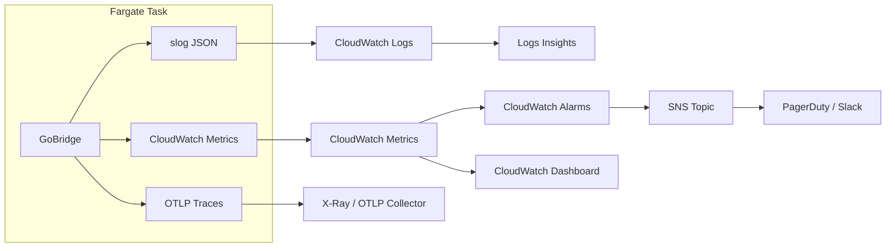

# Monitoring & Observability on AWS

GoBridge provides three observability pillars -- structured logging, metrics, and
distributed tracing -- through pluggable port interfaces. On AWS, these map to
CloudWatch Logs, CloudWatch Metrics, and X-Ray (via an OTLP sidecar).

This page covers the metrics pillar: the exporter, and the complete catalogue of
every series the runtime and its adapters publish. Alarms, logging, dashboards
and tracing each have their own page, listed under [Page map](#page-map).

For architecture overview, see [AWS Overview](overview.md).
For generic observability guidance, see [Deployment Guide](../deployment-guide.md#observability).

---

## Observability Architecture

The following diagram shows how telemetry data flows from a Fargate task to the
AWS services that store, alert, and visualize it.



**Key design decisions:**

- Logs go to CloudWatch Logs via the Fargate `awslogs` log driver -- no agent needed.
- Metrics use the CloudWatch adapter (`adapters/aws/metrics/cloudwatch/`) and call
  `PutMetricData` directly, avoiding the CloudWatch agent.
- Traces export via OTLP HTTP to an AWS Distro for OpenTelemetry (ADOT) sidecar
  container, which forwards spans to X-Ray.

---


## CloudWatch Metrics

The CloudWatch metrics adapter publishes metrics under the `GoBridge/Runtime`
namespace (defined by `shared.MetricNamespace`). It buffers counter, gauge,
histogram, and timer metrics in memory and flushes them periodically via
`PutMetricData`. Histograms and timers are aggregated into `StatisticSet` values
(min/max/sum/count) to minimize API calls.

> **No percentile latency.** A `StatisticSet` carries only Min, Max, Sum, and
> SampleCount, so CloudWatch can derive Average, Minimum, Maximum, Sum, and
> SampleCount — never `p50`, `p95`, or `p99`. Every GoBridge histogram and timer,
> including all `*Latency` metrics such as `DeliveryE2ELatency`, publishes this
> way. Chart latency with `Average` and `Maximum`; a percentile statistic returns
> no data.

### Go Bootstrap

```go
import (
    cwmetrics "github.com/mariotoffia/gobridge/adapters/aws/metrics/cloudwatch"
    "github.com/mariotoffia/gobridge/runtime"
)

exporter, err := cwmetrics.New(ctx, "GoBridge/Runtime",
    cwmetrics.WithRegion("eu-west-1"),
    cwmetrics.WithFlushInterval(30*time.Second),
    cwmetrics.WithBufferSize(1000),
)
if err != nil {
    log.Fatalf("metrics init: %v", err)
}
defer exporter.Close(ctx)

rt := runtime.New(
    runtime.WithMetrics(exporter),
)
```

### Configuration Options

| Option | Default | Description |
|--------|---------|-------------|
| `WithRegion(r)` | SDK default | AWS region for the CloudWatch API |
| `WithNamespace(ns)` | constructor arg | CloudWatch metric namespace |
| `WithFlushInterval(d)` | 60s | How often buffered metrics flush |
| `WithBufferSize(n)` | 1000 | Max buffered non-histogram metrics before async flush |
| `WithDefaultTags(tags...)` | none | Tags added to every metric as dimensions |
| `WithEndpoint(url)` | AWS default | Custom endpoint (for LocalStack) |
| `WithLogger(l)` | `slog.Default()` | Structured logger for dropped/requeued metrics & invalid dimensions. `WithLogger(nil)` suppresses this logging. |
| `WithMaxRetryDatums(n)` | 10000 | Bound on datums requeued after a failed `PutMetricData` before the oldest are dropped |
| `WithRollupMetrics(names...)` | none | Emit a second, **dimensionless** copy of each named metric so zero-dimension alarms can match. Pass `DefaultRollupMetrics()...`. |
| `WithInstanceTag(id)` | none | Add the `instance_id` dimension (never applied to rollup copies) so per-task series in a fleet do not collide. |

A single background flusher goroutine drains the buffer on the flush interval,
governed so a slow `PutMetricData` cannot stack overlapping flushes.

Every built-in alarm reads a **dimensionless** series, and the runtime emits most
metrics with a `route_id` / `session_id` / `partition` dimension. `WithRollupMetrics`
is what bridges the two, and the metrics it must cover are listed in
[Rollup metrics the built-in alarms require](alarms.md#rollup-metrics-the-built-in-alarms-require).
Configure the rollup list **and** the namespace the alarms read, or the alarms sit
at `INSUFFICIENT_DATA` — they do not fail loudly, they simply never fire.

### Key Metrics

The runtime emits the following metrics under `GoBridge/Runtime`. Dimensions are
the exact `shared.Tag` keys set at each emission site. Every `*Latency` metric is
Milliseconds published as a `StatisticSet` (no percentiles). The Unit column of
each table below carries the rest, and the distinction that matters is
counter versus gauge: a counter only ever increases and is read with `Sum`, a
gauge reports a current value and is read with `Maximum`. Reading a gauge with
`Sum` produces a number that means nothing.

**Messages & delivery**

| Metric | Dimensions | Unit | Description |
|--------|-----------|------|-------------|
| `MessagesReceived` | `route_id` | Count | Messages received from transports |
| `MessagesSent` | `route_id` | Count | Messages sent successfully (ingress ack and outbox drain) |
| `MessagesDropped` | `route_id`, `reason` | Count | A terminal drop settled WITHOUT a DLQ record and WITHOUT a successful send: permanent, rejected, or retry-unsupported under a drop policy, or a missing DLQ store. Not a filter, not an expiry. |
| `MessagesFiltered` | `route_id`, `processor` | Count | A processor deliberately discarded the message (`ErrMessageFiltered`) under `OnFiltered=drop` — a policy discard, distinct from a fault drop. `processor` is omitted when the drop is unattributed. |
| `MessagesExpired` | `route_id` | Count | Message expired before delivery under `OnExpired=drop`. The drain-path bulk sweep also tags `session_id`. |
| `RouteErrors` | `route_id` | Count | Delivery errors by route |
| `DeliveryE2ELatency` | `route_id` | Milliseconds | End-to-end delivery latency (StatisticSet — chart `Average`/`Maximum`) |
| `ReceiveCountUnparseable` | `route_id` | Count | Redelivery-count header was present but not an integer; receiveCount failed open to a first delivery |

`MessagesReceived`, `MessagesSent`, `MessagesDropped`, `MessagesFiltered`,
`MessagesExpired`, `DLQEntries`, and in-flight close the conservation law
`received = sent + dropped + filtered + expired + dlq + inflight`. A rising
`MessagesDropped` is the single signal for silent message loss, so keep it split
from the intentional filter and TTL counters.

**Outbox**

| Metric | Dimensions | Unit | Description |
|--------|-----------|------|-------------|
| `OutboxDepth` | `partition` | Count (gauge) | TRUE pending backlog — dual-emitter (ingress + drain), see the depth note below |
| `OutboxClaimBatchSize` | `partition` | Count (gauge) | Records the drainer CLAIMED on its last poll — a liveness/throughput signal that saturates at the claim ceiling; NOT the backlog (kept separate from `OutboxDepth`) |
| `OutboxClaimedDepth` | `partition` | Count (gauge) | Records currently CLAIMED — work an owner took but has not driven to a terminal state (via the store's optional `OutboxClaimedDepthReporter`). `OutboxDepth` at zero with a STANDING non-zero value here is stranded work, or an ordering-key group stalled behind a stranded head. Normal in-flight work returns to zero every cycle |
| `OutboxDepthFailures` | `partition` | Count | Drain cycles where a supported depth reporter's count query FAILED (real DB/read error, not "unsupported"). On such a cycle `OutboxDepth` is deliberately NOT emitted so the missing-data alarm fires; a rising value means the depth query itself is broken |
| `OutboxPersistLatency` | `route_id` | Milliseconds | Persist-call latency |
| `OutboxDrainLatency` | `session_id` | Milliseconds | Drain-batch latency |
| `OutboxClaimRecoveries` | `session_id` | Count | Claimed records with a replay count > 1 (recovered after a crash) |
| `OutboxClaimConflicts` | `partition` | Count | Per-record claim transactions aborted by concurrent Persist/Claim/Complete contention |
| `OutboxCompletions` | `route_id` | Count | Records durably completed after a successful send |
| `OutboxDeferred` | `route_id` | Count | Claimed records the drainer could not process this cycle (batch deadline hit) and released for the next drain |
| `OutboxReplayCount` | `route_id` | Count | Records re-attempted after a prior claim |
| `OutboxRecordFailures` | `route_id` | Count | Records that failed processing this drain cycle |
| `OutboxDuplicateRisk` | `route_id` | Count | Complete failed after a successful send — the message may be re-delivered |
| `OutboxDuplicateSuppressed` | `route_id` | Count | Ingress persist rejected because the outbox already holds that envelope identity; the source was acked without a new record. Benign for a redelivery — a sustained rate on one route means that source's producers are reusing envelope IDs, and each suppression discards a distinct message |
| `OutboxExpiredBeforeSend` | `route_id` | Count | Record expired before the drainer launched its send |
| `OutboxDrainStalled` | `session_id`, `route_id` | Count | Drain batch whose in-flight sends did not return within the watchdog grace (a sender ignoring `ctx`) |
| `DrainSkippedNoLease` | `session_id`, `route_id` | Count | Drain cycle skipped because the drainer held no lease |
| `OutboxStranded` | `partition` | Count | Durable records left with NO drainer after an explicitly forced destructive reload, re-counted on the new runtime's store after a successful swap. The value is the pending count. Non-zero means an operator must drain that partition by hand or restore a route/session for it; a non-forced orphaning reload is refused before the swap, so this can only follow a deliberate override |

> **`OutboxDepth` reports the true backlog; `OutboxClaimBatchSize` is liveness.**
> This partition-keyed depth gauge is emitted from two sites, each reporting a
> real pending count (never a claim-batch size): the ingress path emits the
> pending count it observed (bounded by `MaxOutboxDepth`), and the drain path
> emits the EXACT remaining pending count read from the store's optional
> `ports.OutboxDepthReporter` capability — a dedicated COUNT primitive that does
> not saturate at the claim ceiling — so a deep backlog reports its real size.
> On a store that has **not** adopted `OutboxDepthReporter` yet, the drain path
> falls back to the claimed count (a saturating LOWER BOUND) to keep the gauge
> continuous; implement the capability on your outbox store for an exact,
> unbounded depth signal. The default depth alarms read the `Maximum` statistic
> and treat missing data as breaching (silence means the drainer/bridge died).
> The honest per-cycle claim size is published SEPARATELY as
> `OutboxClaimBatchSize`, so a full batch can never masquerade as a shallow
> backlog. When a store DOES support the capability but its count query hits a
> REAL failure (a DB/read error, distinct from "not implemented"), the drainer
> does NOT fall back to the claimed count — it SKIPS the `OutboxDepth` emission
> for that cycle (so a persistently broken query trips the breaching-on-missing
> alarm rather than hiding behind a saturating lower bound) and records it on
> `OutboxDepthFailures` plus a structured error log.

**Store health**

These two counters are emitted by the store adapters (not the runtime core) and
publish under the same `GoBridge/Runtime` namespace whenever the store's metrics
exporter is wired -- which the runtime does. Both carry an adapter-owned
dimension, so the zero-dimension rollup alarms do not match them; alarm on the
dimensioned series.

| Metric | Dimensions | Unit | Description |
|--------|-----------|------|-------------|
| `DynamoDBOutboxClaimScanPages` | `partition` | Count | Number of DynamoDB Query pages a single outbox `Claim` scanned, emitted only when that count crosses 8. The scan path pages the whole partition to guarantee oldest-first delivery, so a sustained deep backlog (draining after an egress outage on an exclusive session) makes each Claim O(backlog) and the drain quadratic. Two things put a claim on that path: a table without the `ClaimIndex` GSI, or a partition whose records carry ordering keys (a GSI cannot prove a record has no older unseen sibling, so keyed claims read the base table consistently -- see ADR 0005). On a table that HAS `ClaimIndex`, a rising value means ordering keys, not a missing index; the store logs which once per process. |
| `DynamoDBOutboxClaimTruncated` | `partition` | Count | A `Claim` that ended early because a per-record transaction failed transiently (throttle, deadline, network) AFTER earlier records were already durably claimed. The short batch is returned rather than discarded, so nothing is stranded; a rising value usually means sustained throttling or a claim budget too small for the batch size. |
| `SQLiteStoreUnhealthy` | `entity` | Count | A fatal SQLite outbox storage fault -- disk full, corruption, read-only, or not-a-database (`entity=outbox`). Classified PERMANENT because no retry clears it without operator action. The drain loop keeps polling and records stay durable -- this is an observability signal, not a halt -- so alert on it directly: it means free disk / restore the file, distinct from transient throttling noise. |

The DynamoDB DLQ **unbounded delete-all** (`DeleteByFilter` with no cap, i.e.
`Limit <= 0`) logs one throttled WARN --
`dynamodbdlq: unbounded delete-all exceeded max_scan_pages and is still running`
-- once it pages past `max_scan_pages`. It still pages to exhaustion; the WARN is
informational (a large purge is running), not an error. Narrow the filter's time
range to bound it.

Keyless partitions never pay that cost: the required `ClaimIndex` GSI serves
them in O(limit). Only ordering-keyed partitions reach the scan, because no
eventually-consistent index can prove a keyed record has no older unseen
sibling; the bounded alternative would be a local secondary index on
`(PK, claim_sort)` read with `ConsistentRead`, which can only be created with the
table. See [ADR 0005](../adr/0005-outbox-partition-claim-design.md) and the
[outbox table schema runbook](../runbooks/dynamodb-outbox-table-schema.md).

**Lease**

| Metric | Dimensions | Unit | Description |
|--------|-----------|------|-------------|
| `LeaseAcquireLatency` | `lease_id` | Milliseconds | Lease-acquire latency |
| `LeaseRenewLatency` | `lease_id` | Milliseconds | Lease-renew latency |
| `LeaseAcquireFailures` | `lease_id` | Count | Failed lease acquisitions |
| `LeaseExpiries` | `lease_id` | Count | Leases that expired without renewal (step-down) |
| `LeaseTransfers` | `lease_id` | Count | Lease re-acquired by this instance (hand-off) |
| `BrokerHealthStepDown` | `lease_id` | Count | An active exclusive owner released its lease because its broker path stayed non-converged past the configured threshold, so a healthy standby could take over a node-local broker outage. Emitted **only** when `broker_health_step_down` is a positive duration, so a zero series on a deployment that set it to `off` is expected, not healthy |
| `RouteOwnerUnknown` | `reason` | Count | A route-locator decision taken while the owner of an exclusivity-sensitive route could not be determined. `reason` is the whole value of the metric: `lease_expired` (this node's clock is at or past the owner-written expiry), `lease_unowned` (no lease row — a normal transfer window), `store_unavailable` (a lease-store error with no usable cached owner), or `store_breaker_open` (refused without calling a repeatedly-failing store). Fleet clock skew above the renew margin shows up here as rising `lease_expired` against a **healthy** owner, and a whole-fleet cold start as `lease_expired` for one observation window. Both are advisory routing effects only — the locator mints no token, so data-path fencing stays skew-immune — which is exactly why the signal is needed: without it, 502/503 responses have no way to separate skew from a dead store |

**DLQ**

| Metric | Dimensions | Unit | Description |
|--------|-----------|------|-------------|
| `DLQEntries` | `route_id`, `category` | Count | Messages written to the DLQ (an INGRESS COUNTER — only ever increases) |
| `DLQDepth` | none | Count (gauge) | CURRENT outstanding DLQ entries — the standing backlog "right now", so a stale burst after traffic stops is visible. Sampled via the store's optional `ports.DLQDepthReporter`; emitted as a dimensionless fleet total. |
| `DLQWriteFailures` | none | Count | DLQ write attempts that failed after retries, or were skipped with no held lease |
| `DLQDuplicateSuppressed` | none | Count | DLQ writes the store refused as an existing entry — the same terminal event recorded twice, collapsed onto one row and reported as success. A rising value means settlement is failing after DLQ writes land, not that the DLQ store is unhealthy |
| `DLQRedrives` | `route_id` | Count | DLQ entries an admin redrive re-injected successfully |
| `DLQRedriveFailures` | `route_id` | Count | Redrive attempts that failed during or after the claim |
| `DLQWriteHold` | none | Milliseconds | Wall-clock time a synchronous DLQ write held its caller, and with it a route and a global concurrency slot. The write is deliberately synchronous and confirmed **before** the source delivery is settled — evidence must be at least as durable as the message it describes — so a DLQ-store outage backpressures intake instead of losing evidence. The hold is bounded by the router's attempt/timeout/backoff budget (10.5 s in the shipped wiring). Emitted on every route call, success and failure, so the series has a baseline instead of silence; a sustained maximum approaching the ceiling means the DLQ store, not the route, is stalling intake |

**Circuit breaker**

| Metric | Dimensions | Unit | Description |
|--------|-----------|------|-------------|
| `CircuitBreakerStateChanged` | `processor`, `key`, `to` | Count | Every open/half-open/closed transition (`to` is the new state) |
| `CircuitBreakerTrips` | `processor`, `key` | Count | Transitions into the open state |
| `CircuitBreakerRejections` | `processor`, `key` | Count | Calls rejected while the breaker is open |

**Processor**

| Metric | Dimensions | Unit | Description |
|--------|-----------|------|-------------|
| `ProcessorPanics` | `route_id`, `processor` | Count | Processor panics recovered in the chain |
| `ProcessorTimeouts` | `route_id` | Count | Processor invocations that exceeded the per-processor timeout |

**Session & route**

| Metric | Dimensions | Unit | Description |
|--------|-----------|------|-------------|
| `MQTTReconnects` | `session_id` | Count | Session reconnects (historical wire name; emitted transport-agnostically by the session manager) |
| `ReconcileFailures` | `session_id` | Count | Reconcile-on-reconnect failures |
| `SessionRestarts` | `session_id` | Count | Per-session supervised restarts (isolated, capped backoff) |
| `RouteRestarts` | `route_id` | Count | Per-route supervised restarts (isolated, jittered capped backoff) |
| `DeliveryPanics` | `route_id` | Count | Delivery-goroutine panics recovered in the route runner |

**Credentials**

| Metric | Dimensions | Unit | Description |
|--------|-----------|------|-------------|
| `CredentialRefreshFailures` | none | Count | Credential resolve failures during rotation polling (initial seed and periodic). No dimension by design (the URI may hold secrets). Rolled up for instance-tagged fleets; no default alarm. |
| `CredentialRotationApplied` | none | Count | Rotations applied to a live transport — one per target whose `ApplyCredentials` succeeded (a URI shared by N sessions counts N on one rotation). Success counterpart to `CredentialRefreshFailures`. Not rolled up; no default alarm. |
| `CredentialResolveFailure` | `code` | Count | Repository fetch failures at the resolver choke point, tagged with the bounded error code (`NOT_AUTHORIZED`, `UNAVAILABLE`, `NOT_FOUND`, …) so a permission denial is distinguishable from a backend outage. Covers build-time resolves, rotation polls, and reactive re-resolves. Not rolled up; no default alarm. |
| `CredentialStaleServed` | `code` | Count | Stale-while-error serves — the resolver returned an expired last-known-good credential after a retryable fetch error (`code` is the retryable error). A rising value flags a secrets backend unreachable longer than the cache TTL. Never emitted for permanent errors. Not rolled up; no default alarm. |

**Reconfiguration**

| Metric | Dimensions | Unit | Description |
|--------|-----------|------|-------------|
| `ConfigReloads` | `state` | Count | Live reconfiguration attempts, tagged `state=success` or `state=failure`. A rising failure rate means the running runtime keeps rejecting a config it is offered |
| `ConfigDegraded` | none | Count (gauge) | `1` while the configuration machinery is degraded, back to `0` when a reload next succeeds or the condition resolves. Two conditions raise it and `/deephealth` (`ConfigWatchHealth.Reason`) says which: live reconfiguration is no longer available (the config-change stream closed and the bridge runs blind on its last good config), or a reload was **applied** but its transport sessions never converged within the transport's activation budget — reload success is green while the transport cannot reach its broker state (an ACL-denied topic, rotated-away credentials). The second clears on its own when the sessions converge |

**Cluster rollout**

Emitted by every member of a coordinated cohort. A rollout is the one config
change whose outcome is not local — a member can be perfectly healthy while the
cohort's barrier is stuck — so no per-node signal covers them.

| Metric | Dimensions | Unit | Description |
|--------|-----------|------|-------------|
| `ClusterRolloutState` | `state` | Count (gauge) | `1` on exactly one of `proposed`, `staging`, `committed`, `aborted`, from this member's own observation of the shared rollout row. Alert on `proposed` or `staging` reading `1` for longer than the rollout TTL: the barrier is not converging |
| `ClusterRolloutAcks` | none | Count (gauge) | How many epoch members have acknowledged the active rollout. Below `ClusterRolloutEpoch` while the state gauge sits on `staging`, it identifies a specific member holding the cohort up |
| `ClusterRolloutEpoch` | none | Count (gauge) | The frozen epoch size — the member count the acks are measured against |
| `ClusterRolloutResolved` | `outcome` | Count | Terminal outcomes, `outcome=committed` or `outcome=aborted`. Every member counts the same resolution, so the series is per-member: a member that never observes a resolution its peers did has diverged. A rising aborted rate means changes are being rejected — read the rollout row's reason, or `/deephealth`, for which member and why |
| `ClusterRolloutStoreCalls` | `operation`, `outcome` | Count | Every rollout-store and coordinator-lease call the barrier makes, by class (`read`, `vote`, `decide`, `lease`, `artifact`, `propose`) and outcome (`success`, `failure`, `timeout`, `blocked`). `timeout` means the call blew its own budget and was abandoned; `blocked` means the barrier refused to start a call because an earlier abandoned one has still not returned. Either, sustained, means the rollout store is not answering |
| `ClusterRolloutObservationAge` | none | Seconds (gauge) | How long ago this member last read the rollout row. Every other rollout series is a projection of that read, so an operator needs to know whether it is two seconds or ten minutes old before acting on it. Alert above a few poll intervals |
| `ClusterRolloutRetries` | `operation` | Count (gauge) | Consecutive attempts at a local safety operation this member has not yet completed (`apply`, `artifact`, `revert`), and zero once it succeeds. A non-zero value that stays non-zero is a member repairing itself; one that reaches the bound becomes `ClusterRolloutTerminal` |
| `ClusterRolloutDiverged` | none | Count (gauge) | `1` while this member is NOT running the generation the cohort has already decided on. The one genuinely per-member rollout series: every other one describes the shared row, which reads `committed` identically on a converged member and on one whose swap failed. The barrier is atomic before the commit and per-member after it ([ADR 0013](../adr/0013-coordinated-cluster-config-rollout.md)), so a short `1` during a rollout is normal; a `1` that persists past the apply repair's bound is a split cohort. Alarm on the fleet **Maximum** over several evaluation periods |
| `ClusterRolloutTerminal` | none | Count (gauge) | The rollout generation whose safe state this member could not reach — a committed config it could not durably record, or a provisional one it could not revert — and zero when there is none. Not a rate: any non-zero value needs an operator, and `/deephealth` carries which action. A member that cannot record the artifact is running the CORRECT config and must **not** be replaced (that would boot it on the older generation) — repair the rollout store. A member that cannot revert is running rejected config, and replacing it is the repair |

**Generic delivery (opt-in wrappers)**

Emitted **only** through `runtime.NewInstrumentedReceiver` /
`runtime.NewInstrumentedReceiverCapabilityPreserving` — a library API for
embedders. The shipped adapters self-instrument under adapter-specific names
instead (`SQSReceiveLatency`, `ASBReceiveLatency`, `SQSVisibilityExtensions`, …),
so these two series are absent on a config-driven deployment.

| Metric | Dimensions | Unit | Description |
|--------|-----------|------|-------------|
| `AckLatency` | caller-supplied | Milliseconds | Time to settle a delivery on the source transport |
| `VisibilityExtensions` | caller-supplied | Count | Visibility/lock extensions taken on an in-flight delivery |

The dimension key **and** value are arguments to the wrapper constructor, so the
embedder chooses them; keep them low-cardinality, as the warning below requires.

**Transport (MQTT)**

The MQTT adapter self-instruments its own counters and gauges, tagged
`session_id`. They are catalogued with their operator guidance in
[Troubleshooting — MQTT](../adapter-diagnostic-metrics.md#mqtt-adaptersmqtttransportpaho);
the three the shipped alarms read are `MQTTIngressPoisonDropped`
(acked-and-dropped ingress that breached a local cap — acknowledged loss),
`MQTTSessionTakeover` (another client on the same `client_id`) and
`MQTTQoSDowngraded` (the broker granted weaker delivery than configured).

Two more are worth a hand-authored alarm and have none:
[`MQTTEgressRejected`](alarms.md#alarms-you-must-author-yourself) — a publish
refused before any byte reached the socket, returned to the route as permanent
and therefore DLQ'd rather than retried — and `MQTTReceiverEmitRejected` on its
`outcome=lost` dimension, which is acknowledged best-effort loss. The un-acked
window is reported by `MQTTUnsettled`, `MQTTOldestUnsettledAge` and
`MQTTReceiveWindowUtilization`; when it stops draining, follow the
[stuck-settlement runbook](../runbooks/stuck-mqtt-settlement.md).

**Transport (SQS)**

The SQS adapter self-instruments twelve metrics, all tagged by `queue_url`
(bounded cardinality). Five are latency timers (Milliseconds, StatisticSet);
seven are counters. All emit on both the programmatic and config-driven paths
(see the note below).

| Metric | Dimensions | Unit | Description |
|--------|-----------|------|-------------|
| `SQSPollLatency` | `queue_url` | Milliseconds | `ReceiveMessage` long-poll round-trip latency |
| `SQSReceiveLatency` | `queue_url` | Milliseconds | Per-message receive-to-convert latency |
| `SQSDeleteLatency` | `queue_url` | Milliseconds | `DeleteMessage` (ack) call latency |
| `SQSSendLatency` | `queue_url` | Milliseconds | `SendMessage` call latency |
| `SQSSendBatchLatency` | `queue_url` | Milliseconds | `SendMessageBatch` call latency |
| `SQSVisibilityExtensions` | `queue_url` | Count | Explicit `Extend` `ChangeMessageVisibility` calls |
| `SQSAutoExtends` | `queue_url` | Count | Successful background auto-extend `ChangeMessageVisibility` calls |
| `SQSMalformedMessages` | `queue_url` | Count | Messages that failed envelope conversion |
| `SQSDroppedAttributes` | `queue_url` | Count | Envelope headers dropped from a send over the SQS attribute count/size budget |
| `SQSPollErrors` | `queue_url` | Count | `ReceiveMessage` poll failures |
| `SQSSettlementErrors` | `queue_url` | Count | Failed Ack (`DeleteMessage`) and Retry (`ChangeMessageVisibility`) settlement calls |
| `SQSAutoExtendFailures` | `queue_url` | Count | Failed background auto-extend `ChangeMessageVisibility` calls |

`SQSPollErrors`, `SQSSettlementErrors`, and `SQSAutoExtendFailures` are failure
counters — a poll, settlement, or auto-extend failure that was previously only a
Warn log and thus metrics-invisible. Alert on a rising rate on any of the three.

**Exporter self-metrics**

| Metric | Dimensions | Unit | Description |
|--------|-----------|------|-------------|
| `ExporterDroppedDatums` | none | Count | Datums accepted into the export pipeline then lost: buffer hard cap, retry-buffer overflow on requeue, or a non-retryable (validation-class) `PutMetricData` rejection after buffering |
| `ExporterRejectedDatums` | none | Count | Emissions rejected at `add()` before entering the pipeline: the value was NaN or ±Inf |

Dimensions map directly to `shared.Tag` key-value pairs. The dimension keys in
use are `route_id`, `session_id`, `lease_id`, `partition`, `entity`, `category`,
`reason`, `processor`, `key`, `to`, `queue_url`, `state`, `outcome`, `operation`,
`code`, and `instance_id` (added by `WithInstanceTag`, never on rollup copies).

> **Adapter metrics now emit on the config-driven path (SQS).** The SQS
> factory threads a `MetricsExporter` into every receiver and sender it builds,
> so the adapter's twelve SQS metrics (`SQSReceiveLatency`, `SQSPollLatency`,
> `SQSDeleteLatency`, `SQSSendLatency`, `SQSSendBatchLatency`,
> `SQSVisibilityExtensions`, `SQSAutoExtends`, `SQSMalformedMessages`,
> `SQSDroppedAttributes`, `SQSPollErrors`, `SQSSettlementErrors`,
> `SQSAutoExtendFailures`) now report when the transport is built from
> configuration or a plugin — not only on the programmatic path. Earlier
> builds left `cfg.Metrics` nil on the factory path and each adapter fell back
> to a no-op exporter, so these series were silently absent on config-driven
> deployments. Pass the exporter as `sqs.NewFactory(logger, metrics)` (the
> runtime wires this for you). The Service Bus factory does **not** yet thread
> a metrics exporter, so `ASBReceiveLatency` and the other ASB series still
> emit only when the adapter is constructed programmatically with an explicit
> `cfg.Metrics`; on the factory path they fall back to no-op.

> **Dimension cardinality warning.** CloudWatch bills and indexes per unique
> dimension-value combination, and each distinct combination is a separate
> metric. Do **not** use unbounded/high-cardinality values such as message IDs,
> correlation IDs, or per-request identifiers as dimensions — they explode cost
> and make dashboards unusable. Prefer low-cardinality keys (`route_id`,
> `category`, `partition`). The exporter enforces the CloudWatch
> hard limits defensively: dimensions with an empty name or value are dropped,
> name/value are truncated to 256 bytes, and at most 30 dimensions are kept per
> metric; excess/invalid dimensions are dropped with a logged warning rather
> than silently truncated. These events are logged via `slog.Default()` unless
> a logger is set with `WithLogger` (or suppressed with `WithLogger(nil)`).

### Exporter loss accounting

The exporter reports its own losses through its own pipeline, with no dimensions.
`ExporterRejectedDatums` counts emissions rejected at `add()` time before they
enter the pipeline: the value was NaN or ±Inf, which would otherwise fail the
whole all-or-nothing `PutMetricData` batch. `ExporterDroppedDatums` counts datums
that entered the pipeline and were then lost: the buffer hard cap, retry-buffer
overflow on requeue, or a non-retryable (validation-class) `PutMetricData`
rejection after buffering. Both are worth a hand-authored alarm — a metrics
pipeline dropping datums makes every other signal on this page an undercount.

---

## Page map

| Page | Covers |
|------|--------|
| [CloudWatch alarms](alarms.md) | Which alarms are provisioned by the CDK bundle, by `DefaultAlarms()`, and by nobody; the rollup metrics they depend on; how to author the rest. |
| [Logging, dashboards and tracing](logging-and-dashboards.md) | Structured logging and Logs Insights queries, dashboard layout, ADOT/X-Ray tracing, log-based metric filters, and Grafana. |
| [Troubleshooting](../troubleshooting.md) | Error codes, and the adapter diagnostic metrics (MQTT, AMQP, HTTP) this page's catalogue points at. |
| [Operational runbooks](../runbooks/README.md) | The incident path behind each signal: what to check, and what is safe to do. |
