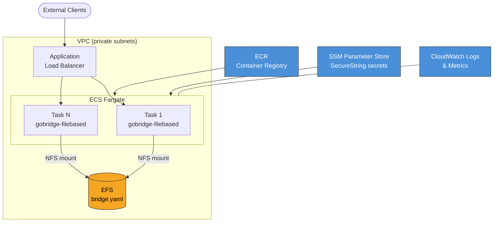

# AWS Deployment Overview

GoBridge runs on AWS as an ECS Fargate service with EFS for configuration and
SSM Parameter Store for secrets. This guide covers the architecture, design
decisions, and the CDK construct library that wires everything together.

For generic deployment considerations, see [Deployment Guide](../deployment-guide.md).
For configuration details specific to AWS, see [Configuration on AWS](configuration.md).

---

## Architecture

The diagram below shows the full AWS architecture for a file-based GoBridge
deployment. Every component is created or referenced by the CDK constructs
described later in this guide.



| Component | Role |
|-----------|------|
| **ECR** | Stores the `gobridge-filebased` container image. |
| **VPC** | Isolates the Fargate tasks in private subnets with NAT egress. |
| **ECS Fargate** | Runs the bridge container without EC2 instance management. |
| **EFS** | Provides a shared, hot-reloadable config file mount across all replicas. |
| **ALB** | Terminates TLS and routes HTTP traffic to the admin, monitor, or transport ports. |
| **SSM Parameter Store** | Holds API keys and credentials as `SecureString` parameters. |
| **CloudWatch** | Collects structured logs and optional custom metrics. |

---

## Why ECS Fargate

Fargate is the recommended compute platform for GoBridge because it removes
the operational overhead of managing EC2 instances, AMI patches, and cluster
bin-packing. You get:

- **Serverless containers** -- no EC2 instances to provision or scale.
- **Per-second billing** -- pay only while tasks are running.
- **Fargate Spot** -- up to 70% cost reduction for non-critical or
  development workloads that tolerate interruption.
- **Built-in integration** with EFS, ALB, CloudWatch, and IAM.

### Sizing Guidance

The table below provides starting points. We recommend load-testing with your
actual message shapes and processor chains before finalizing.

| Throughput | CPU (units) | Memory (MiB) | Fargate Spot? |
|------------|-------------|---------------|---------------|
| < 100 msg/s | 256 | 512 | Yes |
| 100 -- 1 000 msg/s | 512 | 1024 | Evaluate |
| > 1 000 msg/s | 1024 | 2048 | No |

The CDK construct defaults to **512 CPU / 1024 MiB** with auto-scaling up to
4 tasks at a 70% CPU target. Override these via the `CPU`, `MemoryMiB`,
`ScalingMaxCapacity`, and `CpuTargetPercent` props on `GoBridgeServiceProps`.

---

## EFS for Configuration

### Why EFS Over Alternatives

| Alternative | Limitation |
|-------------|-----------|
| **Environment variables** | 4 KiB per variable, 32 KiB total. Bridge configs routinely exceed this. |
| **S3 + init container** | Config changes require a task restart; no hot-reload. |
| **EFS** | Shared POSIX filesystem. Poll watcher detects changes within seconds; no restart required. |

GoBridge uses a **poll watcher** (default interval: 1 second) to detect config
file changes on the mounted EFS volume. When the file changes, the runtime
reloads routes, processors, and transports without dropping in-flight messages.

### Access Point Design

The CDK `GoBridgeEfsConfig` construct creates an EFS access point with these
defaults:

| Setting | Default | Source |
|---------|---------|--------|
| POSIX UID | `1000` | `GoBridgeEfsConfigProps.PosixUID` |
| POSIX GID | `1000` | `GoBridgeEfsConfigProps.PosixGID` |
| Access point path | `/gobridge` | `GoBridgeEfsConfigProps.AccessPointPath` |
| Directory permissions | `755` | Set in `CreateAcl` |

The Dockerfile should create a non-root user with UID/GID 1000 so the
container identity matches the EFS access point owner.

### Mount Path vs. Access Point Path

These two paths serve different purposes:

- **`AccessPointPath`** (`/gobridge` by default) -- the directory *inside* the
  EFS filesystem where config files live. This is set when the access point is
  created and is fixed for the life of the filesystem.
- **`ConfigMountPath`** (`/mnt/gobridge` by default) -- the directory *inside
  the container* where EFS is mounted. The container sees
  `/mnt/gobridge/bridge.yaml`, but EFS stores it at `/gobridge/bridge.yaml`.

The `BootstrapConfig.ConfigFilePath` should reference the container mount path,
for example `/mnt/gobridge/bridge.yaml`.

### File Size Limit

The file-based config loader enforces a **4 MiB** maximum file size. This is
more than enough for even the most complex multi-route configurations.

---

## SSM Parameter Store for Secrets

GoBridge resolves API keys and credentials from AWS Systems Manager Parameter
Store at startup. All parameters should be stored as **SecureString** type,
which encrypts values at rest using KMS.

### Credential URI Mapping

The `BootstrapConfig` maps logical names to SSM parameter paths. At startup
the bootstrap library resolves each parameter and injects the plaintext value
into the runtime configuration.

| Bootstrap field | Example SSM parameter | Runtime use |
|----------------|----------------------|-------------|
| `AdminAPIKeyParam` | `/gobridge/admin-key` | Admin HTTP API `X-API-Key` header |
| `MonitorAPIKeyParam` | `/gobridge/monitor-key` | Monitor HTTP API `X-API-Key` header |
| `HTTPReceiverAPIKeyParams["rx-1"]` | `/gobridge/rx-1-key` | HTTP receiver authentication |
| `HTTPSenderAPIKeyParams["tx-1"]` | `/gobridge/tx-1-key` | HTTP sender authentication |

`AdminAPIKeyParam` is **required**; the bootstrap validator rejects configs
without it. All other parameters are optional.

### KMS Encryption

The default AWS-managed SSM key (`alias/aws/ssm`) works without additional
IAM configuration. If you use a **customer-managed KMS key (CMK)**, you must
add an explicit `kms:Decrypt` grant for the ECS task role on that key.

### DynamoDB Stores

When the bridge config uses DynamoDB-backed stores (`lease`, `outbox`, or
`dlq`), the stack grants the ECS task role read/write access on each table the
store names. Two operator responsibilities follow:

- **Pre-provision the tables.** The stack imports each table by name and grants
  access to it; it does **not** create the table, its key schema, or its TTL.
  Provision each DynamoDB table out-of-band (matching the adapter's expected key
  schema) before deploying.
- **Set `table_name` on every store.** A store that omits `table_name` falls
  back to the adapter's built-in default table, which the stack cannot name and
  therefore cannot grant — the task role would hit `AccessDenied` at runtime.
  Synth emits a warning for this case; set `table_name`, or grant the default
  table to the task role externally.

### DevMode Guard

The `BootstrapConfig.SSMEndpoint` field allows overriding the SSM endpoint for
local development against tools like LocalStack. To prevent accidental use of
custom endpoints in production, the bootstrap validator **rejects**
`SSMEndpoint` unless `DevMode` is explicitly set to `true`:

```go
// This passes validation -- DevMode enables the custom endpoint.
bootstrap := infra.BootstrapConfig{
    SSMEndpoint: "http://localhost:4566",
    DevMode:     true,
}

// This FAILS validation -- SSMEndpoint without DevMode is rejected.
bootstrap := infra.BootstrapConfig{
    SSMEndpoint: "http://localhost:4566",
}
```

When `DevMode` is `true` and `SSMEndpoint` is set, the bootstrap library
automatically configures static test credentials (`test`/`test`) so that
LocalStack access works without real AWS credentials.

---

## Container Image

### Multi-Stage Dockerfile

We recommend a multi-stage build that produces a minimal Alpine image. The
`CGO_ENABLED=1` flag is required because the SQLite store adapter uses cgo.

```dockerfile
FROM golang:1.25-alpine AS builder
WORKDIR /src
COPY . .
RUN apk add --no-cache gcc musl-dev
RUN CGO_ENABLED=1 go build -o /gobridge-filebased \
    ./deployment/aws-filebased-config/lib/cmd/gobridge-filebased

FROM alpine:3.20
RUN apk add --no-cache ca-certificates wget
RUN adduser -D -u 1000 gobridge
COPY --from=builder /gobridge-filebased /usr/local/bin/
USER gobridge
ENTRYPOINT ["gobridge-filebased"]
```

Key points:

- **UID 1000** matches the EFS access point POSIX user.
- **`ca-certificates`** is needed for TLS connections to AWS services.
- **`wget`** is available for container health probes against the monitor
  endpoint (`wget -q --spider http://localhost:8081/api/v1/monitor/health`).

### ECR Lifecycle Policy

We recommend keeping the **last 10 tagged images** and expiring untagged
images after 1 day. This prevents unbounded storage growth while retaining
enough history for rollbacks.

```json
{
  "rules": [
    {
      "rulePriority": 1,
      "description": "Expire untagged images after 1 day",
      "selection": {
        "tagStatus": "untagged",
        "countType": "sinceImagePushed",
        "countUnit": "days",
        "countNumber": 1
      },
      "action": { "type": "expire" }
    },
    {
      "rulePriority": 2,
      "description": "Keep last 10 tagged images",
      "selection": {
        "tagStatus": "tagged",
        "tagPrefixList": ["v"],
        "countType": "imageCountMoreThan",
        "countNumber": 10
      },
      "action": { "type": "expire" }
    }
  ]
}
```

---

## CDK Construct Library

The GoBridge CDK constructs are written in Go and live at:

```
github.com/mariotoffia/gobridge/deployment/aws-filebased-config/cdk/constructs
```

The shared infrastructure types (zero external dependencies) live at:

```
github.com/mariotoffia/gobridge/deployment/aws-filebased-config/infra
```

### Construct Overview

The library provides two L2 constructs and one L3 stack:

| Construct | Level | Purpose |
|-----------|-------|---------|
| `GoBridgeEfsConfig` | L2 | Creates an EFS filesystem with an access point for config mounting. |
| `GoBridgeService` | L2 | Creates a Fargate service with EFS mount, SSM access, health checks, and auto-scaling. |
| `GoBridgeStack` | L3 | Opinionated stack that wires VPC, EFS, and Fargate service in one call. |

### GoBridgeEfsConfigProps

| Field | Type | Default | Description |
|-------|------|---------|-------------|
| `Vpc` | `awsec2.IVpc` | *required* | VPC for EFS mount targets. |
| `FileSystem` | `awsefs.IFileSystem` | new filesystem | Existing EFS filesystem to reuse. |
| `AccessPointPath` | `*string` | `/gobridge` | POSIX path inside EFS. |
| `PosixUID` | `*string` | `"1000"` | POSIX user ID for the access point. |
| `PosixGID` | `*string` | `"1000"` | POSIX group ID for the access point. |
| `RemovalPolicy` | `interface{}` | `RETAIN` | What happens to the filesystem on stack deletion. |

### GoBridgeServiceProps

| Field | Type | Default | Description |
|-------|------|---------|-------------|
| `Vpc` | `awsec2.IVpc` | *required* | VPC for the Fargate service. |
| `Cluster` | `awsecs.ICluster` | new cluster | Existing ECS cluster. |
| `ServiceName` | `string` | *required* | ECS service name. |
| `Image` | `awsecs.ContainerImage` | *required* | Container image reference. |
| `Bootstrap` | `infra.BootstrapConfig` | *required* | Bootstrap config serialized as `GOBRIDGE_FILEBASED_BOOTSTRAP_JSON` env var. |
| `CPU` | `*float64` | `512` | Fargate CPU units. |
| `MemoryMiB` | `*float64` | `1024` | Fargate memory in MiB. |
| `DesiredCount` | `*float64` | `1` | Initial task count. |
| `EfsConfig` | `*GoBridgeEfsConfig` | new config | Pre-built EFS config construct. |
| `ConfigMountPath` | `*string` | `/mnt/gobridge` | Container path for EFS mount. |
| `SsmParameterArns` | `[]*string` | none | Additional SSM parameter ARNs for the task role. |
| `Exposure` | `infra.Exposure` | none exposed | Which HTTP ports get ALB target groups. |
| `LogRetention` | `awslogs.RetentionDays` | `ONE_WEEK` | CloudWatch log retention period. |
| `ScalingMaxCapacity` | `*float64` | `4` | Max tasks for auto-scaling. Set to `0` to disable. |
| `CpuTargetPercent` | `*float64` | `70` | CPU utilization target for auto-scaling. |

### GoBridgeStackProps

| Field | Type | Default | Description |
|-------|------|---------|-------------|
| `StackProps` | `awscdk.StackProps` | -- | Standard CDK stack properties (account, region, etc.). |
| `ServiceName` | `string` | *required* | ECS service name. |
| `ImageURI` | `string` | *required* | Container image URI (e.g. ECR repo:tag). |
| `Bootstrap` | `infra.BootstrapConfig` | *required* | Bootstrap configuration. |
| `Exposure` | `infra.Exposure` | none exposed | Port exposure settings. |
| `VpcID` | `string` | new VPC | Existing VPC ID to look up. |
| `MaxAZs` | `*float64` | `2` | Max availability zones for a new VPC. |

### Usage Example

The following snippet creates a Fargate service using the L2 constructs
directly, giving you full control over VPC and cluster configuration:

```go
import (
    gobridgecdk "github.com/mariotoffia/gobridge/deployment/aws-filebased-config/cdk/constructs"
    "github.com/mariotoffia/gobridge/deployment/aws-filebased-config/infra"
    "github.com/aws/aws-cdk-go/awscdk/v2/awsecs"
    "github.com/aws/jsii-runtime-go"
)

gobridgecdk.NewGoBridgeService(stack, jsii.String("Bridge"), &gobridgecdk.GoBridgeServiceProps{
    Vpc:         vpc,
    ServiceName: "my-bridge",
    Image:       awsecs.ContainerImage_FromRegistry(jsii.String("123456789.dkr.ecr.eu-west-1.amazonaws.com/gobridge:latest"), nil),
    Bootstrap: infra.BootstrapConfig{
        BridgeID:         "my-bridge",
        ConfigFilePath:   "/mnt/gobridge/bridge.yaml",
        AdminAPIKeyParam: "/myapp/admin-key",
    },
    Exposure: infra.Exposure{
        Monitor: true,
    },
})
```

For the quickest path, use the opinionated L3 stack:

```go
NewGoBridgeStack(app, "MyBridgeStack", &GoBridgeStackProps{
    ServiceName: "my-bridge",
    ImageURI:    "123456789.dkr.ecr.eu-west-1.amazonaws.com/gobridge:latest",
    Bootstrap: infra.BootstrapConfig{
        BridgeID:         "my-bridge",
        ConfigFilePath:   "/mnt/gobridge/bridge.yaml",
        AdminAPIKeyParam: "/myapp/admin-key",
    },
    Exposure: infra.Exposure{Admin: true, Monitor: true},
})
```

See [CDK Scenarios](../scenarios/cdk/) for complete, runnable examples.

---

## IAM Least Privilege

Follow the principle of least privilege when configuring IAM roles. The CDK
constructs create scoped policies automatically, but if you manage IAM
manually, use these as a reference.

### Task Role

The task role is assumed by the running container. It needs access to EFS,
SSM, and any transport-specific services (e.g. SQS).

```json
{
  "Version": "2012-10-17",
  "Statement": [
    {
      "Sid": "EfsAccess",
      "Effect": "Allow",
      "Action": [
        "elasticfilesystem:ClientMount",
        "elasticfilesystem:ClientRead"
      ],
      "Resource": "arn:aws:elasticfilesystem:REGION:ACCOUNT:file-system/fs-XXXXXXXX",
      "Condition": {
        "StringEquals": {
          "elasticfilesystem:AccessPointArn":
            "arn:aws:elasticfilesystem:REGION:ACCOUNT:access-point/fsap-XXXXXXXX"
        }
      }
    },
    {
      "Sid": "SsmParameterAccess",
      "Effect": "Allow",
      "Action": "ssm:GetParameter",
      "Resource": [
        "arn:aws:ssm:REGION:ACCOUNT:parameter/gobridge/admin-key",
        "arn:aws:ssm:REGION:ACCOUNT:parameter/gobridge/monitor-key",
        "arn:aws:ssm:REGION:ACCOUNT:parameter/gobridge/rx-*",
        "arn:aws:ssm:REGION:ACCOUNT:parameter/gobridge/tx-*"
      ]
    },
    {
      "Sid": "SqsAccess",
      "Effect": "Allow",
      "Action": [
        "sqs:SendMessage",
        "sqs:ReceiveMessage",
        "sqs:DeleteMessage",
        "sqs:GetQueueAttributes"
      ],
      "Resource": "arn:aws:sqs:REGION:ACCOUNT:my-queue-*"
    }
  ]
}
```

The SQS statement is optional and should be scoped to the exact queue ARNs
your bridge routes reference. Omit it entirely if your deployment does not use
SQS transport.

### Execution Role

The execution role is used by the ECS agent to pull images and write logs.
It does not need access to application-level resources.

```json
{
  "Version": "2012-10-17",
  "Statement": [
    {
      "Sid": "EcrPull",
      "Effect": "Allow",
      "Action": [
        "ecr:GetAuthorizationToken",
        "ecr:BatchGetImage",
        "ecr:GetDownloadUrlForLayer",
        "ecr:BatchCheckLayerAvailability"
      ],
      "Resource": "arn:aws:ecr:REGION:ACCOUNT:repository/gobridge"
    },
    {
      "Sid": "EcrAuth",
      "Effect": "Allow",
      "Action": "ecr:GetAuthorizationToken",
      "Resource": "*"
    },
    {
      "Sid": "CloudWatchLogs",
      "Effect": "Allow",
      "Action": [
        "logs:CreateLogStream",
        "logs:PutLogEvents"
      ],
      "Resource": "arn:aws:logs:REGION:ACCOUNT:log-group:/ecs/gobridge-*:*"
    }
  ]
}
```

Note that `ecr:GetAuthorizationToken` requires `Resource: "*"` because the
authorization token is account-scoped, not repository-scoped.

---

## Related Guides

| Guide | Description |
|-------|-------------|
| [Configuration on AWS](configuration.md) | Bridge YAML reference with AWS-specific settings. |
| [Monitoring and Observability](monitoring.md) | CloudWatch metrics, structured logging, and alerting. |
| [HTTP API and Networking](http-api.md) | ALB target groups, security groups, and TLS termination. |
| [Total Cost of Ownership](tco.md) | Fargate, EFS, and SSM cost breakdown with worked examples. |
| [CDK Scenarios](../scenarios/cdk/) | Complete, runnable CDK deployment examples. |
| [Deployment Guide](../deployment-guide.md) | Platform-agnostic deployment considerations. |
