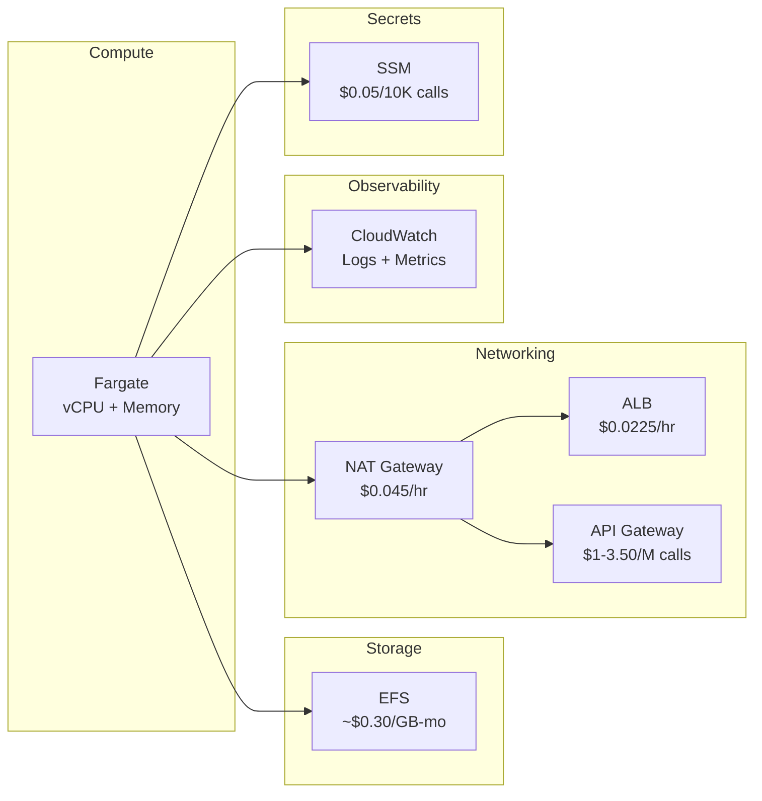

# Total Cost of Ownership

Understanding the cost profile of your GoBridge deployment helps you make
informed decisions about architecture, sizing, and optimization. This guide
breaks down every billable AWS component in a typical GoBridge deployment,
provides worked examples for three reference architectures, and offers a
checklist for keeping costs under control.

All prices are **us-west-1 on-demand rates as of April 2025**. Actual costs
vary by region, usage patterns, and any negotiated discounts or savings plans
you may have.

For architecture context, see [AWS Overview](overview.md).
For monitoring cost details, see [Monitoring](monitoring.md).

---

## Cost Model Overview

A GoBridge deployment on AWS touches five cost categories. The diagram below
shows each category and its primary billing dimension.



For most deployments, **compute and networking dominate the bill**. Storage
and secrets are negligible. Observability costs scale with log volume and the
number of custom metrics you publish.

---

## Fargate Compute

Fargate bills per-second for vCPU and memory allocated to each task. There is
no charge for stopped tasks.

### Per-Unit Pricing (us-west-1)

| Resource | On-Demand | Fargate Spot | Savings |
|----------|-----------|--------------|---------|
| vCPU/hr  | $0.04048  | $0.012144    | 70%     |
| GB/hr    | $0.004445 | $0.001334    | 70%     |

Fargate Spot tasks can be interrupted with a two-minute warning. Use them for
development, testing, and non-critical workloads. Avoid Spot for routes that
require uninterrupted message delivery.

### Monthly Cost Examples

The table below shows monthly costs for common single-task configurations
running 24/7 (730 hours/month).

| Config      | vCPU | Memory  | Monthly (On-Demand) | Monthly (Spot) |
|-------------|------|---------|---------------------|----------------|
| Minimal     | 0.25 | 512 MiB | ~$10                | ~$3            |
| Standard    | 0.5  | 1 GiB   | ~$18                | ~$5            |
| Performance | 1.0  | 2 GiB   | ~$36                | ~$11           |

**How to calculate:** Multiply vCPU hours and GB hours by 730, then sum.
For the Standard config on-demand:

```
vCPU:   0.5  x $0.04048  x 730 = $14.78
Memory: 1.0  x $0.004445 x 730 = $3.24
Total:                           $18.02/month
```

For multi-task deployments, multiply the per-task cost by the number of tasks.
Two Standard tasks on-demand cost approximately $36/month.

### Fargate Savings Plans

If your workload is predictable, a 1-year or 3-year Compute Savings Plan
reduces Fargate costs by up to 50%. Savings Plans apply automatically to
Fargate usage in any region, so they complement Spot for baseline capacity.

---

## EFS Costs

GoBridge uses EFS to mount the bridge configuration file into Fargate tasks.
The configuration file is typically 1--10 KB, making storage costs negligible.

### Storage Classes

| Storage class | Rate (GB/month) | Use case |
|---------------|-----------------|----------|
| Standard      | $0.30           | Active config files |
| Infrequent Access (IA) | $0.016 | Archived data (14+ day lifecycle) |
| Archive       | $0.008          | Rarely accessed data (90+ day lifecycle) |

For GoBridge, only Standard applies. A 10 KB config file costs approximately
**$0.000003/month** -- effectively free.

### Throughput Modes

| Mode | Cost | Behavior |
|------|------|----------|
| Elastic (default) | $0.04/GiB read, $0.08/GiB write | Scales automatically; recommended for most deployments |
| Provisioned | $6/MiB-s-month | Guaranteed throughput; overkill for config files |
| Bursting | Included | Baseline 50 KiB/s per GiB stored; may be slow for very small filesystems |

**Recommendation:** Use Elastic throughput mode. The poll watcher reads the
config file once per second, generating roughly 10 KB/s of read traffic. This
costs well under $0.01/month even with multiple replicas.

### Lifecycle Policies

Enable lifecycle policies only if you store additional data on EFS beyond the
bridge config. For a config-only mount, lifecycle transitions add complexity
with zero benefit.

---

## Networking

Networking is where hidden costs accumulate. Pay close attention to NAT
Gateway charges.

### NAT Gateway vs. VPC Endpoints vs. Public Subnet

| Approach | Fixed cost/month | Per-GB cost | Best for |
|----------|------------------|-------------|----------|
| NAT Gateway | ~$32 | $0.045/GB | Simple setup, many AWS services |
| VPC Endpoints (SSM, SQS, ECR, Logs) | ~$7--28 (1--4 endpoints x $7.30) | $0.01/GB | Cost-optimized production |
| Public subnet (no NAT) | $0 | $0 | Dev/test only |

**NAT Gateway is the hidden cost killer.** A single NAT Gateway costs $32.85
per month (730 hours x $0.045/hr) in fixed charges alone, before any data
processing fees. For a GoBridge deployment that only needs to reach SSM, SQS,
ECR, and CloudWatch Logs, VPC endpoints are often cheaper.

### VPC Endpoint Pricing

Each interface VPC endpoint costs $0.01/hr per AZ ($7.30/month per AZ). If
you deploy across two AZs, each endpoint costs $14.60/month.

| Endpoints needed | 1 AZ | 2 AZs |
|------------------|------|-------|
| SSM only | $7.30 | $14.60 |
| SSM + SQS | $14.60 | $29.20 |
| SSM + SQS + ECR + Logs | $29.20 | $58.40 |

**Decision rule:** If you need four or more endpoints across two AZs, a NAT
Gateway may be cheaper and simpler. If you need one or two endpoints, VPC
endpoints save money.

### Public Subnet Option

For development and testing, deploy Fargate tasks in a public subnet with
`assignPublicIp: ENABLED`. This eliminates NAT and VPC endpoint costs
entirely. Do not use this in production -- tasks are directly addressable from
the internet.

### Data Transfer

Outbound data transfer from AWS to the internet is charged at $0.09/GB for
the first 10 TB/month. For most GoBridge deployments, data transfer is
minimal because messages flow between AWS services (SQS, MQTT brokers in VPC)
rather than leaving the AWS network.

---

## Observability Costs

CloudWatch is the default observability backend for GoBridge on AWS. Costs
depend on log volume, metric count, and retention.

### CloudWatch Pricing Breakdown

| Item | Rate | Typical monthly cost |
|------|------|----------------------|
| Log ingestion | $0.50/GB | $0.50--5.00 (1--10 GB) |
| Log storage | $0.03/GB-month | $0.03--0.30 |
| Custom metrics | $0.30/metric (first 10K) | $3--6 (10--20 metrics) |
| Alarms | $0.10/alarm (standard) | $0.50--1.50 (5--15 alarms) |
| Dashboard | $3.00/dashboard | $3.00 |
| X-Ray traces | $5.00/M traces sampled | $0.50--5.00 (10% sampling) |
| Logs Insights queries | $0.005/GB scanned | Variable |

### Log Retention Strategy

Set retention based on environment to control storage costs:

| Environment | Retention | Rationale |
|-------------|-----------|-----------|
| Development | 7 days | Troubleshoot recent issues only |
| Staging | 30 days | Cover full test cycles |
| Production | 90 days | Compliance and incident investigation |

The CDK construct defaults to `ONE_WEEK`. Override via the `LogRetention`
prop on `gobridgecluster.ClusterProps` (applied to both the control and
worker services).

### Reducing Observability Costs

- Use **metric filters** on log groups instead of publishing custom metrics
  from application code. Metric filters cost nothing beyond log ingestion.
- **Sample X-Ray traces** at 1--10% in production. Full sampling generates
  millions of traces per month at high throughput.
- Export logs to **S3** for long-term retention at $0.023/GB-month instead of
  paying $0.03/GB-month in CloudWatch.

---

## API Gateway vs. ALB

If you expose the GoBridge admin, monitor, or HTTP transport endpoints
externally, you need either an Application Load Balancer or API Gateway.

### Cost Comparison by Request Volume

| Volume (req/day) | REST API Gateway | HTTP API Gateway | ALB       |
|-------------------|------------------|------------------|-----------|
| 1K               | ~$0.11/mo        | ~$0.03/mo        | ~$16/mo (fixed) |
| 10K              | ~$1.05/mo        | ~$0.30/mo        | ~$16/mo   |
| 100K             | ~$10.50/mo       | ~$3.00/mo        | ~$16.50/mo |
| 1M               | ~$105/mo         | ~$30/mo          | ~$18/mo   |

**REST API Gateway** costs $3.50 per million requests and includes usage
plans, API keys, and request validation.

**HTTP API Gateway** costs $1.00 per million requests and includes JWT
authorization and simpler routing. It lacks usage plans and API key management.

**ALB** has a fixed base cost of $16.43/month ($0.0225/hr x 730) plus
$0.008 per LCU-hour. At low volumes the fixed cost dominates. At high volumes
ALB is significantly cheaper than API Gateway.

### Decision Matrix

| Criteria | Choose API Gateway | Choose ALB |
|----------|--------------------|------------|
| Request volume | < 500K req/day | > 500K req/day |
| Authentication | Built-in JWT or API keys | External (Cognito, custom headers) |
| Cost sensitivity at low volume | HTTP API ($1/M) | Not cost-effective |
| WebSocket support | REST API only | Native |
| Health checks | Not included | Built-in |
| WAF integration | Yes | Yes |

**Recommendation:** Use HTTP API Gateway for low-traffic deployments that
need authentication. Switch to ALB when request volume exceeds roughly
500K requests per day or when you need health-check-based routing.

See [CDK Scenario 4](../scenarios/cdk/04-production-stack.md) for ALB
configuration with VPC endpoints.

---

## Reference Architectures

The following profiles provide realistic monthly cost estimates. All prices
assume us-west-1 with 24/7 operation.

### Dev/Test (~$4--20/month)

A minimal deployment for development and functional testing.

| Component | Configuration | Monthly cost |
|-----------|--------------|--------------|
| Fargate (Spot) | 1 task, 0.25 vCPU, 512 MiB | ~$3 |
| EFS (Standard) | < 1 KB config | ~$0.01 |
| Networking | Public subnet, no NAT | $0 |
| CloudWatch Logs | 7-day retention, ~1 GB/month | ~$0.50 |
| SSM | ~1K calls/month | ~$0.05 |
| ALB | None (use `ecs exec` or port-forward) | $0 |
| **Total without ALB** | | **~$4** |
| **Total with ALB** | Add ALB at $16.43/month | **~$20** |

**Tip:** Skip the ALB in development. Use `aws ecs execute-command` to access
the container directly, or use the task's public IP in a public subnet.

### Production Single (~$80--120/month)

A production deployment with two replicas, NAT Gateway, and ALB.

| Component | Configuration | Monthly cost |
|-----------|--------------|--------------|
| Fargate (On-Demand) | 2 tasks, 0.5 vCPU, 1 GiB each | ~$36 |
| EFS (Standard) | < 10 KB config | ~$0.10 |
| NAT Gateway | 1 gateway | ~$32 |
| ALB | 1 load balancer | ~$16 |
| CloudWatch | 30-day retention, ~5 GB/month, 5 alarms, 10 metrics | ~$8 |
| SSM | ~10K calls/month | ~$0.50 |
| **Total** | | **~$93** |

**Optimization path:** Replace the NAT Gateway with VPC endpoints for SSM and
CloudWatch Logs (~$15 for two endpoints in one AZ) to save ~$17/month,
bringing the total to approximately $76/month.

### Production Cluster (~$130--200/month)

A high-availability cluster with a dedicated control task, two worker tasks,
VPC endpoints, and full observability. Sizing matches the
`gobridgecluster.GoBridgeCluster` construct defaults: one control Fargate
task (RW EFS, `DesiredCount=1` hard-coded) plus `WorkerDesiredCount=2`
worker tasks (RO EFS), each at 0.5 vCPU / 1 GiB. Override per-cluster via
`ClusterProps.CPU`, `ClusterProps.MemoryMiB`, and
`ClusterProps.WorkerDesiredCount`; opt the worker service into target-tracking
CPU autoscaling by setting `ClusterProps.AutoScaling` (`AutoScalingProps{Min,
Max, TargetCPU}`).

| Component | Configuration | Monthly cost |
|-----------|--------------|--------------|
| Fargate (On-Demand) | 1 control + 2 workers, 0.5 vCPU, 1 GiB each (defaults) | ~$54 |
| EFS (Standard) | Shared config across 3 tasks | ~$0.10 |
| VPC Endpoints | SSM, SQS, Logs, ECR (1 AZ) | ~$29 |
| ALB | 1 load balancer, higher LCU usage | ~$18 |
| CloudWatch | 90-day retention, ~20 GB/month, 15 alarms, 20 metrics, 1 dashboard | ~$25 |
| X-Ray | 10% sampling | ~$5 |
| **Total** | | **~$131** |

**Scaling note:** Each additional worker task at the default 0.5 vCPU / 1 GiB
adds approximately $18/month on-demand or $5/month on Spot — either by raising
`WorkerDesiredCount` or by letting `AutoScaling` scale up under load. The
fixed costs (VPC endpoints, ALB, CloudWatch) remain constant.

---

## Cost Optimization Checklist

Use this checklist to reduce your monthly bill without sacrificing reliability.

### Compute

- [ ] **Use Fargate Spot for non-critical workloads.** Spot provides 70%
  savings. Use it for development, staging, and worker tasks that tolerate
  interruption.
- [ ] **Right-size Fargate tasks.** Monitor CPU and memory utilization via
  CloudWatch. If utilization stays below 30%, step down to a smaller
  configuration.
- [ ] **Consider Fargate Savings Plans.** A 1-year Compute Savings Plan
  reduces on-demand costs by up to 50% for predictable baseline workloads.
- [ ] **Enable auto-scaling.** Scale down during off-peak hours rather than
  running peak capacity 24/7.

### Networking

- [ ] **Replace NAT Gateway with VPC endpoints.** If you only need access to
  SSM, SQS, ECR, and CloudWatch Logs, two or three VPC endpoints cost less
  than a NAT Gateway.
- [ ] **Use a single AZ for development.** VPC endpoint costs double with two
  AZs. Use one AZ for non-production environments.
- [ ] **Deploy in a public subnet for dev/test.** Eliminates NAT and VPC
  endpoint costs entirely.

### Observability

- [ ] **Set log retention to the minimum needed.** 7 days for dev, 30 days
  for staging, 90 days for production.
- [ ] **Use metric filters instead of custom metrics.** CloudWatch metric
  filters extract metrics from logs at no additional cost beyond ingestion.
- [ ] **Sample X-Ray traces.** Use 1--10% sampling in production. Full
  sampling is rarely necessary and costs $5 per million traces.
- [ ] **Export old logs to S3.** For retention beyond 90 days, export to S3
  at $0.023/GB-month instead of keeping them in CloudWatch at $0.03/GB-month.

### API Layer

- [ ] **Use HTTP API instead of REST API.** HTTP API costs $1/M requests
  versus $3.50/M for REST API. Switch to REST only when you need usage plans
  or request validation.
- [ ] **Skip ALB for low-traffic deployments.** At fewer than 500K requests
  per day, HTTP API Gateway is significantly cheaper than the ALB fixed cost.

### Storage

- [ ] **Review EFS throughput mode.** Elastic throughput is the best default.
  Never provision throughput for a config-only mount.

---

## Monthly Cost Summary

The table below provides a quick reference for budget planning.

| Profile | Compute | Networking | Observability | Other | Total |
|---------|---------|------------|---------------|-------|-------|
| Dev/Test (Spot, no ALB) | $3 | $0 | $0.50 | $0.06 | **~$4** |
| Dev/Test (Spot, with ALB) | $3 | $16 | $0.50 | $0.06 | **~$20** |
| Production Single | $36 | $48 | $8 | $0.60 | **~$93** |
| Production Single (optimized) | $36 | $31 | $8 | $0.60 | **~$76** |
| Production Cluster | $54 | $47 | $30 | $0.10 | **~$131** |

Costs are rounded to the nearest dollar. Actual bills may vary by 10--15%
depending on data transfer, Logs Insights query volume, and LCU consumption.

---

## Related Guides

| Guide | Description |
|-------|-------------|
| [AWS Overview](overview.md) | Architecture, CDK constructs, and design decisions. |
| [Monitoring](monitoring.md) | CloudWatch metrics, structured logging, and alerting. |
| [CDK Scenario 4](../scenarios/cdk/04-production-stack.md) | VPC endpoint and alarm CDK code for production. |
| [Deployment Guide](../deployment-guide.md) | Platform-agnostic deployment considerations. |
