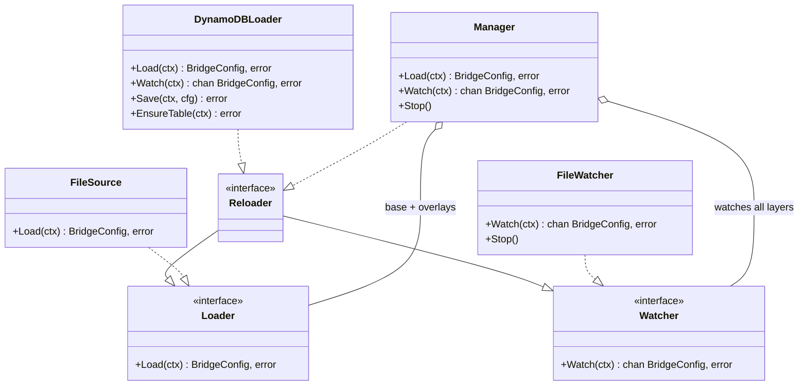
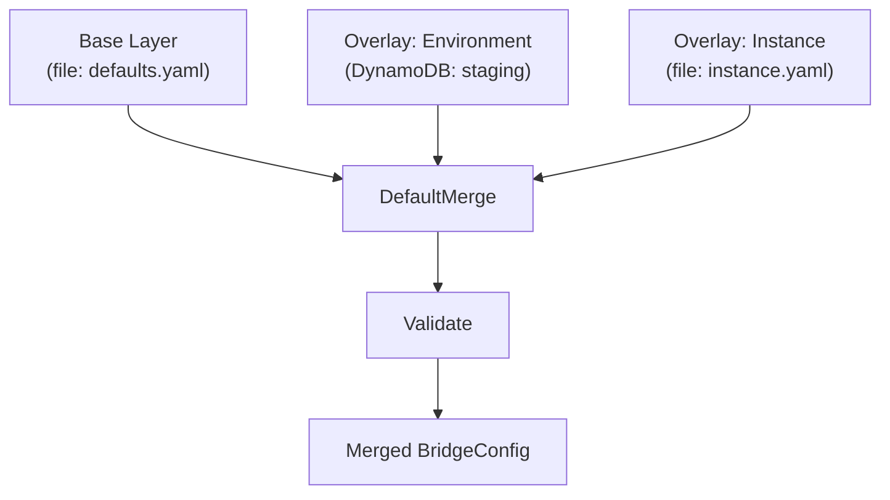

# Configuration Stores

This guide documents the configuration store implementations that load, watch, and persist `BridgeConfig` documents. For the YAML field reference, see [Configuration Reference](configuration-reference.md). For the high-level lifecycle overview, see [Configuration Overview](configuration-overview.md).

## Architecture

GoBridge separates configuration concerns into composable contracts:



The loader/watcher contracts live in `ports` (`ports/blueprint_loader.go`) and
operate on `*ports.BridgeConfig`. Adapters and external consumers implement them
directly; the `config` package owns only the orchestration and on-disk write path:

| Package | Types | Role |
|---------|-------|------|
| `ports` | `Loader`, `Watcher`, `Reloader`, `BridgeConfig` | Contracts implemented by adapters, consumed by `Manager` and `httpapi` |
| `config` | `Manager`, `Layer`, `MergeFunc`, `DefaultMerge`, `WriteFile` | Layered orchestration, merge strategy, atomic file persistence |

This keeps the contracts free of any `config` dependency.

---

## File Source

**Package:** `github.com/mariotoffia/gobridge/adapters/native/config/file`

Reads a YAML or JSON configuration file from disk. Format is auto-detected from the file extension (`.yaml`, `.yml`, `.json`), or can be overridden.

### API

```go
import (
    fileconfig "github.com/mariotoffia/gobridge/adapters/native/config/file"
    "github.com/mariotoffia/gobridge/ports"
)

// registry carries the plugin decoders (transports, stores, processors) that
// decode each options block. It is a required argument; build it once at the
// composition root and register each adapter's decoder.
source := fileconfig.NewSource("bridge.yaml", registry)
cfg, err := source.Load(ctx)
```

### Options

| Option | Description |
|--------|-------------|
| `WithSourceFormat(f)` | Override format auto-detection (`parser.FormatYAML`, `parser.FormatJSON`) |

### Behaviour

- Implements `ports.Loader` (load only, no watch).
- Maximum file size: **4 MiB** (enforced by `parser.ParseFile`).
- Returns `*ports.BridgeConfig` on success.
- Honours the caller's `context`: a cancelled context short-circuits before any filesystem work.
- A missing file surfaces as `shared.ErrNotFound`; parse errors pass through with the parser's file/stage annotation.

---

## File Watcher

**Package:** `github.com/mariotoffia/gobridge/adapters/native/config/file`

Watches a configuration file for changes and re-parses it when modifications are detected. Supports two watch modes.

### API

```go
watcher := fileconfig.NewWatcher("bridge.yaml", registry,
    fileconfig.WithWatchConfig(baseCfg.ConfigWatch),
    fileconfig.WithLogger(logger),
)
ch, err := watcher.Watch(ctx)
// ch receives *ports.BridgeConfig on each detected change
```

### Options

| Option | Description | Default |
|--------|-------------|---------|
| `WithMode(m)` | `ModeNotify` (hybrid: directory-scoped fsnotify + periodic hash-resync backstop) or `ModePoll` (SHA-256 hash) | `ModeNotify` |
| `WithDebounce(d)` | Debounce interval for `ModeNotify` | `100ms` |
| `WithPollInterval(d)` | Poll interval for `ModePoll` | `30s` |
| `WithResyncInterval(d)` | Notify-mode hash-reconciliation cadence: periodic SHA-256 comparison catching changes fsnotify missed. Non-positive values are ignored | `30s` |
| `WithBaselineHash(h)` | Seed the change-detection baseline with the hash the caller actually loaded (`Source.LoadHash`), closing the Load↔Watch race | hash file at `Watch` |
| `WithClock(c)` | Inject the clock used for timers and tickers (`nil` ignored) | `clock.System` |
| `WithFormat(f)` | Override format auto-detection | `FormatAuto` |
| `WithLogger(l)` | Logger for diagnostics | `nil` |
| `WithWatchConfig(def)` | Apply settings from a `ConfigWatchDef` (from the YAML `config_watch` section) | -- |

### Watch Modes

| Mode | Mechanism | Best for |
|------|-----------|----------|
| **Notify** (default) | Hybrid: filesystem events via `fsnotify` on the containing **directory**, debounced to coalesce rapid writes, plus a periodic SHA-256 hash-resync backstop (default 30s) that catches changes fsnotify missed — this makes Kubernetes ConfigMap `..data` symlink swaps and kernel event-queue overflow safe | Local disks and K8s ConfigMap volume mounts, fast change detection |
| **Poll** | Periodic SHA-256 content hash comparison | NFS, EFS, network mounts, `subPath` mounts |

### Behaviour

- Implements `ports.Watcher` (watch only, no initial load).
- The initial config is **not** emitted on the channel; use `Source.Load` for the first load.
- Invalid configs (parse failures) are logged and dropped -- never emitted.
- Call `Stop()` to halt watching. The channel is closed on stop or context cancellation.
- In notify mode, watches the **directory** containing the file to handle editor save patterns (write + rename).
- The emit channel is buffered to one and uses **latest-wins coalescing**: if a valid reload arrives while a previous one is still queued (a slow consumer), the superseded config is evicted and the newest enqueued, so the consumer always converges on the current file state and never applies a stale reload. `Watcher.CoalescedReloads()` counts how often this happened — a non-zero value signals a consumer slower than the file's change rate, not lost reloads.

### YAML-Driven Configuration

The watcher can be configured directly from the YAML config file itself:

```yaml
config_watch:
  mode: notify        # hybrid: fsnotify + hash-resync backstop
  poll_interval: 30s  # notify mode: resync cadence; poll mode: poll cadence
  debounce: 200ms     # for notify mode
```

In notify mode `poll_interval` doubles as the hash-resync cadence.
Pass this to the watcher with `WithWatchConfig(baseCfg.ConfigWatch)`.

---

## DynamoDB Loader

**Package:** `github.com/mariotoffia/gobridge/adapters/aws/config/dynamodb`

Stores the full `BridgeConfig` as a single DynamoDB item with version-based change detection. Useful for centralized configuration management in AWS environments.

> **A DynamoDB layer is a base, not an overlay on a file.** Wire it as the config
> source a bridge assembles itself from programmatically. It is deliberately not
> reachable as an overlay under the shipped `aws-filebased-config` deployment
> profile, which runs a single `file` layer: that profile's admin config
> transaction API reads and writes the base document, so an overlay changing
> underneath it would make the running config and the document the API commits to
> two different things — see [Overlays and the admin config API do not
> compose](configuration-overview.md#overlays-and-the-admin-config-api-do-not-compose).

### API

```go
import ddbconfig "github.com/mariotoffia/gobridge/adapters/aws/config/dynamodb"

loader := ddbconfig.NewLoader(ddbClient,
    ddbconfig.WithTableName("gobridge-config"),
    ddbconfig.WithBridgeID("production"),
    ddbconfig.WithPollInterval(30 * time.Second),
)

// Load
cfg, err := loader.Load(ctx)

// Watch for changes
ch, err := loader.Watch(ctx)

// Save (admin/test tooling)
err = loader.Save(ctx, cfg)

// Create table if missing (dev/test)
err = loader.EnsureTable(ctx)
```

### Options

| Option | Description | Default |
|--------|-------------|---------|
| `WithTableName(name)` | DynamoDB table name | `"gobridge-config"` |
| `WithBridgeID(id)` | Bridge identifier (partition key prefix) | `"default"` |
| `WithPollInterval(d)` | Watch polling interval in `ModePoll` | `30s` |
| `WithWatchMode(m)` | `ModePoll` or `ModeStreams` change detection | `ModePoll` |
| `WithStreamPollInterval(d)` | GetRecords interval in `ModeStreams` | — |
| `WithStreamsClient(c)` | DynamoDB Streams client (required for `ModeStreams`) | `nil` |
| `WithRegistry(r)` | Plugin registry used to decode the stored config's options blocks | `nil` |

### Watch Modes

| Mode | Mechanism | Notes |
|------|-----------|-------|
| **Poll** (default) | One strongly-consistent `GetItem` per instance per interval, comparing the `version` attribute | Predictable cost; use for clustered deployments |
| **Streams** | DynamoDB Streams `GetRecords`, sub-second propagation | Streams throughput is ~5 `GetRecords`/sec per shard **shared across all consumers**; falls back to `ModePoll` (with a warning) when a streams client is absent or streams are not enabled on the table. Failure semantics: a throttled `GetRecords` **keeps** the iterator (no LATEST reset) and sheds load via equal-jittered exponential backoff up to 30s; a genuinely invalid iterator (or 3 consecutive unknown failures) is re-acquired at LATEST followed by a version-check reconciliation covering the gap; 5 consecutive acquisition failures switch to poll fallback for the rest of the Watch with a single Warn |

### Table Schema

| Attribute | Type | Description |
|-----------|------|-------------|
| `PK` (partition key) | String | `"config#<bridge-id>"` |
| `SK` (sort key) | String | `"current"` |
| `data` | String | Full `BridgeConfig` serialized as JSON |
| `version` | Number | Monotonically increasing version counter |

The table uses **pay-per-request** billing. `EnsureTable` creates the table idempotently (safe to call multiple times). When the loader runs in `ModeStreams`, `EnsureTable` provisions the new table with a `KEYS_ONLY` stream specification so a self-provisioned deployment actually gets the streams-based Watch it configured; an existing table's stream settings are left untouched.

### Behaviour

- Implements `ports.Loader` and `ports.Reloader`.
- **Load**: `GetItem` by PK/SK (strongly consistent), parse JSON from `data` attribute, track `version`.
- **Watch** (`ModePoll`): a strongly-consistent `GetItem` at each poll interval compares the `version` attribute; the full item is re-parsed only when the version changes. `ModeStreams` consumes Streams records instead. Channel is closed on context cancellation.
- Poll-cycle failures (version read or Load) are logged at **Warn**, rate-limited to one per minute, and escalate to **Error** after 10 consecutive failures — the Error states that config updates are NOT being applied, so a broken IAM policy or deleted table does not hide at Warn forever.
- **Save**: Marshals `BridgeConfig` to JSON, `PutItem` with incremented `version`.
- Returns `shared.ErrNotFound` when no config item exists.
- The initial config is **not** emitted on the watch channel.

### Cost Characteristics

| Operation | DynamoDB Cost |
|-----------|---------------|
| Watch poll (no change) | ~1 RCU per poll (strongly-consistent read of the item, ≤ 4 KB) |
| Watch poll (change detected) | ~1 RCU + full item re-parse |
| Save | 1 WCU per save |

---

## Configuration Manager

**Package:** `github.com/mariotoffia/gobridge/config`

The `Manager` orchestrates multiple configuration sources in a layered stack. A **base** layer is loaded first, then **overlays** are merged on top in order. The merged result is validated before being returned.

### API

```go
mgr := config.NewManager(
    config.Layer{Name: "file", Loader: fileSource, Watcher: fileWatcher},
    config.WithOverlay(config.Layer{Name: "env", Loader: ddbLoader, Watcher: ddbLoader}),
    config.WithManagerLogger(logger),
)

// Load all layers, merge, validate
cfg, err := mgr.Load(ctx)

// Watch all layers for changes, re-merge on any change
ch, err := mgr.Watch(ctx)
defer mgr.Stop()
```

### Options

| Option | Description |
|--------|-------------|
| `WithOverlay(layer)` | Add an overlay layer (applied in registration order) |
| `WithMergeFunc(fn)` | Override the default merge strategy |
| `WithManagerLogger(l)` | Logger for diagnostics |

### Layer Structure

```go
type Layer struct {
    Name    string
    Loader  Loader   // required
    Watcher Watcher  // optional (nil if source doesn't support watching)
}
```

### Merge Rules (`DefaultMerge`)

| Section | Merge Behaviour |
|---------|-----------------|
| `bridge` | Overlay non-zero fields replace base; `cluster` replaces base when non-nil (endpoint map cloned) |
| `config_watch` | Overlay replaces base entirely if non-nil |
| `http` | **Field-level** -- non-empty overlay scalar fields win, empty fields keep the base value; the `admin_api_key` / `monitor_api_key` secrets are preserved when the overlay omits them or echoes back the `"[REDACTED]"` marker (a partial PATCH never wipes a configured key) |
| `stores` | Overlay replaces per role (`lease`, `outbox`, `dlq` individually) |
| `sessions`, `receivers`, `senders`, `bindings` | **Merge by ID** -- new IDs append; a matching ID is merged **field-level**, and the base entry's typed plugin `Config` (broker URL, credentials, options) is carried forward unless the overlay changes the transport/discriminator |
| `routes` | **Merge by ID** -- new IDs append; a matching ID is wholesale-replaced (routes carry no plugin `Config`, so nothing can be lost) |

### Behaviour

- Implements both `ports.Loader` and `ports.Watcher`.
- **Load**: Loads base, then each overlay in order. Merges with `MergeFunc`. Validates merged result. Individual layers are not validated independently (a layer may be intentionally incomplete).
- **Watch**: Starts watchers on all layers that have one. On any layer change, updates the cached layer config, re-merges all layers, validates, and emits. Invalid merged configs are logged and dropped.
- **Rebuild**: When a layer changes, other layers use their cached configs (no redundant re-loads).
- Custom merge strategies can be provided via `WithMergeFunc`.

### Layered Configuration Patterns



**Example: File base + DynamoDB overlay**

```go
fileSource := fileconfig.NewSource("defaults.yaml", registry)
fileWatcher := fileconfig.NewWatcher("defaults.yaml", registry,
    fileconfig.WithMode(fileconfig.ModePoll),
    fileconfig.WithPollInterval(30*time.Second),
)

ddbLoader := ddbconfig.NewLoader(ddbClient,
    ddbconfig.WithBridgeID("staging"),
    ddbconfig.WithRegistry(registry),
)

mgr := config.NewManager(
    config.Layer{Name: "defaults", Loader: fileSource, Watcher: fileWatcher},
    config.WithOverlay(config.Layer{Name: "ddb-staging", Loader: ddbLoader, Watcher: ddbLoader}),
)

cfg, _ := mgr.Load(ctx)
watchCh, _ := mgr.Watch(ctx)
```

---

## Config Persistence (Write)

**Package:** `github.com/mariotoffia/gobridge/config/parser`

The `parser.WriteFile` function provides atomic YAML writes with permission preservation:

```go
err := parser.WriteFile("bridge.yaml", cfg)
```

- Writes to a temporary file in the same directory, then atomically renames.
- New files are created `0600` (not world-readable) because a config can embed secrets; an existing file keeps its current permissions.
- fsyncs the file and the parent directory so the rename survives a crash.
- Readers never see a partially written file.
- Used by the HTTP admin API for transactional config commits.

---

## HTTP Admin API (Config Transactions)

The HTTP admin API provides transactional config editing over the file-based store:

| Endpoint | Method | Description |
|----------|--------|-------------|
| `/api/v1/admin/config` | GET | Read the current effective config (redacted) |
| `/api/v1/admin/config/transactions` | POST | Open a transaction against the current version |
| `/api/v1/admin/config/transactions/{txnID}` | GET | Preview the merged config |
| `/api/v1/admin/config/transactions/{txnID}` | PATCH | Apply a config overlay (merge) |
| `/api/v1/admin/config/transactions/{txnID}/commit` | POST | Validate, CAS-check version, write to disk |
| `/api/v1/admin/config/transactions/{txnID}` | DELETE | Roll back (discard) the transaction |

The transaction manager uses `config.DefaultMerge` to apply patches and `config.WriteFile` for atomic commits with version-based CAS (compare-and-swap) to prevent lost updates.

See the [HTTP API Reference](http-api-admin.md#config-transactions) for the full endpoint
table, status codes, and merge semantics, and [Credentials & HTTP API](credentials-and-http-api.md)
for authentication.

---

## Custom Configuration Sources

Implement the `ports.Loader` and optionally `ports.Watcher` interfaces:

```go
type Loader interface {
    Load(ctx context.Context) (*ports.BridgeConfig, error)
}

type Watcher interface {
    Watch(ctx context.Context) (<-chan *ports.BridgeConfig, error)
}
```

**Guidelines:**

- `Load` must return a fully parsed `*ports.BridgeConfig`.
- `Watch` must not emit the initial config -- callers use `Load` for the first read.
- The watch channel should be closed when the context is cancelled.
- Invalid configs should be logged and dropped, not emitted on the channel.
- Custom sources plug into the `Manager` as either the base layer or an overlay.

**Example: Consul-backed loader (sketch)**

```go
type ConsulLoader struct {
    client   *consulapi.Client
    registry *ports.Registry
}

func (l *ConsulLoader) Load(ctx context.Context) (*ports.BridgeConfig, error) {
    kv, _, err := l.client.KV().Get("gobridge/config", nil)
    if err != nil { return nil, err }
    return parser.Parse(bytes.NewReader(kv.Value), parser.FormatJSON, l.registry)
}
```

---

## Capability Matrix

| Implementation | Load | Watch | Persist | Watch Mechanism |
|----------------|:----:|:-----:|:-------:|-----------------|
| `file.Source` | Yes | -- | -- | -- |
| `file.Watcher` | -- | Yes | -- | Hybrid fsnotify + hash-resync, or SHA-256 poll |
| `dynamodb.Loader` | Yes | Yes | Yes (`Save`) | Version-number poll (default) or DynamoDB Streams (opt-in, auto-fallback to poll) |
| `config.Manager` | Yes | Yes | -- | Multiplexes all layer watchers |
| `config.WriteFile` | -- | -- | Yes | -- |

---

## Related Documentation

| Document | Description |
|----------|-------------|
| [Configuration Overview](configuration-overview.md) | Lifecycle, layering, bootstrap pattern |
| [Configuration Reference](configuration-reference.md) | Every YAML/JSON field documented |
| [Transport Configuration](transport-configuration.md) | MQTT, SQS, AMQP, Azure SB, HTTP transport options |
| [Credentials & HTTP API](credentials-and-http-api.md) | Secret management and admin API |
| [Scenario: Layered DynamoDB Config](scenarios/09-layered-dynamodb-config.md) | Walkthrough of file + DynamoDB layering |
| [Scenario: Dynamic Reconfiguration](scenarios/10-dynamic-reconfiguration.md) | Live config reload patterns |
