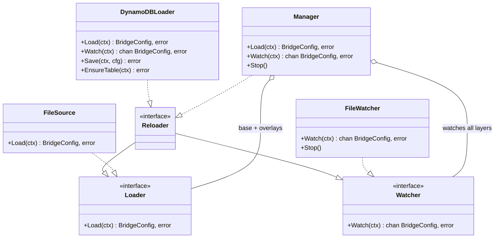
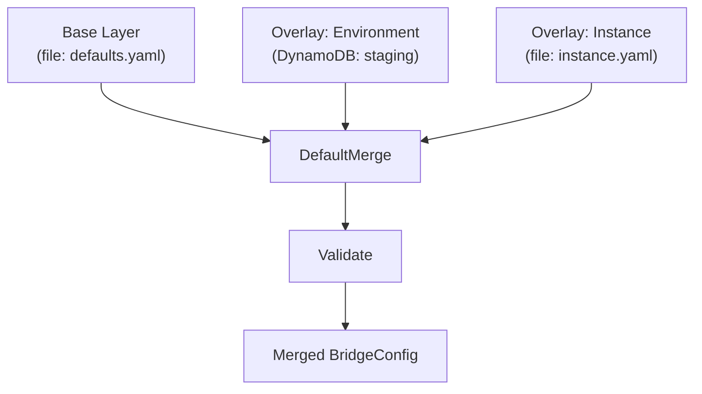

# Configuration Stores

This guide documents the configuration store implementations that load, watch, and persist `BridgeConfig` documents. For the YAML field reference, see [Configuration Reference](configuration-reference.md). For the high-level lifecycle overview, see [Configuration Overview](configuration-overview.md).

## Architecture

GoBridge separates configuration concerns into composable contracts:



Configuration loader/watcher contracts are owned by the `config` package
because their signatures intrinsically depend on `*config.BridgeConfig`.
Adapters and external consumers implement these directly:

| Package | Types | Used by |
|---------|-------|---------|
| `config` | `Loader`, `Watcher`, `Reloader` | Adapters, `Manager`, external consumers |

This keeps `ports` free of any `config` dependency.

---

## File Source

**Package:** `github.com/mariotoffia/gobridge/adapters/native/config/file`

Reads a YAML or JSON configuration file from disk. Format is auto-detected from the file extension (`.yaml`, `.yml`, `.json`), or can be overridden.

### API

```go
import fileconfig "github.com/mariotoffia/gobridge/adapters/native/config/file"

source := fileconfig.NewSource("bridge.yaml")
cfg, err := source.Load(ctx)
```

### Options

| Option | Description |
|--------|-------------|
| `WithSourceFormat(f)` | Override format auto-detection (`config.FormatYAML`, `config.FormatJSON`) |

### Behaviour

- Implements `config.Loader` (load only, no watch).
- Maximum file size: **4 MiB** (enforced by `config.ParseFile`).
- Returns `*config.BridgeConfig` on success.
- Parsing errors surface as standard Go errors.

---

## File Watcher

**Package:** `github.com/mariotoffia/gobridge/adapters/native/config/file`

Watches a configuration file for changes and re-parses it when modifications are detected. Supports two watch modes.

### API

```go
watcher := fileconfig.NewWatcher("bridge.yaml",
    fileconfig.WithWatchConfig(baseCfg.ConfigWatch),
    fileconfig.WithLogger(logger),
)
ch, err := watcher.Watch(ctx)
// ch receives *config.BridgeConfig on each detected change
```

### Options

| Option | Description | Default |
|--------|-------------|---------|
| `WithMode(m)` | `ModeNotify` (fsnotify) or `ModePoll` (SHA-256 hash) | `ModeNotify` |
| `WithDebounce(d)` | Debounce interval for `ModeNotify` | `100ms` |
| `WithPollInterval(d)` | Poll interval for `ModePoll` | `30s` |
| `WithFormat(f)` | Override format auto-detection | `FormatAuto` |
| `WithLogger(l)` | Logger for diagnostics | `nil` |
| `WithWatchConfig(def)` | Apply settings from a `ConfigWatchDef` (from the YAML `config_watch` section) | -- |

### Watch Modes

| Mode | Mechanism | Best for |
|------|-----------|----------|
| **Notify** (default) | Filesystem events via `fsnotify`, debounced to coalesce rapid writes | Local disks, fast change detection |
| **Poll** | Periodic SHA-256 content hash comparison | NFS, EFS, network mounts, containers |

### Behaviour

- Implements `config.Watcher` (watch only, no initial load).
- The initial config is **not** emitted on the channel; use `Source.Load` for the first load.
- Invalid configs (parse failures) are logged and dropped -- never emitted.
- Call `Stop()` to halt watching. The channel is closed on stop or context cancellation.
- In notify mode, watches the **directory** containing the file to handle editor save patterns (write + rename).

### YAML-Driven Configuration

The watcher can be configured directly from the YAML config file itself:

```yaml
config_watch:
  mode: poll          # "notify" or "poll"
  poll_interval: 30s  # for poll mode
  debounce: 200ms     # for notify mode
```

Pass this to the watcher with `WithWatchConfig(baseCfg.ConfigWatch)`.

---

## DynamoDB Loader

**Package:** `github.com/mariotoffia/gobridge/adapters/aws/config/dynamodb`

Stores the full `BridgeConfig` as a single DynamoDB item with version-based change detection. Useful for centralized configuration management in AWS environments.

### API

```go
import ddbconfig "github.com/mariotoffia/gobridge/adapters/aws/config/dynamodb"

loader := ddbconfig.NewLoader(ddbClient,
    ddbconfig.WithTableName("gobridge-config"),
    ddbconfig.WithBridgeID("production"),
    ddbconfig.WithPollInterval(30 * time.Second),
)

// Load
cfg, err := loader.Load(ctx)

// Watch for changes
ch, err := loader.Watch(ctx)

// Save (admin/test tooling)
err = loader.Save(ctx, cfg)

// Create table if missing (dev/test)
err = loader.EnsureTable(ctx)
```

### Options

| Option | Description | Default |
|--------|-------------|---------|
| `WithTableName(name)` | DynamoDB table name | `"gobridge-config"` |
| `WithBridgeID(id)` | Bridge identifier (partition key prefix) | `"default"` |
| `WithPollInterval(d)` | Watch polling interval | `30s` |

### Table Schema

| Attribute | Type | Description |
|-----------|------|-------------|
| `PK` (partition key) | String | `"config#<bridge-id>"` |
| `SK` (sort key) | String | `"current"` |
| `data` | String | Full `BridgeConfig` serialized as JSON |
| `version` | Number | Monotonically increasing version counter |

The table uses **pay-per-request** billing. `EnsureTable` creates the table idempotently (safe to call multiple times).

### Behaviour

- Implements `config.Loader` and `config.Reloader`.
- **Load**: `GetItem` by PK/SK, parse JSON from `data` attribute, track `version`.
- **Watch**: Polls `version` attribute only (projected read, minimal RCU). Full item is loaded only when the version changes. Channel is closed on context cancellation.
- **Save**: Marshals `BridgeConfig` to JSON, `PutItem` with incremented `version`.
- Returns `domain.ErrNotFound` when no config item exists.
- The initial config is **not** emitted on the watch channel.

### Cost Characteristics

| Operation | DynamoDB Cost |
|-----------|---------------|
| Watch poll (no change) | ~0.5 RCU per poll (projected `version` only) |
| Watch poll (change detected) | ~0.5 RCU + full item read |
| Save | 1 WCU per save |

---

## Configuration Manager

**Package:** `github.com/mariotoffia/gobridge/config`

The `Manager` orchestrates multiple configuration sources in a layered stack. A **base** layer is loaded first, then **overlays** are merged on top in order. The merged result is validated before being returned.

### API

```go
mgr := config.NewManager(
    config.Layer{Name: "file", Loader: fileSource, Watcher: fileWatcher},
    config.WithOverlay(config.Layer{Name: "env", Loader: ddbLoader, Watcher: ddbLoader}),
    config.WithManagerLogger(logger),
)

// Load all layers, merge, validate
cfg, err := mgr.Load(ctx)

// Watch all layers for changes, re-merge on any change
ch, err := mgr.Watch(ctx)
defer mgr.Stop()
```

### Options

| Option | Description |
|--------|-------------|
| `WithOverlay(layer)` | Add an overlay layer (applied in registration order) |
| `WithMergeFunc(fn)` | Override the default merge strategy |
| `WithManagerLogger(l)` | Logger for diagnostics |

### Layer Structure

```go
type Layer struct {
    Name    string
    Loader  Loader   // required
    Watcher Watcher  // optional (nil if source doesn't support watching)
}
```

### Merge Rules (`DefaultMerge`)

| Section | Merge Behaviour |
|---------|-----------------|
| `bridge` | Overlay non-zero fields replace base |
| `config_watch` | Overlay replaces base entirely if non-nil |
| `http` | Overlay replaces base entirely if non-nil |
| `stores` | Overlay replaces per role (`lease`, `outbox`, `dlq` individually) |
| `sessions`, `receivers`, `senders`, `bindings`, `routes` | **Merge by ID** -- matching IDs are replaced, new IDs are appended |

### Behaviour

- Implements both `config.Loader` and `config.Watcher`.
- **Load**: Loads base, then each overlay in order. Merges with `MergeFunc`. Validates merged result. Individual layers are not validated independently (a layer may be intentionally incomplete).
- **Watch**: Starts watchers on all layers that have one. On any layer change, updates the cached layer config, re-merges all layers, validates, and emits. Invalid merged configs are logged and dropped.
- **Rebuild**: When a layer changes, other layers use their cached configs (no redundant re-loads).
- Custom merge strategies can be provided via `WithMergeFunc`.

### Layered Configuration Patterns



**Example: File base + DynamoDB overlay**

```go
fileSource := fileconfig.NewSource("defaults.yaml")
fileWatcher := fileconfig.NewWatcher("defaults.yaml",
    fileconfig.WithMode(fileconfig.ModePoll),
    fileconfig.WithPollInterval(30*time.Second),
)

ddbLoader := ddbconfig.NewLoader(ddbClient,
    ddbconfig.WithBridgeID("staging"),
)

mgr := config.NewManager(
    config.Layer{Name: "defaults", Loader: fileSource, Watcher: fileWatcher},
    config.WithOverlay(config.Layer{Name: "ddb-staging", Loader: ddbLoader, Watcher: ddbLoader}),
)

cfg, _ := mgr.Load(ctx)
watchCh, _ := mgr.Watch(ctx)
```

---

## Config Persistence (Write)

**Package:** `github.com/mariotoffia/gobridge/config`

The `WriteFile` function provides atomic YAML writes with permission preservation:

```go
err := config.WriteFile("bridge.yaml", cfg)
```

- Writes to a temporary file in the same directory, then atomically renames.
- Preserves original file permissions (defaults to `0644` for new files).
- Readers never see a partially written file.
- Used by the HTTP admin API for transactional config commits.

---

## HTTP Admin API (Config Transactions)

The HTTP admin API provides transactional config editing over the file-based store:

| Endpoint | Method | Description |
|----------|--------|-------------|
| `/admin/config` | GET | Read current merged config |
| `/admin/config/txn` | POST | Create a config transaction |
| `/admin/config/txn` | PATCH | Apply patches to the transaction |
| `/admin/config/txn` | POST (commit) | Validate, CAS-check version, write to disk |
| `/admin/config/txn` | DELETE | Rollback (discard) the transaction |

The transaction manager uses `config.DefaultMerge` to apply patches and `config.WriteFile` for atomic commits with version-based CAS (compare-and-swap) to prevent lost updates.

See [Credentials & HTTP API](credentials-and-http-api.md) for authentication and endpoint details.

---

## Custom Configuration Sources

Implement the `config.Loader` and optionally `config.Watcher` interfaces:

```go
type Loader interface {
    Load(ctx context.Context) (*config.BridgeConfig, error)
}

type Watcher interface {
    Watch(ctx context.Context) (<-chan *config.BridgeConfig, error)
}
```

**Guidelines:**

- `Load` must return a fully parsed `*config.BridgeConfig`.
- `Watch` must not emit the initial config -- callers use `Load` for the first read.
- The watch channel should be closed when the context is cancelled.
- Invalid configs should be logged and dropped, not emitted on the channel.
- Custom sources plug into the `Manager` as either the base layer or an overlay.

**Example: Consul-backed loader (sketch)**

```go
type ConsulLoader struct { /* ... */ }

func (l *ConsulLoader) Load(ctx context.Context) (*config.BridgeConfig, error) {
    kv, _, err := l.client.KV().Get("gobridge/config", nil)
    if err != nil { return nil, err }
    return config.Parse(bytes.NewReader(kv.Value), config.FormatJSON)
}
```

---

## Capability Matrix

| Implementation | Load | Watch | Persist | Watch Mechanism |
|----------------|:----:|:-----:|:-------:|-----------------|
| `file.Source` | Yes | -- | -- | -- |
| `file.Watcher` | -- | Yes | -- | fsnotify or SHA-256 poll |
| `dynamodb.Loader` | Yes | Yes | Yes (`Save`) | Version-number poll |
| `config.Manager` | Yes | Yes | -- | Multiplexes all layer watchers |
| `config.WriteFile` | -- | -- | Yes | -- |

---

## Related Documentation

| Document | Description |
|----------|-------------|
| [Configuration Overview](configuration-overview.md) | Lifecycle, layering, bootstrap pattern |
| [Configuration Reference](configuration-reference.md) | Every YAML/JSON field documented |
| [Transport Configuration](transport-configuration.md) | MQTT, SQS, AMQP, Azure SB, HTTP transport options |
| [Credentials & HTTP API](credentials-and-http-api.md) | Secret management and admin API |
| [Scenario: Layered DynamoDB Config](scenarios/09-layered-dynamodb-config.md) | Walkthrough of file + DynamoDB layering |
| [Scenario: Dynamic Reconfiguration](scenarios/10-dynamic-reconfiguration.md) | Live config reload patterns |
