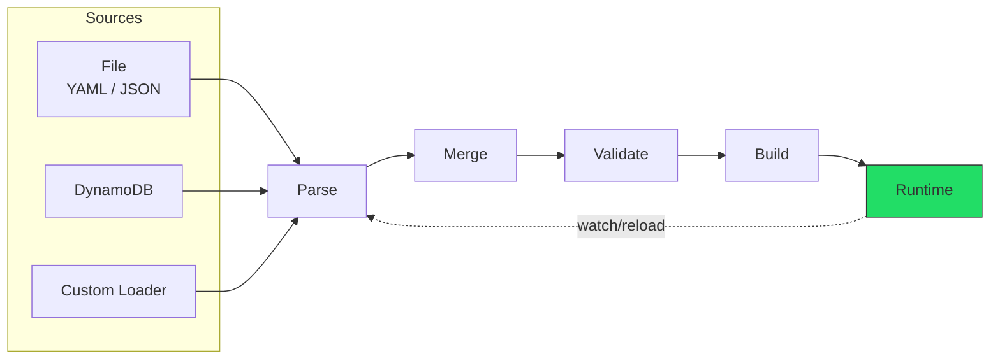
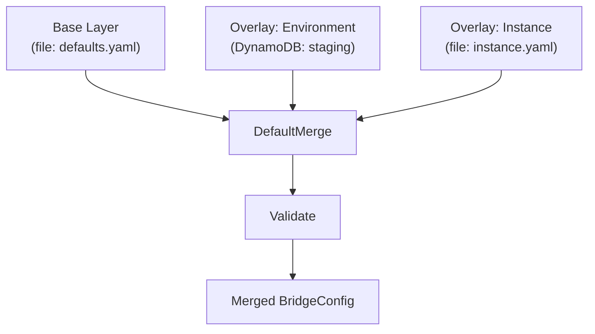

# Configuration System Overview

This guide covers the GoBridge configuration system for both **operators** writing YAML/JSON config files and **developers** using the programmatic Go API.

## Configuration Lifecycle

Every GoBridge instance follows this lifecycle from configuration to running bridge:



1. **Load** -- A `Loader` reads raw configuration from a source (file, DynamoDB, or custom).
2. **Parse** -- YAML or JSON is unmarshalled into a `BridgeConfig` struct.
3. **Merge** -- When using layered configuration, overlays are merged onto the base.
4. **Validate** -- Structural validation checks required fields, referential integrity, and enum values.
5. **Build** -- The `Builder` (or `Supervisor`) creates a `Runtime` with live transports, sessions, and routes.
6. **Watch** *(optional)* -- A `Watcher` detects source changes and feeds them back into the lifecycle.

## Start-Empty (missing or route-less config)

A missing or route-less config is a supported, healthy state -- not a startup
failure. The shipped file-based deployment profile treats a config file that does
not exist as start-empty: it logs a **WARN**, boots with an empty logical config
(`bridge.id` only, zero routes), and passes health checks. A config that carries a
valid `bridge.id` and no routes is equally valid -- validation requires `bridge.id`,
not a route graph. The bridge converges as routes are added: push a config change
through the admin config API (see [HTTP API](http-api.md)) or edit the watched
config document, and the running runtime picks it up. Nothing is bridged until
routes exist, so a start-empty bridge is a no-op until then; the WARN is the signal
that no config file was found.

The reference binary `cmd/gobridge/main.go` behaves the same way: a `-config`
path that does not exist starts empty with the same WARN, and the bridge converges
when the file is created or a config is pushed through the admin config API. Any
other load failure (unreadable or unparseable file) still exits non-zero -- an
existing config that stops parsing is an error, not an invitation to silently drop
every route.

## Configuration Sources

### File Source (YAML / JSON)

The most common source. Reads a single file and auto-detects format by extension (`.yaml`, `.yml`, `.json`).

```go
import (
    fileconfig "github.com/mariotoffia/gobridge/adapters/native/config/file"
    "github.com/mariotoffia/gobridge/ports"
)

// NewSource requires a *ports.Registry carrying the transport/store decoders
// the config references; register them on the registry before loading.
reg := ports.NewRegistry()
source := fileconfig.NewSource("bridge.yaml", reg)
cfg, err := source.Load(ctx)
```

Maximum file size: **4 MiB**.

### DynamoDB Source

Stores configuration as a single DynamoDB item with version-based change detection. Useful for centralized config management in AWS environments.

```go
import ddbconfig "github.com/mariotoffia/gobridge/adapters/aws/config/dynamodb"

loader := ddbconfig.NewLoader(ddbClient,
    ddbconfig.WithTableName("gobridge-config"),
    ddbconfig.WithBridgeID("production"),
    ddbconfig.WithPollInterval(30 * time.Second),
)
cfg, err := loader.Load(ctx)
```

Table schema: `PK = "config#<bridge-id>"`, `SK = "current"`, with a `version` field for change detection.

### Custom Sources

Implement `ports.Loader` and optionally `ports.Watcher`:

```go
// These are the canonical ports.Loader and ports.Watcher interfaces
// (ports/blueprint_loader.go); a custom source implements them directly.
type Loader interface {
    Load(ctx context.Context) (*ports.BridgeConfig, error)
}

type Watcher interface {
    Watch(ctx context.Context) (<-chan *ports.BridgeConfig, error)
}
```

## Layered Configuration

The `Manager` supports a base layer with ordered overlays. This enables patterns like base defaults + environment-specific overrides.



**Merge rules** (`config.DefaultMerge`):
- `version`: overlay wins when non-zero; a zero overlay keeps the base version (it is an optimistic-concurrency counter, not reset to 0).
- `bridge` settings: overlay non-empty scalar fields win field-level; `bridge.cluster` is replaced wholesale when the overlay sets it.
- `config_watch`: overlay replaces base entirely if non-nil.
- `stores`: overlay replaces per-role (lease, outbox, dlq individually).
- `sessions`, `receivers`, `senders`, `bindings`: **merge by ID, field-level** -- new IDs are appended and a matching ID is merged field-by-field on top of the base entry. The base entry's typed plugin options (broker URLs, credentials) are **carried forward** unless the overlay changes the transport discriminator, so a partial patch (e.g. only `session_mode`) does not erase the plugin options the wire format drops (`json:"-"`).
- `receivers[].topics`: the overlay's list decides **which** topics the receiver subscribes to -- a topic it omits is unsubscribed -- but a topic that survives keeps the base entry's typed options and, when the overlay states no `qos`, its base `qos`. The wire form omits a zero `qos`, so an overlay cannot distinguish "leave it alone" from "set it to 0"; it is read as leave-it-alone, because a subscription that silently dropped to at-most-once because the operator repeated its topic to add a sibling is the worse of the two readings. **To lower a topic to `qos: 0`, edit the document rather than patching it.**
- `routes`: **merge by ID, wholesale** -- a matching route is replaced entirely (routes carry no plugin options, so nothing can be lost); new IDs are appended.
- `http`: **merged field-level** (not wholesale) -- non-empty overlay scalars win, and the `admin_api_key` / `monitor_api_key` secrets are preserved when the overlay omits them or echoes back the `[REDACTED]` marker, so a partial patch cannot lock the operator out.

```go
mgr := config.NewManager(
    config.Layer{Name: "base", Loader: fileSource, Watcher: fileWatcher},
    config.WithOverlay(config.Layer{Name: "env", Loader: ddbLoader, Watcher: ddbLoader}),
    config.WithManagerLogger(logger),
)
cfg, err := mgr.Load(ctx)
```

### Overlays and the admin config API do not compose

An overlay layer is a **programmatic-API** pattern. It is reachable through
`config.NewManager` as above, and it is deliberately **not** wired by the shipped
`aws-filebased-config` deployment profile, which runs a single `file` layer.

The reason is that the admin config transaction API writes one document. Its
store is the **base** document: it loads that document, merges the operator's
overlay into it, CASes on its version, and saves it back. With a config-source
overlay layer underneath, the effective config the runtime runs is base + overlay
while the admin API reads and writes the base alone — so a commit flattens the
overlay's values into the base, the next overlay poll re-applies them on top, and
nothing owns the result. A coordinated cohort has the same problem one level up:
the candidate identity a rollout agrees on is the digest of the **effective**
config, and two layers changing independently means two writers of that identity
and no single point at which a change is proposed.

So: use overlays where the config is assembled programmatically and changed in
one place, and use the admin config API where operators change a running bridge.
Do not run both against one bridge.

## Two Configuration Paths

### 1. Declarative (YAML file)

Write a YAML file and let the framework do the rest. MQTT connection
options are nested under `session:` (and `sender:` for publish defaults).
Receivers, topics, and bindings inherit their transport from the referenced
session and carry no connection details of their own.

```yaml
bridge:
  id: my-bridge

sessions:
  - id: mqtt-conn
    transport: mqtt
    options:
      session:
        client_id: bridge-01
        broker_urls: ["tcp://localhost:1883"]

receivers:
  - id: sensor-in
    session_id: mqtt-conn
    topics:
      - topic: "sensors/#"
        qos: 1

senders:
  - id: sensor-out
    session_id: mqtt-conn
    options:
      sender:
        default_topic: archive/sensors
        qos: 1

bindings:
  - id: to-archive
    sender_id: sensor-out
    address: archive/sensors

routes:
  - id: forward
    receiver_id: sensor-in
    delivery_mode: direct_hold
    dispatch_mode: single
    bindings: [to-archive]
```

### 2. Programmatic (Go Builder API)

Load config and wire everything in Go:

```go
reg := ports.NewRegistry()
_ = paho.Register(reg)         // register each linked adapter's config decoder
_ = nativestore.Register(reg)

cfg, _ := cfgparser.ParseFile("bridge.yaml", cfgparser.FormatAuto, reg)

rt, err := bridge.NewBuilder(cfg, bridge.WithLogger(logger)).
    RegisterTransportFactory("mqtt", paho.NewFactory(logger)).
    RegisterStoreFactory("memory", nativestore.NewMemoryStoreFactory()).
    RegisterProcessor("my-filter", filterProc).
    Build(ctx)

rt.Start(ctx)
defer rt.Stop(ctx)
```

## Minimal Working Example

The absolute smallest bridge config -- forwards MQTT messages between topics:

```yaml
bridge:
  id: minimal

sessions:
  - id: mqtt
    transport: mqtt
    options:
      session:
        client_id: minimal-bridge
        broker_urls: ["tcp://localhost:1883"]

receivers:
  - id: in
    session_id: mqtt
    topics:
      - topic: "source/#"

senders:
  - id: out
    session_id: mqtt
    options:
      sender:
        default_topic: destination/all

bindings:
  - id: fwd
    sender_id: out
    address: destination/all

routes:
  - id: route
    receiver_id: in
    bindings: [fwd]
```

## Go Bootstrap Pattern

The reference `cmd/gobridge/main.go` shows the wiring pattern. It is a minimal
demo/reference binary, **not** a production build (`cmd/gobridge/main.go:7`); a
production composition root registers only the transports and stores it actually
uses.

```go
func main() {
    // 1. Build the plugin registry, register the linked adapters, and load
    //    config. NewSource and NewWatcher both require the *ports.Registry.
    reg := ports.NewRegistry()
    _ = paho.Register(reg)         // mqtt transport decoder
    _ = nativestore.Register(reg)  // memory + sqlite store decoders
    fileSource := fileconfig.NewSource("bridge.yaml", reg)
    baseCfg, _ := fileSource.Load(ctx)

    // 2. Create file watcher using config_watch settings (same registry)
    fileWatcher := fileconfig.NewWatcher("bridge.yaml", reg,
        fileconfig.WithWatchConfig(baseCfg.ConfigWatch),
        fileconfig.WithLogger(logger),
    )

    // 3. Create manager (supports layered config)
    mgr := config.NewManager(
        config.Layer{Name: "file", Loader: fileSource, Watcher: fileWatcher},
        config.WithManagerLogger(logger),
    )
    cfg, _ := mgr.Load(ctx)

    // 4. Create the reload pipeline. It merges the admin API's in-band config
    //    commits with the file watcher's debounced changes onto the single
    //    channel the supervisor drains, and drops the watcher's re-emit of a
    //    config an admin commit already applied in-band. It is defined in the
    //    reference binary (cmd/gobridge/reload.go); it is not exported.
    pipeline := newReloadPipeline(reg, logger)

    // 5. Create the supervisor. File-change debouncing is done OUTSIDE the
    //    supervisor (step 7) so admin commits can bypass the window and apply
    //    in-band, so the supervisor applies each config the pipeline forwards
    //    immediately (DirectStrategy). WithOnSwap lets the pipeline observe swap
    //    results so a commit can report a definitive outcome.
    sup := bridge.NewSupervisor(
        bridge.WithSupervisorLogger(logger),
        bridge.WithReconfigStrategy(bridge.NewDirectStrategy()),
        bridge.WithOnSwap(pipeline.onSwap),
    )

    // 6. Register transport and store factories
    sup.RegisterTransport("mqtt", paho.NewFactory(logger))
    sup.RegisterStoreFactory("memory", nativestore.NewMemoryStoreFactory())

    // 7. Debounce raw file changes with an EXTERNAL WindowedStrategy, feed them
    //    into the pipeline, and run the supervisor off the pipeline's channel.
    watchCh, _ := mgr.Watch(ctx)
    defer mgr.Stop()

    windowedFile := bridge.NewWindowedStrategy(10*time.Second, 30*time.Second, nil).
        Filter(ctx, watchCh)
    go pipeline.run(ctx, windowedFile)

    sup.Run(ctx, cfg, pipeline.changes()) // blocks until context cancelled
}
```

The supervisor runs `DirectStrategy` and applies each config the pipeline forwards.
Windowing (`WindowedStrategy`) is applied externally on the raw file-watch channel,
not inside the supervisor, so an in-band admin commit is not delayed by the file
debounce window and a commit costs exactly one swap. Copying an older wiring that
puts `WindowedStrategy` on the supervisor and runs `sup.Run(ctx, cfg, watchCh)`
directly bypasses this in-band commit path.

## Dynamic Reconfiguration

GoBridge supports live config reload without restarting the process.

### File Watcher Modes

Configured via the `config_watch` YAML section:

| Mode | Mechanism | Best For |
|------|-----------|----------|
| `notify` (default) | Filesystem events (fsnotify), debounced | Local disks, fast change detection |
| `poll` | Periodic SHA-256 content comparison | NFS, network mounts, containers |

```yaml
config_watch:
  mode: notify
  debounce: 200ms    # coalesce rapid writes
```

```yaml
config_watch:
  mode: poll
  poll_interval: 30s  # check every 30 seconds
```

### DynamoDB Watcher

Uses version-number polling. Only reloads the full item when the version changes.

### Supervisor Strategies

The `Supervisor` manages runtime lifecycle during reconfigurations:

| Strategy | Behaviour | Use Case |
|----------|-----------|----------|
| `DirectStrategy` | Apply every change immediately | Development, low-change environments |
| `DebouncedStrategy` | Wait for quiet period, emit latest | Burst edits (save-on-type) |
| `WindowedStrategy` | Debounce + hard deadline cap | Production (quiet=10s, max=30s) |

### Swap Modes

How the Supervisor transitions between old and new runtimes:

| Mode | Behaviour | When Used |
|------|-----------|-----------|
| `SwapOverlap` | Build new while old runs, then swap | Stateless transports (SQS) |
| `SwapPrepareCommit` | Validate first, stop old, then build new | Exclusive MQTT client IDs |
| `SwapAuto` (default) | Inspects `CapExclusiveIdentity`, picks mode | Recommended default |

## What's Next

| Document | Description |
|----------|-------------|
| [Configuration Stores](config-stores.md) | File, DynamoDB, and custom config backends; Manager layering; persistence |
| [Configuration Reference](configuration-reference.md) | Every config field documented |
| [Transport Configuration](transport-configuration.md) | MQTT, SQS, Azure SB, HTTP options |
| [Processors & Stores](processors-and-stores.md) | Filter, transform, circuit breaker, tenant; store backends |
| [Credentials & HTTP API](credentials-and-http-api.md) | Secret management and admin API |
| [Scenarios](scenarios/) | Progressive walkthroughs from simple to clustered |
