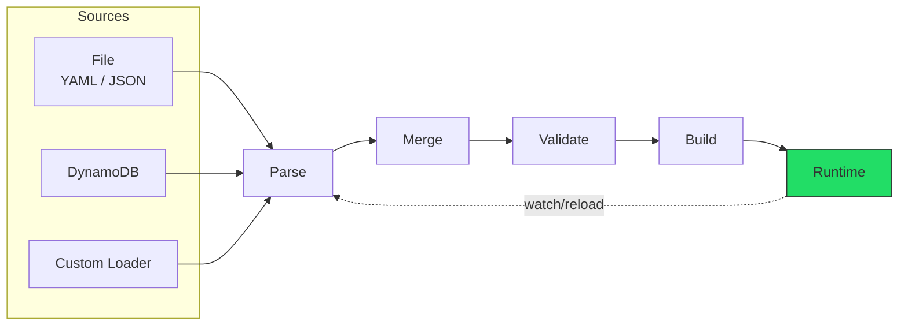
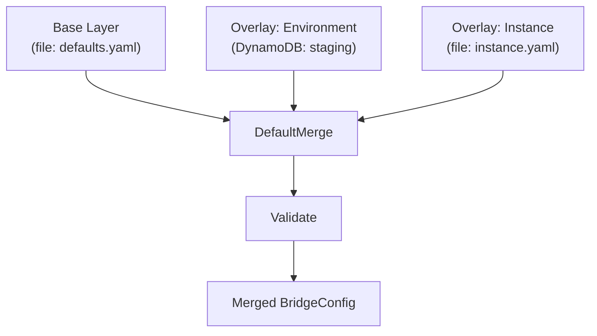

# Configuration System Overview

This guide covers the GoBridge configuration system for both **operators** writing YAML/JSON config files and **developers** using the programmatic Go API.

## Configuration Lifecycle

Every GoBridge instance follows this lifecycle from configuration to running bridge:



1. **Load** -- A `Loader` reads raw configuration from a source (file, DynamoDB, or custom).
2. **Parse** -- YAML or JSON is unmarshalled into a `BridgeConfig` struct.
3. **Merge** -- When using layered configuration, overlays are merged onto the base.
4. **Validate** -- Structural validation checks required fields, referential integrity, and enum values.
5. **Build** -- The `Builder` (or `Supervisor`) creates a `Runtime` with live transports, sessions, and routes.
6. **Watch** *(optional)* -- A `Watcher` detects source changes and feeds them back into the lifecycle.

## Configuration Sources

### File Source (YAML / JSON)

The most common source. Reads a single file and auto-detects format by extension (`.yaml`, `.yml`, `.json`).

```go
import fileconfig "github.com/mariotoffia/gobridge/adapters/native/config/file"

source := fileconfig.NewSource("bridge.yaml")
cfg, err := source.Load(ctx)
```

Maximum file size: **4 MiB**.

### DynamoDB Source

Stores configuration as a single DynamoDB item with version-based change detection. Useful for centralized config management in AWS environments.

```go
import ddbconfig "github.com/mariotoffia/gobridge/adapters/aws/config/dynamodb"

loader := ddbconfig.NewLoader(ddbClient,
    ddbconfig.WithTableName("gobridge-config"),
    ddbconfig.WithBridgeID("production"),
    ddbconfig.WithPollInterval(30 * time.Second),
)
cfg, err := loader.Load(ctx)
```

Table schema: `PK = "config#<bridge-id>"`, `SK = "current"`, with a `version` field for change detection.

### Custom Sources

Implement `config.Loader` and optionally `config.Watcher`:

```go
type Loader interface {
    Load(ctx context.Context) (*config.BridgeConfig, error)
}

type Watcher interface {
    Watch(ctx context.Context) (<-chan *config.BridgeConfig, error)
}
```

## Layered Configuration

The `Manager` supports a base layer with ordered overlays. This enables patterns like base defaults + environment-specific overrides.



**Merge rules:**
- `bridge` settings: overlay non-zero fields replace base
- `config_watch`, `http`: overlay replaces base entirely if non-nil
- `stores`: overlay replaces per-role (lease, outbox, dlq individually)
- `sessions`, `receivers`, `senders`, `bindings`, `routes`: **merge by ID** -- matching IDs are replaced, new IDs are appended

```go
mgr := config.NewManager(
    config.Layer{Name: "base", Loader: fileSource, Watcher: fileWatcher},
    config.WithOverlay(config.Layer{Name: "env", Loader: ddbLoader, Watcher: ddbLoader}),
    config.WithManagerLogger(logger),
)
cfg, err := mgr.Load(ctx)
```

## Two Configuration Paths

### 1. Declarative (YAML file)

Write a YAML file and let the framework do the rest:

```yaml
bridge:
  id: my-bridge

sessions:
  - id: mqtt-conn
    transport: mqtt
    options:
      broker_url: tcp://localhost:1883
      client_id: bridge-01

receivers:
  - id: sensor-in
    session_id: mqtt-conn
    topics:
      - topic: "sensors/#"
        qos: 1

senders:
  - id: sensor-out
    session_id: mqtt-conn
    options:
      default_topic: archive/sensors
      qos: 1

bindings:
  - id: to-archive
    sender_id: sensor-out
    address: archive/sensors

routes:
  - id: forward
    receiver_id: sensor-in
    delivery_mode: direct_hold
    dispatch_mode: single
    bindings: [to-archive]
```

### 2. Programmatic (Go Builder API)

Load config and wire everything in Go:

```go
cfg, _ := config.ParseFile("bridge.yaml", config.FormatAuto)

rt, err := bridge.NewBuilder(cfg, bridge.WithLogger(logger)).
    RegisterTransport("mqtt", paho.NewBridgeFactory(logger)).
    RegisterStoreFactory("memory", nativestore.NewMemoryStoreFactory()).
    RegisterProcessor("my-filter", filterProc).
    Build(ctx)

rt.Start(ctx)
defer rt.Stop(ctx)
```

## Minimal Working Example

The absolute smallest bridge config -- forwards MQTT messages between topics:

```yaml
bridge:
  id: minimal

sessions:
  - id: mqtt
    transport: mqtt
    options:
      broker_url: tcp://localhost:1883
      client_id: minimal-bridge

receivers:
  - id: in
    session_id: mqtt
    topics:
      - topic: "source/#"

senders:
  - id: out
    session_id: mqtt
    options:
      default_topic: destination/all

bindings:
  - id: fwd
    sender_id: out
    address: destination/all

routes:
  - id: route
    receiver_id: in
    bindings: [fwd]
```

## Go Bootstrap Pattern

The reference `cmd/gobridge/main.go` demonstrates the full production pattern:

```go
func main() {
    // 1. Load config from file
    fileSource := fileconfig.NewSource("bridge.yaml")
    baseCfg, _ := fileSource.Load(ctx)

    // 2. Create file watcher using config_watch settings
    fileWatcher := fileconfig.NewWatcher("bridge.yaml",
        fileconfig.WithWatchConfig(baseCfg.ConfigWatch),
        fileconfig.WithLogger(logger),
    )

    // 3. Create manager (supports layered config)
    mgr := config.NewManager(
        config.Layer{Name: "file", Loader: fileSource, Watcher: fileWatcher},
        config.WithManagerLogger(logger),
    )
    cfg, _ := mgr.Load(ctx)

    // 4. Create supervisor with reconfiguration strategy
    sup := bridge.NewSupervisor(
        bridge.WithSupervisorLogger(logger),
        bridge.WithReconfigStrategy(
            bridge.NewWindowedStrategy(10*time.Second, 30*time.Second),
        ),
    )

    // 5. Register transport and store factories
    sup.RegisterTransport("mqtt", paho.NewBridgeFactory(logger))
    sup.RegisterStoreFactory("memory", nativestore.NewMemoryStoreFactory())

    // 6. Start watching and run
    watchCh, _ := mgr.Watch(ctx)
    defer mgr.Stop()

    sup.Run(ctx, cfg, watchCh) // blocks until context cancelled
}
```

## Dynamic Reconfiguration

GoBridge supports live config reload without restarting the process.

### File Watcher Modes

Configured via the `config_watch` YAML section:

| Mode | Mechanism | Best For |
|------|-----------|----------|
| `notify` (default) | Filesystem events (fsnotify), debounced | Local disks, fast change detection |
| `poll` | Periodic SHA-256 content comparison | NFS, network mounts, containers |

```yaml
config_watch:
  mode: notify
  debounce: 200ms    # coalesce rapid writes
```

```yaml
config_watch:
  mode: poll
  poll_interval: 30s  # check every 30 seconds
```

### DynamoDB Watcher

Uses version-number polling. Only reloads the full item when the version changes.

### Supervisor Strategies

The `Supervisor` manages runtime lifecycle during reconfigurations:

| Strategy | Behaviour | Use Case |
|----------|-----------|----------|
| `DirectStrategy` | Apply every change immediately | Development, low-change environments |
| `DebouncedStrategy` | Wait for quiet period, emit latest | Burst edits (save-on-type) |
| `WindowedStrategy` | Debounce + hard deadline cap | Production (quiet=10s, max=30s) |

### Swap Modes

How the Supervisor transitions between old and new runtimes:

| Mode | Behaviour | When Used |
|------|-----------|-----------|
| `SwapOverlap` | Build new while old runs, then swap | Stateless transports (SQS) |
| `SwapPrepareCommit` | Validate first, stop old, then build new | Exclusive MQTT client IDs |
| `SwapAuto` (default) | Inspects `CapExclusiveIdentity`, picks mode | Recommended default |

## What's Next

| Document | Description |
|----------|-------------|
| [Configuration Stores](config-stores.md) | File, DynamoDB, and custom config backends; Manager layering; persistence |
| [Configuration Reference](configuration-reference.md) | Every config field documented |
| [Transport Configuration](transport-configuration.md) | MQTT, SQS, Azure SB, HTTP options |
| [Processors & Stores](processors-and-stores.md) | Filter, transform, circuit breaker, tenant; store backends |
| [Credentials & HTTP API](credentials-and-http-api.md) | Secret management and admin API |
| [Scenarios](scenarios/) | Progressive walkthroughs from simple to clustered |
