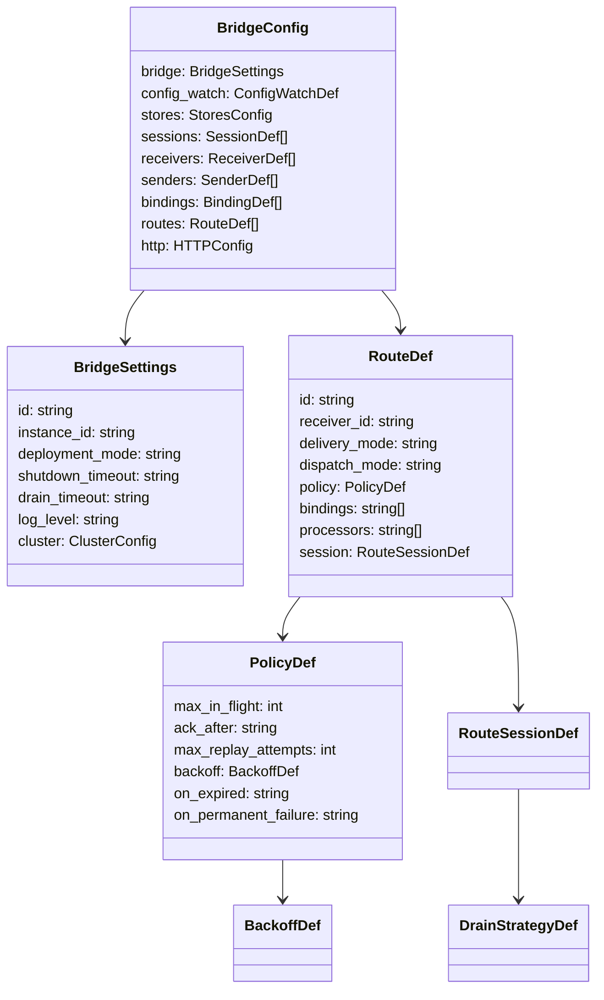

# Configuration Model Reference

Complete field-by-field reference for the `BridgeConfig` YAML/JSON model. All field names match the YAML struct tags in `config/config.go`.

## Config Model Overview



## `bridge` -- Bridge Settings

| Field | Type | Required | Default | Description |
|-------|------|----------|---------|-------------|
| `id` | string | **yes** | -- | Unique bridge identifier |
| `instance_id` | string | no | auto-generated | Instance identifier (useful in clustered mode) |
| `deployment_mode` | string | no | `standalone` | `standalone` or `clustered` |
| `shutdown_timeout` | duration | no | `30s` | Grace period for clean shutdown |
| `drain_timeout` | duration | no | `30s` | Max time to drain in-flight messages |
| `log_level` | string | no | `info` | Log level: `debug`, `info`, `warn`, `error` |

### `bridge.cluster` -- Cluster Config

| Field | Type | Required | Default | Description |
|-------|------|----------|---------|-------------|
| `endpoints` | map[string]string | no | auto-discovered | Static endpoint override `{instance_id: address}` |

```yaml
bridge:
  id: production-bridge
  instance_id: instance-01
  deployment_mode: clustered
  shutdown_timeout: 45s
  drain_timeout: 30s
  log_level: info
  cluster:
    endpoints:
      instance-01: "10.0.1.10:8080"
      instance-02: "10.0.1.11:8080"
```

## `config_watch` -- File Watch Settings

Controls how file-based config changes are detected. Only relevant when using file watchers.

| Field | Type | Required | Default | Description |
|-------|------|----------|---------|-------------|
| `mode` | string | no | `notify` | `notify` (fsnotify) or `poll` (SHA-256 comparison) |
| `poll_interval` | duration | no | `30s` | Polling interval when mode is `poll` |
| `debounce` | duration | no | `100ms` | Debounce period for `notify` mode |

```yaml
config_watch:
  mode: poll
  poll_interval: 30s
```

## `stores` -- Backing Store Configuration

Configures the backing stores for lease coordination, outbox persistence, and dead-letter queue.

### Store Roles

| Role | Purpose | Required When |
|------|---------|---------------|
| `lease` | Distributed lease ownership | Exclusive sessions in clustered mode |
| `outbox` | Durable message outbox | `delivery_mode: shared_outbox` |
| `dlq` | Dead-letter queue | `on_expired: dlq` or `on_permanent_failure: dlq` |

### Store Config Fields

| Field | Type | Required | Description |
|-------|------|----------|-------------|
| `type` | string | **yes** | Store backend: `memory`, `sqlite`, `dynamodb` |
| `options` | map | no | Backend-specific options |

**Memory**: no options required.
**SQLite**: `options.path` (string) -- database file path.
**DynamoDB**: `options.table_name`, `options.region`, `options.endpoint`.

Special option for outbox: `options.stale_claim_duration` (duration) -- age after which unclaimed records can be re-claimed. Should be close to `step_down_grace + 15s`.

```yaml
stores:
  lease:
    type: dynamodb
    options:
      table_name: gobridge-leases
  outbox:
    type: dynamodb
    options:
      table_name: gobridge-outbox
      stale_claim_duration: 30s
  dlq:
    type: memory
```

## `sessions` -- Transport Sessions

Sessions represent stateful transport connections (e.g. an MQTT connection). Stateless transports (SQS, Azure SB) do not use sessions.

| Field | Type | Required | Default | Description |
|-------|------|----------|---------|-------------|
| `id` | string | **yes** | -- | Unique session identifier |
| `transport` | string | **yes** | -- | Transport name: `mqtt`, `sqs`, `servicebus`, `http` |
| `session_mode` | string | no | `ephemeral` | `ephemeral`, `persistent`, `exclusive` |
| `options` | map | no | -- | Transport-specific options (see [Transport Reference](transport-configuration.md)) |

**Session modes:**
- **`ephemeral`** -- Default. Clean session, no state between connections.
- **`persistent`** -- Session state preserved across reconnections (MQTT: `clean_start=false`).
- **`exclusive`** -- Lease-based single holder. Only one instance owns this session at a time. Requires a lease store.

```yaml
sessions:
  - id: mqtt-conn
    transport: mqtt
    session_mode: exclusive
    options:
      broker_url: tcp://mqtt.example.com:1883
      client_id: bridge-primary
```

## `receivers` -- Message Ingress

| Field | Type | Required | Default | Description |
|-------|------|----------|---------|-------------|
| `id` | string | **yes** | -- | Unique receiver identifier |
| `transport` | string | cond. | -- | Transport name (required if no `session_id`) |
| `session_id` | string | cond. | -- | Reference to a session (required if no `transport`) |
| `topics` | array | no | -- | Subscription definitions |
| `options` | map | no | -- | Transport-specific receiver options |

### `receivers[].topics[]` -- Subscriptions

| Field | Type | Required | Default | Description |
|-------|------|----------|---------|-------------|
| `topic` | string | **yes** | -- | Topic or subject pattern |
| `qos` | int | no | 0 | Quality of service (MQTT: 0, 1, 2) |
| `options` | map | no | -- | Per-subscription options |

```yaml
receivers:
  - id: sensor-in
    session_id: mqtt-conn
    topics:
      - topic: "sensors/temperature/#"
        qos: 1
      - topic: "sensors/humidity/#"
        qos: 1
```

**Note:** Either `transport` or `session_id` must be set. When `session_id` is set, the transport is inferred from the session.

## `senders` -- Message Egress

| Field | Type | Required | Default | Description |
|-------|------|----------|---------|-------------|
| `id` | string | **yes** | -- | Unique sender identifier |
| `transport` | string | cond. | -- | Transport name (required if no `session_id`) |
| `session_id` | string | cond. | -- | Reference to a session |
| `options` | map | no | -- | Transport-specific sender options |

```yaml
senders:
  - id: sqs-out
    transport: sqs
    options:
      queue_url: https://sqs.us-east-1.amazonaws.com/123456/events
      batch_size: 10
```

## `bindings` -- Route Destinations

Bindings connect routes to senders with a specific address.

| Field | Type | Required | Default | Description |
|-------|------|----------|---------|-------------|
| `id` | string | **yes** | -- | Unique binding identifier |
| `sender_id` | string | **yes** | -- | Reference to a sender |
| `session_id` | string | no | -- | Optional session override |
| `address` | string | **yes** | -- | Destination address -- supports `{header}` templates |
| `options` | map | no | -- | Per-binding options |

### Address Templates

The `address` field supports `{placeholder}` tokens that are resolved at runtime from envelope headers:

```yaml
bindings:
  - id: to-factory-topic
    sender_id: mqtt-out
    address: "factory/{factory_id}/orders/{device_id}"
```

A message with headers `factory_id: "A"` and `device_id: "42"` resolves to topic `factory/A/orders/42`. The MQTT sender uses this as the publish topic. Missing placeholders cause an error. See [Dynamic Destination Routing](scenarios/12-dynamic-destination-routing.md) for full details.

```yaml
bindings:
  - id: to-events-queue
    sender_id: sqs-out
    address: events
  - id: to-archive-topic
    sender_id: mqtt-out
    address: archive/events
```

## `routes` -- Message Routes

Routes define the message flow from a receiver through processors to bindings.

| Field | Type | Required | Default | Description |
|-------|------|----------|---------|-------------|
| `id` | string | **yes** | -- | Unique route identifier |
| `receiver_id` | string | **yes** | -- | Reference to a receiver |
| `delivery_mode` | string | no | `direct_hold` | `direct_hold` or `shared_outbox` |
| `dispatch_mode` | string | no | `single` | `single` (first binding) or `fan_out` (all bindings) |
| `policy` | object | no | -- | Delivery and retry policy |
| `bindings` | string[] | **yes** | -- | References to binding IDs (at least one) |
| `processors` | string[] | no | -- | Ordered list of processor names |
| `session` | object | no | -- | Route session management (for exclusive sessions) |

**Delivery modes:**
- **`direct_hold`** -- Source held open until egress completes. No inter-instance fencing; destinations must handle duplicates idempotently in clustered mode.
- **`shared_outbox`** -- Source acknowledged after persisting to outbox. Outbox drainer delivers asynchronously. Requires `stores.outbox`.

**Dispatch modes:**
- **`single`** -- Send to first matching binding.
- **`fan_out`** -- Send to all bindings.

### `routes[].policy` -- Delivery Policy

| Field | Type | Required | Default | Description |
|-------|------|----------|---------|-------------|
| `max_in_flight` | int | no | 100 | Max concurrent messages in this route |
| `ack_after` | string | no | `target_accept` | `target_accept` or `outbox_persist` |
| `max_replay_attempts` | int | no | 3 | Max retry attempts for failed messages |
| `max_outbox_depth` | int | no | 0 (unlimited) | Max pending outbox records |
| `on_expired` | string | no | `drop` | `drop` or `dlq` |
| `on_permanent_failure` | string | no | `drop` | `drop` or `dlq` |

### `routes[].policy.backoff` -- Retry Backoff

| Field | Type | Required | Default | Description |
|-------|------|----------|---------|-------------|
| `initial_interval` | duration | no | `1s` | First retry delay |
| `max_interval` | duration | no | `60s` | Maximum retry delay |
| `multiplier` | float | no | 2.0 | Exponential backoff multiplier |

### `routes[].session` -- Route Session Management

For routes targeting exclusive sessions. Manages lease acquisition and outbox draining.

| Field | Type | Required | Default | Description |
|-------|------|----------|---------|-------------|
| `session_id` | string | **yes** | -- | Reference to an exclusive session |
| `sender_id` | string | **yes** | -- | Reference to a sender on that session |
| `lease_ttl` | duration | no | `360s` | Lease validity duration |
| `renew_interval` | duration | no | derived | Lease renewal interval (default: lease_ttl / max_renew_fails) |
| `max_renew_fails` | int | no | 3 | Consecutive renewal failures before step-down |
| `step_down_grace` | duration | no | `15s` | Grace period before releasing lease |
| `drain_interval` | duration | no | -- | Fixed outbox drain poll interval (mutually exclusive with drain_strategy) |
| `drain_batch_size` | int | no | 10 | Records per drain poll |
| `drain_strategy` | object | no | -- | Advanced drain polling strategy |
| `connect_after_lease` | bool | no | false | Delay transport connection until lease acquired |

### `routes[].session.drain_strategy` -- Drain Polling Strategy

| Field | Type | Required | Default | Description |
|-------|------|----------|---------|-------------|
| `type` | string | **yes** | -- | `fixed_poll` or `adaptive_backoff` |
| `interval` | duration | no | -- | Fixed poll interval (for `fixed_poll`) |
| `min_interval` | duration | no | -- | Minimum interval (for `adaptive_backoff`) |
| `max_interval` | duration | no | -- | Maximum interval (for `adaptive_backoff`) |
| `multiplier` | float | no | -- | Backoff multiplier (must be > 1.0) |

```yaml
routes:
  - id: durable-forward
    receiver_id: mqtt-in
    delivery_mode: shared_outbox
    dispatch_mode: single
    bindings: [to-sqs]
    processors: [my-filter, my-transform]
    policy:
      max_in_flight: 50
      ack_after: outbox_persist
      max_replay_attempts: 5
      on_permanent_failure: dlq
      backoff:
        initial_interval: 2s
        max_interval: 120s
        multiplier: 2.5
    session:
      session_id: mqtt-exclusive
      sender_id: sqs-out
      lease_ttl: 300s
      step_down_grace: 20s
      drain_strategy:
        type: adaptive_backoff
        min_interval: 500ms
        max_interval: 10s
        multiplier: 1.5
```

## `http` -- HTTP API Configuration

| Field | Type | Required | Default | Description |
|-------|------|----------|---------|-------------|
| `admin_addr` | string | no | `:8080` | Admin server listen address |
| `monitor_addr` | string | no | `:8081` | Monitor server listen address |
| `admin_api_key` | string | **yes** | -- | API key (minimum 16 characters) |
| `monitor_api_key` | string | no | admin key | Separate monitor API key |
| `cors_origins` | string | no | disabled | CORS allowed origins (wildcard `*` rejected) |

See [Credentials & HTTP API](credentials-and-http-api.md) for endpoint documentation.

## ID Reference Graph

All IDs are validated for existence at config load time:

```mermaid
graph LR
    Route -->|receiver_id| Receiver
    Route -->|bindings[]| Binding
    Route -->|session.session_id| Session
    Route -->|session.sender_id| Sender
    Binding -->|sender_id| Sender
    Binding -.->|session_id| Session
    Receiver -.->|session_id| Session
    Sender -.->|session_id| Session

    style Route fill:#f96,stroke:#333
    style Session fill:#6bf,stroke:#333
```

Solid arrows are required references. Dashed arrows are optional. The validator rejects configs with broken references.

## Validation Rules Summary

Errors from `config.Validate()`:

| Rule | Error Message |
|------|---------------|
| Missing bridge ID | `bridge.id is required` |
| Invalid deployment mode | `must be one of: standalone, clustered` |
| Duplicate IDs within section | `duplicate id "x"` |
| Broken reference | `session_id "x" not found in sessions` |
| shared_outbox without outbox store | `shared_outbox requires stores.outbox` |
| Exclusive session without lease store | `exclusive session requires stores.lease` |
| Clustered MQTT without `$share/` or exclusive | `requires $share/ topic prefix or exclusive session` |
| Invalid duration | `invalid duration "x"` |
| Mutually exclusive drain config | `drain_strategy and drain_interval are mutually exclusive` |

**Warnings** (non-fatal):
- `direct_hold` advisory: no inter-instance fencing, destination must handle duplicates
- `stale_claim_duration` too large relative to `step_down_grace`
