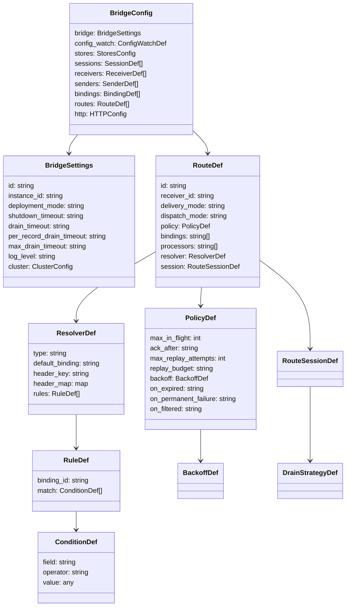

# Configuration Model Reference

Complete field-by-field reference for the `BridgeConfig` YAML/JSON model. All field names match the YAML/JSON struct tags in `ports/blueprint.go`.

> **Duration format.** Every duration field takes a string with a unit
> (`"30s"`, `"5m"`, `"1h30m"`). A bare number (`30`) is **rejected** by the
> strict decoder -- it would be read as nanoseconds, which is never intended.

## Config Model Overview



## `bridge` -- Bridge Settings

| Field | Type | Required | Default | Description |
|-------|------|----------|---------|-------------|
| `id` | string | **yes** | -- | Unique bridge identifier |
| `instance_id` | string | no | auto-generated | Instance identifier (useful in clustered mode) |
| `deployment_mode` | string | no | `standalone` | `standalone` or `clustered` |
| `shutdown_timeout` | duration | no | `30s` | Grace period for clean shutdown |
| `drain_timeout` | duration | no | `30s` | How long the supervisor lets a runtime drain when it STOPS one (shutdown, or a reconfiguration swap). It is the ceiling on `Runtime.Stop`, not a per-batch outbox budget. |
| `per_record_drain_timeout` | duration | no | `3s` | Per-record budget in the outbox drain batch ceiling `min(batchCount * per_record_drain_timeout, max_drain_timeout)`. The ceiling may only RAISE a batch budget already floored at one full send, so it can never cut a send short. |
| `max_drain_timeout` | duration | no | `10s` | Upper bound of that batch ceiling. Must be >= `per_record_drain_timeout`. |
| `log_level` | string | no | `info` | Log level: `debug`, `info`, `warn` (alias `warning`), `error`. Case-insensitive. Validated as a closed enum -- an unknown value is rejected at load instead of being silently ignored. Applied when the reload that carries it is **installed**, never before: a candidate that fails validation or fails to build leaves process verbosity unchanged, so the running system always matches a config an operator can read back |

### `bridge.cluster` -- Cluster Config

| Field | Type | Required | Default | Description |
|-------|------|----------|---------|-------------|
| `endpoints` | map[capability]url | no | auto-discovered | Static override for THIS instance's advertised capability endpoints, keyed by capability (`http`) with a full URL value (`http://host:port`). NOT a peer/instance map. |

```yaml
bridge:
  id: production-bridge
  instance_id: instance-01
  deployment_mode: clustered
  shutdown_timeout: 45s
  # Prefer the scaled drain formula for production workloads. The batch
  # deadline is computed as min(batchCount * per_record_drain_timeout,
  # max_drain_timeout); drain_timeout is ignored when either new field
  # is set and is retained only for backward compatibility.
  per_record_drain_timeout: 3s
  max_drain_timeout: 30s
  log_level: info
  cluster:
    # THIS instance's advertised capability endpoints, keyed by capability with
    # a full URL value. The HTTP forwarder POSTs remote exclusive requests to
    # endpoints["http"], so a static override MUST carry an "http" key. This is
    # NOT a peer/instance map — leave it unset to auto-discover instead.
    endpoints:
      http: "http://10.0.1.10:8080"
    # Live-config-change strategy. Default (unset, or "refuse") is ADR 0012:
    # a clustered node refuses every live config delta and changes are rolled by
    # whole-cohort replacement. "coordinated" opts into the barrier protocol in
    # docs/cluster/spec/cluster-config-rollout-protocol.md and additionally requires
    # `members` below, a versioned CAS-capable config source, and a rollout store
    # wired by the composition root. NOTE: no shipped composition root wires one
    # yet, so "coordinated" currently fails every reload closed (visibly, with the
    # running config still serving) rather than coordinating anything.
    rollout: refuse
    # The cohort ROSTER — the membership epoch the rollout barrier freezes and
    # counts acknowledgements against. Required and non-empty when rollout is
    # "coordinated"; identical on every member; no duplicates. This is a peer
    # list, unlike `endpoints` above.
    members: [instance-01, instance-02]
```

## `config_watch` -- File Watch Settings

Controls how file-based config changes are detected. Only relevant when using file watchers.

| Field | Type | Required | Default | Description |
|-------|------|----------|---------|-------------|
| `mode` | string | no | `notify` | `notify` (fsnotify) or `poll` (SHA-256 comparison) |
| `poll_interval` | duration | no | `30s` | In `poll` mode, the file re-read + content-hash comparison interval. In `notify` mode it doubles as the **resync** cadence -- a slow hash-reconciliation poll behind fsnotify that catches a missed or coalesced filesystem event within one interval (one knob for "how stale a missed change can be"). |
| `debounce` | duration | no | `100ms` | Debounce period for `notify` mode |

```yaml
config_watch:
  mode: poll
  poll_interval: 30s
```

## `stores` -- Backing Store Configuration

Configures the backing stores for lease coordination, outbox persistence, dead-letter queue, and exact managed MQTT subscription history.

### Store Roles

| Role | Purpose | Required When |
|------|---------|---------------|
| `lease` | Distributed lease ownership | Exclusive sessions in clustered mode |
| `outbox` | Durable message outbox | `delivery_mode: shared_outbox` |
| `dlq` | Dead-letter queue | `on_expired: dlq`, `on_permanent_failure: dlq`, or `on_filtered: dlq` |
| `managed_subscriptions` | Exact durable MQTT topic-filter history | Persistent/exclusive MQTT session with desired subscriptions |

### Store Config Fields

| Field | Type | Required | Description |
|-------|------|----------|-------------|
| `type` | string | **yes** | Store backend: `memory`, `sqlite`, `dynamodb` |
| `options` | map | no | Backend-specific options |

**Memory**: no options required. Memory does **not** implement `managed_subscriptions`, because process-local history cannot survive restart.

**SQLite** (`type: sqlite`):

| Option | Type | Applies to | Default | Description |
|--------|------|------------|---------|-------------|
| `path` | string | all roles | -- (**required**) | Database file path (`:memory:` remains available to non-durable test roles). For `managed_subscriptions`, this must be a plain absolute, already-clean filesystem path: `:memory:`, relative paths, `file:` URIs, queries, and fragments are rejected. The final parent must be owner-controlled `0700` (missing adapter-owned parents are created as `0700`); the database, WAL, SHM, and journal are descriptor-validated non-symlink regular files at `0600`. Insecure existing paths are rejected, never silently chmodded. |
| `stale_claim_duration` | duration | outbox | runtime-derived | How long a same-owner stranded claim waits before another claim attempt may take it. Failover reclaim via a higher fencing version is always immediate and independent of this. |

> **Windows limitation:** `sqlite` managed-subscription history currently fails
> construction explicitly on Windows. The adapter requires descriptor-relative
> no-follow creation and validation for the database and WAL/SHM/journal
> sidecars; equivalent secure Windows handle semantics are not implemented.
> Use DynamoDB for this role on Windows. Other SQLite store roles are unaffected.

| `retention` | duration | outbox | `1h` | Window completed/expired outbox rows are kept before piggybacked compaction deletes them. Negative disables compaction (rows kept forever). Keep comfortably above any upstream redelivery window, since deleting a terminal row releases its duplicate-detection identity. |

**DynamoDB** (`type: dynamodb`):

| Option | Type | Applies to | Default | Description |
|--------|------|------------|---------|-------------|
| `table_name` | string | all roles | `gobridge-leases` / `gobridge-outbox` / `gobridge-dlq` / `gobridge-managed-subscriptions` | Overrides the role-specific DynamoDB table name. Runtime preflight and the AWS CDK grant path resolve the same default when omitted. |
| `stale_claim_duration` | duration | outbox | runtime-derived | Same semantics as the SQLite outbox key above. |
| `compaction_grace` | duration | outbox | store default | Window completed/expired outbox items are kept before the DynamoDB item TTL deletes them. Keep above any upstream redelivery window. |
| `retention` | duration | DLQ | none (kept until deleted) | TTL on dead-letter entries (`ttl = failed_at + retention`). Use a days-scale value so investigators have time to inspect dead-lettered messages. |
| `max_scan_pages` | int | DLQ | `100` | Bounds the number of DynamoDB pages an index-less List/Purge reads before stopping, preventing an unbounded full-table scan. Negative disables the bound. |

> The AWS region and endpoint are NOT store options: they come from the standard
> AWS SDK configuration chain (environment, shared config, IAM role). Supplying
> `options.region` or `options.endpoint` is rejected by the strict decoder.

**Managed-subscription data models and startup contract.** SQLite keeps a baseline
identity row plus exact `(storage_identity, filter)` rows. DynamoDB uses a
`storage_identity` string HASH key, a `baseline` BOOL, and an optional `filters`
String Set; grant `GetItem`, `UpdateItem`, and `DescribeTable` (the standard
read/write-data grant is a permitted superset). The identity is an opaque,
secret-safe durable-session fingerprint. A missing baseline or any store outage
fails startup before the MQTT broker connection is opened; seed an explicit
empty baseline for a genuinely new durable session.

**DLQ read ordering** is oldest-first (`failed_at ASC`) across all backends, so
operators triage the earliest failures first.

**Fence retention floor (30 days).** Independently of `retention` /
`compaction_grace`, the outbox keeps each partition's *fence* row (its dedup /
ordering high-water-mark) for at least `max(retention_or_compaction_grace, 30d)`
past the last write that touches the partition. Setting a shorter `retention`
does not shorten this floor: it bounds how aggressively terminal *record* rows
are compacted, not the fence. The floor stops ephemeral/rotating session
partitions from accreting one immortal fence row each, while 30 days of
abandonment is deemed safe because such a partition has no competing owner left
to fence (`sqliteoutbox/outbox.go:35`, `dynamodboutbox/acl_store.go:72`).

**DynamoDB outbox indexes.** The outbox table requires three sparse indexes —
`ExpiryIndex` (hash `has_expiry`, range `expires_at`, `KEYS_ONLY`),
`RecordIDIndex` (hash `record_id`, `KEYS_ONLY`) and `ClaimIndex` (hash `PK`,
range `claim_sort`, **`Projection: ALL`**). `Store.CreateTable` provisions all
three; the factory preflight rejects a table that is missing one or has
`ClaimIndex` under-projected. See
[DynamoDB outbox table schema](runbooks/dynamodb-outbox-table-schema.md).

Set `stale_claim_duration` above your worst-case drain-batch timeout. A
stale-claim reclaim is crash recovery — it hands a record to a second sender on
the assumption the first is dead — so a value below the time a HEALTHY owner can
hold a claim duplicates deliveries that are still in flight, silently. Validation
enforces two bounds on an explicit value:

| Value | Result |
|---|---|
| at or below the largest route `send_timeout` | **rejected** — the first owner's send has not even timed out yet |
| at or below `send_timeout` + the drain-batch ceiling (`max_drain_timeout`, else `drain_timeout`) | **warning** — a record claimed at the head of a batch can wait most of that budget before its own send starts |
| above both | accepted |

Leaving the key unset is the safe default: the bridge derives
`step_down_grace + max(2 x step_down_grace, 15s)` and no bound is applied.

```yaml
stores:
  lease:
    type: dynamodb
    options:
      table_name: gobridge-leases
  outbox:
    type: dynamodb
    options:
      table_name: gobridge-outbox
      stale_claim_duration: 30s
  dlq:
    type: memory
    options:
      # In-memory DLQ entries are lost on restart, erasing the terminal
      # evidence of dropped messages; the loss must be acknowledged.
      acknowledge_volatile: true
  managed_subscriptions:
    type: dynamodb
    options:
      table_name: gobridge-managed-subscriptions
```

## `sessions` -- Transport Sessions

Sessions represent stateful transport connections (e.g. an MQTT connection). Stateless transports (SQS, Azure SB) do not use sessions.

| Field | Type | Required | Default | Description |
|-------|------|----------|---------|-------------|
| `id` | string | **yes** | -- | Unique session identifier |
| `transport` | string | **yes** | -- | Transport name: `mqtt`, `sqs`, `servicebus`, `http` |
| `session_mode` | string | no | `ephemeral` | `ephemeral`, `persistent`, `exclusive` |
| `options` | map | no | -- | Transport-specific options (see [Transport Reference](transport-configuration.md)) |

**Session modes:**
- **`ephemeral`** -- Default. Clean session, no state between connections.
- **`persistent`** -- Session state preserved across reconnections (MQTT: `clean_start=false`).
- **`exclusive`** -- Lease-based single holder. Only one instance owns this session at a time. Requires a lease store.

```yaml
sessions:
  - id: mqtt-conn
    transport: mqtt
    session_mode: exclusive
    options:
      session:
        broker_urls:
          - tcp://mqtt.example.com:1883
        client_id: bridge-primary
```

## `receivers` -- Message Ingress

| Field | Type | Required | Default | Description |
|-------|------|----------|---------|-------------|
| `id` | string | **yes** | -- | Unique receiver identifier |
| `transport` | string | cond. | -- | Transport name (required if no `session_id`) |
| `session_id` | string | cond. | -- | Reference to a session (required if no `transport`) |
| `topics` | array | no | -- | Subscription definitions |
| `options` | map | no | -- | Transport-specific receiver options |

### `receivers[].topics[]` -- Subscriptions

| Field | Type | Required | Default | Description |
|-------|------|----------|---------|-------------|
| `topic` | string | **yes** | -- | Topic or subject pattern |
| `qos` | int | no | 0 | Quality of service (MQTT: 0, 1, 2) |
| `options` | map | no | -- | Per-subscription options |

```yaml
receivers:
  - id: sensor-in
    session_id: mqtt-conn
    topics:
      - topic: "sensors/temperature/#"
        qos: 1
      - topic: "sensors/humidity/#"
        qos: 1
```

**Note:** Either `transport` or `session_id` must be set. When `session_id` is set, the transport is inferred from the session.

## `senders` -- Message Egress

| Field | Type | Required | Default | Description |
|-------|------|----------|---------|-------------|
| `id` | string | **yes** | -- | Unique sender identifier |
| `transport` | string | cond. | -- | Transport name (required if no `session_id`) |
| `session_id` | string | cond. | -- | Reference to a session |
| `options` | map | no | -- | Transport-specific sender options |

```yaml
senders:
  - id: sqs-out
    transport: sqs
    options:
      queue_url: https://sqs.us-west-1.amazonaws.com/123456/events
      batch_size: 10
```

## `bindings` -- Route Destinations

Bindings connect routes to senders with a specific address.

| Field | Type | Required | Default | Description |
|-------|------|----------|---------|-------------|
| `id` | string | **yes** | -- | Unique binding identifier |
| `sender_id` | string | **yes** | -- | Reference to a sender |
| `session_id` | string | no | -- | Optional session override |
| `address` | string | **yes** | -- | Destination address -- supports `{header}` templates |
| `options` | map | no | -- | Per-binding options -- **parsed but not consumed at runtime** (`DestinationBinding.Config` is never read); leave bindings bare and configure the transport on the sender. |

### Address Templates

The `address` field supports `{placeholder}` tokens that are resolved at runtime from envelope headers:

```yaml
bindings:
  - id: to-factory-topic
    sender_id: mqtt-out
    address: "factory/{factory_id}/orders/{device_id}"
```

A message with headers `factory_id: "A"` and `device_id: "42"` resolves to topic `factory/A/orders/42`. The MQTT sender uses this as the publish topic. Missing placeholders cause an error. See [Dynamic Destination Routing](scenarios/12-dynamic-destination-routing.md) for full details.

```yaml
bindings:
  - id: to-events-queue
    sender_id: sqs-out
    address: events
  - id: to-archive-topic
    sender_id: mqtt-out
    address: archive/events
```

## Routes, Runtime & Validation

The remainder of the configuration model -- `routes`, the `http` API block, the
ID reference graph, delivery hooks, programmatic builder/lifecycle notes, and
the validation-rules summary -- is documented in
[Routes, Runtime & Validation Reference](routes-and-runtime-reference.md). That
reference also covers the per-route lease-timing knobs under `routes[].session`,
including `renew_call_timeout`, `acquire_poll_interval`, `failover_slo`, and
`startup_allowance`. A declared SLO is validated from failure detection through
`ServiceLevelFull`; measured warm and cold evidence is still required.

