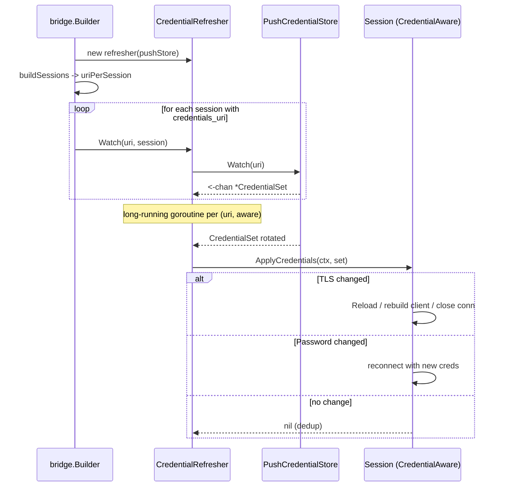

# Credential Rotation

This document describes how GoBridge rotates credentials on live
transport sessions **after** they have been constructed. The
companion document
[credentials-and-http-api.md](credentials-and-http-api.md) covers the
build-time resolution path (how `credentials_uri` becomes
username/password/TLS in a transport's option map on the first
connect).

> Rotation here means "the backing secret or certificate has changed
> while the bridge is running, and the bridge needs to start using
> the new material without being rebuilt."

## Mental model

GoBridge splits credentials along **two orthogonal axes**:

1. **Direction** -- how the credential flows into the bridge. The
   relevant port interfaces are `ports.PullCredentialStore` and
   `ports.PushCredentialStore` (both defined in
   [`ports/credentials.go`](../ports/credentials.go)).
2. **Scope** -- what the credential controls on the transport. The
   rotation payload is the single struct `connectivity.CredentialSet`,
   which currently carries two capability fields: `Password` and
   `TLS` ([`domain/connectivity/credentials.go`](../domain/connectivity/credentials.go)).

```mermaid
flowchart LR
    subgraph DIR["Direction axis"]
        PULL[PullCredentialStore<br/>Resolve(uri)]
        PUSH[PushCredentialStore<br/>Watch(uri)]
        POLL[runtime/credentials.PollBasedWrapper<br/>Pull -> Push adapter]
        PULL -->|"wrap"| POLL
        POLL -->|"satisfies"| PUSH
    end
    subgraph SCOPE["Scope axis"]
        CS[CredentialSet]
        PW[Password]
        TLS[TLSMaterial]
        CS --> PW
        CS --> TLS
    end
    PUSH -->|"emits"| CS
    CS -->|"applied by"| AWARE["transport<br/>CredentialAware"]
```

The direction axis decides **how a rotation event reaches the
transport**. The scope axis decides **which parts of the transport
need to rebuild** when that event arrives.

## Direction: Pull vs Push

### `PullCredentialStore`

```go
type PullCredentialStore interface {
    Resolve(ctx context.Context, uri string) (*connectivity.CredentialSet, error)
}
```

Synchronous lookup by URI scheme. Used at **build time** to populate
initial transport options; also used as the backing store for
poll-based push adapters. Implementations today: native file, AWS
SSM, and future Vault/secret-manager backends.

`CredentialStore` is aliased to `PullCredentialStore` for backwards
compatibility; the builder still accepts either name via
`WithCredentialStore`.

### `PushCredentialStore`

```go
type PushCredentialStore interface {
    Watch(ctx context.Context, uri string) (<-chan *connectivity.CredentialSet, error)
}
```

Streaming interface. The returned channel emits a `*CredentialSet`
whenever the backing material changes. Required contract:

1. The channel is **closed** when `ctx` is cancelled, the store is
   closed, or a terminal backend error occurs.
2. Implementations **MUST dedup** using `CredentialSet.Equal` -- only
   emit when credentials differ from the previous snapshot.
3. The first value MAY be emitted eagerly (initial snapshot) or
   lazily (on first rotation). Callers don't rely on the timing.

### `runtime/credentials.PollBasedWrapper` -- Pull to Push adapter

Most real stores (file, SSM) have no native change notification.
`credentials.NewPollBasedWrapper(pull, cfg)` turns any pull store into a
push store by polling on a ticker:

```go
cfg := ports.PollBasedWrapperConfig{
    PollInterval: 30 * time.Second,
    Jitter:       5 * time.Second, // spread load across watchers
    EmitOnStart:  false,           // true = snapshot on subscribe
}
push := credentials.NewPollBasedWrapper(pullStore, cfg)
```

Each `Watch` call gets its own ticker goroutine. Dedup happens
inside the wrapper so a quiet source does not trigger reconnects.

`EmitOnStart` controls the first emission. The library zero value is `false`
(adopt the current value as the dedup baseline, emit only on a later change).
The shipped deployments default it to **true**: the stock `cmd/gobridge` binary
sets it directly, and the AWS file-based profile derives it via
`EffectiveCredentialEmitOnStart` (nil → true). The rationale is Finding 1 -- a
rotation that landed in the build→watch window is surfaced on the first tick
rather than silently baselined. Set `credential_emit_on_start: false` to restore
the legacy silent-baseline behavior.

Regardless of `EmitOnStart`, the wrapper closes the build→watch blind window: its
seed compares the value the session was built with (a cache hit, not an extra
round-trip) against a fresh uncached read, and if they differ it surfaces a
**build-window rotation** immediately so the new session is corrected off the
rotated-out secret. When the wrapped store exposes `ResolveUncached` (the runtime
`CredentialResolver` does), every poll bypasses the store's TTL cache, so a
rotation is detected within one `PollInterval` regardless of the cache TTL.

## Scope: `CredentialSet`

```go
type CredentialSet struct {
    Password *PasswordCredential  // username / password (or client id / secret)
    TLS      *TLSMaterial         // CertPEM + KeyPEM + CAPEMs + InsecureSkipVerify
}
```

A single rotation event **can carry one or both**. Three reasons the
payload is one struct rather than N narrow interfaces:

1. **Atomic rotation events.** Vault / Secrets Manager often deliver
   `{username, password, ca_cert}` as a single versioned bundle.
   One struct means one apply call, not N races.
2. **Per-transport dispatch differs from per-capability.** ASB
   rebuilds the same client for password, server trust, and client
   cert. Paho needs a full `Session.Reload` for any TLS change but
   not for passwords. Per-capability interfaces would duplicate the
   rebuild decisions.
3. **Single-bit capability discovery.** Transports opt in by
   implementing `CredentialAware`; the runtime does not need to
   introspect N sub-capabilities.

### `Equal` and dedup

`(*CredentialSet).Equal` performs a deep, value-based comparison of
both `Password` and `TLS` (including `CAPEMs` element-wise). The
`PollBasedWrapper` and every transport's `ApplyCredentials`
short-circuit when `Equal` reports no change, so eager re-emits cost
nothing.

## The rotation pipeline



The **same pipeline** binds receiver-level and sender-level
`credentials_uri` values via `WatchReceiver` / `WatchSender`. For
transports where sessions own all credentials (MQTT, AMQP), the
receiver/sender variants are typically unused; for transports where
each endpoint has its own auth (HTTP per-route, some per-queue ASB
setups), they are the primary path.

### Rotation callbacks (cache invalidation)

Both refresher layers expose a post-rotation callback so a caller can
invalidate a downstream cache the instant a new secret is applied:

- `bridge.WithRotationCallback(fn func(uri string))`
  (`bridge/credential_refresh.go:56-60`) -- invoked with the URI after each
  **applied** rotation on the builder's refresher.
- `runtime/credentials.WithOnRotation(fn func(uri string))`
  (`runtime/credentials/poll.go:87-108`) -- the same hook on the polled
  pull-to-push wrapper. It fires only on an actual rotation, never on the
  initial fetch (`poll.go:184`).

The composition root wires `InvalidateCache` for **one path only**: a decoupled
push store registered with `WithPushCredentialStore`. When that push store is
present AND the pull store exposes `InvalidateCache(uri)`, the builder registers
`InvalidateCache` as the refresher's rotation callback
(`bridge/builder_complete.go:96-99`), gated by `pullCacheNeedsRotationInvalidation`
(`bridge/builder.go:165-167`, which returns true only when `pushCredStore != nil`).
A push rotation then evicts the rotated URI from the pull cache so the next resolve
fetches the fresh secret instead of a stale one.

The polled path is deliberately NOT wired to `InvalidateCache`. That covers
`WithPolledCredentialStore` and any `file://` / SSM pull store the builder wraps in
a `PollBasedWrapper` via `effectivePushStore` (`bridge/builder.go:144-154`). The
wrapper wraps the SAME resolver and refreshes that resolver's cache through
`ResolveUncached` on the poll that detects the rotation, before it publishes the new
`CredentialSet` (`runtime/credentials/poll.go:290-345`). Invalidating there would
delete the just-cached fresh entry and blind the `CredentialStaleServed` signal for
up to one poll interval, so the callback is left off that path on purpose.

### Reactive re-resolve on auth failure

Polling bounds rotation-detection latency to one `PollInterval` (default 5m). A
*hard* rotation -- the old secret revoked the instant the new one is written --
would otherwise leave every session on the URI stuck on rejected credentials for
up to that interval. To shrink the blast radius, the refresher exposes a reactive
hook: when a rotation apply is itself rejected as unauthorized, `applyOne` calls
`CredentialRefresher.NotifyAuthFailure(uri, err)`, and for a
`shared.ErrNotAuthorized` error that forces an immediate out-of-band re-resolve
(`PollBasedWrapper.Refresh`) instead of waiting for the poll timer.
`NotifyAuthFailure` is also the public hook a live transport calls when its
own connection reports `NOT_AUTHORIZED`.

Stock transports are now wired to this hook. At `Watch` time the
refresher injects a URI-bound callback into any registered target that
implements the optional `bridge.AuthFailureReporter` capability
(`SetAuthFailureCallback(func(err error))`); the target invokes it from its live
op path when a broker error maps to `shared.ErrNotAuthorized`. Because the
callback closes over the URI, sessions stay URI-agnostic, and because
`NotifyAuthFailure` is auth-gated and rate-limited (below) the target may call it
on every auth failure. The wired transports and their report chokepoints are:

| Transport | Report site | Rationale |
|-----------|-------------|-----------|
| AMQP 1.0 (`amqp10`) | reconnect (`Session.connect`) | session auth is established at connection open, so a revocation surfaces as a redial `amqp:unauthorized-access`, the single funnel |
| AMQP 0-9-1 (`amqp091`) | reconnect (`Session.doReconnect`) | same: revocation surfaces as a 403 on redial |
| MQTT (`paho`) | CONNECT failure (`handleConnectError`) | broker denial arrives as a `*autopaho.ConnackError` (reason 0x86/0x87) at connect |
| AWS SQS (`sqs`) | live send + receive (`Sender`/`Receiver`) | request/response API calls carry credentials per-op; there is no reconnect loop |
| Azure Service Bus (`servicebus`) | live send + batch send + receive (`Sender`/`Receiver`) | same request/response model; the client is rebuilt on rotation, not reconnected. Batch send reports from the aggregated per-message results so a batch-only sender still recovers |

Session transports report only at the (re)connect chokepoint because credential
revocation manifests at connection open, not per message. Request/response
transports (SQS, Service Bus) have no reconnect loop, so they report from the
send and receive op paths (each `Sender`/`Receiver` is separately
`CredentialAware` and gets its own callback). The **HTTP** transport has no
runtime-rotatable session: it is a server that validates inbound API keys, and
its only outbound path (the SSE cluster forwarder) presents static per-peer keys
from config, is not `CredentialAware`, is never `Watch`ed (no bound
`credentials_uri`), and maps a peer 401 to `shared.ErrForwardFailed` — so there
is nothing to wire and nothing is fabricated.

`Refresh` is idempotent (a nudge already pending is coalesced) and rate-limited
per URI to at most one honoured fetch per `DefaultReactiveReResolveInterval`
(5s), so a reconnect storm -- every session on the URI reporting `NOT_AUTHORIZED`
at once -- collapses into a single backend fetch rather than hammering the
secrets store. It is a no-op for a store that does not support reactive refresh,
for an empty URI, or for a non-authorization error.

## Transport change interface: `bridge.CredentialAware`

```go
type CredentialAware interface {
    ApplyCredentials(ctx context.Context, creds *connectivity.CredentialSet) error
}
```

**One method, both scopes.** The transport inspects `creds.Password()`
and `creds.TLS()` internally and dispatches the appropriate rebuild.
Transports opt in by implementing this interface on whichever of
`Session`, `Receiver`, or `Sender` holds the credentials. The
refresher discovers participation via a type assertion:

```go
aware, ok := sess.(CredentialAware)
if !ok {
    // Silently skipped with a debug log. HTTP and other transports
    // that never do auth at the transport layer coexist cleanly.
    return
}
```

## Per-transport behaviour matrix

What each transport does with each capability today:

| Transport | `set.Password()` | `set.TLS()` server trust (CA) | `set.TLS()` client cert |
|-----------|------------------|-------------------------------|------------------------|
| **MQTT paho** | mutate `liveCreds`; `Session.Reload()` rebuilds the connection manager and the fresh CONNECT pulls new creds via `ConnectPacketBuilder` (a bare `Disconnect()` is **not** used -- it is terminal in paho.golang v0.23.0) | `applyTLSMaterial` updates `opts.TLS.CACertPEM`; triggers `Session.Reload()` (full CM rebuild) | same path as CA; `Reload()` rebuilds |
| **AMQP 0-9-1** | mutate `liveCreds`; `conn.Close()` -> reconnect loop | `applyAMQPTLSMaterial` updates `opts.TLS.CACertPEM`; `conn.Close()`; also rebuilds `s.dial` closure when TLS is newly enabled | same path |
| **AMQP 1.0** | mutate `liveCreds`; `conn.Close()` -> monitor-loop reconnect | `applyAMQP10TLSMaterial`; `connect()` re-reads `opts.TLS` each dial, so mutation + close is enough | same path |
| **Azure Service Bus** | `credentialsToConnection` swaps SAS `ConnectionString` or AAD `ClientID`/`ClientSecret`; Sender rebuilds `*azservicebus.Client` + sender link | same function sets `CaPEM`, nils cached `TLSConfig` so `buildClientOptions` rebuilds `tls.Config` from PEM | same function sets `ClientCertPEM`/`ClientKeyPEM`; same rebuild path |
| **SQS** | `rebuildSQSClient` with `credentials.NewStaticCredentialsProvider`; atomic client swap | not supported (HTTPS rides SDK default trust store) | n/a |

### Capability support summary

| Transport | password | server-CA rotation | client-cert rotation | InsecureSkipVerify toggle |
|-----------|:--------:|:------------------:|:--------------------:|:-------------------------:|
| MQTT paho | yes | yes (PEM) | yes (PEM) | yes |
| AMQP 0-9-1 | yes | yes (PEM) | yes (PEM) | yes |
| AMQP 1.0 | yes | yes (PEM) | yes (PEM) | yes |
| Azure Service Bus | yes | yes (PEM) | yes (PEM) | yes |
| SQS | yes | no | no | no |

> **SQS accepts static keys only.** The SQS credential path builds a
> `credentials.NewStaticCredentialsProvider`, which has no field for a session
> token. A resolved credential set whose access-key ID is temporary/STS (an
> `ASIA…` prefix) is rejected with `ErrTemporaryCredentialsUnsupported`, surfaced
> as `NOT_AUTHORIZED` (permanent) -- at build-time resolution of `credentials_uri`
> and on any later rotation. Use long-lived IAM user keys through the credential
> store, or leave the credential unset (`creds == nil`) and let the SDK provider
> chain supply an instance/task role, which may itself be STS-backed.

### TLS dispatch rule (applies to MQTT, AMQP 0-9-1, AMQP 1.0)

Each transport's TLS config struct accepts both file-based and
PEM-based material. `BuildTLSConfig` resolves precedence with the
same rule across transports:

- **CA:** `CACertPEM` wins over `CACertFile` when non-empty.
- **Client cert/key:** `CertPEM` **and** `KeyPEM` together win over
  `CertFile`+`KeyFile`. A half-populated pair (`CertPEM` alone or
  `KeyPEM` alone) is rejected with an error. This is deliberate --
  silently falling back to the file pair would hide a rotation bug
  that delivers only half the material.

For ASB the field names are `CaPEM` / `ClientCertPEM` /
`ClientKeyPEM`; the same precedence rule applies against a
caller-supplied `TLSConfig`. When `TLSConfig` is non-nil it wins;
when nil, `buildClientOptions` constructs a fresh `tls.Config` from
the PEM fields.

### AMQP 0-9-1: explicit credentials override URL userinfo

When an amqp091 session has an explicitly configured (or rotated) username, it
**always** wins over any userinfo embedded in `broker_url`
(`adapters/amqp/transport/amqp091/acl_client.go:152-169`). URL userinfo is used
only when no explicit username is configured. This precedence is what makes
rotation correct: without it a rotation would report success while every redial
silently re-authenticated with the old, soon-to-be-revoked credentials baked
into the URL. Prefer supplying credentials via `credentials_uri` (or the
session's `username`/`password`) and keeping `broker_url` credential-free.
When `broker_url` userinfo and explicit/managed credentials conflict, the
session logs a **Warn** — once at construction and once per rotation, with the
URL redacted — because the embedded userinfo is dead config.

## Operator workflow

### Enabling rotation

1. Register a push store on the supervisor or builder:
   ```go
   // Native push (e.g. K8s informer, Vault lease watcher)
   builder := bridge.NewBuilder(cfg,
       bridge.WithPushCredentialStore(pushStore),
   )

   // Polled push (file / SSM / any pull store)
   builder := bridge.NewBuilder(cfg,
       bridge.WithPolledCredentialStore(pullStore,
           ports.PollBasedWrapperConfig{
               PollInterval: 30 * time.Second,
               Jitter:       5 * time.Second,
           }),
   )
   ```
   Supervisor variants: `WithSupervisorPushCredentialStore` /
   `WithSupervisorPolledCredentialStore`.
2. Set `credentials_uri` on each session, receiver, or sender that
   should rotate. The URI is resolved at build time and bound to a
   watcher after successful construction.
3. Rotate the underlying secret in the backing store. The bridge
   observes the change within one poll interval (or immediately for
   native push stores) and reconnects.

### Observing rotation

Structured logs are emitted at `DEBUG` level by each transport's
`ApplyCredentials`, for example:

```text
msg="mqtt: applying rotated credentials; reloading session" client_id=...
msg="amqp091: credentials rotated; forcing reconnect" password_changed=true tls_changed=false
```

Failed applies log at `WARN`:

```text
msg="credential refresh: ApplyCredentials failed" uri=... error=...
```

Metrics from the session itself (connect latency, reconnect counter)
surface the rotation impact on operational dashboards. The credential
subsystem emits its own counters so rotation is observable instead of
log-only:

| Metric | Dimensions | Emitted when |
|--------|-----------|--------------|
| `CredentialRotationApplied` | none | A target's `ApplyCredentials` returned without error (one per target per rotation). |
| `CredentialRefreshFailures` | none | A poll resolve failed (initial seed or periodic tick). |
| `CredentialResolveFailure` | `code` | A repository fetch failed on any resolve path, tagged with the error code. |
| `CredentialStaleServed` | `code` | The resolver served an expired last-known-good credential after a retryable error. |

`CredentialResolveFailure` and `CredentialStaleServed` come from the
`CredentialResolver` (see
[credentials-and-http-api.md](credentials-and-http-api.md#resolver-caching-and-failure-behavior)),
`CredentialRotationApplied` from the refresher, and `CredentialRefreshFailures`
from the poll wrapper. Dimensions, units, and alarm guidance:
[AWS monitoring](aws-deployment/monitoring.md#key-metrics).

## Extension: adding a new rotatable capability

Suppose you want to support OAuth2 bearer tokens:

1. **Domain.** Add the field to `connectivity.CredentialSet`:
   ```go
   type CredentialSet struct {
       Password *PasswordCredential
       TLS      *TLSMaterial
       OAuth2   *OAuthBearer   // new
   }
   ```
   Extend `(*CredentialSet).Equal` to cover it.
2. **Repositories.** Extend the JSON parsers in each
   `CredentialRepository` backend (file, pms, ...) so
   `Resolve(uri)` populates the new field.
3. **Transport.** In each participating transport's
   `ApplyCredentials`:
   - nil field -> ignore (no-op).
   - unchanged -> dedup (no-op).
   - changed -> apply and trigger whatever rebuild the transport
     needs (header refresh for HTTP, re-attach for AMQP, ...).
4. **Docs.** Add a row to the capability matrix above and note any
   transport-specific dispatch rules.
5. **Tests.** The standard pattern in
   `adapters/*/credentials_refresh_test.go` covers:
   (a) nil-set rejection, (b) before-start stashes on opts,
   (c) dedup, (d) change detection with field-by-field diffs.

## Extension: writing a new transport that supports rotation

1. Implement `ports.Session` (or `Receiver` / `Sender`) as usual.
2. Add `ApplyCredentials(ctx, *CredentialSet) error` on the same
   type. The type now satisfies `bridge.CredentialAware`.
3. Inside `ApplyCredentials`:
   - Accept nil/empty sets without error (returning nil is accepted).
   - Dedup against last-applied material.
   - Perform the transport-appropriate rebuild (close conn,
     rebuild client, etc.).
   - Keep `opts.Username` / `opts.Password` / `opts.TLS` in sync
     so a subsequent supervisor rebuild sees consistent values.
4. If TLS rotation requires a full teardown (e.g. MQTT paho), add a
   `Reload(ctx)` method that does `disconnect + Start()` reusing
   current opts. Call `Reload` from `ApplyCredentials` when TLS
   fields change.
5. Copy the test skeleton from an existing transport (MQTT paho is
   the reference) and adapt. The pure TLS-material diff helper
   (`applyTLSMaterial`, `applyAMQPTLSMaterial`, ...) is especially
   worth keeping as a unit-testable function separate from the
   reconnect mechanics.

## Non-goals / known gaps

- **Re-auth without reconnect.** None of the supported broker
  protocols (MQTT 5, AMQP 0-9-1, AMQP 1.0) expose in-band re-auth.
  Rotation is always "close, redial" -- trading a brief disconnect
  for simplicity.
- **SQS TLS rotation.** SQS rides HTTPS with the SDK default trust
  store. Rotating the SQS HTTP client's TLS would require a custom
  `http.Client` wired into the AWS config; this is out of scope for
  the bridge today and documented as a no-op.
- **Partial TLS material.** `CertPEM` without `KeyPEM` (or vice
  versa) is a hard error -- intentional, to surface rotation bugs
  in the source rather than silently fall back to stale file-based
  material.

## References

- [`ports/credentials.go`](../ports/credentials.go) -- interface definitions
- [`domain/connectivity/credentials.go`](../domain/connectivity/credentials.go) -- `CredentialSet`, `Equal`
- [`bridge/credential_refresh.go`](../bridge/credential_refresh.go) -- `CredentialRefresher`, `CredentialAware`
- [`runtime/credentials/poll.go`](../runtime/credentials/poll.go) -- `PollBasedWrapper`
- [`docs/credentials-and-http-api.md`](credentials-and-http-api.md) -- build-time resolution, URI schemes
- [`PLUGIN.md`](../PLUGIN.md) -- writing a new transport plugin
