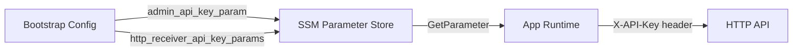
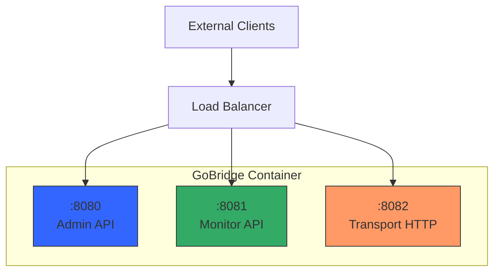

# Deployment Guide

This guide covers deployment topology, configuration delivery, secret management,
networking, health checks, observability, and scaling. The concepts apply
wherever you run GoBridge; the concrete artifact differs by how you build it. For
cloud-specific guidance, see [What's Next](#whats-next).

> **The shipped container image is the AWS file-based deployment profile, not a
> platform-neutral image.** The published image runs
> `deployment/aws-filebased-config` and is bound to AWS. It **requires** SSM to
> resolve secrets — `admin_api_key_param` is mandatory
> (`deployment/aws-filebased-config/lib/model/bootstrap.go:123-125`), the SSM
> resolver runs at startup (`deployment/aws-filebased-config/lib/bootstrap/secrets.go`),
> and it builds a DynamoDB client unconditionally
> (`deployment/aws-filebased-config/lib/bootstrap/app.go:265-271`). To run on a
> non-AWS platform — plain Kubernetes, bare metal, another cloud — build your own
> composition-root binary using `cmd/gobridge/main.go` as the template and
> register the transports, stores, and secret sources you need. The GoBridge core
> and library are portable; the stock image is AWS-bound.

## Reference Binary and Composition Root

The reference `cmd/gobridge` binary is intentionally minimal. Its composition
root registers the `mqtt` transport and the native `memory` and `sqlite` store
factories, and **zero processors** (`cmd/gobridge/main.go:145-147`). Processor
plugins (tenant, filter, transform) and most other transports and stores (SQS,
Azure Service Bus, AMQP, DynamoDB) live in separate Go modules so the core stays
dependency-light; the HTTP transport ships in the root module but is likewise
unregistered by the reference binary.

A config that references a processor, a non-`mqtt` transport, or a `dynamodb`
store therefore fails against the shipped binary -- the factory is not
registered. To use those, build your own composition root (`main.go`) that
registers the plugins you need before starting the supervisor:

- `sup.RegisterTransport(name, factory)` -- transports (e.g. SQS)
- `sup.RegisterStoreFactory(name, factory)` -- stores (e.g. DynamoDB)
- `sup.RegisterProcessor(name, processor)` -- processors (tenant / filter / transform)

`cmd/gobridge/main.go` carries commented examples for the AWS transport and store
factories. See [PLUGIN.md](../PLUGIN.md) for the registration recipe.

## Deployment Models

GoBridge supports two deployment modes set via `bridge.deployment_mode`:

- **`standalone`** -- A single logical bridge instance. One or more replicas
  share the same bridge identity but do not coordinate with each other beyond
  what the backing stores provide.
- **`clustered`** -- Multiple instances with lease-based coordination, shared
  outbox draining, and session exclusivity. Requires distributed store
  backends (DynamoDB or equivalent).

Within these modes, the **topology** field in the bootstrap config controls how
replicas discover and share configuration:

| Criteria | `single` | `filesystem_replicated` |
|----------|----------|-------------------------|
| Replicas | 1 | N (shared config file) |
| Config coordination | N/A | File-based poll watcher |
| `shared_outbox` routes | Supported | Not supported (use DynamoDB profile) |
| Session lease coordination | Supported | Not supported (use DynamoDB profile) |
| Best for | Dev, low-throughput | Scale-out without DynamoDB |

### Choosing a Topology

Use `single` when you run exactly one replica or during development. Use
`filesystem_replicated` when you want horizontal scale-out with a shared
filesystem (e.g., EFS, NFS, GlusterFS) and do not need durable outbox or
lease coordination. For full high-availability with outbox and lease support,
use the `clustered` deployment mode with DynamoDB-backed stores instead.

```yaml
bridge:
  id: my-bridge
  deployment_mode: standalone   # or "clustered"
  shutdown_timeout: 30s
  # Scaled drain formula (preferred). Legacy drain_timeout is retained
  # for backward compatibility.
  per_record_drain_timeout: 3s
  max_drain_timeout: 30s
```

## Configuration Delivery

GoBridge separates **bootstrap configuration** (deployment-level settings) from
**bridge configuration** (routes, sessions, transports). The bootstrap config
tells the runtime where to find the bridge config and how to resolve secrets.

### Three Delivery Methods

1. **Mounted file** -- Write a bootstrap JSON file to the container filesystem
   and set `GOBRIDGE_FILEBASED_BOOTSTRAP_FILE` to its path. This is the
   recommended approach for container orchestrators that support config
   volumes (ECS task definitions, Kubernetes ConfigMaps).

2. **Inline environment variable** -- Set `GOBRIDGE_FILEBASED_BOOTSTRAP_JSON`
   to the full JSON content. Useful for small configs in environments where
   file mounts are awkward.

3. **Remote config store** -- Use the DynamoDB config loader or a custom
   `ports.Loader` implementation. The bridge config is fetched from a
   remote store at startup and watched for changes.

### Bootstrap Config Fields

The bootstrap loader reads **JSON** (from `GOBRIDGE_FILEBASED_BOOTSTRAP_JSON`
or the file named by `GOBRIDGE_FILEBASED_BOOTSTRAP_FILE`) — it is not YAML:

```json
{
  "bridge_id": "my-bridge",
  "config_file_path": "/var/lib/gobridge/bridge.yaml",
  "admin_api_key_param": "/gobridge/admin-key",
  "poll_interval": "5s",
  "node_role": "control",
  "topology": "single"
}
```

| Field | Required | Default | Description |
|-------|----------|---------|-------------|
| `bridge_id` | Yes | -- | Unique bridge identifier |
| `config_file_path` | Yes | -- | Path to the bridge YAML/JSON config file |
| `admin_api_key_param` | Yes | -- | SSM parameter path for the admin API key |
| `monitor_api_key_param` | No | -- | SSM parameter path for the monitor API key |
| `poll_interval` | No | `1s` | Config file poll interval |
| `node_role` | No | `control` | `control` or `worker` |
| `topology` | No | `single` | `single` or `filesystem_replicated` |
| `admin_addr` | No | `:8080` | Admin server listen address |
| `monitor_addr` | No | `:8081` | Monitor server listen address |
| `transport_http_addr` | No | `:8082` | Transport HTTP server listen address |

### Poll vs Notify

The bridge config file watcher supports two modes configured via the
`config_watch` section in the bridge config:

| Mode | Mechanism | Best for |
|------|-----------|----------|
| `notify` | Hybrid: filesystem events (fsnotify) on the containing directory, debounced, plus a periodic hash-resync backstop (30s default) | Local disks and Kubernetes ConfigMap volume mounts, fast change detection |
| `poll` | Periodic SHA-256 content comparison | NFS/EFS, network mounts, `subPath` mounts |

`notify` mode is safe for Kubernetes ConfigMap volume mounts: the watcher sees
the atomic `..data` symlink swap, and the hash-resync backstop catches anything
fsnotify misses (see [Kubernetes ConfigMap Config](#kubernetes-configmap-config)).
Keep `poll` mode for network filesystems (EFS, NFS) and `subPath` mounts, which
do not deliver reliable inotify events.

```yaml
config_watch:
  mode: poll
  poll_interval: 30s
```

## Secret Management

GoBridge resolves secrets at startup through the credential URI system. The
bootstrap config references SSM Parameter Store paths; the runtime fetches
the actual values before building the bridge.

### Credential Flow



### What Gets Resolved

1. **Admin API key** -- `admin_api_key_param` points to an SSM `SecureString`
   read at startup to authenticate admin API requests.
2. **Monitor API key** -- Optional `monitor_api_key_param` gives the monitor
   API a separate key; otherwise the admin key covers both.
3. **HTTP receiver/sender API keys** -- `http_receiver_api_key_params` and
   `http_sender_api_key_params` map receiver/sender IDs to SSM paths, resolved
   into the transport options before the runtime builds.
4. **Transport credentials** -- A `credentials_uri` in session/receiver/sender
   options resolves from SSM (`pms://`) or disk (`file://`). The `file://` store
   tolerates read-only/immutable mounts, so a Kubernetes Secret mounted
   read-only does not crash-loop it -- see the
   [Kubernetes secret-mount cookbook](scenarios/22-k8s-secret-mount-credentials.md).
   Rotation cadence and live-connection behavior:
   [Credentials & HTTP API](credentials-and-http-api.md) and
   [Credential Rotation](credentials-rotation.md).

### Bootstrap Config Example with Secrets

```json
{
  "bridge_id": "production",
  "config_file_path": "/var/lib/gobridge/bridge.yaml",
  "admin_api_key_param": "/gobridge/prod/admin-key",
  "monitor_api_key_param": "/gobridge/prod/monitor-key",
  "http_receiver_api_key_params": {
    "http-in": "/gobridge/prod/receiver/http-in-key"
  },
  "poll_interval": "5s",
  "topology": "single"
}
```

## Networking and Ports

GoBridge runs three independent HTTP servers on separate ports, so network
policies can keep management traffic internal while exposing transport traffic.

### Port Architecture



### Port Reference

| Port | Server | Auth | Purpose | Expose externally? |
|------|--------|------|---------|--------------------|
| `:8080` | Admin | `X-API-Key` (required) | Config CRUD, health, runtime status | No (internal only) |
| `:8081` | Monitor | `X-API-Key` (optional) | Metrics, Prometheus scrape, health probes | Internal or monitoring VPC |
| `:8082` | Transport HTTP | Per-receiver `api_key` | Message ingress/egress | Depends on use case |

### Network Policy Recommendations

- **Admin API** -- Restrict to internal networks only. This server exposes
  config management, bridge start/stop, and DLQ operations. Never expose it
  to the public internet.

- **Monitor API** -- Allow access from your monitoring infrastructure.
  Health probes (`/api/v1/monitor/health`, `/api/v1/monitor/live`,
  `/api/v1/monitor/ready`) are unauthenticated so load balancers and
  orchestrators can use them directly.

- **Transport HTTP** -- Expose only when you use HTTP receivers or SSE
  senders. Place behind a load balancer with TLS termination. Each
  receiver/sender has its own API key for authentication.

## Health Checks and Graceful Shutdown

GoBridge exposes health, liveness, and readiness probes on the monitor server,
plus configurable shutdown behavior for clean container lifecycle management.

### Health Endpoints

All health endpoints live on the monitor server (default `:8081`) and are
**unauthenticated** so orchestrators can probe them without credentials.

| Endpoint | Purpose | Healthy | Unhealthy |
|----------|---------|---------|-----------|
| `GET /api/v1/monitor/health` | Coarse health | 200 `{"status":"ok"}` | 503 `{"status":"unhealthy"}` |
| `GET /api/v1/monitor/live` | Liveness probe | 200 `{"status":"alive"}` | 503 `{"status":"terminal"}` once terminal |
| `GET /api/v1/monitor/ready` | Readiness probe | 200 `{"status":"ready"}` | 503 `{"error":"not ready"}` |

The `health` endpoint is coarse: HTTP 200 `{"status":"ok"}` when the runtime is
running and no critical background component has failed, and HTTP 503 otherwise
with `status` one of `unhealthy` (a background component failed), `not_running`
(paused or not yet started), or `unavailable` (runtime not wired). It does **not**
reflect broker/session connectivity or subscription state -- a broker outage
keeps `/health` green so a transient reconnect does not restart the pod. Gate on
connectivity with `/deephealth` or `/ready?level=connected` (see below). The
`live` endpoint returns 200 while the process is running and the runtime is still
recoverable (including before the runtime is wired **and after a deliberate admin
stop**), and 503 `{"status":"terminal"}` only once the runtime has entered a
terminal, unrecoverable state — so an orchestrator restarts the task instead of
leaving it wedged. The bare `ready` endpoint returns 200 once the runtime is
started and healthy; it does **not** guarantee transport sessions are connected or
subscriptions acknowledged. Gate production traffic with the `?level=`
parameter described under "Readiness levels" below.

### Shutdown Timeouts

```yaml
bridge:
  shutdown_timeout: 30s
  # Scaled drain formula (preferred in production). The per-batch
  # ceiling is min(batchCount * per_record_drain_timeout,
  # max_drain_timeout). Legacy drain_timeout remains for backward
  # compatibility; set either the new fields OR drain_timeout.
  per_record_drain_timeout: 3s
  max_drain_timeout: 30s
```

| Field | Default | Description |
|-------|---------|-------------|
| `shutdown_timeout` | `30s` | Total grace period for clean shutdown |
| `drain_timeout` | `30s` | Legacy fixed drain ceiling. Retained for backward compatibility; prefer the scaled fields. |
| `per_record_drain_timeout` | `3s` | Per-record budget in the scaled formula. |
| `max_drain_timeout` | `10s` | Absolute ceiling for the scaled formula. |

The shutdown sequence proceeds as follows:

1. **Signal received** -- `cmd/gobridge` catches `SIGINT` or `SIGTERM` and
   cancels the root context. A second signal forces an immediate exit with
   code 2.
2. **Readiness goes false** -- The runtime marks itself not-ready, so `/ready`
   fails and a load balancer stops routing new **push** traffic to the instance.
   **Pull** receivers such as the SQS poller are not gated by readiness and keep
   pulling from the broker until the context is cancelled in step 4.
3. **Settle in-flight** -- Before cancelling anything, the runtime settles
   already-accepted in-flight deliveries (send + ack) up to a bounded budget:
   `WithStopQuiesce` if set, otherwise a 25s ceiling, and never longer than the
   `drain_timeout` the supervisor allots. If the budget expires, any unsettled
   source falls to broker redelivery (at-least-once) -- it is never silently
   acked. This settle phase runs by default, not only under `WithStopQuiesce`.
4. **Cancel and drain** -- The runtime context is cancelled, tearing down
   receiver loops; the credential refresher closes, then the outbox drainers get
   a bounded grace to finish so a final drain's `Complete` runs against a live
   lease.
5. **Close transports and stores** -- Session managers close (releasing leases),
   then unmanaged sessions, then durable stores, then telemetry -- each under a
   bounded close timeout detached from the caller context.
6. **Shutdown HTTP** -- After the supervisor finishes, `cmd/gobridge` stops the
   admin, monitor, and transport HTTP servers, bounded by `shutdown_timeout`.
7. **Exit** -- The process exits with code 0 on a clean shutdown.

The in-flight settle (step 3) is bounded by `drain_timeout`; the subsequent
cancel and close phases (steps 4--5) run detached from the caller context under
their own bounded close timeouts. The process then has `shutdown_timeout` to
finish HTTP cleanup. Set `drain_timeout` shorter than `shutdown_timeout` to
leave headroom. When the drain budget expires before
in-flight work settles, durable outbox records stay persisted and at-least-once
sources are redelivered by the broker on restart -- remaining work is not silently
dropped.

### Exit Codes

An orchestrator reads the process exit code to decide whether to restart. The
two binaries use these codes.

**`cmd/gobridge`** (`cmd/gobridge/main.go`):

| Code | Meaning |
|------|---------|
| `0` | Clean shutdown — `SIGINT`/`SIGTERM` handled, or the supervisor self-exited without error (`main.go:315,348`). |
| `1` | Startup failure (plugin registration, config load, watcher start, HTTP server start, or the supervisor produced no runtime), or the runtime entered a terminal, unrecoverable state (`main.go:70,77,106,202,223,278,331`). |
| `2` | Flag/usage error (Go `flag` package default `ExitOnError`), or a second `SIGINT`/`SIGTERM` forcing an immediate exit before drain completes (`main.go:339`). |

**`gobridge-filebased`** (shipped image entrypoint, `deployment/aws-filebased-config/lib/cmd/gobridge-filebased/main.go`):

| Code | Meaning |
|------|---------|
| `0` | Clean shutdown, or the `-healthcheck` probe found the monitor liveness endpoint returning 200 (`main.go:40,66`). |
| `1` | Bootstrap config load failure, `app.Run` returned an error, or the `-healthcheck` probe failed — endpoint not 200 or unreachable (`main.go:40,46,65`). |

A terminal runtime exits non-zero (`cmd/gobridge` → `1`) precisely so a Kubernetes
`livenessProbe` or ECS health check restarts the task rather than leaving it
wedged.

### Pin Images by Digest

For reproducible builds, pin images by digest (`name@sha256:...`) rather than a
floating tag such as `:latest` — both the `Dockerfile` base/runtime images and
the GoBridge image referenced in task/pod specs. A moving tag makes a rebuild
non-reproducible and can pull an unexpected image on the next deploy. Released
image tags are `v0.1.0` and `v0.2.0`; a tag such as `v1.2.3` in older examples
is illustrative, not a published release. The
[image upgrade/rollback runbook](runbooks/upgrade-rollback-and-sqlite-durability.md#pin-images-by-digest)
shows how to resolve a tag to its digest.

### Container Orchestrator Integration

**ECS Task Definition:**

```json
{
  "healthCheck": {
    "command": ["CMD", "/usr/local/bin/gobridge-filebased", "-healthcheck"],
    "interval": 10,
    "timeout": 5,
    "retries": 3,
    "startPeriod": 60
  },
  "stopTimeout": 60
}
```

The image ships no shell, `curl`, or `wget`, so the health check invokes the
binary's `-healthcheck` flag (which probes the local monitor `/live` endpoint).
The CDK facades set `stopTimeout` to 60s; size it above `shutdown_timeout`.

**Kubernetes Pod Spec:**

```yaml
livenessProbe:
  httpGet:
    path: /api/v1/monitor/live
    port: 8081
  initialDelaySeconds: 5
  periodSeconds: 10
readinessProbe:
  httpGet:
    path: /api/v1/monitor/ready?level=subscribed
    port: 8081
  initialDelaySeconds: 10
  periodSeconds: 5
terminationGracePeriodSeconds: 60
```

**Admin API reachability.** The readiness probe deliberately fails a paused or
not-yet-connected pod, which removes it from the Service's ready endpoints. The
admin API (port 8080) then becomes unreachable through a normal `ClusterIP`
Service exactly when an operator needs it to start or diagnose the bridge. Expose
the admin port through a Service with `publishNotReadyAddresses: true` (or a
headless Service, `clusterIP: None`) so a not-ready pod's admin API stays
routable; `kubectl port-forward` reaches it directly regardless. The liveness
probe stays 200 through a clean `POST /bridge/stop`, so the pod is not restarted
while paused.

**Readiness levels.** The readiness probe accepts a `?level=` query
parameter that controls how strict the gate is. Bare
`/api/v1/monitor/ready` (no level) reports ready as soon as the runtime is
started and healthy -- *before* transport sessions connect or subscriptions
are acknowledged -- so a pod can be added to the Service endpoints while it
would still miss messages. Gate production traffic on a transport-level
check instead. Supported levels, least to most strict:

- `live` -- process is up and serving HTTP. Use for liveness, not readiness.
- `running` -- runtime started and healthy (the level bare `/ready`
  approximates).
- `connected` -- every session is currently connected to its broker; a
  per-session reconnect drops below this level (503) until the session
  reconnects.
- `subscribed` -- every subscription has been acknowledged by the broker,
  so the bridge will not miss messages. **Recommended for readiness
  gating** and used in the example above.
- `full` -- every route handler is registered and ready to dispatch; the
  strictest gate, suitable as a pre-traffic check on initial rollout.

The probe returns `200` once the runtime has reached the requested level and
`503` otherwise, so Kubernetes holds the pod out of rotation until it is
genuinely ready to carry traffic. An unknown level returns `400`.

Set the orchestrator's stop/termination timeout higher than `shutdown_timeout`
to give GoBridge enough time to drain before the orchestrator sends `SIGKILL`.

### Kubernetes ConfigMap Config

When the bridge config comes from a ConfigMap, mount the **volume** (not a
`subPath`) and point `config_file_path` at the file inside it. Kubernetes
updates a ConfigMap volume by writing a new timestamped directory and swapping
the `..data` symlink atomically. The file watcher in `notify` mode watches the
mount **directory**, so it sees the symlink swap; a `subPath` mount is a copy
that Kubernetes **never** updates in place, so hot-reload will not fire. As a
backstop the watcher re-hashes on a resync ticker (30s default) even in notify
mode, which also covers network filesystems that drop inotify events.

**TLS.** How TLS terminates depends on which binary you run.

- **`cmd/gobridge` and library embeddings** honor the config `http:` block: set
  `tls_cert_file` and `tls_key_file` (both, or neither) to serve the admin and
  monitor APIs over HTTPS in-process (`cmd/gobridge/main.go:233-234`). Renewed
  certificates hot-reload without a restart — the server reloads the pair when
  either file's modification time changes on the next TLS handshake. See the
  [`http:` field reference](http-api.md#http-api-configuration) for the fields.
- **The AWS file-based profile (the shipped image) does not honor the `http:`
  block.** It sources the admin/monitor listen addresses, CORS origins, and API
  keys from the bootstrap config (env/SSM) rather than `bridge.yaml`
  (`deployment/aws-filebased-config/lib/bootstrap/app.go:301-305`), and it sets
  no in-process TLS — TLS terminates at the ALB in front of the task. The
  `http:` block's `tls_cert_file` / `tls_key_file` (and its admin/monitor
  addresses and keys) are ignored on that image.

## Observability

GoBridge provides structured logging, metrics, and distributed tracing through
pluggable adapters. The runtime instruments message delivery automatically --
you only need to wire the exporters.

### Structured Logging

Use `slog` with the JSON handler for machine-parseable output. The
`observability.CorrelationHandler` wrapper automatically injects contextual
fields into every log record:

| Field | Source |
|-------|--------|
| `correlation_id` | `x-bridge.correlation-id` header (auto-generated if missing) |
| `trace_id` | Active span's W3C trace-id when the tracer exposes `ports.SpanIdentity` (OTel); upstream `traceparent` fallback |
| `span_id` | Active span's W3C span-id (same capability); upstream `traceparent` fallback |

The cross-hop log join key `x-bridge.correlation-id` resets per hop unless the
downstream receiver's route sets `trust_bridge_headers: true` (ingress strips
and re-generates it otherwise).

```go
jsonHandler := slog.NewJSONHandler(os.Stderr, &slog.HandlerOptions{
    Level: slog.LevelInfo,
})
logger := slog.New(observability.NewCorrelationHandler(jsonHandler))
```

We recommend `info` level for production and `debug` for staging, set via `bridge.log_level`.

### Metrics Export

Two built-in adapters are available:

| Adapter | Package | Backend |
|---------|---------|---------|
| CloudWatch | `adapters/aws/metrics/cloudwatch` | AWS CloudWatch |
| OTLP | `adapters/otel/metrics` | Any OTLP-compatible collector |

The runtime emits metrics automatically when a `MetricsExporter` is
registered. Key metrics include `DeliveryE2ELatency`, `MessagesReceived`,
`MessagesSent`, `RouteErrors`, `DLQEntries`, and `OutboxDepth`. See
[Scenario 18: Observability](scenarios/18-observability.md)
for the full metrics table and Go bootstrap code.

### Distributed Tracing

The runtime creates a `bridge.handleDelivery` span around each message delivery
with attributes for `route_id`, `envelope_id`, and (when an ingress
`traceparent` is present) `trace_id`; W3C `traceparent` headers propagate
through the bridge. Use a sampling ratio of 0.1 (10%) in production to control
costs.

### Recommended Alerts

| Alert | Condition | Severity |
|-------|-----------|----------|
| Bridge unhealthy | Health check failing > 1 min | Critical |
| High error rate | `RouteErrors` / `MessagesReceived` > 5% | High |
| DLQ growing | `DLQEntries` sum > 100 | High |
| Config reload failure | Reload rejected | Medium |
| Circuit breaker open | State = open > 5 min | Medium |

Configure these alerts in your monitoring system (CloudWatch Alarms, Grafana,
PagerDuty) using the metrics emitted by the bridge runtime. For consumers not
using the CDK constructs, the programmatic path is
`cloudwatch.EnsureAlarms(ctx, client, cloudwatch.DefaultAlarms(ns, snsTopic))`
alongside an exporter constructed with
`WithRollupMetrics(DefaultRollupMetrics()...)` and the **same namespace** --
see [Monitoring](aws-deployment/monitoring.md). The CDK constructs provision
the rollup alarms declaratively (`gobridgealarms`, `EnableRollupAlarms`).

## Scaling Considerations

### Concurrency Control

Each route has a `max_in_flight` setting (default: 100) that limits concurrent
message processing. This acts as a per-route backpressure mechanism:

```yaml
routes:
  - id: high-throughput
    receiver_id: sqs-in
    bindings: [to-mqtt]
    policy:
      max_in_flight: 500
```

Higher values increase throughput but consume more memory and CPU. Lower
values reduce resource usage but may cause backpressure on the source.

### CPU and Memory Sizing

This is the authoritative throughput-to-resource tier table. AWS-specific docs
reference it rather than restating it.

| Workload | vCPU | Memory | `max_in_flight` |
|----------|------|--------|-----------------|
| Low (< 100 msg/s) | 0.25 | 512 MiB | 50-100 |
| Medium (100-1000 msg/s) | 0.5-1.0 | 1-2 GiB | 100-500 |
| High (> 1000 msg/s) | 2.0-4.0 | 4-8 GiB | 500-2000 |

These are starting points. Profile your workload with realistic message sizes
and processor chains to find the right balance.

On ECS Fargate these map to task sizes where **1024 CPU units = 1 vCPU** (so
0.25 vCPU = 256 units / 512 MiB, 0.5 vCPU = 512 units / 1024 MiB, 1 vCPU = 1024
units / 2048 MiB). The `High` row is a single-instance vertical ceiling; the
clustered profile instead scales horizontally, sizing each worker task lower and
multiplying capacity by worker count. For Fargate task-size defaults and the
horizontal-vs-vertical trade-off, see
[AWS Deployment — Sizing Guidance](aws-deployment/overview.md#sizing-guidance).

### Horizontal Scaling

Add more replicas with `filesystem_replicated` topology when a single instance
cannot handle the throughput. Each replica processes messages independently
from the shared config file:

```json
{
  "topology": "filesystem_replicated",
  "config_file_path": "/var/lib/gobridge/bridge.yaml",
  "poll_interval": "5s"
}
```

When using SQS as the source, horizontal scaling works naturally -- each
replica pulls from the same queue and SQS handles message distribution. For
MQTT sources, use `$share/` topic prefixes to distribute messages across
replicas.

### Shared Tenant Usage Store

If you run multiple instances and enforce the tenant in-flight ceiling
(`TenantInfo.MaxInFlight`) through a **shared** usage store -- a Redis or DynamoDB
counter that spans instances -- the store must decay in-flight counts a crashed
instance leaves behind. The tenant processor brackets each delivery with `+1` on
admission and `-1` on settle; a crash between the two (`kill -9`, OOM, node loss)
strands a stale `+1`, and enough leaks throttle the tenant permanently. A
conforming shared store makes each `+1` self-healing -- a TTL-leased item the
store auto-expires, or an implementation of `ports.TenantUsageReconciler` driven
from your instance-lifecycle hook. A plain additive counter with no decay is not
conforming; a per-instance / in-memory tracker needs none of this, since its
counts die with the process. See
[Tenant quota enforcement](processors-and-stores.md#quota-enforcement) for the
full contract.

### Vertical Scaling

Increase CPU and memory allocation for higher throughput per instance. This
is simpler than horizontal scaling and avoids coordination overhead. We
recommend vertical scaling first, then horizontal when a single instance
reaches its limits.

### Delivery Mode Selection

| Mode | Behavior | Trade-off |
|------|----------|-----------|
| `direct_hold` | Source held open until egress completes | Lower latency, no durability guarantee |
| `shared_outbox` | Source ACKed after outbox persist | Higher latency, at-least-once durability |

Use `direct_hold` for low-latency scenarios where occasional message loss
on crash is acceptable. Use `shared_outbox` when durability matters -- the
outbox store persists messages before acknowledging the source, and the
drainer delivers them asynchronously.

## What's Next

| Guide | Description |
|-------|-------------|
| [AWS Deployment Guide](aws-deployment/overview.md) | ECS Fargate, EFS, SSM, CloudWatch, CDK constructs |
| GCP Deployment Guide | Cloud Run, GCS, Secret Manager (planned) |
| Bare-Metal Guide | Systemd, NGINX, manual TLS (planned) |

For bridge configuration, see:

| Document | Description |
|----------|-------------|
| [Configuration Overview](configuration-overview.md) | Lifecycle, sources, layered config |
| [Configuration Reference](configuration-reference.md) | Every config field documented |
| [Transport Configuration](transport-configuration.md) | MQTT, SQS, Azure SB, HTTP options |
| [Processors & Stores](processors-and-stores.md) | Filter, transform, circuit breaker, store backends |
| [Credentials & HTTP API](credentials-and-http-api.md) | Credential URIs and admin API endpoints |
| [Scenarios](scenarios/) | Progressive walkthroughs from simple to clustered |
| [Runbooks](runbooks/) | Symptom-first incident runbooks and upgrade/rollback procedures |
