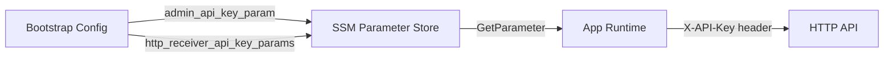
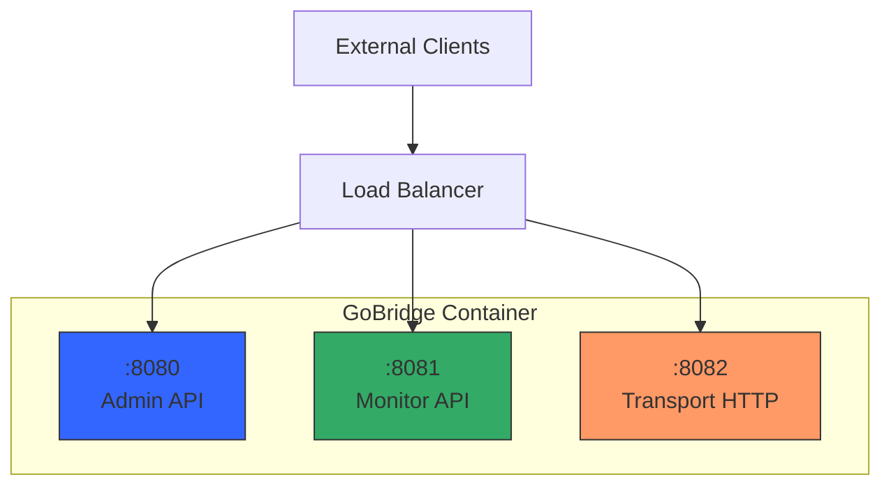

# Deployment Guide

This guide covers deployment considerations for GoBridge regardless of the
target platform. Whether you deploy on AWS, GCP, Kubernetes, or bare metal,
the topics here apply universally: deployment topology, configuration delivery,
secret management, networking, health checks, observability, and scaling.

For cloud-specific guidance, see the [What's Next](#whats-next) section at the
end.

## Deployment Models

GoBridge supports two deployment modes set via `bridge.deployment_mode`:

- **`standalone`** -- A single logical bridge instance. One or more replicas
  share the same bridge identity but do not coordinate with each other beyond
  what the backing stores provide.
- **`clustered`** -- Multiple instances with lease-based coordination, shared
  outbox draining, and session exclusivity. Requires distributed store
  backends (DynamoDB or equivalent).

Within these modes, the **topology** field in the bootstrap config controls how
replicas discover and share configuration:

| Criteria | `single` | `filesystem_replicated` |
|----------|----------|-------------------------|
| Replicas | 1 | N (shared config file) |
| Config coordination | N/A | File-based poll watcher |
| `shared_outbox` routes | Supported | Not supported (use DynamoDB profile) |
| Session lease coordination | Supported | Not supported (use DynamoDB profile) |
| Best for | Dev, low-throughput | Scale-out without DynamoDB |

### Choosing a Topology

Use `single` when you run exactly one replica or during development. Use
`filesystem_replicated` when you want horizontal scale-out with a shared
filesystem (e.g., EFS, NFS, GlusterFS) and do not need durable outbox or
lease coordination. For full high-availability with outbox and lease support,
use the `clustered` deployment mode with DynamoDB-backed stores instead.

```yaml
bridge:
  id: my-bridge
  deployment_mode: standalone   # or "clustered"
  shutdown_timeout: 30s
  # Scaled drain formula (preferred). Legacy drain_timeout is retained
  # for backward compatibility.
  per_record_drain_timeout: 3s
  max_drain_timeout: 30s
```

## Configuration Delivery

GoBridge separates **bootstrap configuration** (deployment-level settings) from
**bridge configuration** (routes, sessions, transports). The bootstrap config
tells the runtime where to find the bridge config and how to resolve secrets.

### Three Delivery Methods

1. **Mounted file** -- Write a bootstrap JSON file to the container filesystem
   and set `GOBRIDGE_FILEBASED_BOOTSTRAP_FILE` to its path. This is the
   recommended approach for container orchestrators that support config
   volumes (ECS task definitions, Kubernetes ConfigMaps).

2. **Inline environment variable** -- Set `GOBRIDGE_FILEBASED_BOOTSTRAP_JSON`
   to the full JSON content. Useful for small configs in environments where
   file mounts are awkward.

3. **Remote config store** -- Use the DynamoDB config loader or a custom
   `config.Loader` implementation. The bridge config is fetched from a
   remote store at startup and watched for changes.

### Bootstrap Config Fields

```yaml
bridge_id: my-bridge
config_file_path: /mnt/gobridge/bridge.yaml
admin_api_key_param: /gobridge/admin-key
poll_interval: 5s
node_role: control
topology: single
```

| Field | Required | Default | Description |
|-------|----------|---------|-------------|
| `bridge_id` | Yes | -- | Unique bridge identifier |
| `config_file_path` | Yes | -- | Path to the bridge YAML/JSON config file |
| `admin_api_key_param` | Yes | -- | SSM parameter path for the admin API key |
| `monitor_api_key_param` | No | -- | SSM parameter path for the monitor API key |
| `poll_interval` | No | `1s` | Config file poll interval |
| `node_role` | No | `control` | `control` or `worker` |
| `topology` | No | `single` | `single` or `filesystem_replicated` |
| `admin_addr` | No | `:8080` | Admin server listen address |
| `monitor_addr` | No | `:8081` | Monitor server listen address |
| `transport_http_addr` | No | `:8082` | Transport HTTP server listen address |

### Poll vs Notify

The bridge config file watcher supports two modes configured via the
`config_watch` section in the bridge config:

| Mode | Mechanism | Best for |
|------|-----------|----------|
| `notify` | Filesystem events (fsnotify), debounced | Local disks, fast change detection |
| `poll` | Periodic SHA-256 content comparison | NFS, network mounts, containers |

We recommend `poll` mode for container deployments where the config file
lives on a network filesystem (EFS, NFS). Use `notify` for local disk or
development setups where low-latency reload matters.

```yaml
config_watch:
  mode: poll
  poll_interval: 30s
```

## Secret Management

GoBridge resolves secrets at startup through the credential URI system. The
bootstrap config references SSM Parameter Store paths; the runtime fetches
the actual values before building the bridge.

### Credential Flow



### What Gets Resolved

1. **Admin API key** -- The `admin_api_key_param` field points to an SSM
   `SecureString` parameter. The runtime reads this at startup and uses it
   to authenticate admin API requests.

2. **Monitor API key** -- Optional. When `monitor_api_key_param` is set, it
   provides a separate key for the monitor API. Otherwise, the admin key is
   used for both.

3. **HTTP receiver/sender API keys** -- The `http_receiver_api_key_params`
   and `http_sender_api_key_params` maps associate receiver/sender IDs with
   SSM parameter paths. These are resolved and injected into the transport
   options before the runtime builds.

4. **Transport credentials** -- Sessions, receivers, and senders can specify
   a `credentials_uri` in their options. The `pms://` scheme resolves
   credentials from SSM Parameter Store; the `file://` scheme reads from
   disk. See [Credentials & HTTP API](credentials-and-http-api.md) for
   the full credential URI reference.

### Bootstrap Config Example with Secrets

```json
{
  "bridge_id": "production",
  "config_file_path": "/mnt/efs/bridge.yaml",
  "admin_api_key_param": "/gobridge/prod/admin-key",
  "monitor_api_key_param": "/gobridge/prod/monitor-key",
  "http_receiver_api_key_params": {
    "http-in": "/gobridge/prod/receiver/http-in-key"
  },
  "poll_interval": "5s",
  "topology": "single"
}
```

## Networking and Ports

GoBridge runs three independent HTTP servers on separate ports. This
separation enables fine-grained network policies: management traffic stays
internal while transport traffic can be selectively exposed.

### Port Architecture



### Port Reference

| Port | Server | Auth | Purpose | Expose externally? |
|------|--------|------|---------|--------------------|
| `:8080` | Admin | `X-API-Key` (required) | Config CRUD, health, runtime status | No (internal only) |
| `:8081` | Monitor | `X-API-Key` (optional) | Metrics, Prometheus scrape, health probes | Internal or monitoring VPC |
| `:8082` | Transport HTTP | Per-receiver `api_key` | Message ingress/egress | Depends on use case |

### Network Policy Recommendations

- **Admin API** -- Restrict to internal networks only. This server exposes
  config management, bridge start/stop, and DLQ operations. Never expose it
  to the public internet.

- **Monitor API** -- Allow access from your monitoring infrastructure.
  Health probes (`/api/v1/monitor/health`, `/api/v1/monitor/live`,
  `/api/v1/monitor/ready`) are unauthenticated so load balancers and
  orchestrators can use them directly.

- **Transport HTTP** -- Expose only when you use HTTP receivers or SSE
  senders. Place behind a load balancer with TLS termination. Each
  receiver/sender has its own API key for authentication.

## Health Checks and Graceful Shutdown

GoBridge provides health, liveness, and readiness probes on the monitor
server, plus configurable shutdown behavior for clean container lifecycle
management.

### Health Endpoints

All health endpoints live on the monitor server (default `:8081`) and are
**unauthenticated** so orchestrators can probe them without credentials.

| Endpoint | Purpose | Healthy | Unhealthy |
|----------|---------|---------|-----------|
| `GET /api/v1/monitor/health` | Overall health | 200 `{"status":"ok"}` | 503 `{"status":"unhealthy"}` |
| `GET /api/v1/monitor/live` | Liveness probe | 200 `{"status":"alive"}` | Always 200 |
| `GET /api/v1/monitor/ready` | Readiness probe | 200 `{"status":"ready"}` | 503 `{"error":"not ready"}` |

The `health` endpoint checks runtime state, session connectivity, and route
health. The `live` endpoint always returns 200 -- it confirms the process is
running. The bare `ready` endpoint returns 200 once the runtime is started
and healthy; it does **not** guarantee transport sessions are connected or
subscriptions acknowledged. Gate production traffic with the `?level=`
parameter described under "Readiness levels" below.

### Shutdown Timeouts

```yaml
bridge:
  shutdown_timeout: 30s
  # Scaled drain formula (preferred in production). The per-batch
  # ceiling is min(batchCount * per_record_drain_timeout,
  # max_drain_timeout). Legacy drain_timeout remains for backward
  # compatibility; set either the new fields OR drain_timeout.
  per_record_drain_timeout: 3s
  max_drain_timeout: 30s
```

| Field | Default | Description |
|-------|---------|-------------|
| `shutdown_timeout` | `30s` | Total grace period for clean shutdown |
| `drain_timeout` | `30s` | Legacy fixed drain ceiling. Retained for backward compatibility; prefer the scaled fields. |
| `per_record_drain_timeout` | `3s` | Per-record budget in the scaled formula. |
| `max_drain_timeout` | `10s` | Absolute ceiling for the scaled formula. |

The shutdown sequence proceeds as follows:

1. **Signal received** -- The process catches `SIGINT` or `SIGTERM`.
2. **Stop accepting** -- Receivers stop accepting new messages.
3. **Drain in-flight** -- In-flight messages are given `drain_timeout` to
   complete processing and delivery.
4. **Close transports** -- Sessions and connections are closed gracefully.
5. **Shutdown HTTP** -- Admin, monitor, and transport HTTP servers shut down.
6. **Exit** -- The process exits with code 0.

If `drain_timeout` expires before all messages complete, remaining messages
are abandoned. Set `drain_timeout` shorter than `shutdown_timeout` to leave
headroom for transport and HTTP server cleanup.

### Container Orchestrator Integration

**ECS Task Definition:**

```json
{
  "healthCheck": {
    "command": ["CMD-SHELL", "curl -f http://localhost:8081/api/v1/monitor/health || exit 1"],
    "interval": 10,
    "timeout": 5,
    "retries": 3,
    "startPeriod": 30
  },
  "stopTimeout": 45
}
```

**Kubernetes Pod Spec:**

```yaml
livenessProbe:
  httpGet:
    path: /api/v1/monitor/live
    port: 8081
  initialDelaySeconds: 5
  periodSeconds: 10
readinessProbe:
  httpGet:
    path: /api/v1/monitor/ready?level=subscribed
    port: 8081
  initialDelaySeconds: 10
  periodSeconds: 5
terminationGracePeriodSeconds: 60
```

**Readiness levels.** The readiness probe accepts a `?level=` query
parameter that controls how strict the gate is. Bare
`/api/v1/monitor/ready` (no level) reports ready as soon as the runtime is
started and healthy -- *before* transport sessions connect or subscriptions
are acknowledged -- so a pod can be added to the Service endpoints while it
would still miss messages. Gate production traffic on a transport-level
check instead. Supported levels, least to most strict:

- `live` -- process is up and serving HTTP. Use for liveness, not readiness.
- `running` -- runtime started and healthy (the level bare `/ready`
  approximates).
- `connected` -- every session is currently connected to its broker; a
  per-session reconnect drops below this level (503) until the session
  reconnects.
- `subscribed` -- every subscription has been acknowledged by the broker,
  so the bridge will not miss messages. **Recommended for readiness
  gating** and used in the example above.
- `full` -- every route handler is registered and ready to dispatch; the
  strictest gate, suitable as a pre-traffic check on initial rollout.

The probe returns `200` once the runtime has reached the requested level and
`503` otherwise, so Kubernetes holds the pod out of rotation until it is
genuinely ready to carry traffic. An unknown level returns `400`.

Set the orchestrator's stop/termination timeout higher than `shutdown_timeout`
to give GoBridge enough time to drain before the orchestrator sends `SIGKILL`.

## Observability

GoBridge provides structured logging, metrics, and distributed tracing through
pluggable adapters. The runtime instruments message delivery automatically --
you only need to wire the exporters.

### Structured Logging

Use `slog` with the JSON handler for machine-parseable output. The
`observability.CorrelationHandler` wrapper automatically injects contextual
fields into every log record:

| Field | Source |
|-------|--------|
| `correlation_id` | `x-bridge.correlation-id` header (auto-generated if missing) |
| `trace_id` | W3C `traceparent` header |
| `span_id` | Active span from the tracer |

```go
jsonHandler := slog.NewJSONHandler(os.Stderr, &slog.HandlerOptions{
    Level: slog.LevelInfo,
})
logger := slog.New(observability.NewCorrelationHandler(jsonHandler))
```

We recommend `info` level for production and `debug` for staging. Set the
level via the `bridge.log_level` config field.

### Metrics Export

Two built-in adapters are available:

| Adapter | Package | Backend |
|---------|---------|---------|
| CloudWatch | `adapters/aws/metrics/cloudwatch` | AWS CloudWatch |
| OTLP | `adapters/otel/metrics` | Any OTLP-compatible collector |

The runtime emits metrics automatically when a `MetricsExporter` is
registered. Key metrics include `bridge.delivery.latency`,
`bridge.delivery.success`, `bridge.delivery.error`, `bridge.inflight`,
and `bridge.dlq.write`. See [Scenario 18: Observability](scenarios/18-observability.md)
for the full metrics table and Go bootstrap code.

### Distributed Tracing

The OTLP tracing adapter creates spans around each message delivery with
attributes for `route_id`, `envelope_id`, and `subject`. W3C `traceparent`
headers are propagated through the bridge. Use a sampling ratio of 0.1
(10%) in production to control costs.

### Recommended Alerts

| Alert | Condition | Severity |
|-------|-----------|----------|
| Bridge unhealthy | Health check failing > 1 min | Critical |
| High error rate | `MessagesFailed` / `MessagesProcessed` > 5% | High |
| DLQ growing | DLQ depth > 100 | High |
| Config reload failure | Reload rejected | Medium |
| Circuit breaker open | State = open > 5 min | Medium |

Configure these alerts in your monitoring system (CloudWatch Alarms, Grafana,
PagerDuty) using the metrics emitted by the bridge runtime.

## Scaling Considerations

### Concurrency Control

Each route has a `max_in_flight` setting (default: 100) that limits concurrent
message processing. This acts as a per-route backpressure mechanism:

```yaml
routes:
  - id: high-throughput
    receiver_id: sqs-in
    bindings: [to-mqtt]
    policy:
      max_in_flight: 500
```

Higher values increase throughput but consume more memory and CPU. Lower
values reduce resource usage but may cause backpressure on the source.

### CPU and Memory Sizing

| Workload | vCPU | Memory | `max_in_flight` |
|----------|------|--------|-----------------|
| Low (< 100 msg/s) | 0.25 | 512 MiB | 50-100 |
| Medium (100-1000 msg/s) | 0.5-1.0 | 1-2 GiB | 100-500 |
| High (> 1000 msg/s) | 2.0-4.0 | 4-8 GiB | 500-2000 |

These are starting points. Profile your workload with realistic message sizes
and processor chains to find the right balance.

### Horizontal Scaling

Add more replicas with `filesystem_replicated` topology when a single instance
cannot handle the throughput. Each replica processes messages independently
from the shared config file:

```yaml
# Bootstrap config for each replica
topology: filesystem_replicated
config_file_path: /mnt/shared/bridge.yaml
poll_interval: 5s
```

When using SQS as the source, horizontal scaling works naturally -- each
replica pulls from the same queue and SQS handles message distribution. For
MQTT sources, use `$share/` topic prefixes to distribute messages across
replicas.

### Vertical Scaling

Increase CPU and memory allocation for higher throughput per instance. This
is simpler than horizontal scaling and avoids coordination overhead. We
recommend vertical scaling first, then horizontal when a single instance
reaches its limits.

### Delivery Mode Selection

| Mode | Behavior | Trade-off |
|------|----------|-----------|
| `direct_hold` | Source held open until egress completes | Lower latency, no durability guarantee |
| `shared_outbox` | Source ACKed after outbox persist | Higher latency, at-least-once durability |

Use `direct_hold` for low-latency scenarios where occasional message loss
on crash is acceptable. Use `shared_outbox` when durability matters -- the
outbox store persists messages before acknowledging the source, and the
drainer delivers them asynchronously.

## What's Next

| Guide | Description |
|-------|-------------|
| [AWS Deployment Guide](aws-deployment/overview.md) | ECS Fargate, EFS, SSM, CloudWatch, CDK constructs |
| GCP Deployment Guide | Cloud Run, GCS, Secret Manager (planned) |
| Bare-Metal Guide | Systemd, NGINX, manual TLS (planned) |

For bridge configuration, see:

| Document | Description |
|----------|-------------|
| [Configuration Overview](configuration-overview.md) | Lifecycle, sources, layered config |
| [Configuration Reference](configuration-reference.md) | Every config field documented |
| [Transport Configuration](transport-configuration.md) | MQTT, SQS, Azure SB, HTTP options |
| [Processors & Stores](processors-and-stores.md) | Filter, transform, circuit breaker, store backends |
| [Credentials & HTTP API](credentials-and-http-api.md) | Credential URIs and admin API endpoints |
| [Scenarios](scenarios/) | Progressive walkthroughs from simple to clustered |
