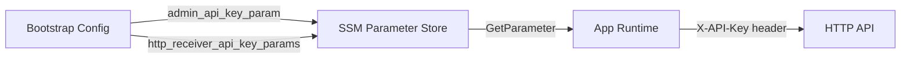
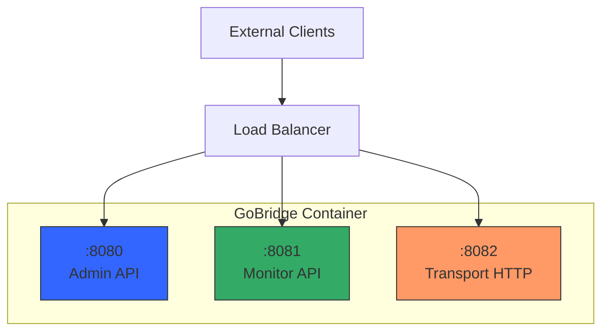

# Deployment Guide

This guide covers deployment topology, configuration delivery, secret management,
networking, health checks, observability, and scaling. The concepts apply
wherever you run GoBridge; the concrete artifact differs by how you build it. For
cloud-specific guidance, see [What's Next](#whats-next).

> **The shipped container image is the AWS file-based deployment profile, not a
> platform-neutral image.** The image (published by digest at the first command
> release — see [Pin Images by Digest](container-deployment.md#pin-images-by-digest)) runs
> `deployment/aws-filebased-config` and is bound to AWS. It **requires** SSM to
> resolve secrets — `admin_api_key_param` is mandatory
> (`deployment/aws-filebased-config/lib/model/bootstrap.go`), the SSM
> resolver runs at startup (`deployment/aws-filebased-config/lib/bootstrap/secrets.go`),
> and it builds a DynamoDB client unconditionally
> (`deployment/aws-filebased-config/lib/bootstrap/app.go`). To run on a
> non-AWS platform — plain Kubernetes, bare metal, another cloud — build your own
> composition-root binary using `cmd/gobridge/main.go` as the template and
> register the transports, stores, and secret sources you need. The GoBridge core
> and library are portable; the stock image is AWS-bound.

## Reference Binary and Composition Root

The reference `cmd/gobridge` binary is intentionally minimal. Its composition
root registers the `mqtt` transport and the native `memory` and `sqlite` store
factories, and **zero processors** (the `reg.Register` and
`sup.RegisterStoreFactory` calls in `cmd/gobridge/main.go`). Processor
plugins (tenant, filter, transform) and most other transports and stores (SQS,
Azure Service Bus, AMQP, DynamoDB) live in separate Go modules so the core stays
dependency-light; the HTTP transport ships in the root module but is likewise
unregistered by the reference binary.

A config that references a processor, a non-`mqtt` transport, or a `dynamodb`
store therefore fails against the shipped binary -- the factory is not
registered. To use those, build your own composition root (`main.go`) that
registers the plugins you need before starting the supervisor:

- `sup.RegisterTransport(name, factory)` -- transports (e.g. SQS)
- `sup.RegisterStoreFactory(name, factory)` -- stores (e.g. DynamoDB)
- `sup.RegisterProcessor(name, processor)` -- processors (tenant / filter / transform)

`cmd/gobridge/main.go` carries commented examples for the AWS transport and store
factories. See [PLUGIN.md](../PLUGIN.md) for the registration recipe.

The reference binary takes these flags:

| Flag | Default | Description |
|------|---------|-------------|
| `-config` | `bridge.yaml` | Path to the configuration file |
| `-log-level` | `info` | Log level; an unrecognised value is rejected |
| `-credentials-dir` | `credentials` | Base directory backing `file://` credential URIs |
| `-start-empty` | `true` | Start with an empty configuration when `-config` does not exist. Set `false` to refuse to boot a bridge that would carry no routes -- a mistyped path or an unmounted volume then fails the process instead of quietly transporting nothing. |

Starting empty is a real, supported state, but a limited one: the empty
configuration defines no `http` block, and this composition root binds its HTTP
listeners once at startup, so a process that started empty serves **no admin
API and no health probes**. Create the configuration file to converge the
routes -- the watcher watches the directory, so file creation is picked up --
and restart the process to bring up the HTTP listeners.

## Deployment Models

GoBridge supports two deployment modes set via `bridge.deployment_mode`:

- **`standalone`** -- A single logical bridge instance. One or more replicas
  share the same bridge identity but do not coordinate with each other beyond
  what the backing stores provide.
- **`clustered`** -- Multiple instances with lease-based coordination, shared
  outbox draining, and session exclusivity. Requires distributed store
  backends (DynamoDB or equivalent).

Within these modes, the **topology** field in the bootstrap config controls how
replicas discover and share configuration:

| Criteria | `single` | `filesystem_replicated` |
|----------|----------|-------------------------|
| Replicas | 1 | N (shared config file) |
| Config coordination | N/A | File-based poll watcher |
| `shared_outbox` routes | Supported | Not supported (use DynamoDB profile) |
| Session lease coordination | Supported | Not supported (use DynamoDB profile) |
| Best for | Dev, low-throughput | Scale-out without DynamoDB |

### Choosing a Topology

Use `single` when you run exactly one replica or during development. Use
`filesystem_replicated` when you want horizontal scale-out with a shared
filesystem (e.g., EFS, NFS, GlusterFS) and do not need durable outbox or
lease coordination. For full high-availability with outbox and lease support,
use the `clustered` deployment mode with DynamoDB-backed stores instead.

```yaml
bridge:
  id: my-bridge
  deployment_mode: standalone   # or "clustered"
  shutdown_timeout: 45s   # process shutdown budget
  drain_timeout: 30s      # runtime drain ceiling, keep below shutdown_timeout
  # Outbox drain batch ceiling.
  per_record_drain_timeout: 3s
  max_drain_timeout: 20s
```

## Configuration Delivery

GoBridge separates **bootstrap configuration** (deployment-level settings) from
**bridge configuration** (routes, sessions, transports). The bootstrap config
tells the runtime where to find the bridge config and how to resolve secrets.

### Three Delivery Methods

1. **Mounted file** -- Write a bootstrap JSON file to the container filesystem
   and set `GOBRIDGE_FILEBASED_BOOTSTRAP_FILE` to its path. This is the
   recommended approach for container orchestrators that support config
   volumes (ECS task definitions, Kubernetes ConfigMaps).

2. **Inline environment variable** -- Set `GOBRIDGE_FILEBASED_BOOTSTRAP_JSON`
   to the full JSON content. Useful for small configs in environments where
   file mounts are awkward.

3. **Remote config store** -- Use the DynamoDB config loader or a custom
   `ports.Loader` implementation. The bridge config is fetched from a
   remote store at startup and watched for changes.

### Bootstrap Config Fields

The bootstrap loader reads **JSON** (from `GOBRIDGE_FILEBASED_BOOTSTRAP_JSON`
or the file named by `GOBRIDGE_FILEBASED_BOOTSTRAP_FILE`) — it is not YAML:

```json
{
  "bridge_id": "my-bridge",
  "config_file_path": "/var/lib/gobridge/bridge.yaml",
  "admin_api_key_param": "/gobridge/admin-key",
  "poll_interval": "5s",
  "node_role": "control",
  "topology": "single"
}
```

| Field | Required | Default | Description |
|-------|----------|---------|-------------|
| `bridge_id` | Yes | -- | Unique bridge identifier |
| `config_file_path` | Yes | -- | Path to the bridge YAML/JSON config file |
| `admin_api_key_param` | Yes | -- | SSM parameter path for the admin API key |
| `monitor_api_key_param` | No | -- | SSM parameter path for the monitor API key |
| `poll_interval` | No | `1s` | Config file poll interval |
| `node_role` | No | `control` | `control` or `worker`. Also selects the admin config single-writer posture — see [Admin Config Transactions and the Single-Writer Posture](#admin-config-transactions-and-the-single-writer-posture) |
| `topology` | No | `single` | `single` or `filesystem_replicated` |
| `admin_addr` | No | `:8080` | Admin server listen address |
| `monitor_addr` | No | `:8081` | Monitor server listen address |
| `transport_http_addr` | No | `:8082` | Transport HTTP server listen address |

### Poll vs Notify

The bridge config file watcher supports two modes configured via the
`config_watch` section in the bridge config:

| Mode | Mechanism | Best for |
|------|-----------|----------|
| `notify` | Hybrid: filesystem events (fsnotify) on the containing directory, debounced, plus a periodic hash-resync backstop (30s default) | Local disks and Kubernetes ConfigMap volume mounts, fast change detection |
| `poll` | Periodic SHA-256 content comparison | NFS/EFS, network mounts, `subPath` mounts |

`notify` mode is safe for Kubernetes ConfigMap volume mounts: the watcher sees
the atomic `..data` symlink swap, and the hash-resync backstop catches anything
fsnotify misses (see [Kubernetes ConfigMap Config](container-deployment.md#kubernetes-configmap-config)).
Keep `poll` mode for network filesystems (EFS, NFS) and `subPath` mounts, which
do not deliver reliable inotify events.

```yaml
config_watch:
  mode: poll
  poll_interval: 30s
```

### Config-file writes must be atomic

> **Pre-deploy checklist item.** Any process that writes the watched bridge
> config file — a deploy script, a templating tool (Helm, Jsonnet, `envsubst`),
> or a CI job — MUST write atomically: render to a temporary file in the same
> directory, then `rename` it over the target. Never truncate-and-rewrite the
> file in place.

The watcher can read a truncated in-place write mid-flight. A partial-but-valid
document — one that parses with only `bridge.id` and no routes — swaps live and
**stops forwarding traffic while `/health` and `/ready` stay green**. Validation
checks `bridge.id` first and the graph validator permits an empty route graph
(`config/validate.go`, `validate.ValidateBlueprintGraph`), so the runtime
loads the empty config as valid and logs no error. `rename` is atomic, so the
watcher only ever sees the complete old or complete new file.

GoBridge's own writer already renames; this requirement is only for external
writers. See [External config writers must write atomically](runbooks/external-config-atomic-writes.md)
for the failure mode and the fix.

### Admin Config Transactions and the Single-Writer Posture

The admin API supports **config transactions** (`/api/v1/admin/config/transactions`)
that **durably** rewrite the bridge config on commit. The file-based profile's
config store is a `parser.FileStore` over the shared EFS volume, which is
**non-CAS** (it has no atomic compare-and-swap `SaveIfVersion`). On a non-CAS
store, two admin instances that both read version *N* could each pass the
read-time version guard and clobber each other's acknowledged commit (a silent
lost update). To prevent that, the admin server **fails closed**: a durable
commit is **refused with HTTP 500** unless the process asserts it is the **sole
durable writer** of the store (`httpapi.Config.ConfigSingleWriter = true`).

The bootstrap App derives that assertion from **`node_role`**:

| `node_role` | Single-writer asserted? | Config-txn commit |
|-------------|-------------------------|-------------------|
| `control` (and the default) | Yes | Permitted — this node owns the RW config store and is the only admin writer |
| `worker` | No | Refused (fail closed) — a worker mounts EFS read-only and is not a durable writer |

This is correct for both reference topologies: `GoBridgeSingle` is a single
task, and `GoBridgeCluster` forces the **control** service to `DesiredCount=1`
(workers mount EFS read-only), so exactly one node is ever the config writer.

**When you need a CAS config store instead.** If you build a genuine
**multi-writer** deployment — more than one node accepting admin config
transactions against the same shared backend concurrently — asserting
single-writer would be unsafe. Such a deployment MUST wire a
`ports.ConditionalConfigStore` (compare-and-swap) config store instead, which
serializes concurrent commits safely regardless of the single-writer flag. The
bundled `parser.FileStore` is **not** CAS today, so multi-writer config-txn
commits remain refused on the file-based profile — keep to the single control
writer, or supply a CAS store.

## Secret Management

GoBridge resolves secrets at startup through the credential URI system. The
bootstrap config references SSM Parameter Store paths; the runtime fetches
the actual values before building the bridge.

### Credential Flow



### What Gets Resolved

1. **Admin API key** -- `admin_api_key_param` points to an SSM `SecureString`
   read at startup to authenticate admin API requests.
2. **Monitor API key** -- Optional `monitor_api_key_param` gives the monitor
   API a separate key; otherwise the admin key covers both.
3. **HTTP receiver/sender API keys** -- `http_receiver_api_key_params` and
   `http_sender_api_key_params` map receiver/sender IDs to SSM paths, resolved
   into the transport options before the runtime builds.
4. **Transport credentials** -- A `credentials_uri` in session/receiver/sender
   options resolves from SSM (`pms://`) or disk (`file://`). The `file://` store
   tolerates read-only/immutable mounts, so a Kubernetes Secret mounted
   read-only does not crash-loop it -- see the
   [Kubernetes secret-mount cookbook](scenarios/22-k8s-secret-mount-credentials.md).
   Rotation cadence and live-connection behavior:
   [Credentials & HTTP API](credentials-and-http-api.md) and
   [Credential Rotation](credentials-rotation.md).

### Bootstrap Config Example with Secrets

```json
{
  "bridge_id": "production",
  "config_file_path": "/var/lib/gobridge/bridge.yaml",
  "admin_api_key_param": "/gobridge/prod/admin-key",
  "monitor_api_key_param": "/gobridge/prod/monitor-key",
  "http_receiver_api_key_params": {
    "http-in": "/gobridge/prod/receiver/http-in-key"
  },
  "poll_interval": "5s",
  "topology": "single"
}
```

## Networking and Ports

GoBridge runs three independent HTTP servers on separate ports, so network
policies can keep management traffic internal while exposing transport traffic.

### Port Architecture



### Port Reference

| Port | Server | Auth | Purpose | Expose externally? |
|------|--------|------|---------|--------------------|
| `:8080` | Admin | `X-API-Key` (required) | Config CRUD, health, runtime status | No (internal only) |
| `:8081` | Monitor | `X-API-Key` (optional) | Metrics, Prometheus scrape, health probes | Internal or monitoring VPC |
| `:8082` | Transport HTTP | Per-receiver `api_key` | Message ingress/egress | Depends on use case |

### Network Policy Recommendations

- **Admin API** -- Restrict to internal networks only. This server exposes
  config management, bridge start/stop, and DLQ operations. Never expose it
  to the public internet.

- **Monitor API** -- Allow access from your monitoring infrastructure.
  Health probes (`/api/v1/monitor/health`, `/api/v1/monitor/live`,
  `/api/v1/monitor/ready`) are unauthenticated so load balancers and
  orchestrators can use them directly.

- **Transport HTTP** -- Expose only when you use HTTP receivers or SSE
  senders. Place behind a load balancer with TLS termination. Each
  receiver/sender has its own API key for authentication.

## Health, Shutdown, and Containers

Probes, the shutdown sequence and its budgets are in
[Health Checks and Graceful Shutdown](health-and-shutdown.md). Image pinning,
orchestrator integration and building your own image are in
[Container and Orchestrator Deployment](container-deployment.md).

## Observability

GoBridge provides structured logging, metrics, and distributed tracing through
pluggable adapters. The runtime instruments message delivery automatically --
you only need to wire the exporters.

### Structured Logging

Use `slog` with the JSON handler for machine-parseable output. The
`observability.CorrelationHandler` wrapper automatically injects contextual
fields into every log record:

| Field | Source |
|-------|--------|
| `correlation_id` | `x-bridge.correlation-id` header (auto-generated if missing) |
| `trace_id` | Active span's W3C trace-id when the tracer exposes `ports.SpanIdentity` (OTel); upstream `traceparent` fallback |
| `span_id` | Active span's W3C span-id (same capability); upstream `traceparent` fallback |

The cross-hop log join key `x-bridge.correlation-id` resets per hop unless the
downstream receiver's route sets `trust_bridge_headers: true` (ingress strips
and re-generates it otherwise).

```go
jsonHandler := slog.NewJSONHandler(os.Stderr, &slog.HandlerOptions{
    Level: slog.LevelInfo,
})
logger := slog.New(observability.NewCorrelationHandler(jsonHandler))
```

We recommend `info` level for production and `debug` for staging, set via `bridge.log_level`.

### Metrics Export

Two built-in adapters are available:

| Adapter | Package | Backend |
|---------|---------|---------|
| CloudWatch | `adapters/aws/metrics/cloudwatch` | AWS CloudWatch |
| OTLP | `adapters/otel/metrics` | Any OTLP-compatible collector |

> **The shipped AWS file-based image accepts only `noop` or `cloudwatch` for its
> `metrics_exporter`** — those are the sole values its bootstrap wires
> (`deployment/aws-filebased-config/lib/bootstrap/metrics.go`), and any other
> value is rejected at startup. **OTLP requires a custom composition root** that
> registers `adapters/otel/metrics`; it is not reachable from the stock image.

The runtime emits metrics automatically when a `MetricsExporter` is
registered. Key metrics include `DeliveryE2ELatency`, `MessagesReceived`,
`MessagesSent`, `RouteErrors`, `DLQEntries`, and `OutboxDepth`. See
[Scenario 18: Observability](scenarios/18-observability.md)
for the full metrics table and Go bootstrap code.

### Distributed Tracing

The runtime creates a `bridge.handleDelivery` span around each message delivery
with attributes for `route_id`, `envelope_id`, and (when an ingress
`traceparent` is present) `trace_id`; W3C `traceparent` headers propagate
through the bridge. Use a sampling ratio of 0.1 (10%) in production to control
costs.

### Recommended Alerts

| Alert | Condition | Severity |
|-------|-----------|----------|
| Bridge unhealthy | Health check failing > 1 min | Critical |
| High error rate | `RouteErrors` / `MessagesReceived` > 5% | High |
| DLQ growing | `DLQEntries` sum > 100 | High |
| Config reload failure | Reload rejected | Medium |
| Circuit breaker open | State = open > 5 min | Medium |

Configure these alerts in your monitoring system (CloudWatch Alarms, Grafana,
PagerDuty) using the metrics emitted by the bridge runtime. For consumers not
using the CDK constructs, the programmatic path is
`cloudwatch.EnsureAlarms(ctx, client, cloudwatch.DefaultAlarms(ns, snsTopic))`
alongside an exporter constructed with
`WithRollupMetrics(DefaultRollupMetrics()...)` and the **same namespace** --
see [Monitoring](aws-deployment/monitoring.md). Which alarms the shipped CDK
bundle provisions for each deployment shape, which ones `DefaultAlarms()`
provisions instead, and which ones you must author yourself are listed in
[CloudWatch alarms](aws-deployment/alarms.md) — together with the rollup
metrics every built-in alarm depends on to match a series at all.

Sizing, concurrency, and horizontal-scale guidance is on its own page: [Scaling a GoBridge deployment](deployment-scaling.md).

## What's Next

| Guide | Description |
|-------|-------------|
| [AWS Deployment Guide](aws-deployment/overview.md) | ECS Fargate, EFS, SSM, CloudWatch, CDK constructs |
| GCP Deployment Guide | Cloud Run, GCS, Secret Manager (planned) |
| Bare-Metal Guide | Systemd, NGINX, manual TLS (planned) |

For bridge configuration, see:

| Document | Description |
|----------|-------------|
| [Configuration Overview](configuration-overview.md) | Lifecycle, sources, layered config |
| [Configuration Reference](configuration-reference.md) | Every config field documented |
| [Transport Configuration](transport-configuration.md) | MQTT, SQS, Azure SB, HTTP options |
| [Processors & Stores](processors-and-stores.md) | Filter, transform, circuit breaker, store backends |
| [Credentials & HTTP API](credentials-and-http-api.md) | Credential URIs and admin API endpoints |
| [Scenarios](scenarios/) | Progressive walkthroughs from simple to clustered |
| [Runbooks](runbooks/) | Symptom-first incident runbooks and upgrade/rollback procedures |
