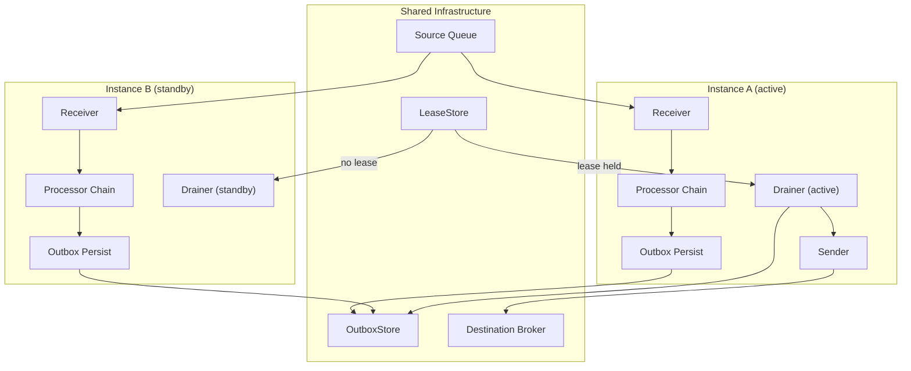
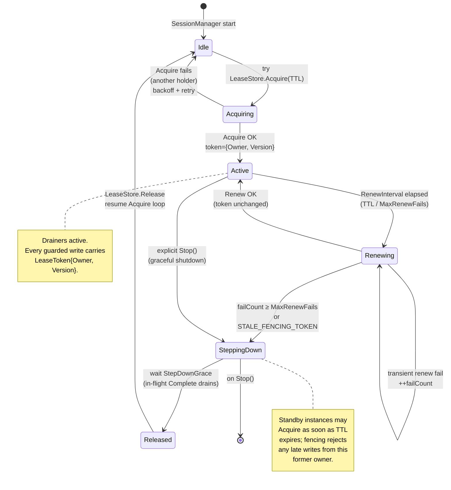

# Headers, error classification and clustered deployment

## 14. Headers

### Reserved Prefix

All headers with the `x-bridge.` prefix are reserved for bridge-internal use. Transport adapters **must** strip these headers from external sources at ingress to prevent header injection attacks.

### Well-Known Headers

| Header | Purpose |
|---|---|
| `x-bridge.correlation-id` | End-to-end correlation across services |
| `x-bridge.causation-id` | Identifies the direct cause of this message |
| `x-bridge.idempotency-key` | Deduplication key for idempotent processing |
| `x-bridge.content-type` | Payload content type |
| `x-bridge.source-id` | Originating receiver identifier |
| `x-bridge.route-id` | Route that processed this message |
| `x-bridge.ordering-key` | Key for ordered delivery guarantees |
| `x-bridge.dedup-id` | Transport-level deduplication identifier |
| `x-bridge.tenant-id` | Tenant identifier for multi-tenant routing |
| `x-bridge.route-override` | Dynamic route override |
| `traceparent` | W3C Trace Context propagation |
| `tracestate` | W3C Trace Context vendor-specific state |

### Header Utilities

- `IsReservedHeader(key)` -- checks the `x-bridge.` prefix.
- `StripReservedHeaders(headers)` -- returns a copy with all reserved headers removed.
- `MergeHeaders(base, overlay, protectReserved)` -- merges header maps with optional reserved-key protection.
- `GetHeaderString(headers, key)` / `SetHeader(headers, key, value)` -- typed accessors.

---

## 15. Error Classification

All errors in the bridge pipeline are structured as `shared.BridgeError` with an `ErrorClass` that drives routing decisions.

### Error Classes

| Class | Behavior | Example |
|---|---|---|
| `Transient` | Retriable -- may succeed on retry | Connection lost, timeout, throttled |
| `Permanent` | Not retriable -- retry will not help | Not authorized, invalid config |
| `Expired` | Message TTL exceeded | Stale message past ExpiresAt |
| `Rejected` | Payload-level rejection | Payload too large, filtered, schema violation |

### Error Codes

**Recoverable (transient):** `TIMEOUT`, `CONNECTION_LOST`, `UNAVAILABLE`, `THROTTLED`, `BROKER_BUSY`, `TEMPORARY_AUTH_FAILURE`

**Permanent (not retriable; DLQ per route `FailureAction`):** `NOT_AUTHORIZED`, `FORBIDDEN`, `NOT_FOUND`, `INVALID_CONFIG`, `PROTOCOL_ERROR`, `QOS_NOT_SUPPORTED`

**Rejected (payload-level; dropped without DLQ):** `INVALID_PAYLOAD`, `PAYLOAD_TOO_LARGE`, `INVALID_TOPIC`, `SCHEMA_VIOLATION`, `MESSAGE_FILTERED`

**Expired (per route `ExpiredAction`):** `MESSAGE_EXPIRED`

**Infrastructure / fencing:** `NOT_SUPPORTED`, `VERSION_MISMATCH`, `ALREADY_EXISTS`, `STALE_FENCING_TOKEN`, `DUPLICATE_RECORD`

### Special Sentinels

| Sentinel | Behavior |
|---|---|
| `ErrMessageFiltered` | Ack without DLQ -- the message was intentionally dropped by a filter processor |
| `ErrUnavailable.WithRetryAfter(d)` | Circuit breaker open -- includes a retry delay hint for the caller |

### Error API

```go
// Classification
be, ok := shared.AsBridgeError(err)
recoverable := shared.IsRecoverableError(err)
retryDelay := shared.GetRetryAfter(err)

// Construction and chaining
err := shared.ErrTimeout.Wrap(cause).With("queue_url", url)
err := shared.ErrUnavailable.WithRetryAfter(30 * time.Second)
```

Unknown error types (non-`BridgeError`) are treated as recoverable by default, ensuring safe retry behavior when interfacing with third-party code.

---

## 16. Clustered Deployment

GoBridge supports multi-instance clustered deployment for high availability. The clustering model uses lease-based coordination via a shared `LeaseStore` (typically DynamoDB) to ensure single-active ownership of outbox drain operations.

### Deployment Model



All instances run all routes identically. The `LeaseStore` determines which instance's `OutboxDrainer` actively drains and sends. The active instance holds the lease; standby instances persist to the outbox but do not drain until they acquire the lease.

### Cluster Reconfiguration: Rollout Modes

A live config change on a clustered deployment is governed by
`bridge.cluster.rollout`. The default is the safe one; each step up trades
operational cost for zero-downtime changes. Every mode refuses the same set of
changes that cannot be applied live at all (store identity, deployment shape,
exclusive-session identity) and names the reason; those still need the
whole-cohort replacement in
[docs/runbooks/cluster-config-rollout.md](../runbooks/cluster-config-rollout.md).

| `rollout` | Behaviour | Where it is wired |
|---|---|---|
| `refuse` (the default when unset) | A clustered node rejects every non-no-op live reload, fail-closed; the running runtime and `config_version` are unchanged. Changes are rolled by whole-cohort replacement with ingress quiesced (ADR 0012). | Every composition root. |
| `independent` | Every member applies a live-safe delta on its own, with no barrier and no vote, exactly as a standalone bridge does. For a bounded window one member runs the new generation while another is still on the old one; a member that cannot build the change is a broken member to replace, not a veto. | Every composition root. |
| `coordinated` | The rollout barrier of ADR 0013: propose, per-member vote, store-atomic commit, per-member apply with bounded retry, and a convergence window published in deep health and the `ClusterRollout*` metrics. Requires a fixed `members` roster and a rollout store. Adding `confirm_window` makes every commit provisional and reverts the whole cohort if convergence never lands (ADR 0014). | The shipped AWS profile wires the rollout store only in its static member-slot shape (`GoBridgeDynamoDBHA` with `MemberSlots`), where each member runs as its own single-task ECS service with a restart-stable `member_id`. The autoscaled worker shape rejects `coordinated` at synth time because interchangeable tasks cannot carry a stable identity. |

The barrier is atomic BEFORE the commit and per-member AFTER it: applying is
local work that can fail on one member and succeed on another, so a mixed cohort
during the convergence window is a bounded, alarmed state rather than a
violation (ADR 0013, "What the barrier guarantees, precisely").
`WithAllowDestructiveReload` cannot bypass any of this: discarding local backlog
is not cluster consensus. The plain-language guide is
[docs/cluster/README.md](../cluster/README.md); the protocol lives under
[docs/cluster/spec/](../cluster/spec/).

### Instance Identity

Each runtime instance is assigned a unique identifier used as the lease owner ID:

- **Default (recommended):** Auto-generated 128-bit cryptographically random hex string via `crypto/rand`. Collision probability is astronomically small (~2^-64 for birthday attack at 2^32 instances).
- **Static:** Set via `WithInstanceID("my-id")` or `bridge.id` in config.

> **Important:** When using static instance IDs (e.g. for log correlation or operational clarity), each instance in the cluster **must** have a unique ID. Duplicate instance IDs cause two instances to claim the same lease owner identity, breaking fencing guarantees. The runtime does not validate uniqueness at startup. Use deployment-specific mechanisms (hostname, pod name, task ARN) to ensure uniqueness.

### Lease Lifecycle

The `SessionManager` manages the lease lifecycle for exclusive sessions:

1. **Acquire** -- Attempt to acquire the lease with the configured TTL (default 360s).
2. **Renew** -- Periodically renew with fencing token validation (default interval: TTL / MaxRenewFails).
3. **Step-down** -- After MaxRenewFails consecutive failures: clear lease ownership, wait StepDownGrace for in-flight completions, then release.
4. **Re-acquire** -- After step-down, loop back to acquire and resume on success.

The lease fencing token (monotonically increasing version) propagates through the entire outbox lifecycle: `Claim` and `Complete` operations validate the token, preventing stale owners from sending duplicates.



Transitions are driven by the `Clock` (renew tick, grace timer) and by
`LeaseStore` outcomes. The state machine is identical for every
exclusive session; multiple sessions on one instance run independent
state machines but share the same `Clock` source. See
[`runtime/cluster/`](../../runtime/) for the implementation and
`shared.ErrCodeStaleFencingToken` for the fencing-failure surface.

### Timeout Alignment

All clustered timing parameters are derived from `LeaseTTL` to avoid dead zones:

| Parameter | Default | Derivation |
|---|---|---|
| `LeaseTTL` | 360s | Base parameter; network-interruption tolerance |
| `RenewInterval` | 120s | `LeaseTTL / MaxRenewFails` (auto-derived when 0) |
| `RenewJitter` | 5s | Proportional to interval |
| `MaxRenewFails` | 3 | Consecutive failures before step-down |
| `StepDownGrace` | 15s | Grace for in-flight I/O completions |
| `staleClaimAge` | ~30s | `max(StepDownGrace) + 15s` (injected by builder) |

### Readiness and Role

The HTTP readiness probe (`/api/v1/monitor/ready`) returns a `role` field indicating the instance's operational state:

| Role | Meaning |
|---|---|
| `standalone` | No exclusive sessions configured; instance operates independently |
| `active` | At least one exclusive session holds the lease; drainers are active |
| `standby` | Exclusive sessions configured but no lease held; waiting to take over |

The bare probe (no `?level=`) requires the `full` readiness level, and a `standby` instance is capped at `subscribed` by design — it holds no lease and dispatches nothing — so the bare probe answers HTTP 503 for a standby. Use `?level=connected` or `?level=subscribed` for a standby-tolerant probe and the bare probe (or `?level=full`) as the pre-traffic gate. `/api/v1/monitor/deephealth` reports the same `role`. The vocabulary is exported as `ports.RoleActive`, `ports.RoleStandby` and `ports.RoleStandalone`.

### Design Trade-offs

The following are inherent characteristics of the chosen design, not bugs to be fixed:

**Failover Window** -- The failover window equals `LeaseTTL` (default 360s). This is fundamental to any lease-based system without active heartbeats. The 360s default prioritizes network-interruption tolerance over fast failover. Reducing the TTL increases store write costs and risk of spurious failovers under transient network issues.

**No Route Distribution** -- All instances run all routes identically. The system uses per-session lease fencing rather than route sharding. This simplifies deployment (every instance is identical) at the cost of redundant ingress work on standby instances.

**Standby Ingress Work** -- Standby instances poll, process, persist to outbox, and ack source deliveries -- all before the drainer (which is lease-gated) can drain. This is a direct consequence of the identical-instance design. A lease-aware receiver that pauses ingress on standby would add significant complexity and coupling between the ingress and lease layers.

**Single Backing Store** -- DynamoDB (or equivalent) is the sole distributed backing store for lease, outbox, and DLQ. DynamoDB's 99.999% availability SLA with global tables makes this a reasonable infrastructure choice. Adding a fallback store would require dual-write consistency, which is harder than the problem it solves.
