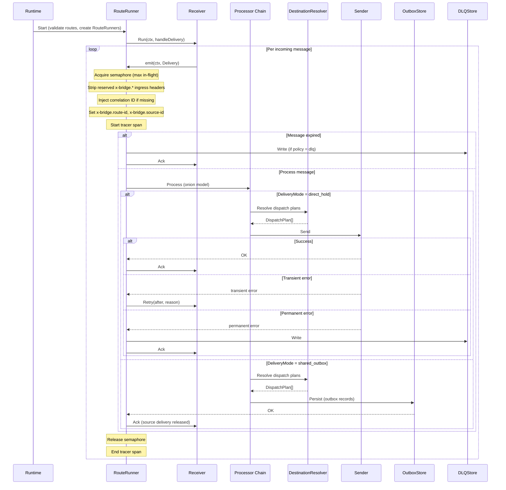
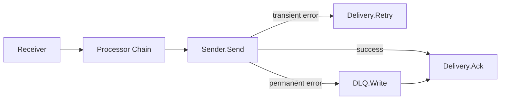
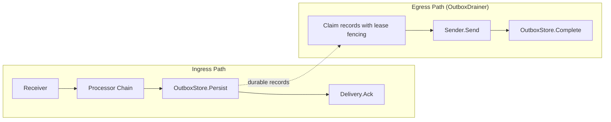
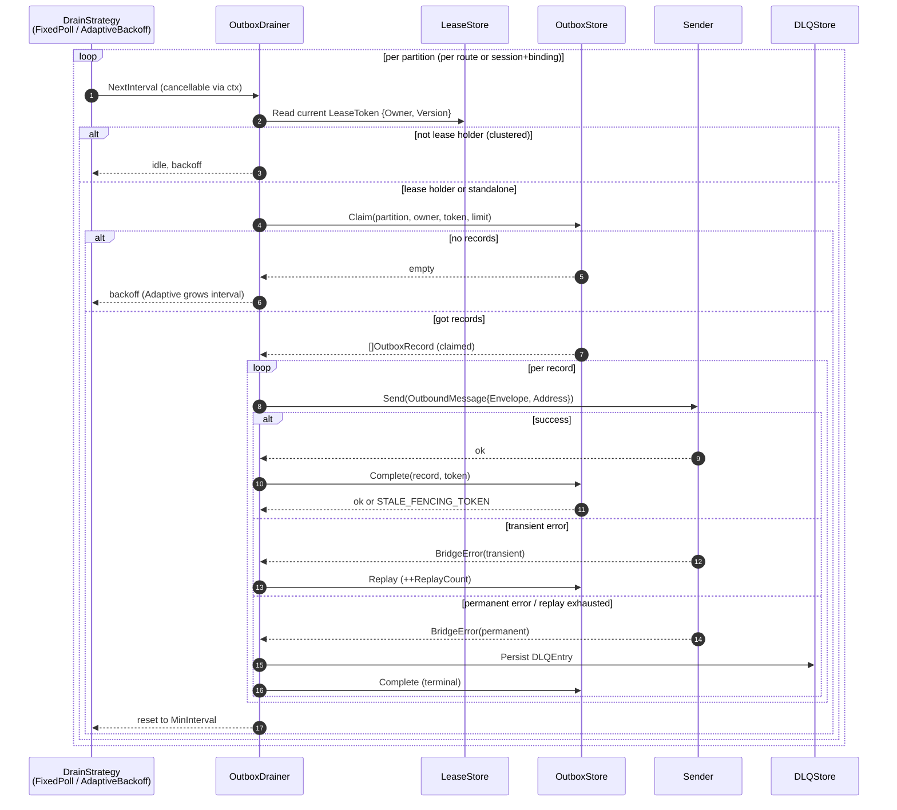
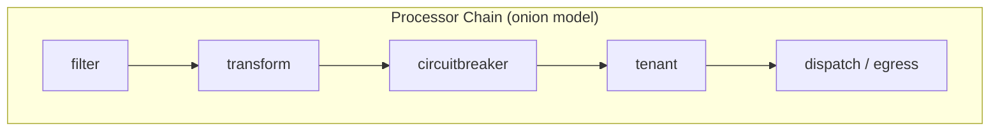

# Message flow, delivery modes and processors

## 3. Core Concepts

### Envelope

The normalized message unit flowing through the bridge. A pure value type defined in `domain/`.

| Field | Type | Description |
|---|---|---|
| `ID` | `string` | Unique message identifier |
| `Subject` | `string` | Logical event subject. Producer-supplied, never mutated by the runtime to inject a destination. Free-form and transport-agnostic. |
| `Payload` | `[]byte` | Raw message body |
| `Headers` | `map[string]any` | Metadata key-value pairs |
| `CreatedAt` | `time.Time` | Envelope creation timestamp |
| `ExpiresAt` | `time.Time` | Optional TTL expiry timestamp |

Methods: `Clone()` (deep-copy mutable headers and share immutable payload backing), `Payload()` (copy on exposure), `SetPayload()` (install new backing on transformation), `IsExpired()`, `HasExpiry()`, `RemainingTTL()`. `NewEnvelope` clones caller-provided payload at the trust boundary; only `NewEnvelopeFromImmutablePayload` may adopt backing from a trusted SDK that guarantees lifetime and immutability.

### Delivery

A source-owned unit of work wrapping an `Envelope` plus transport-native acknowledgement semantics. Transport adapters implement the `Delivery` interface to map these operations to protocol-specific commands.

| Method | Signature | Purpose |
|---|---|---|
| `Envelope()` | `*messaging.Envelope` | Access the wrapped envelope |
| `Ack(ctx)` | `error` | Acknowledge successful processing |
| `Retry(ctx, after, reason)` | `error` | Request redelivery after a delay (e.g. SQS `ChangeMessageVisibility`) |
| `Extend(ctx, until)` | `error` | Extend processing deadline (e.g. SQS visibility extension) |

### Receiver

Reads deliveries from a transport. The `Run` method blocks until the context is cancelled or an unrecoverable error occurs.

```go
type Receiver interface {
    Run(ctx context.Context, emit func(context.Context, Delivery) error) error
}
```

### Sender / BatchSender

Egress interfaces for submitting envelopes to a transport. Senders receive an `OutboundMessage` so the transport destination is carried independently of the envelope.

```go
type OutboundMessage struct {
    Envelope *messaging.Envelope
    Address  string // transport destination from DispatchPlan.Address
}

type Sender interface {
    Send(ctx context.Context, msg OutboundMessage) error
}

type BatchResult struct {
    Index int   // index into the input slice
    Err   error // nil on success
}

type BatchSender interface {
    Sender
    SendBatch(ctx context.Context, msgs []OutboundMessage) ([]BatchResult, error)
}
```

`OutboundMessage.Address` is the resolved per-message destination (publish topic, routing key, queue URL, ...). `Envelope.Subject` is the logical event subject and is never overwritten with the destination — see [§ Subject vs. Address](#subject-vs-address).

`SendBatch` returns one `BatchResult` per input message (index-aligned) once the batch is dispatched; callers count successes as the nil-`Err` results. A non-nil top-level error is reserved for whole-batch failures — client/connection setup, or fail-fast pre-validation that rejects the entire batch before any dispatch — in which case it returns `(nil, err)` and nothing was sent.

### Session

Stateful transport connection lifecycle management for protocols that maintain long-lived connections (e.g. MQTT). Stateless transports (SQS, Azure Service Bus) do not use sessions.

| Method | Purpose |
|---|---|
| `Start(ctx)` | Establish the connection |
| `Reconcile(ctx, SessionPlan)` | Converge subscriptions/publishers to desired state |
| `Health(ctx)` | Report current connection health |
| `Events()` | Channel of lifecycle events (connected, disconnected, reconnecting, error) |
| `Close(ctx)` | Graceful shutdown |

The MQTT adapter composes an adapter-owned predecode ingress guard at the final
`net.Conn` boundary after TLS/WebSocket decryption and before
`paho.NewClient`. The guard buffers at most one advertised-maximum wire packet,
validates Remaining Length before allocation, checks raw PUBLISH structure
before the SDK can materialize decoded objects, and truncates a User Property
list beyond one entry above the retained cap on the raw bytes, so a legal packet
cannot make the SDK decode tens of thousands of properties before the publish
callback refuses it. Writes, deadlines, close operations, addresses, partial
reads, and non-PUBLISH bytes retain `net.Conn` behavior. A typed secret-safe
violation — malformed structure, or a packet above the advertised maximum — is
latched by the existing terminal session transition before the connection
fails, so autopaho's `OnConnectionDown` observes terminal state and does not
start a reconnect storm. The local caps a compliant broker cannot enforce are
left to the publish callback, which acks-and-drops the packet.

### Route

A message route from a receiver through a processor chain to one or more sender bindings. Configured via `config.RouteDef` with: `receiver_id`, `delivery_mode`, `dispatch_mode`, `policy`, `bindings`, `processors`.

### RoutePolicy

Per-route behavior configuration:

| Field | Type | Description |
|---|---|---|
| `MaxInFlight` | `int` | Concurrency limit (default: 100) |
| `Backoff` | `BackoffPolicy` | Retry backoff: initial interval, max interval, multiplier |
| `DeliveryMode` | `DeliveryMode` | `direct_hold` or `shared_outbox` |
| `DispatchMode` | `DispatchMode` | `single` or `fan_out` |
| `AckAfter` | `AckBoundary` | `target_accept` or `outbox_persist` |
| `OnExpired` | `ExpiredAction` | `drop` or `dlq` |
| `OnPermanentFailure` | `FailureAction` | `drop` or `dlq` |
| `MaxReplayAttempts` | `int` | Max DLQ replay retries (default: 5) |
| `MaxOutboxDepth` | `int` | Backpressure limit (default: 10,000) |

### Binding

A concrete egress destination referencing a sender and address:

| Field | Description |
|---|---|
| `ID` | Binding identifier |
| `SenderID` | Reference to a configured sender |
| `SessionID` | Optional session for stateful transports |
| `Address` | Target address (queue URL, topic, etc.) |

### DestinationResolver

Optional runtime egress binding selection. Returns one or more `DispatchPlan` values per envelope. The default resolver uses static bindings from configuration.

```go
type DestinationResolver interface {
    Resolve(ctx context.Context, env *messaging.Envelope) ([]routing.DispatchPlan, error)
}
```

### Subject vs. Address

Two concepts are deliberately kept separate end-to-end:

- **`Envelope.Subject`** — the logical event subject. Set by the producer (or by an ingress mapping rule) and **never** mutated by the runtime to inject a destination. It is the value that filters, tenant rules, and downstream consumers reason about.
- **`DispatchPlan.Address`** (carried over the wire as **`ports.OutboundMessage.Address`**) — the transport destination chosen for one envelope at egress time: a publish topic, an AMQP routing key, a queue URL, an SSE channel, etc.

Runtime invariants:

- The runtime never writes the dispatch address into `env.Subject`. Both `direct_hold` and `shared_outbox` paths build an outbound envelope copy with the route's merged dispatch headers and pass the address out-of-band on `OutboundMessage.Address`.
- The shared-outbox store persists `OutboxRecord.Address` as a separate column from `OutboxRecord.Envelope.Subject`. Drainers read the address from the record, not from the persisted envelope.
- Egress hook events and DLQ entries record the outbound address as a distinct field; the `Envelope.Subject` they expose remains the logical event subject.

Per-transport carriers for the logical subject:

| Transport | Outbound destination from `OutboundMessage.Address` | Logical subject on the wire | Ingress mapping into `Envelope.Subject` |
|-----------|------------------------------------------------------|-----------------------------|------------------------------------------|
| MQTT | Publish topic (or sender `default_topic` when address is empty). Never derived from `Envelope.Subject`. | MQTT user property `gobridge.subject` | The `gobridge.subject` user property. The actual publish topic is preserved in `Headers["mqtt.topic"]`. |
| AMQP 0-9-1 | Routing key. The per-dispatch `Address` **wins**; the configured `routing_key` is only the fallback used when `Address` is empty. Never derived from `Envelope.Subject`. | AMQP header `gobridge.subject` | The `gobridge.subject` AMQP header. The broker's `Delivery.RoutingKey` is preserved in `Headers["amqp091.routing-key"]`. |
| AMQP 1.0 | Validated against the configured sender link address (empty allowed; mismatch fails fast). | `Message.Properties.Subject` | `Message.Properties.Subject` only — no fallback from the link address. |
| SQS | Sender-state today; reserved for dynamic queue selection. FIFO `MessageDeduplicationId` hashes the logical subject only, never the destination. | `Subject` message attribute | `Subject` message attribute only — no fallback from the queue URL/name. |
| Azure Service Bus | Sender-state today; reserved for dynamic entity selection. | `Message.Subject` | `Message.Subject` only — no fallback from the queue/topic name. |
| HTTP / SSE | Path is sender-state. | JSON field `subject` | JSON field `subject`. |

The `gobridge.subject` carrier is an explicit, application-visible name. The reserved `x-bridge.*` prefix is **not** used as the cross-transport subject carrier.

---

## 4. Message Flow



### Step-by-Step

1. **Runtime.Start** validates all configured routes and creates a `RouteRunner` for each.
2. **RouteRunner.Run** calls `receiver.Run(ctx, handleDelivery)`, which blocks and emits deliveries.
3. **handleDelivery** processes each message:
   - Acquires the concurrency semaphore (max in-flight control).
   - Strips reserved `x-bridge.*` headers from ingress to prevent injection.
   - Injects `x-bridge.correlation-id` if missing; sets `x-bridge.route-id` and `x-bridge.source-id`.
   - Starts a tracer span for the delivery.
   - Checks message expiry. If expired: routes to DLQ or drops per policy, then acks.
   - Runs the processor chain (onion/middleware model).
   - Dispatches based on delivery mode:
     - **direct_hold**: Resolves dispatch plans, builds an `OutboundMessage{Envelope: copy, Address: plan.Address}` with merged dispatch headers, calls `Sender.Send`. The source `Envelope.Subject` is left untouched. On success: ack. On transient error: retry with backoff. On permanent error: DLQ then ack.
     - **shared_outbox**: Resolves dispatch plans, persists outbox records that carry `OutboxRecord.Address` separately from the embedded envelope, then acks the source delivery. A separate `OutboxDrainer` reconstructs the `OutboundMessage` from the record and dispatches it.

---

## 5. Delivery Modes

### DirectHold

The source delivery is held open until egress completes. The runtime maintains end-to-end backpressure between the source transport and the target transport.



- **Ack** on successful egress send.
- **Retry** on transient error with backoff (e.g. SQS `ChangeMessageVisibility` delay).
- **DLQ + Ack** on permanent error (message cannot be retried).

### SharedOutbox

The source delivery is acknowledged after persisting to the outbox store, decoupling ingress from egress. This provides durability guarantees at the cost of eventual delivery.



The `OutboxDrainer` loop:

1. Claims pending outbox records with lease fencing (single-active ownership: two cluster members cannot both durably claim or complete the same record — at-least-once delivery, not duplicate-send elimination).
2. Sends each record via the appropriate `Sender`.
3. Marks records as completed on success.
4. Supports clustering via `LeaseStore` for single-active ownership of outbox partitions.

The detailed drainer cycle (claim → send → complete, with adaptive
back-off when the partition is empty) is:



Fencing is checked on every guarded write (`Claim`, `Complete`,
`Replay`) — a stale `LeaseToken.Version` is rejected with
`shared.ErrCodeStaleFencingToken` so two instances cannot drain the
same partition. See [§16 — Clustered Deployment](architecture-contracts-and-clustering.md#16-clustered-deployment)
for the lease state machine.

---

## 6. Processor Chain

Processors implement the onion/middleware pattern. Each processor wraps the next, forming a layered pipeline where cross-cutting concerns execute in order on the way in and in reverse on the way out.

```go
type ProcessorFunc func(ctx context.Context, env *messaging.Envelope) error

type Processor interface {
    Name() string
    Process(ctx context.Context, env *messaging.Envelope, next ProcessorFunc) error
}
```



### Built-in Processors

Each processor is a separate Go module under `processors/`.

| Processor | Module | Description |
|---|---|---|
| **filter** | `processors/filter` | Condition-based pass/drop/route with operators: `eq`, `ne`, `contains`, `regex`, `gt`, `lt`, `exists`, `in`. Returns `ErrMessageFiltered` on drop (ack without DLQ). |
| **transform** | `processors/transform` | JSON field mapping with JSONPath expressions, type coercion, and default values. |
| **circuitbreaker** | `processors/circuitbreaker` | Per-key state machine (`closed` -> `open` -> `half-open` -> `closed`). Returns `ErrUnavailable.WithRetryAfter()` when the circuit is open. |
| **tenant** | `processors/tenant` | Header-based tenant extraction, validation via `TenantValidator` port, optional usage tracking. |

---
