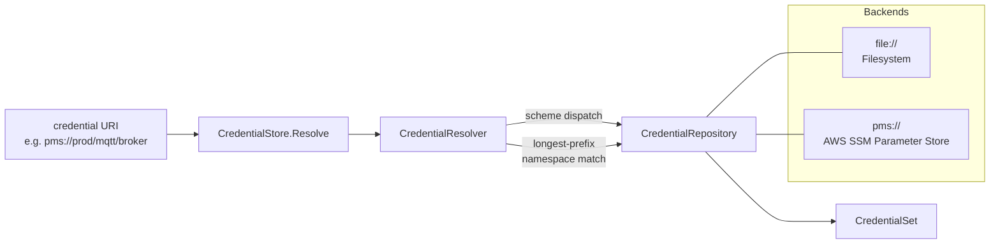

# HTTP API, observability, credentials and module layout

## 10. HTTP API

Two HTTP servers expose operational and management interfaces.

> **Machine-readable spec:** the OpenAPI 3.x contracts live under [`spec/httpapi/`](../../spec/httpapi/) — [`http-api.yaml`](../../spec/httpapi/http-api.yaml) is the entry document, with shared schemas in [`components.yaml`](../../spec/httpapi/components.yaml) and the blueprint payload in [`config-components.yaml`](../../spec/httpapi/config-components.yaml). Tables below are an index; the YAML is authoritative for request/response shapes, status codes, and auth.

### Admin Server (default `:8080`)

All endpoints require authentication. Both tables below are checked against `spec/httpapi/http-api.yaml`.

| Method | Endpoint | Description |
|---|---|---|
| `GET` | `/api/v1/admin/bridge` | Instance info |
| `POST` | `/api/v1/admin/bridge/start` | Start the bridge (always a fresh runtime) |
| `POST` | `/api/v1/admin/bridge/stop` | Stop the bridge |
| `GET` | `/api/v1/admin/routes` | List configured routes |
| `POST` | `/api/v1/admin/routes/{routeID}/inject` | Inject a message into a route |
| `GET` | `/api/v1/admin/dlq` | DLQ summary |
| `GET` | `/api/v1/admin/dlq/messages` | Paginated DLQ entries |
| `GET` | `/api/v1/admin/dlq/messages/{id}` | One DLQ entry with its payload |
| `POST` | `/api/v1/admin/dlq/redrive` | Redrive DLQ entries by ID (inject, then delete; 207 on partial failure) |
| `POST` | `/api/v1/admin/dlq/delete` | Delete DLQ entries by ID |
| `POST` | `/api/v1/admin/dlq/delete-by-filter` | Delete DLQ entries by filter |
| `POST` | `/api/v1/admin/dlq/purge` | Purge the entire DLQ |
| `GET` | `/api/v1/admin/config` | Read the current configuration document |
| `POST` | `/api/v1/admin/config/transactions` | Open a config transaction |
| `GET` | `/api/v1/admin/config/transactions/{txnID}` | Read a config transaction |
| `PATCH` | `/api/v1/admin/config/transactions/{txnID}` | Stage a change on a transaction |
| `POST` | `/api/v1/admin/config/transactions/{txnID}/commit` | Commit a transaction |
| `DELETE` | `/api/v1/admin/config/transactions/{txnID}` | Roll back a transaction |

The config-transaction endpoints are registered only when the composition root wires a config transaction manager; see [docs/http-api.md](../http-api-admin.md#config-transactions).

### Monitor Server (default `:8081`)

Health endpoints are unauthenticated. Topology and operational endpoints require authentication.

| Method | Endpoint | Auth | Description |
|---|---|---|---|
| `GET` | `/api/v1/monitor/health` | No | Coarse health |
| `GET` | `/api/v1/monitor/live` | No | Liveness probe (503 once terminal) |
| `GET` | `/api/v1/monitor/ready` | No | Readiness probe; the bare form requires `full`, `?level=` selects the gate |
| `GET` | `/api/v1/monitor/topology` | Yes | Bridge topology graph |
| `GET` | `/api/v1/monitor/routes` | Yes | Route status and metrics |
| `GET` | `/api/v1/monitor/deephealth` | Yes | Sessions, routes, service level, role and rollout state |

### CORS

CORS is disabled by default. Wildcard `*` origin is rejected at startup to prevent misconfiguration.

---

## 11. Observability

Three orthogonal observability concerns are supported through port interfaces with pluggable implementations.

### Metrics

Defined by `ports.MetricsExporter` with four metric kinds:

| Kind | Method | Description |
|---|---|---|
| Counter | `Counter(name, value, tags...)` | Monotonically increasing count |
| Gauge | `Gauge(name, value, tags...)` | Point-in-time value |
| Histogram | `Histogram(name, value, tags...)` | Distribution of observations |
| Timer | `Timer(name, duration, tags...)` | Duration recording (stored as milliseconds) |

Implementations: OTel OTLP (`adapters/otel/metrics`), CloudWatch (`adapters/aws/metrics/cloudwatch`). Default: `NoopExporter`.

Standard metric dimensions use `shared.Tag` with well-known keys: `route_id`, `session_id`, `lease_id`, `partition`, `queue_url`, `category`.

### Tracing

Defined by `ports.Tracer` and `ports.Span`. The runtime starts spans around `handleDelivery` for each message processed.

```go
type Tracer interface {
    StartSpan(ctx context.Context, name string, attrs ...shared.Tag) (context.Context, Span)
}

type Span interface {
    End()
    SetError(err error)
    AddEvent(name string, attrs ...shared.Tag)
    SetAttributes(attrs ...shared.Tag)
}
```

Implementation: OTel OTLP (`adapters/otel/tracing`). Default: `NoopTracer`.

### Structured Logging

The `observability` package provides a `CorrelationHandler` that wraps any `slog.Handler` to inject contextual fields into every log record:

- `correlation_id` from `x-bridge.correlation-id`
- `trace_id` and `span_id` from W3C traceparent

Context helpers: `WithCorrelationID(ctx, id)`, `WithTraceID(ctx, id)`, `WithSpanID(ctx, id)` and corresponding getters.

### Trace Context

`messaging.TraceContext` supports W3C traceparent parsing and formatting:

- `ParseTraceparent(s)` -- parses `"00-<traceID>-<spanID>-<flags>"`
- `FormatTraceparent(tc)` -- formats back to W3C string
- `ExtractTraceContext(headers)` / `InjectTraceContext(headers, tc)` -- header-level operations

---

## 12. Credentials

URI-based credential resolution with scheme dispatch and namespace matching.



### Port Interfaces

| Interface | Purpose |
|---|---|
| `CredentialStore` | Facade: `Resolve(ctx, uri) (*CredentialSet, error)` |
| `CredentialRepository` | Per-backend adapter: `Scheme()`, `Namespace()`, `Get()` |

### Credential Types

Defined in `domain/`:

| Type | Fields | Description |
|---|---|---|
| `PasswordCredential` | `Username`, `Password` | Username/password authentication |
| `TLSMaterial` | `CertPEM`, `KeyPEM`, `CAPEMs`, `InsecureSkipVerify` | TLS certificate and key material |
| `CredentialSet` | `Password *PasswordCredential`, `TLS *TLSMaterial` | Composite container; a single URI resolution can yield both |

The `runtime.CredentialResolver` performs scheme-based dispatch with longest-prefix namespace matching and optional TTL cache. Credential values are intentionally excluded from `String` and `GoString` methods to prevent accidental log exposure.

---

## 13. Module Layout

```
gobridge/
├── domain/                              # Pure value types (innermost ring)
├── ports/                               # Port interfaces
│   └── storetest/                       # Conformance test suites
├── circuitbreaker/                      # Standalone circuit breaker state machine
├── logging/                             # Trace and debug log level utilities
├── observability/                       # Context helpers, slog handler
├── config/                              # Declarative config model
├── validate/                            # Config validation
├── runtime/                             # Route execution engine (orchestration)
│   ├── dlq/                             # Dead-letter-queue router
│   ├── cluster/                         # Route-ownership locator
│   ├── session/                         # Lease lifecycle + step-down
│   ├── outbox/                          # Shared-outbox Drainer + DepthCache
│   ├── route/                           # Per-route ingress pipeline + dispatch
│   └── credentials/                     # Pull→Push credential wrapper (used by bridge)
├── bridge/                              # Composition root (Builder)
├── httpapi/                             # Admin + monitor HTTP servers
├── adapters/
│   ├── mqtt/transport/paho/             # MQTT v5 (Paho/autopaho)
│   ├── aws/
│   │   ├── transport/sqs/               # AWS SQS
│   │   ├── store/                       # DynamoDB store factory
│   │   │   ├── dynamodblease/
│   │   │   ├── dynamodboutbox/
│   │   │   ├── dynamodbdlq/
│   │   │   └── dynamodbmanagedsubscriptions/
│   │   ├── credentials/ssm/            # AWS SSM credentials
│   │   ├── metrics/cloudwatch/          # CloudWatch metrics
│   │   ├── config/dynamodb/             # DynamoDB config loader
│   │   └── cluster/ecs/                # ECS cluster resolver
│   ├── azure/transport/servicebus/      # Azure Service Bus
│   ├── amqp/transport/amqp091/         # RabbitMQ (AMQP 0-9-1)
│   ├── amqp/transport/amqp10/          # AMQP 1.0 (Artemis, Solace, Qpid)
│   ├── http/transport/                  # HTTP POST ingress, SSE egress
│   ├── native/
│   │   ├── store/                       # Memory + SQLite store factory
│   │   │   ├── memorylease/
│   │   │   ├── memoryoutbox/
│   │   │   ├── memorydlq/
│   │   │   ├── sqliteoutbox/
│   │   │   ├── sqlitedlq/
│   │   │   └── sqlitemanagedsubscriptions/
│   │   ├── credentials/file/           # File-based credentials
│   │   ├── config/file/                # File config loader/watcher
│   │   └── cluster/                    # Native cluster resolver
│   └── otel/
│       ├── metrics/                     # OTel OTLP metrics
│       └── tracing/                     # OTel OTLP tracing
├── processors/
│   ├── filter/                          # Condition-based filtering
│   ├── transform/                       # JSON field mapping
│   ├── circuitbreaker/                  # Circuit breaker processor (wraps circuitbreaker/)
│   └── tenant/                          # Multi-tenant validation
├── cmd/gobridge/                        # Example binary
├── testutil/                            # Docker test helpers
│   ├── flocilocal/
│   ├── ddblocal/
│   ├── asblocal/
│   └── tlsgen/
└── tests/integration/                   # End-to-end tests
```

Each adapter and processor is a separate Go module within the `go.work` workspace. This ensures consumers only pull in the dependencies they need. For example, importing the SQS adapter brings in the AWS SDK, but the MQTT adapter does not.

---
