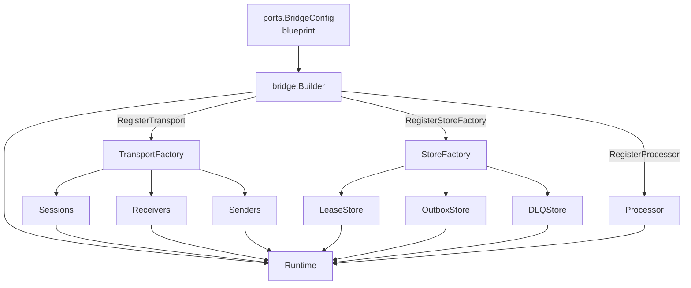
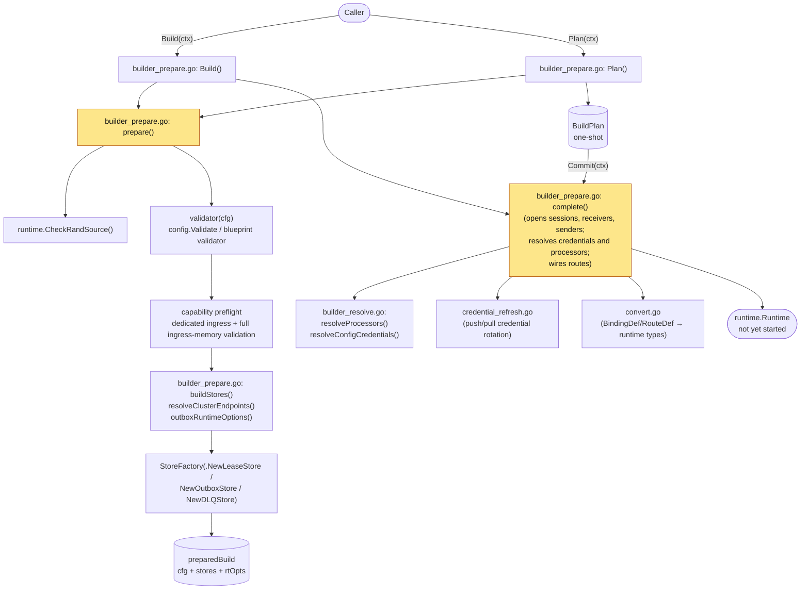

# Store abstractions, configuration model and composition root

## 7. Store Abstractions

Three store ports define the persistence contracts for the bridge runtime. All implementations must satisfy conformance test suites in `ports/storetest/`.

### LeaseStore

Distributed lease ownership for single-active scenarios. Implementations must use conditional writes to enforce fencing semantics.

```go
type LeaseStore interface {
    Acquire(ctx context.Context, leaseID string, ownerID string, ttl time.Duration, endpoints map[string]string) (persistence.LeaseToken, error)
    Renew(ctx context.Context, leaseID string, token persistence.LeaseToken, ttl time.Duration, endpoints map[string]string) (persistence.LeaseToken, error)
    Release(ctx context.Context, leaseID string, token persistence.LeaseToken) error
    Current(ctx context.Context, leaseID string) (persistence.LeaseInfo, error)
}
```

The `endpoints` parameter on `Acquire` and `Renew` stores the owner's reachable addresses alongside the lease record. Other instances retrieve these via `Current` to discover how to reach the lease owner for cluster-aware routing.

`LeaseToken` contains a monotonically increasing `Version` field that serves as a fencing token, preventing stale owners from continuing to operate after a lease transfer.

### OutboxStore

Durable outbox for reliable egress. All mutations that accept a `LeaseToken` must validate the fencing token and reject stale tokens atomically.

```go
type OutboxStore interface {
    Persist(ctx context.Context, records []*persistence.OutboxRecord) error
    Claim(ctx context.Context, partitionKey string, token persistence.LeaseToken, limit int) ([]*persistence.OutboxRecord, error)
    Complete(ctx context.Context, recordIDs []string, token persistence.LeaseToken) error
    Expire(ctx context.Context, before time.Time, partition string, token persistence.LeaseToken) (int, error)
    QueryPending(ctx context.Context, partitionKey string, limit int) ([]*persistence.OutboxRecord, error)
}
```

Outbox records are partitioned by session or binding identity via `persistence.OutboxPartitionKey()`.

`Expire` is a terminal, destructive transition of pending records, so it is fenced exactly like `Claim`: it is partition-scoped, it rejects a token below the partition's durable fencing high-water-mark with `shared.ErrStaleFencingToken`, and an accepted sweep raises that high-water-mark. The check and the transitions it authorises are atomic against a concurrent fence raise — one transaction on SQLite, the store-wide mutex on the memory backend, and a per-record `ConditionCheck` on the fence row for DynamoDB, which aborts the remainder of a sweep the moment a successor takes the partition. The advance matters because a drop-policy drainer sweeps expiry *before* its egress-readiness gate: on a partition whose egress never becomes ready, `Expire` is the only fencing call the drainer ever makes.

`Claim` enforces the **ordering-key head-of-line rule**: a record carrying `x-bridge.ordering-key` is claimable only when the partition holds no OLDER non-terminal record on the same key that the same `Claim` will not also return. Per-key order is durable, not per-batch — the drainer sequences same-key records inside one claimed batch, but it cannot see a sibling left `Claimed` by a previous cycle (a failed `Release`, an abandoned batch, a crashed owner), and claiming past that head delivers the younger message first with no error anywhere. A blocked record is not returned; it becomes claimable again the moment its head goes terminal or is released. Keyless records keep full concurrency. SQLite evaluates the rule in the claim `SELECT` against a denormalised `ordering_key` column; the memory store under its mutex; DynamoDB client-side over a `ConsistentRead` base-table scan, because a global secondary index cannot prove the absence of an older sibling (see [ADR 0005](../adr/0005-outbox-partition-claim-design.md)). The key is denormalised in every backend so a claim never unmarshals a record to read it.

`Claim` may also return a SHORT batch with a nil error. A backend that claims one record per remote transaction can fail after earlier records are durably claimed; those records belong to the caller and are excluded from `CountPending`, so returning them alongside an error strands them until the wall-clock stale window. Only `shared.ErrStaleFencingToken` still surfaces with no records — the owner has lost the partition and must stop.

Two OPTIONAL capabilities widen the port without breaking implementations that skip them: `OutboxReleaser` (return a transiently-failed claim to pending immediately) and the depth reporters `OutboxDepthReporter` / `OutboxClaimedDepthReporter` (pending and claimed counts behind `OutboxDepth` and `OutboxClaimedDepth`). The claimed count exists because `CountPending` excludes claimed rows, so work stranded by a failed release is otherwise invisible — the backlog gauge reads zero while messages sit undelivered.

### DLQStore

Dead-letter queue management for failed or rejected messages. The port is split into a read half and an administration half so that driving read adapters (the runtime read port, the monitor endpoints) cannot delete or purge; a store adapter implements both and thereby satisfies `DLQStore`.

```go
type DLQReader interface {
    Get(ctx context.Context, id string) (routing.DLQEntry, error)
    List(ctx context.Context, filter routing.DLQFilter) ([]routing.DLQEntry, error)
}

type DLQAdmin interface {
    Write(ctx context.Context, entry routing.DLQEntry) error
    Delete(ctx context.Context, ids []string) (int, error)
    DeleteByFilter(ctx context.Context, filter routing.DLQFilter) (int, error)
    Purge(ctx context.Context, before time.Time) (int, error)
}

type DLQStore interface {
    DLQReader
    DLQAdmin
}
```

A nil return from `Write` means the entry is crash-durable (see the crash-durable success boundary in `ports/stores.go`). `Write` is duplicate-safe: entry identity is DERIVED from the message and the delivery leg — `sha256(envelope ID, route, binding, source)` — not generated per write, so the same terminal event recorded twice (a DLQ write that landed followed by a failed source settle) collapses onto one row instead of accumulating duplicates. The store refuses the repeat; the router reports that refusal as durable success and counts `DLQDuplicateSuppressed`. `List` returns entries oldest-first (ascending `FailedAt`, entry ID as the tiebreaker) on every backend. The OPTIONAL `DLQDepthReporter` capability backs the `DLQDepth` gauge.

**Redrive is an admin-API sequence, not a store method.** `POST /api/v1/admin/dlq/redrive` runs `Get`, then `Runtime.InjectRedrive`, then `Delete` — in that order. The runtime re-issues the message under a FRESH envelope ID with a causation link to the original, strips the transport dedup key, the generated-identity marker and the source redelivery counter (each of which would let an idempotent transport swallow the replay or the replay ledger sink it), and confines the replay to the one binding that failed. The entry is deleted only after the inject is confirmed, so a failed or refused inject leaves the message and its evidence intact, and a crash between a confirmed inject and the delete re-drives the entry on the next attempt: redrive is **at-least-once** (ADR 0015, which supersedes the claim-by-delete design of ADR 0006).

### Implementations

| Store | Backend | Use Case |
|---|---|---|
| `memorylease`, `memoryoutbox`, `memorydlq` | In-memory | Testing and development |
| `sqliteoutbox`, `sqlitedlq`, `sqlitemanagedsubscriptions` | SQLite | Single-process production |
| `dynamodblease`, `dynamodboutbox`, `dynamodbdlq`, `dynamodbmanagedsubscriptions` | DynamoDB | Distributed production |

---

## 8. Configuration Model

Root type: `config.BridgeConfig` (YAML or JSON). The configuration model lives in the `config/` package and imports only `domain` types.

```yaml
bridge:
  id: my-bridge
  shutdown_timeout: 45s   # process shutdown budget on SIGTERM
  drain_timeout: 30s      # runtime drain ceiling, kept below it
  log_level: info

stores:
  # Development posture: every store is in-process and loses its contents on
  # restart, so each role's acknowledgement is required before it will build.
  lease:
    type: memory
    options:
      acknowledge_single_replica: true
  outbox:
    type: memory
    options:
      acknowledge_volatile: true
  dlq:
    type: memory
    options:
      acknowledge_volatile: true

sessions:
  - id: mqtt-session
    transport: mqtt
    options:
      session:
        broker_url: tcp://localhost:1883
        client_id: bridge-01

receivers:
  - id: mqtt-receiver
    transport: mqtt
    session_id: mqtt-session
    topics:
      - topic: "events/#"
        qos: 1

senders:
  - id: sqs-sender
    transport: sqs
    options:
      queue_url: https://sqs.us-west-1.amazonaws.com/123/my-queue

bindings:
  - id: to-sqs
    sender_id: sqs-sender
    address: my-queue

routes:
  - id: mqtt-to-sqs
    receiver_id: mqtt-receiver
    delivery_mode: direct_hold
    dispatch_mode: single
    bindings: [to-sqs]
    processors: [my-filter]
    policy:
      max_in_flight: 100
      on_permanent_failure: dlq

http:
  admin_addr: ":8080"
  monitor_addr: ":8081"
  admin_api_key: "secret-key"
```

### Configuration Sections

| Section | Purpose |
|---|---|
| `bridge` | Instance identity, shutdown behavior, log level |
| `stores` | Store backend selection for lease, outbox, and DLQ |
| `sessions` | Stateful transport connections (MQTT) |
| `receivers` | Ingress transport endpoints with subscription details |
| `senders` | Egress transport endpoints |
| `bindings` | Named egress destinations referencing senders |
| `routes` | Message routes: receiver -> processors -> bindings, with policy |
| `http` | Admin and monitor HTTP server addresses and authentication |

---

## 9. Composition Root (`bridge.Builder`)

The `bridge` package is the **library-mode composition root** that wires all components together. It is the only Layer-2 package allowed to bridge across layers (its Builder consumes `ports.BridgeConfig` and produces a `runtime.Runtime` from registered adapters).

There are two equivalent composition roots in the project:

| Entry point | Role | When to pick |
|---|---|---|
| [`cmd/gobridge`](../../cmd/) | YAML/JSON-driven binary entry point. Parses on-disk config, calls into `bridge.Builder`, manages process lifecycle. | Operating GoBridge as a standalone service. |
| [`bridge`](../../bridge/) | Library/programmatic entry point. Same wiring, exposed as a Go API. | Embedding GoBridge inside another Go process (tests, custom daemons, third-party hosts) where the host owns lifecycle, signals, and config sourcing. |

Both end at the same `runtime.Runtime`; the choice is purely about who owns the process. Adapter registration, credential resolution, and ordering of `Build → Start → Stop` are identical in either path.

```go
cfg, _ := config.ParseFile("bridge.yaml", config.FormatAuto)
rt, _ := bridge.NewBuilder(cfg).
    RegisterTransport("mqtt", mqttFactory).
    RegisterTransport("sqs", sqsFactory).
    RegisterStoreFactory("memory", memoryFactory).
    Build(ctx)
rt.Start(ctx)
```

### Builder Responsibilities

1. **Credential resolution** -- resolves credential URIs from session and transport config.
2. **Session creation** -- creates `Session` instances via `SessionFactory` for stateful transports.
3. **Receiver/Sender creation** -- creates ingress and egress instances via `ReceiverFactory` and `SenderFactory`.
4. **Store instantiation** -- creates `LeaseStore`, `OutboxStore`, and `DLQStore` via `StoreFactory`.
5. **Processor wiring** -- resolves processor references and builds the chain for each route.
6. **Runtime construction** -- assembles the `Runtime` with all resolved components.



#### Builder dispatch flow (Plan / Commit two-phase)

`bridge.Builder` exposes both a one-shot `Build(ctx)` and an explicit
two-phase `Plan(ctx)` → `Commit(ctx)` for hot-reload scenarios. Both
paths execute the same internal `prepare → complete` sequence; the
diagram below traces the dispatch through the `bridge/builder*.go`
files.



`Plan` returns a one-shot `BuildPlan` that captures the prepared
state; `Commit` is single-use (a second call returns an error) so
the supervisor's hot-reload state machine cannot accidentally
double-commit. `Build` is the same `prepare → complete` collapsed
into a single call.

Plugin `Config.Validate` runs while parsing. For MQTT, an omitted Receive
Maximum defers only the receive-dependent window decision so a deployment
profile can derive safe concurrency; explicit values still receive full
validation. Before any store or transport resource is opened, the Builder
always invokes `IngressMemoryConfig.ValidateIngressMemory` for every
ReceiverDef-backed session and every referenced Persistent/Exclusive session.
This second stage applies generic defaults or verifies the deployment-derived
profile with effective route concurrency. An unconsumed receiver is still
possible ingress because `sessionPlanFor` includes every ReceiverDef
subscription, while a durable session can resume stale broker backlog before
managed cleanup.

---
