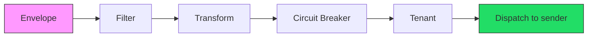
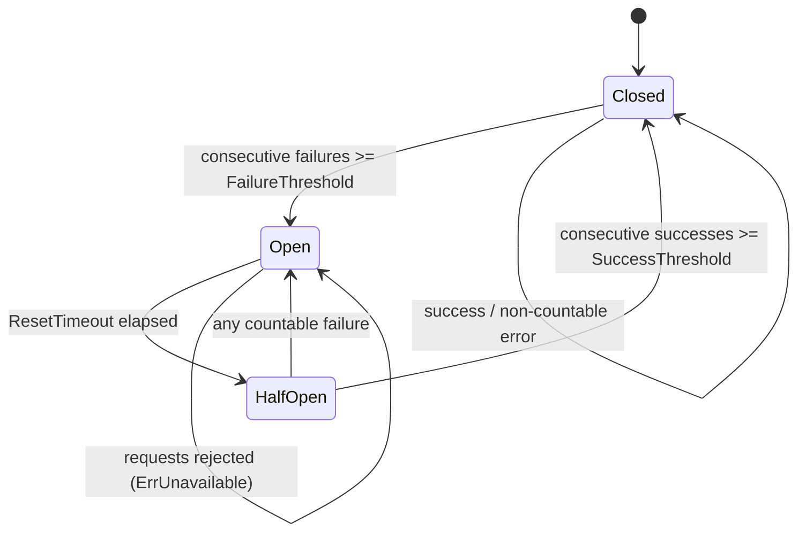

# Processors and Store Backends

This reference covers the GoBridge processor chain and the backing store
backends for lease coordination, outbox persistence, and dead-letter queuing.

## Processor Chain Overview

Processors are registered by name and referenced from route definitions:

```yaml
routes:
  - id: my-route
    processors: [my-filter, my-transform, my-cb, my-tenant]
```

Every processor implements `ports.Processor`:

```go
type ProcessorFunc func(ctx context.Context, env *domain.Envelope) error

type Processor interface {
    Name() string
    Process(ctx context.Context, env *domain.Envelope, next ProcessorFunc) error
}
```

Processors execute as an **onion model** -- each wraps the next and calls
`next(ctx, env)` to continue the chain. Omitting the `next` call stops the
message.



---

## Filter Processor

**Package:** `processors/filter` | **Config type:** `filter.Config`

Evaluates conditions against the envelope and applies an action: pass the
message through, drop it, or reroute it.

### Configuration Fields

| Field | Type | Required | Description |
|-------|------|----------|-------------|
| `Name` | `string` | No | Unique processor instance name. Defaults to `"filter"`. |
| `Conditions` | `[]Condition` | Yes | List of conditions to evaluate (AND logic). |
| `Action` | `Action` | Yes | One of `pass`, `drop`, `route`. |
| `RouteTo` | `string` | Only when `Action` is `route` | Target route ID for rerouting. |
| `Invert` | `bool` | No | Inverts the combined condition result. |

### Condition Fields

| Field | Type | Description |
|-------|------|-------------|
| `Field` | `string` | Field to match against (see patterns below). |
| `Operator` | `Operator` | Comparison operator. |
| `Value` | `any` | Comparison value. |

**Field patterns:**

- `subject` -- matches `Envelope.Subject`
- `header.<key>` -- matches `Envelope.Headers["<key>"]`
- `$.<path>` -- dot-path traversal into JSON `Envelope.Payload`
- bare name -- falls back to `Envelope.Headers` lookup

**Operators:** `eq`, `ne`, `contains`, `regex`, `gt`, `lt`, `gte`, `lte`,
`exists`, `in`

### YAML Example

```yaml
processors:
  my-filter:
    type: filter
    config:
      name: my-filter
      action: drop
      conditions:
        - field: header.x-env
          operator: eq
          value: staging
        - field: $.priority
          operator: lt
          value: 3
```

### Go Example

```go
proc, err := filter.New(filter.Config{
    Name: "my-filter",
    Action: filter.ActionDrop,
    Conditions: []filter.Condition{
        {Field: "header.x-env", Operator: filter.OperatorEquals, Value: "staging"},
        {Field: "$.priority", Operator: filter.OperatorLessThan, Value: 3},
    },
})

// Convenience constructors
drop, _ := filter.NewDropFilter("drop-staging", filter.Condition{...})
pass, _ := filter.NewPassFilter("only-prod", filter.Condition{...})
reroute, _ := filter.NewRouteFilter("reroute-high", "high-priority-route", filter.Condition{...})
```

---

## Transform Processor

**Package:** `processors/transform` | **Config type:** `transform.Config`

Reshapes JSON payloads using JSONPath extraction and field mappings.

### Configuration Fields

| Field | Type | Default | Description |
|-------|------|---------|-------------|
| `Name` | `string` | `"transform"` | Unique processor instance name. |
| `Mappings` | `[]FieldMapping` | -- | Field transformation rules (required). |
| `DropUnmapped` | `bool` | `false` | Drop fields not covered by mappings. |
| `FailOnError` | `bool` | `false` | Fail the message on any transform error. |

### FieldMapping Fields

| Field | Type | Description |
|-------|------|-------------|
| `Source` | `string` | JSONPath expression, e.g. `$.user.name` |
| `Target` | `string` | Target field in dot notation, e.g. `output.username` |
| `Transform` | `TransformType` | Type conversion (see below). Optional. |
| `DefaultValue` | `any` | Fallback value if source is not found. Optional. |
| `Required` | `bool` | Fail the message if this mapping cannot be resolved. |

**Transform types:** `string`, `int`, `float`, `bool`, `base64encode`,
`base64decode`

### YAML Example

```yaml
processors:
  my-transform:
    type: transform
    config:
      name: my-transform
      dropUnmapped: true
      failOnError: false
      mappings:
        - source: $.user.name
          target: username
          transform: string
        - source: $.user.age
          target: userAge
          transform: int
          defaultValue: 0
        - source: $.metadata.token
          target: auth.token
          transform: base64encode
          required: true
```

### Go Example

```go
proc, err := transform.New(transform.Config{
    Name:         "my-transform",
    DropUnmapped: true,
    Mappings: []transform.FieldMapping{
        transform.SimpleMapping("$.user.name", "username"),
        transform.TransformedMapping("$.user.age", "userAge", transform.TransformInt),
        {Source: "$.metadata.token", Target: "auth.token",
         Transform: transform.TransformBase64Encode, Required: true},
    },
})
```

When `DropUnmapped` is `false` (default), original payload fields are preserved
and mappings are applied on top. When `true`, only mapped fields appear in output.

---

## Circuit Breaker Processor

**Package:** `processors/circuitbreaker` | **Config type:** `circuitbreaker.Config`

Tracks downstream failures per key and short-circuits requests when a breaker
trips open, protecting the system from hammering a failing dependency.

### State Machine



### Configuration Fields

| Field | Type | Default | Description |
|-------|------|---------|-------------|
| `FailureThreshold` | `int` | `5` | Consecutive countable failures before opening. |
| `SuccessThreshold` | `int` | `2` | Consecutive successes in half-open to close. |
| `ResetTimeout` | `time.Duration` | `30s` | Time in open state before transitioning to half-open. |
| `HalfOpenMaxProbes` | `int` | `1` | Max concurrent probe requests allowed in half-open. |
| `CountError` | `ErrorClassifier` | counts transient errors | Function that returns true if an error should count toward the failure threshold. |

By default, only **transient (recoverable) errors** trip the breaker.
Permanent errors such as invalid payload or authentication failures are not
counted, preventing bad input from opening a breaker on a healthy dependency.

### Key Extraction Options

Circuit breakers are partitioned by key. The key extractor determines granularity:

| Option | Behavior |
|--------|----------|
| `WithKeyExtractor(GlobalKey)` | Single breaker for all messages (default). |
| `WithKeyExtractor(SubjectKey)` | Separate breaker per `Envelope.Subject`. |
| `WithKeyExtractor(HeaderKey("tenant-id"))` | Separate breaker per header value. |

### YAML Example

```yaml
processors:
  my-cb:
    type: circuitbreaker
    config:
      failureThreshold: 10
      successThreshold: 3
      resetTimeout: 60s
      halfOpenMaxProbes: 2
```

### Go Example

```go
proc := circuitbreaker.New("my-cb", circuitbreaker.Config{
    FailureThreshold:  10,
    SuccessThreshold:  3,
    ResetTimeout:      60 * time.Second,
    HalfOpenMaxProbes: 2,
},
    circuitbreaker.WithKeyExtractor(circuitbreaker.HeaderKey("tenant-id")),
    circuitbreaker.WithOnStateChange(func(key string, from, to circuitbreaker.State) {
        slog.Info("breaker state change", "key", key, "from", from, "to", to)
    }),
)
```

### Metrics

Retrieve per-key metrics at runtime via `proc.Metrics()`, which returns
`map[string]circuitbreaker.BreakerMetrics` with fields: `Key`, `State`,
`TotalRequests`, `TotalSuccesses`, `TotalFailures`, `ConsecutiveFailures`,
`ConsecutiveSuccesses`, and `LastFailureTime`.

---

## Tenant Processor

**Package:** `processors/tenant` | **Config type:** `tenant.Config`

Validates tenant identity and enforces per-tenant quotas. Reads the tenant ID
from a configurable header (default: `x-bridge.tenant-id`).

### Configuration Fields

| Field | Type | Default | Description |
|-------|------|---------|-------------|
| `Name` | `string` | `"tenant"` | Unique processor instance name. |
| `TenantHeader` | `string` | `"x-bridge.tenant-id"` | Header name containing the tenant ID. |
| `RequireTenant` | `bool` | `false` | Reject messages that lack a tenant header. |

### Optional Integrations (Go Only)

| Option | Interface | Purpose |
|--------|-----------|---------|
| `WithValidator(v)` | `ports.TenantValidator` | Tenant lookup, active checks, and message size quota enforcement. |
| `WithUsageTracker(t)` | `ports.TenantUsageTracker` | In-flight counter and per-tenant message count tracking. |

### YAML Example

```yaml
processors:
  my-tenant:
    type: tenant
    config:
      name: my-tenant
      tenantHeader: x-tenant-id
      requireTenant: true
```

### Go Example

```go
proc := tenant.New(tenant.Config{
    Name:          "my-tenant",
    TenantHeader:  "x-tenant-id",
    RequireTenant: true,
},
    tenant.WithValidator(myTenantValidator),
    tenant.WithUsageTracker(myUsageTracker),
)
```

When a validator is set, the processor rejects inactive tenants and payloads
exceeding `TenantInfo.MaxMessageSizeBytes`. When a usage tracker is set,
in-flight counts are managed around dispatch and successful deliveries
increment the message counter.

---

## Store Backends

Three store roles handle different coordination concerns, each configured
independently in the `stores` section.

| Role | Interface | Purpose |
|------|-----------|---------|
| **Lease** | `ports.LeaseStore` | Distributed lease acquisition for exclusive sessions. |
| **Outbox** | `ports.OutboxStore` | Durable outbox for at-least-once delivery with shared sessions. |
| **DLQ** | `ports.DLQStore` | Dead-letter queue for permanently failed messages. |

### YAML Structure

```yaml
stores:
  lease:
    type: memory
  outbox:
    type: sqlite
    options:
      path: /data/outbox.db
  dlq:
    type: dynamodb
    options:
      table_name: my-dlq-table
```

### Memory Store

- **Type:** `memory`
- **Options:** none
- In-process only. Not distributed. Data lost on restart.
- Suitable for development and single-instance setups without durability needs.

### SQLite Store

- **Type:** `sqlite`
- **Required option:** `path` (string) -- file path for the database
- Persistent across restarts. Single-instance only.
- Suitable for single-instance production with disk durability.
- No SQLite lease store exists -- use memory or DynamoDB for leases.

### DynamoDB Store

- **Type:** `dynamodb`
- **Options:**

| Option | Type | Default | Description |
|--------|------|---------|-------------|
| `table_name` | `string` | `"gobridge-leases"` / `"gobridge-outbox"` / `"gobridge-dlq"` | DynamoDB table name (per role). |
| `stale_claim_duration` | `string` (duration) | `30s` (outbox only) | How long before an uncompleted outbox claim is reclaimed. Auto-derived from session `StepDownGrace` when omitted. |

- Distributed and persistent. Uses conditional writes for fencing safety.
- Required for clustered deployments with lease-based coordination.

### Decision Table

| Scenario | Lease | Outbox | DLQ |
|----------|-------|--------|-----|
| Development / testing | `memory` | `memory` | `memory` |
| Production, single instance | -- | `sqlite` | `sqlite` |
| Production, clustered | `dynamodb` | `dynamodb` | `dynamodb` |

**Important:** In clustered deployment mode, the builder rejects non-distributed
stores for all configured roles. Memory and SQLite stores are process-local and
will fail validation when `deployment_mode: clustered` is set.

---

## Programmatic Registration

Register processors and store factories on the `bridge.Builder` before
calling `Build()`:

```go
builder := bridge.NewBuilder(cfg, bridge.WithLogger(logger))

// Register processors
filterProc, _ := filter.New(filter.Config{
    Name: "my-filter", Action: filter.ActionDrop,
    Conditions: []filter.Condition{
        {Field: "header.x-env", Operator: filter.OperatorEquals, Value: "staging"},
    },
})
builder.RegisterProcessor("my-filter", filterProc)

transformProc, _ := transform.New(transform.Config{
    Name: "my-transform",
    Mappings: []transform.FieldMapping{transform.SimpleMapping("$.user.name", "username")},
})
builder.RegisterProcessor("my-transform", transformProc)

cbProc := circuitbreaker.New("my-cb", circuitbreaker.Config{
    FailureThreshold: 10, ResetTimeout: 60 * time.Second,
}, circuitbreaker.WithKeyExtractor(circuitbreaker.SubjectKey()))
builder.RegisterProcessor("my-cb", cbProc)

tenantProc := tenant.New(tenant.Config{Name: "my-tenant", RequireTenant: true})
builder.RegisterProcessor("my-tenant", tenantProc)

// Register store factories
builder.RegisterStoreFactory("memory", nativestore.NewMemoryStoreFactory())
builder.RegisterStoreFactory("sqlite", nativestore.NewSQLiteStoreFactory())
builder.RegisterStoreFactory("dynamodb", awsstore.NewDynamoDBStoreFactory(ddbClient))

rt, err := builder.Build(ctx)
```

Processor names in the YAML `processors` list must match the names passed to
`RegisterProcessor`. If a name is not found, the builder returns an error.
