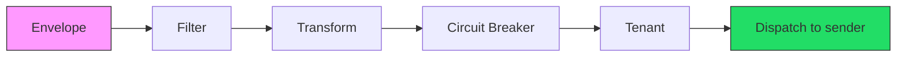
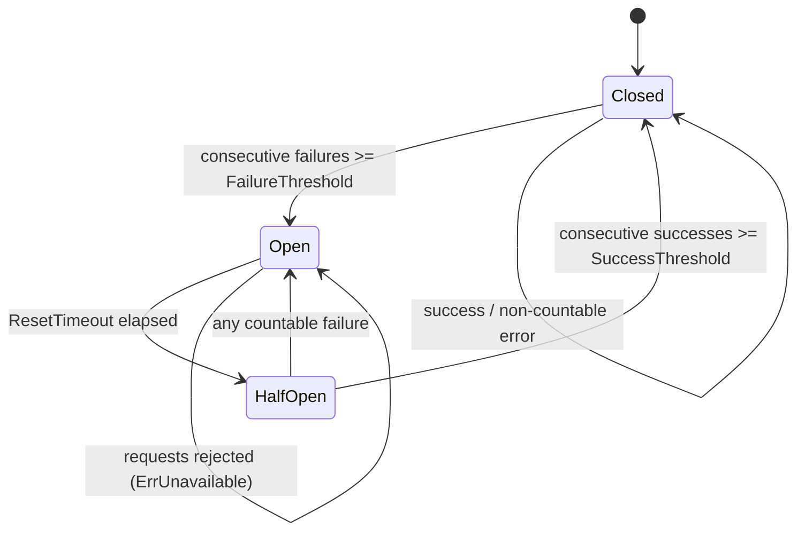

# Processors and Store Backends

This reference covers the GoBridge processor chain and the backing store
backends for lease coordination, outbox persistence, and dead-letter queuing.

## Processor Chain Overview

Processors are registered by name in Go and referenced from route definitions.
There is no top-level `processors:` config map — a processor's type and settings
are supplied when you construct it in Go (see [Programmatic Registration](#programmatic-registration));
the only processor-related YAML is the per-route `processors` list of registered names:

```yaml
routes:
  - id: my-route
    processors: [my-filter, my-transform, my-cb, my-tenant]
```

Every processor implements `ports.Processor`:

```go
type ProcessorFunc func(ctx context.Context, env *messaging.Envelope) error

type Processor interface {
    Name() string
    Process(ctx context.Context, env *messaging.Envelope, next ProcessorFunc) error
}
```

Processors execute as an **onion model** -- each wraps the next and calls
`next(ctx, env)` to continue the chain. A processor that does not call `next`
short-circuits the *remaining* chain successfully -- the envelope still
dispatches to the sender. Only returning an error stops dispatch; only
`shared.ErrMessageFiltered` marks an intentional drop (counted as
`MessagesFiltered`, settled `OnSettled(Terminal: true)`, acked, not a route
error).



---

## Filter Processor

**Package:** `processors/filter` | **Config type:** `filter.Config`

Evaluates conditions against the envelope and applies an action: pass the
message through, drop it, or reroute it.

### Configuration Fields

| Field | Type | Required | Description |
|-------|------|----------|-------------|
| `Name` | `string` | No | Unique processor instance name. Defaults to `"filter"`. |
| `Conditions` | `[]Condition` | Yes | List of conditions to evaluate (AND logic). |
| `Action` | `Action` | Yes | One of `pass`, `drop`, `route`. |
| `RouteTo` | `string` | Only when `Action` is `route` | Binding ID to dispatch to, declared on the same route. Overrides the route's normal binding resolution. Constructing a `route` filter with an empty `RouteTo` is a setup-time error (`ErrRouteRequired`). |
| `Invert` | `bool` | No | Inverts the combined condition result. |
| `MaxPayloadBytes` | `int` | No | Caps the JSON payload the filter will parse. Non-positive selects `DefaultMaxPayloadBytes`. |

**`RouteTo` must name a binding on the same route.** At delivery the runtime
consumes the `route` override and dispatches to it only when `RouteTo` matches a
binding **declared on the route** (a security check). A value that matches no
declared binding is **not** a hard error: the runtime logs a WARN (`route
override references unknown binding`) and falls back to the route's normal/default
resolution, so the message still flows -- it is not dropped. There is no
build-time validation that `RouteTo` matches a declared binding, so verify it
against the route's `bindings` and watch for that warn log.

### Condition Fields

| Field | Type | Description |
|-------|------|-------------|
| `Field` | `string` | Field to match against (see patterns below). |
| `Operator` | `Operator` | Comparison operator. |
| `Value` | `any` | Comparison value. |

**Field patterns:**

- `subject` -- matches `Envelope.Subject`
- `header.<key>` -- matches `Envelope.Headers["<key>"]`
- `$.<path>` -- dot-path traversal into JSON `Envelope.Payload`
- bare name -- falls back to `Envelope.Headers` lookup

**Operators:** `eq`, `ne`, `contains`, `regex`, `gt`, `lt`, `gte`, `lte`,
`exists`, `in`

### Go Example

A dropped message returns `shared.ErrMessageFiltered`, which the runtime
classifies as an intentional filter discard (counted as `MessagesFiltered`,
not a route error).

```go
proc, err := filter.New(filter.Config{
    Name: "my-filter",
    Action: filter.ActionDrop,
    Conditions: []filter.Condition{
        {Field: "header.x-env", Operator: filter.OperatorEquals, Value: "staging"},
        {Field: "$.priority", Operator: filter.OperatorLessThan, Value: 3},
    },
})

// Convenience constructors
drop, _ := filter.NewDropFilter("drop-staging", filter.Condition{...})
pass, _ := filter.NewPassFilter("only-prod", filter.Condition{...})
reroute, _ := filter.NewRouteFilter("reroute-high", "high-priority-binding", filter.Condition{...})
```

---

## Transform Processor

**Package:** `processors/transform` | **Config type:** `transform.Config`

Reshapes JSON payloads using JSONPath extraction and field mappings.

### Configuration Fields

| Field | Type | Default | Description |
|-------|------|---------|-------------|
| `Name` | `string` | `"transform"` | Unique processor instance name. |
| `Mappings` | `[]FieldMapping` | -- | Field transformation rules (required). |
| `DropUnmapped` | `bool` | `false` | Drop fields not covered by mappings. |
| `FailOnError` | `bool` | `false` | Fail the message on any transform error. |
| `MaxPayloadBytes` | `int` | `DefaultMaxPayloadBytes` | Caps the JSON payload this processor will parse. |

### FieldMapping Fields

| Field | Type | Description |
|-------|------|-------------|
| `Source` | `string` | JSONPath expression, e.g. `$.user.name` |
| `Target` | `string` | Target field in dot notation, e.g. `output.username` |
| `Transform` | `TransformType` | Type conversion (see below). Optional. |
| `DefaultValue` | `any` | Fallback value if source is not found. Optional. |
| `Required` | `bool` | Fail the message if this mapping cannot be resolved. |

**Transform types:** `string`, `int`, `float`, `bool`, `base64encode`,
`base64decode`

### Go Example

```go
proc, err := transform.New(transform.Config{
    Name:         "my-transform",
    DropUnmapped: true,
    Mappings: []transform.FieldMapping{
        transform.SimpleMapping("$.user.name", "username"),
        transform.TransformedMapping("$.user.age", "userAge", transform.TransformInt),
        {Source: "$.metadata.token", Target: "auth.token",
         Transform: transform.TransformBase64Encode, Required: true},
    },
})
```

When `DropUnmapped` is `false` (default), original payload fields are preserved
and mappings are applied on top. When `true`, only mapped fields appear in output.

---

## Circuit Breaker Processor

**Package:** `circuitbreaker` (standalone state machine) + `processors/circuitbreaker` (processor wrapper) | **Config type:** `circuitbreaker.Config`

Tracks downstream failures per key and short-circuits requests when a breaker
trips open, protecting the system from hammering a failing dependency.

### State Machine



### Configuration Fields

| Field | Type | Default | Description |
|-------|------|---------|-------------|
| `FailureThreshold` | `int` | `5` | Consecutive countable failures before opening. |
| `SuccessThreshold` | `int` | `2` | Consecutive successes in half-open to close. |
| `ResetTimeout` | `time.Duration` | `30s` | Time in open state before transitioning to half-open. |
| `HalfOpenMaxProbes` | `int` | `1` | Max concurrent probe requests allowed in half-open. |
| `CountError` | `ErrorClassifier` | counts transient errors | Function that returns true if an error should count toward the failure threshold. |

By default, only **transient (recoverable) errors** trip the breaker.
Permanent errors such as invalid payload or authentication failures are not
counted, preventing bad input from opening a breaker on a healthy dependency.

### Key Extraction Options

Circuit breakers are partitioned by key. The key extractor determines granularity:

| Option | Behavior |
|--------|----------|
| `WithKeyExtractor(GlobalKey)` | Single breaker for all messages (default). |
| `WithKeyExtractor(SubjectKey)` | Separate breaker per `Envelope.Subject`. |
| `WithKeyExtractor(HeaderKey("tenant-id"))` | Separate breaker per header value. |

> **Caution — untrusted keys.** Keying on a caller-controlled value (for example
> `HeaderKey` over an untrusted header) creates one breaker per distinct value.
> Only key on a header whose value space you trust and bound. The breaker
> *cache* is bounded by `WithMaxBreakers` (LRU eviction) and the metric `key`
> *dimension* is independently bounded (see [Metrics](#metrics)), so unique
> values cannot exhaust memory or explode metric cardinality — but they still
> fragment protection across many one-shot breakers, which is rarely intended.

### Go Example

The processor wrapper lives in `processors/circuitbreaker`; `Config`, `State`,
and `BreakerMetrics` come from the root `circuitbreaker` state-machine package,
so a program imports both and aliases one:

```go
import (
    cb "github.com/mariotoffia/gobridge/circuitbreaker"
    cbproc "github.com/mariotoffia/gobridge/processors/circuitbreaker"
)

proc := cbproc.New("my-cb", cb.Config{
    FailureThreshold:  10,
    SuccessThreshold:  3,
    ResetTimeout:      60 * time.Second,
    HalfOpenMaxProbes: 2,
},
    cbproc.WithKeyExtractor(cbproc.HeaderKey("tenant-id")),
    cbproc.WithOnStateChange(func(key string, from, to cb.State) {
        slog.Info("breaker state change", "key", key, "from", from, "to", to)
    }),
)
```

Each distinct key gets its own breaker instance, cached per-processor. The cache
is bounded by `WithMaxBreakers` (default 10000) with LRU eviction. This is a
**soft cap, not a hard memory bound**: eviction never drops a busy breaker
(entries with in-flight requests are skipped via in-flight pinning, so a
concurrent outcome is never lost to an orphan), so when the cache is full and
every eviction candidate is in-flight, the new breaker is inserted anyway and
`Stats().Size` temporarily exceeds `Stats().Capacity` by the number of
concurrently in-flight new keys. It self-corrects as those calls drain; route
`MaxInFlight` bounds the overshoot in practice. Size `WithMaxBreakers` for your
trusted key cardinality plus concurrency headroom. All evictions are counted in
`Stats().Evictions`; an eviction that drops an OPEN breaker additionally
increments `Stats().OpenEvictions` (the churn red-flag).
Generation tokens are unrelated to eviction -- they advance only on breaker
**state transitions**, which is what makes a late outcome recorded against a
previous circuit epoch stale (see `StaleOutcomes` below).

**Cluster semantics: per-instance state.** Breaker state is held per bridge
instance and never shared. A fleet of N instances needs up to
N × `FailureThreshold` failures before every breaker has tripped, and instances
open/close out of phase (independent cooldowns) -- the downstream sees
staggered probe traffic from the fleet, not one coordinated circuit.

### Metrics

Retrieve per-key metrics at runtime via `proc.Metrics()`, which returns
`map[string]cb.BreakerMetrics` with fields: `Key`, `State`, `TotalRequests`,
`TotalSuccesses`, `TotalFailures`, `ConsecutiveFailures`, `ConsecutiveSuccesses`,
`StaleOutcomes` (outcomes discarded because their generation token was stale),
and `LastFailureTime`.

The processor also emits the shared circuit-breaker counters through the
configured `WithMetrics` exporter: `CircuitBreakerStateChanged` and
`CircuitBreakerTrips` on transitions, and `CircuitBreakerRejections` when an
open breaker short-circuits a request. Each is tagged with the `processor` name
and a **bounded** `key` dimension.

**Bounded `key` cardinality.** Because a `KeyExtractor` can be
caller-controlled (`HeaderKey` over an untrusted header), tagging the raw key
verbatim would let one producer sending unique header values create an
unbounded number of metric series — a metrics-backend cost / throttling DoS
during the very outage the breaker should make observable. The `key` dimension
is therefore capped: the first `N` **distinct** keys are tagged verbatim (so a
trusted, bounded key space stays fully observable) and every further distinct
key collapses to the `other` bucket, bounding the dimension at `N+1` series
regardless of input. `N` defaults to 256 and is tunable with
`WithMetricKeyCardinality(n)` (non-positive keeps the default). This is
independent of `WithMaxBreakers`, which bounds the breaker *cache* (memory),
not the number of metric series. The default state-change log line and any
`WithOnStateChange` callback still receive the **raw** key — only the metric
dimension is bounded.

---

## Tenant Processor

**Package:** `processors/tenant` | **Config type:** `tenant.Config`

Validates tenant identity and tracks per-tenant usage. Reads the tenant ID
from a configurable header (default: `x-tenant-id`).

### Configuration Fields

| Field | Type | Default | Description |
|-------|------|---------|-------------|
| `Name` | `string` | `"tenant"` | Unique processor instance name. |
| `TenantHeader` | `string` | `"x-tenant-id"` | Header name containing the tenant ID. A reserved `x-bridge.*` header is rejected. |
| `RequireTenant` | `bool` | `false` | Reject messages that lack a tenant header. |
| `InFlightDecrementTimeout` | `time.Duration` | `2s` | Timeout used to decrement the in-flight counter after a cancelled delivery. |

### Optional Integrations (Go Only)

| Option | Interface | Purpose |
|--------|-----------|---------|
| `WithValidator(v)` | `ports.TenantValidator` | Resolves `TenantInfo`: active check, the `MaxMessageSizeBytes` limit, and the `MaxInFlight` quota ceiling. |
| `WithUsageTracker(t)` | `ports.TenantUsageTracker` | In-flight and processed-message counters. Increment-only, so observational by default; a tracker that also implements `ports.TenantUsageReader` enables the in-flight ceiling (see [Quota enforcement](#quota-enforcement)). |

### Go Example

```go
proc, err := tenant.New(tenant.Config{
    Name:          "my-tenant",
    TenantHeader:  "x-tenant-id",
    RequireTenant: true,
},
    tenant.WithValidator(myTenantValidator),
    tenant.WithUsageTracker(myUsageTracker),
)
```

When a validator is set, the processor rejects inactive tenants and payloads
exceeding `TenantInfo.MaxMessageSizeBytes`. When a usage tracker is set,
in-flight counts are managed around dispatch and successful deliveries increment
the message counter. An increment-only tracker is observational; one that
also implements `ports.TenantUsageReader` enables the in-flight ceiling
described below. Message-count quotas stay unenforced (Phase 2).

### Tenant identity resolution and trust boundary

**The tenant header is caller-supplied and unauthenticated.** The resolver reads
the tenant ID from the configured header and closes a present-but-non-string type
trap (see numeric coercion below); it does **not** authenticate the value. Treat
tenant identity as untrusted unless a `WithValidator` authenticates it -- for
example by checking the header against a signed claim carried on the same message.
Without a validator, any producer that can reach the receiver can assert any
tenant ID. Whether an inbound `tenant-id` header survives ingress at all is a
separate control -- see `trust_bridge_headers` in the
[Routes reference](routes-and-runtime-reference.md).

**An absent or empty header fails open by default.** When the header is absent or
an empty string, the message proceeds *untenanted* under the default
`RequireTenant: false` -- it bypasses tenant validation and quota enforcement
entirely. Set `RequireTenant: true` to reject a message that carries no tenant ID:
it fails with `ErrInvalidPayload` ("tenant ID required") and the `TenantRejects`
counter records reason `missing_required`. Where tenant enforcement is a security
control rather than a fairness one, set `RequireTenant: true` -- the default lets
an unlabeled message through.

**Numeric tenant IDs are coerced, with a precision ceiling.** A tenant header
stamped as an integer by a typed transport (`int` / `int64` / `uint32` from AMQP
or MQTTv5), or rehydrated as an integral `float64` by a JSON round-trip -- a
DLQ/outbox save-load, since `encoding/json` decodes every JSON number as
`float64` -- is coerced to its decimal string. A fractional, non-finite
(`NaN` / `±Inf`), or out-of-range (`|value| > 2^53`) numeric value is rejected as
malformed (`ErrInvalidPayload`, `TenantRejects` reason `malformed`), never
treated as "no tenant". A numeric tenant ID larger than 2^53 cannot survive a
DLQ/outbox JSON round-trip -- it loses precision and is rejected on redrive. Use
**string** tenant IDs for large or opaque identifiers.

### Quota enforcement

The tenant processor can enforce a per-tenant ceiling on concurrent in-flight
deliveries. It stays off unless two conditions hold together:

- **Capability** — the tracker passed to `WithUsageTracker` also implements
  `ports.TenantUsageReader`, the optional read-back extension of
  `ports.TenantUsageTracker`: `Usage(ctx, tenantID) (TenantUsage, error)`,
  returning a `{Messages, InFlight}` snapshot.
- **Data** — the tenant's `TenantInfo.MaxInFlight` is greater than `0` (`0`
  means unlimited, matching the `MaxMessageSizeBytes` convention).

There is no YAML for the ceiling. `TenantInfo`, `MaxInFlight` included, comes
from the embedder's `TenantValidator`, so nothing changes until a validator
returns a ceiling and the tracker implements the reader. An increment-only
tracker, or a zero ceiling, leaves delivery unchanged — the feature is backward
compatible.

When both conditions hold, the processor reads `Usage` before it increments the
in-flight counter. If `InFlight` is at or above `MaxInFlight`, the delivery is
rejected with the transient error `TENANT_QUOTA_EXCEEDED`
(`shared.ErrTenantQuotaExceeded`) and the `TenantRejects` counter records reason
`quota_inflight`. The rejection is transient by design: an over-quota tenant
becomes deliverable again the moment its in-flight count drains, so the route
retry policy — backoff, then DLQ only on exhaustion — is the pressure valve, not
a permanent drop.

**Retry and DLQ tail.** Because the reject is transient, an over-quota delivery
re-enters the route's normal retry pipeline (backoff-driven redelivery), not a
drop. A tenant that stays over its ceiling longer than `MaxReplayAttempts`
backoff cycles has its messages sunk to the DLQ as poison — error code
`POISON_MESSAGE` (`shared.ErrCodePoisonMessage`), DLQ category `max_retries` — so
valid-but-throttled messages are indistinguishable there from genuinely poison
ones. On source transports without delayed-retry support, with a DLQ store
configured, a single quota reject routes straight to the DLQ under category
`retry_unsupported`, with no backoff wait. Size `MaxReplayAttempts` and backoff
for the throttle duration you are willing to tolerate before shedding to the DLQ,
and note that throttled-shed is not currently labeled separately from poison in
the DLQ.

**Fail-open on read error.** When `Usage` returns an error — a usage-store
outage, say — the processor logs a warning, counts it, and proceeds without
enforcing. The quota is a fairness control, not a security boundary; failing
closed would turn a usage-store blip into a full-tenant outage.

**Overshoot bound.** The read and the increment are not atomic, so concurrent
deliveries can each read `InFlight = MaxInFlight - 1` and all pass. The in-flight
counter is per-tenant, but routing is tenant-agnostic — routes match on
subject/binding, not tenant — so a single tenant's traffic spans multiple routes,
each with its own concurrency semaphore, and a shared usage store spans instances
as well. Overshoot is bounded by the tenant's total concurrent in-flight
admissions across every route and instance sharing the usage store, not by one
route's `MaxInFlight`. Acceptable for a fairness quota; exact ceilings would
require a conditional-increment port method, a recorded upgrade path rather than
current behavior.

**The in-flight window depends on the route's delivery mode.** The processor
brackets each delivery with one `+1` on admission and one paired `-1` on release
(exactly one pair per message either way). The release fires when the whole
delivery settles, so what the ceiling bounds differs by `ack_after` /
delivery mode:

- **`direct_hold`** (`ack_after: target_accept`) — the source is held open until
  egress completes, so the release spans the synchronous egress send. The ceiling
  bounds concurrent **egress**.
- **`shared_outbox`** (`ack_after: outbox_persist`) — the processor chain runs
  once at ingress and the outbox drainer never re-runs it; the release fires at
  the ingress-ack (outbox-persist), while the message still sits in the outbox
  awaiting drain and egress. The ceiling bounds **ingress-processing**
  concurrency (ingress + outbox-persist), **not** concurrent egress.

Size `MaxInFlight` for what it bounds on the route in question: an outbox-backed
route releases the slot before the message leaves.

**A shared usage store must decay crashed in-flight counts (hard contract).** The
ceiling works by the `+1` / `-1` pair above; the `-1` runs from a delivery-scope
release hook (best-effort). If the process crashes between the `+1` and its paired
`-1` — `kill -9`, OOM, hardware loss — a shared or external usage store keeps a
stale `+1`. Enough leaks and the tenant's effective ceiling shrinks until it is
throttled permanently (`InFlight` stays `>= MaxInFlight` with no path back to
deliverable). A conforming shared usage store therefore **must** make the counter
decay: either model each `+1` as a **TTL-leased** item the store auto-expires (a
crashed instance's counts decay on their own), or implement the optional
`ports.TenantUsageReconciler` so a survivor reaps stranded counts on restart /
lease takeover. A plain additive shared counter with no decay is **not** a
conforming usage store. A per-instance / in-memory tracker is exempt — its counts
die with the process. This release ships the enforcement (`-1` release), the
documented contract, and the `ports.TenantUsageReconciler` interface, but no
built-in reconciliation — decay is the operator's responsibility. See the
in-flight crash-decay contract in `ports/tenant.go` and the
[deployment guide](deployment-guide.md#shared-tenant-usage-store).

Windowed message-count quotas (per hour or day) are Phase 2. They need windowed
counter schemas and cross-instance aggregation — the same
per-instance-versus-global question the
[circuit breaker](#circuit-breaker-processor) already answers with per-instance
state.

---

## Store Backends

Four store roles handle different coordination concerns, each configured
independently in the `stores` section.

| Role | Interface | Purpose |
|------|-----------|---------|
| **Lease** | `ports.LeaseStore` | Distributed lease acquisition for exclusive sessions. |
| **Outbox** | `ports.OutboxStore` | Durable outbox for at-least-once delivery with shared sessions. |
| **DLQ** | `ports.DLQStore` | Dead-letter queue for permanently failed messages. |
| **Managed subscriptions** | `ports.ManagedSubscriptionStore` | Durable exact MQTT filter history for persistent/exclusive sessions. |

### YAML Structure

```yaml
stores:
  lease:
    type: memory
    options:
      # Required for the in-memory lease: it keeps ownership per-process and
      # cannot coordinate across replicas, so single-replica operation must be
      # explicitly acknowledged. Use dynamodb for clustered deployments.
      acknowledge_single_replica: true
  outbox:
    type: sqlite
    options:
      path: /data/outbox.db
  dlq:
    type: dynamodb
    options:
      table_name: my-dlq-table
```

### Memory Store

- **Type:** `memory`
- **Options:** none
- In-process only. Not distributed. Data lost on restart.
- Suitable for development and single-instance setups without durability needs.

### SQLite Store

- **Type:** `sqlite`
- **Required option:** `path` (string) -- file path for the database
- **Optional options:**

| Option | Type | Default | Description |
|--------|------|---------|-------------|
| `stale_claim_duration` | duration | runtime-derived | Outbox only -- same semantics as the DynamoDB row below. |
| `retention` | duration | `1h` outbox / disabled DLQ | One key, per-role default. **Outbox:** window completed/expired rows are kept before piggybacked compaction deletes them; negative disables compaction (rows kept forever). Keep it above any upstream redelivery window. **DLQ:** a positive value opts the DLQ into a throttled purge of entries older than the window; zero/unset (the default) keeps every entry forever. |

- Persistent across restarts. Single-instance only.
- Suitable for single-instance production with disk durability.
- WAL journalling is always on; a single writer connection plus `busy_timeout` serialises in-process writers safely. Managed-subscription databases enforce `0600` on the database/WAL/SHM, create owned parent directories as `0700`, and reject insecure existing files or symlinks.
- Outbox honours the runtime-derived `stale_claim_duration`: a claim stranded by a crashed owner is reclaimed once it goes stale (in addition to immediate higher-version reclaim). Pair it with a durable lease store for strict multi-restart crash recovery; `memory` lease resets its fencing version on restart.
- No SQLite lease store exists -- use memory or DynamoDB for leases.

**Fatal storage faults are a distinct alertable signal.** A disk-full, corrupt,
read-only, or not-a-database fault is classified PERMANENT and increments the
`SQLiteStoreUnhealthy` counter (Go const `sqliteoutbox.MetricStoreUnhealthy`),
tagged `entity=outbox`, alongside an error log. It is distinct from transient
throttling noise: retrying will not clear it -- the fix is to free disk or restore
the file. The classification does **not** halt the drain loop; the loop keeps
polling and records stay durable, so the counter exists purely for
observability. Watch it (see
[Monitoring](aws-deployment/monitoring.md#key-metrics)) rather than inferring the
fault from a stalled queue.

**Legacy databases are rebuilt once on open.** A legacy SQLite outbox carrying the
old global `UNIQUE` constraint is transparently rebuilt one time, on open, to the
partition-scoped outbox identity. The rebuild runs in a single transaction: it
holds the writer lock and roughly doubles WAL size for its duration. On a very
large backlogged legacy outbox this is a noticeable one-time startup pause, and a
second process opening the same file concurrently can exceed the 5s `busy_timeout`
and fail to open. Pre-drain or compact a huge legacy outbox before upgrading if
the startup pause matters; the store is single-process by charter, so the
concurrent-opener case is rare. A modern or fresh database skips the rebuild
entirely.

### DynamoDB Store

- **Type:** `dynamodb`
- **Options:**

| Option | Type | Default | Description |
|--------|------|---------|-------------|
| `table_name` | `string` | `"gobridge-leases"` / `"gobridge-outbox"` / `"gobridge-dlq"` / `"gobridge-managed-subscriptions"` | DynamoDB table name (per role). |
| `stale_claim_duration` | `string` (duration) | runtime-derived (outbox only) | How long before an uncompleted outbox claim is reclaimed. Explicit value wins; when omitted, derived as `maxStepDownGrace + max(2 × maxStepDownGrace, 15s)` across all sessions (see [Configuration Reference](configuration-reference.md)). Failover reclaim via a higher fencing version is always immediate. |
| `compaction_grace` | duration | store default (`1h`) | Outbox only -- window terminal items are kept before the DynamoDB item TTL deletes them. |
| `retention` | duration | none (keep forever) | DLQ only -- TTL on dead-letter entries (`failed_at + retention`). |
| `max_scan_pages` | int | `100` | DLQ only -- bounds index-less List/Purge scans; negative disables. |
| `operation_timeout` | duration | `5s` | Managed subscriptions only -- adapter-owned deadline for each DynamoDB call. |

- Distributed and persistent. Uses conditional writes for fencing safety.
- Required for clustered deployments with lease-based coordination.
- **Boot-time schema preflight.** Each store validates its table key schema at
  build time. A confirmed schema mismatch is fatal at boot; a `DescribeTable`
  call that cannot verify the table (missing IAM permission, throttle, or backend
  gap) also fails closed. The lease role additionally requires
  `DescribeTimeToLive` and fails closed unless TTL is verified disabled on the
  fencing table. See
  [IAM Least Privilege](aws-deployment/overview.md#iam-least-privilege) for the
  exact actions and posture.
- **Retention is the deduplication window.** The outbox keeps completed and
  expired rows for `retention` / `compaction_grace` before piggybacked compaction
  (or the DynamoDB item TTL) deletes them. Deleting a terminal row releases its
  duplicate-detection identity, so retention IS the duplicate-suppression cover:
  shrinking it shrinks how far back the outbox can suppress a redelivered
  message. Keep it comfortably above any upstream redelivery window.

> **Embedder-only knobs.** Some store options are programmatic by design and
> have no YAML key: `WithClock`, `WithLogger` (all stores); `WithMetrics`,
> `WithCompleteResolveRetry` (dynamodboutbox); `WithGracePeriod` (deprecated
> alias of `WithRetention`, both DynamoDB stores); and every
> `memoryoutbox`/`memorydlq` option (dev store). `WithMaxReplayCount` no longer
> exists -- the store-side replay cap was removed; poison detection is
> drainer-owned per the `ports.OutboxStore` contract.

### Outbox Replay Budget

Poison needs all three: the replay count past `max_replay_attempts`, a non-zero
first-attempt timestamp, and `replay_budget` elapsed since that first attempt:

| Field | Type | Default | Description |
|-------|------|---------|-------------|
| `replay_budget` | duration | `15m` | Route policy field. Wall-clock budget from a record's first delivery attempt, bounding total redelivery time before poison. `max_replay_attempts` is the attempt floor; `replay_budget` is the time, so a transient egress outage shorter than the budget never poisons a healthy record. |

The first attempt is stored per record: SQLite adds a `first_attempted_at`
column (Unix millis, `0` = zero) via an idempotent migration and the
`CREATE TABLE` DDL; DynamoDB writes a per-item `first_attempted_at` attribute,
omitted when zero. Values absent before this schema read as zero and fall back
to the older `CreatedAt` age gate, so an upgrade never poisons a backlog.

### Decision Table

| Scenario | Lease | Outbox | DLQ |
|----------|-------|--------|-----|
| Development / testing | `memory` | `memory` | `memory` |
| Production, single instance | -- | `sqlite` | `sqlite` |
| Production, clustered | `dynamodb` | `dynamodb` | `dynamodb` |

**Important:** In clustered deployment mode, the builder rejects non-distributed
stores for all configured roles. Memory and SQLite stores are process-local and
will fail validation when `deployment_mode: clustered` is set.

---

## Programmatic Registration

Register processors and store factories on the `bridge.Builder` before
calling `Build()`:

```go
builder := bridge.NewBuilder(cfg, bridge.WithLogger(logger))

// Register processors
filterProc, _ := filter.New(filter.Config{
    Name: "my-filter", Action: filter.ActionDrop,
    Conditions: []filter.Condition{
        {Field: "header.x-env", Operator: filter.OperatorEquals, Value: "staging"},
    },
})
builder.RegisterProcessor("my-filter", filterProc)

transformProc, _ := transform.New(transform.Config{
    Name: "my-transform",
    Mappings: []transform.FieldMapping{transform.SimpleMapping("$.user.name", "username")},
})
builder.RegisterProcessor("my-transform", transformProc)

cbProc := cbproc.New("my-cb", cb.Config{
    FailureThreshold: 10, ResetTimeout: 60 * time.Second,
}, cbproc.WithKeyExtractor(cbproc.SubjectKey))
builder.RegisterProcessor("my-cb", cbProc)

tenantProc, _ := tenant.New(tenant.Config{Name: "my-tenant", RequireTenant: true})
builder.RegisterProcessor("my-tenant", tenantProc)

// Register store factories
builder.RegisterStoreFactory("memory", nativestore.NewMemoryStoreFactory())
builder.RegisterStoreFactory("sqlite", nativestore.NewSQLiteStoreFactory())
builder.RegisterStoreFactory("dynamodb", awsstore.NewDynamoDBStoreFactory(ddbClient))

rt, err := builder.Build(ctx)
```

Processor names in the YAML `processors` list must match the names passed to
`RegisterProcessor`. If a name is not found, the builder returns an error.
