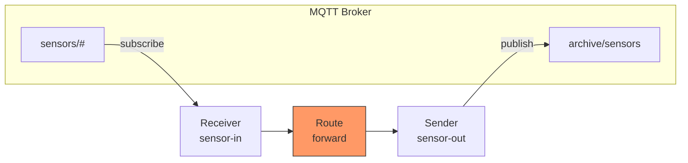
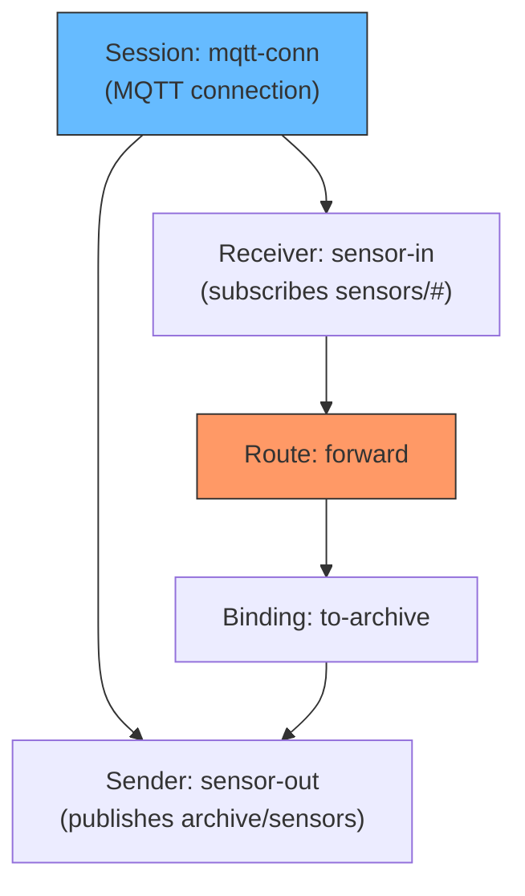

# Scenario 1: MQTT-to-MQTT Bridge

The simplest GoBridge configuration -- forward messages from one MQTT topic to another on the same broker.

## Use Case

You have sensor devices publishing to `sensors/#` and need those messages forwarded to `archive/sensors` for a downstream consumer. Both topics live on the same MQTT broker.

## Architecture



## Configuration

```yaml
bridge:
  id: mqtt-forwarder

sessions:
  - id: mqtt-conn
    transport: mqtt
    options:
      session:
        broker_url: tcp://localhost:1883
        client_id: mqtt-forwarder-01

receivers:
  - id: sensor-in
    session_id: mqtt-conn
    topics:
      - topic: "sensors/#"
        qos: 1

senders:
  - id: sensor-out
    session_id: mqtt-conn
    options:
      sender:
        default_topic: archive/sensors
        qos: 1

bindings:
  - id: to-archive
    sender_id: sensor-out
    address: archive/sensors

routes:
  - id: forward
    receiver_id: sensor-in
    delivery_mode: direct_hold
    dispatch_mode: single
    bindings: [to-archive]
```

## Config Walkthrough

### `bridge`
- **`id: mqtt-forwarder`** -- Identifies this bridge instance. Required.

### `sessions`
- **`transport: mqtt`** -- Uses the MQTT (Paho) transport adapter.
- **`options.session`** -- Connection settings group under a `session` key.
- **`broker_url`** -- Single broker endpoint. Use `broker_urls` for a list.
- **`client_id`** -- Must be unique per MQTT connection. If two bridges connect with the same client_id, the broker disconnects one.
- Session mode defaults to **`ephemeral`** (clean session), which suits a simple forwarder.

### `receivers`
- **`session_id: mqtt-conn`** -- Shares the MQTT connection defined above. No need to repeat `transport`.
- **`topics`** -- Subscribes to `sensors/#` (wildcard) at QoS 1 (at-least-once delivery).

### `senders`
- **`options.sender`** -- Sender settings group under a `sender` key.
- **`default_topic`** -- All messages published to this topic unless overridden by the binding address.
- **`qos: 1`** -- Publish with QoS 1.

### `bindings`
- **`sender_id: sensor-out`** -- Links to the sender above.
- **`address: archive/sensors`** -- The target MQTT topic.

### `routes`
- **`delivery_mode: direct_hold`** -- The source message is held open until the sender confirms delivery. Simple and synchronous.
- **`dispatch_mode: single`** -- Send to one binding (we only have one).
- **`bindings: [to-archive]`** -- References the binding by ID.

### What's Omitted
- No `stores` -- `direct_hold` doesn't need an outbox or lease store.
- No `processors` -- No filtering, transforming, or circuit breaking.
- No `http` -- No admin API needed for this simple setup.
- No `config_watch` -- No dynamic reconfiguration.

## Component Relationship



Both receiver and sender share the same MQTT session (connection). This is efficient -- one TCP connection handles both subscribe and publish.

## Go Bootstrap

```go
package main

import (
    "context"
    "github.com/mariotoffia/gobridge/bridge"
    "github.com/mariotoffia/gobridge/config"
    "github.com/mariotoffia/gobridge/adapters/mqtt/transport/paho"
)

func main() {
    cfg, _ := config.ParseFile("bridge.yaml", config.FormatAuto)

    rt, _ := bridge.NewBuilder(cfg).
        RegisterTransport("mqtt", paho.NewFactory(nil)).
        Build(context.Background())

    ctx, cancel := context.WithCancel(context.Background())
    defer cancel()

    rt.Start(ctx)
    // ... wait for signal ...
    rt.Stop(ctx)
}
```

## Variations

### Adding TLS

```yaml
sessions:
  - id: mqtt-conn
    transport: mqtt
    options:
      session:
        broker_url: tls://mqtt.example.com:8883
        client_id: mqtt-forwarder-01
        tls:
          enable: true
          ca_cert_file: /etc/certs/ca.pem
          cert_file: /etc/certs/client.crt
          key_file: /etc/certs/client.key
```

### Using a Persistent Session

Preserves subscriptions across reconnections:

```yaml
sessions:
  - id: mqtt-conn
    transport: mqtt
    session_mode: persistent
    options:
      session:
        broker_url: tcp://localhost:1883
        client_id: mqtt-forwarder-01
        clean_start: false
        session_expiry_interval: 3600  # 1 hour
```

### Multiple Subscriptions

```yaml
receivers:
  - id: sensor-in
    session_id: mqtt-conn
    topics:
      - topic: "sensors/temperature/#"
        qos: 1
      - topic: "sensors/humidity/#"
        qos: 0
      - topic: "alerts/+"
        qos: 2
```

### Higher QoS

For exactly-once semantics (QoS 2):

```yaml
senders:
  - id: sensor-out
    session_id: mqtt-conn
    options:
      sender:
        default_topic: archive/sensors
        qos: 2
        retain: true  # broker retains last message
```

Note: QoS 2 gives exactly-once only *within* a continuous MQTT session. The
bridge keeps in-flight QoS 2 state (the PUBREL/PUBCOMP handshake) in an
in-memory packet store, so a bridge restart or crash mid-handshake can duplicate
or lose the egress message despite QoS 2. For durable end-to-end exactly-once,
pair QoS 2 with a downstream idempotency or dedup mechanism.
